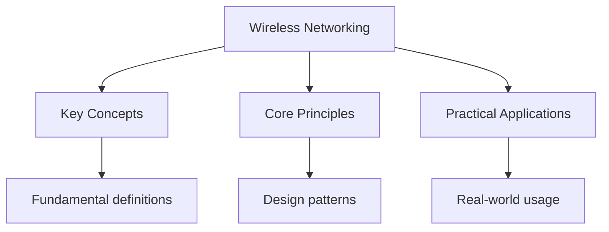

---

title: "Wireless Networking - Wyatt's Notes"
description: "\"itemListElement\": [{\"name\": \"Home\", \"url\": \"https://wyattau.com\"}, {\"name\": \"networking\", \"url\": \"https://networking.wyattau.com\"}, {\"name\": \"09 Wireless\","
date: 2026-04-08T00:00:00.000Z
tags:
  - Networking
categories:
  - Networking
---

<!-- Breadcrumb Schema for SEO -->
<script type="application/ld+json">
{
  "@context": "https://schema.org",
  "@type": "BreadcrumbList",
  "itemListElement": [{"name": "Home", "url": "https://wyattau.com"}, {"name": "networking", "url": "https://networking.wyattau.com"}, {"name": "09 Wireless", "url": "https://networking.wyattau.com/09-wireless"}, {"name": "Wireless Networking", "url": "https://networking.wyattau.com/09-wireless/wireless-networking"}]
}
</script>

## RF Fundamentals

### Electromagnetic Waves

Wireless networking uses radio frequency (RF) electromagnetic waves to carry data. The fundamental
Properties of an RF wave are:

- **Frequency ($f$):** Number of complete wave cycles per second, measured in Hertz (Hz). Wi-Fi
  operates in the 2.4 GHz ($2.4 \times 10^9$ Hz) and 5 GHz ($5 \times 10^9$ Hz) bands.
- **Wavelength ($\lambda$):** The physical distance between two consecutive wave peaks. Related to
  frequency by the speed of light:

$$
\lambda = \frac{c}{f}
$$

Where $c = 3 \times 10^8$ m/s (speed of light in a vacuum).

For 2.4 GHz Wi-Fi:
$\lambda = \frac{3 \times 10^8}{2.4 \times 10^9} = 0.125\mathrm{ m = 12.5\mathrm{ cm$

For 5 GHz Wi-Fi: $\lambda = \frac{3 \times 10^8}{5 \times 10^9} = 0.06\mathrm{ m = 6\mathrm{ cm$

- **Amplitude:** The strength or height of the wave. Higher amplitude corresponds to a stronger
  signal.
- **Phase:** The position of a wave in its cycle relative to a reference point. Phase shifts are
  critical in MIMO systems, where multiple signals must be combined coherently.

### Decibel Scale

RF engineers use the decibel (dB) scale because it makes calculations involving very large or very
Small numbers more manageable. The decibel is a logarithmic ratio:

$$
\mathrm{dB = 10 \cdot \log_{10}\left(\frac{P_2}{P_1}\right)
$$

| Unit | Meaning                                     | Reference                |
| ---- | ------------------------------------------- | ------------------------ |
| dB   | Ratio of two power levels                   | $P_2 / P_1$              |
| dBm  | Absolute power level                        | 1 mW                     |
| dBi  | Antenna gain relative to isotropic radiator | Theoretical point source |
| dBd  | Antenna gain relative to half-wave dipole   | Dipole antenna           |

Common dBm values:

| Power  | dBm    |
| ------ | ------ |
| 1 mW   | 0 dBm  |
| 10 mW  | 10 dBm |
| 100 mW | 20 dBm |
| 1 W    | 30 dBm |
| 4 W    | 36 dBm |

**Free Space Path Loss (FSPL):** The signal attenuation over distance in free space:

$$
\mathrm{FSPL (dB) = 20 \cdot \log_{10}(d) + 20 \cdot \log_{10}(f) + 20 \cdot \log_{10}\left(\frac{4\pi}{c}\right)
$$

For a simplified calculation at common Wi-Fi frequencies:

$$
\mathrm{FSPL_{2.4\mathrm{GHz} = 40.05 + 20 \cdot \log_{10}(d)
$$

$$
\mathrm{FSPL_{5\mathrm{GHz} = 47.86 + 20 \cdot \log_{10}(d)
$$

Where $d$ is the distance in meters.

<details>
<summary>Worked example: link budget calculation</summary>

Calculate the received power for a 2.4 GHz link at 100 meters.

Given:

- Transmit power: 20 dBm (100 mW)
- Transmit antenna gain: 6 dBi
- Distance: 100 m

FSPL at 2.4 GHz, 100 m:

$$
\mathrm{FSPL = 40.05 + 20 \cdot \log_{10}(100) = 40.05 + 40 = 80.05\mathrm{ dB
$$

Received power (assuming 0 dBi receive antenna):

$$
P_{rx} = P_{tx} + G_{tx} - \mathrm{FSPL + G_{rx} = 20 + 6 - 80.05 + 0 = -54.05\mathrm{ dBm
$$

This is a strong signal. Most Wi-Fi clients can operate down to approximately -75 dBm for basic
Connectivity and -65 dBm for good throughput.

</details>

### SNR and SINR

**Signal-to-Noise Ratio (SNR)** is the difference between the received signal power and the noise
Floor:

$$
\mathrm{SNR (dB) = P_{\mathrm{signal} - P_{\mathrm{noise}
$$

A higher SNR means better signal quality. Typical Wi-Fi requirements:

| SNR (dB) | Quality     | Maximum MCS |
| -------- | ----------- | ----------- |
| $\lt$ 5  | Unusable    | --          |
| 5 -- 10  | Very poor   | MCS 0-1     |
| 10 -- 15 | Poor        | MCS 2-3     |
| 15 -- 20 | Fair        | MCS 4-7     |
| 20 -- 25 | Good        | MCS 8-15    |
| 25 -- 40 | Excellent   | MCS 16-23   |
| $\gt$ 40 | Outstanding | Maximum     |

**Signal-to-Interference-plus-Noise Ratio (SINR)** adds interference from other wireless devices to
The noise floor. In dense environments, interference often dominates over thermal noise.

## 802.11 Standards Evolution

| Standard | Wi-Fi Gen  | Year      | Freq (GHz) | Max PHY Rate | Modulation      | Max MIMO | Channel BW           |
| -------- | ---------- | --------- | ---------- | ------------ | --------------- | -------- | -------------------- |
| 802.11b  | Wi-Fi 1    | 1999      | 2.4        | 11 Mbps      | DSSS/CCK        | 1x1      | 22 MHz               |
| 802.11a  | Wi-Fi 2    | 1999      | 5          | 54 Mbps      | OFDM            | 1x1      | 20 MHz               |
| 802.11g  | Wi-Fi 3    | 2003      | 2.4        | 54 Mbps      | OFDM/DSSS       | 1x1      | 20 MHz               |
| 802.11n  | Wi-Fi 4    | 2009      | 2.4/5      | 600 Mbps     | OFDM            | 4x4      | 20/40 MHz            |
| 802.11ac | Wi-Fi 5    | 2013      | 5          | 6.93 Gbps    | OFDM (256-QAM)  | 8x8      | 20/40/80/160 MHz     |
| 802.11ax | Wi-Fi 6/6E | 2020/2021 | 2.4/5/6    | 9.6 Gbps     | OFDMA, 1024-QAM | 8x8      | 20/40/80/160 MHz     |
| 802.11be | Wi-Fi 7    | 2024      | 2.4/5/6    | 46 Gbps      | 4096-QAM, MLO   | 16x16    | 20/40/80/160/320 MHz |

### Key Improvements by Generation

**802.11n (Wi-Fi 4):** Introduced MIMO (Multiple Input Multiple Output), channel bonding (40 MHz),
And frame aggregation (A-MPDU, A-MSDU). These dramatically improved throughput and efficiency.

**802.11ac (Wi-Fi 5):** Added wider channels (80/160 MHz), MU-MIMO (Multi-User MIMO) for downlink
Only, 256-QAM modulation (8 bits per symbol), and explicit beamforming.

**802.11ax (Wi-Fi 6/6E):** Introduced OFDMA (Orthogonal Frequency Division Multiple Access) for
Efficient multi-user operation in both directions, BSS Coloring to reduce co-channel interference,
1024-QAM, Target Wake Time (TWT) for IoT battery savings, and 6 GHz band support (Wi-Fi 6E).

**802.11be (Wi-Fi 7):** Adds Multi-Link Operation (MLO) for simultaneous use of multiple bands,
4096-QAM (12 bits per symbol), wider channels up to 320 MHz, and multi-resource units (MRU) for
Flexible OFDMA scheduling.

### Theoretical vs Actual Throughput

The PHY rate in the table above is the raw physical layer rate. Actual application-layer throughput
Is significantly lower due to:

- 802.11 overhead: interframe spacing, ACKs, headers
- Half-duplex nature: only one station transmits at a time
- MAC-layer contention: CSMA/CA backoff
- Protocol overhead: TCP/IP headers, application framing

A rough rule of thumb: actual throughput is approximately 50-70% of the PHY rate for TCP traffic.

<details>
<summary>Worked example: 802.11ac throughput estimate</summary>

An 802.11ac access point operating on an 80 MHz channel with 3 spatial streams and 256-QAM achieves
A PHY rate of approximately 1300 Mbps.

Estimated TCP throughput:

$$
1300 \mathrm{ Mbps \times 0.6 \approx 780 \mathrm{ Mbps
$$

This is the best-case single-client throughput. With multiple clients, the available airtime is
Shared, reducing per-client throughput proportionally.

</details>

## Wi-Fi Architecture

### BSS, ESS, and DS

- **Basic Service Set (BSS):** The fundamental building block. A BSS consists of a single access
  point (AP) and all wireless clients associated with it. The BSS has a unique identifier called the
  BSSID, which is the MAC address of the AP"s wireless interface.
- **Extended Service Set (ESS):** Multiple BSSs connected by a Distribution System (DS) -- a wired
  Ethernet backbone. All BSSs in an ESS share the same SSID (network name) and appear as a single
  network to clients.
- **Distribution System (DS):** The wired (or wireless) backbone that connects APs within an ESS. It
  carries traffic between APs and to the network infrastructure (routers, switches, servers).

### Infrastructure Mode vs Ad-Hoc Mode

**Infrastructure mode:** Clients communicate through an AP. This is the standard mode for virtually
All enterprise and home Wi-Fi deployments. The AP manages the BSS, handles authentication, and
Bridges traffic between wireless clients and the wired network.

**Ad-hoc mode (IBSS -- Independent BSS):** Clients communicate directly with each other without an
AP. Ad-hoc networks are rare in production. They are used for temporary file sharing, gaming, or
Emergency communication. No central management, no roaming support, and limited scalability.

### Thin APs vs Fat APs

**Fat AP (Autonomous AP):** The AP runs the full wireless protocol stack, handles all management
Functions (authentication, roaming, RF management), and makes independent decisions. Configuration
Is done on each AP individually. Scaling beyond a few APs becomes operationally burdensome.

**Thin AP (Lightweight AP):** The AP handles only the real-time 802.11 MAC layer functions. All
Management, configuration, and policy decisions are made by a Wireless LAN Controller (WLC). The AP
Communicates with the controller using CAPWAP (Control and Provisioning of Wireless Access Points)
Or the older LWAPP protocol.

Advantages of thin AP architecture:

1. **Centralized management.** Configure hundreds of APs from a single controller.
2. **Consistent policy.** All APs enforce the same security, QoS, and configuration.
3. **Seamless roaming.** The controller coordinates client handoffs between APs.
4. **Simplified firmware updates.** Update all APs from the controller.
5. **RF management.** The controller can adjust power levels and channels to optimize coverage and
   minimize interference.

### CAPWAP

CAPWAP (RFC 5415) defines the protocol between a WLC and its APs. It runs over UDP:

- **Control channel:** UDP port 5246 -- carries management messages (configuration, firmware
  updates, statistics).
- **Data channel:** UDP port 5247 -- carries encapsulated client data frames.

CAPWAP can operate in native (Layer 2) or tunnel (Layer 3) mode. In Layer 3 mode, the CAPWAP packets
Are routed through the IP network, allowing the controller to be anywhere on the network, not just
On the same subnet as the APs.

## 802.11 Frame Types

802.11 defines three frame types, each identified by the Type and Subtype fields in the Frame
Control:

### Management Frames

Management frames are used for joining and leaving wireless networks. They are always sent at the
Lowest mandatory data rate to ensure all stations can receive them.

| Subtype | Name                   | Purpose                             |
| ------- | ---------------------- | ----------------------------------- |
| 0       | Association Request    | Client requests to join BSS         |
| 1       | Association Response   | AP accepts/rejects association      |
| 2       | Reassociation Request  | Client roams to new AP              |
| 3       | Reassociation Response | AP accepts/rejects reassociation    |
| 4       | Probe Request          | Client scans for networks           |
| 5       | Probe Response         | AP advertises its capabilities      |
| 8       | Beacon                 | AP periodically broadcasts BSS info |
| 10      | Authentication         | Open/Shared key authentication      |
| 11      | Deauthentication       | Terminates association              |
| 12      | Action                 | Spectrum management, QoS, etc.      |

Beacon frames are sent by the AP at a configurable interval (default: 100 ms, or 10 TUs -- Time
Units, where 1 TU = 1024 microseconds). Beacons contain:

- SSID (may be hidden)
- BSSID
- Supported data rates
- PHY parameters
- TIM (Traffic Indication Map) -- indicates buffered frames for sleeping clients
- Channel information

### Control Frames

Control frames assist in the delivery of data frames. They do not carry upper-layer data.

| Subtype | Name                  | Purpose                                        |
| ------- | --------------------- | ---------------------------------------------- |
| 8       | RTS (Request to Send) | Reserves the medium before transmission        |
| 9       | CTS (Clear to Send)   | Acknowledges RTS, tells other stations to wait |
| 10      | ACK                   | Acknowledges successful frame reception        |
| 11      | PS-Poll               | Sleeping client requests buffered data         |

RTS/CTS is used to mitigate the hidden node problem. Before transmitting a data frame, the sender
Broadcasts an RTS. The receiver responds with a CTS. All stations hearing the CTS defer transmission
For the duration specified in the CTS, even if they did not hear the RTS.

### Data Frames

Data frames carry higher-layer (Layer 3+) payloads. They are the most common frame type on a busy
Network.

| Subtype | Name           | Purpose                                                                |
| ------- | -------------- | ---------------------------------------------------------------------- |
| 0       | Data           | Standard data frame                                                    |
| 1       | Data + CF-Ack  | Data with acknowledgment (Contention Free)                             |
| 2       | Data + CF-Poll | Data with poll (Contention Free)                                       |
| 4       | Null           | No data, used for power management (tells AP client is going to sleep) |
| 12      | QoS Data       | Data frame with QoS priority (802.11e)                                 |

QoS Data frames include a QoS Control field that carries the Traffic Identifier (TID), UP (User
Priority), and other QoS parameters. WMM (Wi-Fi Multimedia) maps the 8 User Priority values to 4
Access categories: Voice, Video, Best Effort, and Background.

## Wireless Security

### WEP (Wired Equivalent Privacy) -- Obsolete

WEP was the original 802.11 security standard. It is catastrophically broken and must never be used.

- **Key length:** 40-bit or 104-bit (the "64-bit" and "128-bit" labels include the 24-bit IV)
- **Encryption:** RC4 stream cipher
- **Integrity:** CRC-32 (not a cryptographic MAC)

Flaws:

1. The 24-bit IV is too short. On a busy network, IVs repeat within hours, allowing statistical
   attacks (FMS, PTW).
2. CRC-32 is linear -- an attacker can flip bits in the ciphertext and adjust the CRC to match,
   enabling undetected modification.
3. The key scheduling algorithm of RC4 has known weaknesses that leak key bits.

An attacker with a tool like Aircrack-ng can recover a WEP key from captured traffic in under a
Minute.

### WPA (Wi-Fi Protected Access) -- Obsolete

WPA was an interim solution designed to address WEP"s weaknesses before 802.11i was finalized.

- **Encryption:** TKIP (Temporal Key Integrity Protocol) -- still uses RC4, but adds a per-packet
  key mixing function, a 48-bit IV, and a cryptographic MIC (Michael).
- **Authentication:** WPA-Personal (PSK) or WPA-Enterprise (802.1X/RADIUS)
- **Key derivation:** PBKDF2 with 4096 iterations, HMAC-SHA1

WPA is also broken. TKIP's Michael MIC can be forged, and the Beck-Tews attack (2009) can recover
The keystream and inject packets within 12-15 minutes.

### WPA2 (802.11i) -- Minimum Acceptable

WPA2 is the current minimum standard for Wi-Fi security.

- **Encryption:** AES-CCMP (Counter Mode with CBC-MAC Protocol). AES block cipher in CCM mode
  provides both confidentiality (counter mode encryption) and integrity/authenticity (CBC-MAC).
- **Key lengths:** 128-bit or 256-bit
- **Authentication:**
- **WPA2-Personal (PSK):** Pre-shared key. The PSK is derived from a passphrase using PBKDF2 with
  4096 iterations of HMAC-SHA1:
  $$
  \mathrm{PMK = \mathrm{PBKDF2-HMAC-SHA1(\mathrm{passphrase, \mathrm{SSID, 4096, 256\mathrm{ bits)
  $$
- **WPA2-Enterprise (802.1X):** Uses a RADIUS server for per-user authentication. Supports EAP
  methods like EAP-TLS (certificate-based), PEAP-MSCHAPv2, and EAP-TTLS.

**4-way handshake:** WPA2 uses a 4-message handshake between the AP (authenticator) and the client
(supplicant) to derive the Pairwise Transient Key (PTK) and install the encryption keys:

1. ANonce (AP -> Client): AP sends a random nonce.
2. SNonce + MIC (Client -> AP): Client sends its random nonce and a MIC.
3. GTK + MIC (AP -> Client): AP sends the Group Temporal Key and confirms installation.
4. ACK (Client -> AP): Client confirms key installation.

### WPA3 -- Current Standard

WPA3 addresses several weaknesses in WPA2:

| Feature                   | WPA2                           | WPA3                                    |
| ------------------------- | ------------------------------ | --------------------------------------- |
| Offline dictionary attack | Possible on captured handshake | Prevented by SAE                        |
| Forward secrecy           | No                             | Yes (PFS in WPA3-Enterprise)            |
| Open network encryption   | None                           | OWE (Opportunistic Wireless Encryption) |
| Key length                | 128-bit default                | 192-bit in WPA3-Enterprise              |
| IoT                       | Limited                        | Enhanced Open for public networks       |

**SAE (Simultaneous Authentication of Equals):** WPA3-Personal replaces the PSK 4-way handshake with
SAE, a dragonfly key exchange (RFC 7664). SAE is resistant to offline dictionary attacks because the
Handshake does not expose enough information for an offline attacker to test password guesses. Both
Sides prove knowledge of the password without revealing it.

**OWE (Opportunistic Wireless Encryption):** Provides unauthenticated encryption on open (public)
Networks. The client and AP perform an unauthenticated Diffie-Hellman key exchange, establishing an
Encrypted link that protects against passive eavesdropping but does not authenticate either party.

### 802.1X Framework

802.1X provides port-based network access control. The three components are:

1. **Supplicant:** The wireless client requesting access.
2. **Authenticator:** The AP (or switch) that enforces access control. It does not perform
   authentication itself -- it passes credentials to the backend.
3. **Authentication Server:** A RADIUS server (e.g., FreeRADIUS, Microsoft NPS, ISE) that validates
   the supplicant's credentials.

The EAP (Extensible Authentication Protocol) runs between the supplicant and the authentication
Server, encapsulated in EAPOL (EAP over LAN) between the supplicant and authenticator, and RADIUS
Between the authenticator and the authentication server.

Common EAP methods:

| Method        | Mutual Auth | Certificates | Notes                              |
| ------------- | ----------- | ------------ | ---------------------------------- |
| EAP-TLS       | Yes         | Both sides   | Most secure, but complex to deploy |
| PEAP-MSCHAPv2 | Yes         | Server only  | Most common in enterprise          |
| EAP-TTLS      | Yes         | Server only  | Flexible inner authentication      |
| EAP-FAST      | Yes         | Server (PAC) | Cisco-proprietary, less common     |

## Channel Allocation

### 2.4 GHz Band (802.11b/g/n/ax)

The 2.4 GHz ISM band spans 2400 -- 2483.5 MHz, providing 83.5 MHz of spectrum. Wi-Fi channels are 22
MHz wide (for DSSS/CCK in 802.11b) or 20 MHz (for OFDM in 802.11g/n/ax). Due to the overlap between
Adjacent channels, only three non-overlapping channels are available:

- **Channel 1:** 2412 MHz (center)
- **Channel 6:** 2437 MHz (center)
- **Channel 11:** 2462 MHz (center)

In the United States, channels 1-11 are available. In Europe and most other regions, channels 1-13
Are available. Channel 14 (2484 MHz) is available only in Japan.

Using overlapping channels (e.g., channels 1, 2, 3) causes co-channel interference and severely
Degrades performance. Always use channels 1, 6, and 11 in a 2.4 GHz deployment.

<details>
<summary>Worked example: 2.4 GHz channel overlap</summary>

A building has three access points. AP1 is on channel 1, AP2 is on channel 3, AP3 is on channel 6.

The overlap between channel 1 (2412 MHz) and channel 3 (2422 MHz) is significant:

- Channel 1 occupies approximately 2401-2423 MHz
- Channel 3 occupies approximately 2411-2433 MHz
- Overlap region: 2411-2423 MHz (12 MHz of overlap)

This overlap causes co-channel interference between AP1 and AP2, reducing throughput for clients
Associated with either AP. The correct configuration is channels 1, 6, and 11.

</details>

### 5 GHz Band (802.11a/n/ac/ax/be)

The 5 GHz band provides significantly more spectrum and non-overlapping channels. Channel
Availability varies by regulatory domain:

**UNII-1 (5.150 -- 5.250 GHz):** Indoor only. Channels 36, 40, 44, 48. (DFS not required in most
Regions.)

**UNII-2A (5.250 -- 5.350 GHz):** Indoor/outdoor, DFS required. Channels 52, 56, 60, 64.

**UNII-2C (5.470 -- 5.725 GHz):** Indoor/outdoor, DFS required. Channels 100-144.

**UNII-3 (5.725 -- 5.850 GHz):** Outdoor/point-to-point. Channels 149, 153, 157, 161, 165.

### DFS (Dynamic Frequency Selection)

DFS is required in the 5 GHz band to avoid interference with radar systems (weather, military,
Aviation). When an AP operates on a DFS channel, it must:

1. Listen for radar signals for at least 60 seconds (Channel Availability Check) before using the
   channel.
2. Continuously monitor for radar while transmitting.
3. If radar is detected, vacate the channel within 10 seconds and move clients to a non-DFS channel.
4. Not return to the vacated channel for 30 minutes.

DFS channels provide valuable additional spectrum but add complexity and potential service
Disruption. Use DFS channels for capacity, not for critical primary coverage.

### Channel Bonding

Channel bonding combines adjacent 20 MHz channels into wider channels for higher throughput:

| Bonded Width | Channels Combined | Throughput Gain | Interference Risk |
| ------------ | ----------------- | --------------- | ----------------- |
| 20 MHz       | 1                 | Baseline        | Lowest            |
| 40 MHz       | 2                 | ~2x             | Moderate          |
| 80 MHz       | 4                 | ~4x             | High              |
| 160 MHz      | 8                 | ~8x             | Very high         |
| 320 MHz      | 16                | ~16x            | Extreme           |

In the 2.4 GHz band, bonding 40 MHz consumes the entire available spectrum, leaving no room for
Other channels. In the 5 GHz band, 80 MHz bonding is common but requires careful channel planning.
In the 6 GHz band (Wi-Fi 6E/7), 160 MHz and even 320 MHz channels are practical due to the vast
Available spectrum.

## Wireless Troubleshooting

### Signal Strength

Wi-Fi signal strength is measured in dBm (decibels relative to 1 milliwatt). Typical thresholds:

| Signal (dBm) | Quality    | Usability                          |
| ------------ | ---------- | ---------------------------------- |
| $\gt$ -30    | Excellent  | Unusually close to AP              |
| -30 to -50   | Excellent  | Optimal for all applications       |
| -50 to -60   | Good       | Reliable for VoIP, video, data     |
| -60 to -67   | Acceptable | Reliable for data, VoIP may suffer |
| -67 to -70   | Weak       | Data only, video unreliable        |
| -70 to -80   | Very weak  | Intermittent connectivity          |
| $\lt$ -80    | Unusable   | Connection unlikely                |

### Interference Types

**Co-channel interference (CCI):** Two APs on the same channel. Their transmissions contend for
Airtime on the same frequency. The CSMA/CA mechanism causes both APs to defer to each other,
Reducing effective throughput for all clients. This is the most common type of interference in
Enterprise deployments.

Mitigation: Reduce transmit power to minimize overlap between APs on the same channel. Use smaller
Cells (more APs with lower power) rather than fewer APs with high power.

**Adjacent-channel interference (ACI):** Two APs on overlapping but non-identical channels (e.g.,
Channels 1 and 2 in 2.4 GHz, or channels 36 and 40 in 5 GHz with 20 MHz spacing). The out-of-band
Emissions from one channel bleed into the adjacent channel, raising the noise floor.

Mitigation: Use non-overlapping channels. In 5 GHz, maintain at least one empty channel between
Active channels (e.g., use 36, 44, 52, 60 rather than 36, 40, 44, 48).

**Non-Wi-Fi interference:** Microwave ovens (2.4 GHz), Bluetooth devices, baby monitors, cordless
Phones, radar (5 GHz DFS channels), and medical equipment. These sources raise the noise floor and
Cause frame retransmissions.

Mitigation: Use spectrum analysis to identify non-Wi-Fi interferers. Relocate APs or switch to 5 GHz
Where non-Wi-Fi interference is less prevalent.

### Diagnostic Tools

```
## Linux -- signal strength and quality
iwconfig wlan0
iw dev wlan0 station dump

## Linux -- scan for available networks
iw dev wlan0 scan | grep -E "SSID|signal|freq"

# macOS -- current connection details
/System/Library/PrivateFrameworks/Apple80211.framework/Versions/Current/Resources/airport -I

# Windows
netsh wlan show interfaces
netsh wlan show networks mode=bssid

# Spectrum analysis (professional tools)
MetaGeek Chanalyzer, Ekahau Spectrum Analyzer, Cisco CleanAir
```

### Common Issues

1. **Client stickiness.** A client remains associated with a distant AP even when a closer AP is
   available. This happens because the client's roaming algorithm is vendor-specific and often
   suboptimal. Solution: Enable 802.11r (Fast BSS Transition) and 802.11k/v on the APs, and set
   minimum RSSI thresholds to force clients to roam.

2. **Band steering.** Dual-band clients sometimes prefer 2.4 GHz because of its stronger signal at
   distance. Solution: Enable band steering on the AP to nudge dual-band clients to 5 GHz.

3. **Hidden SSID is not security.** Disabling SSID broadcasting (hidden SSID) does not improve
   security. Probe requests from clients reveal the SSID anyway. It can cause connectivity issues
   because some clients have trouble connecting to hidden networks.

## Mesh Networking

### How Mesh Works

Wireless mesh networks extend coverage without running Ethernet cables to every AP. Mesh APs
Communicate with each other wirelessly using a backhaul link, forming a multi-hop network.

- **Root AP:** Connected to the wired network via Ethernet.
- **Mesh AP:** Connected wirelessly to the root AP (directly or through other mesh APs).
- **Backhaul:** The wireless link between mesh APs. Can use the same radio as client access (single-
  radio mesh) or a dedicated radio (dual-radio/tri-radio mesh).

### Performance Considerations

Every mesh hop halves the available bandwidth for that path (in single-radio mesh). With dual-radio
Mesh (one radio for backhaul, one for client access), the backhaul capacity is dedicated but still
Shared among all downstream mesh APs.

```
Root AP (wired) --- Mesh AP 1 --- Mesh AP 2 --- Mesh AP 3
     100 Mbps           ~50 Mbps       ~25 Mbps       ~12.5 Mbps
```

This is approximate for single-radio mesh. Dual-radio mesh improves this significantly but does not
Eliminate the penalty.

### Mesh vs Wired Backhaul Cost Comparison

When deciding between mesh and wired backhaul, consider the total cost of ownership. A wired
Connection costs approximately $200-500 per drop (cable, labor, switches) but provides full,
Dedicated bandwidth. A mesh AP costs $300-800 and shares bandwidth across hops. For a deployment
Requiring more than 2 mesh hops, the cost of running cable is lower than the cost of Additional mesh
APs needed to compensate for throughput degradation.

Wireless bridging (point-to-point or point-to-multipoint) using dedicated directional antennas is a
Middle ground. A 5 GHz point-to-point bridge can achieve 1+ Gbps over distances of several
Kilometers with proper line-of-sight, providing near-wired performance without trenching cable.

### When to Use Mesh

Mesh is appropriate when:

- Running Ethernet to every AP location is impractical (old buildings, outdoor areas, temporary
  deployments)
- Coverage extension is needed in areas where wiring is cost-prohibitive
- The number of hops is limited (ideally 1-2 hops maximum)

Mesh is not appropriate for high-density environments or when consistent high throughput is
Required. Wired backhaul is always preferable when possible.

## Wireless Design Considerations

### Site Survey Methodology

A proper site survey follows these phases:

1. **Requirements gathering.** Define the applications (data, voice, video, IoT), expected client
   density, minimum data rates, coverage areas, and building constraints.
2. **Predictive survey.** Use software (Ekahau Pro, iBwave Wi-Fi) to model RF propagation based on
   floor plans, wall materials, and AP specifications. This produces an initial AP placement plan.
3. **Active survey (on-site).** Place APs at the predicted locations and measure actual signal
   strength, SNR, and throughput using a survey adapter. Adjust AP placement, power levels, and
   channels based on measurements.
4. **Validation survey.** After deployment, verify that the design meets the requirements. Test in
   all coverage areas, during peak usage hours if possible.
5. **Post-deployment monitoring.** Continuously monitor the wireless environment for changes in
   interference, coverage gaps, and capacity issues.

### AP Placement

- **Site survey:** Always perform a predictive or on-site survey before deployment. Predictive
  surveys use software (Ekahau, iBwave) to model RF propagation. On-site surveys use actual
  measurements.
- **Coverage vs capacity:** For voice and video, plan for capacity (more APs, smaller cells) rather
  than just coverage. For basic data, coverage planning is sufficient.
- **Mounting height:** Ceiling-mounted APs provide more uniform coverage than wall-mounted APs.
  Typical height: 2.5-3.5 m for indoor deployments.
- **Antenna selection:** Omnidirectional antennas for general coverage. Directional antennas for
  corridors, outdoor point-to-point, and specific coverage areas.

### Density Planning

Approximate AP density guidelines:

| Environment               | AP Density (per 1000 sq ft) | Typical Design              |
| ------------------------- | --------------------------- | --------------------------- |
| Office (data only)        | 1                           | Coverage-based              |
| Office (voice/video)      | 2-3                         | Capacity-based              |
| High-density (auditorium) | 5-10                        | Capacity-based, small cells |
| Warehouse                 | 0.5-1                       | Coverage-based, high-mount  |

### Power over Ethernet (PoE)

Most enterprise APs require PoE:

| Standard               | Power per Port | Max Cable Length |
| ---------------------- | -------------- | ---------------- |
| 802.3af (PoE)          | 15.4 W         | 100 m            |
| 802.3at (PoE+)         | 30 W           | 100 m            |
| 802.3bt (PoE++) Type 3 | 60 W           | 100 m            |
| 802.3bt (PoE++) Type 4 | 90 W           | 100 m            |

Wi-Fi 6/6E/7 APs with multiple radios require PoE+ (30 W) or PoE++ (60 W). Verify power Requirements
before deployment.

Note that PoE power is delivered over Cat5e or better cable at distances up to 100 meters. Power
Dissipation in the cable increases with distance, so an AP at 100 meters receives less usable power
Than one at 30 meters. The IEEE standards specify the minimum power guaranteed at the powered device
(PD): 12.95 W for 802.3af, 25.5 W for 802.3at, 51 W for Type 3, and 73 W for Type 4.

### Roaming Optimization

Client roaming between APs is critical for applications like VoIP and video conferencing. Without
Optimization, a client may remain associated with a distant AP long after a closer AP would provide
Better service.

Key roaming technologies:

- **802.11k (Neighbor Report):** The current AP provides the client with a list of neighboring APs
  and their channels, speeds up scanning.
- **802.11r (Fast BSS Transition):** Reduces the time required for a client to authenticate and
  associate with a new AP by caching the security context. Reduces roaming time from ~100 ms to ~20
  ms.
- **802.11v (BSS Transition Management):** The AP can actively instruct clients to roam to a better
  AP using BSS Transition Management Request frames. This is called "directed roam."
- **OKC (Opportunistic Key Caching):** A Cisco-proprietary alternative to 802.11r that caches PMK
  keys across APs.

For VoIP deployments, 802.11r is essential. VoIP requires roaming handoffs under 50 ms to avoid
Audible gaps. Without 802.11r, the full 4-way handshake must complete during each roam, which can
Take 100-200 ms.

## Common Pitfalls

### Overlapping 2.4 GHz Channels

Using channels 1, 2, 3 instead of 1, 6, 11 is one of the most common Wi-Fi deployment errors. The
Interference degrades throughput by 50% or more for affected clients.

### Single Radio Mesh Hops

Each mesh hop without a dedicated backhaul radio cuts throughput roughly in half. A 3-hop mesh chain
Delivers only about 12.5% of the root AP's wired throughput. If you need more than 2 hops, run a
Cable.

### Ignoring 5 GHz

Many consumer devices default to 2.4 GHz because the signal appears stronger. If you do not actively
Steer dual-band clients to 5 GHz, the 2.4 GHz band becomes congested while the 5 GHz band is
Underutilized.

### WPA2 Enterprise Without Certificates

Using PEAP-MSCHAPv2 without properly validating the server certificate means clients are vulnerable
To evil twin attacks. An attacker can set up a rogue AP with a self-signed certificate and capture
User credentials.

### Not Planning for DFS Events

If all your APs are on DFS channels, a radar detection event forces all clients to relocate
Simultaneously. Always reserve some non-DFS channels for critical coverage areas.

## Practice Problems

### Problem 1: Link Budget

A 5 GHz access point transmits at 23 dBm with a 3 dBi antenna. A client is 50 meters away with a 2
DBi antenna. Calculate the received power and determine if the signal is sufficient for reliable
Data throughput.

<details>
<summary>Answer</summary>

FSPL at 5 GHz, 50 m:

$$
\mathrm{FSPL = 47.86 + 20 \cdot \log_{10}(50) = 47.86 + 33.98 = 81.84\mathrm{ dB
$$

Received power:

$$
P_{rx} = 23 + 3 - 81.84 + 2 = -53.84\mathrm{ dBm
$$

With a typical noise floor of -90 dBm:

$$
\mathrm{SNR = -53.84 - (-90) = 36.16\mathrm{ dB
$$

An SNR of 36 dB is in the "Excellent" range, supporting the highest MCS rates. This is well above
The minimum for reliable data throughput.

</details>

### Problem 2: Channel Planning

You are deploying Wi-Fi in a multi-floor office building. Each floor has 4 APs, and there are 3
Floors. You are using 5 GHz channels. Design a channel plan that minimizes co-channel interference.

Available non-DFS channels: 36, 40, 44, 48, 149, 153, 157, 161, 165.

<details>
<summary>Answer</summary>

With 12 APs total and 9 non-DFS channels available (using 20 MHz spacing), we can assign each AP a
Unique channel. However, adjacent APs on the same floor and APs on adjacent floors should use
Channels with maximum separation.

Recommended plan (20 MHz channels):

| Floor | AP1 | AP2 | AP3 | AP4 |
| ----- | --- | --- | --- | --- |
| 3rd   | 36  | 149 | 44  | 157 |
| 2nd   | 149 | 36  | 157 | 44  |
| 1st   | 44  | 157 | 36  | 149 |

This ensures that APs in the same column on adjacent floors use widely separated channels (36 and
149, for example, are separated by over 4 GHz), minimizing inter-floor interference. APs on the same
Floor also use channels from different UNII bands.

If 40 MHz channels are needed for higher throughput, the number of available non-overlapping
Channels drops significantly, and reuse becomes necessary. In that case, use automatic RF management
(RRM on Cisco, ARM on Aruba) to handle channel assignment dynamically.

</details>

### Problem 3: WPA2 Key Derivation

A WPA2-Personal network has SSID "OfficeNet" and passphrase "MyP@ssw0rd!". Calculate the number of
PBKDF2 iterations used to derive the PMK.

<details>
<summary>Answer</summary>

WPA2-Personal uses PBKDF2-HMAC-SHA1 with **4096 iterations** to derive the Pairwise Master Key (PMK)
From the passphrase and SSID:

$$
\mathrm{PMK = \mathrm{PBKDF2-HMAC-SHA1(\mathrm{"MyP@ssw0rd!", \mathrm{"OfficeNet", 4096, 256\mathrm{ bits)
$$

This is 4096 iterations regardless of the passphrase length or SSID. WPA3 increases security by
Replacing this with SAE, which does not expose the PMK to offline attack.

Note: 4096 iterations is relatively low by modern standards. A modern GPU can compute billions of
PBKDF2-HMAC-SHA1 iterations per second, making short passphrases vulnerable to brute force. WPA3's
SAE eliminates this attack vector.

</details>

### Problem 4: Mesh Throughput

A mesh network has a root AP connected at 1 Gbps. Two mesh APs are connected in a chain: Root ->
Mesh1 -> Mesh2. Each wireless hop uses 802.11ac with a PHY rate of 866 Mbps (single-radio mesh,
Sharing airtime with clients).

Estimate the maximum throughput available to a client connected to Mesh2.

<details>
<summary>Answer</summary>

In a single-radio mesh, the backhaul and client access share the same radio. Each AP can either
Communicate with its parent (backhaul) or serve clients, but not both simultaneously.

Mesh1 throughput from root: The backhaul link PHY rate is 866 Mbps. With approximately 50%
Efficiency for TCP, the effective throughput is:

$$
866 \times 0.5 \approx 433\mathrm{ Mbps
$$

But Mesh1 must share its airtime between backhaul (communicating with root) and client access. With
A 50/50 split:

$$
\mathrm{Mesh1 backhaul capacity \approx 433 \times 0.5 \approx 216\mathrm{ Mbps
$$

Mesh2 receives approximately 216 Mbps from Mesh1 (Mesh1 splits its time between root backhaul and
Mesh2 backhaul). Mesh2 then splits its time between its own backhaul and client access:

$$
\mathrm{Client throughput at Mesh2 \approx 216 \times 0.5 \approx 108\mathrm{ Mbps
$$

In practice, the actual throughput would likely be lower (80-100 Mbps) due to additional overhead,
Retransmissions, and interference. This illustrates why mesh hops should be minimized.

</details>

### Problem 5: Co-Channel Interference

Two APs are on the same 5 GHz channel (channel 36). Each AP has 5 associated clients, and all
Clients are actively transmitting. If the channel utilization is at 80% (meaning 80% of the airtime
Is occupied), estimate the per-client throughput assuming each client's traffic is symmetric (equal
Upload and download) and the PHY rate is 300 Mbps.

<details>
<summary>Answer</summary>

Total PHY rate: 300 Mbps

Available airtime: 20% (since 80% is utilized by all traffic combined)

Effective PHY rate per AP: $300 \times 0.2 = 60$ Mbps

But this airtime is shared between both APs on the same channel (co-channel interference means they
Contend for the same airtime). Each AP gets approximately half:

Per-AP effective rate: $60 / 2 = 30$ Mbps

TCP efficiency factor: ~0.6

Per-AP TCP throughput: $30 \times 0.6 = 18$ Mbps

Each AP has 5 clients sharing this throughput:

Per-client throughput: $18 / 5 = 3.6$ Mbps

This is extremely low and illustrates the severe impact of co-channel interference. Moving one AP to
A different channel would roughly double the per-client throughput for both APs' clients.

</details>

### Problem 6: Beacon Frame Timing

An AP is configured with a beacon interval of 100 TUs. How many beacons does the AP transmit per
Second? (1 TU = 1024 microseconds.)

<details>
<summary>Answer</summary>

$$
1 \mathrm{ TU = 1024\,\mu\mathrm{s = 1.024 \mathrm{ ms
$$

$$
\mathrm{Beacon interval = 100 \times 1.024 \mathrm{ ms = 102.4 \mathrm{ ms
$$

$$
\mathrm{Beacons per second = \frac{1000}{102.4} \approx 9.77
$$

The AP transmits approximately 10 beacons per second. This is the default beacon interval. A shorter
Interval (e.g., 50 TUs) would cause more beacon overhead on the channel. A longer interval (e.g.,
200 TUs) would increase the time for clients to discover the network and detect roaming
Opportunities.

</details>




## Summary

This topic covers the essential concepts and techniques related to wireless networking, including
key principles and practical applications.

**Key concepts include:**

- core concepts and definitions
- key principles and frameworks
- practical applications
- common techniques and methods
- evaluation and critical analysis

A thorough understanding of these concepts, combined with regular practice and review, is essential
for mastery of this topic.

## Worked Examples

Worked examples demonstrating the application of key concepts are covered in the detailed sub-pages
linked above.

## Intuition

Wireless networking is like shouting across a crowded room - the signal weakens with distance, other conversations create interference, and walls muffle the message. The fundamental challenge is that radio waves share air as a medium, unlike wired connections where each cable is isolated. CSMA/CA works like waiting for a pause in conversation before speaking, since you cannot detect collisions while transmitting (unlike wired Ethernet). MIMO uses multiple antennas like having multiple speakers and listeners, allowing parallel streams of information. The trade-off between frequency bands is intuitive: 2.4 GHz travels farther but is more congested (like a busy highway), while 5 GHz is faster but shorter-range (like an express lane with fewer cars).

## Cross-References

- [Layer 2 and Ethernet](../08-layer2/layer2-and-ethernet) - How wireless framing relates to Ethernet and MAC address concepts
- [HTTP](../05-http-https/http) - How wireless networks carry HTTP traffic and affect web performance
- [Network Tools](../07-network-tools/network-tools) - Tools for diagnosing wireless connectivity and signal strength issues
