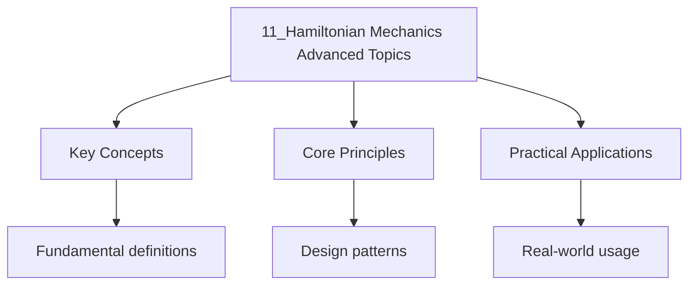

---

date: 2026-07-23T21:57:32+01:00
title: "Hamiltonian Mechanics: Advanced Topics"
tags:
  - Physics
  - University
description: "\"itemListElement\": [{\"name\": \"Home\", \"url\": \"https://wyattau.com\"}, {\"name\": \"physics\", \"url\": \"https://physics.wyattau.com\"}, {\"name\": \"1 Classical"
---

<!-- Breadcrumb Schema for SEO -->

### 10.1 Canonical Transformations

A **canonical transformation** from $(q, p)$ to $(Q, P)$ preserves the form of Hamilton's equations.
It is generated by a **generating function** $F$.

**Type 1** ($F_1(q, Q, t)$): $p = \partial F_1/\partial q$, $P = -\partial F_1/\partial Q$,
$K = H + \partial F_1/\partial t$.

**Type 2** ($F_2(q, P, t)$): $p = \partial F_2/\partial q$, $Q = \partial F_2/\partial P$,
$K = H + \partial F_2/\partial t$.

**Type 3** ($F_3(p, Q, t)$): $q = -\partial F_3/\partial p$, $P = -\partial F_3/\partial Q$,
$K = H + \partial F_3/\partial t$.

**Type 4** ($F_4(p, P, t)$): $q = -\partial F_4/\partial p$, $Q = \partial F_4/\partial P$,
$K = H + \partial F_4/\partial t$.

The transformation is canonical if and only if:

$$\sum_i p_i\,dq_i - \sum_i P_i\,dQ_i = dF$$

**Poisson bracket invariance.** Canonical transformations preserve the Poisson bracket:
$\{F, G\}_{q,p} = \{F, G\}_{Q,P}$.

**Example.** The point transformation $Q_i = q_i$ (just relabelling coordinates) with
$P_i = p_i$ is canonical (the transformation is the identity on phase space). A non-trivial example: the rotation
$Q = q\cos\theta + p\sin\theta$, $P = -q\sin\theta + p\cos\theta$ is canonical (it preserves
$dq \wedge dp = dQ \wedge dP$).

### 10.2 Action-Angle Variables

For a periodic system with frequency $\omega$, define the **action**:

$$J_i = \oint p_i\,dq_i$$

The conjugate **angle variable** $\theta_i$ evolves linearly: $\theta_i(t) = \omega_i t + \theta_i(0)$.

**Properties:**

- $J_i$ is adiabatically invariant (conserved under slow parameter changes).
- The motion is trivial in action-angle variables: $J_i = \text{const}$, $\dot{\theta}_i = \omega_i$.
- The transformation to action-angle variables is a canonical transformation.

**Application: Kepler problem.** In the Kepler problem, the action variables are:
$J_1 = L$ (angular momentum), $J_2 = L + L_z$ (related to eccentricity), $J_3 = -E/\omega$
(related to energy). The angle variables give the orbital elements.

### 10.3 Hamilton--Jacobi Equation

The **Hamilton--Jacobi equation** is a reformulation of Hamiltonian mechanics as a PDE for
Hamilton's principal function $S(q, \alpha, t)$:

$$H\!\left(q, \frac{\partial S}{\partial q}, t\right) + \frac{\partial S}{\partial t} = 0$$

If $S$ can be found by separation of variables, the transformation to new coordinates makes all
momenta constant, effectively solving the problem.

**Separation for the harmonic oscillator.** For $H = p^2/(2m) + m\omega^2 q^2/2$:

$$S(q, E, t) = \int \sqrt{2m(E - \frac{1}{2}m\omega^2 q^2)}\,dq - Et$$

The new momentum $P_1 = \alpha_1 = E$ (constant), and the new coordinate $Q_1 = \partial S/\partial E$
gives a linear function of time.

**Maupertuis principle.** For energy-conserving systems, the Hamilton--Jacobi equation simplifies
to:

$$2m\left[E - V(q)\right] = \left(\frac{\partial W}{\partial q}\right)^2$$

where $W$ is the abbreviated action. This is equivalent to Fermat's principle in optics.

### 10.4 Adiabatic Invariants

An **adiabatic invariant** is a quantity that remains constant when a parameter of the system is
changed slowly compared to the period of motion.

For a harmonic oscillator with slowly varying $\omega(t)$:

$$\frac{E}{\omega} = \text{const} \quad \text{(adiabatic invariant)}$$

This has important applications:

- **Fermi acceleration:** Cosmic rays gaining energy from moving magnetic fields
- **Magnetic mirrors:** Charged particles trapped between magnetic mirrors conserve
  $\mu = mv_\perp^2/(2B)$ (the magnetic moment)
- **Planetary orbits:** The semi-major axis is an adiabatic invariant under slow mass loss from the
  Sun
- **Pendulum with slowly changing length:** If the length $l(t)$ changes slowly, $E/\sqrt{g/l}$
  is conserved.

**Derivation (sketch).** For a periodic Hamiltonian $H(q, p, \lambda(t))$ with $\dot{\lambda} \ll \omega$,
the action $J = \oint p\,dq$ satisfies $\dot{J} = O(\dot{\lambda}/\omega)$, so $J$ is approximately
constant over many periods.

### 10.5 Liouville's Theorem and Phase Space

**Liouville's theorem:** The phase space distribution function $\rho(q, p, t)$ is constant along
trajectories:

$$\frac{d\rho}{dt} = \frac{\partial\rho}{\partial t} + \{\rho, H\} = 0$$

This means phase space volume is conserved: a region of phase space evolves like an incompressible
fluid.

**Consequences:**

- The phase space density of an ensemble of systems cannot increase
- This constrains the focusing of particle beams in accelerators
- The theorem underpins the ergodic hypothesis in statistical mechanics
- Poincare recurrence: bounded Hamiltonian systems return arbitrarily close to their initial state

**Proof.** The flow $\phi_t$ generated by Hamilton's equations satisfies
$\det(\partial(q', p')/\partial(q, p)) = 1$ (canonical transformation), so the Jacobian is 1.
By the change of variables formula, $\rho$ is conserved along trajectories. $\square$

### 10.6 Perturbation Theory and KAM Theorem

**Perturbation theory** addresses Hamiltonian systems close to integrable ones:
$H = H_0 + \varepsilon H_1$.

**Lindstedt--Poincare method.** Expand both the solution and the frequency in powers of $\varepsilon$
to avoid secular terms.

**KAM theorem (Kolmogorov--Arnold--Moser).** For sufficiently small $\varepsilon$, most invariant
tori of the integrable system persist under perturbation, provided the frequency vector satisfies
a Diophantine condition (sufficiently irrational).

The surviving tori have positive measure for small $\varepsilon$, but the remaining phase space
contains chaotic regions. This explains the stability of the solar system over billions of years
(integrable Kepler problem + small planetary perturbations).

### Common Pitfalls

1. **Using the wrong generating function type.** Each type of generating function expresses
   different variables as independent. Choosing the wrong type leads to implicit equations that
   may not be solvable.

2. **Forgetting the time dependence in generating functions.** If $F$ depends explicitly on $t$,
   the new Hamiltonian is $K = H + \partial F/\partial t$, not $K = H$.

3. **Confusing canonical with point transformations.** Not all coordinate changes are canonical.
   A transformation is canonical only if it preserves the symplectic structure $dp \wedge dq$.

4. **Applying perturbation theory to non-integrable systems.** The KAM theorem requires the
   unperturbed system to be integrable. For chaotic systems, perturbation theory fails.

5. **Using Lagrangian canonical momentum as mechanical momentum.** The canonical momentum
   $p = \partial L/\partial \dot{q}$ equals $m\dot{q}$ only for simple kinetic energies. In
   electromagnetic fields, $p = m\dot{q} + qA$; the canonical and mechanical momenta differ.

6. **Misidentifying conserved quantities.** A quantity is conserved if and only if it corresponds
   to a symmetry via Noether's theorem: time translation $\to$ energy, spatial translation $\to$
   momentum, rotation $\to$ angular momentum. Assuming conservation without a corresponding symmetry
   is incorrect.

Worked Example 10.1: Action-Angle Variables for the Harmonic Oscillator

For the 1D harmonic oscillator: $H = p^2/(2m) + \frac{1}{2}m\omega^2 q^2$.

The action variable:

$$J = \oint p\,dq = \oint \sqrt{2mE - m^2\omega^2 q^2}\,dq$$

The contour is the ellipse $p^2/(2mE) + q^2/(2E/m\omega^2) = 1$ with semi-axes $\sqrt{2mE}$ and
$\sqrt{2E/(m\omega^2)}$.

The area (and hence the action):

$$J = \pi \times \sqrt{2mE} \times \sqrt{\frac{2E}{m\omega^2}} = \frac{2\pi E}{\omega}$$

So $E = J\omega/2$ and the Hamiltonian in action-angle form is:

$$H(J) = J\omega$$

The angle variable evolves as $\dot{\theta} = \partial H/\partial J = \omega$Giving
$\theta(t) = \omega t + \theta_0$.

The frequency is $\omega = \partial H/\partial J = \text{const}$Independent of $J$ (harmonic
oscillator has no frequency shift with amplitude --- a special property).

This result shows why the harmonic oscillator is exactly solvable in action-angle variables: the
Hamiltonian depends linearly on $J$, giving constant frequency. For anharmonic oscillators, $H(J)$
is non-linear and the frequency depends on amplitude.

## Intuition

Hamiltonian mechanics reformulates Newton's laws in terms of energy rather than forces. The state of a system is a point in phase space with coordinates and momenta, and time evolution traces a trajectory on the energy surface. Canonical transformations change coordinates while preserving the structure of Hamilton's equations, allowing you to find variables where the motion is simple. Action-angle variables are particularly powerful: the action is a conserved quantity and the angle evolves uniformly in time. For integrable systems with enough conserved quantities, motion is confined to tori in phase space. This framework connects classical mechanics to quantum mechanics through the correspondence principle.

## Cross-References

- **[Hamiltonian Mechanics](4_hamiltonian-mechanics.md)**: Basic Hamiltonian mechanics provides the foundation for understanding canonical transformations and action-angle variables.
- **[Lagrangian Mechanics](3_lagrangian-mechanics.md)**: The Lagrangian formulation provides the basis for deriving the Hamiltonian and understanding variational principles.
- **[Quantum Mechanics](../5-quantum-mechanics/2_postulates-of-quantum-mechanics.md)**: The Hamiltonian becomes an operator in quantum mechanics, and the correspondence principle connects classical and quantum descriptions.

- [Calculus](https://mathematics.wyattau.com/docs/calculus)
- [Linear Algebra](https://mathematics.wyattau.com/docs/linear-algebra)
- [Vector Calculus](https://mathematics.wyattau.com/docs/vector-calculus)
- [Quantum Computing](https://computer-science.wyattau.com/docs/quantum-computing)
