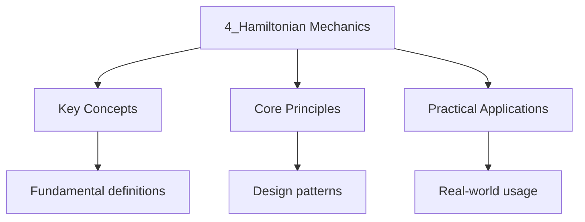

---

date: 2026-07-23T21:57:32+01:00
title: "Hamiltonian Mechanics"
tags:
  - Physics
  - University
description: "Hamiltonian mechanics: the Legendre transform, Hamilton's equations, phase space and Liouville's theorem, Poisson brackets and the Hamilton-Jacobi equation, with the oscillator and pendulum worked in full and multiple representations throughout. Tier U."
---

<!-- Breadcrumb Schema for SEO -->
<script type="application/ld+json">
{
  "@context": "https://schema.org",
  "@type": "BreadcrumbList",
  "itemListElement": [{"name": "Home", "url": "https://wyattau.com"}, {"name": "physics", "url": "https://physics.wyattau.com"}, {"name": "1 Classical Mechanics", "url": "https://physics.wyattau.com/1-classical-mechanics"}, {"name": "4_hamiltonian Mechanics", "url": "https://physics.wyattau.com/1-classical-mechanics/4_hamiltonian-mechanics"}]
}
</script>

## Recall prompts

Attempt these from memory before reading.

- Write down the Legendre transform. Why does it need the Hessian of $L$ to be
  non-singular?
- State Hamilton's equations. How many first-order equations do they give for
  $n$ degrees of freedom?
- State Liouville's theorem, and say what it rules out for Hamiltonian systems.
- Write down the fundamental Poisson brackets.
- What is a constant of motion in terms of the Poisson bracket with $H$?

## Motivation: why switch from the Lagrangian

The Lagrangian gives $n$ second-order equations in the coordinates. Hamilton's
formulation rewrites them as $2n$ first-order equations in the coordinates
*and* their conjugate momenta, treating $(q, p)$ as independent variables.

That looks like no gain at all -- more variables, same information. What it
buys is a different geometry:

- **Phase space is the natural home.** A state of the system is a point
  $(q, p)$, not a path. Initial-value problems become: start here, follow the
  flow.
- **First order is what ODE theory wants.** Existence, uniqueness and numerical
  integration are all theorems about first-order systems.
- **Conserved quantities become geometry.** A cyclic coordinate makes $p_j$
  constant, so the flow is confined to a level surface of $p_j$. Conservation
  laws turn into constraints on where the orbit can go.
- **The transformation to quantum mechanics runs through it.** The Poisson
  bracket is the classical object whose deformation gives the commutator.

The Lagrangian is the better formulation for solving a specific problem
quickly; the Hamiltonian is the better one for understanding the structure of
the solution space.

### 4.1 Generalised Momentum

The **generalised momentum** conjugate to $q_j$ is

$$
p_j = \frac{\partial L}{\partial \dot{q}_j}
$$

### 4.2 The Hamiltonian

The **Hamiltonian** is defined by the **Legendre transform**:

$$
H(q_1, \ldots, q_n, p_1, \ldots, p_n, t) = \sum_{j=1}^n p_j \dot{q}_j - L
$$

When the transformation is regular (i.e., the Hessian
$\partial^2 L / \partial \dot{q}_j \partial \dot{q}_k$ Is non-singular), this is well-defined.

If $L$ does not depend explicitly on time and $V$ is velocity-independent, then $H = T + V$ (total
Energy).

### 4.3 Worked Example: Legendre Transform for the Harmonic Oscillator

**Problem.** A one-dimensional harmonic oscillator has
$L = \frac{1}{2}m\dot{x}^2 - \frac{1}{2}kx^2$. Find the Hamiltonian.

<details>
<summary>Solution</summary>

The conjugate momentum:

$$
p = \frac{\partial L}{\partial \dot{x}} = m\dot{x} \implies \dot{x} = \frac{p}{m}
$$

The Hamiltonian:

$$
H = p\dot{x} - L = p\frac{p}{m} - \frac{1}{2}m\frac{p^2}{m^2} + \frac{1}{2}kx^2 = \frac{p^2}{2m} + \frac{1}{2}kx^2
$$

This is $T + V$ as expected for a natural system. Hamilton's equations give:

$$
\dot{x} = \frac{\partial H}{\partial p} = \frac{p}{m}, \quad \dot{p} = -\frac{\partial H}{\partial x} = -kx
$$

Combining: $\ddot{x} = \dot{p}/m = -kx/m$ I.e., $\ddot{x} + (k/m)x = 0$. $\blacksquare$

</details>

### 4.4 Worked Example: Legendre Transform for the Simple Pendulum

**Problem.** Find the Hamiltonian for a simple pendulum of mass $m$ and length $l$.

<details>
<summary>Solution</summary>

From Section 3.4, $L = \frac{1}{2}ml^2\dot{\theta}^2 + mgl\cos\theta$.

Conjugate momentum:

$$
p_\theta = \frac{\partial L}{\partial \dot{\theta}} = ml^2\dot{\theta} \implies \dot{\theta} = \frac{p_\theta}{ml^2}
$$

Hamiltonian:

$$
H = p_\theta\dot{\theta} - L = \frac{p_\theta^2}{ml^2} - \frac{p_\theta^2}{2ml^2} - mgl\cos\theta = \frac{p_\theta^2}{2ml^2} - mgl\cos\theta
$$

Hamilton's equations:

$$
\dot{\theta} = \frac{\partial H}{\partial p_\theta} = \frac{p_\theta}{ml^2}, \quad \dot{p}_\theta = -\frac{\partial H}{\partial \theta} = -mgl\sin\theta
$$

$\blacksquare$

</details>

### 4.5 Hamilton's Equations

**Theorem 4.1 (Hamilton's Equations).** The equations of motion in Hamiltonian form are

$$
\dot{q}_j = \frac{\partial H}{\partial p_j}, \quad \dot{p}_j = -\frac{\partial H}{\partial q_j}
$$

These are $2n$ first-order ODEs (compared to $n$ second-order ODEs in the Lagrangian formulation).

_Proof._ From $H = \sum p_j \dot{q}_j - L$:

$$
dH = \sum \dot{q}_j\, dp_j + \sum p_j\, d\dot{q}_j - \sum \frac{\partial L}{\partial q_j}\, dq_j - \sum \frac{\partial L}{\partial \dot{q}_j}\, d\dot{q}_j - \frac{\partial L}{\partial t}\, dt
$$

Since $p_j = \partial L / \partial \dot{q}_j$ The $d\dot{q}_j$ terms cancel:

$$
dH = \sum \dot{q}_j\, dp_j - \sum \dot{p}_j\, dq_j - \frac{\partial L}{\partial t}\, dt
$$

Comparing with
$dH = \sum \frac{\partial H}{\partial p_j} dp_j + \sum \frac{\partial H}{\partial q_j} dq_j + \frac{\partial H}{\partial t} dt$:

$$
\dot{q}_j = \frac{\partial H}{\partial p_j}, \quad \dot{p}_j = -\frac{\partial H}{\partial q_j}, \quad \frac{\partial H}{\partial t} = -\frac{\partial L}{\partial t}
$$

$\blacksquare$

### 4.6 Phase Space

Hamiltonian mechanics lives in **phase space**: the $2n$-dimensional space with coordinates
$(q_1, \ldots, q_n, p_1, \ldots, p_n)$. Each point in phase space represents a complete state of the
System (positions and momenta).

A **phase portrait** is the collection of trajectories in phase space. For a
1D harmonic oscillator the trajectories are ellipses in the $(x, p)$ plane, and
that single picture carries the physics in four representations at once.

**The same oscillator, four ways.**

*In words.* Energy sloshes between kinetic and potential. When the mass is at
maximum displacement it is momentarily at rest; when it passes through the
centre it is moving fastest.

*As equations.* $H = \frac{p^2}{2m} + \frac{1}{2}kx^2 = E$ on each orbit, with
$\dot x = p/m$ and $\dot p = -kx$.

*As a picture.* Concentric ellipses in the $(x, p)$ plane:

```text
     p
     ^        .......
     |     ...       ...
     |   .             .
     |  .      +        .      each ellipse is one energy
     |   .             .       E = H on the curve
     |     ...       ...
     |        .......
     +----------------------> x
```

*As a statement about area.* The area enclosed by an orbit is $2\pi E/\omega$,
so energy sets the area. Liouville's theorem says a bundle of such orbits keeps
its total area as it deforms.

The picture also explains why the origin is called a *centre*: orbits circle it
but never approach it, so it is stable without being attracting. An attracting
fixed point would require the area to shrink, which Liouville forbids.

### 4.7 Liouville's Theorem

**Theorem 4.2 (Liouville's Theorem).** The flow in phase space is **incompressible**: the phase
space volume is conserved along trajectories. Equivalently, the phase space density $\rho(q, p, t)$
satisfies:

$$
\frac{d\rho}{dt} = \frac{\partial \rho}{\partial t} + \sum_j \left(\frac{\partial \rho}{\partial q_j}\dot{q}_j + \frac{\partial \rho}{\partial p_j}\dot{p}_j\right) = 0
$$

_Proof._ Consider a volume $\Omega$ in phase space. The rate of change of the volume is:

$$
\frac{d}{dt}\int_\Omega \rho\, dq\, dp = \int_\Omega \frac{\partial \rho}{\partial t}\, dq\, dp
$$

By the continuity equation in $2n$ dimensions:

$$
\frac{\partial \rho}{\partial t} + \nabla \cdot (\rho \mathbf{v}) = 0
$$

Where $\mathbf{v} = (\dot{q}_1, \ldots, \dot{q}_n, \dot{p}_1, \ldots, \dot{p}_n)$ is the phase space
velocity. Using Hamilton's equations:

$$
\nabla \cdot \mathbf{v} = \sum_j \frac{\partial \dot{q}_j}{\partial q_j} + \sum_j \frac{\partial \dot{p}_j}{\partial p_j} = \sum_j \frac{\partial^2 H}{\partial q_j \partial p_j} - \sum_j \frac{\partial^2 H}{\partial p_j \partial q_j} = 0
$$

By equality of mixed partial derivatives. Therefore:

$$
\frac{\partial \rho}{\partial t} + \rho\,(\nabla \cdot \mathbf{v}) + \mathbf{v} \cdot \nabla\rho = \frac{\partial \rho}{\partial t} + \mathbf{v} \cdot \nabla\rho = \frac{d\rho}{dt} = 0
$$

$\blacksquare$

_Intuition._ Liouville's theorem is the classical analogue of unitarity in quantum mechanics. It
tells us that phase space volume is conserved --- like an incompressible fluid flowing through phase
space. This underlies the ergodic hypothesis of statistical mechanics.

### 4.8 Poisson Brackets

**Definition.** The **Poisson bracket** of two functions $f(q, p, t)$ and $g(q, p, t)$ is:

$$
\{f, g\} = \sum_{j=1}^n \left(\frac{\partial f}{\partial q_j}\frac{\partial g}{\partial p_j} - \frac{\partial f}{\partial p_j}\frac{\partial g}{\partial q_j}\right)
$$

**Theorem 4.3 (Equations of Motion via Poisson Brackets).** For any function $f(q, p, t)$:

$$
\frac{df}{dt} = \frac{\partial f}{\partial t} + \{f, H\}
$$

In particular, Hamilton's equations become:

$$
\dot{q}_j = \{q_j, H\}, \quad \dot{p}_j = \{p_j, H\}
$$

_Proof._ Using the chain rule:

$$
\frac{df}{dt} = \frac{\partial f}{\partial t} + \sum_j \left(\frac{\partial f}{\partial q_j}\dot{q}_j + \frac{\partial f}{\partial p_j}\dot{p}_j\right)
$$

Substituting Hamilton's equations:

$$
\frac{df}{dt} = \frac{\partial f}{\partial t} + \sum_j \left(\frac{\partial f}{\partial q_j}\frac{\partial H}{\partial p_j} - \frac{\partial f}{\partial p_j}\frac{\partial H}{\partial q_j}\right) = \frac{\partial f}{\partial t} + \{f, H\}
$$

$\blacksquare$

**Properties of Poisson Brackets.**

**Theorem 4.4.** The Poisson bracket satisfies:

1. **Antisymmetry:** $\{f, g\} = -\{g, f\}$
2. **Linearity:** $\{af + bg, h\} = a\{f, h\} + b\{g, h\}$ for constants $a, b$
3. **Leibniz rule:** $\{fg, h\} = f\{g, h\} + \{f, h\}g$
4. **Jacobi identity:** $\{f, \{g, h\}\} + \{g, \{h, f\}\} + \{h, \{f, g\}\} = 0$

_Proof._ Properties (1)--(3) follow directly from the definition. For the Jacobi identity, write out
the terms explicitly:

$$
\{f, \{g, h\}\} = \sum_j \frac{\partial f}{\partial q_j}\frac{\partial}{\partial p_j}\sum_k \left(\frac{\partial g}{\partial q_k}\frac{\partial h}{\partial p_k} - \frac{\partial g}{\partial p_k}\frac{\partial h}{\partial q_k}\right) - \sum_j \frac{\partial f}{\partial p_j}\frac{\partial}{\partial q_j}\sum_k \left(\frac{\partial g}{\partial q_k}\frac{\partial h}{\partial p_k} - \frac{\partial g}{\partial p_k}\frac{\partial h}{\partial q_k}\right)
$$

Expanding and collecting terms, the second-order mixed partial derivatives cancel in groups of three
(by equality of mixed partials), yielding the Jacobi identity. $\blacksquare$

**Theorem 4.5.** A quantity $f$ is a constant of motion if and only if
$\partial f/\partial t + \{f, H\} = 0$. If $f$ does not depend explicitly on time, $f$ is conserved
if and only if $\{f, H\} = 0$.

_Proof._ Immediate from Theorem 4.3 with $df/dt = 0$. $\blacksquare$

**Fundamental Poisson Brackets:**

$$
\{q_j, q_k\} = 0, \quad \{p_j, p_k\} = 0, \quad \{q_j, p_k\} = \delta_{jk}
$$

## Counterexamples worth knowing by name

| Claim | True? | Counterexample |
| ----- | ----- | -------------- |
| The Hamiltonian always equals $T + V$ | no | a charged particle in an EM field, or any rheonomic constraint: $H = \sum p_j\dot q_j - L$ comes from the Legendre transform, not from $T + V$ |
| The Legendre transform always exists | no | $L$ must be convex in $\dot q$; for a relativistic particle near $v = c$ the Hessian degenerates |
| A Hamiltonian system always reaches equilibrium | no | Liouville forbids attractors entirely |
| Every conserved quantity comes from a symmetry of $q$ | no | momentum can be conserved with no obvious coordinate symmetry |
| Poisson brackets are invariant under any coordinate change | no | only under *canonical* transformations |

The relativistic row is the one to remember. It shows that the Legendre
transform is a hypothesis about the Lagrangian, not a formality, and that the
transform breaks exactly where the physics becomes singular.

## Interleaving problems

Mix these with material from Lagrangian mechanics, Noether's theorem and the
statistical mechanics module.

1. (Lagrangian.) Show that the Legendre transform is an involution: applying it
   twice returns the original Lagrangian. Where is convexity used?
2. (Noether.) For a particle in a central potential, show that rotational
   symmetry gives $\{L_z, H\} = 0$ and hence $L_z$ is conserved.
3. (Statistical mechanics.) Show that the microcanonical measure on the energy
   surface $H = E$ is invariant under the flow, using Liouville's theorem.
4. (Symplectic structure.) Show that the Poisson bracket can be written
   $\{f, g\} = \omega(X_f, X_g)$ where $\omega$ is the symplectic form.
5. (Hamilton-Jacobi.) Show that if $S(q, \alpha, t)$ is a complete integral
   depending on constants $\alpha$, then the $p = \partial S/\partial q$ and
   $\beta = \partial S/\partial \alpha$ are constant along solutions.

## Hamilton-Jacobi Equation

**Definition.** Hamilton's principal function $S(q, t)$ is the action evaluated along the classical
path from $(q_0, t_0)$ to $(q, t)$.

**Theorem 4.6 (Hamilton-Jacobi Equation).** The function $S$ satisfies:

$$
H\left(q_1, \ldots, q_n, \frac{\partial S}{\partial q_1}, \ldots, \frac{\partial S}{\partial q_n}, t\right) + \frac{\partial S}{\partial t} = 0
$$

This is a first-order nonlinear PDE in $n + 1$ variables.

_Proof._ The action from $t_0$ to $t$ is $S = \int_{t_0}^{t} L\, dt'$. The total time derivative is:

$$
\frac{dS}{dt} = L
$$

But $S = S(q_1(t), \ldots, q_n(t), t)$ So by the chain rule:

$$
\frac{dS}{dt} = \sum_j \frac{\partial S}{\partial q_j}\dot{q}_j + \frac{\partial S}{\partial t} = L
$$

From the definition of the conjugate momentum,
$p_j = \partial L/\partial \dot{q}_j = \partial S/\partial q_j$ (this can be shown rigorously by
varying the endpoint). Therefore:

$$
L = \sum_j p_j \dot{q}_j + \frac{\partial S}{\partial t} = H + \frac{\partial S}{\partial t}
$$

Since $dS/dt = L$:

$$
H + \frac{\partial S}{\partial t} = L = \sum_j p_j\dot{q}_j + \frac{\partial S}{\partial t}
$$

Which gives $H + \partial S/\partial t = 0$. $\blacksquare$

_Intuition._ The Hamilton-Jacobi equation is the bridge between classical and quantum mechanics.
Schrodinger's equation can be obtained from it via the substitution $S = -i\hbar \ln\psi$ (up to
constants), making $S$ the classical limit of the quantum phase.

**Separation of Variables.** If $H$ does not depend explicitly on $t$ Write $S(q, t) = W(q) - Et$.
Then the time-independent Hamilton-Jacobi equation is:

$$
H\left(q_1, \ldots, q_n, \frac{\partial W}{\partial q_1}, \ldots, \frac{\partial W}{\partial q_n}\right) = E
$$

Where $W$ is **Hamilton's characteristic function** and $E$ is the constant energy.

### 4.10 Worked Example: Hamilton-Jacobi for the Harmonic Oscillator

**Problem.** Solve the Hamilton-Jacobi equation for a 1D harmonic oscillator with
$H = p^2/(2m) + kx^2/2$.

<details>
<summary>Solution</summary>

Since $H$ is time-independent, write $S(x, t) = W(x) - Et$. The HJ equation becomes:

$$
\frac{1}{2m}\left(\frac{dW}{dx}\right)^2 + \frac{1}{2}kx^2 = E
$$

$$
\frac{dW}{dx} = \sqrt{2mE - mkx^2}
$$

Integrating:

$$
W(x) = \int \sqrt{2mE - mkx^2}\, dx
$$

Let $x = \sqrt{2E/k}\sin\alpha$ Then $dx = \sqrt{2E/k}\cos\alpha\, d\alpha$:

$$
W = \frac{2E}{\omega}\int_0^\alpha \cos^2\alpha'\, d\alpha' = \frac{E}{\omega}\left(\alpha + \frac{1}{2}\sin 2\alpha\right)
$$

Where $\omega = \sqrt{k/m}$. The solution gives $x(t) = \sqrt{2E/k}\sin(\omega t + \delta)$ as
expected.

$\blacksquare$

</details>




## Intuition

Hamiltonian mechanics is like switching from a video recording of motion to a snapshot of all possible states. While the Lagrangian tracks positions and velocities over time, the Hamiltonian lives in phase space where every point represents a complete snapshot of where something is and how fast it is going. Hamilton's equations are beautifully symmetric: the rate of change of position depends on how energy changes with momentum, and the rate of change of momentum depends on how energy changes with position. Liouville's theorem tells us that if you paint a region of phase space, its volume stays the same as it flows around like incompressible paint. This is why statistical mechanics works: the phase space volume that encodes all possible states of a system is preserved under time evolution.

:::caution
Legendre transform from $L$ To $H$ is regular. If
$\det(\partial^2 L / \partial \dot{q}_i \partial \dot{q}_j) = 0$ The system Has **constraints** and
the Hamiltonian formulation requires special treatment (Dirac brackets or Constraint analysis).
:::

## Cross-References

- **[Lagrangian Mechanics](/1-classical-mechanics/3_lagrangian-mechanics/)**: The Lagrangian formulation provides the foundation for deriving the Hamiltonian via Legendre transform.
- **[Noether's Theorem](/1-classical-mechanics/5_noether-s-theorem-and-conservation-laws/)**: Noether's theorem connects symmetries to conserved quantities, which are expressed as Poisson brackets in Hamiltonian mechanics.
- **[Quantum Mechanics](/5-quantum-mechanics/2_postulates-of-quantum-mechanics/)**: The Hamiltonian becomes an operator in quantum mechanics, and Poisson brackets become commutators.

- [Calculus](https://mathematics.wyattau.com/docs/calculus)
- [Linear Algebra](https://mathematics.wyattau.com/docs/linear-algebra)
- [Vector Calculus](https://mathematics.wyattau.com/docs/vector-calculus)
- [Quantum Computing](https://computer-science.wyattau.com/docs/quantum-computing)

### 4.11 Common Mistakes

**Mistake 1: Assuming the Hamiltonian always equals $T + V$**
The Hamiltonian equals the total energy $H = T + V$ only when the potential is velocity-independent and the coordinate transformation is scleronomic. For systems with velocity-dependent potentials (like charged particles in electromagnetic fields) or rheonomic constraints, $H \neq T + V$ even though $H$ is still conserved when $\partial L/\partial t = 0$.

**Mistake 2: Confusing canonical momentum with mechanical momentum**
Canonical momentum $p_j = \partial L/\partial \dot{q}_j$ is not always equal to mechanical momentum $m\dot{q}_j$. For a charged particle in a magnetic field, the canonical momentum includes the vector potential: $\mathbf{p} = m\mathbf{v} + q\mathbf{A}$. Always derive canonical momentum from the Lagrangian, not from $m\mathbf{v}$.

**Mistake 3: Misapplying Poisson brackets**
The Poisson bracket $\{f, g\}$ is antisymmetric: $\{f, g\} = -\{g, f\}$. A common error is forgetting this sign when computing brackets of position and momentum. The fundamental brackets are $\{q_j, p_k\} = \delta_{jk}$, $\{q_j, q_k\} = 0$, and $\{p_j, p_k\} = 0$. Mixing up the order changes the sign.
