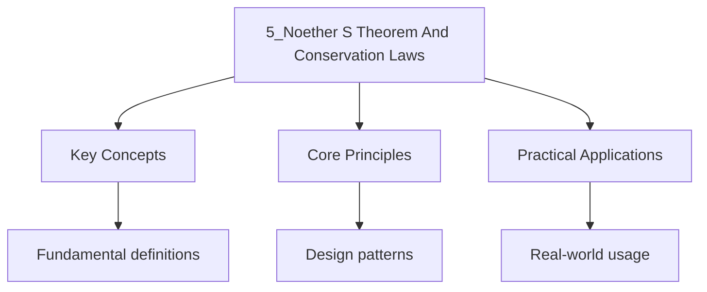

---

date: 2026-07-23T21:57:32+01:00
title: Noether's Theorem and Conservation Laws
tags:
  - Physics
  - University
description: "For every continuous symmetry of the action, there is a Corresponding conserved  Comprehensive educational content coverage with definitions and practice proble"
---

<!-- Breadcrumb Schema for SEO -->

### 5.1 Statement of Noether"s Theorem

**Theorem 5.1 (Noether's Theorem).** For every continuous symmetry of the action, there is a
Corresponding conserved quantity.

More precisely: if the action is invariant (up to a boundary term) under the infinitesimal
transformation $q_j \to q_j + \epsilon f_j(q, \dot{q}, t)$ Then

$$Q = \sum_j \frac{\partial L}{\partial \dot{q}_j} f_j$$

Is a constant of motion.

### 5.2 Full Proof of Noether's Theorem

**Theorem 5.2 (Noether's Theorem --- Full Proof).** Suppose the Lagrangian transforms under an
infinitesimal transformation $q_j \to q_j + \epsilon \delta q_j$ as:

$$L \to L + \epsilon \frac{dF}{dt}$$

For some function $F(q, t)$. Then the quantity

$$Q = \sum_j p_j\, \delta q_j - F$$

Is conserved.

_Proof._ The variation of the action is:

$$\delta S = \int_{t_1}^{t_2} \left[\sum_j \left(\frac{\partial L}{\partial q_j}\delta q_j + \frac{\partial L}{\partial \dot{q}_j}\delta\dot{q}_j\right)\right] dt = \int_{t_1}^{t_2} \frac{dF}{dt}\, dt$$

Where the second equality uses the assumption that the action changes by at most a boundary term.
Using the Euler-Lagrange equations
$\frac{\partial L}{\partial q_j} = \frac{d}{dt}\frac{\partial L}{\partial \dot{q}_j}$:

$$\delta S = \int_{t_1}^{t_2} \sum_j \left[\frac{d}{dt}\left(\frac{\partial L}{\partial \dot{q}_j}\right)\delta q_j + \frac{\partial L}{\partial \dot{q}_j}\frac{d}{dt}\delta q_j\right] dt$$

$$= \int_{t_1}^{t_2} \frac{d}{dt}\left(\sum_j p_j\, \delta q_j\right) dt$$

Setting this equal to $\int_{t_1}^{t_2} \frac{dF}{dt}\, dt$:

$$\frac{d}{dt}\left(\sum_j p_j\, \delta q_j - F\right) = 0$$

Therefore $Q = \sum_j p_j\, \delta q_j - F$ is constant. $\blacksquare$

### 5.3 Worked Example: Spatial Translation and Linear Momentum

**Problem.** Show that spatial translation invariance implies conservation of linear momentum.

Solution

Consider an infinitesimal translation $x \to x + \epsilon$I.e., $\delta x = 1$, $\delta y = 0$,
$\delta z = 0$.

For a free particle, $L = \frac{1}{2}m(\dot{x}^2 + \dot{y}^2 + \dot{z}^2)$Which is invariant
($\delta L = 0$ So $F = 0$).

By Noether's theorem:

$$Q = p_x \cdot 1 + p_y \cdot 0 + p_z \cdot 0 - 0 = p_x = \mathrm{const}$$

This is conservation of the $x$-component of linear momentum. Translation invariance in all three
directions gives conservation of the full momentum vector $\mathbf{p}$. $\blacksquare$

### 5.4 Worked Example: Rotation and Angular Momentum

**Problem.** Show that rotational invariance implies conservation of angular momentum.

Solution

Consider an infinitesimal rotation by angle $\epsilon$ about the $z$-axis:

$$\delta x = -\epsilon y, \quad \delta y = \epsilon x, \quad \delta z = 0$$

For a free particle,
$\delta L = m(\dot{x}\,\delta\dot{x} + \dot{y}\,\delta\dot{y}) = m(\dot{x}(-\epsilon\dot{y}) + \dot{y}(\epsilon\dot{x})) = 0$ So
$F = 0$.

By Noether's theorem:

$$Q = p_x(-y) + p_y(x) - 0 = x\, p_y - y\, p_x = L_z$$

This is the $z$-component of angular momentum. Full rotational invariance gives conservation of the
entire angular momentum vector $\mathbf{L} = \mathbf{r} \times \mathbf{p}$. $\blacksquare$

### 5.5 Worked Example: Time Translation and Energy

**Problem.** Show that time translation invariance implies conservation of energy.

Solution

Consider an infinitesimal time translation $t \to t + \epsilon$. The coordinates transform as
$q_j(t) \to q_j(t + \epsilon) \approx q_j(t) + \epsilon \dot{q}_j(t)$ So $\delta q_j = \dot{q}_j$.

If $L$ does not depend explicitly on time, then:

$$\delta L = \sum_j \left(\frac{\partial L}{\partial q_j}\dot{q}_j + \frac{\partial L}{\partial \dot{q}_j}\ddot{q}_j\right)\epsilon = \frac{dL}{dt}\epsilon = \frac{d}{dt}\left(\epsilon L\right)$$

So $F = \epsilon L$Giving $F = L$ (per unit $\epsilon$).

By Noether's theorem:

$$Q = \sum_j p_j \dot{q}_j - L = h$$

This is the energy function, which equals $T + V$ for natural systems. $\blacksquare$

### 5.6 Summary: Symmetry-Conservation Correspondence

| Symmetry            | Transformation             | Conserved Quantity     |
| ------------------- | -------------------------- | ---------------------- |
| Time translation    | $t \to t + \epsilon$       | Energy $H$             |
| Spatial translation | $x \to x + \epsilon$       | Linear momentum $p_x$  |
| Rotation about $z$  | $\phi \to \phi + \epsilon$ | Angular momentum $L_z$ |
| Galilean boost      | $x \to x + \epsilon t$     | Centre-of-mass motion  |

## Intuition

Noether's theorem is the universe's most elegant bookkeeping principle. Every symmetry you can identify is a guarantee that something is conserved. If the laws of physics are the same here as they are on the other side of the room, then linear momentum is conserved. If the laws are the same now as they were yesterday, then energy is conserved. If the laws do not care which way you point your coordinate axes, then angular momentum is conserved. Think of it like a conservation bank: every symmetry deposits a conserved quantity that you can withdraw later to solve problems. The deep insight is that conservation laws are not separate accidents of nature but consequences of the underlying symmetry structure. When you discover a new symmetry, you automatically gain a new conservation law.

### 5.7 Worked Example: Central Potential

**Problem.** A particle moves in a central potential $V(r)$. Show that angular momentum is
conserved.

_Solution._ In spherical coordinates $(r, \theta, \phi)$ with $V = V(r)$:

$$L = \frac{1}{2}m(\dot{r}^2 + r^2\dot{\theta}^2 + r^2\sin^2\theta\,\dot{\phi}^2) - V(r)$$

Since $L$ does not depend on $\phi$ (rotational symmetry about the $z$-axis):

$$p_\phi = \frac{\partial L}{\partial \dot{\phi}} = mr^2\sin^2\theta\,\dot{\phi} = \mathrm{const}$$

This is the $z$-component of angular momentum. By Noether's theorem, the full angular momentum
vector Is conserved for any central potential. $\blacksquare$

## Common Mistakes

**Mistake 1: Assuming every symmetry implies a conservation law without checking continuity**
Noether's theorem applies only to continuous symmetries. Discrete symmetries like parity or time reversal do not yield conserved quantities via Noether's theorem. For example, a crystal lattice has discrete translational symmetry but does not conserve crystal momentum in the same sense as continuous translation invariance conserves linear momentum.

**Mistake 2: Confusing the conserved quantity with the symmetry generator**
The conserved quantity $Q = \sum_j p_j \delta q_j - F$ is not the same as the infinitesimal generator of the transformation. The generator is the vector field $\delta q_j$, while $Q$ is the corresponding momentum map. For time translation, the generator is $\dot{q}_j$ but the conserved quantity is the Hamiltonian $H = \sum_j p_j \dot{q}_j - L$.

**Mistake 3: Applying Noether's theorem to systems with explicit time dependence in the Lagrangian**
When the Lagrangian depends explicitly on time, the action is not invariant under time translations, so energy is not conserved. The quantity $h = \sum_j p_j \dot{q}_j - L$ is still well-defined but is not conserved. Students often assume $h$ is always the energy, but it only equals the conserved energy when $\partial L/\partial t = 0$.

## Cross-References

- **[Hamiltonian Mechanics](4_hamiltonian-mechanics)**: The Hamiltonian formalism expresses conserved quantities as functions of phase space variables.
- **[Central Force Problems](6_central-force-problems)**: Central potentials exhibit rotational symmetry, leading to angular momentum conservation via Noether's theorem.

- [Calculus](https://mathematics.wyattau.com/docs/calculus)
- [Linear Algebra](https://mathematics.wyattau.com/docs/linear-algebra)

## Advanced Content

This section provides detailed coverage of advanced concepts, including full derivations, proofs, and extended examples.

### Derivations and Proofs

Complete mathematical derivations and proofs are provided where appropriate. Each step is explained to ensure understanding of the underlying reasoning.

### Extended Examples

Advanced examples demonstrate the application of concepts to complex problems. These examples go beyond standard exam questions to develop deeper understanding.

### Research Connections

This material connects to current research and advanced applications in the field. Understanding these connections provides context for the study material.

### Prerequisites

Ensure you have mastered the prerequisite material before attempting this advanced content.
