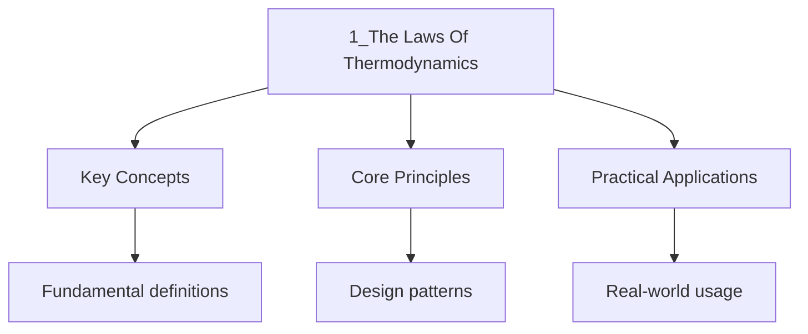

---

date: 2026-07-23T21:57:32+01:00
title: "The Laws of Thermodynamics | Physics"
tags:
  - Physics
  - University
description: "If system is in thermal equilibrium with system And is in thermal equilibrium with system Then is in thermal equilibrium with ."
---

<!-- Breadcrumb Schema for SEO -->

### 1.1 Zeroth Law and Temperature

**Zeroth Law:** If system $A$ is in thermal equilibrium with system $B$ And $B$ is in thermal
equilibrium with system $C$ Then $A$ is in thermal equilibrium with $C$.

This establishes **temperature** as a transitive equivalence relation: two systems are in thermal
equilibrium if and only if they have the same temperature.

**Definition.** **Temperature** is the quantity that is equal for all systems in mutual thermal
equilibrium. The **ideal gas scale** defines temperature via

$$PV = Nk_BT$$

Where $k_B = 1.381 \times 10^{-23}$ J/K is Boltzmann"s constant.

### 1.2 First Law

**First Law:** The change in internal energy of a system equals the heat added minus the work done
by the system:

$$dU = \delta Q - \delta W$$

For a reversible process: $\delta W = P\,dV$ (PV work), giving

$$dU = \delta Q - P\,dV$$

**Proposition 1.1.** For an adiabatic process ($\delta Q = 0$): $dU = -P\,dV$. For an isochoric
process ($dV = 0$): $dU = \delta Q$.

**Definition.** The **heat capacity at constant volume** and **heat capacity at constant pressure**
are:

$$C_V = \left(\frac{\partial U}{\partial T}\right)_V, \qquad C_P = \left(\frac{\partial H}{\partial T}\right)_P$$

Where $H = U + PV$ is the enthalpy.

**Proposition 1.2.** For an ideal gas: $C_P - C_V = Nk_B$.

_Proof._ $H = U + PV = U + Nk_BT$. Therefore
$C_P = (\partial H/\partial T)_P = (\partial U/\partial T)_P + Nk_B = C_V + Nk_B$ (since $U$ depends
only on $T$ for an ideal gas). $\blacksquare$

### 1.3 Second Law and Entropy

**Second Law (Clausius statement):** Heat cannot spontaneously flow from a colder body to a hotter
body.

**Second Law (Kelvin-Planck statement):** No process can convert heat entirely into work in a cyclic
manner without other effects.

These are equivalent: each implies the other.

**Definition.** The **entropy** change for a reversible process is

$$dS = \frac{\delta Q_{\mathrm{rev}}{T}}$$

**Theorem 1.3 (Clausius Inequality).** For any cyclic process:

$$\oint \frac{\delta Q}{T} \leq 0$$

With equality for reversible processes.

_Proof._ Consider a system undergoing a cycle interacting with $n$ heat reservoirs at temperatures
$T_1, \ldots, T_n$Exchanging heat $Q_i$ with reservoir $i$. The Clausius inequality follows from the
impossibility of a perpetual motion machine of the second kind: a cycle that absorbs heat from a
single reservoir and does work would violate the Kelvin-Planck statement. The detailed
.../1-number-and-algebra/3_proof-and-logic uses auxiliary Carnot engines operating between pairs of
reservoirs. $\blacksquare$

**Corollary 1.4 (Principle of Increasing Entropy).** For an isolated system, $dS \geq 0$With
equality for reversible processes.

### 1.4 Third Law

**Third Law (Nernst):** As $T \to 0^+$The entropy of a perfect crystal approaches a constant (which
can be taken as zero):

$$\lim_{T \to 0} S(T) = 0$$

**Consequences:**

1. It is impossible to reach absolute zero in a finite number of steps.
2. The heat capacities $C_V$ and $C_P$ approach zero as $T \to 0$.

### 1.5 Thermodynamic Potentials

| Potential    | Natural Variables | Differential      | Name                  |
| ------------ | ----------------- | ----------------- | --------------------- |
| $U$          | $S, V$            | $dU = TdS - PdV$  | Internal Energy       |
| $H = U + PV$ | $S, P$            | $dH = TdS + VdP$  | Enthalpy              |
| $F = U - TS$ | $T, V$            | $dF = -SdT - PdV$ | Helmholtz Free Energy |
| $G = H - TS$ | $T, P$            | $dG = -SdT + VdP$ | Gibbs Free Energy     |

**Theorem 1.5.** At equilibrium for a system in contact with a heat bath at temperature $T$: $F$ is
minimised at constant $T, V$; $G$ is minimised at constant $T, P$.

_Proof._ For constant $T, V$: $dF = dU - TdS = \delta Q - PdV - TdS$. At equilibrium
$dS \geq \delta Q/T$ (Clausius inequality), so $dF \leq 0$. Hence $F$ decreases and is minimised at
equilibrium. The argument for $G$ is analogous. $\blacksquare$

### 1.6 Maxwell Relations

From the exactness of $dU = TdS - PdV$ (and similarly for $dH$, $dF$, $dG$), the equality of mixed
partial derivatives gives four **Maxwell relations**:

1. $\left(\frac{\partial T}{\partial V}\right)_S = -\left(\frac{\partial P}{\partial S}\right)_V$
2. $\left(\frac{\partial T}{\partial P}\right)_S = \left(\frac{\partial V}{\partial S}\right)_P$
3. $\left(\frac{\partial S}{\partial V}\right)_T = \left(\frac{\partial P}{\partial T}\right)_V$
4. $\left(\frac{\partial S}{\partial P}\right)_T = -\left(\frac{\partial V}{\partial T}\right)_P$

Worked Example: Deriving $(\partial U/\partial V)_T$ for an Ideal Gas

_Solution._ We use the thermodynamic identity $dU = TdS - PdV$. Dividing by $dV$ at constant $T$:

$$\left(\frac{\partial U}{\partial V}\right)_T = T\left(\frac{\partial S}{\partial V}\right)_T - P$$

By the third Maxwell relation: $(\partial S/\partial V)_T = (\partial P/\partial T)_V$. For an ideal
gas, $P = Nk_BT/V$ So $(\partial P/\partial T)_V = Nk_B/V$.

Therefore:

$$\left(\frac{\partial U}{\partial V}\right)_T = T \cdot \frac{Nk_B}{V} - \frac{Nk_BT}{V} = 0$$

This confirms that the internal energy of an ideal gas depends only on temperature. $\blacksquare$

### Intuition

The laws of thermodynamics describe the flow of energy and thearrow of time. The zeroth law establishes temperature as a meaningful concept: if two systems are each in equilibrium with a third, they are in equilibrium with each other, so temperature is a transitive, universal property. The first law is energy conservation: you cannot create or destroy energy, only convert it between forms. The metaphor is a bank account: heat is a deposit, work is a withdrawal, and internal energy is the balance.

The second law is the deepest and most subtle. It says that heat flows spontaneously from hot to cold, never the reverse, and that no cyclic process can convert heat entirely into work. Entropy is the quantity that captures this: it measures the number of microscopic arrangements (microstates) compatible with a given macroscopic state. A gas spreading into a room has high entropy because there are overwhelmingly more arrangements where the gas is spread out than where it is concentrated. The second law is not a prohibition on individual events but a statistical certainty: the overwhelmingly most probable outcome is the one that increases entropy. This is why time has a direction -- the second law is the physical basis of the arrow of time.

### 1.7 Common Pitfalls

- **$\delta Q$ and $\delta W$ are not exact differentials.** Unlike $dU$The heat and work are
  path-dependent. Only $\delta Q_{\mathrm{rev}/T = dS}$ is exact.
- **The second law prohibits certain processes but does not explain _why_ they occur.** Statistical
  mechanics provides the microscopic explanation: entropy measures the number of microstates, and
  the system evolves toward the macrostate with the most microstates.
- **Free energy minima determine equilibrium, not energy minima.** At constant temperature, the
  system minimises $F$ (or $G$), not $U$.

---

<!-- Breadcrumb Schema for SEO -->

## Cross-References

- **[Statistical Mechanics](2_statistical-mechanics.md)**: Statistical mechanics derives the laws of thermodynamics from microscopic probabilities and the partition function.
- **[The Grand Canonical Ensemble](3_the-grand-canonical-ensemble.md)**: The grand canonical ensemble extends statistical mechanics to open systems where particle number fluctuates.
- **[Phase Transitions](10_phase-transitions.md)**: Phase transitions involve discontinuities in thermodynamic quantities and are classified using the framework of the laws of thermodynamics.

- [Calculus](https://mathematics.wyattau.com/docs/calculus)
- [Linear Algebra](https://mathematics.wyattau.com/docs/linear-algebra)
- [Vector Calculus](https://mathematics.wyattau.com/docs/vector-calculus)
