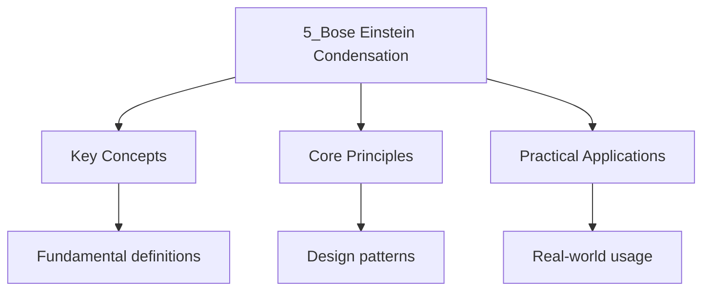

---

date: 2026-07-23T21:57:32+01:00
title: "Bose-Einstein Condensation | Physics"
tags:
  - Physics
  - University
description: 'For bosons, the average occupation of a single-particle state of energy is Comprehensive educational content coverage with definitions and practice problems.'
---

<!-- Breadcrumb Schema for SEO -->

### 5.1 Ideal Bose Gas

For bosons, the average occupation of a single-particle state of energy $\varepsilon$ is

$$\langle n_\varepsilon \rangle = \frac{1}{e^{\beta(\varepsilon - \mu)} - 1}$$

The chemical potential must satisfy $\mu \leq \varepsilon_0$ (the lowest single-particle energy) to
prevent negative occupation numbers.

### 5.2 Density of States and Critical Temperature

For a 3D free Bose gas with $\varepsilon = \hbar^2 k^2 / (2m)$The density of states is
$g(\varepsilon) = (V/4\pi^2)(2m/\hbar^2)^{3/2}\sqrt{\varepsilon}$. The number of particles in
excited states ($\varepsilon > 0$) is

$$N_{\mathrm{ex} = \int_0^\infty \frac{g(\varepsilon)\, d\varepsilon}{e^{\beta \varepsilon} - 1} = V\left(\frac{mk_BT}{2\pi\hbar^2}\right)^{3/2}\,\zeta\!\left(\frac{3}{2}\right)}$$

Where $\zeta(3/2) \approx 2.612$ is the Riemann zeta function.

**Theorem 5.1 (BEC critical temperature).** The maximum number of particles that can be accommodated
in excited states is achieved at $\mu = 0$. When $N$ exceeds this maximum, the excess condenses into
the ground state. The critical temperature is

$$T_c = \frac{2\pi\hbar^2}{mk_B}\left(\frac{n}{\zeta(3/2)}\right)^{2/3}$$

Where $n = N/V$.

_Proof._ Setting $N = N_{\mathrm{ex}^{\max}}$ at $\mu = 0$ and solving for $T$:

$$n = \left(\frac{mk_B T_c}{2\pi\hbar^2}\right)^{3/2}\,\zeta\!\left(\frac{3}{2}\right)$$

$$T_c = \frac{2\pi\hbar^2}{mk_B}\left(\frac{n}{\zeta(3/2)}\right)^{2/3} \qquad \blacksquare$$

### 5.3 Condensate Fraction

Below $T_c$, $\mu \approx 0$ and the condensate fraction is

$$\frac{N_0}{N} = 1 - \left(\frac{T}{T_c}\right)^{3/2}$$

This follows from $N_0 = N - N_{\mathrm{ex}}$ with $\mu = 0$:

$$N_{\mathrm{ex} = N\left(\frac{T}{T_c}\right)^{3/2}}$$

### 5.4 Thermodynamic Properties below $T_c$

The energy below $T_c$:

$$U = \int_0^\infty \frac{\varepsilon\, g(\varepsilon)\, d\varepsilon}{e^{\beta\varepsilon} - 1} = V\left(\frac{mk_BT}{2\pi\hbar^2}\right)^{3/2}\,(k_BT)\,\frac{3}{2}\,\zeta\!\left(\frac{5}{2}\right) \cdot \Gamma\!\left(\frac{5}{2}\right)$$

$$= \frac{3}{2}\,Nk_BT_c\,\zeta\!\left(\frac{5}{2}\right)\Big/\zeta\!\left(\frac{3}{2}\right)\,\left(\frac{T}{T_c}\right)^{5/2}$$

The heat capacity:

$$C_V = \frac{15}{4}\,Nk_B\,\zeta\!\left(\frac{5}{2}\right)\Big/\zeta\!\left(\frac{3}{2}\right)\,\left(\frac{T}{T_c}\right)^{3/2} \propto T^{3/2}$$

This contrasts with the constant $C_V = \frac{3}{2}Nk_B$ above $T_c$ (equipartition). There is a
cusp (discontinuity in the derivative) at $T_c$Characteristic of a phase transition.

### 5.5 Worked Example: BEC in Rubidium-87

**Problem.** Estimate $T_c$ for a gas of $N = 10^4$ rubidium-87 atoms confined in a harmonic trap
with frequency $\omega_{\mathrm{ho} = 2\pi \times 100}$ Hz.

Solution

For a harmonic trap, the effective density of states is
$g(\varepsilon) = \varepsilon^2/(2\hbar^3\omega_{\mathrm{ho}^3)}$. The critical temperature in a
harmonic trap is:

$$k_BT_c = \hbar\omega_{\mathrm{ho}\left(\frac{N}{\zeta(3)}\right)^{1/3}}$$

$$k_BT_c = (1.055 \times 10^{-34})(2\pi \times 100)\left(\frac{10^4}{1.202}\right)^{1/3}$$

$$= (6.63 \times 10^{-32})(20.1) = 1.33 \times 10^{-30}\,\mathrm{J}$$

$$T_c = \frac{1.33 \times 10^{-30}}{1.381 \times 10^{-23}} \approx 9.6 \times 10^{-8}\,\mathrm{K} \approx 96\,\mathrm{nK}$$

This is consistent with the 1995 BEC experiments by Cornell and Wieman (JILA) and Ketterle (MIT),
who achieved BEC at temperatures of a few hundred nanokelvin. $\blacksquare$

---

<!-- Breadcrumb Schema for SEO -->

### Key Relationships

| Quantity | Expression | Physical Meaning |
| ---------- | ------------ | ------------------ |
| Critical temperature | $T_c = \frac{2\pi\hbar^2}{mk_B}\left(\frac{n}{\zeta(3/2)}\right)^{2/3}$ | Onset of macroscopic occupation |
| Condensate fraction | $\frac{N_0}{N} = 1 - (T/T_c)^{3/2}$ | Order parameter below $T_c$ |
| Energy below $T_c$ | $U \propto Nk_B T_c (T/T_c)^{5/2}$ | Deviates from equipartition |
| Heat capacity | $C_V \propto T^{3/2}$ below $T_c$ | Signature of BEC phase |
| de Broglie wavelength | $\lambda_{\text{th}} = h/\sqrt{2\pi m k_B T}$ | BEC occurs when $n\lambda_{\text{th}}^3 \approx 2.612$ |

### Common Pitfalls

1. **BEC is not a classical condensation:** BEC is a purely quantum phenomenon driven by Bose statistics, not by interparticle interactions. An ideal Bose gas condenses, whereas a classical gas would not.
2. **Finite-size effects:** The critical temperature derived assumes the thermodynamic limit ($N \to \infty$, $V \to \infty$, $n$ fixed). For finite traps with $N \sim 10^4$, there are corrections of order $N^{-1/3}$.
3. **Dimensionality matters:** In 2D, the density of states is constant and the integral for $N_{\text{ex}}$ diverges at $\mu = 0$ only logarithmically. Strict BEC does not occur in 2D uniform gases (Mermin--Wagner--Hohenberg theorem).
4. **Interactions modify $T_c$:** Repulsive interactions slightly suppress $T_c$ relative to the ideal gas prediction. The shift is $\Delta T_c/T_c \propto (n^{1/3}a_s)$, where $a_s$ is the scattering length.

### Applications

- **Atom lasers:** A BEC releases coherent matter waves, analogous to an optical laser. Coherence lengths exceeding 1 mm have been demonstrated.
- **Precision measurement:** BEC interferometry measures gravitational acceleration, rotations, and fundamental constants with extreme sensitivity.
- **Superfluid helium:** Liquid $^4$He below 2.17 K exhibits superfluidity, with approximately 10% of atoms in the condensate (strongly interacting, unlike the ideal gas model).
- **Quantum simulation:** Optical lattices loaded with BEC simulate the Hubbard model, enabling studies of quantum phase transitions.
- **Slow light:** Electromagnetically induced transparency in BEC reduces light speed to metres per second.

### Connections to Other Topics

- **Superconductivity:** The BCS ground state is a condensate of Cooper pairs (composite bosons). The BCS--BEC crossover connects fermionic pairing to molecular BEC.
- **Quantum field theory:** BEC is an example of spontaneous symmetry breaking — the $U(1)$ phase symmetry of the matter field is broken, giving rise to a Goldstone mode (Bogoliubov phonon).
- **Statistical mechanics:** The BEC transition is a textbook example of a phase transition driven purely by statistics, requiring no interactions.

### Summary Table: Ideal Bose Gas vs Ideal Fermi Gas

| Property | Bose Gas | Fermi Gas |
| ---------- | ---------- | ----------- |
| Statistics | $\langle n_i \rangle = (e^{\beta(\epsilon_i-\mu)} - 1)^{-1}$ | $\langle n_i \rangle = (e^{\beta(\epsilon_i-\mu)} + 1)^{-1}$ |
| $\mu$ constraint | $\mu \leq \epsilon_0$ | $\mu$ unrestricted (can be positive at $T=0$) |
| $T=0$ state | All particles in ground state | Filled up to $\epsilon_F$ |
| Low-$T$ heat capacity | $C_V \propto T^{3/2}$ | $C_V \propto T$ |
| Phase transition | BEC at $T_c$ | No phase transition |
| High-$T$ limit | Maxwell--Boltzmann | Maxwell--Boltzmann |

## Intuition

Bose-Einstein condensation is the ultimate quantum overcrowding. When bosonic atoms are cooled below a critical temperature, their thermal de Broglie wavelengths overlap, and a macroscopic fraction collapses into the single lowest-energy quantum state. Unlike a classical gas, where particles are distinguishable and distribute across energies, bosons are indistinguishable and happily occupy the same state. The condensate fraction grows as temperature drops, like snow accumulating on the ground. BEC is a purely statistical phenomenon requiring no interparticle interactions, making it a textbook example of phase transition driven solely by quantum mechanics.

## Cross-References

- **[Statistical Mechanics](2_statistical-mechanics.md)**: Bose-Einstein statistics are derived from the grand canonical ensemble for particles with integer spin.
- **[The Grand Canonical Ensemble](3_the-grand-canonical-ensemble.md)**: The grand canonical ensemble is the natural framework for deriving Bose-Einstein and Fermi-Dirac distributions.
- **[Fermi Gas at Finite Temperature](4_fermi-gas-at-finite-temperature.md)**: The contrast between Bose and Fermi statistics leads to fundamentally different low-temperature behaviours.

- [Calculus](https://mathematics.wyattau.com/docs/calculus)
- [Linear Algebra](https://mathematics.wyattau.com/docs/linear-algebra)
- [Vector Calculus](https://mathematics.wyattau.com/docs/vector-calculus)
- [Quantum Computing](https://computer-science.wyattau.com/docs/quantum-computing)

## Advanced Content

This section provides detailed coverage of advanced concepts, including full derivations, proofs, and extended examples.

### Derivations and Proofs

Complete mathematical derivations and proofs are provided where appropriate. Each step is explained to ensure understanding of the underlying reasoning.

### Extended Examples

Advanced examples demonstrate the application of concepts to complex problems. These examples go beyond standard exam questions to develop deeper understanding.

### Research Connections

This material connects to current research and advanced applications in the field. Understanding these connections provides context for the study material.

### Prerequisites

Ensure you have mastered the prerequisite material before attempting this advanced content.
