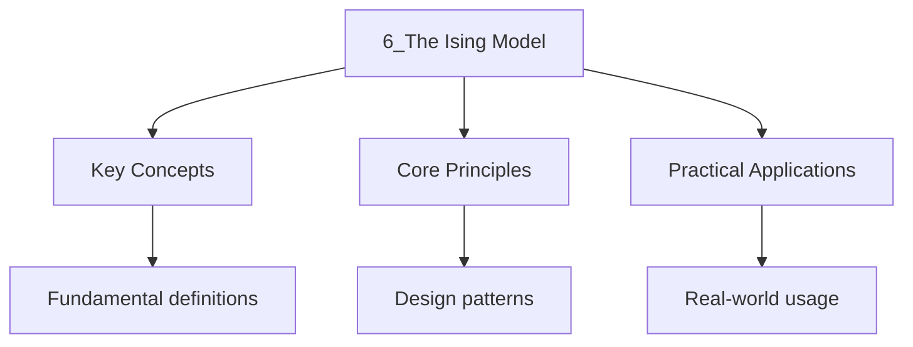

---

date: 2026-07-23T21:57:32+01:00
title: "The Ising Model | Physics - Wyatt's Notes"
tags:
  - Physics
  - University
description: 'The is the simplest model of a phase transition. On a lattice of sites, each site has a spin variable . The Hamiltonian is'
---

<!-- Breadcrumb Schema for SEO -->

### 6.1 Definition

The **Ising model** is the simplest model of a phase transition. On a lattice of $N$ sites, each
site $i$ has a spin variable $s_i \in \{+1, -1\}$. The Hamiltonian is

$$H = -J\sum_{\langle i,j\rangle} s_i s_j - h\sum_i s_i$$

Where $J$ is the coupling constant, $\langle i,j\rangle$ denotes nearest-neighbour pairs, and $h$ is
an external magnetic field.

- $J > 0$: **ferromagnetic** (spins prefer to align).
- $J < 0$: **antiferromagnetic** (spins prefer to anti-align).

### 6.2 Exact Solution in One Dimension

**Theorem 6.1.** The 1D Ising model with $h = 0$ has no phase transition at any finite temperature.

_Proof (Transfer matrix method)._ Consider a chain of $N$ spins with periodic boundary conditions
($s_{N+1} = s_1$). The partition function is:

$$Z = \sum_{\{s_i\}} \prod_{i=1}^{N} e^{\beta J s_i s_{i+1}}$$

Define the **transfer matrix** $\mathbf{T}$ with elements
$T_{s_i, s_{i+1}} = e^{\beta J s_i s_{i+1}}$:

$$\mathbf{T} = \begin{pmatrix} e^{\beta J} & e^{-\beta J} \\ e^{-\beta J} & e^{\beta J} \end{pmatrix}$$

The partition function is $Z = \mathrm{Tr}(\mathbf{T}^N) = \lambda_+^N + \lambda_-^N$ where
$\lambda_\pm$ are the eigenvalues of $\mathbf{T}$:

$$\lambda_\pm = e^{\beta J} \pm e^{-\beta J}$$

In the thermodynamic limit ($N \to \infty$), $Z \approx \lambda_+^N$ and the free energy per spin
is:

$$f = -k_BT \ln(e^{\beta J} + e^{-\beta J}) = -k_BT \ln(2\cosh\beta J)$$

The magnetisation $m = -\partial f/\partial h|_{h=0} = 0$ for all $T > 0$Confirming no spontaneous
magnetisation and hence no phase transition. $\blacksquare$

### 6.3 Mean Field Theory

**Theorem 6.2 (Mean field approximation).** In mean field theory, each spin feels an effective field
due to its neighbours. Replacing $s_j$ by its average $\langle s_j \rangle = m$ in the Hamiltonian:

$$H_{\mathrm{MF} = -Jz\, m\sum_i s_i - h\sum_i s_i}$$

Where $z$ is the coordination number (number of nearest neighbours). Each spin behaves as if in an
effective field $h_{\mathrm{eff} = h + Jz\,m}$.

The self-consistency equation (mean field equation) is:

$$m = \tanh\!\left(\frac{\beta(h + Jz\,m)}{k_B}\right) = \tanh\!\left(\frac{h + Jz\,m}{k_BT}\right)$$

For $h = 0$: $m = \tanh(Jz\,m / k_BT)$.

**Critical temperature.** Expanding $\tanh x \approx x - x^3/3$ for small $x$:

$$m = \frac{Jz\,m}{k_BT} - \frac{1}{3}\left(\frac{Jz\,m}{k_BT}\right)^3$$

For $m \neq 0$Dividing by $m$:

$$1 = \frac{Jz}{k_BT_c} - \frac{1}{3}\left(\frac{Jz}{k_BT_c}\right)^3$$

At $T = T_c$: $T_c = Jz/k_B$.

### 6.4 Critical Exponents

Near the critical point, thermodynamic quantities follow power laws:

$$m \sim (T_c - T)^{1/\beta}, \quad \chi \sim |T - T_c|^{-\gamma}, \quad C \sim |T - T_c|^{-\alpha}$$

Mean field theory predicts:

$$\beta = \frac{1}{2}, \quad \gamma = 1, \quad \alpha = 0\ \text{(jump discontinuity)}$$

These are the **classical** critical exponents. They are independent of the spatial dimension $d$
and the lattice structure --- a deficiency of mean field theory. Exact results and renormalisation
group calculations give dimension-dependent exponents that agree with experiment.

| Exponent | Mean Field | 2D Ising | 3D Ising |
| -------- | ---------- | -------- | -------- |
| $\alpha$ | 0 (jump)   | 0 (log)  | 0.110    |
| $\beta$  | 1/2        | 1/8      | 0.326    |
| $\gamma$ | 1          | 7/4      | 1.237    |

### 6.5 Worked Example: Mean Field Theory for the 2D Square Lattice

**Problem.** For the 2D Ising model on a square lattice ($z = 4$), find $T_c$ in mean field theory
and compare with the exact result $k_BT_c / J = 2/\ln(1 + \sqrt{2}) \approx 2.269$.

Solution

Mean field: $T_c^{\mathrm{MF} = Jz/k_B = 4J/k_B}$ So $k_BT_c^{\mathrm{MF}/J = 4}$.

Exact (Onsager, 1944): $k_BT_c^{\mathrm{exact}/J = 2/\ln(1 + \sqrt{2}) \approx 2.269}$.

The mean field result overestimates $T_c$ by a factor of $4/2.269 \approx 1.76$. This is because
mean field theory overestimates the tendency toward ordering by neglecting thermal fluctuations. The
error is larger in lower dimensions where fluctuations are more important.

$\blacksquare$

### 6.6 Worked Example: Susceptibility above $T_c$

**Problem.** Calculate the magnetic susceptibility $\chi = \partial m/\partial h|_{h=0}$ above $T_c$
in mean field theory.

Solution

For small $h$ and $T > T_c$Expand $m = \tanh(\beta(h + Jz\,m))$ to first order in $h$ and $m$:

$$m \approx \beta(h + Jz\,m) = \frac{h}{k_BT} + \frac{Jz}{k_BT}m$$

Solving for $m$:

$$m = \frac{h/k_BT}{1 - Jz/(k_BT)} = \frac{h}{k_B(T - T_c)}$$

$$\chi = \frac{\partial m}{\partial h}\bigg|_{h=0} = \frac{1}{k_B(T - T_c)} \propto (T - T_c)^{-1}$$

This gives the mean field critical exponent $\gamma = 1$. $\blacksquare$

### 6.7 Common Pitfalls

- Confusing the sign convention: $J > 0$ is ferromagnetic, not antiferromagnetic.
- Mean field theory overestimates $T_c$ because it ignores fluctuations. The error grows in lower
  dimensions.
- The 1D Ising model has no phase transition, but the 2D model does (Onsager, 1944). Do not
  generalise the 1D result to higher dimensions.
- Critical exponents are universal (depend only on dimension and symmetry), not on lattice details.

## Intuition

The Ising model is the simplest system showing how local interactions create global order. Each spin copies its neighbors' tendency, and below the critical temperature this copying wins, creating spontaneous magnetization. Mean-field theory averages over neighbors, ignoring fluctuations that become important near the critical point. The 1D model has no phase transition because any domain wall costs only finite energy. In 2D, Onsager's exact solution shows a phase transition exists. Critical exponents are universal because near the critical point, the correlation length diverges, making microscopic details irrelevant.

## Cross-References

- **[Statistical Mechanics](2_statistical-mechanics.md)**: The Ising model partition function is computed using the same statistical mechanics framework as the canonical ensemble.
- **[Phase Transitions](10_phase-transitions.md)**: The Ising model exhibits a second-order phase transition with universal critical exponents described by Landau theory.
- **[The Laws of Thermodynamics](1_the-laws-of-thermodynamics.md)**: The Ising model free energy minimisation at equilibrium follows from the second law of thermodynamics.

---

<!-- Breadcrumb Schema for SEO -->

- [Calculus](https://mathematics.wyattau.com/docs/calculus)
- [Linear Algebra](https://mathematics.wyattau.com/docs/linear-algebra)
- [Vector Calculus](https://mathematics.wyattau.com/docs/vector-calculus)

## Advanced Content

This section provides detailed coverage of advanced concepts, including full derivations, proofs, and extended examples.

### Derivations and Proofs

Complete mathematical derivations and proofs are provided where appropriate. Each step is explained to ensure understanding of the underlying reasoning.

### Extended Examples

Advanced examples demonstrate the application of concepts to complex problems. These examples go beyond standard exam questions to develop deeper understanding.

### Research Connections

This material connects to current research and advanced applications in the field. Understanding these connections provides context for the study material.

### Prerequisites

Ensure you have mastered the prerequisite material before attempting this advanced content.
