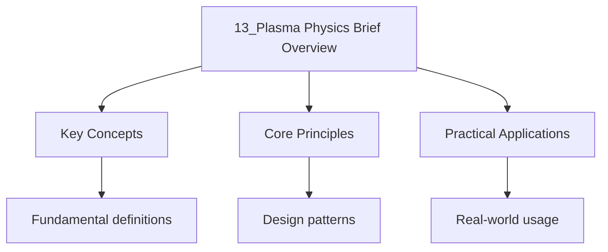

---

date: 2026-07-23T21:57:32+01:00
title: "Plasma Physics: Brief Overview"
tags:
  - Physics
  - University
description: "A plasma screens electric fields over the : Comprehensive educational content coverage with definitions, worked examples, and practice problems."
---

<!-- Breadcrumb Schema for SEO -->

### 13.1 Debye Shielding in Plasmas

A plasma screens electric fields over the **Debye length**:

$$\lambda_D = \sqrt{\frac{\varepsilon_0 k_B T}{n_e e^2}}$$

For $n_e = 10^{18}$ m$^{-3}$, $T = 10^4$ K: $\lambda_D = 7.4 \times 10^{-5}$ m $= 74\,\mu$M.

The plasma frequency:

$$\omega_p = \sqrt{\frac{n_e e^2}{m_e \varepsilon_0}}$$

For $n_e = 10^{18}$ m$^{-3}$: $\omega_p = 5.64 \times 10^{10}$ rad/s, $f_p = 8.98$ GHz. EM waves
with $\omega < \omega_p$ cannot propagate (evanescent).

### 13.2 Plasma Oscillations

Small displacements of the electron cloud create restoring forces, leading to **Langmuir waves**:

$$\omega_{\text{Langmuir} = \omega_p\left(1 + \frac{3k_BT}{2m_e}\frac{k^2}{\omega_p^2}\right)^{-1/2}}$$

At long wavelengths ($k \to 0$): $\omega \to \omega_p$ (undamped). With ion motion: the ion-acoustic
wave has $\omega^2 = k^2 c_s^2/(1 + k^2\lambda_D^2)$ where $c_s = \sqrt{k_BT/m_i}$.

## Worked Examples

### Example 1: Gauss"s law

**Problem.** A uniformly charged sphere of radius $R$ has total charge $Q$. Find $E$ inside and
outside.

**Solution.** Outside ($r > R$):
$\oint E \cdot dA = Q/\varepsilon_0 \implies E \cdot 4\pi r^2 = Q/\varepsilon_0 \implies E = \frac{Q}{4\pi\varepsilon_0 r^2}$.
Inside ($r < R$): enclosed charge $= Q(r/R)^3$. $E = \frac{Qr}{4\pi\varepsilon_0 R^3}$.

$\blacksquare$

### Example 2: Poynting vector

**Problem.** An EM wave has $E_0 = 100 \mathrm{ V/m}$ in vacuum. Find the average Poynting vector
magnitude.

**Solution.**
${\langle S \rangle = \frac{E_0^2}{2\mu_0 c} = \frac{100^2}{2 \times 4\pi \times 10^{-7} \times 3 \times 10^8} = \frac{10000}{754} \approx 13.3 \mathrm{ W/m}^2}$.

$\blacksquare$

## Common Pitfalls

- **Confusing Gauss's law applications.** Gauss’s law is most useful for systems with high symmetry
  (spherical, cylindrical, planar). **Fix:** Choose a Gaussian surface matching the symmetry; the
  flux through the surface equals the enclosed charge divided by $\varepsilon_0$.
- **Wrong Maxwell equation sign.** Faraday's law has a negative sign:
  $\nabla \times \vec{E} = -\frac{\partial \vec{B}}{\partial t}$. **Fix:** The minus sign reflects
  Lenz's law — the induced EMF opposes the change in flux.
- **Confusing $\vec{D}$ and $\vec{E}$, $\vec{H}$ and $\vec{B}$.**
  $\vec{D} = \varepsilon_0\vec{E} + \vec{P}$; $\vec{H} = \vec{B}/\mu_0 - \vec{M}$. **Fix:** In
  vacuum: $\vec{D} = \varepsilon_0\vec{E}$, $\vec{H} = \vec{B}/\mu_0$.

## Summary

- Maxwell's equations: Gauss’s law, Gauss's law for magnetism, Faraday’s law, Ampère-Maxwell law.
- Gauss's law: $\oint \vec{E} \cdot d\vec{A} = Q_{\text{enc}}/\varepsilon_0$.
- EM waves: $E_0 = cB_0$; $c = 1/\sqrt{\mu_0\varepsilon_0}$; Poynting vector
  $\vec{S} = \vec{E} \times \vec{H}/\mu_0$.
- Boundary conditions: tangential $E$ and normal $B$ are continuous across interfaces.

## Intuition

A plasma is not directly an ionised gas; it is a gas where charged particles interact collectively through long-range electromagnetic forces. The Debye length sets the scale over which electric fields are screened, and the plasma frequency sets the timescale for collective oscillations. The key insight is that a plasma behaves as a single coupled system rather than as independent particles: an electron displacement triggers a restoring force from the surrounding charge cloud, producing oscillations. Electromagnetic waves below the plasma frequency cannot propagate because the electrons respond fast enough to cancel the wave.

## Cross-References

| Topic              | Site       | Link                                                                                                          |
| ------------------ | ---------- | ------------------------------------------------------------------------------------------------------------- |
| [Electromagnetism] | A-Level    | [View](https://alevel-maths-physics.wyattau.com/docs/alevel/physics/fields/03-electromagnetism-unification)   |
| [Electromagnetism] | IB         | [View](https://ib.wyattau.com/docs/ib/physics/4-fields/4_induction)                                           |
| [Electromagnetism] | DSE        | [View](https://dse.wyattau.com/docs/dse/physics/3-electricity-and-magnetism/3_magnetism-and-electromagnetism) |
| [Electromagnetism] | University | [View](https://physics.wyattau.com/) |

- [Calculus](https://mathematics.wyattau.com/docs/calculus)
- [Linear Algebra](https://mathematics.wyattau.com/docs/linear-algebra)
- [Vector Calculus](https://mathematics.wyattau.com/docs/vector-calculus)

### 13.3 Key Relationships

| Quantity              | Formula                                    | Physical role                                            |
| --------------------- | ------------------------------------------ | -------------------------------------------------------- |
| Debye length          | $\lambda_D = \sqrt{\varepsilon_0 k_B T / n_e e^2}$ | Distance over which electric fields are screened         |
| Plasma frequency      | $\omega_p = \sqrt{n_e e^2 / m_e \varepsilon_0}$   | Natural oscillation frequency of electron gas            |
| Langmuir wave         | $\omega^2 = \omega_p^2 + 3k^2 v_{\rm th}^2$       | Electrostatic wave in unmagnetised plasma                |
| Ion-acoustic wave     | $\omega^2 = k^2 c_s^2 / (1 + k^2\lambda_D^2)$     | Low-frequency wave with ion inertia and electron pressure |
| Electron gyrofrequency| $\omega_{ce} = eB/m_e$                            | Cyclotron frequency in magnetised plasma                 |

### 13.4 Common Pitfalls

- **Confusing Debye shielding with perfect neutrality.** A plasma is quasineutral ($n_i \approx n_e$) on scales large compared to $\lambda_D$, but charge separation exists on Debye-length scales. **Fix:** Use $\lambda_D$ as the scale below which individual charges matter.
- **Assuming all EM waves propagate in a plasma.** Waves with $\omega < \omega_p$ are evanescent — they decay exponentially. **Fix:** The cut-off condition is $\omega > \omega_p$ for propagation; below $\omega_p$ the refractive index becomes imaginary.
- **Forgetting ion motion in low-frequency waves.** The ion-acoustic wave requires mobile ions; at frequencies above $\omega_{pi}$ (ion plasma frequency), ions cannot respond. **Fix:** Check whether $\omega \ll \omega_{pi}$ before using the ion-acoustic dispersion.
- **Treating Coulomb collisions as rare.** While high-temperature plasmas are often collisionless, the collision frequency scales as $T^{-3/2}$; cold, dense plasmas can be collisional. **Fix:** Compare the mean free path to system size using $\nu_{ei} \propto n_e T_e^{-3/2}$.

### 13.5 Applications

- **Fusion energy (tokamaks):** Magnetic confinement of deuterium-tritium plasmas at $T \sim 10^8$ K requires understanding of MHD stability, transport, and wave heating.
- **Space physics:** The solar wind ($n_e \sim 10^7$ m$^{-3}$, $T \sim 10^5$ K) is a plasma that interacts with Earth's magnetosphere, causing aurorae and geomagnetic storms.
- **Semiconductor processing:** Low-temperature plasmas ($T_e \sim 10^4$ K, $n_e \sim 10^{16}$ m$^{-3}$) are used for etching and deposition in microchip fabrication.
- **Radio astronomy:** Pulsar signals propagate through the interstellar medium (ISM) plasma; dispersion measurements give the column density ${\rm DM} = \int n_e\, dl$.

### 13.6 Worked Example: Debye Length in the Solar Corona

**Problem.** The solar corona has $n_e \approx 10^{14}$ m$^{-3}$ and $T \approx 10^6$ K. Compute the Debye length. How many electrons are in a Debye sphere?

**Solution.**

$$\lambda_D = \sqrt{\frac{\varepsilon_0 k_B T}{n_e e^2}} = \sqrt{\frac{(8.85\times10^{-12})(1.38\times10^{-23})(10^6)}{(10^{14})(1.6\times10^{-19})^2}}$$

$$\lambda_D \approx \sqrt{\frac{1.22\times10^{-28}}{2.56\times10^{-24}}} = \sqrt{4.77\times10^{-5}} \approx 6.9\times10^{-3}\;\mathrm{m} = 6.9\;\mathrm{mm}$$

The Debye sphere volume is $\frac{4}{3}\pi\lambda_D^3 \approx 1.38\times10^{-6}$ m$^3$, containing $N_D = n_e \cdot \frac{4}{3}\pi\lambda_D^3 \approx 10^{14} \times 1.38\times10^{-6} \approx 1.4\times10^8$ electrons. Since $N_D \gg 1$, the corona satisfies the plasma criterion for collective behaviour.

$\blacksquare$

### 13.7 Summary Table

| Regime               | Condition                 | Key behaviour                              |
| -------------------- | ------------------------- | ------------------------------------------ |
| Debye shielding      | $r > \lambda_D$           | Electric fields screened out               |
| Plasma oscillations  | $\omega \approx \omega_p$ | Collective electron oscillation (Langmuir) |
| EM wave propagation  | $\omega > \omega_p$       | Wave propagates through plasma             |
| EM wave cut-off      | $\omega < \omega_p$       | Wave is evanescent, reflected              |
| Ion-acoustic waves   | $T_e \gg T_i$             | Sound-like waves with $c_s = \sqrt{k_BT_e/m_i}$ |

## See Also

- [Electromagnetism](./)
- [Radiation from Accelerating Charges](./10_radiation-from-accelerating-charges)
- [Advanced Electrodynamics](./11_advanced-electrodynamics)

## Advanced Content

This section provides detailed coverage of advanced concepts, including full derivations, proofs, and extended examples.

### Derivations and Proofs

Complete mathematical derivations and proofs are provided where appropriate. Each step is explained to ensure understanding of the underlying reasoning.

### Extended Examples

Advanced examples demonstrate the application of concepts to complex problems. These examples go beyond standard exam questions to develop deeper understanding.

### Research Connections

This material connects to current research and advanced applications in the field. Understanding these connections provides context for the study material.

### Prerequisites

Ensure you have mastered the prerequisite material before attempting this advanced content.

## Advanced Content

This section provides detailed coverage of advanced concepts, including full derivations, proofs, and extended examples.

### Derivations and Proofs

Complete mathematical derivations and proofs are provided where appropriate. Each step is explained to ensure understanding of the underlying reasoning.

### Extended Examples

Advanced examples demonstrate the application of concepts to complex problems. These examples go beyond standard exam questions to develop deeper understanding.

### Research Connections

This material connects to current research and advanced applications in the field. Understanding these connections provides context for the study material.

### Prerequisites

Ensure you have mastered the prerequisite material before attempting this advanced content.
