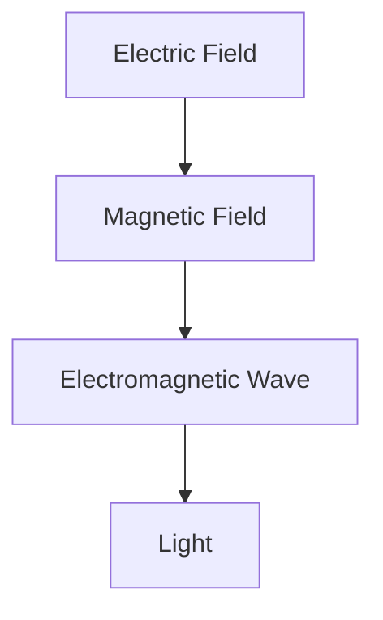

---
sources:
  - text: Halliday, Resnick, Walker - Fundamentals of Physics

sources:
  - text: Halliday, Resnick, Walker - Fundamentals of Physics

sources:
  - text: Halliday, Resnick, Walker - Fundamentals of Physics
date: 2026-07-23T21:57:32+01:00
sources:
  - text: Halliday, Resnick, Walker - Fundamentals of Physics
title: "Electromagnetism | Physics - Wyatt's Notes"
sources:
  - text: Halliday, Resnick, Walker - Fundamentals of Physics
tags:
sources:
  - text: Halliday, Resnick, Walker - Fundamentals of Physics
  - Physics
sources:
  - text: Halliday, Resnick, Walker - Fundamentals of Physics
  - University
sources:
  - text: Halliday, Resnick, Walker - Fundamentals of Physics
description: "UNIVERSITY Physics notes: Electromagnetism. Comprehensive study material with definitions, examples, and assessment tools."
sources:
  - text: Halliday, Resnick, Walker - Fundamentals of Physics
---
sources:
  - text: Halliday, Resnick, Walker - Fundamentals of Physics

<!-- Breadcrumb Schema for SEO -->

<!-- Course Schema for SEO -->

## Electromagnetism

## Contents

1. [Maxwell"s Equations](1_maxwell-s-equations)
2. [Electrostatics](2_electrostatics)
3. [Magnetostatics](3_magnetostatics)
4. [Electrodynamics](4_electrodynamics)
5. [Electromagnetic Waves](5_electromagnetic-waves)
6. [Potentials and Gauge Transformations](6_potentials-and-gauge-transformations)
7. [Special Relativity and Electromagnetism](7_special-relativity-and-electromagnetism)
8. [Problem Set](8_problem-set)
9. [Waveguides and Cavities](9_waveguides-and-cavities)
10. [Radiation from Accelerating Charges](10_radiation-from-accelerating-charges)
11. [Advanced Electrodynamics](11_advanced-electrodynamics)
12. [Special Relativity and Electromagnetism](12_special-relativity-and-electromagnetism-12)
13. [Plasma Physics: Brief Overview](13_plasma-physics-brief-overview)

## Overview

University-level electromagnetism notes covering Maxwell's equations, electrodynamics, and relativity. Electromagnetism is one of the four fundamental forces and is responsible for all electromagnetic phenomena — from the structure of atoms to the behaviour of light and the operation of electronic devices.

## Topics Covered

- **Electrostatics**: Coulomb's law, Gauss's law, potentials, boundary value problems. Electrostatics describes the fields and forces between stationary charges. The electric field E = F/q gives the force per unit charge; the electric potential V relates to work done.
- **Magnetostatics**: Biot-Savart law, Ampere's law, magnetic materials. Magnetostatics describes the fields and forces produced by steady currents. The magnetic field B exerts forces on moving charges: F = qv × B.
- **Electrodynamics**: Faraday's law, displacement current, electromagnetic waves. Electrodynamics describes how changing electric and magnetic fields produce each other. This mutual generation is the basis of electromagnetic wave propagation.
- **Relativity**: Four-vectors, Lorentz transformations, relativistic electrodynamics. Maxwell's equations are logically relativistic — electricity and magnetism are unified by special relativity. A moving charge produces both electric and magnetic fields.

## Prerequisites

- Vector calculus (divergence, curl, line integrals)
- Differential equations (ordinary and partial)
- Linear algebra (vectors, matrices)
- Basic special relativity (helpful but not required)

## How to Use These Notes

Start with Maxwell's equations to understand the foundations, then progress to electrodynamics and relativity. Each section includes worked examples and practice problems.

## Navigation

Use the sidebar to browse topics, or start with the introductory pages linked from the sidebar.

## Additional Resources

Each section includes:

- Detailed explanations of key concepts
- Worked examples with step-by-step solutions
- Practice problems with answers
- Common pitfalls and how to avoid them
- Connections to other areas of physics

## Study Tips

1. **Master Maxwell's equations**: Understand the physical meaning of each equation. Gauss's law relates electric fields to charges; Ampere's law relates magnetic fields to currents; Faraday's law describes electromagnetic induction; the displacement current completes the symmetry.
2. **Practise problems**: Work through many problems to build intuition. Electromagnetism requires careful application of vector calculus.
3. **Draw diagrams**: Visualise electric and magnetic fields. Field lines show direction and density; symmetry arguments simplify calculations.
4. **Learn symmetry arguments**: Use Gauss's law and Ampere's law effectively. High symmetry (spherical, cylindrical, planar) makes field calculations tractable.
5. **Connect to modern physics**: Relate electromagnetism to quantum electrodynamics and optics. QED is the quantum theory of electromagnetic interactions.

## Cross-References

- **[Optics and Waves](../../../../../typescript/src/content/docs/index):** Electromagnetic waves and optics; light is an electromagnetic wave.
- **[Classical Mechanics](../../../../../typescript/src/content/docs/index):** Electromagnetic forces in mechanics; charged particle dynamics.
- **[Quantum Mechanics](../../../../../typescript/src/content/docs/index):** Quantum electrodynamics; the quantum theory of electromagnetic interactions.
- **[Particle Physics](../../../../../typescript/src/content/docs/index):** The photon is the gauge boson of electromagnetism in the Standard Model.

- [Calculus](https://mathematics.wyattau.com/docs/calculus)
- [Linear Algebra](https://mathematics.wyattau.com/docs/linear-algebra)
- [Vector Calculus](https://mathematics.wyattau.com/docs/vector-calculus)
- [Quantum Computing](https://computer-science.wyattau.com/docs/quantum-computing)

## Common Mistakes

- **Confusing electric field lines with magnetic field lines:** Electric field lines start on positive charges and end on negative charges. Magnetic field lines always form closed loops because there are no magnetic monopoles. You cannot terminate a magnetic field line on a point.
- **Forgetting that changing magnetic fields create electric fields (Faraday's law):** A stationary magnet near a wire produces no EMF. Only a changing magnetic flux through a loop induces an EMF. Motion or time variation is required.
- **Applying Gauss's law without symmetry:** Gauss's law is always true, but it is only useful for computing $\mathbf{E}$ when the charge distribution has high symmetry (spherical, cylindrical, planar). Without symmetry, the surface integral is too difficult to evaluate directly.
- **Mixing up the displacement current with conduction current:** The displacement current $\varepsilon_0 \frac{\partial \mathbf{E}}{\partial t}$ is not a real current — it is a term in Ampère's law that accounts for time-varying electric fields. It has the same units as current but does not involve moving charges.

## Intuition

Electromagnetism is the force that holds atoms together, makes chemistry possible, and generates the light, radio waves, and X-rays that connect and illuminate our world. Its complete description is captured in just four equations — Maxwell's equations — which are among the most elegant and far-reaching results in all of physics. Gauss's law tells you that electric charges are the sources of electric fields. Gauss's law for magnetism tells you there are no magnetic monopoles — magnetic field lines always form closed loops. Faraday's law says that changing magnetic fields create electric fields (the basis of generators and transformers). Ampère's law with Maxwell's correction says that both currents and changing electric fields create magnetic fields.

The deepest insight of electromagnetism is that electricity and magnetism are not separate forces — they are two aspects of a single electromagnetic force, unified by special relativity. A stationary charge produces only an electric field. But move that charge, and it produces both electric and magnetic fields. The magnetic field is what you see when you look at an electric field from a different reference frame. Maxwell's equations are logically relativistic: they don't need to be modified to account for Einstein's special relativity, unlike Newton's laws. This was one of the first clues that relativity was correct.

Electromagnetic waves — light, radio, X-rays — are self-propagating disturbances: a changing electric field creates a magnetic field, which creates an electric field, and so on, travelling at the speed of light. This prediction, derived purely from Maxwell's equations, unified optics with electromagnetism and revealed that visible light is just a narrow slice of the electromagnetic spectrum. The quantum version of electromagnetism — quantum electrodynamics (QED) — is the most precisely tested theory in physics, predicting the electron's magnetic moment to twelve decimal places. Understanding classical electromagnetism is the essential foundation for everything from antenna design to particle accelerators to quantum computing.
