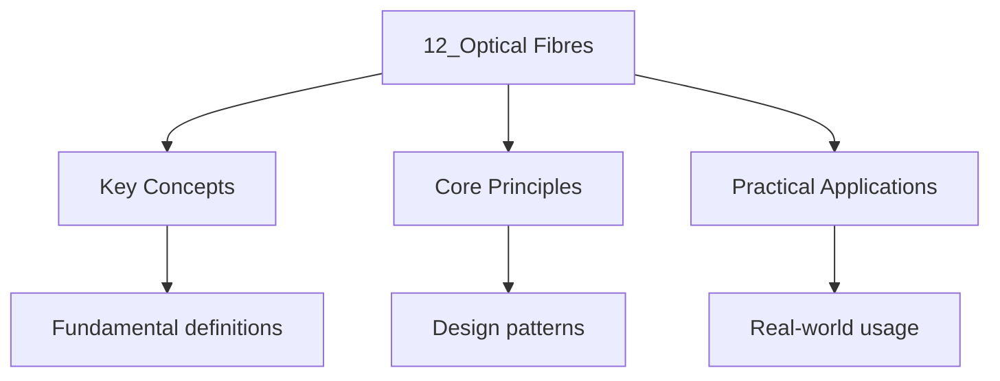

---

date: 2026-07-23T21:57:32+01:00
title: "Optical Fibres | Physics - Wyatt's Notes"
tags:
  - Physics
  - University
description: 'An optical fibre consists of a core (refractive index ) surrounded by a cladding (). Light is guided by total internal reflection.'
---

<!-- Breadcrumb Schema for SEO -->

### 12.1 Total Internal Reflection in Fibres

An optical fibre consists of a core (refractive index $n_1$) surrounded by a cladding
($n_2 \lt n_1$). Light is guided by total internal reflection.

The **numerical aperture:**

$$\mathrm{NA} = \sin\theta_{\mathrm{max}} = \sqrt{n_1^2 - n_2^2}$$

Where $\theta_{\mathrm{max}}$ is the maximum acceptance angle for light entering the fibre.

### 12.2 Modes in Optical Fibres

The number of modes supported depends on the **V-number:**

$$V = \frac{2\pi a}{\lambda}\mathrm{NA}$$

Where $a$ is the core radius.

- **Single-mode fibre:** $V \lt 2.405$. Only the fundamental HE$_{11}$ mode propagates.
- **Multimode fibre:** $V \gt 2.405$. Multiple modes propagate, causing modal dispersion.

### 12.3 Attenuation

Fibre attenuation is dominated by Rayleigh scattering ($\propto \lambda^{-4}$) and infrared
absorption peaks. The minimum attenuation for silica fibre is $\sim 0.2$ dB/km at
$\lambda \approx 1550$ nm.

### 12.4 Dispersion

Dispersion broadens optical pulses as they travel, limiting the bit rate.

**Modal dispersion** occurs in multimode fibres because different modes travel at different
speeds. This is the dominant dispersion mechanism in multimode fibres.

**Chromatic dispersion** arises from the wavelength dependence of the refractive index.
It has two components: material dispersion (due to intrinsic glass properties) and waveguide
dispersion (due to mode confinement). Standard silica fibre has zero chromatic dispersion
at $\lambda \approx 1300$ nm.

**Polarisation mode dispersion (PMD)** results from birefringence in the fibre core,
causing the two orthogonal polarisation components to travel at slightly different speeds.

### 12.5 Fibre Fabrication

Optical fibres are made by the **Modified Chemical Vapour Deposition (MCVD)** process.
A thin layer of pure silica is deposited inside a rotating silica tube by passing
SiCl$_4$ and O$_2$ through it. The tube is then collapsed into a solid preform rod
at approximately 2000 $^\circ$C.

The preform is then placed in a drawing tower, heated to its melting point, and
pulled into a thin fibre under tension. The fibre diameter is monitored precisely
to maintain a 125 $\mu$m outer diameter.

**Doping** with GeO$_2$ or P$_2$O$_5$ increases the core refractive index, while
doping with F or B$_2$O$_3$ decreases it for the cladding.

### 12.6 Fibre Types

**Step-index fibre** has a uniform core refractive index with an abrupt step at the
core-cladding boundary. **Graded-index fibre** has a core index that decreases
parabolically from the centre, reducing modal dispersion significantly.

**Photonic crystal fibres (PCFs)** use a periodic array of air holes running along
the fibre length to guide light via photonic bandgap effects. They can achieve
single-mode operation over an extremely wide wavelength range and offer very high
nonlinearity for supercontinuum generation.

**Dispersion-shifted fibre** moves the zero-dispersion wavelength to 1550 nm to
coincide with the minimum attenuation window. **Dispersion-flattened fibre** maintains
low dispersion across a broad wavelength range for WDM systems.

### 12.7 Applications

**Telecommunications** is the dominant application. Fibre links form the backbone of
the internet, using wavelength-division multiplexing (WDM) to send multiple channels
at different wavelengths on a single fibre, achieving Tb/s data rates.

**Fibre optic sensors** exploit changes in intensity, phase, polarisation, or wavelength
caused by external stimuli. Fibre Bragg gratings measure strain and temperature in
structural health monitoring of bridges, dams, and pipelines.

**Medical applications** include endoscopy (imaging via fibre bundles) and laser
surgery, where high-power laser light is delivered through thin fibres.

### Worked Example 12.1

A step-index fibre has $n_1 = 1.48$, $n_2 = 1.46$, and core radius $a = 25\ \mu$m.
Calculate the NA, acceptance angle, and V-number at $\lambda = 850$ nm.

$$\mathrm{NA} = \sqrt{1.48^2 - 1.46^2} = \sqrt{2.1904 - 2.1316} = \sqrt{0.0588} \approx 0.242$$

$$\theta_{\mathrm{max}} = \arcsin(0.242) \approx 14.0^\circ$$

$$V = \frac{2\pi \times 25 \times 10^{-6}}{850 \times 10^{-9}} \times 0.242
      = \frac{2\pi \times 25}{0.85} \times 0.242 \approx 44.7$$

Since $V \gg 2.405$, this fibre is multimode.

### Worked Example 12.2

A 50 km fibre link has attenuation 0.35 dB/km at 1310 nm. Input power is 1 mW (0 dBm).
Find the output power and the power lost.

Total loss = $0.35 \times 50 = 17.5$ dB. Output power = $0 - 17.5 = -17.5$ dBm.
Converting: $P_{\mathrm{out}} = 10^{-17.5/10} \approx 17.8\ \mu$W.
The power lost is $1\ \mathrm{mW} - 17.8\ \mu\mathrm{W} \approx 0.982\ \mathrm{mW}$.

### Practice Problems

1. A fibre has NA = 0.20 and core radius 4 $\mu$m. Determine whether it supports
   single-mode operation at 1550 nm.
2. Calculate the pulse broadening from material dispersion for a 1 nm spectral width
   pulse travelling 100 km in silica fibre with $D_m = 17$ ps/(nm$\cdot$km) at 1550 nm.
3. Explain why graded-index fibres have lower modal dispersion than step-index fibres.
4. A link operates at 2.5 Gb/s over 80 km with 0.25 dB/km attenuation and 5 dB connector
   loss. Calculate the required input power for a receiver sensitivity of -25 dBm.
5. Derive the expression for the V-number starting from the wave equation in a step-index
   fibre. What condition determines the cut-off of the first higher-order mode?

### Key Takeaways

- Total internal reflection at the core-cladding interface confines light in the fibre.
- The numerical aperture measures the light-gathering ability of the fibre.
- The V-number determines whether a fibre supports single-mode or multimode propagation.
- Attenuation sets a fundamental limit on the unrepeatered transmission distance.
- Dispersion broadens pulses and limits the data rate; different dispersion types require
  different compensation strategies.
- Fibre fabrication via MCVD and drawing produces high-quality fibres with minimal loss.

## Common Mistakes

**Mistake 1: Assuming the numerical aperture determines the number of modes**
The V-number $V = (2\pi a/\lambda)\mathrm{NA}$ determines the number of modes, not the NA alone. A fibre with large NA but small core radius may still be single-mode. Students often check only the NA without computing $V$ and incorrectly predict multimode behaviour.

**Mistake 2: Confusing attenuation with dispersion as the limiting factor for distance**
Attenuation limits the maximum unrepeatered transmission distance by reducing signal power below the detection threshold. Dispersion limits the data rate by broadening pulses until they overlap. For high-speed long-haul systems, dispersion is in standard practice the more restrictive limit. Students sometimes focus only on attenuation when designing fibre links.

**Mistake 3: Assuming the V-number threshold for single-mode operation is exactly $V = 2.405$**
The value $2.405$ is the first zero of $J_0$, which determines the cutoff of the TE$_{01}$ mode in a step-index fibre. In practice, the single-mode regime extends slightly beyond this value, and the exact cutoff depends on the fibre profile. Students should treat $V < 2.405$ as a guideline rather than a sharp boundary.

## Cross-References

- **[Geometric Optics](./6_geometric-optics.md)**: Total internal reflection and the critical angle derived in geometric optics are the guiding mechanism for light in optical fibres.
- **[Dispersion](./11_dispersion.md)**: Material and waveguide dispersion limit the data rate in fibre communication by broadening optical pulses.
- **[Electromagnetic Waves](./2_electromagnetic-waves.md)**: The wave equation and boundary conditions for electromagnetic fields in cylindrical waveguides determine the fibre modes.

- [Vector Calculus](https://mathematics.wyattau.com/docs/vector-calculus)

## Intuition

Optical fibers guide light through total internal reflection, trapping it in a core surrounded by cladding with a lower refractive index. The critical angle determines the cone of acceptance: light entering within this cone is guided, while light at steeper angles escapes. Multimode fibers allow many paths, causing pulse spreading as different modes travel different distances. Single-mode fibers restrict light to one path, eliminating this dispersion and enabling long-distance communication. The cladding is not just protective but essential for guiding, and the fiber's bending radius determines how much light leaks out.
