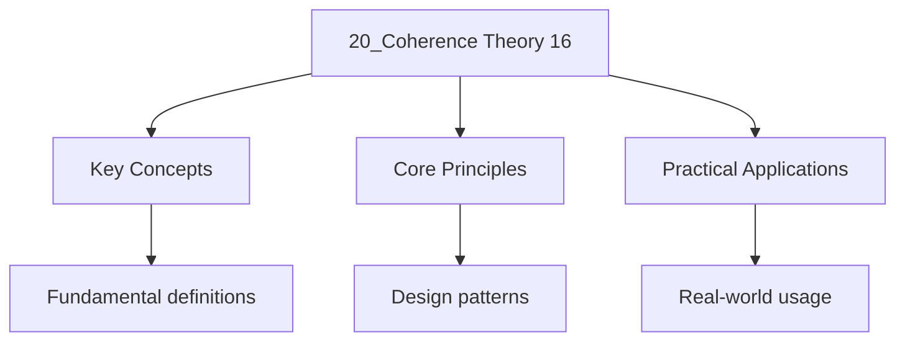

---

date: 2026-07-23T21:57:32+01:00
title: "Coherence Theory | Physics - Wyatt's Notes"
tags:
  - Physics
  - University
description: 'describes the correlation of a wave with itself at different times. The is the time over which the phase relationship is maintained.'
---

<!-- Breadcrumb Schema for SEO -->

### 16.1 Temporal Coherence

**Temporal coherence** describes the correlation of a wave with itself at different times. The
**coherence time** $\tau_c$ is the time over which the phase relationship is maintained.

For a quasi-monochromatic source with bandwidth $\Delta\omega$:

$$\tau_c \sim \frac{2\pi}{\Delta\omega} = \frac{1}{\Delta\nu}$$

The **coherence length**: $l_c = c\tau_c = \lambda^2/\Delta\lambda$.

| Source           | $\Delta\lambda$   | $l_c$            |
| ---------------- | ----------------- | ---------------- |
| White light      | $\sim 300$ nm     | $\sim 1.5\,\mu$M |
| Na D line        | $\sim 0.6$ nm     | $\sim 0.5$ mm    |
| He-Ne laser      | $\sim 0.002$ nm   | $\sim 20$ cm     |
| Stabilised laser | $\sim 10^{-6}$ nm | $\sim 400$ km    |

### 16.2 Spatial Coherence

**Spatial coherence** describes the correlation of a wave at different points in space at the same
time. The **van Cittert--Zernike theorem** states that the spatial coherence of light from an
extended incoherent source is given by the Fourier transform of the source intensity distribution:

$$\gamma(\Delta x) = \frac{\iint I(\xi, \eta)\,e^{-ik(\xi\Delta x)/(R)}\,d\xi\,d\eta}{\iint I(\xi, \eta)\,d\xi\,d\eta}$$

Where $I(\xi, \eta)$ is the source intensity distribution and $R$ is the distance to the source.

**Michelson stellar interferometer:** Uses two separated apertures to measure the spatial coherence
of starlight, from which the angular diameter of the star can be determined. The first fringe
visibility minimum occurs at:

$$d = \frac{0.61\lambda}{\alpha}$$

Where $\alpha$ is the angular diameter and $d$ is the aperture separation.

### 16.3 Degree of Coherence

The **complex degree of coherence** $\gamma_{12}(\tau)$ between fields at points 1 and 2 with time
delay $\tau$:

$$\gamma_{12}(\tau) = \frac{\langle E_1^*(t)E_2(t+\tau)\rangle}{\sqrt{\langle|E_1|^2\rangle\langle|E_2|^2\rangle}}$$

This satisfies $0 \leq |\gamma_{12}| \leq 1$. The **visibility** of interference fringes is:

$$V = \frac{I_{\max} - I_{\min}}{I_{\max} + I_{\min}} = |\gamma_{12}|$$

### 16.4 Key Relationships

| Coherence property | Measured by                 | Determined by               | Typical value                |
| ------------------ | --------------------------- | --------------------------- | ---------------------------- |
| Temporal           | Coherence time $\tau_c$     | Source bandwidth $\Delta\nu$ | $10^{-9}$ s (white light)    |
| Temporal           | Coherence length $l_c$      | Source bandwidth $\Delta\lambda$ | $1.5\ \mu$m (white light) |
| Spatial            | Coherence area $A_c$        | Source size and distance    | $(\lambda R / w)^2$          |
| Mutual coherence   | $\Gamma_{12}(\tau)$         | Both spatial and temporal   | Depends on source geometry   |

### 16.5 Common Pitfalls

- **Confusing temporal and spatial coherence.** Temporal coherence depends on the source bandwidth;
  spatial coherence depends on the source size. A laser has high temporal coherence (narrow
  linewidth) but can have low spatial coherence if operated in multi-mode.
- **Assuming a point source gives infinite coherence.** A true point source gives perfect spatial
  coherence, but any real source has finite size. The van Cittert--Zernike theorem quantifies the
  trade-off.
- **Forgetting that fringe visibility depends on both polarisation and coherence.** Two beams with
  orthogonal polarisations produce no interference even if spatially and temporally coherent.
- **Thinking the coherence length is the maximum path difference for fringes.** While related, the
  visibility decreases gradually; the coherence length is defined as the path difference
  where visibility drops to $1/e$ or $1/2$.

### 16.6 Applications

- **Holography:** Requires high temporal and spatial coherence to record interference patterns
  between object and reference beams. Lasers are essential because of their long coherence length.
- **Optical coherence tomography (OCT):** Uses low-coherence interferometry to image subsurface
  tissue structure. The short coherence length of broadband light provides micron-scale axial
  resolution.
- **LIDAR:** Coherent LIDAR uses temporal coherence for Doppler velocity measurement of remote
  targets. The coherence length determines the maximum range.
- **Radio astronomy:** Very Long Baseline Interferometry (VLBI) uses spatial coherence across
  telescope arrays separated by thousands of kilometres to achieve angular resolution of
  micro-arcseconds.

Worked Example 16.1: Double-Slit with Extended Source

A double-slit experiment uses an extended source of width $w$ at distance $D$ from the slits (slit
separation $d$).

By the van Cittert--Zernike theorem, the spatial coherence at the slits is:

$$|\gamma| = \left|\frac{\sin(\pi wd/(\lambda D))}{\pi wd/(\lambda D)}\right|$$

The fringe visibility vanishes when $\pi wd/(\lambda D) = \pi$I.e., $d = \lambda D/w$.

For a candle flame ($w \approx 1$ mm) at $D = 1$ m with $\lambda = 550$ nm:

$$d_{\text{max} = \frac{550 \times 10^{-9} \times 1}{10^{-3}} = 5.5 \times 10^{-4}\,\text{m} = 0.55\,\text{mm}}$$

Beyond this slit separation, the fringes wash out. For a star ($w \sim 10^8$ km, $D \sim 10^{14}$
km):

$$d_{\text{max} = \frac{550 \times 10^{-9} \times 10^{17}}{10^{11}} = 550\,\text{m}}$$

This is the basis of the Michelson stellar interferometer: by measuring $d_{\text{max}}$The stellar
diameter is determined.

### 16.7 Worked Examples

**Problem 1.** A Michelson interferometer uses a sodium lamp ($\lambda = 589$ nm, $\Delta\lambda = 0.6$ nm).
What is the maximum path difference for visible fringes?

**Solution.** Coherence length $l_c = \lambda^2 / \Delta\lambda = (589)^2 / 0.6 \approx 578,000$ nm
$\approx 0.58$ mm. Fringes are visible for path differences up to roughly $l_c$, so the maximum
path difference is about 0.58 mm. Beyond this, the temporal coherence is insufficient and fringe
visibility drops to zero. $\blacksquare$

**Problem 2.** Two slits are separated by $d = 0.5$ mm and illuminated by a thermal source of width
$w = 0.2$ mm at distance $D = 50$ cm ($\lambda = 550$ nm). Find the fringe visibility.

**Solution.** Using van Cittert--Zernike: $|\gamma| = |\sin(\pi w d/(\lambda D)) / (\pi w d/(\lambda D))|$.
$\pi w d/(\lambda D) = \pi \times 2\times10^{-4} \times 5\times10^{-4} / (5.5\times10^{-7} \times 0.5)$
$= \pi \times 10^{-7} / (2.75\times10^{-7}) = \pi \times 0.364 = 1.143$ rad. $|\gamma| = |\sin(1.143)/1.143| = 0.81/1.143 = 0.709$.
Fringe visibility $V = 0.71$ (71%). $\blacksquare$

## Intuition

Coherence theory bridges the gap between perfectly monochromatic waves and reality. Temporal coherence measures how long a wave maintains predictable phase, like how long a singer holds a steady note. Spatial coherence measures how correlated the phase is across different points, like how synchronised a crowd of clappers is. The van Cittert-Zernike theorem is the central insight: even an incoherent source produces spatial coherence over a finite area, and the coherence width is inversely proportional to source size. This is why starlight, despite originating from an incoherent source, can produce interference fringes.

## Cross-References

- [Fourier Optics](19_fourier-optics-15) -- The Abbe theory of microscopy and spatial filtering depend directly on the coherence properties developed in this chapter.
- [Lasers](9_lasers) -- Laser linewidth determines temporal coherence; single-mode lasers achieve long coherence lengths essential for interferometry.
- [Common Pitfalls in Optics](18_common-pitfalls) -- Confusing temporal and spatial coherence and misidentifying coherence length are among the most common errors in optics.

- [Calculus](https://mathematics.wyattau.com/docs/calculus)
- [Linear Algebra](https://mathematics.wyattau.com/docs/linear-algebra)

## Advanced Content

This section provides detailed coverage of advanced concepts, including full derivations, proofs, and extended examples.

### Derivations and Proofs

Complete mathematical derivations and proofs are provided where appropriate. Each step is explained to ensure understanding of the underlying reasoning.

### Extended Examples

Advanced examples demonstrate the application of concepts to complex problems. These examples go beyond standard exam questions to develop deeper understanding.

### Research Connections

This material connects to current research and advanced applications in the field. Understanding these connections provides context for the study material.

### Prerequisites

Ensure you have mastered the prerequisite material before attempting this advanced content.
