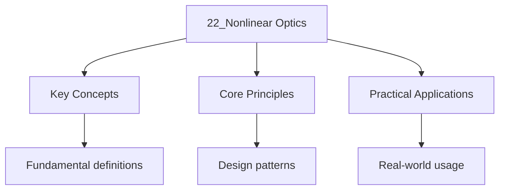

---

date: 2026-07-23T21:57:32+01:00
title: "Nonlinear Optics | Physics - Wyatt's Notes"
tags:
  - Physics
  - University
description: 'When the electric field is strong (e.g., laser), the polarisation develops nonli Comprehensive educational content coverage with definitions and practice proble'
---

<!-- Breadcrumb Schema for SEO -->

### 18.1 Nonlinear Polarisation

When the electric field is strong (e.g., laser), the polarisation develops nonlinear terms:

$$P = \varepsilon_0(\chi^{(1)}E + \chi^{(2)}E^2 + \chi^{(3)}E^3 + \cdots)$$

The second-order susceptibility $\chi^{(2)}$ is nonzero only in non-centrosymmetric media. The
third-order $\chi^{(3)}$ exists in all media.

### 18.2 Second Harmonic Generation (SHG)

A beam of frequency $\omega$ generates light at $2\omega$. The intensity of the second harmonic:

$$I_{2\omega} = \frac{2\omega^2 d_{\text{eff}^2 I_\omega^2 L^2}{n_\omega^2 n_{2\omega} c^3 \varepsilon_0}\,\text{sinc}^2\!\left(\frac{\Delta k\,L}{2}\right)}$$

Where $d_{\text{eff} = \chi^{(2)}/2}$ is the effective nonlinear coefficient and
$\Delta k = k_{2\omega} - 2k_\omega$ is the phase mismatch.

**Phase matching:** Maximum conversion occurs when $\Delta k = 0$ (momentum conservation).
Techniques:

- **Birefringent phase matching:** Exploit the different refractive indices for ordinary and
  extraordinary polarisations.
- **Quasi-phase matching:** Periodically pole the nonlinear crystal to reverse the sign of
  $\chi^{(2)}$ every coherence length $\pi/\Delta k$.

### 18.3 Other Nonlinear Processes

| Process                    | Order        | Description                                              |
| -------------------------- | ------------ | -------------------------------------------------------- |
| SHG                        | $\chi^{(2)}$ | $\omega + \omega \to 2\omega$                            |
| SFG                        | $\chi^{(2)}$ | $\omega_1 + \omega_2 \to \omega_3$                       |
| Pockels effect             | $\chi^{(2)}$ | Linear electro-optic effect ($\Delta n \propto E$)       |
| Optical Kerr effect        | $\chi^{(3)}$ | $n = n_0 + n_2 I$ (intensity-dependent refractive index) |
| Self-focusing              | $\chi^{(3)}$ | Beam collapses when $P > P_{\text{cr}}$                  |
| Two-photon absorption      | $\chi^{(3)}$ | Simultaneous absorption of two photons                   |
| Stimulated Raman/Brillouin | $\chi^{(3)}$ | Inelastic scattering amplification                       |

**Self-phase modulation:** The Kerr effect causes $\Delta n = n_2 I$ which broadens the spectrum of
ultrashort pulses. Combined with dispersion, this leads to **soliton** formation in optical fibres
(a balance between Kerr self-focusing and anomalous dispersion).

Worked Example 18.1: Phase Matching in BBO Crystal

Beta-barium borate (BBO) is a common nonlinear crystal for SHG of 800 nm Ti:sapphire laser light.

The relevant refractive indices at $\lambda = 800$ nm ($\omega$) and $\lambda = 400$ nm ($2\omega$):

$n_o(800\,\text{nm}) = 1.6549$, $n_e(800\,\text{nm}) = 1.5425$ (at $\theta = 29.2°$)

$n_o(400\,\text{nm}) = 1.7030$, $n_e(400\,\text{nm}) = 1.5665$ (at $\theta = 29.2°$)

For Type I phase matching ($o + o \to e$): $n_e(2\omega, \theta) = n_o(\omega)$.

Using Sellmeier equations, the phase matching angle is found to be
$\theta_{\text{PM} \approx 29.2°}$.

The coherence length without phase matching:

$$\ell_c = \frac{\pi}{\Delta k} = \frac{\lambda}{4(n_e^{2\omega} - n_o^{\omega})}$$

For typical values: $\ell_c \sim 5$ $\mu$M. A 1 mm crystal is $\sim 200$ coherence lengths long, so
phase matching is essential.

The conversion efficiency for perfect phase matching with a 10 mm crystal at $I_\omega = 100$
MW/cm$^2$:

$$\eta \approx \frac{8\pi^2 \times (2.0 \times 10^{-12})^2 \times 10^{-4} \times 10^{10}}{(1.6)^3 \times (400 \times 10^{-9})^2 \times 3 \times 10^8 \times 8.85 \times 10^{-12}} \approx 15\%$$

### Key Relationships

| Effect | Susceptibility | Key Formula | Condition |
| -------- | --------------- | ------------- | ----------- |
| Linear optics | $\chi^{(1)}$ | $P = \varepsilon_0 \chi^{(1)} E$ | Weak fields |
| SHG | $\chi^{(2)}$ | $I_{2\omega} \propto d_{\text{eff}}^2 I_\omega^2 L^2 \,\text{sinc}^2(\Delta k L/2)$ | Phase matching |
| Pockels effect | $\chi^{(2)}$ | $\Delta n = n_0^3 r E / 2$ | Non-centrosymmetric |
| Kerr effect | $\chi^{(3)}$ | $n = n_0 + n_2 I$ | All media |
| Self-focusing | $\chi^{(3)}$ | $P_{\text{cr}} = \pi(0.61)^2 \lambda^2/(8n_0 n_2)$ | $P > P_{\text{cr}}$ |

### Common Pitfalls

1. **Phase matching is essential:** Without phase matching, the second-harmonic signal oscillates with crystal length, with the maximum efficiency at the coherence length $\ell_c = \pi/\Delta k$. Beyond $\ell_c$, back-conversion reduces the output.
2. **$\chi^{(2)}$ requires non-centrosymmetry:** In centrosymmetric media, all even-order nonlinearities vanish. Do not attempt SHG in glasses or cubic crystals like silicon without symmetry-breaking interfaces.
3. **Kerr effect saturates at high intensity:** The simple relation $n = n_0 + n_2 I$ holds only for $I \ll I_{\text{sat}}$. At very high intensities, saturation, multiphoton absorption, and plasma generation modify the response.
4. **Group velocity mismatch:** For ultrashort pulses, the difference in group velocities between $\omega$ and $2\omega$ limits the interaction length. The walk-off length $L_{\text{walk-off}} = \tau_p / |v_g^{-1}(\omega) - v_g^{-1}(2\omega)|$ must exceed the crystal length.

### Applications

- **Laser frequency conversion:** SHG converts near-infrared Ti:sapphire laser output (800 nm) to blue/UV (400 nm). Sum-frequency generation produces tunable UV sources.
- **Electro-optic modulators:** The Pockels effect enables high-speed optical modulators ($>40$ GHz) for fibre-optic communications, using crystals like LiNbO$_3$.
- **Ultrashort pulse generation:** Kerr lens mode-locking (KLM) in Ti:sapphire lasers produces femtosecond pulses via self-focusing combined with an aperture.
- **Supercontinuum generation:** Extreme spectral broadening in photonic crystal fibres, driven by self-phase modulation and soliton dynamics, produces octave-spanning spectra for frequency metrology.
- **Quantum optics:** Spontaneous parametric down-conversion (SPDC) generates entangled photon pairs for quantum cryptography and quantum computing.

### Connections to Other Topics

- **Quantum optics:** SPDC is the workhorse for generating entangled photon pairs. The $\chi^{(2)}$ nonlinearity couples the vacuum field to signal and idler photons.
- **Femtosecond laser physics:** The Kerr effect enables mode-locking, while self-phase modulation broadens the spectrum to support ultrashort pulses.
- **Solid-state physics:** The nonlinear susceptibility tensor reflects crystal symmetry. Group theory determines which tensor components are nonzero for each crystal class.
- **Condensed matter:** The electro-optic effect is used to characterise ferroelectric materials and domain structures.

### Summary Table: Nonlinear Processes by Order

| Order | Process | Application | Crystal Requirement |
| ------- | --------- | ------------- | ------------------- |
| $\chi^{(1)}$ | Linear refraction/absorption | Ordinary optics | Any |
| $\chi^{(2)}$ | SHG, SFG, DFG, Pockels | Frequency conversion, modulators | Non-centrosymmetric |
| $\chi^{(2)}$ | SPDC | Entangled photon pairs | Non-centrosymmetric |
| $\chi^{(3)}$ | Kerr effect, SPM, XPM | Mode-locking, supercontinuum | All media |
| $\chi^{(3)}$ | SRS, SBS | Amplifiers, lasers | All media |
| $\chi^{(3)}$ | Two-photon absorption | Microscopy, lithography | All media |
| $\chi^{(3)}$ | Self-focusing | Filamentation, damage | All media ($n_2 > 0$) |

## Intuition

Linear optics assumes the medium's response is proportional to the applied field, but at high intensities, nonlinear effects emerge. The second-order nonlinearity generates harmonics at twice the frequency, used in green laser pointers. Third-order effects include self-focusing, where a beam modifies the refractive index and collapses under its own intensity. Phase matching ensures that nonlinear contributions add constructively over the interaction length. Four-wave mixing and parametric amplification enable optical frequency conversion and amplification. These effects are weak at ordinary light levels but become dominant in focused laser beams, opening applications from frequency doubling to optical computing.

## Cross-References

- [Lasers](9_lasers) -- High-intensity laser light is the primary driver of nonlinear optical effects; mode-locked lasers produce the peak powers needed for SHG and Kerr lensing.
- [Coherence Theory](20_coherence-theory-16) -- Phase matching in nonlinear crystals requires coherence between the fundamental and harmonic fields.
- [Fourier Optics](19_fourier-optics-15) -- Spatial filtering and beam propagation in nonlinear media use the Fourier transform relationship between near and far fields.

- [Calculus](https://mathematics.wyattau.com/docs/calculus)
- [Linear Algebra](https://mathematics.wyattau.com/docs/linear-algebra)
- [Vector Calculus](https://mathematics.wyattau.com/docs/vector-calculus)
- [Quantum Computing](https://computer-science.wyattau.com/docs/quantum-computing)
