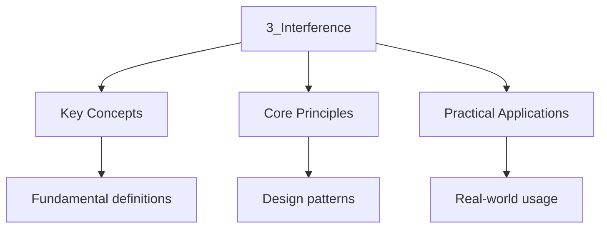

---

date: 2026-07-23T21:57:32+01:00
title: "Interference | Physics - Wyatt's Notes"
tags:
  - Physics
  - University
description: "Study notes for Interference with worked examples, practice problems, and key concepts for exam preparation."
---

<!-- Breadcrumb Schema for SEO -->

### 3.1 Superposition Principle

When two or more waves overlap, the resultant displacement is the sum of the individual
displacements. For two coherent waves with amplitudes $E_1$ and $E_2$:

$$E = E_1 + E_2 = E_0 \cos(\mathbf{k}\cdot\mathbf{r} - \omega t + \phi_1) + E_0 \cos(\mathbf{k}\cdot\mathbf{r} - \omega t + \phi_2)$$

The time-averaged intensity is:

$$I = I_1 + I_2 + 2\sqrt{I_1 I_2}\cos\Delta\phi$$

Where $\Delta\phi = \phi_2 - \phi_1$ is the phase difference.

### 3.2 Double-Slit Interference (Young"s Experiment)

Two slits separated by distance $d$ are illuminated by coherent light of wavelength $\lambda$. The
Screen is at distance $L \gg d$.

**Condition for bright fringes (constructive interference):**

$$d\sin\theta = m\lambda, \quad m = 0, \pm 1, \pm 2, \ldots$$

**Condition for dark fringes (destructive interference):**

$$d\sin\theta = \left(m + \frac{1}{2}\right)\lambda, \quad m = 0, \pm 1, \pm 2, \ldots$$

**Derivation.** The path difference between the two slits is $\Delta = d\sin\theta$. Constructive
Interference occurs when $\Delta = m\lambda$ (phase difference $2m\pi$), and destructive when
$\Delta = (m + 1/2)\lambda$ (phase difference $(2m+1)\pi$). $\blacksquare$

The fringe spacing on the screen:

$$\Delta y = \frac{\lambda L}{d}$$

Worked Example: Double-slit fringe calculation

**Problem.** In a Young"s double-slit experiment, light of wavelength $\lambda = 550$ nm passes
Through slits separated by $d = 0.10$ mm onto a screen at $L = 2.0$ m. Find (a) the fringe spacing,
(b) the angular position of the third bright fringe, and (c) the total number of bright fringes
Visible within the central diffraction maximum (slit width $a = 0.020$ mm).

**Solution.**

(a) $\Delta y = \lambda L/d = (550 \times 10^{-9})(2.0)/(0.10 \times 10^{-3}) = 11.0 \times 10^{-3}$
m $= 11.0$ mm.

(b)
$d\sin\theta_3 = 3\lambda \implies \sin\theta_3 = 3(550 \times 10^{-9})/(0.10 \times 10^{-3}) = 0.0165$
$\theta_3 = 0.945°$.

(c) The diffraction envelope has its first minimum at
$\sin\theta = \lambda/a = 550/20 = 27.5 \times 10^{-3}$ Corresponding to interference order
$m = d\sin\theta/\lambda = (d/a) = 0.10/0.020 = 5$. Missing orders at $m = \pm 5, \pm 10, \ldots$.
Visible bright fringes: $m = 0, \pm 1, \pm 2, \pm 3, \pm 4$ Giving 9 bright fringes within the
central maximum.

### 3.3 Thin-Film Interference

Light reflecting from a thin film of thickness $t$ and refractive index $n$ undergoes interference
Between the wave reflected from the top surface and the wave reflected from the bottom surface.

**Path difference:** $2nt\cos\theta_t$ where $\theta_t$ is the angle of refraction inside the film.

A phase shift of $\pi$ occurs upon reflection from a medium of higher refractive index. The
condition For constructive interference (bright reflection) is:

$$2nt\cos\theta_t = \left(m + \frac{1}{2}\right)\lambda \quad \mathrm{(one\ phase\ shift)}$$

$$2nt\cos\theta_t = m\lambda \quad \mathrm{(zero\ or\ two\ phase\ shifts)}$$

:::caution
A reflection from Low-to-high refractive index introduces a $\pi$ shift; high-to-low does not. For a
soap film in Air, there is one $\pi$ shift (at the top surface). For a coating on glass
($n_{\mathrm{coat} \lt n_{\mathrm{glass}}}$), there is also one shift. The conditions for
constructive and destructive interference swap depending on whether the total number of shifts is
odd or even.

Worked Example: Anti-reflection coating design

**Problem.** Magnesium fluoride ($n = 1.38$) is used as an anti-reflection coating on a glass lens
($n_{\mathrm{glass} = 1.52}$). Find the minimum coating thickness for destructive interference in
Reflected light at $\lambda = 550$ nm (normal incidence).

**Solution.** At the air-coating interface (low to high $n$): $\pi$ phase shift. At the
coating-glass interface (low to high $n$): $\pi$ phase shift. Total: two phase shifts $\equiv$ zero
net phase shift from reflections.

For destructive interference (dark reflection) with zero net phase shift: $2nt = (m + 1/2)\lambda$.

Minimum thickness ($m = 0$): $t = \lambda/(4n) = 550/(4 \times 1.38) = 99.6$ nm.

This is the standard quarter-wave anti-reflection coating design.

Worked Example: Soap film colours

**Problem.** A soap film ($n = 1.33$) of thickness $t = 300$ nm is illuminated by white light at
Normal incidence. Which visible wavelengths are strongly reflected?

**Solution.** Air-soap (low to high): one $\pi$ phase shift. Soap-air (high to low): no shift.
Total: one phase shift. Constructive: $2nt = (m + 1/2)\lambda$.

$\lambda = 2nt/(m + 1/2) = 2(1.33)(300)/(m + 1/2) = 798/(m + 1/2)$ nm.

$m = 0$: $\lambda = 1596$ nm (infrared, not visible). $m = 1$: $\lambda = 798/1.5 = 532$ nm (green,
visible). $m = 2$: $\lambda = 798/2.5 = 319$ nm (ultraviolet, not visible).

The film appears green in reflected light.

### 3.4 Michelson Interferometer

A beam splitter divides light into two beams that travel perpendicular paths and recombine. The path
Difference $\Delta = 2(d_1 - d_2)$ determines the interference pattern.

Moving mirror $M_1$ by distance $\Delta d$ shifts the pattern by $m = 2\Delta d / \lambda$ fringes.

The Michelson interferometer is used for precise length measurements, the determination of
Refractive indices, and was historically crucial in establishing the invariance of the speed of
Light (Michelson-Morley experiment).

Worked Example: Michelson interferometer mirror displacement

**Problem.** A Michelson interferometer uses a HeNe laser ($\lambda = 632.8$ nm). When one mirror Is
displaced, 2000 fringes cross a reference point. How far was the mirror moved?

**Solution.** Each fringe corresponds to a path difference change of $\lambda$. Moving the mirror by
$\Delta d$ changes the path difference by $2\Delta d$:

$m = 2\Delta d/\lambda \implies \Delta d = m\lambda/2 = 2000 \times 632.8 \times 10^{-9}/2 = 6.328 \times 10^{-4}$
m $= 0.633$ mm.

### 3.5 Coherence Length and Fringe Visibility

The **fringe visibility** (or contrast) quantifies the sharpness of interference fringes:

$$\mathcal{V} = \frac{I_{\max} - I_{\min}}{I_{\max} + I_{\min}}$$

For two-beam interference with intensities $I_1$, $I_2$ and degree of temporal coherence $|\gamma|$:

$$\mathcal{V} = \frac{2\sqrt{I_1 I_2}}{I_1 + I_2}\,|\gamma(\tau)|$$

For equal intensities ($I_1 = I_2$): $\mathcal{V} = |\gamma(\tau)|$.

The coherence function decays with path difference. For a Gaussian spectral profile of width
$\Delta\lambda$:

$$|\gamma(\tau)| = \exp\!\left[-\pi\left(\frac{\Delta\lambda \cdot \Delta x}{\lambda^2}\right)^2\right]$$

Where $\Delta x = c\tau$ is the path difference. Fringes become unresolvable when
$\Delta x \approx \lambda^2/\Delta\lambda = L_c$The **coherence length**.

**Implication for interferometry.** To observe interference fringes, the path difference between The
two arms must satisfy $\Delta x \ll L_c$. A sodium lamp ($\Delta\lambda \approx 0.6$ nm at
$\lambda = 589$ nm) gives $L_c \approx 0.58$ mm. A HeNe laser ($\Delta\lambda \approx 10^{-6}$ nm)
Gives $L_c \approx 350$ m — fringes are visible over enormous path differences.

### 3.6 Multiple-Beam Interference: The Fabry-Perot Etalon

A **Fabry-Perot etalon** consists of two parallel, partially reflecting surfaces separated by
Distance $d$. Multiple reflections create many beams that interfere, producing sharp transmission
Peaks.

For a lossless etalon with reflectance $R$ and transmittance $T = 1 - R$Illuminated at angle
$\theta$ inside a medium of refractive index $n$:

$$\frac{I_T}{I_0} = \frac{T^2}{(1 - R)^2 + 4R\sin^2(\delta/2)} = \frac{1}{1 + F\sin^2(\delta/2)}$$

Where $\delta = (4\pi/\lambda)\,nd\cos\theta$ is the round-trip phase and $F = 4R/(1-R)^2$ is the
**coefficient of finesse**.

**Transmission maxima** occur when $\delta = 2m\pi$ ($m = 0, 1, 2, \ldots$), i.e.,
$2nd\cos\theta = m\lambda$.

**Finesse:**

$$\mathcal{F} = \frac{\pi\sqrt{F}}{2} = \frac{\pi\sqrt{R}}{1 - R}$$

The finesse determines the sharpness of the peaks: higher $R$ gives sharper peaks.

**Free spectral range** (frequency spacing between adjacent peaks):

$$\Delta\nu_{\mathrm{FSR} = \frac{c}{2nd}}$$

**Resolving power:**

$$\mathcal{R} = \frac{\lambda}{\delta\lambda} = m\mathcal{F}$$

Worked Example: Fabry-Perot resolving power

**Problem.** A Fabry-Perot etalon has plate separation $d = 1.00$ mm, refractive index $n = 1.00$
And reflectance $R = 0.90$. Find the finesse, free spectral range, and minimum resolvable wavelength
Difference at $\lambda = 500$ nm (normal incidence).

**Solution.** Finesse: $\mathcal{F} = \pi\sqrt{0.90}/(1 - 0.90) = \pi(0.949)/0.10 = 29.8$.

Free spectral range:
$\Delta\nu_{\mathrm{FSR} = c/(2nd) = (3 \times 10^8)/(2 \times 1.00 \times 10^{-3}) = 1.50 \times 10^{11}}$
Hz.

Order number: $m = 2nd/\lambda = 2(1.00)(1.00 \times 10^{-3})/(500 \times 10^{-9}) = 4000$.

Resolving power: $\mathcal{R} = m\mathcal{F} = 4000 \times 29.8 = 1.19 \times 10^5$.

Minimum resolvable wavelength:
$\delta\lambda = \lambda/\mathcal{R} = 500/1.19 \times 10^5 = 4.20 \times 10^{-3}$ nm $= 4.20$ pm.

## Intuition

Interference occurs when two or more coherent waves overlap and their amplitudes add, producing regions of constructive and destructive combination. The path difference between the waves determines whether peaks align with peaks (bright) or peaks align with troughs (dark). Young's double slit demonstrates that light from a single source, split and recombined, produces a fringe pattern whose spacing depends on wavelength and geometry. A Fabry-Perot etalon uses multiple reflections between parallel mirrors to create extremely narrow transmission peaks, acting like a spectral magnifying glass. The finesse quantifies how sharp these peaks are, determined by how reflective the mirrors are.
:::

### 3.7 Common Mistakes

**Mistake 1: Confusing path difference with phase difference**
Path difference $\Delta$ and phase difference $\Delta\phi$ are related by $\Delta\phi = 2\pi\Delta/\lambda$, not $\Delta\phi = \Delta/\lambda$. A path difference of one wavelength corresponds to a phase difference of $2\pi$, not $1$. Students often drop the factor of $2\pi$ when converting between the two, leading to incorrect fringe conditions.

**Mistake 2: Forgetting phase shifts upon reflection in thin-film interference**
When light reflects from a medium with higher refractive index, it undergoes a $\pi$ phase shift. This changes the conditions for constructive and destructive interference. Forgetting this phase shift leads to predicting bright fringes where dark fringes appear (or vice versa). Always count the total number of $\pi$ shifts before applying the interference conditions.

**Mistake 3: Assuming interference requires two separate sources**
Interference can occur with a single source split and recombined (as in Young's double slit or a Michelson interferometer). The key requirement is coherence, not separate sources. Even with two independent sources, interference is only observable if the sources are coherent (same frequency and fixed phase relationship). Thermal light sources are incoherent and do not produce stable interference patterns.

## Cross-References

- **[The Wave Equation](1_the-wave-equation)**: Interference arises from the superposition principle applied to solutions of the wave equation.
- **[Maxwell's Equations](../3-electromagnetism/1_maxwell-s-equations)**: Electromagnetic waves obey Maxwell's equations, and interference patterns are observed in their superposition.
- **[Coherence Theory](8_coherence)**: Coherence theory explains the conditions under which stable interference patterns can be observed.
- [Vector Calculus](https://mathematics.wyattau.com/docs/vector-calculus)
- [Linear Algebra](https://mathematics.wyattau.com/docs/linear-algebra)
- [Quantum Computing](https://computer-science.wyattau.com/docs/quantum-computing)
