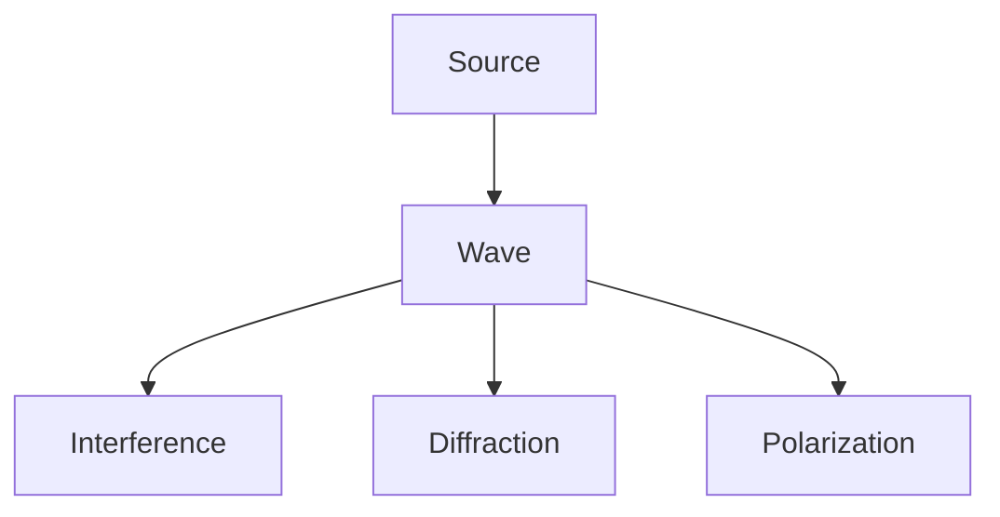

---
sources:
  - text: Halliday, Resnick, Walker - Fundamentals of Physics

sources:
  - text: Halliday, Resnick, Walker - Fundamentals of Physics

sources:
  - text: Halliday, Resnick, Walker - Fundamentals of Physics
date: 2026-07-23T21:57:32+01:00
sources:
  - text: Halliday, Resnick, Walker - Fundamentals of Physics
title: "Optics and Wave Physics - Wyatt's Notes"
sources:
  - text: Halliday, Resnick, Walker - Fundamentals of Physics
tags:
sources:
  - text: Halliday, Resnick, Walker - Fundamentals of Physics
  - Physics
sources:
  - text: Halliday, Resnick, Walker - Fundamentals of Physics
  - University
sources:
  - text: Halliday, Resnick, Walker - Fundamentals of Physics
description: "1. 2. 3. 4. 5. 6. 7. 8. 9. 10. 11. 12. 13. 14. 15. 16. 17. 18. 19. 20. 21. 22. 2 Comprehensive educational content coverage with definitions and practice proble"
sources:
  - text: Halliday, Resnick, Walker - Fundamentals of Physics
---
sources:
  - text: Halliday, Resnick, Walker - Fundamentals of Physics

<!-- Breadcrumb Schema for SEO -->

<!-- Course Schema for SEO -->

## Optics and Wave Physics

## Contents

1. [The Wave Equation](1_the-wave-equation)
2. [Electromagnetic Waves](2_electromagnetic-waves)
3. [Interference](3_interference)
4. [Diffraction](4_diffraction)
5. [Polarization](5_polarization)
6. [Geometric Optics](6_geometric-optics)
7. [Fourier Optics](7_fourier-optics)
8. [Coherence](8_coherence)
9. [Lasers](9_lasers)
10. [Fresnel Equations](10_fresnel-equations)
11. [Dispersion](11_dispersion)
12. [Optical Fibres](12_optical-fibres)
13. [Problem Set](13_problem-set)
14. [Fourier Optics](14_fourier-optics-10)
15. [Coherence Theory](15_coherence-theory)
16. [Detailed Diffraction Theory](16_detailed-diffraction-theory)
17. [Polarisation in Detail](17_polarisation-in-detail)
18. [Common Pitfalls](18_common-pitfalls)
19. [Fourier Optics](19_fourier-optics-15)
20. [Coherence Theory](20_coherence-theory-16)
21. [Lasers](21_lasers-17)
22. [Nonlinear Optics](22_nonlinear-optics)
23. [Computational Imaging and Adaptive Optics](23_computational-imaging-and-adaptive-optics)

## Overview

University-level optics and wave physics notes covering interference, diffraction, and lasers.

## Topics Covered

- **Wave Equation**: Derivation, solutions, superposition principle. The wave equation ∂²u/∂t² = v²∇²u describes all wave phenomena — sound, light, water waves.
- **Interference**: Young's slits, thin films, Michelson interferometer. When waves overlap, they add constructively or destructively, producing interference patterns.
- **Diffraction**: Single slit, grating, Fraunhofer and Fresnel regimes. Diffraction is the bending of waves around obstacles, limiting the resolution of optical systems.
- **Polarisation**: Malus's law, birefringence, wave plates. Polarisation is the orientation of the electric field vector in electromagnetic waves.

## Prerequisites

- Electromagnetism (Maxwell's equations, waves)
- Multivariable calculus (partial derivatives, Fourier transforms)
- Linear algebra (complex numbers, vectors)
- Basic wave mechanics

## How to Use These Notes

Start with the wave equation to build foundational knowledge, then progress to interference and diffraction. Each section includes worked examples and practice problems.

## Navigation

Use the sidebar to browse topics, or start with the introductory pages linked from the sidebar.

## Additional Resources

Each section includes:

- Detailed explanations of key concepts
- Worked examples with step-by-step solutions
- Practice problems with answers
- Common pitfalls and how to avoid them
- Connections to other areas of physics

## Study Tips

1. **Master the wave equation**: Understand the physical meaning of wave solutions. The wave equation describes all wave phenomena — sound, light, water, and seismic waves.
2. **Practise problems**: Work through many problems to build intuition. Interference and diffraction patterns require careful calculation of path differences.
3. **Draw diagrams**: Visualise interference and diffraction patterns. Diagrams help identify constructive and destructive interference conditions.
4. **Learn Fourier optics**: Understand the connection between spatial and frequency domains. Fourier transforms relate the aperture pattern to the far-field diffraction pattern.
5. **Connect to applications**: Relate optics to lasers, imaging, and telecommunications. Optical fibres, holography, and adaptive optics all use wave physics principles.

## Cross-References

- **[Electromagnetism](../../../../../typescript/src/content/docs/index):** Electromagnetic wave theory; light is an electromagnetic wave.
- **[Quantum Mechanics](../../../../../typescript/src/content/docs/index):** Quantum optics and photonics; photons are quantum particles of light.
- **[Classical Mechanics](../../../../../typescript/src/content/docs/index):** Wave mechanics foundations; oscillations and vibrations are mechanical waves.
- **[Mathematics](../../../../../typescript/src/content/docs/index):** Fourier analysis and complex numbers are essential mathematical tools for optics.

- [Calculus](https://mathematics.wyattau.com/docs/calculus)
- [Linear Algebra](https://mathematics.wyattau.com/docs/linear-algebra)
- [Vector Calculus](https://mathematics.wyattau.com/docs/vector-calculus)
- [Quantum Computing](https://computer-science.wyattau.com/docs/quantum-computing)

## Intuition

Waves are one of the most pervasive phenomena in physics — sound, light, water ripples, seismic vibrations, and even quantum probability amplitudes all behave as waves. The unifying principle is superposition: when two waves meet, they add together. This single idea explains an enormous range of phenomena. Constructive interference (waves in phase) produces bright fringes and loud sounds; destructive interference (waves out of phase) produces dark fringes and silence. The wave equation ∂²u/∂t² = v²∇²u is the mathematical statement that the acceleration of any point is proportional to the curvature of the wave at that point — a physical requirement that leads to propagation at a fixed speed.

Diffraction — the bending of waves around obstacles — is not a curiosity but a fundamental limitation. Any wave passing through an aperture of size comparable to its wavelength will spread out, which is why optical microscopes cannot resolve features smaller than about half the wavelength of light. This isn't a technological limitation; it's a physical law. The Fourier transform provides the mathematical bridge between the spatial pattern of an aperture and the far-field diffraction pattern: the diffraction pattern is the Fourier transform of the aperture function. This connection between spatial structure and frequency content is why Fourier optics is so powerful — it lets you analyse complex optical systems using the same tools used in signal processing.

Polarisation reveals that light is not just a scalar wave but a vector wave — the electric field oscillates in a specific direction. Malus's law, birefringence, and wave plates all follow from the vector nature of electromagnetic radiation. Understanding polarisation connects optics to electromagnetism: light is an electromagnetic wave, and its polarisation is determined by the direction of the electric field. This understanding is essential for technologies from LCD screens to 3D cinema to fibre-optic communications, where controlling polarisation is as important as controlling intensity and frequency.
