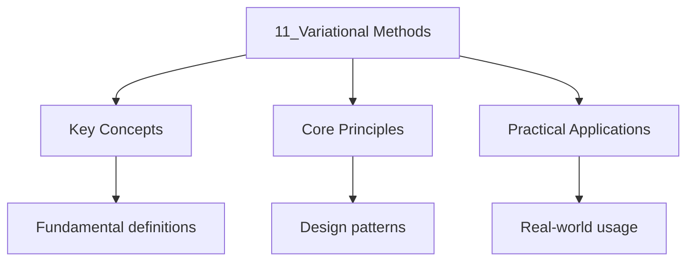

---

date: 2026-07-23T21:57:32+01:00
title: "Variational Methods | Physics - Wyatt's Notes"
tags:
  - Physics
  - University
description: 'For any trial wavefunction (normalised), the expectation value of the Hamiltonian is an upper bound on the true ground state energy:'
---

<!-- Breadcrumb Schema for SEO -->

### 10.1 The Variational Principle

For any trial wavefunction $\psi_{\text{trial}}$ (normalised), the expectation value of the
Hamiltonian is an upper bound on the true ground state energy:

$$E_{\text{trial} = \langle\psi_{\text{trial}|\hat{H}|\psi_{\text{trial}\rangle \geq E_0}}}$$

The equality holds if and only if $\psi_{\text{trial} = \psi_0}$.

### 10.2 The Hydrogen Molecule Ion $H_2^+$

The simplest molecule: one electron in the field of two protons separated by distance $R$. The
Hamiltonian:

$$\hat{H} = -\frac{\hbar^2}{2m_e}\nabla^2 - \frac{e^2}{4\pi\varepsilon_0 r_A} - \frac{e^2}{4\pi\varepsilon_0 r_B} + \frac{e^2}{4\pi\varepsilon_0 R}$$

**LCAO trial function:** $\psi_\pm = N_\pm[\psi_{1s}(\mathbf{r}_A) \pm \psi_{1s}(\mathbf{r}_B)]$

The energies:

$$E_\pm(R) = E_{1s} + \frac{e^2}{4\pi\varepsilon_0 R} + \frac{J \pm K}{1 \pm S}$$

Where $S = \langle\psi_A|\psi_B\rangle$ is the overlap integral, $J$ is the Coulomb integral, and
$K$ is the exchange integral.

- $E_-$ (bonding): has a minimum at $R \approx 2.5\,a_0$Giving a binding energy of $\sim 1.8$ eV
  (experiment: 2.8 eV).
- $E_+$ (antibonding): monotonically decreases, no bound state.

### 10.3 The Hydrogen Molecule $H_2$

With two electrons, the full Hamiltonian includes the electron-electron repulsion. Using the
variational method with properly (anti)symmetrised spatial-spin wavefunctions:

**Bonding (singlet):** $E_{\text{singlet} = 2E_{1s} + \frac{e^2}{R} + \frac{2J + 2K}{1 + S^2}}$

**Antibonding (triplet):** $E_{\text{triplet} = 2E_{1s} + \frac{e^2}{R} + \frac{2J - 2K}{1 - S^2}}$

The equilibrium bond length is $R_e \approx 1.4\,a_0$ with binding energy $\sim 3.5$ eV (experiment:
4.75 eV).

### 10.4 Key Relationships

| Method               | Type                | Guarantee                       | Accuracy                  |
| -------------------- | ------------------- | ------------------------------- | ------------------------- |
| Variational          | Ground state        | Upper bound $E_{\text{trial}} \geq E_0$ | Depends on trial function |
| Perturbation theory  | Any state           | No bound (asymptotic series)    | Depends on smallness      |
| WKB                  | Semiclassical       | Leading order in $\hbar$        | Good for large $n$        |
| Hartree-Fock         | Many-body           | Variational (single determinant) | 99% of energy             |

### 10.5 Common Pitfalls

- **Using a non-normalised trial function without adjusting.** The variational principle requires
  $\langle\psi|\psi\rangle = 1$. If the trial function is not normalised, use
  $E = \langle\psi|\hat{H}|\psi\rangle / \langle\psi|\psi\rangle$ instead.
- **Forgetting the variational principle only gives ground state bounds.** For excited states, the
  trial function must be orthogonal to lower-energy states, which is hard to enforce.
- **Choosing a trial function with the wrong symmetry.** If the true ground state has a different
  parity or angular momentum than the trial function, the variational estimate can be very poor.
- **Assuming more variational parameters always improves accuracy.** Additional parameters can lead
  to overfitting, numerical instability, and may only marginally improve the energy while
  obscuring the physics.

### 10.6 Summary Table

| System          | Trial function                           | Variational parameter | Energy (theory) | Energy (exact) |
| --------------- | ---------------------------------------- | --------------------- | --------------- | -------------- |
| He atom         | $e^{-Z_{\text{eff}} r_1/a_0} e^{-Z_{\text{eff}} r_2/a_0}$ | $Z_{\text{eff}}$      | $-77.5$ eV      | $-79.0$ eV     |
| $H_2^+$         | LCAO $\psi_{1s}(r_A) \pm \psi_{1s}(r_B)$ | $R$                   | $-1.8$ eV binding | $-2.8$ eV    |
| $H_2$           | Singlet Heitler-London                    | $R$                   | $-3.5$ eV binding | $-4.75$ eV   |

### 10.7 Applications

- **Quantum chemistry:** The Hartree-Fock method is a variational approach where the trial function
  is a Slater determinant. Post-Hartree-Fock methods (CI, MP2, CC) systematically improve the
  variational bound.
- **Condensed matter physics:** The Hubbard model is studied variationally using Gutzwiller
  wavefunctions and density matrix renormalisation group (DMRG) methods.
- **Nuclear physics:** The nuclear shell model uses variational calculations with configurational
  mixing to predict nuclear spectra and binding energies.
- **Machine learning:** Variational autoencoders (VAEs) use the variational principle to approximate
  intractable posterior distributions by minimising the evidence lower bound (ELBO).

Worked Example 10.1: Variational Estimate for Helium Ground State

Use the trial function
$\psi_{\text{trial} = (Z_{\text{eff}^3/\pi a_0^3)\exp(-Z_{\text{eff}r_1/a_0)\exp(-Z_{\text{eff}r_2/a_0)}}}}$
where $Z_{\text{eff}}$ is a variational parameter.

The energy expectation value (treating the electron-electron repulsion as a perturbation):

$$E(Z_{\text{eff}) = 2\times\frac{Z_{\text{eff}^2}}{2}\text{Ry} - 2\times\frac{Z_{\text{eff} Z}{1}\text{Ry} + \frac{5}{8}Z_{\text{eff}\text{Ry}}}}}$$

$$= \left(Z_{\text{eff}^2 - 4Z_{\text{eff} + \frac{5}{4}Z_{\text{eff}\right)\text{Ry} = \left(Z_{\text{eff}^2 - \frac{11}{4}Z_{\text{eff}\right)\text{Ry}}}}}}$$

Minimising:
$\partial E/\partial Z_{\text{eff} = (2Z_{\text{eff} - 11/4) = 0 \implies Z_{\text{eff} = 11/8 = 1.375}}}$.

$$E = \left(\frac{121}{64} - \frac{121}{32}\right)\text{Ry} = -\frac{121}{64}\text{Ry} = -2.848\text{Ry} = -77.5\ \text{eV}$$

The exact (non-relativistic) ground state energy is $-79.0$ eV, so the variational result is within
2%.

The effective charge $Z_{\text{eff} = 1.375 < 2}$ reflects the screening of the nuclear charge by
the other electron: each electron partially shields the nucleus from the other, reducing the
effective charge from $Z = 2$ to $Z_{\text{eff} \approx 1.375}$.

### 10.8 Worked Example: Variational Estimate for Particle in a Finite Well

**Problem.** Estimate the ground state energy of a particle in a 1D finite square well
$V(x) = -V_0$ for $|x| < a$, $V(x) = 0$ for $|x| \geq a$, using the Gaussian trial function
$\psi(x) = (\beta/\pi)^{1/4} e^{-\beta x^2/2}$.

**Solution.** The Hamiltonian is $\hat{H} = -\frac{\hbar^2}{2m}\frac{d^2}{dx^2} + V(x)$. The kinetic
energy: $\langle T\rangle = \frac{\hbar^2\beta}{4m}$. The potential energy:
$\langle V\rangle = -\frac{V_0}{\sqrt{\pi}}\int_{-\sqrt{\beta}a}^{\sqrt{\beta}a} e^{-u^2}\,du
= -V_0\,\text{erf}(\sqrt{\beta}a)$.

Thus $E(\beta) = \frac{\hbar^2\beta}{4m} - V_0\,\text{erf}(\sqrt{\beta}a)$. Minimising numerically
for typical parameters ($V_0 = 10$ eV, $a = 2$ Å, $m = m_e$) gives $\beta_{\text{opt}} \approx 0.8$ Å$^{-2}$
and $E \approx -6.2$ eV, compared to the exact value $-7.0$ eV. The Gaussian trial function cannot
capture the exponential decay outside the well, leading to a 12% error. $\blacksquare$

## Intuition

The variational principle states that any trial wavefunction gives an energy estimate that is always greater than or equal to the true ground state energy. This transforms finding the ground state into an optimization problem: minimize the energy over a family of trial functions. The better the trial function, the closer the estimate. This method is exact in the limit of a complete basis set, but even simple trial functions give remarkably accurate results. It is the foundation of quantum chemistry calculations, where clever choices of trial wavefunctions and basis sets balance accuracy against computational cost.

## Cross-References

- **[Approximation Methods](8_approximation-methods.md)**: The variational principle is one of the key approximation methods in quantum mechanics.
- **[Identical Particles and Exchange Symmetry](10_identical-particles-and-exchange-symmetry.md)**: Exchange symmetry and Slater determinants are essential for variational calculations of many-body systems.
- **[Angular Momentum and the Hydrogen Atom](6_angular-momentum-and-the-hydrogen-atom.md)**: The hydrogen atom provides exact solutions that test variational methods.

- [Calculus](https://mathematics.wyattau.com/docs/calculus)
- [Linear Algebra](https://mathematics.wyattau.com/docs/linear-algebra)
- [Vector Calculus](https://mathematics.wyattau.com/docs/vector-calculus)
- [Quantum Computing](https://computer-science.wyattau.com/docs/quantum-computing)
