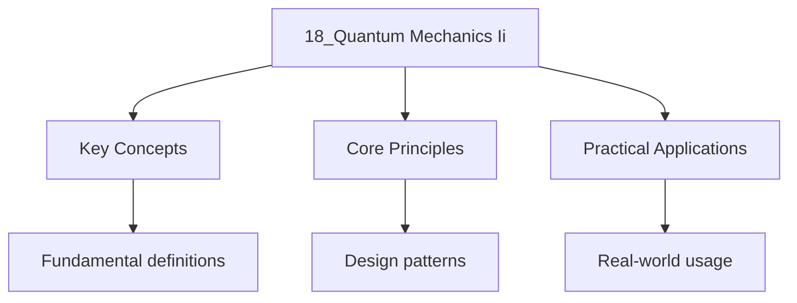

---

title: "quantum mechanics ii | Physics"
date: 2026-05-30
tags:
  - University Physics
categories:
  - University Physics
description: "The is the splitting of atomic energy levels by an external electric field Comprehensive educational content coverage with definitions and practice problems."
---

<!-- Breadcrumb Schema for SEO -->

## 1. Perturbation Theory: Advanced Applications

### 1.1 The Stark Effect

The **Stark effect** is the splitting of atomic energy levels by an external electric field
$\mathcal{E}$. For hydrogen, the perturbation is $H" = e\mathcal{E}z$ (taking the field along $z$).

**Linear Stark effect (degenerate case).** For hydrogen, states with the same $n$ but different $l$
are degenerate. Consider the $n = 2$ manifold
$\{|200\rangle, |210\rangle, |211\rangle, |21{-1}\rangle\}$. The perturbation matrix within the
degenerate subspace:

$$\langle n'l'm'|z|nlm\rangle \propto \delta_{l',l\pm 1}\,\delta_{m',m}$$

Only $\langle 200|z|210\rangle$ and $\langle 210|z|200\rangle$ are nonzero. Defining the "parabolic basis" states:

$$|\psi_1\rangle = \frac{1}{\sqrt{2}}(|200\rangle + |210\rangle), \quad |\psi_2\rangle = \frac{1}{\sqrt{2}}(|200\rangle - |210\rangle)$$

The first-order energy shifts are:

$$E^{(1)} = \pm 3ea_0\mathcal{E}, \quad 0, \quad 0$$

The quadratic Stark effect arises in non-hydrogenic atoms (where $l$-degeneracy is lifted). The
second-order energy shift is proportional to $\mathcal{E}^2$:

$$E_n^{(2)} = -\frac{1}{2}\alpha_n\mathcal{E}^2$$

where $\alpha_n$ is the **electric polarizability**. For the ground state of hydrogen,
$\alpha_1 = \frac{9}{2}a_0^3$.

### 1.2 The Zeeman Effect

An external magnetic field $\mathbf{B} = B\hat{z}$ splits atomic levels. The perturbation
$H' = -\boldsymbol{\mu}_L \cdot \mathbf{B} - \boldsymbol{\mu}_S \cdot \mathbf{B}$:

$$H' = \frac{eB}{2m_e}(L_z + 2S_z) = \frac{e\hbar B}{2m_e}(J_z + S_z)$$

**Normal Zeeman effect** (spin neglected): $H' = \omega_L L_z$ where $\omega_L = eB/(2m_e)$ is the
Larmor frequency. Each level $l$ splits into $2l + 1$ equally spaced sublevels separated by
$\hbar\omega_L$.

**Anomalous Zeeman effect** (weak field, $B \ll B_{\text{SO}}$): Use $|n, l, s, j, m_j\rangle$ as
the unperturbed basis. The first-order shift:

$$E_Z = g_J\mu_B B\,m_j$$

where $\mu_B = e\hbar/(2m_e)$ is the Bohr magneton and the **Landé $g$-factor** is:

$$g_J = 1 + \frac{j(j+1) + s(s+1) - l(l+1)}{2j(j+1)}$$

For a pure orbital state ($s = 0$): $g_J = 1$. For a pure spin state ($l = 0$): $g_J = 2$.

**Paschen–Back effect** (strong field, $B \gg B_{\text{SO}}$): $L_z$ and $S_z$ decouple, and the
spin-orbit interaction is treated as the perturbation. The energy shifts approach the normal Zeeman
pattern.

### 1.3 The Variational Method: Helium Ground State (Detailed)

Using the effective nuclear charge trial function
$\psi_{\text{trial}} = (Z_{\text{eff}}^3/\pi a_0^3)\exp[-Z_{\text{eff}}(r_1 + r_2)/a_0]$:

$$E(Z_{\text{eff}}) = \left[Z_{\text{eff}}^2 - 4Z_{\text{eff}} + \frac{5}{4}Z_{\text{eff}}\right]\text{Ry} = \left[Z_{\text{eff}}^2 - \frac{11}{4}Z_{\text{eff}}\right]\text{Ry}$$

Minimising: $dE/dZ_{\text{eff}} = 0$ gives $Z_{\text{eff}} = 27/16 = 1.6875$:

$$E_{\min} = -\left(\frac{27}{16}\right)^2 \times 13.6\,\text{eV} = -77.5\,\text{eV}$$

The experimental value is $-79.0$ eV. The variational result is within 2% and captures the screening
effect: each electron partially shields the nucleus, reducing the effective charge below $Z = 2$.

Worked Example 1.1: Fine Structure of Hydrogen (Perturbative)

The hydrogen fine structure has three contributions evaluated via perturbation theory:

$$\Delta E_{\text{fs}} = \Delta E_{\text{rel}} + \Delta E_{\text{SO}} + \Delta E_{\text{Darwin}}$$

**Relativistic kinetic energy correction:**

$$\Delta E_{\text{rel}} = -\frac{(E_n - V)^2}{2m_ec^2} \;\longrightarrow\; \Delta E_{\text{rel}} = -\frac{E_n^2}{2m_ec^2}\left[\frac{4n}{l+1/2} - 3\right]$$

**Spin-orbit coupling:**

$$\Delta E_{\text{SO}} = \frac{e^2}{2m_e^2c^2}\frac{1}{r^3}\langle\mathbf{L}\cdot\mathbf{S}\rangle = \frac{E_n^2}{2m_ec^2}\frac{n[j(j+1)-l(l+1)-s(s+1)]}{l(l+1/2)(l+1)}$$

for $l \neq 0$. The **Darwin term** contributes only for $l = 0$.

The combined fine-structure shift:

$$\Delta E_{\text{fs}} = \frac{E_n^2}{2m_ec^2}\left(\frac{3}{4n} - \frac{n}{j + 1/2}\right) = \frac{E_n\,\alpha^2}{n^2}\left(\frac{3}{4} - \frac{n}{j + 1/2}\right)$$

where $\alpha \approx 1/137$ is the fine-structure constant. For $n = 2$: $2S_{1/2}$ and $2P_{1/2}$
are degenerate at
$\Delta E_{\text{fs}} = -\frac{13.6}{4}\frac{\alpha^2}{16}(1) \approx -4.53 \times 10^{-5}$ eV, and
$2P_{3/2}$ lies slightly higher.

---

<!-- Breadcrumb Schema for SEO -->

## 2. Angular Momentum Coupling

### 2.1 Addition of Angular Momenta

Given two angular momenta $\mathbf{J}_1$ and $\mathbf{J}_2$, the total
$\mathbf{J} = \mathbf{J}_1 + \mathbf{J}_2$. The possible values of $j$ are:

$$j = |j_1 - j_2|, \; |j_1 - j_2| + 1, \; \ldots, \; j_1 + j_2$$

The coupled basis $|j_1 j_2; jm\rangle$ is related to the uncoupled basis
$|j_1 m_1\rangle|j_2 m_2\rangle$ by the **Clebsch–Gordan (CG) decomposition**:

$$|j_1 j_2; jm\rangle = \sum_{m_1, m_2} \langle j_1 m_1\, j_2 m_2 | jm\rangle \; |j_1 m_1\rangle |j_2 m_2\rangle$$

where the sum runs over $m_1 + m_2 = m$ and the coefficients $\langle j_1 m_1\, j_2 m_2 | jm\rangle$
are CG coefficients.

**Properties of CG coefficients:**

- **Orthogonality:**

$$\sum_{m_1, m_2} \langle j_1 m_1\, j_2 m_2 | jm\rangle\langle j_1 m_1\, j_2 m_2 | j'm'\rangle = \delta_{jj'}\delta_{mm'}$$

$$\sum_{j, m} \langle j_1 m_1\, j_2 m_2 | jm\rangle\langle j_1 m_1'\, j_2 m_2' | jm\rangle = \delta_{m_1 m_1'}\delta_{m_2 m_2'}$$

- **Symmetry:**
  $\langle j_1 m_1\, j_2 m_2 | jm\rangle = (-1)^{j_1 + j_2 - j}\langle j_2 m_2\, j_1 m_1 | jm\rangle$

- **Special values:** $\langle j_1 j_1\, j_2 (m - j_1) | jm\rangle$ and
  $\langle j_1 (-j_1)\, j_2 (j) | j_0\rangle$ are positive.

**Example: Two spin-1/2 particles.** The addition $s_1 = s_2 = 1/2$ gives $S = 0, 1$:

$$|1, 1\rangle = |{+}\rangle|{+}\rangle$$
$$|1, 0\rangle = \frac{1}{\sqrt{2}}\bigl(|{+}\rangle|{-}\rangle + |{-}\rangle|{+}\rangle\bigr)$$
$$|1, {-1}\rangle = |{-}\rangle|{-}\rangle$$
$$|0, 0\rangle = \frac{1}{\sqrt{2}}\bigl(|{+}\rangle|{-}\rangle - |{-}\rangle|{+}\rangle\bigr)$$

### 2.2 Spin–Orbit Coupling

The spin-orbit interaction in hydrogen (from the electron's perspective in the nuclear rest frame):

$$H_{\text{SO}} = \frac{1}{2m_e^2 c^2}\frac{1}{r}\frac{dV}{dr}\,\mathbf{L}\cdot\mathbf{S}$$

For the Coulomb potential $V = -e^2/(4\pi\varepsilon_0 r)$:

$$H_{\text{SO}} = \frac{e^2}{8\pi\varepsilon_0 m_e^2 c^2}\frac{\mathbf{L}\cdot\mathbf{S}}{r^3}$$

Using $\mathbf{L}\cdot\mathbf{S} = \frac{1}{2}[\mathbf{J}^2 - \mathbf{L}^2 - \mathbf{S}^2]$:

$$\langle H_{\text{SO}}\rangle = \frac{\hbar^2 e^2}{16\pi\varepsilon_0 m_e^2 c^2}\frac{j(j+1) - l(l+1) - s(s+1)}{a_0^3 n^3 l(l+1/2)(l+1)}$$

This vanishes for $l = 0$ (the Darwin term takes over for $s$-states).

### 2.3 LS and jj Coupling Schemes

**LS (Russel–Saunders) coupling.** Applicable when the residual electrostatic interaction between
electrons dominates over spin-orbit coupling (light atoms, $Z \lesssim 30$):

1. Couple orbital momenta: $\mathbf{L} = \sum_i \mathbf{l}_i$, giving total $L$
2. Couple spins: $\mathbf{S} = \sum_i \mathbf{s}_i$, giving total $S$
3. Couple to total: $\mathbf{J} = \mathbf{L} + \mathbf{S}$, with $J = |L - S|, \ldots, L + S$

States are labelled $^{2S+1}L_J$ (spectroscopic notation). For carbon ($1s^2 2s^2 2p^2$): the
valence configuration gives $L = 0, 1, 2$ and $S = 0, 1$. The allowed terms are $^1S_0$,
$^3P_{0,1,2}$, $^1D_2$.

**jj coupling.** Dominates when spin-orbit coupling exceeds the electrostatic interaction (heavy
atoms, $Z \gtrsim 80$):

1. Couple each electron: $\mathbf{j}_i = \mathbf{l}_i + \mathbf{s}_i$
2. Couple to total: $\mathbf{J} = \sum_i \mathbf{j}_i$

### 2.4 The Wigner–Eckart Theorem

The matrix elements of a spherical tensor operator $T_q^{(k)}$ (rank $k$, component $q$) between
angular momentum eigenstates are:

$$\langle j'm' | T_q^{(k)} | jm \rangle = \langle jm\, kq | j'm' \rangle \;\langle j' || T^{(k)} || j \rangle$$

The first factor is a CG coefficient (containing all angular dependence) and the second is the
**reduced matrix element** (independent of $m, m', q$).

**Consequences:**

- Selection rules follow directly: $|j - j'| \leq k \leq j + j'$, $m' = m + q$
- All matrix elements with the same $j, j', k$ are determined by a single reduced matrix element
- Parity: $T_q^{(k)}$ has parity $(-1)^k$, so $\langle j'm'|T_q^{(k)}|jm\rangle \neq 0$ only if
  $(-1)^{l' + k + l} = +1$

---

<!-- Breadcrumb Schema for SEO -->

## 3. Identical Particles: Advanced Topics

### 3.1 Second Quantisation for Many-Body Systems

For identical particles, the field operators create and annihilate particles at points in space:

$$\hat{\psi}(\mathbf{r}) = \sum_i a_i \phi_i(\mathbf{r}), \quad \hat{\psi}^\dagger(\mathbf{r}) = \sum_i a_i^\dagger \phi_i^*(\mathbf{r})$$

**Creation/annihilation operator commutation relations:**

Bosons: $[a_i, a_j^\dagger] = \delta_{ij}$, $[a_i, a_j] = 0$, $[a_i^\dagger, a_j^\dagger] = 0$

Fermions: $\{a_i, a_j^\dagger\} = \delta_{ij}$, $\{a_i, a_j\} = 0$,
$\{a_i^\dagger, a_j^\dagger\} = 0$

The many-body Hamiltonian for interacting fermions:

$$\hat{H} = \sum_{ij} \langle i | h | j \rangle a_i^\dagger a_j + \frac{1}{2}\sum_{ijkl} \langle ij | V | kl \rangle a_i^\dagger a_j^\dagger a_l a_k$$

where $h$ is the single-particle Hamiltonian and $V$ is the two-body interaction.

### 3.2 The Heitler–London Model

The Heitler–London model treats the hydrogen molecule $H_2$ using valence bond theory. The spatial
wavefunction for two electrons near protons $A$ and $B$:

$$\Psi_S = \frac{1}{\sqrt{2(1 + S^2)}}\bigl[\psi_A(1)\psi_B(2) + \psi_B(1)\psi_A(2)\bigr] \quad \text{(singlet, bonding)}$$

$$\Psi_T = \frac{1}{\sqrt{2(1 - S^2)}}\bigl[\psi_A(1)\psi_B(2) - \psi_B(1)\psi_A(2)\bigr] \quad \text{(triplet, antibonding)}$$

where $S = \langle\psi_A|\psi_B\rangle$ is the overlap integral. The energies:

$$E_{\text{singlet}}(R) = \frac{Q + A}{1 + S^2}, \qquad E_{\text{triplet}}(R) = \frac{Q - A}{1 - S^2}$$

where $Q$ is the Coulomb integral and $A$ is the exchange integral (positive). The exchange integral
$A$ is responsible for covalent bonding — it has no classical analogue and is purely
quantum-mechanical. The singlet state has a minimum at $R_e \approx 1.64\,a_0$ with binding energy
$\sim 3.15$ eV (experiment: 4.75 eV).

### 3.3 Hartree–Fock Theory

The **Hartree–Fock** method finds the best single Slater determinant by solving self-consistent
equations. For orbital $\phi_i$:

$$\hat{F}\,\phi_i(\mathbf{r}) = \varepsilon_i\,\phi_i(\mathbf{r})$$

where the **Fock operator** is:

$$\hat{F} = h + \sum_{j=1}^{N}\bigl(\hat{J}_j - \hat{K}_j\bigr)$$

- **Coulomb operator:**
  $\hat{J}_j\phi_i(\mathbf{r}) = \left[\int \frac{|\phi_j(\mathbf{r}')|^2}{|\mathbf{r} - \mathbf{r}'|}\,d^3r'\right]\phi_i(\mathbf{r})$
- **Exchange operator:**
  $\hat{K}_j\phi_i(\mathbf{r}) = \left[\int \frac{\phi_j^*(\mathbf{r}')\phi_i(\mathbf{r}')}{|\mathbf{r} - \mathbf{r}'|}\,d^3r'\right]\phi_j(\mathbf{r})$

The total Hartree–Fock energy:

$$E_{\text{HF}} = \sum_{i=1}^{N}\langle\phi_i|h|\phi_i\rangle + \frac{1}{2}\sum_{i,j=1}^{N}\bigl(\langle ij|ij\rangle - \langle ij|ji\rangle\bigr)$$

where $\langle ij|ij\rangle = J$ is the direct integral and $\langle ij|ji\rangle = K$ is the
exchange integral.

**Koopmans' theorem:** The Hartree–Fock orbital energy $\varepsilon_i$ approximates the ionisation
energy of electron $i$ (and the electron affinity for unoccupied orbitals). This provides a
theoretical justification for photoelectron spectroscopy interpretation.

---

<!-- Breadcrumb Schema for SEO -->

## 4. Scattering Theory: Advanced Topics

### 4.1 The Lippmann–Schwinger Equation

The scattering state $|\psi^{(+)}\rangle$ satisfies the **Lippmann–Schwinger equation**:

$$|\psi^{(+)}\rangle = |\phi\rangle + \hat{G}_0^{(+)}V|\psi^{(+)}\rangle$$

where $|\phi\rangle$ is a free plane wave, $V$ is the scattering potential, and $\hat{G}_0^{(+)}$ is
the free retarded Green's function:

$$\hat{G}_0^{(+)}(E) = \frac{1}{E - \hat{H}_0 + i\epsilon}$$

Iterating gives the Born series:

$$|\psi^{(+)}\rangle = |\phi\rangle + \hat{G}_0 V|\phi\rangle + \hat{G}_0 V\hat{G}_0 V|\phi\rangle + \cdots$$

The first iteration reproduces the Born approximation; higher iterations include multiple scattering
events.

### 4.2 The T-Matrix

The **transition matrix** (T-matrix) encapsulates all scattering information:

$$\hat{T}(E) = V + V\hat{G}_0^{(+)}(E)\hat{T}(E)$$

The scattering amplitude is:

$$f(\mathbf{k}', \mathbf{k}) = -\frac{m}{2\pi\hbar^2}\langle\mathbf{k}'|\hat{T}(E)|\mathbf{k}\rangle$$

The Born approximation is $T \approx V$, and the full solution sums all repeated scatterings.

### 4.3 The Ramsauer–Townsend Effect

At low energies, electron scattering off noble gas atoms exhibits a pronounced **minimum** in the
total cross section. For electron–argon scattering, $\sigma$ drops to near zero at $E \approx 0.7$
eV.

**Explanation via partial wave analysis.** The $l = 0$ phase shift passes through zero
($\delta_0 \approx n\pi$) at a specific energy. Since $\sigma \approx 4\pi a_s^2$ at low energy and
the scattering length $a_s = -\tan(\delta_0)/k \approx 0$, the cross section nearly vanishes. This
is a quantum-mechanical transparency caused by destructive interference between the incoming and
scattered waves.

### 4.4 Effective Range Expansion

For low-energy $s$-wave scattering, the phase shift is parameterised by:

$$k\cot\delta_0 = -\frac{1}{a_s} + \frac{1}{2}r_e\,k^2 + O(k^4)$$

where $a_s$ is the scattering length and $r_e$ is the **effective range**. The cross section:

$$\sigma = \frac{4\pi}{k^2 + (k\cot\delta_0)^2} \;\xrightarrow{k \to 0}\; \frac{4\pi a_s^2}{1 + k^2 a_s^2}$$

A large positive scattering length ($|a_s| \gg r_e$) signals a near-threshold bound state (as in the
deuteron, $a_s \approx 5.4$ fm).

---

<!-- Breadcrumb Schema for SEO -->

## 5. Relativistic Quantum Mechanics

### 5.1 The Klein–Gordon Equation

For a spin-0 particle of mass $m$, imposing $E^2 = p^2c^2 + m^2c^4$ as an operator equation gives:

$$\left(\frac{1}{c^2}\frac{\partial^2}{\partial t^2} - \nabla^2 + \frac{m^2c^2}{\hbar^2}\right)\psi = 0$$

**Problems with the Klein–Gordon equation:**

- Second-order in time (requires initial conditions on $\psi$ and $\partial\psi/\partial t$)
- Negative energy solutions: $E = \pm\sqrt{p^2c^2 + m^2c^4}$
- Probability density $\rho = (i\hbar/2mc^2)(\psi^*\dot\psi - \psi\dot\psi^*)$ is not
  positive-definite
- The conserved current is $j^\mu = (i\hbar/2m)(\phi^*\partial^\mu\phi - \phi\partial^\mu\phi^*)$
  but $\rho$ can be negative

These issues are resolved by interpreting negative-energy states as antiparticles (charge
conjugation).

### 5.2 The Dirac Equation

Dirac sought a first-order equation linear in both $\partial/\partial t$ and $\nabla$:

$$i\hbar\frac{\partial\psi}{\partial t} = \left(c\,\boldsymbol{\alpha}\cdot\hat{\mathbf{p}} + \beta mc^2\right)\psi$$

where $\boldsymbol{\alpha} = (\alpha_1, \alpha_2, \alpha_3)$ and $\beta$ are $4 \times 4$ matrices
satisfying:

$$\alpha_i\alpha_j + \alpha_j\alpha_i = 2\delta_{ij}\mathbf{1}, \quad \alpha_i\beta + \beta\alpha_i = 0, \quad \beta^2 = \mathbf{1}$$

In the **Dirac representation**:

$$\beta = \begin{pmatrix} \mathbf{1} & 0 \\ 0 & -\mathbf{1} \end{pmatrix}, \quad \alpha_i = \begin{pmatrix} 0 & \sigma_i \\ \sigma_i & 0 \end{pmatrix}$$

where $\sigma_i$ are the Pauli matrices. The four-component wavefunction is called a **bispinor**.

**Free-particle solutions.** Plane wave $\psi = u(p)\,e^{-i p \cdot x/\hbar}$ with $u(p)$
satisfying:

$$(\gamma^\mu p_\mu - mc)\,u(p) = 0$$

where $\gamma^0 = \beta$, $\gamma^i = \beta\alpha_i$, and
$\{ \gamma^\mu, \gamma^\nu \} = 2g^{\mu\nu}$.

There are two positive-energy spinors ($E = +\sqrt{p^2c^2 + m^2c^4}$, spin up/down) and two
negative-energy spinors ($E = -\sqrt{p^2c^2 + m^2c^4}$). The negative-energy solutions are
reinterpreted via the **Dirac sea**: all negative energy states are filled; a hole is an
antiparticle (positron).

### 5.3 Spinors and the Non-Relativistic Limit

Writing the bispinor as $\psi = \begin{pmatrix} \phi \\ \chi \end{pmatrix}$ where $\phi$ and $\chi$
are two-component spinors:

- $\phi$ is the "large" component (dominates at low energy)
- $\chi$ is the "small" component ($|\chi|/|\phi| \sim p/(mc) \sim v/c$)

In the non-relativistic limit ($v \ll c$), the upper component $\phi$ satisfies the Pauli equation:

$$i\hbar\frac{\partial\phi}{\partial t} = \left[\frac{\hat{\mathbf{p}}^2}{2m} + V - \frac{\hat{\mathbf{p}}^4}{8m^3c^2} + \frac{e\hbar}{4m^2c^2}\boldsymbol{\sigma}\cdot(\mathbf{E} \times \hat{\mathbf{p}}) + \frac{e\hbar}{8m^2c^2}(\nabla\cdot\mathbf{E})\right]\phi$$

The extra terms are: relativistic kinetic correction, spin-orbit coupling, and the Darwin term.

### 5.4 Antimatter and the Hydrogen Fine Structure

The Dirac equation predicts antimatter (confirmed experimentally by Anderson's discovery of the
positron, 1932). For hydrogen, the exact Dirac energy levels are:

$$E_{n,j} = mc^2\left[1 + \left(\frac{Z\alpha}{n - (j+1/2) + \sqrt{(j+1/2)^2 - Z^2\alpha^2}}\right)^2\right]^{-1/2}$$

Expanding to order $\alpha^4$:

$$E_{n,j} \approx mc^2\left[1 - \frac{Z^2\alpha^2}{2n^2} - \frac{Z^4\alpha^4}{2n^4}\left(\frac{n}{j+1/2} - \frac{3}{4}\right)\right]$$

The $\alpha^4$ term gives the fine structure. Crucially, the Dirac equation predicts that $2S_{1/2}$
and $2P_{1/2}$ are exactly degenerate — a result confirmed experimentally and explained by QFT as
due to the **Lamb shift** ($\sim 1$ GHz, arising from vacuum fluctuations).

---

<!-- Breadcrumb Schema for SEO -->

## 6. Introduction to Quantum Field Theory

### 6.1 Second Quantisation

QFT treats particles as excitations of underlying fields. For a scalar field
$\hat{\phi}(\mathbf{x})$:

$$\hat{\phi}(\mathbf{x}) = \sum_{\mathbf{k}}\frac{1}{\sqrt{2\omega_k V}}\left(a_{\mathbf{k}}\,e^{i\mathbf{k}\cdot\mathbf{x}} + a_{\mathbf{k}}^\dagger\,e^{-i\mathbf{k}\cdot\mathbf{x}}\right)$$

where $\omega_k = \sqrt{k^2 + m^2}$ and $a_{\mathbf{k}}^\dagger$, $a_{\mathbf{k}}$ create and
annihilate particles with momentum $\mathbf{k}$.

### 6.2 Fock Space

The **Fock space** is the direct sum of $N$-particle Hilbert spaces:

$$\mathcal{F} = |0\rangle \oplus \bigoplus_{N=1}^{\infty}\mathcal{H}^{\otimes N}_\text{sym/antisym}$$

- $a_{\mathbf{k}}^\dagger|0\rangle = |1_{\mathbf{k}}\rangle$ (one-particle state)
- $a_{\mathbf{k}_1}^\dagger a_{\mathbf{k}_2}^\dagger|0\rangle = |1_{\mathbf{k}_1}, 1_{\mathbf{k}_2}\rangle$
  (two-particle state)
- For bosons: $(a_{\mathbf{k}}^\dagger)^n|0\rangle \propto |n_{\mathbf{k}}\rangle$ (Bose–Einstein
  condensation)
- For fermions: $(a_{\mathbf{k}}^\dagger)^2|0\rangle = 0$ (Pauli exclusion)

The number operator: $\hat{N}_{\mathbf{k}} = a_{\mathbf{k}}^\dagger a_{\mathbf{k}}$, with
$\hat{N}_{\mathbf{k}}|n_{\mathbf{k}}\rangle = n_{\mathbf{k}}|n_{\mathbf{k}}\rangle$.

### 6.3 The Quantised Electromagnetic Field

The vector potential for the free electromagnetic field:

$$\hat{\mathbf{A}}(\mathbf{x}) = \sum_{\mathbf{k},\lambda}\sqrt{\frac{\hbar}{2\omega_k \varepsilon_0 V}}\left[a_{\mathbf{k},\lambda}\,\boldsymbol{\epsilon}_{\mathbf{k},\lambda}\,e^{i\mathbf{k}\cdot\mathbf{x}} + a_{\mathbf{k},\lambda}^\dagger\,\boldsymbol{\epsilon}_{\mathbf{k},\lambda}^*\,e^{-i\mathbf{k}\cdot\mathbf{x}}\right]$$

where $\lambda = 1, 2$ labels the two transverse polarisations,
$\boldsymbol{\epsilon}_{\mathbf{k},\lambda}$ are polarisation vectors, and
$\omega_k = c|\mathbf{k}|$.

The Hamiltonian is
$\hat{H} = \sum_{\mathbf{k},\lambda}\hbar\omega_k\left(a_{\mathbf{k},\lambda}^\dagger a_{\mathbf{k},\lambda} + \tfrac{1}{2}\right)$.

**The zero-point energy** $\sum_{\mathbf{k},\lambda}\hbar\omega_k/2$ diverges — this is the origin
of the Casimir effect and vacuum energy in cosmology.

### 6.4 The Casimir Effect

Two parallel perfectly conducting plates separated by distance $d$ modify the allowed
electromagnetic modes between them. The **vacuum energy per unit area** between the plates:

$$\mathcal{E}(d) = \frac{\hbar c \pi^2}{720\,d^3}$$

The **Casimir force per unit area** (attractive):

$$F/A = -\frac{\partial \mathcal{E}}{\partial d} = -\frac{\hbar c \pi^2}{240\,d^4}$$

For $d = 1\,\mu$m: $F/A \approx 1.3 \times 10^{-3}$ Pa. This force has been measured experimentally
(Lamoreaux, 1997; Mohideen & Roy, 1998) and confirms the reality of vacuum fluctuations.

---

<!-- Breadcrumb Schema for SEO -->

## 7. Quantum Entanglement

### 7.1 Bell States

The four maximally entangled two-qubit states (Bell basis):

$$|\Phi^+\rangle = \frac{1}{\sqrt{2}}(|00\rangle + |11\rangle), \quad |\Phi^-\rangle = \frac{1}{\sqrt{2}}(|00\rangle - |11\rangle)$$
$$|\Psi^+\rangle = \frac{1}{\sqrt{2}}(|01\rangle + |10\rangle), \quad |\Psi^-\rangle = \frac{1}{\sqrt{2}}(|01\rangle - |10\rangle)$$

These states cannot be written as a product $|\psi_A\rangle \otimes |\psi_B\rangle$. Measuring one
qubit instantly determines the state of the other, regardless of spatial separation.

### 7.2 The EPR Paradox

Einstein, Podolsky, and Rosen (1935) argued that QM is incomplete. Their argument:

1. For the entangled state $|\Psi^-\rangle = (|01\rangle - |10\rangle)/\sqrt{2}$, measuring particle
   1 in the $z$-basis gives $+1$ or $-1$. If particle 1 yields $+1$, particle 2 **must** be in
   $|-1\rangle$.
2. We could equally choose to measure particle 1 in the $x$-basis. The result determines particle
   2's $x$-spin.
3. Since particle 2 was not disturbed by the measurement on particle 1 (locality), particle 2 must
   have had **definite** values of both $S_z$ and $S_x$ simultaneously — contradicting the
   uncertainty principle.

**Resolution (Bell's theorem):** No local hidden variable theory can reproduce all QM predictions.

### 7.3 Bell's Inequality

Consider measurements on two spin-1/2 particles in directions $\mathbf{a}$ and $\mathbf{b}$. For a
local hidden variable theory with hidden variable $\lambda$:

$$P(A = a, B = b | \lambda) = P(A = a | \lambda)\,P(B = b | \lambda)$$

**CHSH inequality.** For four measurement settings
$\mathbf{a}, \mathbf{a}', \mathbf{b}, \mathbf{b}'$:

$$|S| \leq 2$$

where
$S = E(\mathbf{a}, \mathbf{b}) + E(\mathbf{a}, \mathbf{b}') + E(\mathbf{a}', \mathbf{b}) - E(\mathbf{a}', \mathbf{b}')$
and $E(\mathbf{a}, \mathbf{b}) = \langle\sigma_{\mathbf{a}} \otimes \sigma_{\mathbf{b}}\rangle$.

**QM prediction** for the Bell state $|\Phi^-\rangle$ with optimally chosen angles:

$$S_{\text{QM}} = 2\sqrt{2} \approx 2.83 > 2$$

This violation has been confirmed experimentally (Aspect 1982; Zeilinger 1998; Hensen 2015;
loophole-free experiments 2015–2023), ruling out local hidden variables.

### 7.4 Quantum Teleportation

Quantum teleportation transmits an unknown quantum state
$|\chi\rangle = \alpha|0\rangle + \beta|1\rangle$ from Alice to Bob using shared entanglement and
classical communication.

**Protocol:**

1. Alice and Bob share the Bell pair $|\Phi^+\rangle_{AB}$.
2. Alice performs a **Bell measurement** on her particle and the unknown state $|\chi\rangle$.
3. Alice sends the 2-bit measurement outcome to Bob classically.
4. Bob applies a Pauli correction ($I$, $X$, $Z$, or $ZX$) based on Alice's message.

The teleported state is $|\chi\rangle$ with fidelity 1. No faster-than-light communication occurs
because the quantum information is unusable without the classical bits.

---

<!-- Breadcrumb Schema for SEO -->

## 8. Quantum Computing Primer

### 8.1 Qubits

A **qubit** is a two-level quantum system: $|\psi\rangle = \alpha|0\rangle + \beta|1\rangle$ with
$|\alpha|^2 + |\beta|^2 = 1$. Unlike a classical bit (0 or 1), a qubit can be in a superposition of
both states simultaneously. On the Bloch sphere:

$$|\psi\rangle = \cos\frac{\theta}{2}|0\rangle + e^{i\phi}\sin\frac{\theta}{2}|1\rangle$$

### 8.2 Quantum Gates

Quantum gates are unitary operations on qubits:

**Single-qubit gates:**

$$H = \frac{1}{\sqrt{2}}\begin{pmatrix} 1 & 1 \\ 1 & -1 \end{pmatrix}, \quad X = \begin{pmatrix} 0 & 1 \\ 1 & 0 \end{pmatrix}, \quad Z = \begin{pmatrix} 1 & 0 \\ 0 & -1 \end{pmatrix}$$

$$R_\phi = \begin{pmatrix} 1 & 0 \\ 0 & e^{i\phi} \end{pmatrix}, \quad T = \begin{pmatrix} 1 & 0 \\ 0 & e^{i\pi/4} \end{pmatrix}$$

**Hadamard** $H$ creates superpositions: $H|0\rangle = (|0\rangle + |1\rangle)/\sqrt{2}$.

**Multi-qubit gate — CNOT:**

$$\text{CNOT} = |0\rangle\langle 0| \otimes I + |1\rangle\langle 1| \otimes X = \begin{pmatrix} 1&0&0&0\\0&1&0&0\\0&0&0&1\\0&0&1&0 \end{pmatrix}$$

CNOT flips the target qubit if and only if the control qubit is $|1\rangle$. Combined with Hadamard,
it creates entanglement: CNOT$(H \otimes I)|00\rangle = |\Phi^+\rangle$.

### 8.3 Quantum Circuits

A quantum circuit is a sequence of gates applied to qubits. Measurements at the end collapse
superpositions into classical bitstrings. The circuit model is **universal**: any unitary operation
on $n$ qubits can be decomposed into single-qubit gates and CNOT gates.

**Key fact:** Quantum circuits are reversible (all gates are unitary). Classical circuits need
irreversible gates (AND, OR) — quantum computation gains power from superposition and entanglement,
not from irreversible logic.

### 8.4 The Deutsch–Jozsa Algorithm

**Problem:** Given a function $f: \{0,1\}^n \to \{0,1\}$ promised to be either constant (all 0s or
all 1s) or balanced (exactly half 0s, half 1s), determine which.

**Classical:** Requires $2^{n-1} + 1$ queries in the worst case.

**Quantum:** **One** query suffices.

**Circuit:**

1. Initialise $n$ input qubits and 1 ancilla to $|0\rangle^{\otimes n}|1\rangle$.
2. Apply $H^{\otimes n} \otimes H$ to all qubits.
3. Apply the oracle $U_f: |x\rangle|y\rangle \mapsto |x\rangle|y \oplus f(x)\rangle$.
4. Apply $H^{\otimes n}$ to input qubits.
5. Measure all input qubits.

**Result:** All zeros $\Rightarrow$ constant. Any other outcome $\Rightarrow$ balanced. This
demonstrates an exponential quantum speedup, though for this artificial problem.

### 8.5 Grover's Search Algorithm

**Problem:** Search an unstructured database of $N$ items for a marked item.

**Classical:** $O(N)$ queries.

**Grover's algorithm:** $O(\sqrt{N})$ queries — a quadratic speedup.

**The Grover iterate** $G = (2|\psi\rangle\langle\psi| - I)\,O$ where:

- $O$ is the oracle (flips the phase of the marked state)
- $2|\psi\rangle\langle\psi| - I$ is the diffusion operator (inversion about the mean)

After $\lfloor(\pi/4)\sqrt{N}\rfloor$ iterations, the amplitude of the marked state is near 1.
Measurement then finds the target with high probability ($> 1 - 1/N$).

Grover's algorithm is provably optimal for unstructured search (Bennett et al., 1997). It has found
applications in optimisation, cryptanalysis, and amplitude amplification.

---

<!-- Breadcrumb Schema for SEO -->

## 9. Common Pitfalls

1. **Confusing entanglement with superposition.** Superposition is a property of a single quantum
   system; entanglement is a property of a composite system that cannot be factorised. A Bell state
   is entangled; $H|0\rangle$ is a superposition but not entangled.

2. **Misapplying the variational principle to excited states.** The variational principle gives an
   **upper bound** on the ground state only. For excited states, use the Hylleraas–Undheim theorem:
   the $k$-th variational eigenvalue is an upper bound on the $(k+1)$-th true eigenvalue.

3. **Ignoring the off-diagonal elements in degenerate perturbation theory.** When degeneracy is
   present, diagonalising the perturbation matrix in the degenerate subspace is mandatory. Skipping
   this step and applying non-degenerate formulas gives undefined (division by zero) or incorrect
   results.

4. **Assuming all cross sections decrease at high energy.** While the Born approximation predicts
   $\sigma \to 0$ for finite-range potentials, the total cross section for some interactions (e.g.,
   photon–atom) approaches a constant (Thomson cross section $\sigma_T = 8\pi r_e^2/3$).

5. **Treating the Dirac equation as a single-particle wave equation.** The Dirac equation inherently
   describes a many-body system (particles and antiparticles). Single-particle interpretations are
   only approximate, valid when pair production is negligible ($E \ll 2m_ec^2$).

6. **Believing Bell inequality violations imply faster-than-light communication.** The correlations
   are nonlocal but cannot transmit information faster than $c$. The no-communication theorem
   guarantees that local operations and classical communication cannot transmit quantum information
   without the classical channel.

7. **Overestimating quantum speedups.** Quantum algorithms provide speedups for **specific** problem
   structures (period-finding, search, simulation). Generic computation is not exponentially faster
   on a quantum computer. The class BQP is believed to be a strict subset of EXP but a strict
   superset of P.

---

<!-- Breadcrumb Schema for SEO -->

## 10. Summary

- **Perturbation theory** extends systematically via degenerate diagonalisation, selection rules
  ($\Delta l = \pm 1$ for E1), and specific atomic effects (Stark, Zeeman, Paschen–Back).
- **Angular momentum coupling** through CG coefficients, LS/jj schemes, and the Wigner–Eckart
  theorem provides the framework for atomic and nuclear structure.
- **Identical particles** lead to exchange interactions (Heitler–London bonding), Hartree–Fock
  self-consistent fields, and second-quantised many-body formalism.
- **Scattering theory** generalises through the Lippmann–Schwinger equation, T-matrix, and effective
  range expansion, with quantum phenomena like the Ramsauer–Townsend effect.
- **Relativistic QM** (Klein–Gordon, Dirac) reveals spin as a relativistic phenomenon, predicts
  antimatter, and yields the hydrogen fine structure — with discrepancies (Lamb shift) pointing to
  QFT.
- **QFT concepts** (Fock space, quantised fields, Casimir effect) show that particles are field
  excitations and vacuum fluctuations have measurable physical consequences.
- **Quantum entanglement** (Bell states, Bell/CHSH inequalities, teleportation) demonstrates that
  quantum correlations exceed any classical description.
- **Quantum computing** (qubits, gates, Deutsch–Jozsa, Grover) harnesses superposition and
  entanglement for computational advantages over classical algorithms.

---

<!-- Breadcrumb Schema for SEO -->

## Cross-References

| Topic                               | Link                                                                      |
| ----------------------------------- | ------------------------------------------------------------------------- |
| Quantum Mechanics I (Prerequisites) | [View](16_flashcards-quantum-mechanics)                        |
| Solid State Physics                 | [View](../6-solid-state-physics/17_practice-solid-state-physics)                      |
| Particle Physics and Cosmology      | [View](../../../../../alevel/src/content/docs/physics/nuclear-and-particle/particle-physics)           |
| Electromagnetism                    | [View](../../../../../alevel/src/content/docs/physics/diagnostics/diag-electromagnetism-unification)                         |
| MIT 8.05 Quantum Physics II         | [View](https://ocw.mit.edu/courses/8-05-quantum-physics-ii-fall-2013/)    |
| MIT 8.06 Quantum Physics III        | [View](https://ocw.mit.edu/courses/8-06-quantum-physics-iii-spring-2018/) |

- [Calculus](https://mathematics.wyattau.com/docs/calculus)
- [Linear Algebra](https://mathematics.wyattau.com/docs/linear-algebra)
- [Vector Calculus](https://mathematics.wyattau.com/docs/vector-calculus)
- [Quantum Computing](https://computer-science.wyattau.com/docs/quantum-computing)

## Worked Examples

### Example 1: Hydrogen Atom Radial Wavefunction

**Problem:** Calculate the most probable radius for the electron in the ground state of hydrogen (1s
orbital). **Solution:** The radial probability density P(r) = 4r^2 |R_10(r)|^2 = (4/a_0^3) r^2
exp(-2r/a_0). Set dP/dr = 0: d/dr [r^2 exp(-2r/a_0)] = 0. r(2 - 2r/a_0) exp(-2r/a_0) = 0. Solutions:
r = 0, r = a_0. The most probable radius is r = a_0 = 0.529 Angstrom, which is the Bohr radius.

### Example 2: Spin-Orbit Coupling Energy

**Problem:** Calculate the spin-orbit coupling energy for a single valence electron in the 2p state
of hydrogen-like sodium (Z*eff = 11). **Solution:** The spin-orbit coupling energy is Delta E =
(Z_eff^4 * alpha^2 * E_n) / (n * l * (l + 1/2) \* (l + 1)), where alpha = 1/137. For n=2, l=1: the
2p level splits into 2p*{3/2} and 2p\_{1/2}. The splitting is Delta E proportional to Z_eff^4_
alpha^2 _E_n / n^3, which gives the D-line splitting observed in the sodium spectrum (589.0 nm and
589.6 nm).

## Intuition

Perturbation theory is like adding small corrections to a solution you already know. If you know how a hydrogen atom behaves, an external electric field is a small kick that shifts its energy levels. The Stark effect splits levels because the field breaks the atom's symmetry, like pushing a swinging pendulum off-center. The Zeeman effect does the same with magnetic fields, aligning electron spins like compass needles. Spin-orbit coupling is the electron's own magnetic field interacting with its orbital motion, creating fine structure. These effects reveal the quantum world's sensitivity to symmetry breaking.

## Cross-References

| Topic               | Link                                               |
| ------------------- | -------------------------------------------------- |
| Quantum Mechanics I | [View](16_flashcards-quantum-mechanics) |
| Thermodynamics      | [View](../../../../../alevel/src/content/docs/chemistry/thermodynamics)    |
