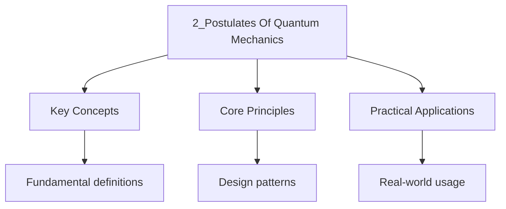

---

date: 2026-07-23T21:57:32+01:00
title: Postulates of Quantum Mechanics
tags:
  - Physics
  - University
description: "The state of a quantum system is completely described by a normalised Vector in  Comprehensive educational content coverage with definitions and practice proble"
---

<!-- Breadcrumb Schema for SEO -->

### 2.1 The Postulates

**Postulate 1 (State Space).** The state of a quantum system is completely described by a normalised
Vector $|\psi\rangle$ in a complex Hilbert space $\mathcal{H}$.

_Physical motivation._ Superposition is observed in interference experiments (e.g., double-slit),
Where a particle can traverse multiple paths simultaneously. The complex-valued nature of the state
Is essential: relative phases between superposition components produce observable interference
Patterns that cannot be replicated with real amplitudes alone.

**Postulate 2 (Observables).** Every measurable quantity (observable) is represented by a Hermitian
(self-adjoint) operator $\hat{A} = \hat{A}^\dagger$ acting on $\mathcal{H}$.

_Physical motivation._ Hermitian operators have real eigenvalues, matching the fact that measurement
Outcomes are real numbers. The spectral theorem guarantees a complete set of eigenstates, providing
a Basis for expansion.

**Postulate 3 (Measurement).** A measurement of observable $\hat{A}$ yields one of the eigenvalues
$a_n$ of $\hat{A}$. The probability of measuring $a_n$ when the system is in state $|\psi\rangle$ is

$$P(a_n) = |\langle a_n | \psi \rangle|^2$$

Where $|a_n\rangle$ is the eigenstate corresponding to $a_n$. After measurement, the state collapses
To $|a_n\rangle$.

_Physical motivation._ The Born rule $P = |\langle a_n|\psi\rangle|^2$ was postulated by Born (1926)
To connect wave functions to observable probabilities. It correctly predicts the intensity
Distribution in diffraction experiments and the .../4-statistics-and-probability/2_statistics of
particle detections.

**Postulate 4 (Time Evolution).** The time evolution of the state is governed by the
**time-dependent Schrodinger equation**:

$$i\hbar \frac{\partial}{\partial t}|\psi(t)\rangle = \hat{H}|\psi(t)\rangle$$

Where $\hat{H}$ is the Hamiltonian (energy operator).

_Physical motivation._ This is the quantum analogue of Hamilton"s equations in classical mechanics.
The Schrodinger equation is linear, guaranteeing superposition is preserved. Energy conservation is
Built in: for a time-independent Hamiltonian, $\langle H \rangle$ is constant.

**Postulate 5 (Composite Systems).** The state space of a composite system is the tensor product of
The state spaces of the components.

_Physical motivation._ This postulate produces entangled states, which have been confirmed
Experimentally (Bell inequality violations, quantum teleportation). The tensor product structure
Ensures that measurements on subsystems can exhibit correlations stronger than any classical theory
Permits.

### 2.2 The Measurement Problem

The measurement postulate (Postulate 3) introduces a fundamental tension: the Schrodinger equation
Describes **deterministic, unitary** evolution, but measurement produces **probabilistic,
non-unitary** Collapse. This is the **measurement problem**.

**The conflict.** Consider a system in a superposition
$|\psi\rangle = \alpha|a_1\rangle + \beta|a_2\rangle$. Under unitary evolution, the state remains a
superposition. But a measurement of $\hat{A}$ yields Either $a_1$ or $a_2$ with probabilities
$|\alpha|^2$ and $|\beta|^2$ And the state collapses to The corresponding eigenstate. No unitary
operator can map a superposition to a single eigenstate With the correct probabilities.

**Major interpretational approaches:**

- **Copenhagen interpretation.** Collapse is a fundamental, irreducible process. The classical
  measuring apparatus triggers the collapse. No further mechanism is specified.

- **Many-worlds interpretation (Everett, 1957).** The universal wave function never collapses.
  Instead, measurement causes the observer and system to entangle, branching into multiple
  non-interacting "worlds," each corresponding to one measurement outcome.

- **Decoherence (Zurek).** Interaction with the environment rapidly suppresses off-diagonal elements
  of the reduced density matrix in a preferred basis ("einselection"), explaining the emergence of
  classical behaviour from unitary quantum mechanics.

- **Bohmian mechanics.** Particles have definite positions guided by the wave function via the
  "pilot wave." The wave function never collapses, but the effective description reproduces the Born
  rule.

The measurement problem remains an active area of research in the foundations of quantum mechanics.

### 2.3 Density Matrix Formalism

For systems where the state is not known precisely (statistical mixtures), the **density operator**
Provides a more general description than the state vector.

**Definition.** For a pure state $|\psi\rangle$The density operator is
$\hat{\rho} = |\psi\rangle\langle\psi|$. For a statistical mixture of states $|\psi_i\rangle$ with
probabilities $p_i$:

$$\hat{\rho} = \sum_i p_i\,|\psi_i\rangle\langle\psi_i|$$

**Properties:**

- $\mathrm{Tr}(\hat{\rho}) = 1$ (normalisation)
- $\hat{\rho}^\dagger = \hat{\rho}$ (Hermitian)
- $\hat{\rho}^2 = \hat{\rho}$ if and only if the state is pure; $\hat{\rho}^2 \lt \hat{\rho}$ for
  mixed states
- Expectation values: $\langle A \rangle = \mathrm{Tr}(\hat{\rho}\hat{A})$

**Time evolution:** $i\hbar\,d\hat{\rho}/dt = [\hat{H}, \hat{\rho}]$ (Liouville-von Neumann
equation).

The density matrix is essential for describing subsystems of entangled states (reduced density
Matrices via partial trace), open quantum systems, and decoherence.

### 2.4 Implications

- **Superposition:** A system can be in a linear combination of eigenstates:
  $|\psi\rangle = \sum_n c_n |a_n\rangle$.
- **Uncertainty Principle:** Non-commuting observables cannot be simultaneously measured with
  arbitrary precision.
- **Probabilistic Nature:** Quantum mechanics predicts probabilities, not deterministic outcomes.
- **No-cloning theorem.** There is no unitary operation that copies an arbitrary unknown quantum
  state $|\psi\rangle$. This follows from the linearity of quantum mechanics and has profound
  implications for quantum information.

## Cross-References

- **[Electronic Band Structure](../6-solid-state-physics/5_electronic-band-structure.md)**: Applies the quantum postulates to electrons in periodic potentials, yielding Bloch states and energy bands.

- [Calculus](https://mathematics.wyattau.com/docs/calculus)
- [Linear Algebra](https://mathematics.wyattau.com/docs/linear-algebra)
- [Quantum Computing](https://computer-science.wyattau.com/docs/quantum-computing)

## Intuition

The postulates of quantum mechanics are like the rules of a game that nature plays at the smallest scales. The state vector is your scoreboard: it contains everything knowable about the system. Hermitian operators are the measuring instruments, and their real eigenvalues are the only possible outcomes you can read. The Born rule tells you that the square of the amplitude gives the probability, like measuring how much of a wave is present at each point. Time evolution is smooth and deterministic, like a river flowing according to a fixed current. The measurement problem is the deep mystery: the smooth flow of the Schrodinger equation suddenly jerks when you look, collapsing the wave function to a single outcome. This tension between smooth evolution and sudden collapse is still debated. Decoherence explains why we do not see quantum weirdness in everyday life: the environment constantly measures the system, washing out quantum superpositions.

### 2.5 Common Mistakes

**Mistake 1: Confusing probability amplitude with probability**
The probability of measuring eigenvalue $a_n$ is $|\langle a_n|\psi\rangle|^2$, not $\langle a_n|\psi\rangle$. The amplitude $\langle a_n|\psi\rangle$ is a complex number, and probabilities must be real and non-negative. Students often forget to take the modulus squared, leading to complex or negative "probabilities."

**Mistake 2: Assuming measurement always yields the expectation value**
The expectation value $\langle \hat{A} \rangle = \sum_n a_n P(a_n)$ is the average over many measurements, not the result of a single measurement. A single measurement of $\hat{A}$ yields one of the eigenvalues $a_n$, not the expectation value. The expectation value is what you would get on average if you repeated the experiment many times.

**Mistake 3: Forgetting that measurement collapses the state**
After measuring $\hat{A}$ and obtaining $a_n$, the state collapses to $|a_n\rangle$, not to some other state. This collapse is irreversible in the sense that information about the original superposition is lost. Subsequent measurements of $\hat{A}$ will yield $a_n$ with certainty until the system evolves or is disturbed.
