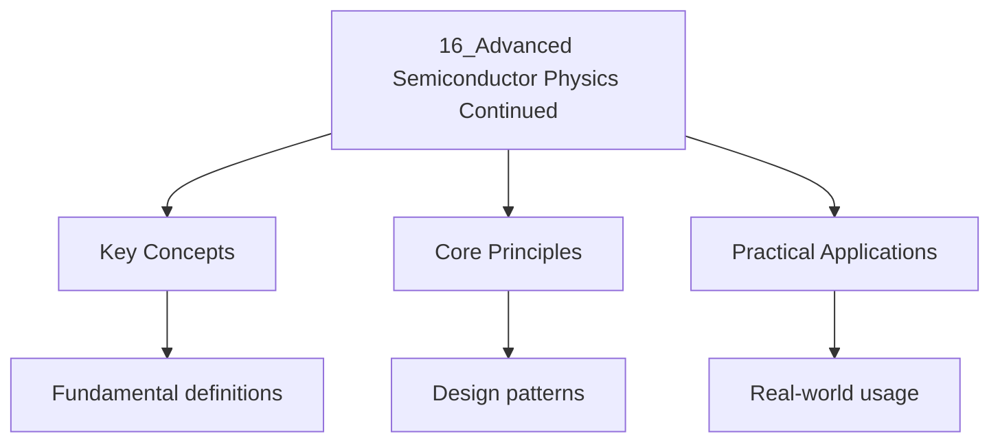

---

date: 2026-07-23T21:57:32+01:00
title: Advanced Semiconductor Physics (Continued)
tags:
  - Physics
  - University
description: "When a 2D electron gas (2DEG) is placed in a strong perpendicular magnetic field at low temperature, the Hall resistance shows quantised plateaux:"
---

<!-- Breadcrumb Schema for SEO -->

### 16.1 Quantum Hall Effect

When a 2D electron gas (2DEG) is placed in a strong perpendicular magnetic field at low temperature,
the Hall resistance shows quantised plateaux:

$$R_{xy} = \frac{h}{\nu e^2} = \frac{R_K}{\nu}$$

Where $\nu = 1, 2, 3, \ldots$ is an integer and $R_K = h/e^2 \approx 25812.8\,\Omega$ is the von
Klitzing constant.

**Integer Quantum Hall Effect (IQHE)** (von Klitzing, 1980):

- Occurs when the filling factor $\nu = n_{2D}h/(eB)$ is an integer
- At these plateaux, the longitudinal resistance $R_{xx} = 0$ (dissipationless transport)
- The quantisation is exact to better than 1 part in $10^{10}$Providing the resistance standard

**Fractional Quantum Hall Effect (FQHE)** (Tsui, Stormer, Gossard, 1982):

- Plateaux at $\nu = 1/3, 2/3, 2/5, 3/7, \ldots$
- Arises from electron--electron correlations (Laughlin wavefunction)
- Described by Chern--Simons topological field theory

**Composite fermions:** At $\nu = 1/2$The FQHE electrons bind two flux quanta to become "composite fermions" that see zero effective field. The FQHE of electrons maps to the IQHE of composite
fermions, elegantly explaining the observed sequence of fractions.

### 16.2 Mesoscopic Physics

Mesoscopic systems are intermediate in size between microscopic (atomic) and macroscopic (bulk). Key
length scales:

- **Phase coherence length** $L_\phi$: distance over which the electron maintains phase coherence (
  $1$--$10\,\mu$M at low $T$)
- **Mean free path** $\ell$: distance between elastic scattering events
- **Thermal length** $L_T = \hbar v_F/(k_BT)$

When the sample size $L < L_\phi$Quantum interference effects become observable:

- **Aharonov--Bohm oscillations:** Periodic oscillations in magnetoresistance as $B$ varies, with
  period $\Delta B = \Phi_0/A$ where $A$ is the area enclosed by the paths.
- **Weak localisation:** Quantum interference of backscattered paths enhances the probability of
  returning to the origin, increasing the resistance. This is destroyed by a magnetic field
  (negative magnetoresistance).
- **Universal conductance fluctuations:** Sample-specific, reproducible fluctuations in conductance
  of order $e^2/h$.

### 16.3 Thermoelectric Effects

**Seebeck effect:** A temperature gradient $\nabla T$ produces an electric field
$\mathbf{E} = S\nabla T$ where $S$ is the Seebeck coefficient.

**Peltier effect:** A current $I$ through a junction produces heat flow $\dot{Q} = \Pi I$ where
$\Pi = ST$ (Kelvin relation).

**Figure of merit:** $ZT = S^2\sigma T/\kappa$ where $\sigma$ is electrical conductivity and
$\kappa$ is thermal conductivity.

The **Mott formula** relates the Seebeck coefficient to the energy derivative of the conductivity:

$$S = -\frac{\pi^2 k_B^2 T}{3e}\frac{d\ln\sigma(\epsilon)}{d\epsilon}\bigg|_{\epsilon_F}$$

Best thermoelectric materials: Bi$_2$Te$_3$ ($ZT \approx 1$ at 300 K), PbTe ($ZT \approx 1.5$ at 700
K), SnSe ($ZT \approx 2.6$ at 923 K).

Worked Example 16.1: Quantum Hall Plateaux

A 2DEG in a GaAs/AlGaAs heterostructure has $n_{2D} = 3 \times 10^{15}$ m$^{-2}$.

(a) At $B = 10$ T:
$\nu = n_{2D}h/(eB) = 3 \times 10^{15} \times 6.626 \times 10^{-34}/(1.6 \times 10^{-19} \times 10) = 3 \times 10^{15} \times 4.14 \times 10^{-16} = 1.24$.

The filling factor $\nu \approx 1.24$ is close to $\nu = 1$ So the $\nu = 1$ plateau is observed
with:

$$R_{xy} = \frac{h}{e^2} = 25812.8\,\Omega$$

(b) To observe the $\nu = 2$ plateau, we need $B = n_{2D}h/(2e) = 5$ T.

(c) The cyclotron energy at $B = 10$ T:

$$\hbar\omega_c = \hbar\frac{eB}{m^*} = \frac{1.055 \times 10^{-34} \times 1.6 \times 10^{-19} \times 10}{0.067 \times 9.11 \times 10^{-31}} = \frac{1.688 \times 10^{-33}}{6.10 \times 10^{-32}} = 0.0277\,\text{eV} = 27.7\,\text{meV}$$

For IQHE plateaux to be resolved: $k_BT \ll \hbar\omega_c$I.e., $T \ll 27.7/0.0862 \approx 321$ K.
Experiments are done at $T < 4$ K.

## Worked Examples

### Example 1: Bragg diffraction

**Problem.** X-rays of wavelength $0.154 \mathrm{ nm}$ are diffracted by a crystal with interplanar
spacing $d = 0.2 \mathrm{ nm}$. Find the first-order diffraction angle.

**Solution.**
$2d\sin\theta = n\lambda \implies \sin\theta = \frac{0.154}{2 \times 0.2} = 0.385 \implies \theta = 22.7°$.

$\blacksquare$

### Example 2: Band gap

**Problem.** A semiconductor has a band gap of $1.1 \mathrm{ eV}$. Find the minimum wavelength of
light that can excite an electron across the gap.

**Solution.**
${\lambda = \frac{hc}{E_g} = \frac{1240 \mathrm{ eV\cdot} nm}}{1.1 \mathrm{ eV}} = 1127 \mathrm{ nm}$
(infrared).

$\blacksquare$

## Common Pitfalls

- **Confusing reciprocal and real space.** The reciprocal lattice is the Fourier transform of the
  real-space lattice; its vectors have dimensions of inverse length. **Fix:**
  $\vec{b}_1 = 2\pi \frac{\vec{a}_2 \times \vec{a}_3}{\vec{a}_1 \cdot (\vec{a}_2 \times \vec{a}_3)}$.
- **Wrong effective mass interpretation.** The effective mass $m^*$ can be negative near the top of
  a band; it reflects the curvature of $E(k)$. **Fix:**
  $1/m^* = \frac{1}{\hbar^2}\frac{d^2E}{dk^2}$; negative curvature gives negative effective mass.
- **Confusing metals, semiconductors, and insulators.** Metals: partially filled band.
  Semiconductors: small band gap ($\sim 1 \mathrm{ eV}$). Insulators: large band gap
  ($> 4 \mathrm{ eV}$). **Fix:** Band gap determines electrical properties; temperature can excite
  carriers across semiconductor gaps.
- **Forgetting spin degeneracy in the 2DEG.** Each Landau level holds $eB/h$ states per unit area
  per spin. With spin degeneracy, each level holds $2eB/h$. The filling factor $\nu = n_{2D}h/(eB)$
  counts filled spin-resolved levels.
- **Misidentifying the quantum Hall regime.** The IQHE requires: (1) high magnetic field so that
  $\hbar\omega_c \gg k_BT$ (Landau levels are resolved), (2) high mobility so that the scattering
  time $\tau$ satisfies $\omega_c\tau \gg 1$ (cyclotron orbits complete before scattering), and
  (3) low temperature to suppress thermal broadening.
- **Confusing thermopower with thermal conductivity.** The Seebeck coefficient $S$ measures the
  voltage generated per unit temperature difference; thermal conductivity $\kappa$ measures heat
  flow. They appear together in the figure of merit $ZT = S^2\sigma T/\kappa$ but are independent
  transport properties.

## Summary

- Crystal structure: Bravais lattices, reciprocal lattice, Miller indices.
- Bragg"s law: $2d\sin\theta = n\lambda$; determines crystal structure from diffraction patterns.
- Band theory: metals (partially filled bands), semiconductors (small gap), insulators (large gap).
- Effective mass: $m^* = \hbar^2/(d^2E/dk^2)$; describes carrier response to external fields.
- IQHE: Hall resistance quantised as $R_{xy} = h/(ne^2)$; filling factor $\nu = n_{2D}h/(eB)$.
- Thermoelectrics: figure of merit $ZT = S^2\sigma T/\kappa$; best materials achieve $ZT > 2$.

These topics form the foundation of modern semiconductor device physics and are essential for
understanding electronic, photonic, and energy-harvesting technologies.

## Applications

| Application | Principle | Key Material |
| --- | --- | --- |
| Solar cells | Photons with $E > E_g$ create electron-hole pairs | Si ($E_g = 1.1$ eV), GaAs ($1.4$ eV) |
| LEDs | Electron-hole recombination emits photons | GaN (blue), InGaAsP (telecom IR) |
| Transistors | Gate voltage controls channel conductivity | Si MOSFET, GaAs HEMT |
| Hall effect sensors | $V_H = IB/(nqd)$ measures magnetic field | InSb (high mobility) |
| Thermoelectric coolers | Peltier effect from $n$- and $p$-type junctions | Bi$_2$Te$_3$ ($ZT \approx 1$) |
| Quantum Hall resistance standard | $R_K = h/e^2 = 25812.807\,\Omega$ | GaAs 2DEG at $T < 4$ K |

The IQHE is used to define the ohm internationally; $R_K$ is exact by definition since 2019.

## Intuition

The quantum Hall effect reveals that in a strong magnetic field at low temperature, the Hall resistance of a two-dimensional electron gas becomes quantized in integer multiples of $h/e^2$. This occurs because the magnetic field quantizes the electron orbits into discrete Landau levels, and the filling factor determines how many levels are occupied. Plateaus appear because localized states in the gaps between Landau levels pin the Fermi energy, making the Hall resistance insensitive to small changes in field or density. The integer quantum Hall effect is topological: the quantization is exact regardless of sample geometry or impurities, protected by the topology of the electron's band structure in magnetic field.

## Cross-References

| Topic                           | Site        | Link                                                                                       |
| ------------------------------- | ----------- | ------------------------------------------------------------------------------------------ |
| Solid State Physics (Overview)  | WyattsNotes | [View](17_practice-solid-state-physics)                                       |
| Quantum Mechanics               | WyattsNotes | [View](../5-quantum-mechanics/16_flashcards-quantum-mechanics)                                         |
| Thermal Physics                 | WyattsNotes | [View](../../../../../ib/src/content/docs/physics/flashcards-thermal-physics)                                           |

These topics are closely related: quantum mechanics provides the foundation for band theory,
thermal physics governs carrier statistics and thermoelectric performance, and solid state physics
provides the crystal structure context.
| Solid State Physics — MIT 6.720 | MIT OCW     | [View](https://ocw.mit.edu/courses/6-720j-integrated-microelectronic-devices-spring-2007/) |

- [Calculus](https://mathematics.wyattau.com/docs/calculus)
- [Linear Algebra](https://mathematics.wyattau.com/docs/linear-algebra)
- [Vector Calculus](https://mathematics.wyattau.com/docs/vector-calculus)
- [Quantum Computing](https://computer-science.wyattau.com/docs/quantum-computing)
