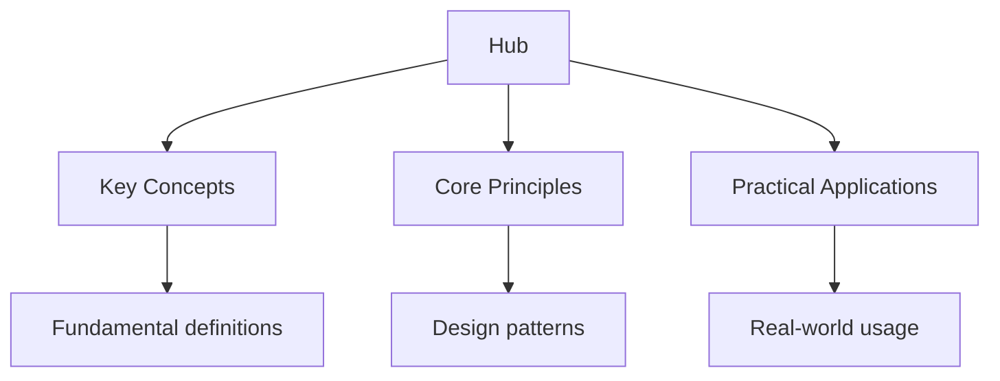

<script type="application/ld+json">
{
  "@context": "https://schema.org",
  "@type": "BreadcrumbList",
  "itemListElement": [
    {"name": "Home", "url": "https://physics.wyattau.com"},
    {"name": "Hub", "url": "https://physics.wyattau.com/hub"}
  ]
}
</script>

<script type="application/ld+json">
{
  "@context": "https://schema.org",
  "@type": "Course",
  "name": "Complete University Physics Study Guide",
  "description": "Comprehensive university physics study guide covering all major domains with derivations, problem sets, and advanced topics.",
  "provider": {
    "@type": "Organization",
    "name": "Wyatt's Notes",
    "url": "https://physics.wyattau.com"
  },
  "url": "https://physics.wyattau.com/hub",
  "educationalLevel": "University",
  "inLanguage": "en",
  "isAccessibleForFree": true
}
</script>




## Why This Guide Exists

University physics is a cumulative discipline — each topic builds on the ones before it. Classical mechanics provides the mathematical framework that electromagnetism, quantum mechanics, and thermal physics all use. This hub page maps every resource on this site and shows you how they connect, so you can study efficiently and build understanding that compounds.

These notes follow the standard undergraduate physics curriculum: from Newtonian mechanics through Lagrangian and Hamiltonian formulations, into electrodynamics, statistical mechanics, quantum theory, solid state physics, and particle physics. Each section includes derivations, worked examples, problem sets, and common pitfalls.

## Table of Contents

- [Recommended Study Order](#recommended-study-order)
- [Classical Mechanics](#classical-mechanics)
- [Thermal Physics](#thermal-physics)
- [Electromagnetism](#electromagnetism)
- [Optics and Waves](#optics-and-waves)
- [Quantum Mechanics](#quantum-mechanics)
- [Solid State Physics](#solid-state-physics)
- [Particle Physics and Cosmology](#particle-physics-and-cosmology)
- [Cross-Site Resources](#cross-site-resources)
- [Problem-Solving Strategy](#problem-solving-strategy)
- [FAQ](#faq)

---

## Recommended Study Order

Physics is deeply cumulative. The following order reflects the mathematical and conceptual dependencies between topics. Deviate from it only if your course requires it.

### Tier 1 — Foundations (Study First)

1. **Classical Mechanics** — the mathematical language all other domains use (Lagrangians, Hamiltonians, variational principles)
2. **Linear Algebra and Multivariable Calculus** — prerequisites for everything else (see [Mathematics](https://mathematics.wyattau.com/hub))

### Tier 2 — Core Theory

1. **Electromagnetism** — builds directly on mechanics and vector calculus
2. **Thermal Physics** — requires probability theory; connects to statistical mechanics
3. **Quantum Mechanics** — requires linear algebra, differential equations, and classical mechanics

### Tier 3 — Applications and Specialisations

1. **Optics and Waves** — applications of electromagnetism and wave theory
2. **Solid State Physics** — applies quantum mechanics to crystalline systems
3. **Particle Physics and Cosmology** — synthesises quantum mechanics, electromagnetism, and relativity

### Prerequisite Map

```
Classical Mechanics
    ├── Electromagnetism (vector calculus, mechanics)
    │       ├── Optics and Waves (wave equations, Maxwell's equations)
    │       └── Particle Physics (special relativity, fields)
    ├── Quantum Mechanics (Lagrangian/Hamiltonian formalism)
    │       ├── Solid State Physics (band theory, phonons)
    │       └── Particle Physics (Feynman diagrams, symmetries)
    └── Thermal Physics (probability, statistical methods)
            └── Solid State Physics (statistical mechanics of solids)
```

---

## Classical Mechanics

Classical mechanics is the foundation of all physics. It begins with Newton's laws and builds through Lagrangian and Hamiltonian formulations to the variational principles that underpin modern physics.

### Core Topics

- [Newtonian Mechanics Review](1-classical-mechanics/1_newtonian-mechanics-review) — forces, energy, momentum, and conservation laws
- [Generalised Coordinates and Constraints](1-classical-mechanics/2_generalised-coordinates-and-constraints) — degrees of freedom, holonomic constraints, and configuration space
- [Lagrangian Mechanics](1-classical-mechanics/3_lagrangian-mechanics) — the Lagrangian, Euler-Lagrange equations, and generalised momenta
- [Hamiltonian Mechanics](1-classical-mechanics/4_hamiltonian-mechanics) — phase space, canonical transformations, and Hamilton's equations
- [Noether's Theorem and Conservation Laws](1-classical-mechanics/5_noether-s-theorem-and-conservation-laws) — symmetry and conservation: the deepest result in classical physics
- [Small Oscillations and Normal Modes](1-classical-mechanics/7_small-oscillations-and-normal-modes) — coupled oscillators and normal mode decomposition
- [Rigid Body Dynamics](1-classical-mechanics/8_rigid-body-dynamics) — moments of inertia, Euler equations, and gyroscopic motion

### Advanced Topics

- [Rigid Body Dynamics Advanced](1-classical-mechanics/10_rigid-body-dynamics-advanced-topics)
- [Hamiltonian Mechanics Advanced](1-classical-mechanics/11_hamiltonian-mechanics-advanced-topics)
- [Nonlinear Dynamics and Chaos](1-classical-mechanics/12_nonlinear-dynamics-and-chaos) — sensitive dependence, strange attractors, and Lyapunov exponents
- [Classical Field Theory](1-classical-mechanics/13_classical-field-theory) — fields as dynamical objects: the bridge to field theory

### Problem Set

- [Classical Mechanics Problem Set](1-classical-mechanics/9_problem-set)

---

## Thermal Physics

Thermal physics bridges the macroscopic laws of thermodynamics with the microscopic behaviour of particles through statistical mechanics. It explains why heat flows, why entropy increases, and how phase transitions emerge from simple microscopic rules.

### Core Topics

- [The Laws of Thermodynamics](2-thermal-physics/1_the-laws-of-thermodynamics) — zeroth through third laws, work, heat, and entropy
- [Statistical Mechanics](/2-thermal-physics/2_statistical-microchanics) — microstates, macrostates, and the Boltzmann distribution
- [The Grand Canonical Ensemble](2-thermal-physics/3_the-grand-canonical-ensemble) — variable particle number and chemical potential
- [Fermi Gas at Finite Temperature](2-thermal-physics/4_fermi-gas-at-finite-temperature) — Fermi-Dirac statistics and electron gases
- [Bose-Einstein Condensation](2-thermal-physics/5_bose-einstein-condensation) — quantum statistics and condensates
- [The Ising Model](2-thermal-physics/6_the-ising-model) — magnetic systems and statistical modelling
- [Maxwell-Boltzmann Distribution](2-thermal-physics/7_classical-limit-and-the-maxwell-boltzmann-distribution)

### Advanced Topics

- [Phase Transitions](2-thermal-physics/10_phase-transitions) — critical phenomena and universality
- [Landau Theory of Phase Transitions](2-thermal-physics/11_landau-theory-of-phase-transitions)
- [Ising Model and Mean Field Theory](2-thermal-physics/12_ising-model-and-mean-field-theory)
- [Fluctuation-Dissipation Theorem](2-thermal-physics/13_fluctuation-dissipation-theorem)
- [Microcanonical Ensemble](2-thermal-physics/14_microcanonical-ensemble)
- [Quantum Statistics in Detail](2-thermal-physics/15_quantum-statistics-in-detail)
- [Debye Model of Solids](2-thermal-physics/16_the-debye-model-of-solids)
- [Thermodynamic Response Functions](2-thermal-physics/17_thermodynamic-response-functions)
- [Quantum Statistical Mechanics Advanced](2-thermal-physics/18_quantum-statistical-mechanics-advanced-topics)
- [Irreversible Thermodynamics and Fluctuations](2-thermal-physics/19_irreversible-thermodynamics-and-fluctuations)
- [Thermodynamics of Information Processing](2-thermal-physics/20_thermodynamics-of-information-processing)
- [Thermodynamics and Statistical Mechanics](2-thermal-physics/21_thermodynamics-and-statistical-mechanics)

### Problem Set and Review

- [Common Pitfalls](2-thermal-physics/8_common-pitfalls)
- [Problem Set](2-thermal-physics/9_problem-set)

---

## Electromagnetism

Electromagnetism unifies electricity, magnetism, and light into a single framework described by Maxwell's equations. It is the most experimentally precise theory in physics and underpins all electrical engineering and optics.

### Core Topics

- [Maxwell's Equations](3-electromagnetism/1_maxwell-s-equations) — the four equations that describe all classical electromagnetic phenomena
- [Magnetostatics](3-electromagnetism/3_magnetostatics) — magnetic fields, Biot-Savart, and Ampère's law
- [Electrodynamics](3-electromagnetism/4_electrodynamics) — time-varying fields and Faraday's law
- [Electromagnetic Waves](3-electromagnetism/5_electromagnetic-waves) — wave equation, plane waves, and energy transport
- [Potentials and Gauge Transformations](3-electromagnetism/6_potentials-and-gauge-transformations) — scalar and vector potentials, gauge invariance
- [Special Relativity and Electromagnetism](3-electromagnetism/7_special-relativity-and-electromagnetism) — how relativity unifies electric and magnetic fields

### Advanced Topics

- [Waveguides and Cavities](3-electromagnetism/9_waveguides-and-cavities)
- [Radiation from Accelerating Charges](3-electromagnetism/10_radiation-from-accelerating-charges)
- [Advanced Electrodynamics](3-electromagnetism/11_advanced-electrodynamics)
- [Special Relativity and Electromagnetism Advanced](3-electromagnetism/12_special-relativity-and-electromagnetism-12)
- [Plasma Physics Brief Overview](3-electromagnetism/13_plasma-physics-brief-overview)

### Problem Set

- [Electromagnetism Problem Set](3-electromagnetism/8_problem-set)

---

## Optics and Waves

Optics describes how light propagates, interferes, diffracts, and polarises. The wave nature of light connects directly to electromagnetism, while Fourier optics and coherence theory bridge into signal processing and quantum optics.

### Core Topics

- [The Wave Equation](4-optics-and-waves/1_the-wave-equation) — derivation and solutions in one, two, and three dimensions
- [Electromagnetic Waves](4-optics-and-waves/2_electromagnetic-waves) — plane waves, polarisation, and energy flux
- [Interference](4-optics-and-waves/3_interference) — Young's slit, thin films, and multiple-beam interference
- [Diffraction](4-optics-and-waves/4_diffraction) — single slit, diffraction gratings, and the Fraunhofer limit
- [Polarisation](/4-optics-and-waves/5_polarisation) — Malus' law, birefringence, and wave plates
- [Geometric Optics](4-optics-and-waves/6_geometric-optics) — ray tracing, mirrors, lenses, and optical instruments
- [Fourier Optics](4-optics-and-waves/7_fourier-optics) — spatial frequency filtering and the optical transfer function
- [Coherence](4-optics-and-waves/8_coherence) — temporal and spatial coherence, mutual coherence functions
- [Lasers](4-optics-and-waves/9_lasers) — stimulated emission, population inversion, and laser types

### Advanced Topics

- [Fresnel Equations](4-optics-and-waves/10_fresnel-equations) — reflection and transmission at interfaces
- [Dispersion](4-optics-and-waves/11_dispersion) — group velocity, phase velocity, and pulse broadening
- [Optical Fibres](4-optics-and-waves/12_optical-fibres) — total internal reflection and mode propagation
- [Detailed Diffraction Theory](4-optics-and-waves/16_detailed-diffraction-theory)
- [Coherence Theory](4-optics-and-waves/15_coherence-theory)
- [Polarisation in Detail](4-optics-and-waves/17_polarisation-in-detail)
- [Nonlinear Optics](4-optics-and-waves/22_nonlinear-optics)
- [Computational Imaging and Adaptive Optics](4-optics-and-waves/23_computational-imaging-and-adaptive-optics)

### Problem Set and Review

- [Common Pitfalls](4-optics-and-waves/18_common-pitfalls)
- [Problem Set](4-optics-and-waves/13_problem-set)

---

## Quantum Mechanics

Quantum mechanics replaces the deterministic world of classical physics with probabilistic wave functions and operators. It governs atoms, molecules, semiconductors, and subatomic particles. The mathematical framework — Hilbert spaces, operators, and commutation relations — is the language of modern physics.

### Core Topics

- [Historical Motivation](5-quantum-mechanics/1_historical-motivation) — blackbody radiation, photoelectric effect, and the Bohr model
- [Postulates of Quantum Mechanics](5-quantum-mechanics/2_postulates-of-quantum-mechanics) — state vectors, observables, and measurement
- [Wave Functions and the Schrödinger Equation](5-quantum-mechanics/3_wave-functions-and-the-schrodinger-equation) — time-dependent and time-independent forms
- [Operators and Observables](5-quantum-mechanics/4_operators-and-observables) — Hermitian operators, eigenvalues, and the uncertainty principle
- [One-Dimensional Problems](5-quantum-mechanics/5_one-dimensional-problems) — infinite square well, harmonic oscillator, and tunnelling
- [Angular Momentum and the Hydrogen Atom](5-quantum-mechanics/6_angular-momentum-and-the-hydrogen-atom) — spherical harmonics and atomic orbitals
- [Spin](5-quantum-mechanics/7_spin) — spin-½ systems, Stern-Gerlach, and spin operators
- [Approximation Methods](5-quantum-mechanics/8_approximation-methods) — perturbation theory and variational methods

### Advanced Topics

- [Identical Particles and Exchange Symmetry](5-quantum-mechanics/10_identical-particles-and-exchange-symmetry) — bosons, fermions, and the Pauli exclusion principle
- [Variational Methods](5-quantum-mechanics/11_variational-methods)
- [Time-Dependent Perturbation Theory](5-quantum-mechanics/12_time-dependent-perturbation-theory) — transition rates and Fermi's golden rule
- [Scattering Theory](5-quantum-mechanics/13_scattering-theory) — cross sections, Born approximation, and partial waves
- [WKB Approximation](5-quantum-mechanics/14_wkb-approximation) — semiclassical methods
- [Density Functional Theory](5-quantum-mechanics/15_density-functional-theory-conceptual-overview) — conceptual overview of DFT
- [Quantum Mechanics II](5-quantum-mechanics/18_quantum-mechanics-ii)

### Problem Set

- [Problem Set](5-quantum-mechanics/9_problem-set)

---

## Solid State Physics

Solid state physics applies quantum mechanics and statistical mechanics to crystalline materials. It explains why some materials conduct electricity, others insulate, and others become superconductors at low temperatures.

### Core Topics

- [Crystal Structures](6-solid-state-physics/1_crystal-structures) — Bravais lattices, unit cells, and symmetry operations
- [Reciprocal Lattice](6-solid-state-physics/2_reciprocal-lattice) — Brillouin zones and diffraction conditions
- [Diffraction](6-solid-state-physics/3_diffraction) — X-ray, neutron, and electron diffraction techniques
- [Lattice Vibrations and Phonons](6-solid-state-physics/4_lattice-vibrations-and-phonons) — quantised vibrations and heat capacity
- [Electronic Band Structure](6-solid-state-physics/5_electronic-band-structure) — free electron model, tight-binding, and band gaps
- [Semiconductors](6-solid-state-physics/6_semiconductors) — intrinsic and extrinsic semiconductors, doping, and p-n junctions
- [Superconductivity](6-solid-state-physics/7_superconductivity) — BCS theory, critical fields, and Type I/II superconductors
- [Transport Properties](6-solid-state-physics/8_transport-properties) — conductivity, Hall effect, and Boltzmann transport

### Advanced Topics

- [Defects in Crystals](6-solid-state-physics/9_defects-in-crystals) — point defects, dislocations, and grain boundaries
- [Magnetism in Solids](6-solid-state-physics/10_magnetism-in-solids) — paramagnetism, ferromagnetism, and antiferromagnetism
- [Advanced Topics in Superconductivity](6-solid-state-physics/12_advanced-topics-in-superconductivity)
- [Topological Insulators and Semimetals](6-solid-state-physics/13_topological-insulators-and-semimetals)
- [Many-Body Physics in Solids](6-solid-state-physics/14_many-body-physics-in-solids)
- [Advanced Semiconductor Physics](6-solid-state-physics/15_advanced-semiconductor-physics)

### Problem Set

- [Problem Set](6-solid-state-physics/11_problem-set)

---

## Particle Physics and Cosmology

Particle physics identifies the fundamental building blocks of matter and the forces between them. The Standard Model is the most successful theory in physics — its predictions match experiments to extraordinary precision. Cosmology extends physics to the universe as a whole.

### Core Topics

- [The Standard Model](7-particle-physics-and-cosmology/1_the-standard-model) — quarks, leptons, gauge bosons, and the Higgs
- [Conservation Laws and Symmetries](7-particle-physics-and-cosmology/2_conservation-laws-and-symmetries) — Noether's theorem applied to particle physics
- [Feynman Diagrams](7-particle-physics-and-cosmology/3_feynman-diagrams) — perturbative calculations in quantum field theory
- [The Higgs Mechanism](7-particle-physics-and-cosmology/4_the-higgs-mechanism) — spontaneous symmetry breaking and mass generation
- [Group Theory in Particle Physics](7-particle-physics-and-cosmology/5_group-theory-in-particle-physics) — SU(3), SU(2), and U(1) symmetries
- [Running Coupling Constants](7-particle-physics-and-cosmology/6_running-coupling-constants) — renormalisation and asymptotic freedom
- [Big Bang Cosmology](7-particle-physics-and-cosmology/7_big-bang-cosmology) — expansion, nucleosynthesis, and the CMB

### Advanced Topics

- [Neutrino Physics](7-particle-physics-and-cosmology/8_neutrino-physics) — oscillations, masses, and Majorana fermions
- [Beyond the Standard Model](7-particle-physics-and-cosmology/9_beyond-the-standard-model) — grand unification, supersymmetry, and string theory
- [Advanced Topics in Particle Physics](7-particle-physics-and-cosmology/11_advanced-topics-in-particle-physics)
- [Advanced Topics in Cosmology](7-particle-physics-and-cosmology/12_advanced-topics-in-cosmology)
- [Precision Tests of the Standard Model](7-particle-physics-and-cosmology/13_precision-tests-of-the-standard-model)

### Problem Set

- [Problem Set](7-particle-physics-and-cosmology/10_problem-set)

---

## Diagnostics

- [Classical Mechanics Diagnostic](diagnostics/diag-mechanics)

---

## Cross-Site Resources

Physics relies heavily on mathematical tools and connects to applied fields:

- **[University Mathematics](https://mathematics.wyattau.com/hub)** — linear algebra, differential equations, real analysis, and group theory: the mathematical foundations of physics
- **[C++ Programming](https://programming.wyattau.com/hub)** — computational physics, numerical methods, and scientific computing
- **[IB Physics](https://ib.wyattau.com/physics)** — introductory physics at the IB level, covering the same domains with less mathematical rigour
- **[DSE Physics](https://dse.wyattau.com/physics)** — secondary-level physics for the Hong Kong DSE

---

## Problem-Solving Strategy

University physics problems require a systematic approach. Here is a framework that works across all domains.

### 1. Identify the Physics

Before writing equations, determine which physical principles apply. Is this a conservation of energy problem? Does it involve forces? Is it a boundary value problem? Classification before calculation prevents wasted effort.

### 2. Draw the Diagram

Sketch the system. Label all quantities with symbols. Define your coordinate system. A clear diagram often reveals the solution path.

### 3. Write the Equations

Start with general principles: Newton's second law, Maxwell's equations, the Schrödinger equation, or conservation laws. Substitute known values and identify what you need to find.

### 4. Solve Symbolically

Work through the algebra in terms of symbols, not numbers. This reduces arithmetic errors and makes dimensional analysis possible at every step.

### 5. Check Your Answer

- **Dimensions** — does the answer have the right units?
- **Limits** — what happens when a parameter goes to zero or infinity?
- **Signs** — does the direction make physical sense?
- **Symmetry** — does the answer respect the symmetries of the problem?

### Common Mistakes

**Skipping the derivation and memorising the formula:** Physics formulas are derived from principles. Memorising without understanding leads to wrong applications when conditions change.

**Confusing precision with accuracy:** High-precision calculations with wrong assumptions give precise but inaccurate results. Always check whether the model matches the physical situation.

**Ignoring sig figs and unit consistency:** Physics answers must have correct significant figures and consistent units. Dropping units mid-calculation leads to dimensional errors.

---

## Frequently Asked Questions

### Where should I start if I am new to university physics?

Begin with [Classical Mechanics](1-classical-mechanics). Work through every section in order, including the problem sets. Classical mechanics teaches you the mathematical habits (Lagrangians, Hamiltonians, variational methods) that all other domains assume.

### How do I use the problem sets?

Attempt each problem before reading any solution. Spend at least 15 minutes on a problem before moving on. The problems are ordered by difficulty within each set — the early ones are straightforward applications, while the later ones require synthesis of multiple concepts.

### What mathematics do I need?

At minimum: multivariable calculus (partial derivatives, multiple integrals, vector calculus), linear algebra (vectors, matrices, eigenvalues), and ordinary differential equations. For advanced topics: real analysis, group theory, and complex analysis. See the [Mathematics study guide](https://mathematics.wyattau.com/hub) for detailed coverage.

### Are these notes suitable for self-study?

Yes. Each section includes definitions, derivations, worked examples, and common pitfalls. Work through the examples with paper and pen — do not just read them. Then attempt the problem sets to test your understanding.

### How do the advanced topics relate to the core topics?

Advanced topics extend the core material. For example, nonlinear dynamics extends classical mechanics, quantum statistical mechanics extends both quantum mechanics and thermal physics, and topological insulators extend solid state physics. Study the core topics first — the advanced topics assume fluency with the foundational material.

### Can I study quantum mechanics without completing classical mechanics first?

You can, but you will miss the mathematical tools (Hamiltonian mechanics, Lagrangians, symplectic structure) that make quantum mechanics natural rather than arbitrary. The transition from classical to quantum is much smoother when you understand the Hamiltonian formulation.

---

*Last updated: 24 July 2026*

*Written by Wyatt. For questions or feedback, visit [wyattau.com](https://wyattau.com).*
