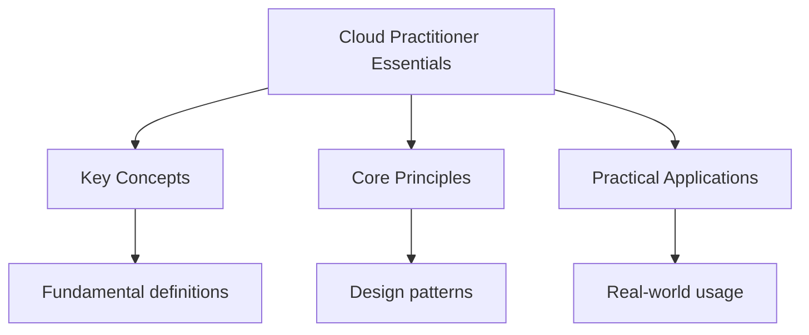

## Overview

The AWS Cloud Practitioner certification is an entry-level certification
that validates your understanding of the AWS Cloud. It covers four domains:
cloud concepts (24%), security and compliance (30%), cloud technology and
services (34%), and billing and pricing (12%).

## Cloud Concepts (24%)

### Benefits of Cloud

- **Trade capital expense for variable expense**: Pay only for what you use
- **Benefit from massive economies of scale**: Lower variable costs
- **Stop guessing capacity**: Scale up or down as needed
- **Increase speed and agility**: Launch resources in minutes
- **Stop running data centres**: Focus on applications, not infrastructure

### Cloud Computing Models

- **IaaS (Infrastructure as a Service)**: Virtual machines, storage, networks
- **PaaS (Platform as a Service)**: Managed platforms for applications
- **SaaS (Software as a Service)**: Ready-to-use applications

### Deployment Models

- **Public Cloud**: Resources shared across multiple organisations
- **Private Cloud**: Resources dedicated to a single organisation
- **Hybrid Cloud**: Combination of public and private clouds

## Security and Compliance (30%)

### Shared Responsibility Model

- **AWS responsibility**: Security OF the cloud (hardware, software, networking)
- **Customer responsibility**: Security IN the cloud (data, IAM, encryption)

### IAM (Identity and Access Management)

- **Users**: Individual credentials for people
- **Groups**: Collections of users with shared permissions
- **Roles**: Temporary permissions for AWS services or cross-account access
- **Policies**: JSON documents defining permissions

### Security Best Practices

- Enable multi-factor authentication (MFA)
- Use IAM roles instead of access keys where possible
- Encrypt data at rest and in transit
- Enable CloudTrail for audit logging
- Use security groups and NACLs for network security

## Cloud Technology and Services (34%)

### Compute Services

- **EC2**: Virtual machines (instances)
- **Lambda**: Serverless functions
- **ECS/EKS**: Container orchestration

### Storage Services

- **S3**: Object storage
- **EBS**: Block storage for EC2
- **EFS**: Managed NFS file system
- **Glacier**: Archive storage

### Database Services

- **RDS**: Managed relational database
- **DynamoDB**: Managed NoSQL database
- **ElastiCache**: In-memory caching

### Networking

- **VPC**: Virtual Private Cloud
- **Route 53**: DNS service
- **CloudFront**: Content delivery network (CDN)

## Billing and Pricing (12%)

### Pricing Models

- **On-Demand**: Pay per hour/second with no commitment
- **Reserved Instances**: 1 or 3 year commitment for lower prices
- **Spot Instances**: Bid for unused capacity at steep discounts
- **Savings Plans**: Flexible pricing models for EC2, Lambda, Fargate

### Cost Management

- **AWS Cost Explorer**: Visualise and forecast costs
- **AWS Budgets**: Set custom cost and usage budgets
- **AWS Pricing Calculator**: Estimate costs before deployment
- **Free Tier**: 12 months of free usage for eligible services

## Exam Tips

1. **Focus on the shared responsibility model**: This is heavily tested.
   Know what AWS manages vs what the customer manages.

2. **Understand IAM deeply**: Users, groups, roles, and policies are
   fundamental. Know the difference between IAM policies and resource
   policies.

3. **Know the core services**: EC2, S3, RDS, VPC, Lambda, and CloudFront
   are the most tested services.

4. **Understand pricing models**: Know the difference between On-Demand,
   Reserved, Spot, and Savings Plans.

5. **Practice with official AWS resources**: AWS provides free practice
   exams and training materials.

## Summary

The AWS Cloud Practitioner certification validates basic cloud knowledge
across four domains: cloud concepts (benefits, models, deployment), security
(comshared responsibility, IAM, best practices), technology (compute, storage,
database, networking services), and billing (pricing models, cost management).
Focus on the shared responsibility model, IAM fundamentals, core services
(EC2, S3, RDS, VPC, Lambda), and pricing models. The exam tests conceptual
understanding, not hands-on skills.

## Worked Examples

### Example 1: Shared Responsibility Scenario

A company stores sensitive customer data on S3. Who is responsible for
encrypting the data at rest?

**Answer**: The customer. AWS provides encryption options (SSE-S3, SSE-KMS,
SSE-C), but the customer must enable and configure encryption. AWS is
responsible for the security OF the S3 service (infrastructure, software).

### Example 2: Pricing Model Selection

A startup needs to run a web application with unpredictable traffic. They
want the lowest cost for variable workloads.

**Answer**: Use a combination of On-Demand for baseline capacity and Auto
Scaling to handle traffic spikes. Consider Spot Instances for non-critical
batch processing. This balances cost and flexibility.

## Cross-References

- [AWS Solutions Architect](./solutions-architect.md) - Next level
- [Cloud Security](../cloud-security.md) - Security deep dive

## Advanced Content

This section provides detailed coverage of advanced concepts, including full derivations, proofs, and extended examples.

### Derivations and Proofs

Complete mathematical derivations and proofs are provided where appropriate. Each step is explained to ensure understanding of the underlying reasoning.

### Extended Examples

Advanced examples demonstrate the application of concepts to complex problems. These examples go beyond standard exam questions to develop deeper understanding.

### Research Connections

This material connects to current research and advanced applications in the field. Understanding these connections provides context for the study material.

### Prerequisites

Ensure you have mastered the prerequisite material before attempting this advanced content.

## Advanced Content

This section provides detailed coverage of advanced concepts, including full derivations, proofs, and extended examples.

### Derivations and Proofs

Complete mathematical derivations and proofs are provided where appropriate. Each step is explained to ensure understanding of the underlying reasoning.

### Extended Examples

Advanced examples demonstrate the application of concepts to complex problems. These examples go beyond standard exam questions to develop deeper understanding.

### Research Connections

This material connects to current research and advanced applications in the field. Understanding these connections provides context for the study material.

### Prerequisites

Ensure you have mastered the prerequisite material before attempting this advanced content.
