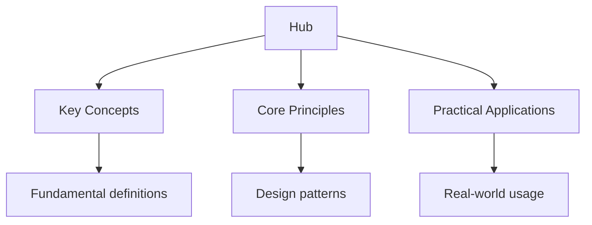

## Why This Guide Exists

Professional IT certifications validate your skills and knowledge in specific technology domains. They are recognised by employers worldwide and can accelerate your career, increase your earning potential, and demonstrate commitment to professional development. Unlike academic degrees, certifications are focused, practical, and directly applicable to job roles.

The IT certification landscape is dominated by a few major vendors: Amazon Web Services (AWS) for cloud computing, CompTIA for foundational IT skills, Cisco for networking, and Microsoft for enterprise technologies. Each vendor offers a progression of certifications from entry-level to expert, creating clear career paths.

This hub page maps every resource on this site, organised by vendor and certification track, with study plans and exam strategies to help you earn your certifications efficiently.

## Table of Contents

- [AWS Certifications](#aws-certifications)
- [CompTIA Certifications](#comptia-certifications)
- [Cisco Certifications](#cisco-certifications)
- [Microsoft Certifications](#microsoft-certifications)
- [Other IT Certifications](#other-it-certifications)
- [Certification Paths and Planning](#certification-paths-and-planning)
- [Exam Preparation Strategies](#exam-preparation-strategies)
- [Recommended Study Plan](#recommended-study-plan)
- [Cross-Site Resources](#cross-site-resources)
- [FAQ](#faq)

---

## AWS Certifications

Amazon Web Services offers certifications across cloud architecture, operations, machine learning, and specialty domains. AWS certifications are among the most in-demand IT certifications globally, reflecting the dominance of AWS in cloud computing.

### Topic Notes

- [AWS Certification Overview](aws) -- the certification landscape, exam formats, and renewal requirements
- [Cloud Practitioner](aws/cloud-practitioner) -- the entry-level certification covering AWS cloud fundamentals
- [Solutions Architect Associate](aws/solutions-architect-associate) -- designing distributed systems on AWS
- [Developer Associate](aws/developer-associate) -- developing and deploying AWS-based applications
- [SysOps Administrator Associate](aws/sysops-associate) -- operating and managing workloads on AWS
- [Solutions Architect Professional](aws/solutions-architect-professional) -- advanced architectural design on AWS
- [Specialty Certifications](aws/specialty) -- Security, Advanced Networking, Machine Learning, and Database

### Practice and Review

- [Flashcards: AWS Cloud Practitioner](flashcards-aws-cp)
- [Flashcards: AWS Solutions Architect](flashcards-aws-saa)
- [Practice Questions: Cloud Practitioner](practice-aws-cp)
- [Practice Questions: Solutions Architect](practice-aws-saa)
- [AWS Scenario-Based Questions](aws/scenarios)

### Key Exam Focus

AWS certifications test your ability to design and implement solutions using AWS services. The Cloud Practitioner exam is non-technical and covers billing, support, and cloud concepts. The Associate-level exams test your knowledge of specific AWS services and when to use them. Focus on understanding the use cases for each service, not just memorising service names.

---

## CompTIA Certifications

CompTIA (Computing Technology Industry Association) offers vendor-neutral certifications that validate foundational IT skills. CompTIA certifications are often required or preferred for entry-level IT positions.

### Topic Notes

- [CompTIA Certification Overview](comptia) -- the certification portfolio and career paths
- [IT Fundamentals (ITF+)](comptia/itf) -- the entry-level certification for IT newcomers
- [A+](comptia/a-plus) -- hardware and software support, the standard entry-level IT certification
- [Network+](comptia/network-plus) -- networking concepts, infrastructure, and troubleshooting
- [Security+](comptia/security-plus) -- cybersecurity concepts, threats, and risk management
- [CySA+](comptia/cybersecurity-analyst) -- behavioural analytics and threat detection
- [PenTest+](../../../../security/src/content/docs/pentesting-and-attacks) -- penetration testing and vulnerability assessment
- [Cloud+](comptia/cloud-plus) -- cloud computing concepts and virtualisation

### Practice and Review

- [Flashcards: CompTIA A+](flashcards-comptia-aplus)
- [Flashcards: CompTIA Network+](flashcards-comptia-network)
- [Flashcards: CompTIA Security+](flashcards-comptia-security)
- [Practice Questions: A+](practice-comptia-aplus)
- [Practice Questions: Network+](practice-comptia-network)
- [Practice Questions: Security+](practice-comptia-security)

### Key Exam Focus

CompTIA exams are scenario-based: you must apply knowledge to real-world situations, not just recall facts. The A+ exams cover hardware, software, troubleshooting, and operational procedures. Network+ tests networking concepts across vendor platforms. Security+ is the most sought-after, covering risk management, threat analysis, cryptography, and identity management. All CompTIA exams use performance-based questions that require you to perform tasks in a simulated environment.

---

## Cisco Certifications

Cisco certifications validate networking and infrastructure skills. Cisco's certification programme ranges from entry-level to expert, with the CCNA and CCNP being the most widely recognised networking certifications.

### Topic Notes

- [Cisco Certification Overview](cisco) -- the certification hierarchy and specialisation tracks
- [CCNA](cisco/ccna) -- Cisco Certified Network Associate, the foundational networking certification
- [CCNP Enterprise](cisco/ccnp-enterprise) -- advanced enterprise networking and infrastructure
- [CCNP Security](cisco/ccnp-security) -- Cisco security technologies and solutions
- [CCNP Data Center](cisco/ccnp-datacenter) -- data centre infrastructure and automation
- [CCIE](cisco/ccie) -- Cisco Certified Internetwork Expert, the expert-level certification
- [DevNet](cisco/devnet) -- network automation, APIs, and software development

### Practice and Review

- [Flashcards: CCNA](flashcards-ccna)
- [Flashcards: CCNP](flashcards-ccnp)
- [Practice Questions: CCNA](practice-ccna)
- [Cisco Lab Scenarios](cisco/labs) -- hands-on lab exercises for practical exam preparation

### Key Exam Focus

Cisco certifications are known for their practical, hands-on focus. The CCNA tests routing, switching, networking fundamentals, and basic security. The CCNP requires deeper knowledge of specific technologies. Cisco exams include simulation-based questions where you configure routers and switches in a virtual environment. Practice with Cisco Packet Tracer or GNS3 to build hands-on skills.

---

## Microsoft Certifications

Microsoft certifications cover Azure cloud services, Microsoft 365, Dynamics 365, and related technologies.

### Topic Notes

- [Microsoft Certification Overview](microsoft) -- the certification landscape and role-based certification model
- [Azure Fundamentals (AZ-900)](microsoft/az-900) -- Azure cloud concepts, services, and pricing
- [Azure Administrator (AZ-104)](microsoft/az-104) -- managing Azure subscriptions and resources
- [Azure Developer (AZ-204)](microsoft/az-204) -- developing solutions for Azure
- [Azure Solutions Architect (AZ-305)](microsoft/az-305) -- designing cloud and hybrid solutions on Azure
- [Microsoft 365](microsoft/m365) -- endpoint management, security, and compliance

### Practice and Review

- [Flashcards: AZ-900](flashcards-az-900)
- [Flashcards: AZ-104](flashcards-az-104)
- [Practice Questions: AZ-900](practice-az-900)
- [Practice Questions: AZ-104](practice-az-104)

### Key Exam Focus

Microsoft certifications are role-based: they test the skills needed for specific job roles. Azure certifications range from fundamentals (AZ-900) to expert (AZ-305). The exams include multiple-choice questions, case studies, and lab exercises. Focus on understanding Azure services, their use cases, and how to manage them using the Azure portal, CLI, and PowerShell.

---

## Other IT Certifications

Beyond the major vendors, several other certifications are valuable in specific domains.

### Topic Notes

- [Google Cloud Certifications](other/google-cloud) -- GCP Associate Cloud Engineer, Professional Cloud Architect
- [Kubernetes (CKA/CKAD)](../../../../tools/src/content/docs/kubernetes-docker) -- Certified Kubernetes Administrator and Application Developer
- [Terraform (HashiCorp)](other/terraform) -- HashiCorp Certified Terraform Associate
- [ITIL](other/itil) -- IT service management certifications
- [Certified Information Systems Security Professional (CISSP)](other/cissp) -- the premier cybersecurity certification
- [Project Management Professional (PMP)](other/pmp) -- project management certification

### Practice and Review

- [Flashcards: Google Cloud](flashcards-google-cloud)
- [Flashcards: Kubernetes](flashcards-kubernetes)
- [Practice Questions: Google Cloud](practice-google-cloud)
- [Practice Questions: Kubernetes](practice-kubernetes)

### Key Exam Focus

Each certification vendor has its own exam format and focus. Google Cloud certifications mirror AWS in structure but focus on GCP services. Kubernetes certifications are heavily hands-on, requiring you to solve real problems in a live cluster. ITIL is a process-oriented certification focused on IT service management best practices. CISSP is a broad cybersecurity certification covering eight domains of information security.

---

## Certification Paths and Planning

Choosing the right certification depends on your career goals, current skills, and the job market in your region.

### Cloud Computing Path

- **Entry:** AWS Cloud Practitioner or Azure Fundamentals (AZ-900)
- **Intermediate:** AWS Solutions Architect Associate or Azure Administrator (AZ-104)
- **Advanced:** AWS Solutions Architect Professional or Azure Solutions Architect (AZ-305)
- **Expert:** AWS Specialty certifications or Azure Expert roles

### Networking Path

- **Entry:** CompTIA Network+ or Cisco CCNA
- **Intermediate:** Cisco CCNP Enterprise
- **Expert:** Cisco CCIE Enterprise Infrastructure
- **Specialisation:** Juniper, Aruba, or vendor-specific networking certifications

### Cybersecurity Path

- **Entry:** CompTIA Security+
- **Intermediate:** CompTIA CySA+ or Cisco CCNP Security
- **Advanced:** CISSP or CompTIA PenTest+
- **Expert:** CISSP, CISM, or CISA

### DevOps and Cloud Native Path

- **Entry:** AWS Cloud Practitioner or Azure Fundamentals
- **Intermediate:** Kubernetes CKA or Terraform Associate
- **Advanced:** AWS DevOps Engineer or Azure DevOps Engineer Expert
- **Expert:** Cloud Security Alliance CCSK or cloud architecture specialisations

---

## Exam Preparation Strategies

Professional certification exams require a combination of knowledge, practice, and exam technique.

### Build a Strong Foundation

Start with the official exam objectives. Every certification vendor publishes a detailed list of topics covered on the exam. Use this as your study guide: work through each objective systematically and mark areas where you need more study.

### Use Multiple Resources

Combine official study materials with hands-on practice. The best certification candidates use a combination of: official vendor training, practice exams, hands-on labs, study groups, and flashcards. No single resource is sufficient.

### Practice with Exam-Like Questions

Certification exams test applied knowledge, not just memorisation. Practice questions should be scenario-based and require you to apply concepts to real situations. Take practice exams under timed conditions to build your pacing.

### Focus on Weak Areas

Use diagnostic practice tests to identify your weakest domains. Spend more time on your weak areas than on topics you already know. The goal is to be proficient across all exam objectives, not just the ones you enjoy.

---

## Recommended Study Plan

Preparing for a professional certification exam typically requires 6 to 12 weeks of consistent study, depending on your experience level.

### Weeks 1 to 2: Planning and Foundation

- Download the official exam objectives and study guide
- Take a diagnostic practice test to assess your current knowledge
- Set up a home lab or cloud sandbox for hands-on practice
- Begin flashcard practice: 15 to 20 minutes daily

### Weeks 3 to 6: Content Mastery

- Work through each exam objective systematically
- Complete hands-on labs for every major topic
- Study one domain per week, focusing on understanding, not memorisation
- Take a practice test at the end of each week to track progress

### Weeks 7 to 9: Practice and Refinement

- Complete at least 3 full-length practice exams under timed conditions
- Review every wrong answer: understand why the correct answer is right
- Focus on your weakest domains identified by practice exam scores
- Continue hands-on practice to reinforce theoretical knowledge

### Weeks 10 to 12: Final Preparation

- Take one final practice exam: aim for consistent scores above the passing threshold
- Review all flashcards and notes
- Focus on exam technique: time management and question analysis
- Rest before exam day: tiredness affects concentration and recall

### Daily Routine

| Time | Activity |
| ------ | ---------- |
| Morning | Flashcards: 15 to 20 minutes of key concepts |
| Afternoon | Study: one exam objective with hands-on practice |
| Evening | Practice: 15 to 20 practice questions |
| Weekend | Full practice exam plus review |

---

## Cross-Site Resources

Wyatt's Notes is a network of interconnected study sites. The professional certification content connects to related material:

- **[Computer Science](https://computer-science.wyattau.com/hub)** -- foundational CS knowledge that supports IT certifications
- **[Linux](https://linux.wyattau.com/hub)** -- Linux skills essential for cloud and DevOps certifications
- **[Networking](https://networking.wyattau.com/hub)** -- networking concepts that complement Cisco and CompTIA certifications
- **[Security](https://security.wyattau.com/hub)** -- cybersecurity concepts that support CompTIA Security+ and CISSP
- **[Databases](https://databases.wyattau.com/hub)** -- database knowledge for AWS and Azure certifications
- **[Main Site: Wyatt's Notes](https://wyattsnotes.wyattau.com)** -- explore all 46 study sites in the network

---

## Frequently Asked Questions

### How should I start using this site?

Choose the certification that matches your career goals. Take a diagnostic practice test to assess your current knowledge. Then work through the exam objectives systematically, using the topic notes, practice questions, and flashcards for each domain.

### How long does it take to prepare for a certification exam?

Most candidates need 6 to 12 weeks of consistent study. Entry-level certifications (Cloud Practitioner, A+, ITF+) may require less time (4 to 6 weeks). Expert-level certifications (CCIE, CISSP) may require 3 to 6 months. Your experience level is the biggest factor: experienced professionals can often prepare faster.

### Are practice exams similar to the real exam?

Good practice exams closely mirror the real exam in format, difficulty, and content. Use practice exams from reputable sources, not dump sites. Practice exams are a diagnostic tool: the review after the exam is more valuable than the exam itself.

### Do certifications expire?

Yes, most IT certifications expire after 2 to 3 years. AWS certifications are valid for 3 years and can be renewed by passing a recertification exam. CompTIA certifications are valid for 3 years and can be renewed through continuing education units (CEUs). Cisco certifications are valid for 3 years.

### Are certifications worth the cost?

For most IT professionals, certifications provide a clear return on investment. They can lead to higher salaries, more job opportunities, and greater credibility. The cost of certification exams (typically $150 to $500) and preparation materials is modest compared to the potential career benefits.

### Can I study for a certification while working full-time?

Yes. Most certification candidates study while working full-time. Dedicate 1 to 2 hours per day to study, and use weekends for longer study sessions. The key is consistency: regular daily study is more effective than occasional marathon sessions.

### What is the pass mark for certification exams?

Pass marks vary by certification. AWS Associate exams require approximately 72% to 75%. CompTIA exams use a scaled scoring system (typically 100 to 900, with a passing score around 700 to 750). Cisco exams use a similar scaled system. Check the specific certification vendor's website for the exact passing score.

---

*Last updated: 24 July 2026*

*Written by Wyatt. For questions or feedback, visit [wyattau.com](https://wyattau.com).*
