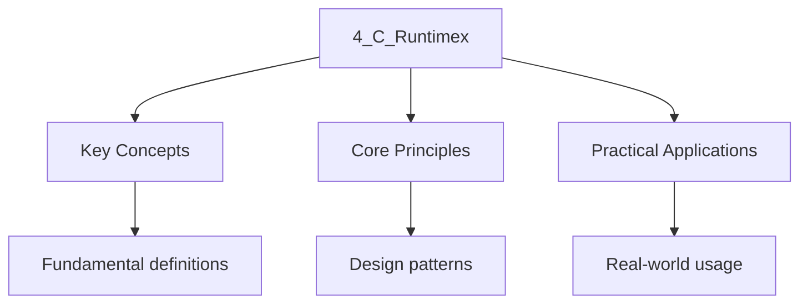

---

title: "The C Runtime (CRT) | Programming"
description: "A common misconception is that the execution of a C++ program begins at . In reality, is merely a callback function invoked by the after a complex"
date: 2025-12-12T04:23:24.345Z
tags:
  - cpp
categories:
  - cpp
---

import { Tabs, TabItem } from "@astrojs/starlight/components";

## Intuition

The C Runtime is the hidden scaffolding that supports your C++ program before main() even executes. When the operating system loads your binary, it jumps to a CRT startup routine that sets up the stack, initialises the heap, runs global constructors, and only then calls main(). The CRT provides fundamental services like memory allocation, thread creation, and signal handling that the standard library builds upon. Understanding this startup sequence explains why global objects are constructed before main() and why the order of initialisation across translation units can cause subtle bugs.

A common misconception is that the execution of a C++ program begins at `main()`. In reality,
`main()` is merely a callback function invoked by the **C Runtime (CRT)** after a complex
Initialization sequence.

The CRT serves as the abstraction layer between the Operating System Kernel and the C++ Abstract
Machine. It is responsible for setting up the stack, initializing the heap, handling signals, and,
Critically for C++, orchestrating the construction of global objects.

## What the CRT Provides Beyond Language Features

The CRT implements services that the C++ standard library relies on but that are not part of the
Language itself:

- **Memory allocation:** The implementation of `malloc``free``operator new`And `operator delete`
  (ultimately backed by `brk`/`mmap` on Linux or `VirtualAlloc` on Windows).
- **Thread support:** `pthread_create` on Linux, `CreateThread` on Windows. `std::thread` is built
  on top of these.
- **File I/O:** `fopen``fread``fwrite` wrap system calls (`open``read``write`).
- **Signal handling:** `signal()``raise()` provide POSIX signal semantics.
- **Exception infrastructure:** Stack unwinding for C++ exceptions requires CRT support
  (`__cxa_begin_catch``__cxa_throw` on Itanium ABI platforms).
- **Locale and ctype:** Character classification, numeric formatting, and locale management.
- **Exit and cleanup:** `atexit``exit``abort`And the termination sequence.

## The Physical Entry Point

When the OS Loader (e.g., `ld.so` on Linux or `ntdll.dll` on Windows) loads a binary, it jumps to
The address specified in the file header (ELF or PE). This address does **not** point to `main`.

- **Linux (ELF):** Points to `_start`Provided by `crt1.o`.
- **Windows (PE):** Points to `mainCRTStartup` (or `wmainCRTStartup`), provided by the MSVC Runtime.

### ELF Entry Point Details

The ELF header's `e_entry` field specifies the virtual address of the entry point. This is Set by
the linker script (`ENTRY(_start)`) or by the compiler driver when linking with the CRT Startup
objects. You can inspect it:

```bash
readelf -h ./app | grep Entry
## Entry point address: 0x401020
```

On modern Linux with PIE (Position-Independent Executables), the entry point is a relative offset
That the dynamic linker resolves at load time. The kernel sets the instruction pointer to this
Address after mapping the binary's `PT_LOAD` segments into memory.

## The Startup Sequence

The full startup path on Linux (glibc) is:

1. **Kernel Handoff:** The OS maps pages into memory and sets the Instruction Pointer (RIP) to the
   Entry Point (`_start`).
2. **`_start` (in `crt1.o`):** This is a tiny assembly stub. It pops `argc` from the stack, sets up
   `argv`And calls `__libc_start_main`.
3. **`__libc_start_main` (in libc.so):** The main CRT initialization function. It:

- Registers the program's `main` function as an `atexit` callback.
- Calls `__libc_csu_init`Which walks the `.init_array` section.
- **`.init_array` processing:** Each function pointer in `.init_array` is called. This is where C++
  global constructors execute.

1. **`main()` is called** with `argc``argv`And `envp`.
2. **Return from `main`:** The return value is passed to `exit()`Triggering the termination
   sequence.

```cpp
// Simplified conceptual flow
_start:
    pop %rdi          // argc
    mov %rsp, %rsi    // argv
    call __libc_start_main
    // never returns

__libc_start_main(main, argc, argv, init, fini, rtld_fini, stack_end):
    // ... setup ...
    __libc_csu_init()   // runs .init_array (global constructors)
    result = main(argc, argv, envp)
    exit(result)
```

### Detailed Stack Layout at `_start`

When the kernel transfers control to `_start`The stack contains the program's execution Parameters,
laid out by the kernel in a specific format defined by the System V ABI:

```
High Address
+------------------+
| argc             |  (%rsp)
+------------------+
| argv[0]          |  8(%rsp)
| argv[1]          |  16(%rsp)
| ...              |
| NULL             |
+------------------+
| envp[0]          |
| envp[1]          |
| ...              |
| NULL             |
+------------------+
| auxv entries     |  (ELF auxiliary vector)
| ...              |
+------------------+
| padding          |
| strings...       |
| ...              |
+------------------+
Low Address
```

The `_start` stub reads `argc` from the top of the stack, computes `argv` as `RSP + 8`And `envp` As
`RSP + 8 + (argc + 1) * 8`. This layout is guaranteed by the System V AMD64 ABI and is
Platform-specific (Windows uses a different layout passed via the MSVC CRT).

## C++ Static Initialization

The most architecturally significant phase of startup is **C++ Initialization**. This allows code to
Run before `main`.

### The `.init_array` Section

The compiler generates a list of function pointers for every global or static object that requires a
Constructor. These pointers are stored in specific binary sections.

<Tabs>
 <TabItem label="Linux (ELF)">

**Sections:**

- `.init_array`: An array of function pointers executed by the CRT startup routine
  (`__libc_csu_init`).
- `.fini_array`: An array of function pointers executed at termination.

**Inspection:**

```bash
readelf -x .init_array ./app
```

 </TabItem>
 <TabItem label="Windows (PE)">

**Sections:**

- `.CRT$XCU`: The section used by the MSVC CRT to discover C++ initializers.

**Inspection:**

```cmd
dumpbin /SECTION:.CRT$XCU /RAWDATA app.exe
```

 </TabItem>
</Tabs>

### Initialization Order and the Static Init Fiasco

The C++ Standard [N4950 S6.6.3.2] guarantees that global objects _within a single Translation Unit_
Are initialized in the order of definition. However, the order of initialization **across different
Translation Units is unspecified**.

**Scenario:**

- `FileA.cpp`: Defines `int x = 42;`
- `FileB.cpp`: Defines `int y = x + 1;`

If the linker arranges `FileB` to initialize before `FileA``y` will be initialized to garbage (or
Zero) + 1, not 43.

### Proof: Static Initialization Order Across TUs Is Unspecified

Per [N4950 S6.6.3.2 p2]: "Dynamic initialization of a non-local variable with static storage
Duration is either ordered or unordered." For variables in different translation units, the standard
Classifies initialization as **unordered** unless the variable has a constant initializer or is an
Inline variable.

Formally, let $v_1$ be defined in $TU_1$ and $v_2$ be defined in $TU_2$Where $v_2$'s initializer
Depends on $v_1$. The standard does not require $TU_1$'s initialization to complete before $TU_2$'s
Initialization begins. The implementation is free to order them in any way, and this ordering may
Change between compiler versions, link orders, or optimization levels.

This is not merely an academic concern. In practice, the initialization order depends on the order
In which object files appear in the linker's input, which is determined by the build system. A
Seemingly unrelated change to `CMakeLists.txt` (adding a new source file) can silently reorder the
Linker input and cause a previously correct program to crash during startup.

**Architectural Mitigation:**

1. **Constinit (C++20):** Use `constinit` variables which are guaranteed to be initialized at
   compile-time (placed in `.data`), avoiding runtime execution code entirely.
2. **Construct On First Use:** Wrap static globals in a function.

```cpp
// Thread-safe in C++11+ (Magic Statics) [N4950 S6.8]
int& get_global() \{
    static int x = 42; // Initialized only when get_global() is first called
    return x;
\}
```

The "magic statics" guarantee [N4950 S6.8 p8] ensures that the initialization of function-local
Statics is thread-safe and happens exactly once, on first call. This defers the initialization to a
Point where all dependencies are guaranteed to be available.

### How the CRT Finds Constructors

The compiler generates a special initialization function for each TU that has global constructors.
For GCC/Clang, this function is named `_GLOBAL__sub_I_<filename>` and is placed in the `.init_array`
Section via a linker attribute:

```cpp
// What the compiler emits (conceptually)
__attribute__((constructor))
static void _GLOBAL__sub_I_file_cpp() \{
    // Call constructors for all global objects in this TU
    global_obj.~T(); // actually constructor call
\}
```

The linker collects all `_GLOBAL__sub_I_*` functions from all object files and places their
Addresses in the `.init_array` section. The CRT iterates this array during startup.

## `atexit` and Destructors

The CRT uses `atexit` to manage cleanup. When a C++ program returns from `main()`The following
Sequence runs:

1. **`atexit` handlers:** Functions registered via `std::atexit()` are called in reverse
   registration order.
2. **Static destructors:** Destructors for global/static C++ objects are called in reverse order of
   construction.
3. **Stream flushing:** `std::cout` and `printf` buffers are flushed to file descriptors.
4. **OS Exit:** The CRT invokes the `exit_group` syscall (Linux) or `ExitProcess` API (Windows).

The CRT internally registers static destructors as `atexit` callbacks during startup. This means the
Destructor order interleaves with explicitly registered `atexit` handlers based on registration
Time.

```cpp
#include <cstdlib>

struct Logger \{
    ~Logger() \{ /* flush logs */ \}
\};

Logger global_logger;  // Destructor registered as atexit callback during startup

void on_exit() \{
    // Also registered as atexit callback
\}

int main() \{
    std::atexit(on_exit);
    return 0;
    // atexit callbacks run in reverse order:
    // 1. on_exit
    // 2. ~Logger (global_logger destructor)
\}
```

## CRT on Different Platforms

<Tabs>
 <TabItem label="glibc (Linux)">

Glibc is the most common CRT on Linux. Key characteristics:

- Dynamic linking by default (libc.so.6).
- `_start` in `crt1.o``__libc_start_main` in libc.so.
- Thread-local storage via `tls_setup` in `ld.so`.
- Robust `dlopen`/`dlsym` for dynamic loading.

```bash
## Inspect the CRT objects linked into your binary
ldd ./app
readelf -d ./app | grep NEEDED
```

 </TabItem>
 <TabItem label="musl (Alpine, embedded)">

Musl is a lightweight, BSD-licensed CRT. Key differences from glibc:

- Smaller binary footprint (ideal for containers and embedded).
- Simpler startup sequence.
- No `libpthread` separate library (pthreads are built in).
- Different `__libc_start_main` implementation.

```bash
# Alpine Linux uses musl by default
docker run --rm alpine sh -c "ldd /bin/ls"
```

 </TabItem>
 <TabItem label="MSVC (Windows)">

MSVC provides two CRT variants with significantly different behavior:

- **Dynamic (`/MD`):** Links against `ucrtbase.dll` (Universal C Runtime) and `vcruntime140.dll`.
- **Static (`/MT`):** Embeds the CRT into the executable.

The MSVC startup calls `mainCRTStartup`Which initializes the heap, runs `.CRT$XCU` initializers, And
calls `main`.

```cmd
dumpbin /DEPENDENTS app.exe
```

 </TabItem>
</Tabs>

## Freestanding vs. Hosted Environments

The C++ standard defines two execution environments [N4950 S6.9.1]:

### Hosted Environment

The full C++ language is available. The CRT provides `main`Startup/termination, dynamic memory,
Exceptions, and the entire standard library. This is the default for all desktop, server, and mobile
Platforms.

### Freestanding Environment

Only a minimal subset of the language is available:

- No `main()` required (a custom entry point may be used).
- No dynamic memory allocation (no `new``delete``malloc`).
- No exceptions (no `try`/`catch`No `throw`).
- No RTTI (no `dynamic_cast`No `typeid`).
- Only these standard library headers are required: `&lt;cstddef&gt;``&lt;cfloat&gt;`
  `&lt;climits&gt;``&lt;cstdalign&gt;``&lt;cstdarg&gt;``&lt;cstdbool&gt;``&lt;cstdlib&gt;` (only
  `abort``atexit``at_quick_exit``exit``quick_exit``_Exit`), `&lt;cstdint&gt;`
  `&lt;cstdio&gt;``&lt;cstring&gt;``&lt;ctime&gt;``&lt;type_traits&gt;``&lt;limits&gt;`
  `&lt;new&gt;` (placement new only), `&lt;initializer_list&gt;``&lt;ciso646&gt;`.

Per [N4950 S6.9.1 p4], in a freestanding environment, the startup and termination semantics are
Implementation-defined. There is no guarantee that `.init_array` is processed or that `atexit`
Functions are called.

### The `-ffreestanding` Flag

GCC and Clang support `-ffreestanding` to compile for a freestanding environment:

```bash
# Compile for freestanding (OS kernel, bootloader)
clang++ -ffreestanding -nostdlib -c kernel.cpp -o kernel.o
```

Flags commonly used together with `-ffreestanding`:

- **`-nostdlib`:** Do not link the standard library or startup files.
- **`-nostdinc`:** Do not search standard include paths.
- **`-nostdinc++`:** Do not search C++ standard include paths.
- **`-fno-exceptions`:** Disable exception support.
- **`-fno-rtti`:** Disable RTTI.

### Writing a Custom Entry Point

In a freestanding environment, you provide your own entry point:

```cpp
// kernel_entry.cpp (freestanding)
extern "C" void _start() \{
    // Custom initialization
    // No CRT, no global constructors, no atexit

    // Must call exit syscall manually (or loop forever for a kernel)
    while (true) \{
        __asm__ volatile("hlt");
    \}
\}

// Link without CRT
// clang++ -ffreestanding -nostdlib -fuse-ld=lld -T linker.ld kernel_entry.cpp -o kernel.elf
```

### Stack Initialization in Freestanding Environments

In a hosted environment, the kernel sets up the stack before jumping to `_start`. In a freestanding
Environment (e.g., a bare-metal bootloader), the stack must be configured manually, in the Assembly
entry point or via a linker script:

```ld
/* linker.ld */
SECTIONS
\{
    . = 0x80000;
    .text : \{ *(.text) \}
    .rodata : \{ *(.rodata) \}
    .data : \{ *(.data) \}
    .bss : \{
        __bss_start = .;
        *(.bss)
        __bss_end = .;
    \}
    . = ALIGN(16);
    . = . + 0x4000;  /* 16 KB stack */
    __stack_top = .;
\}
```

```cpp
// Assembly stub sets RSP to __stack_top before calling _start
extern "C" void _start();

__asm__(
    ".global _entry\n"
    "_entry:\n"
    "  ldr sp, =__stack_top\n"
    "  bl _start\n"
);
```

## Program Termination

Returning from `main()` is functionally equivalent to calling `std::exit()`. The process does not
End immediately; the CRT must unwind the environment.

### The Termination Sequence

1. **Return from `main`:** The return value is passed to the CRT.
2. **`atexit` Handlers:** Functions registered via `std::atexit` are called in reverse order of
   registration.
3. **Static Destructors:** Destructors for global/static C++ objects are called (reverse order of
   construction).
4. **Stream Flushing:** `std::cout` / `printf` buffers are flushed to file descriptors.
5. **OS Exit:** The CRT invokes the `exit` syscall (Linux) or `ExitProcess` API (Windows), returning
   control to the kernel.

:::caution
<strong>`std::terminate` vs `std::exit` If an exception escapes `main`Or an unjoinable</strong>

`std::thread` is destroyed, the CRT calls `std::terminate`. This calls `std::abort`Which kills the
Process **without** running static destructors or file buffer flushing. This often results in
Truncated logs or corrupted data files.
:::
### `std::exit` vs `std::quick_exit` vs `std::_Exit`

Per [N4950 S18.5], the C++ standard provides three termination functions with distinct semantics:

| Function          | `atexit` handlers | `at_quick_exit` handlers | Static destructors | Stream flush |
| :---------------- | :---------------- | :----------------------- | :----------------- | :----------- |
| `std::exit`       | Yes (reverse)     | No                       | Yes (reverse)      | Yes          |
| `std::quick_exit` | No                | Yes (reverse)            | No                 | No           |
| `std::_Exit`      | No                | No                       | No                 | No           |
| `std::abort`      | No                | No                       | No                 | No           |

`std::quick_exit` was introduced in C++11 for scenarios where fast termination is needed (e.g.,
Process restart in a supervised environment) and cleanup is handled externally. It is the
Recommended alternative to `abort` when you need to skip destructors intentionally.

## CRT Linkage Modes (Windows Specific)

On Linux, the CRT is almost always linked dynamically (`glibc`). On Windows, MSVC offers a choice
That profoundly affects architecture.

### 1. Dynamic Linking (`/MD``/MDd`)

- **Mechanism:** The executable relies on `VCRUNTIME140.DLL` and `UCRTBASE.DLL` present on the
  system.
- **Pros:** Smaller binary; OS patches to the CRT apply automatically; Memory ownership (Heap) is
  shared across DLL boundaries.
- **Cons:** "DLL Hell" (missing redistributables).

### 2. Static Linking (`/MT``/MTd`)

- **Mechanism:** The CRT code is copied directly into the `.exe`.
- **Pros:** Standalone executable (no dependencies).
- **Cons:** Bloated binary; **Heap Isolation**.

### The Heap Isolation Trap

If `App.exe` is linked with `/MT` and `Lib.dll` is linked with `/MT`They essentially have **separate
Heaps**.

- Allocating memory in `Lib.dll` and freeing it in `App.exe` causes a Heap Corruption crash.
- **Best Practice:** Always use `/MD` (Dynamic) for non-trivial systems involving multiple DLLs.

## Architectural Verification

To understand the startup cost of your application, you can profile the time spent _before_ `main`.

### Linux (LD_DEBUG)

The dynamic linker can report relocation processing time.

```bash
LD_DEBUG=statistics ./app
```

### Analyzing Initializers

If startup is slow, you may have excessive global constructors. Use `nm` to count them.

```bash
# Look for internal initialization functions generated by GCC/Clang
nm -C ./app | grep _GLOBAL__sub_I
```

Each entry represents a function that runs before `main`. Minimizing these is a key optimization for
CLI tools and short-lived microservices.

## Common Pitfalls

- **Static init fiasco:** Global objects in different TUs have undefined initialization order. Use
  "construct on first use" (magic statics) or `constinit`.
- **`std::terminate` skips destructors:** An uncaught exception or destroyed joinable thread calls
  `std::abort`Bypassing cleanup. Always catch exceptions in `main` or use `std::set_terminate`.
- **Heap isolation on Windows with `/MT`:** Memory allocated in one DLL must be freed in the same
  DLL. Use `/MD` or provide deallocation functions in the DLL.
- **Excessive global constructors in CLI tools:** Each global constructor adds startup latency.
  Profile with `LD_DEBUG=statistics` and minimize.
- **Freestanding without `-nostdlib`:** Using `-ffreestanding` alone still links the CRT. Use
  `-nostdlib` and provide your own `_start` for true freestanding.
- **Using `std::quick_exit` without registering handlers:** Unlike `std::exit``quick_exit` does not
  run static destructors or flush streams. If you use it, register any necessary cleanup with
  `std::at_quick_exit`.
- **Assuming the stack is initialized in freestanding environments:** The kernel initializes the
  stack in hosted environments, but in bare-metal contexts, you must set `SP` manually before
  calling any C++ code.

## Thread-Local Storage Initialization

TLS variables have their own initialization lifecycle that interacts with the CRT startup sequence.
The two categories have fundamentally different performance characteristics:

1. **Static TLS:** Variables declared `thread_local` with constant initializers (zero-initialization
   or constant-expression initialization) are placed in the `.tbss` or `.tdata` ELF sections. The
   dynamic linker (`ld.so`) allocates and initializes these when a new thread is created via the TLS
   block template. Access cost is a single segment register load (`%fs:offset` on x86-64) —
   effectively free after thread creation.
2. **Dynamic TLS:** Variables with non-constant initializers (including function-local
   `thread_local` and types with non-trivial constructors) require a guard variable and an
   initialization function. On first access, the CRT checks the guard atomically, calls the
   initializer if needed, and registers a destructor via `__cxa_thread_atexit`. First access has
   significant overhead compared to static TLS.

```cpp
#include <iostream>
#include <string>

thread_local int tls_zero = 0;

thread_local std::string tls_dynamic = "hello";

void thread_entry() \{
    std::cout << tls_dynamic << "\n";
\}
```

On glibc, `__cxa_thread_atexit` registers per-thread destructors that run when the thread exits,
Analogous to how `atexit` works for the main thread. If the main thread accesses dynamic TLS, the
Destructors run during the normal termination sequence. On Windows, the mechanism is `DllMain` with
`DLL_THREAD_DETACH`.

:::caution
<strong>Dynamic TLS has a significant first-access penalty (guard variable check, potential</strong>

Initialization, destructor registration). On hot paths, prefer static TLS (constant initialization)
Or pass data explicitly via function parameters.
:::
## DSO Constructor and Destructor Ordering

When a program links against shared libraries (`.so` on Linux, `.dll` on Windows), each DSO has its
Own `.init_array` and `.fini_array`. The dynamic linker coordinates initialization across all DSOs:

1. The dynamic linker loads all DSOs in **breadth-first dependency order**.
2. Constructors run in **reverse dependency order**: leaf DSOs initialize first, then their
   dependencies.
3. Destructors run in **dependency order**: dependencies destroyed first, then leaf DSOs.

```bash
LD_DEBUG=init ./app
# init: init=0x7f... libbar.so
# init: init=0x7f... libfoo.so
# init: init=0x7f... process
```

A common pitfall is using a global object from one DSO during the construction of a global object in
Another DSO -- if the DSO ordering is wrong, the dependency may not yet be constructed. The
"construct on first use" pattern (magic statics) mitigates this by deferring initialization to first
Access rather than load time.

:::caution
<strong>`LD_PRELOAD` interposes symbols but does not change `.init_array` ordering. A preloaded</strong>

Library's constructors still run in dependency order relative to other DSOs. If the preloaded
Library depends on symbols from the main executable, those symbols may not yet be initialized.
:::
## The `main` Function Signature and Return Value

The C++ standard specifies two valid signatures for `main` [N4950 S6.6.1]:

```cpp
int main() \{ \}
int main(int argc, char* argv[]) \{ \}
```

The return type of `main` must be `int`. If `main` terminates without a `return` statement, the CRT
Implicitly returns `0` [N4950 S6.6.1 p5]. The return value is passed to `std::exit()`Which
Translates it to the process exit status:

- `0` indicates success.
- Non-zero values are implementation-defined but conventionally indicate failure.
- Only the low 8 bits of the exit status are visible to the parent process (via `waitpid` on Linux
  or `GetExitCodeProcess` on Windows). Values $0$ through $255$ are representable.

Per [N4950 S6.6.1 p3], the `argv[0]` element points to the name used to invoke the program (or an
Empty string if the name is not available). The `argv` array is terminated by a null pointer, and
`argc` equals the number of elements in `argv` excluding the null terminator.

## Heap and Stack Initialization

### Stack Initialization

In a hosted environment, the kernel allocates the main thread's stack as part of process creation.
The stack size is configurable and platform-dependent:

```bash
# Linux: view and set stack size (default is in standard practice 8 MB)
ulimit -s
ulimit -s 65536  # Set to 64 MB
```

The stack grows downward on x86/x86_64 and upward on ARM. The stack pointer is initialized by the
Kernel to the top of the allocated stack region before jumping to `_start`. The CRT does not
Explicitly zero the stack; stack memory contains whatever data was left by the kernel's page
Allocation mechanism ( zeroed pages from the page cache, but this is not guaranteed).

### Heap Initialization

The CRT initializes the heap allocator before any user code runs. The heap implementation varies by
CRT:

| CRT          | Heap Implementation     | Backing System Calls                       |
| :----------- | :---------------------- | :----------------------------------------- |
| **glibc**    | ptmalloc2 (malloc/free) | `brk` (small), `mmap` (large, &gt; 128 KB) |
| **musl**     | oom-safe malloc         | `mmap` with `MAP_ANONYMOUS`                |
| **MSVC**     | Low-fragmentation heap  | `VirtualAlloc` / `HeapAlloc`               |
| **jemalloc** | Arena-based allocator   | `mmap` / `sbrk`                            |

The heap is initialized during `__libc_start_main` (glibc) or `mainCRTStartup` (MSVC) before the
`.init_array` processing. This ensures that global constructors can safely use `new`/`malloc`.

:::caution
<strong>The heap is **not** thread-safe at initialization time. If a global constructor spawns a</strong>

Thread that allocates memory, the thread may encounter a partially-initialized heap. In practice,
This is safe on glibc and MSVC because the heap is fully initialized before `.init_array`
Processing, but it is a theoretical concern on custom CRTs.
:::
### `operator new` and the CRT

C++ `operator new` ultimately calls `malloc` (or a CRT-specific allocator). The CRT provides the
Default implementation, but it can be replaced by defining a custom `operator new`:

```cpp
#include <cstdlib>
#include <new>

void* operator new(std::size_t size) \{
    void* ptr = std::malloc(size);
    if (!ptr) throw std::bad_alloc();
    return ptr;
\}

void operator delete(void* ptr) noexcept \{
    std::free(ptr);
\}
```

Per [N4950 S17.7.3], replacing the global `operator new` is allowed but must be done consistently
Across all TUs in the program. If one TU replaces `operator new` and another does not, the ODR is
Violated and behavior is undefined. This is because `operator new` has external linkage and the
Linker resolves it to a single definition.

## Signal Handling and the CRT

The CRT provides the interface between POSIX/OS signals and C++ exception handling. When a signal is
Delivered (e.g., `SIGSEGV``SIGFPE`), the CRT's signal handler may:

1. **Translate to C++ exception:** Some CRTs translate signals like `SIGFPE` (divide by zero) into
   C++ exceptions, allowing `try`/`catch` to handle hardware faults.
2. **Call the registered handler:** If the program registered a handler via `std::signal()`The CRT
   invokes it.
3. **Default action:** If no handler is registered, the default action ( termination) is taken.

On Itanium ABI platforms (Linux, macOS), the CRT installs a signal handler during startup that uses
The `.eh_frame` section to unwind the stack when an exception is thrown. The unwinder (`_Unwind_*`
Functions) is part of the CRT, not the compiler.

## Environment Variables and the CRT

The CRT makes the process environment available to `main` via the third parameter (on some
Platforms) or via `std::getenv()`:

```cpp
#include <cstdlib>

int main(int argc, char* argv[]) \{
    const char* path = std::getenv("PATH");
    if (path) \{
        // PATH is available
    \}
\}
```

On Linux, the environment variables are located on the stack above `argv` (see the stack layout
Diagram in the startup sequence section). The CRT constructs `envp` from this data and passes it to
`main` on platforms that support it.

:::note
<strong>Per [N4950 S6.6.1], the `main` function signature with `char* envp[]` as a third parameter</strong>

Is a common extension but not standard C++. Portable code should use `std::getenv()` instead.

## See Also

- [Linker](../1_translation/3_linker.mdx)
- [Binary Formats](../1_translation/4_binary_formats.mdx)
- [Binary Module Interfaces (BMI)](2_bmi.mdx)
- [Header Units](3_header_unit.mdx)




## Summary

This topic covers the essential concepts and techniques related to the c runtime (crt), including
key principles and practical applications.

**Key concepts include:**

- core concepts and definitions
- key principles and frameworks
- practical applications
- common techniques and methods
- evaluation and critical analysis

A thorough understanding of these concepts, combined with regular practice and review, is essential
for mastery of this topic.

## Worked Examples

Worked examples demonstrating the application of key concepts are covered in the detailed sub-pages
linked above.
:::
