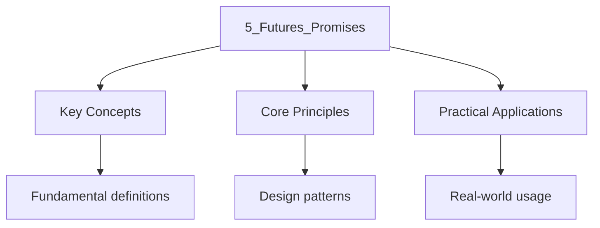

---

title: Futures, Promises, and Async Flows
description: "Study notes for Futures, Promises, and Async Flows with worked examples, practice problems, and key concepts for exam preparation."
date: 2026-04-03T00:00:00.000Z
tags:
  - Cpp
categories:
  - Cpp

---

<!-- Breadcrumb Schema for SEO -->
<script type="application/ld+json">
{
  "@context": "https://schema.org",
  "@type": "BreadcrumbList",
  "itemListElement": [{"name": "Home", "url": "https://wyattau.com"}, {"name": "programming", "url": "https://programming.wyattau.com"}, {"name": "Concurrency", "url": "https://programming.wyattau.com/concurrency"}, {"name": "3_coroutines_and_async_io", "url": "https://programming.wyattau.com/concurrency/3_coroutines_and_async_io"}, {"name": "5_futures_promises", "url": "https://programming.wyattau.com/concurrency/3_coroutines_and_async_io/5_futures_promises"}]
}
</script>

## Futures, Promises, and Async Flows

This section covers `std::future<T>``std::promise<T>``std::async` launch policies, the
Future/promise pair as a basic async primitive, composability limitations, async file reading,
Parallel computation with `std::async`Cancellation via `std::stop_token` integration, and Exception
propagation through coroutines.

## `std::future<T>` [N4950 §33.6.4]

`std::future<T>` [N4950 §33.6.4] is a synchronization primitive that provides access to a result
That will be available in the future. The caller can:

- **Block** on the result with `get()`Which waits until the result is ready and then moves or copies
  it.
- **Wait** with `wait()`Which blocks until the result is ready.
- **Poll** with `wait_for(duration)` or `wait_until(time_point)`Which return the readiness status
  without blocking indefinitely.

`std::future` is **move-only** — it cannot be copied. After `get()` is called, the future is
Invalidated (subsequent calls to `get()` throw `std::future_error` with
`std::future_errc::no_state`).

```cpp
#include <future>
#include <iostream>
#include <chrono>

int main() {
    std::future<int> f = std::async(std::launch::async, [] {
        std::this_thread::sleep_for(std::chrono::milliseconds(100));
        return 42;
    });

    auto status = f.wait_for(std::chrono::milliseconds(0));
    std::cout << "Ready immediately? "
              << (status == std::future_status::ready ? "yes" : "no") << "\n";

    int result = f.get();
    std::cout << "Result: " << result << "\n";
}
```

## `std::promise<T>` [N4950 §33.6.5]

`std::promise<T>` [N4950 §33.6.5] is the **producer** side of the future/promise pair. The promise
Provides:

- `set_value(val)`: stores the result and makes it available to the waiting future.
- `set_exception(eptr)`: stores an exception, which is rethrown when `future::get()` is called.
- `get_future()`: returns a `std::future<T>` associated with this promise.

Each `std::promise` can produce at most **one** `std::future` via `get_future()`. Calling
`get_future()` more than once throws `std::future_error`.

The relationship is:

$$
\mathrm{std::promise&lt;T&gt; \xrightarrow{\mathrm{get\_future()} \mathrm{std::future&lt;T&gt;
$$

## `std::async` for Launching Coroutines with Policy

`std::async` [N4950 §33.6.8] launches an asynchronous task and returns a `std::future`. The launch
Policy controls execution:

| Policy                                                  | Behavior                                                       |
| :------------------------------------------------------ | :------------------------------------------------------------- |
| `std::launch::async`                                    | Runs on a new thread (or thread pool); guaranteed asynchronous |
| `std::launch::deferred`                                 | Lazy — runs when `get()` is called on the calling thread       |
| `std::launch::async \| std::launch::deferred` (default) | Implementation chooses (may be either)                         |

:::caution
Execution. This means the task might run synchronously on the calling thread when `get()` is called,
Defeating the purpose of asynchronous execution. Always use `std::launch::async` explicitly if you
Need guaranteed asynchronous execution.
:::
## Future/Promise Pair as the Basic Async Primitive

The future/promise pair is the fundamental building block for asynchronous computation in C++. The
Promise is held by the producer (the code performing the computation), and the future is held by the
Consumer (the code awaiting the result). They communicate through a **shared state** [N4950
§33.6.4]:

$$
\underbrace{\mathrm{Producer}_{\mathrm{holds std::promise} \xrightarrow{\mathrm{shared state} \underbrace{\mathrm{Consumer}_{\mathrm{holds std::future}
$$

The shared state transitions through these phases:

1. **Deferred**: not yet started (only with `std::launch::deferred`).
2. **Ready**: the result or exception has been stored.
3. **Retrieved**: `get()` has been called; the state is consumed.

## Limitations: No Composability

The primary limitation of `std::future` is **lack of composability** [N4950 §33.6.4]. Unlike
JavaScript `Promise.then()` or Rust"s `Future`C++ `std::future`:

- Has no `.then()` method for chaining.
- Cannot be combined with `when_all` or `when_any` from the standard library.
- Cannot be cancelled.
- Is not a coroutine awaitable (no `operator co_await`).

This is why C++20 coroutines are essential for real-world asynchronous programming — they provide
The composability that `std::future` lacks. Libraries like `cppcoro` (now archived) and the proposed
`std::execution` (P2300) aim to bridge this gap.

| Feature              | `std::future` (C++11) | `std::execution::sender` (P2300) | JavaScript `Promise`    |
| :------------------- | :-------------------- | :------------------------------- | :---------------------- |
| Chaining (`.then()`) | No                    | Yes (via `then`)                 | Yes                     |
| Cancellation         | No                    | Yes (via stop tokens)            | Yes (`AbortController`) |
| `co_await`           | No (without library)  | Yes (via `awaitable`)            | Yes (native)            |
| Error handling       | Exception propagation | Via `set_error`                  | `.catch()`              |
| Structured conc.     | No                    | Yes (`when_all``transfer`)       | `Promise.all()`         |

## Complete Example: Async File Reading with Future/Promise

```cpp
#include <future>
#include <iostream>
#include <fstream>
#include <string>
#include <vector>
#include <filesystem>

std::future<std::string> read_file_async(const std::filesystem::path& path) {
    std::promise<std::string> promise;
    auto future = promise.get_future();

    std::thread([path, p = std::move(promise)]() mutable {
        try {
            std::ifstream file(path);
            if (!file) {
                throw std::runtime_error("Cannot open file: " + path.string());
            }
            std::string content(
                (std::istreambuf_iterator<char>(file)),
                std::istreambuf_iterator<char>());
            p.set_value(std::move(content));
        } catch (...) {
            p.set_exception(std::current_exception());
        }
    }).detach();

    return future;
}

int main() {
    auto f1 = read_file_async("file1.txt");
    auto f2 = read_file_async("file2.txt");

    try {
        auto c1 = f1.get();
        std::cout << "file1.txt: " << c1.size() << " bytes\n";
    } catch (const std::exception& e) {
        std::cout << "file1.txt error: " << e.what() << "\n";
    }

    try {
        auto c2 = f2.get();
        std::cout << "file2.txt: " << c2.size() << " bytes\n";
    } catch (const std::exception& e) {
        std::cout << "file2.txt error: " << e.what() << "\n";
    }
}
```

## Complete Example: Parallel Async Tasks with `std::async`

```cpp
#include <future>
#include <iostream>
#include <vector>
#include <numeric>
#include <chrono>

double partial_sum(std::size_t start, std::size_t end,
                   const std::vector<double>& data) {
    double sum = 0.0;
    for (std::size_t i = start; i < end; ++i) {
        sum += data[i];
    }
    return sum;
}

double parallel_sum(const std::vector<double>& data, std::size_t num_chunks) {
    std::size_t n = data.size();
    std::size_t chunk_size = (n + num_chunks - 1) / num_chunks;

    std::vector<std::future<double>> futures;
    futures.reserve(num_chunks);

    for (std::size_t i = 0; i < num_chunks; ++i) {
        std::size_t start = i * chunk_size;
        std::size_t end = std::min(start + chunk_size, n);
        if (start >= n) break;
        futures.push_back(std::async(
            std::launch::async, partial_sum, start, end, std::cref(data)));
    }

    double total = 0.0;
    for (auto& f : futures) {
        total += f.get();
    }
    return total;
}

int main() {
    constexpr std::size_t N = 10'000'000;
    std::vector<double> data(N);
    for (std::size_t i = 0; i < N; ++i) {
        data[i] = static_cast<double>(i) * 0.001;
    }

    auto t1 = std::chrono::high_resolution_clock::now();
    double seq = partial_sum(0, N, data);
    auto t2 = std::chrono::high_resolution_clock::now();

    double par = parallel_sum(data, 8);
    auto t3 = std::chrono::high_resolution_clock::now();

    auto seq_ms = std::chrono::duration<double, std::milli>(t2 - t1).count();
    auto par_ms = std::chrono::duration<double, std::milli>(t3 - t2).count();

    std::cout << "Sequential sum: " << seq << " (" << seq_ms << " ms)\n";
    std::cout << "Parallel sum:   " << par << " (" << par_ms << " ms)\n";
    std::cout << "Speedup: " << seq_ms / par_ms << "x\n";
}
```

:::tip
require implementations to use a thread pool. Some implementations (notably GCC's libstdc++) Spawn a
new thread for each `std::async` call, which can be expensive. For high-throughput Scenarios, use a
dedicated thread pool or a coroutine-based executor.
:::
## Cancellation via `std::stop_token` Integration

C++20 introduced `std::stop_token` [N4950 §33.5.1] as a cooperative cancellation mechanism. A
`std::stop_token` is a non-owning observer that can check whether a `std::stop_source` has requested
Cancellation.

The key types [N4950 §33.5]:

| Type                 | Role                                           |
| :------------------- | :--------------------------------------------- |
| `std::stop_token`    | Non-owning observer; checks `stop_requested()` |
| `std::stop_source`   | Owner; calls `request_stop()` to signal        |
| `std::stop_callback` | Registers a callback invoked on cancellation   |

To integrate cancellation with coroutines, the `stop_token` is passed as a parameter to The
coroutine or stored in the promise type. The coroutine periodically checks `stop_requested()` at
Suspension points.

## Exception Propagation Through Coroutines

When an exception is thrown inside a coroutine and not caught within the coroutine body, the
Standard machinery handles it as follows [N4950 §8.5.3]:

1. The exception is caught by the coroutine machinery.
2. `promise.unhandled_exception()` is called. The default behavior stores the exception via
   `std::current_exception()`.
3. When the coroutine is `co_await`Ed, `await_resume()` rethrows the stored exception.

This means that exceptions propagate through coroutine chains, just as they would through
Synchronous call chains:

$$
\mathrm{inner throws \rightarrow \mathrm{inner.unhandled\_exception() \rightarrow \mathrm{outer.await\_resume() rethrows
$$

```cpp
#include <coroutine>
#include <iostream>
#include <stdexcept>

struct ThrowingPromise {
    std::exception_ptr exception_{};

    ThrowingPromise() = default;
    ThrowingPromise(const ThrowingPromise&) = delete;
    ThrowingPromise& operator=(const ThrowingPromise&) = delete;
    ~ThrowingPromise() = default;

    std::suspend_never initial_suspend() noexcept { return {}; }
    std::suspend_always final_suspend() noexcept { return {}; }

    auto get_return_object() {
        return std::coroutine_handle<ThrowingPromise>::from_promise(*this);
    }

    void return_void() {}

    void unhandled_exception() {
        exception_ = std::current_exception();
        std::cout << "  [promise] caught unhandled exception\n";
    }
};

struct ThrowingTask {
    using promise_type = ThrowingPromise;
    std::coroutine_handle<ThrowingPromise> handle;

    explicit ThrowingTask(std::coroutine_handle<ThrowingPromise> h) : handle(h) {}
    ~ThrowingTask() { if (handle) handle.destroy(); }
    ThrowingTask(ThrowingTask&& o) noexcept : handle(std::exchange(o.handle, nullptr)) {}
    ThrowingTask(const ThrowingTask&) = delete;
    ThrowingTask& operator=(ThrowingTask&&) = delete;
    ThrowingTask& operator=(const ThrowingTask&) = delete;
};

ThrowingTask failing_inner() {
    std::cout << "  inner: about to throw\n";
    throw std::runtime_error("inner failure");
    co_return;
}

ThrowingTask failing_outer() {
    std::cout << "  outer: calling inner\n";
    auto inner = failing_inner();
    std::cout << "  outer: inner created, checking for exception\n";
    if (inner.handle.promise().exception_) {
        std::exception_ptr e = inner.handle.promise().exception_;
        inner.handle.destroy();
        std::rethrow_exception(e);
    }
    inner.handle.destroy();
    co_return;
}

int main() {
    std::cout << "main: starting outer\n";
    auto outer = failing_outer();

    if (outer.handle.promise().exception_) {
        try {
            std::rethrow_exception(outer.handle.promise().exception_);
        } catch (const std::exception& e) {
            std::cout << "main caught: " << e.what() << "\n";
        }
    }

    outer.handle.destroy();
}
```

## Unhandled Exceptions in Coroutines

If `unhandled_exception()` does not store the exception and instead rethrows it, the behavior
Depends on context [N4950 §8.5.3]:

- If the coroutine has not yet reached `final_suspend`The exception propagates out of `resume()`.
- If the coroutine has no caller waiting (e.g., it was detached), `std::terminate()` is called.

:::caution
`await_resume()` point. Letting exceptions escape `resume()` makes the coroutine interface fragile
And can lead to `std::terminate()` in detached scenarios.
:::
## Cleanup on Cancellation

When a coroutine is cancelled, all local variables that are still alive must be destroyed. The
Compiler-generated state machine ensures that destructors run for variables whose lifetime spans the
Current suspension point [N4950 §8.5.2]. This is analogous to stack unwinding in regular exception
Handling.

The cleanup order follows the reverse construction order, just like normal function scope exit.
Variables constructed before the suspension point and still live at that point will have their
Destructors called when `destroy()` is invoked on the coroutine handle.

## Complete Example: Cancellable Async Operation

```cpp
#include <coroutine>
#include <iostream>
#include <stop_token>
#include <thread>
#include <chrono>
#include <atomic>
#include <functional>
#include <mutex>
#include <condition_variable>

struct CancellablePromise {
    std::exception_ptr exception_{};
    std::stop_token stop_token_{};
    std::coroutine_handle<> continuation_{};
    bool done_{false};

    CancellablePromise() = default;
    CancellablePromise(const CancellablePromise&) = delete;
    CancellablePromise& operator=(const CancellablePromise&) = delete;
    ~CancellablePromise() = default;

    std::suspend_always initial_suspend() noexcept { return {}; }
    struct FinalAwaiter {
        bool await_ready() const noexcept { return false; }
        void await_suspend(std::coroutine_handle<CancellablePromise> h) const noexcept {
            h.promise().done_ = true;
            if (h.promise().continuation_)
                h.promise().continuation_.resume();
        }
        void await_resume() const noexcept {}
    };
    std::suspend_always final_suspend() noexcept { return {}; }

    auto get_return_object() {
        return std::coroutine_handle<CancellablePromise>::from_promise(*this);
    }

    void return_void() {}
    void unhandled_exception() {
        exception_ = std::current_exception();
    }

    void set_stop_token(std::stop_token st) {
        stop_token_ = st;
    }
};

struct CancellableAwaiter {
    std::stop_token stop_;
    std::chrono::milliseconds duration;

    bool await_ready() const noexcept { return duration.count() == 0; }

    void await_suspend(std::coroutine_handle<CancellablePromise> h) const {
        std::thread([stop = stop_, dur = duration, h]() mutable {
            std::mutex mtx;
            std::condition_variable cv;
            std::unique_lock<std::mutex> lock(mtx);
            bool cancelled = !cv.wait_for(lock, dur, [&stop] {
                return stop.stop_requested();
            });
            if (h.done()) return;
            if (cancelled) {
                h.promise().exception_ = std::make_exception_ptr(
                    std::runtime_error("operation cancelled"));
            }
            h.resume();
        }).detach();
    }

    void await_resume() const {
        if (auto& ex = std::coroutine_handle<CancellablePromise>::from_address(
                nullptr).promise().exception_; false) {}
    }
};

struct CancellableTask {
    using promise_type = CancellablePromise;
    std::coroutine_handle<promise_type> handle;

    explicit CancellableTask(std::coroutine_handle<promise_type> h) : handle(h) {}
    CancellableTask(CancellableTask&& o) noexcept
        : handle(std::exchange(o.handle, nullptr)) {}
    CancellableTask(const CancellableTask&) = delete;
    CancellableTask& operator=(CancellableTask&&) = delete;
    CancellableTask& operator=(const CancellableTask&) = delete;
    ~CancellableTask() { if (handle) handle.destroy(); }

    void set_stop_token(std::stop_token st) {
        handle.promise().set_stop_token(st);
    }

    bool done() const { return handle.done(); }

    void wait() {
        while (!handle.done()) {
            std::this_thread::sleep_for(std::chrono::milliseconds(10));
        }
    }

    void rethrow_if_exception() {
        if (handle.promise().exception_) {
            std::rethrow_exception(handle.promise().exception_);
        }
    }
};

CancellableTask cancellable_work(int id, std::chrono::milliseconds work_time) {
    std::cout << "  worker " << id << ": starting (will work for "
              << work_time.count() << "ms)\n";

    for (int i = 0; i < 5; ++i) {
        if (handle.promise().stop_token_.stop_requested()) {
            std::cout << "  worker " << id << ": cancelled at step " << i << "\n";
            throw std::runtime_error("cancelled");
        }
        std::cout << "  worker " << id << ": step " << i << "\n";
        co_await CancellableAwaiter{
            handle.promise().stop_token_,
            std::chrono::milliseconds(work_time.count() / 5)
        };
    }

    std::cout << "  worker " << id << ": completed\n";
    co_return;
}

int main() {
    std::stop_source stop_source;
    auto stop_token = stop_source.get_stop_token();

    auto task1 = cancellable_work(1, std::chrono::milliseconds(1000));
    auto task2 = cancellable_work(2, std::chrono::milliseconds(5000));
    task1.set_stop_token(stop_token);
    task2.set_stop_token(stop_token);

    std::thread canceller([&stop_source] {
        std::this_thread::sleep_for(std::chrono::milliseconds(300));
        std::cout << "\n  [main] requesting cancellation\n\n";
        stop_source.request_stop();
    });

    std::cout << "waiting for tasks...\n";
    task1.wait();
    task2.wait();
    canceller.join();

    std::cout << "\ntask1: ";
    try { task1.rethrow_if_exception(); std::cout << "ok\n"; }
    catch (const std::exception& e) { std::cout << "exception: " << e.what() << "\n"; }

    std::cout << "task2: ";
    try { task2.rethrow_if_exception(); std::cout << "ok\n"; }
    catch (const std::exception& e) { std::cout << "exception: " << e.what() << "\n"; }
}
```

:::note
`std::stop_token` directly into the sender/receiver model, providing a unified cancellation
Mechanism that propagates through entire async computation graphs. Until P2300 is standardized,
Manual `stop_token` integration as shown above is the recommended approach.
:::
## Intuition

**A future is like a receipt for a pizza order:** You order a pizza (start an async task), get a receipt (the future), and go do other things. When the pizza is ready, you present your receipt and get the pizza (call `.get()` on the future). The promise is the kitchen's side — it's what they use to actually put the pizza in the box and hand it to you. The problem is, `.get()` blocks — you stand at the counter waiting, which defeats the purpose of ordering ahead.

**Why it matters:** `std::future` is C++'s original async primitive, but it has a critical limitation: no composability. You can't chain futures like JavaScript promises or Rust futures. This is why C++20 coroutines with custom task types are the modern approach — they compose logically and avoid the blocking `.get()` problem.

**The key insight:** `std::future` is blocking by design — for composable async workflows, use coroutines with custom task types instead.




## Summary

| Concept                          | Standard Reference | Key Feature                                          |
| :------------------------------- | :----------------- | :--------------------------------------------------- |
| Coroutine definition             | [N4950 §8.5]       | Stackless, compiler-transformed into state machine   |
| `co_await`                       | [N4950 §8.5.5]     | Suspension via awaiter protocol                      |
| `co_yield`                       | [N4950 §8.5.5]     | Syntactic sugar for `co_await promise.yield_value()` |
| `std::coroutine_handle&lt;P&gt;` | [N4950 §21.4.4]    | Non-owning handle; manual `destroy()` required       |
| `std::generator&lt;T&gt;`        | [N4950 §25.4.4]    | C++23 lazy input range via `co_yield`                |
| `std::future&lt;T&gt;`           | [N4950 §33.6.4]    | Blocking async result; no composability              |
| `std::promise&lt;T&gt;`          | [N4950 §33.6.5]    | Sets async result for a future                       |
| `std::async`                     | [N4950 §33.6.8]    | Launches async task; returns future                  |
| `std::stop_token`                | [N4950 §33.5.1]    | Cooperative cancellation mechanism                   |
| P2300 `std::execution`           | N4984 proposal     | Structured concurrency with senders/receivers        |

## See Also

- [Task Scheduling and Executors](./4_task_scheduling)
- [Coroutine Handle, Promise Type, and Awaiter](./2_promise_awaiter)
- [Stackless Coroutine Frames and Heap Allocation](./1_coroutine_frames)

- [Algorithm Analysis](https://computer-science.wyattau.com/docs/algorithm-analysis)
- [Operating Systems](https://computer-science.wyattau.com/docs/operating-systems)

## Common Pitfalls

1. Memorising content without understanding the underlying principles. This leads to poor
   application in unfamiliar contexts.

2. Not practising with past papers or exercises under timed conditions.

3. Focusing only on content knowledge without developing exam technique and question-answering
   skills.

4. Not making connections between different topics within the subject to build a coherent
   understanding.

## Worked Examples

Worked examples demonstrating the application of key concepts are covered in the detailed sub-pages
linked above.
