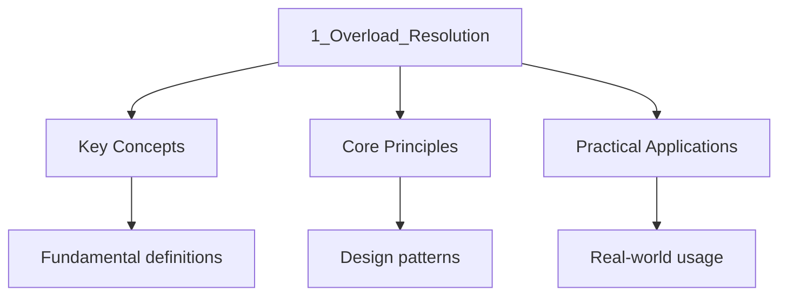

---

title: "Overload Resolution | Programming"
description: "C++ function resolution is not a simple name match. The compiler performs a multi-phase search Through namespaces, ranks candidate functions against a"
date: 2026-04-03T00:00:00.000Z
tags:
  - Cpp
categories:
  - Cpp

---

<!-- Breadcrumb Schema for SEO -->
<script type="application/ld+json">
{
  "@context": "https://schema.org",
  "@type": "BreadcrumbList",
  "itemListElement": [{"name": "Home", "url": "https://wyattau.com"}, {"name": "programming", "url": "https://programming.wyattau.com"}, {"name": "Function_architecture", "url": "https://programming.wyattau.com/function_architecture"}, {"name": "1_function_mechanics", "url": "https://programming.wyattau.com/function_architecture/1_function_mechanics"}, {"name": "1_overload_resolution", "url": "https://programming.wyattau.com/function_architecture/1_function_mechanics/1_overload_resolution"}]
}
</script>

## Overload Resolution

C++ function resolution is not a simple name match. The compiler performs a multi-phase search
Through namespaces, ranks candidate functions against a strict hierarchy of conversion ranks, and
Selects a single best viable function — or rejects the call as ambiguous.

## 1.1 Name Lookup [N4950 §6.5.4]

Name lookup determines which set of declarations are considered as candidates for a function call.
There are three forms of lookup:

1. **Unqualified lookup**: Searches enclosing scopes from innermost to outermost, stopping at the
   first scope that contains a declaration of the name.
2. **Qualified lookup**: When a name is prefixed with a namespace or class scope (e.g.,
   `std::sort`), lookup searches only that scope and its inline namespaces.
3. **Argument-dependent lookup (ADL)**: Also called Koenig lookup. For unqualified function calls,
   the namespaces and classes associated with each argument type are additionally searched.

```cpp
#include <iostream>
#include <string>

namespace lib {
    struct S {};
    void print(const S&) { std::cout << "lib::S\n"; }
}

void print(int) { std::cout << "int\n"; }

int main() {
    lib::S s;
    print(s);  // ADL finds lib::print — even though lib:: is not in scope
    print(42); // Unqualified lookup finds ::print(int)
}
```

The ADL rule is the reason `std::cout << "hello"` works: the left operand has type `std::ostream`
(in namespace `std`), and the right operand has type `const char[6]` (built-in type, no ADL
Contribution). ADL adds the namespace `std` to the search set, where `operator<<` is found.

:::note
Call to `operator<<``operator==`Or a custom swap function would require explicit namespace
Qualification, breaking generic programming.
:::
## 1.2 ADL in Detail [N4950 §6.5.4.2]

For each argument in a function call, the following namespaces and classes are added to the lookup
Set:

- The type of the argument (ignoring top-level cv-qualifiers and references).
- The template type arguments (if the argument type is a class template specialization).
- The type of each base class.
- The type of each member of the class.

The fundamental types (`int``double``bool`Etc.) and types whose associated namespaces are the Global
namespace contribute no additional search scope.

```cpp
#include <vector>
#include <iterator>

namespace A {
    struct X {};
    void swap(X&, X&) { /* A"s swap */ }
}

namespace B {
    struct Y : A::X {};
}

int main() {
    B::Y y1, y2;
    swap(y1, y2);
    // ADL finds A::swap because:
    //   Y's base class is A::X, which is associated with namespace A
}
```

### ADL and Template Argument Deduction

ADL interacts with template argument deduction in a subtle way. When an unqualified function call
Involves a template, ADL adds function template candidates from associated namespaces in addition to
Those found by ordinary unqualified lookup [N4950 §13.10.3.6]:

```cpp
#include <iostream>

namespace N {
    struct S {};

    template<typename T>
    void process(T t) {
        std::cout << "N::process\n";
    }
}

int main() {
    N::S s;
    process(s);  // ADL finds N::process<T> — T deduced as N::S
    // Even if another process() exists in the global namespace,
    // N::process is a viable candidate via ADL
}
```

This mechanism is how range-based `std::begin` and `std::end` are found: ADL discovers custom
`begin`/`end` in the type's associated namespace, falling back to `std::begin`/`std::end`.

### ADL Blocking with Parentheses

A notable subtlety: enclosing the function name in parentheses suppresses ADL [N4950 §6.5.4.1]:

```cpp
namespace N {
    struct X {};
    void f(X) { std::cout << "N::f\n"; }
}

int main() {
    N::X x;
    (f)(x);  // ADL is suppressed — only ordinary unqualified lookup
             // N::f is NOT found unless using-directive is present
}
```

This is rarely useful in application code but appears in metaprogramming where you want to prevent
ADL from pulling in unwanted candidates.

## 1.3 Overload Resolution Phases [N4950 §12.4.3]

Once name lookup has produced a set of candidate functions, the compiler performs overload
Resolution in two phases:

**Phase 1: Build the set of viable functions.** A candidate is viable if:

- It has the right number of parameters (or is variadic).
- Each argument can be implicitly converted to the corresponding parameter type.
- If the function has a trailing parameter pack, it can accept any remaining arguments.

**Phase 2: Select the best viable function.** For each argument position, the compiler ranks the
Implicit conversion sequences required. A function $f_1$ is a better match than $f_2$ if:

- For at least one argument, the conversion for $f_1$ is better than for $f_2$.
- For no argument is the conversion for $f_1$ worse than for $f_2$.

### Formal Statement of the Viable Function Selection

Let $C$ be the candidate set from name lookup. For each candidate $c \in C$Let $n_c$ be the number
Of parameters of $c$ And let $k$ be the number of arguments in the call. Candidate $c$ is viable if
And only if all of the following hold:

1. $n_c = k$Or $c$ has a trailing parameter pack and $n_c \le k$Or $c$ is variadic and $n_c \le k$.
2. For each argument $a_i$ (where $1 \le i \le k$), there exists an implicit conversion sequence
   converting $a_i$ to the type of the $i$-th parameter of $c$.

### Formal Statement of the Best Viable Function

Let $V \subseteq C$ be the set of viable functions. A function $f \in V$ is the **best viable
Function** if and only if for every other $g \in V \setminus \{f\}$:

- $\mathrm{ICS_f(i) \preceq \mathrm{ICS_g(i)$ for all argument positions $i$ (not worse).
- $\mathrm{ICS_f(j) \prec \mathrm{ICS_g(j)$ for at least one argument position $j$ (strictly
  better).

Where $\preceq$ denotes "no worse than" and $\prec$ denotes "strictly better" in the conversion
Ranking hierarchy. If no unique best viable function exists, the call is ambiguous [N4950
§12.4.3.2].

## 1.4 Conversion Ranking [N4950 §12.4.3.2.2]

The conversion ranking hierarchy (from best to worst) is:

| Rank                        | Description                                               | Example                              |
| :-------------------------- | :-------------------------------------------------------- | :----------------------------------- |
| **Exact Match**             | No conversion, or trivial conversion (lval→rval, cv-qual) | `int` → `int``int` → `const int&`    |
| **Promotion**               | Integral promotion or floating-point promotion            | `short` → `int``float` → `double`    |
| **Standard Conversion**     | Other implicit standard conversions                       | `int` → `double``Derived*` → `Base*` |
| **User-Defined Conversion** | One user-defined conversion + standard conv               | `class A` → `class B` (via `B(A)`)   |
| **Ellipsis**                | `...` catch-all                                           | any type                             |

### Complete Conversion Rank Table

The following table enumerates every standard conversion recognized by [N4950 §7.3.3] and its
Ranking within overload resolution:

| Conversion                                      | Category     | Rank         |
| :---------------------------------------------- | :----------- | :----------- |
| Identity (no conversion)                        | Standard     | Exact Match  |
| Lvalue-to-rvalue conversion                     | Standard     | Exact Match  |
| Qualification conversion (`T` → `const T`)      | Standard     | Exact Match  |
| Function-to-pointer conversion                  | Standard     | Exact Match  |
| Null pointer constant → `T*`                    | Standard     | Exact Match  |
| Null pointer constant → `std::nullptr_t`        | Standard     | Exact Match  |
| Integral promotion (`char` → `int`)             | Promotion    | Promotion    |
| Floating-point promotion (`float` → `double`)   | Promotion    | Promotion    |
| Integral conversion (`int` → `long`)            | Conversion   | Conversion   |
| Floating-point conversion (`double` → `float`)  | Conversion   | Conversion   |
| Floating-integral conversion (`int` → `double`) | Conversion   | Conversion   |
| Pointer conversion (`Derived*` → `Base*`)       | Conversion   | Conversion   |
| Pointer-to-bool conversion                      | Conversion   | Conversion   |
| Boolean conversion (`int` → `bool`)             | Conversion   | Conversion   |
| User-defined converting constructor             | User-Defined | User-Defined |
| User-defined conversion operator                | User-Defined | User-Defined |
| Ellipsis conversion                             | Ellipsis     | Ellipsis     |

### Sub-Ranking Within Exact Match

When two ICSes both rank as Exact Match, the compiler applies sub-ranking tie-breakers [N4950
§12.4.3.2.3]:

1. **Identity conversion** beats a qualification conversion (no cv change is better than adding
   `const` or `volatile`).
2. **Reference binding without conversion** beats reference binding with a derived-to-base or
   qualification conversion.
3. **No function pointer conversion** beats function-to-pointer conversion.
4. **No qualification conversion** beats a qualification conversion.

```cpp
#include <iostream>

void f(int&)       { std::cout << "int&\n"; }
void f(const int&) { std::cout << "const int&\n"; }

int main() {
    int x = 42;
    f(x);        // int& wins: identity on the referred type (no qualification conversion)
                 // const int& would require adding const — ranked lower
    const int cx = 10;
    f(cx);       // const int&: only viable candidate (int& cannot bind to const)
}
```

### Sub-Ranking Within Standard Conversion

When two ICSes both rank as Standard Conversion, the sub-ranking is [N4950 §12.4.3.2.3]:

1. **Promotion** beats **conversion** (a promotion is a standard conversion but ranked higher than
   other standard conversions).
2. Among conversions: **pointer conversion** beats **pointer-to-member conversion** beats **boolean
   conversion**.
3. Among conversions of the same category: **conversion of a rank that is a subclass of the other
   rank** wins. For example, `Derived*` → `Base*` (pointer conversion) beats `int` → `bool` (boolean
   conversion).

```cpp
#include <iostream>

void g(long)   { std::cout << "long\n"; }    // integral conversion from int
void g(double) { std::cout << "double\n"; }  // floating-integral conversion from int

int main() {
    // g(42) is ambiguous: both are standard conversions of equal sub-rank
    // int→long is integral conversion; int→double is floating-integral conversion
    // Neither is a subclass of the other → ambiguous
    // g(42);  // ERROR: ambiguous

    short s = 42;
    g(s);  // long wins: short→long is promotion (rank: Promotion),
           // short→double is floating-integral conversion (rank: Conversion)
           // Promotion beats Conversion
}
```

```cpp
#include <iostream>

void h(double)    { std::cout << "double\n"; }
void h(long long) { std::cout << "long long\n"; }

int main() {
    h(42);    // ambiguous: int→double and int→long long are both standard conversions
              // of equal sub-rank
    h(3.14f); // double wins: float→double is promotion, float→long long is conversion
}
```

### Proof: Integral Promotion Beats Integral Conversion

**Claim:** When the argument is of an integral type that promotes to `int`The promotion to `int` Is
preferred over any integral conversion.

**Proof:**

1. By [N4950 §7.3.7], integral promotion applies to types `bool``char``signed char`
   `unsigned char``short``unsigned short`And their bit-field equivalents. These types are promoted
   to `int` (or `unsigned int` if `int` cannot represent all values).

2. By [N4950 §12.4.3.2.2], a promotion is a distinct rank that is strictly better than a standard
   conversion.

3. Therefore, `short` → `int` (promotion) is strictly preferred over `short` → `long` (integral
   conversion). QED.

## 1.5 Ambiguity and Tie-Breaking

When two viable functions are equally good for every argument, the call is **ambiguous** and the
Program is ill-formed:

```cpp
#include <iostream>

void g(int, double) { std::cout << "int, double\n"; }
void g(double, int) { std::cout << "double, int\n"; }

int main() {
    g(42, 3.14);   // OK: g(int, double) is better
    g(3.14, 42);   // OK: g(double, int) is better
    // g(42, 42);   // ERROR: ambiguous — g(int, int) matches both equally
    //   g(int, double):  int→int (exact), int→double (promotion)
    //   g(double, int):  int→double (promotion), int→int (exact)
    //   Neither is strictly better → ambiguity
}
```

**Partial ordering** of function templates resolves ambiguities between template functions. When
Both an ordinary function and a function template are viable, the ordinary function is preferred
Unless the template provides a more specialized match [N4950 §13.7.6.6.5].

### Ambiguity with Reference Binding

A particularly insidious ambiguity arises when one overload accepts by value and another by const
Reference:

```cpp
#include <iostream>

void k(int)        { std::cout << "by value\n"; }
void k(const int&) { std::cout << "by const ref\n"; }

int main() {
    k(42);  // ambiguous: int→int is exact match (lvalue-to-rvalue conversion)
            // int→const int& is also exact match (lvalue-to-rvalue + qualification)
            // The ranking rules do not prefer one over the other here
}
```

Note: In practice, some compilers resolve this in favor of `k(int)` because the reference binding
Requires an additional (albeit trivial) qualification conversion step, but the Standard considers
Both as exact match rank. The ambiguity is real and portable code must provide a disambiguating
Overload.

## 1.6 Complete ADL Example: `operator<<`

The canonical ADL scenario is the stream insertion operator:

```cpp
#include <iostream>
#include <string>

namespace physics {
    struct Vec3 {
        double x, y, z;
    };

    std::ostream& operator<<(std::ostream& os, const Vec3& v) {
        return os << '(' << v.x << ", " << v.y << ", " << v.z << ')';
    }
}

int main() {
    physics::Vec3 v{1.0, 2.0, 3.0};
    std::cout << v << '\n';
    // Unqualified lookup for << finds built-in operators and std::operator<<
    // ADL adds namespace physics (associated with Vec3) to the search set
    // physics::operator<<(std::ostream&, const Vec3&) is found and selected
}
```

:::caution
Idiom — defining the operator as a friend inside the class — restricts the operator to being found
Only via ADL, preventing unintended overloads:

```cpp
struct Vec3 {
    double x, y, z;
    friend std::ostream& operator<<(std::ostream& os, const Vec3& v) {
        return os << '(' << v.x << ", " << v.y << ", " << v.z << ')';
    }
};
```
:::
## 1.7 Implicit Conversion Sequences in Depth

An **implicit conversion sequence** (ICS) is the sequence of conversions the compiler applies to
Convert an argument to a parameter type. Each ICS consists of up to three parts [N4950 §12.4.3.2]:

1. **Standard conversion** (always present): lvalue-to-rvalue conversion, qualification conversions,
   etc.
2. **User-defined conversion** (optional): a converting constructor or conversion operator.
3. **Second standard conversion** (optional): applied after the user-defined conversion.

No ICS can contain more than one user-defined conversion. This is why chaining `A → B → C` through
Two user-defined conversions is ill-formed.

### User-Defined Conversions in Overload Resolution [N4950 §12.4.3.2.2]

When a user-defined conversion is part of an ICS, the overall rank of the ICS is **User-Defined
Conversion**, regardless of how good or bad the surrounding standard conversions are. This means a
User-defined conversion is always worse than any standard conversion:

```cpp
#include <iostream>

struct A {
    operator int() const { return 42; }
};

void f(int)    { std::cout << "int\n"; }
void f(short)  { std::cout << "short\n"; }

int main() {
    f(A{});  // Calls f(int): A→int is a user-defined conversion (A::operator int()),
             // then no second standard conversion needed.
             // A→int→short would require user-defined conversion + standard conversion.
             // Both are User-Defined rank, but the first has no second conversion → preferred
}
```

### Ranking Tie-Breaking Rules

When two ICSes have the same rank (e.g., both are standard conversions), the compiler applies
Tie-breaking rules [N4950 §12.4.3.2.3]:

1. **Rank the second standard conversion:** If both ICSes end with a standard conversion, the better
   second conversion wins.
2. **Prefer non-templates to templates:** A non-template function is preferred over a function
   template specialization providing the same conversion.
3. **Prefer more specialized templates:** When both are templates, partial ordering selects the more
   specialized one.
4. **Prefer functions with fewer ellipsis parameters in the signature.**

```cpp
#include <iostream>

void f(int&)       { std::cout << "lvalue ref\n"; }
void f(const int&) { std::cout << "const lvalue ref\n"; }
void f(int&&)      { std::cout << "rvalue ref\n"; }

int main() {
    int x = 42;
    f(x);        // int& is better match than const int& → lvalue ref
    f(42);       // int&& binds rvalue, const int& also viable but rvalue ref preferred
    const int cx = 10;
    f(cx);       // const int& is the only viable match
}
```

### Reference Binding and Overload Resolution

Reference collapsing and binding rules interact with overload resolution in subtle ways:

- An rvalue reference parameter (`T&&`) can bind to:
- An rvalue of type `T` (exact match).
- An rvalue of a type convertible to `T` (standard conversion).
- It **cannot** bind to an lvalue (unless `T` is a template parameter subject to reference
  collapsing).

- A const lvalue reference parameter (`const T&`) can bind to:
- An lvalue of type `T` (exact match, but adds a qualification conversion).
- An rvalue of type `T` (lvalue-to-rvalue + qualification conversion).
- An lvalue or rvalue of a type convertible to `T`.

```cpp
#include <iostream>

void take(int&& r)       { std::cout << "rvalue ref\n"; }
void take(const int& r)  { std::cout << "const lvalue ref\n"; }

int main() {
    take(42);       // rvalue ref (better: no qualification conversion needed)
    int x = 10;
    // take(x);     // ERROR: int&& cannot bind to lvalue — no viable candidate with int&&
    const int& cr = x;
    take(cr);       // const lvalue ref (int&& cannot bind to const lvalue)
}
```

---

<!-- Breadcrumb Schema for SEO -->
<script type="application/ld+json">
{
  "@context": "https://schema.org",
  "@type": "BreadcrumbList",
  "itemListElement": [{"name": "Home", "url": "https://wyattau.com"}, {"name": "programming", "url": "https://programming.wyattau.com"}, {"name": "Function_architecture", "url": "https://programming.wyattau.com/function_architecture"}, {"name": "1_function_mechanics", "url": "https://programming.wyattau.com/function_architecture/1_function_mechanics"}, {"name": "1_overload_resolution", "url": "https://programming.wyattau.com/function_architecture/1_function_mechanics/1_overload_resolution"}]
}
</script>

## 1.8 Overload Resolution and Templates

When both function templates and non-template functions are candidates, the ranking rules are:

1. Non-template functions are preferred over function template specializations, all else being
   equal.
2. Among function templates, the more specialized template is preferred.
3. If a non-template and a template provide the same conversion rank, the non-template wins.

```cpp
#include <iostream>

void f(int x) { std::cout << "non-template: " << x << "\n"; }

template<typename T>
void f(T x) { std::cout << "template: " << x << "\n"; }

int main() {
    f(42);       // Non-template wins: f(int) is exact match, f&lt;int&gt;(int) is also exact
                // but non-template is preferred by tie-breaking rule
    f(3.14);     // Template wins: f(double) is not viable (no non-template overload),
                // f&lt;double&gt;(double) is the only candidate
}
```

### Template Partial Ordering [N4950 §13.7.6.6.5]

When two function templates are both viable, partial ordering determines which is "more
Specialized." Template $A$ is more specialized than template $B$ if, for every argument type that
$A$ can accept, $B$ can also accept it, but $B$ accepts some types that $A$ cannot:

```cpp
#include <iostream>

template<typename T>
void debug(T x) {
    std::cout << "generic: " << x << "\n";
}

template<typename T>
void debug(T* x) {
    std::cout << "pointer: " << *x << "\n";
}

int main() {
    debug(42);    // T is int → debug&lt;int&gt;: only the generic overload is viable
    int val = 10;
    debug(&val);  // T* matches int* for the pointer overload, T matches int* for the generic
                  // The pointer overload is more specialized → wins
}
```

**Proof that `debug(T*)` is more specialized than `debug(T)`:**

1. Let $A = \mathrm{debug(T*)$ and $B = \mathrm{debug(T)$.
2. Can $A$ accept every type that $B$ can accept? No. $A$ requires a pointer type; $B$ accepts any
   type. So $A$ is not at least as specialized as $B$.
3. Can $B$ accept every type that $A$ can accept? Yes. Every `T*` is also a valid `T` (where `T`
   would be `int*`).
4. By [N4950 §13.7.6.6.5], partial ordering selects $A$ as more specialized for pointer arguments.

### SFINAE and Overload Set Construction

Substitution Failure Is Not An Error (SFINAE) [N4950 §13.10.3] affects overload resolution by
Removing candidates from the viable set rather than causing compilation errors. When template
Argument deduction or constraint checking fails for a particular candidate, that candidate is
Silently removed from the overload set.

```cpp
#include <iostream>
#include <type_traits>

template<typename T>
typename std::enable_if<std::is_integral_v<T>, T>::type
f(T x) { std::cout << "integral: " << x << "\n"; return x; }

template<typename T>
typename std::enable_if<std::is_floating_point_v<T>, T>::type
f(T x) { std::cout << "floating: " << x << "\n"; return x; }

int main() {
    f(42);     // SFINAE removes the floating-point overload → calls integral overload
    f(3.14);   // SFINAE removes the integral overload → calls floating-point overload
}
```

In C++20, SFINAE is superseded by concepts and `requires` clauses, which are more readable and
Produce better error messages:

```cpp
#include <iostream>
#include <concepts>

template<std::integral T>
void f(T x) { std::cout << "integral: " << x << "\n"; }

template<std::floating_point T>
void f(T x) { std::cout << "floating: " << x << "\n"; }
```

### SFINAE vs Concepts in Overload Resolution

Concepts participate in overload resolution differently from SFINAE [N4950 §13.5.3]. When two viable
Functions differ only in their constraints, the one with the **more constrained** template is
Preferred:

```cpp
#include <iostream>
#include <concepts>

template<typename T>
    requires std::integral<T>
void f(T x) { std::cout << "integral\n"; }

template<typename T>
    requires std::signed_integral<T>
void f(T x) { std::cout << "signed integral\n"; }

int main() {
    f(42);    // signed integral: std::signed_integral subsumes std::integral
              // By [N4950 §13.5.3], the more constrained (subsuming) template wins
    f(42u);   // integral: unsigned int satisfies std::integral but NOT std::signed_integral
              // Only the first overload is viable
}
```

This partial ordering of constraints has no equivalent in pre-C++20 SFINAE. With SFINAE, two
Overloads that both pass for a given type would be ambiguous; with concepts, the subsumption
Relation provides a principled ordering.

---

<!-- Breadcrumb Schema for SEO -->
<script type="application/ld+json">
{
  "@context": "https://schema.org",
  "@type": "BreadcrumbList",
  "itemListElement": [{"name": "Home", "url": "https://wyattau.com"}, {"name": "programming", "url": "https://programming.wyattau.com"}, {"name": "Function_architecture", "url": "https://programming.wyattau.com/function_architecture"}, {"name": "1_function_mechanics", "url": "https://programming.wyattau.com/function_architecture/1_function_mechanics"}, {"name": "1_overload_resolution", "url": "https://programming.wyattau.com/function_architecture/1_function_mechanics/1_overload_resolution"}]
}
</script>

## 1.9 Overload Resolution with Multi-Parameter Functions

When multiple parameters are involved, overload resolution requires that the best candidate be
Better for at least one argument and no worse for any argument. This is a **partial order** on
Viable functions.

```cpp
#include <iostream>

struct A {};
struct B : A {};

void g(A, int)    { std::cout << "A, int\n"; }
void g(B, double) { std::cout << "B, double\n"; }

int main() {
    g(B{}, 3.14);   // g(B, double) wins: B→B exact, double→double exact

    // g(B{}, 42);   // AMBIGUOUS:
    //   g(A, int):   B→A (derived-to-base), int→int (exact)
    //   g(B, double): B→B (exact), int→double (promotion)
    //   Neither is strictly better — ambiguity
}
```

### Multi-Parameter Ranking: A Proof

**Claim:** If $f_1$ and $f_2$ are viable, and $f_1$ is strictly better than $f_2$ for at least one
Argument and no worse for any argument, then $f_1$ is selected.

**Proof:**

1. Let $k$ be the number of arguments. For each argument $i \in \{1, \ldots, k\}$Let
   $\mathrm{ICS_{f_1}(i)$ and $\mathrm{ICS_{f_2}(i)$ be the implicit conversion sequences for $f_1$
   and $f_2$ respectively.

2. By the premise, $\exists j$ such that $\mathrm{ICS_{f_1}(j) \prec \mathrm{ICS_{f_2}(j)$ (strictly
   better) and $\forall i, \mathrm{ICS_{f_1}(i) \preceq \mathrm{ICS_{f_2}(i)$ (no worse).

3. By [N4950 §12.4.3.2], this is exactly the definition of "better viable function."

4. If no other viable function is better than $f_1$ Then $f_1$ is the unique best viable function.
   QED.

### `const` and Non-`const` Overloads

A common pattern is providing both `const` and non-`const` accessors:

```cpp
#include <iostream>

class Buffer {
    int data_[4]{1, 2, 3, 4};
public:
    int& at(std::size_t i)             { return data_[i]; }
    const int& at(std::size_t i) const { return data_[i]; }
};

int main() {
    Buffer buf;
    buf.at(0) = 99;        // Calls non-const at(int&)
    const Buffer cbuf;
    // cbuf.at(0) = 99;    // ERROR: calls const at() const, returns const int&
}
```

The overload resolution rule for `const` member functions: if the object expression is a const
Lvalue, only `const` member functions are viable. If the object expression is a non-const lvalue,
Both `const` and non-`const` members are viable, but the non-`const` version is preferred (exact
Match vs qualification conversion).

---

<!-- Breadcrumb Schema for SEO -->
<script type="application/ld+json">
{
  "@context": "https://schema.org",
  "@type": "BreadcrumbList",
  "itemListElement": [{"name": "Home", "url": "https://wyattau.com"}, {"name": "programming", "url": "https://programming.wyattau.com"}, {"name": "Function_architecture", "url": "https://programming.wyattau.com/function_architecture"}, {"name": "1_function_mechanics", "url": "https://programming.wyattau.com/function_architecture/1_function_mechanics"}, {"name": "1_overload_resolution", "url": "https://programming.wyattau.com/function_architecture/1_function_mechanics/1_overload_resolution"}]
}
</script>

## 1.10 ADL and Hidden Friends: Preventing Unintended Overload Discovery

ADL is powerful but can pull in unexpected overloads. Consider a library that defines `swap` in its
Namespace:

```cpp
// lib.h
namespace lib {
    struct Widget {
        int value;
        friend void swap(Widget& a, Widget& b) {
            std::swap(a.value, b.value);
        }
    };
}
```

With the hidden friend idiom, `lib::swap` is only found via ADL — it is not found by unqualified or
Qualified lookup. This means:

```cpp
#include <lib.h>
#include <algorithm>
#include <utility>

int main() {
    lib::Widget a{1}, b{2};

    // ADL finds lib::swap — correct, uses the efficient member-aware swap
    swap(a, b);

    // Qualified lookup finds std::swap — may be less efficient
    std::swap(a, b);
}
```

The standard library's `std::swap` implementation (since C++11) uses `using std::swap; swap(a, b);`
To enable ADL-based customization:

```cpp
template<typename T>
void my_swap(T& a, T& b) {
    using std::swap;
    swap(a, b);  // ADL finds T's namespace's swap if it exists, falls back to std::swap
}
```

This two-phase lookup (unqualified + ADL) is the correct way to write generic code that respects
Custom `swap` implementations.

### Why Hidden Friends Are Preferable to Free Functions

A hidden friend defined inside the class body is found only via ADL. A free function defined in the
Namespace is found by both unqualified lookup and ADL. The hidden friend approach prevents the
Function from being found when it should not be, reducing the chance of unintended overload
Resolution:

```cpp
// NOT a hidden friend — found by unqualified lookup even without ADL
namespace lib {
    struct Widget {
        int value;
    };
    void swap(Widget& a, Widget& b);  // declaration visible to unqualified lookup
}

// Hidden friend — found ONLY via ADL
namespace lib {
    struct Widget {
        int value;
        friend void swap(Widget& a, Widget& b) { /* ... */ }
    };
}
```

By [N4950 §11.4.4], a friend function defined inside a class is visible in the class body and the
Enclosing namespace, but only if the class is an associated entity of an argument. This means the
Hidden friend is effectively invisible to ordinary unqualified lookup unless an argument of the
Class type is present.

---

<!-- Breadcrumb Schema for SEO -->
<script type="application/ld+json">
{
  "@context": "https://schema.org",
  "@type": "BreadcrumbList",
  "itemListElement": [{"name": "Home", "url": "https://wyattau.com"}, {"name": "programming", "url": "https://programming.wyattau.com"}, {"name": "Function_architecture", "url": "https://programming.wyattau.com/function_architecture"}, {"name": "1_function_mechanics", "url": "https://programming.wyattau.com/function_architecture/1_function_mechanics"}, {"name": "1_overload_resolution", "url": "https://programming.wyattau.com/function_architecture/1_function_mechanics/1_overload_resolution"}]
}
</script>

## 1.11 Access Checking in Overload Resolution [N4950 §12.4.3]

Access control (public, protected, private) is applied **after** overload resolution. A candidate
Function that is the best match by conversion ranking is selected, and only then is its access
Checked. If it is inaccessible, the program is ill-formed — but the compiler does not fall back to a
Less-preferred accessible candidate:

```cpp
#include <iostream>

class Secret {
    void f(int) { std::cout << "private\n"; }
public:
    void f(double) { std::cout << "public\n"; }
};

int main() {
    Secret s;
    s.f(42);  // ERROR: f(int) is the best match (exact vs promotion)
              // but f(int) is private. The compiler does NOT fall back to f(double).
              // This is a hard error, not an ambiguity.
}
```

This behavior is surprising to developers coming from languages where accessibility is part of
Dispatch (like Java). In C++, accessibility is a post-resolution check, not a pre-filter.

---

<!-- Breadcrumb Schema for SEO -->
<script type="application/ld+json">
{
  "@context": "https://schema.org",
  "@type": "BreadcrumbList",
  "itemListElement": [{"name": "Home", "url": "https://wyattau.com"}, {"name": "programming", "url": "https://programming.wyattau.com"}, {"name": "Function_architecture", "url": "https://programming.wyattau.com/function_architecture"}, {"name": "1_function_mechanics", "url": "https://programming.wyattau.com/function_architecture/1_function_mechanics"}, {"name": "1_overload_resolution", "url": "https://programming.wyattau.com/function_architecture/1_function_mechanics/1_overload_resolution"}]
}
</script>

## Intuition

**Overload resolution is like a dating app for functions:** The compiler takes your function call (your profile) and matches it against all available overloads (potential partners). It ranks them by how well they match — exact matches get top priority, then promotions, then conversions, then ellipsis. If two overloads are equally good, it's an ambiguous error (the compiler can't choose between two equally attractive options). The process is deterministic but complex — understanding the ranking hierarchy is key to predicting which overload gets called.

**Why it matters:** Overload resolution is one of C++'s most complex features. A subtle mismatch in conversion ranks can cause your carefully crafted overload to be silently ignored in favor of another. Understanding the four-step process — name lookup, template argument deduction, overload ranking, and ellipsis fallback — lets you predict which function gets called and why.

**The key insight:** The compiler picks the "best viable function" using a strict ranking hierarchy — exact match beats promotion beats conversion beats ellipsis, and ambiguous matches are errors.

## Common Pitfalls

- **Ambiguous overloads with mixed types.** `f(short, long)` vs `f(long, short)` called as `f(1, 1)`
  is ambiguous because both arguments are `int`Which converts equally well to `short` (truncation)
  or `long` (promotion). Use explicit casts or provide an `f(int, int)` overload.
- **Surprising `bool` conversions.** `bool` is an integral type. `f(bool)` is a viable candidate for
  `f(42)` via the boolean conversion (`42 → true`). This can cause surprising overload selection.
  Use `std::same_as<T, bool>` constraints to exclude `bool` from integral overloads.
- **ADL pulling in unexpected operators.** If you define `operator==` for your type in its
  namespace, it will be found by ADL in any context where your type is used as an argument. This is
  desired, but can cause issues with implicit conversions pulling in operators you didn't intend.
- **Overload resolution and `std::function`.** `std::function` uses type erasure, which creates a
  new callable object. The target callable's overloads are resolved at construction time, not at
  call time. You cannot pass an overloaded function name directly to `std::function` without
  disambiguation.
- **`nullptr` overload resolution.** `f(int)` and `f(int*)` called with `f(nullptr)` selects
  `f(int*)` because `nullptr` has type `std::nullptr_t`Which converts to any pointer type but not to
  `int`. However, `f(0)` selects `f(int)` because `0` is an `int` literal.
- **Access control is not a filter.** A private member function can "win" overload resolution,
  causing a hard error. The compiler will not fall back to a less-preferred public overload. Always
  ensure the most specific overload for common argument types is accessible.
- **User-defined conversions are all the same rank.** Even if one converting constructor is "
  better" (e.g., no narrowing), the compiler cannot rank two user-defined conversions against each
  other. The result is ambiguity, not the better conversion winning.
- **Ellipsis is always the worst.** A variadic function (`void f(...)`) is viable for any argument
  type, but it always loses to any other viable candidate. Never use `...` for type dispatching.

## See Also

- [Calling Conventions and Stack Management](2_calling_conventions.md)
- [C-Interop and FFI](5_c_interop.md)

- [Complexity Theory](https://computer-science.wyattau.com/docs/complexity-theory)
- [Discrete Mathematics](https://mathematics.wyattau.com/docs/discrete-mathematics)
- [Algorithm Analysis](https://computer-science.wyattau.com/docs/algorithm-analysis)




## Summary

This topic covers the fundamental principles of overload resolution, including the key equations,
experimental methods, and applications relevant to the specification.

**Key concepts include:**

- fundamental principles and equations
- SI units and dimensional analysis
- mathematical modelling of physical phenomena
- experimental techniques and measurement
- applications to real-world problems

A strong understanding of these principles, combined with regular practice of quantitative problems
and past paper questions, is essential for success in examinations.

## Worked Examples

Worked examples demonstrating the application of key concepts are covered in the detailed sub-pages
linked above.
