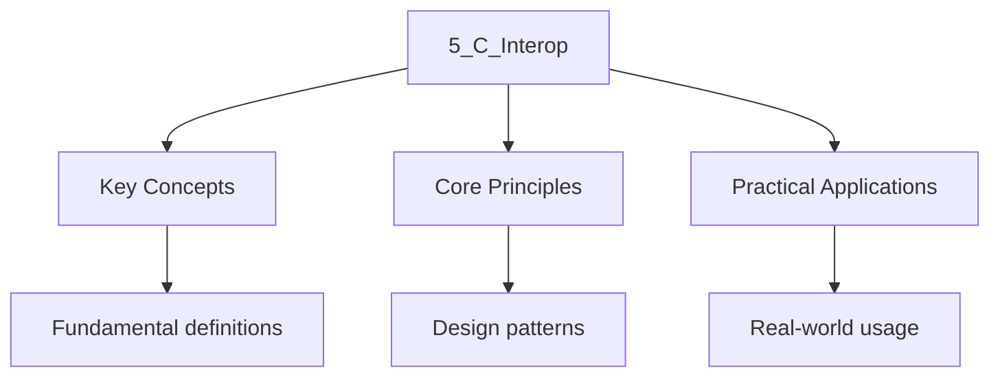

---

title: "C-Interop and FFI | Programming"
description: "C++ uses to encode type information into function symbols, enabling overloading. C Does not mangle names — each function has a single symbol matching its"
date: 2026-04-03T00:00:00.000Z
tags:
  - Cpp
categories:
  - Cpp

---

<!-- Breadcrumb Schema for SEO -->
<script type="application/ld+json">
{
  "@context": "https://schema.org",
  "@type": "BreadcrumbList",
  "itemListElement": [{"name": "Home", "url": "https://wyattau.com"}, {"name": "programming", "url": "https://programming.wyattau.com"}, {"name": "Function_architecture", "url": "https://programming.wyattau.com/function_architecture"}, {"name": "1_function_mechanics", "url": "https://programming.wyattau.com/function_architecture/1_function_mechanics"}, {"name": "5_c_interop", "url": "https://programming.wyattau.com/function_architecture/1_function_mechanics/5_c_interop"}]
}
</script>

## C-Interop and FFI

C++ uses **name mangling** to encode type information into function symbols, enabling overloading. C
Does not mangle names — each function has a single symbol matching its source name. Interoperating
Between C and C++ requires careful management of linkage, data layouts, and exception boundaries.

## 5.1 `extern "C"` Linkage [N4950 §9.9]

C++ uses **name mangling** to encode type information into function symbols, enabling overloading. C
Does not mangle names — each function has a single symbol matching its source name. The `extern "C"`
Linkage specification disables name mangling, making a C++ function callable from C (and vice
Versa).

```cpp
// mathlib.cpp
extern "C" {

// These functions are exported with unmangled C linkage:
// Symbol names: "add" and "multiply" (no type encoding)
int add(int a, int b) {
    return a + b;
}

double multiply(double a, double b) {
    return a * b;
}

}  // extern "C"

// Without extern "C", these would have mangled names:
//   _Z3addii      (add(int, int))
//   _Z8multiplydd (multiply(double, double))
int subtract(int a, int b) {
    return a - b;
}
```

### Formal Semantics of `extern "C"`

By [N4950 §9.9], the `extern "C"` linkage specification has three effects:

1. **Name mangling is disabled.** The symbol name in the object file is the literal function name,
   not an encoded representation of the signature.
2. **Language linkage is set to C.** This affects how the function is called (C calling convention)
   and how entities are looked up.
3. **Overloading is prohibited.** Within an `extern "C"` block, you cannot have two functions with
   the same name — the linker would see duplicate symbols.

### `extern "C"` and Function Overloading

Since name mangling is disabled, you cannot overload functions with `extern "C"` linkage:

```cpp
extern "C" {
    int process(int x);     // OK: symbol is "process"
    // int process(double); // ERROR: duplicate symbol "process" — no mangling to disambiguate
}
```

This is not a limitation of the linkage specification per se, but a consequence of the linker"s
Requirement for unique symbol names within a translation unit.

### `extern "C"` and Member Functions

`extern "C"` cannot be applied to member functions. Only free functions and variables can have C
Language linkage [N4950 §9.9.1]:

```cpp
class Foo {
    // extern "C" void bar();  // ERROR: member functions cannot have C linkage
    static void bar();         // OK: but still has C++ linkage (name mangled)
};
```

### `extern "C"` and Static Members

Static member functions have C++ linkage even if declared in a class. If you need a C-callable
Static member function, you must provide a non-member wrapper:

```cpp
extern "C" void foo_c_wrapper(void* self) {
    // reinterpret self to the actual class type
    // call the static or non-static member function
}
```

### `constexpr` and `extern "C"`

A function declared with both `constexpr` and `extern "C"` linkage is valid since C++17. The
Function can be used in constant expressions and also has C linkage for linking purposes [N4950
§9.9]:

```cpp
extern "C" constexpr int square(int x) {
    return x * x;
}

static_assert(square(5) == 25);  // OK: constexpr evaluation
// Symbol "square" has C linkage for linking purposes
```

### `extern "C"` and `noexcept`

Functions with `extern "C"` linkage are implicitly `noexcept` unless declared otherwise [N4950
§14.5]. This is because C has no exception mechanism, so a C-linkage function that throws violates
The C ABI contract:

```cpp
extern "C" void c_function();  // implicitly noexcept

extern "C" void throwing_c_function() noexcept(false);  // explicitly non-noexcept — allowed
                                                        // but dangerous: exceptions may cross
                                                        // the C ABI boundary
```

## 5.2 Calling C from C++

The standard C library headers are wrapped with `extern "C"` by the C++ standard library headers.
When you `#include <cstring>`The declarations are automatically given C linkage. For your own C
Libraries, use `extern "C"`:

```cpp
// my_c_api.h — the C header
#ifndef MY_C_API_H
#define MY_C_API_H

#ifdef __cplusplus
extern "C" {
#endif

typedef struct {
    double x;
    double y;
} Point;

Point point_create(double x, double y);
double point_distance(const Point* a, const Point* b);
void point_translate(Point* p, double dx, double dy);

#ifdef __cplusplus
}  // extern "C"
#endif

#endif  // MY_C_API_H
```

```cpp
// my_c_api.c — the C implementation
#include "my_c_api.h"
#include <math.h>

Point point_create(double x, double y) {
    Point p = {x, y};
    return p;
}

double point_distance(const Point* a, const Point* b) {
    double dx = a->x - b->x;
    double dy = a->y - b->y;
    return sqrt(dx * dx + dy * dy);
}

void point_translate(Point* p, double dx, double dy) {
    p->x += dx;
    p->y += dy;
}
```

```cpp
// main.cpp — calling C from C++
#include "my_c_api.h"
#include <cstdio>
#include <memory>

int main() {
    auto deleter = [](Point* p) {
        std::printf("Destroying point\n");
        delete p;
    };
    std::unique_ptr<Point, decltype(deleter)> p(
        new Point(point_create(3.0, 4.0)),
        deleter
    );

    Point origin = point_create(0.0, 0.0);
    double dist = point_distance(p.get(), &origin);
    std::printf("Distance from origin: %f\n", dist);  // 5.000000

    point_translate(p.get(), 1.0, 1.0);
    dist = point_distance(p.get(), &origin);
    std::printf("After translate: %f\n", dist);  // ~4.242641
}
```

### Memory Ownership Across the Boundary

When a C function returns a heap-allocated pointer, the C++ caller must know how to free it. If the
C library uses `malloc`The C++ code must use `free` (not `delete`):

```cpp
extern "C" {
    // C function that allocates with malloc
    char* c_create_buffer(size_t size);
    void c_destroy_buffer(char* buf);
}

// C++ code using the C allocator
std::unique_ptr<char, decltype(&c_destroy_buffer)> buf(
    c_create_buffer(1024),
    c_destroy_buffer  // uses the correct C deallocator
);
```

## 5.3 Calling C++ from C

Calling C++ functions from C requires a C-compatible entry point — a function with `extern "C"`
Linkage that wraps the C++ implementation:

```cpp
// widget.cpp — C++ implementation
#include <string>
#include <vector>

class Widget {
    std::string name_;
    std::vector<int> data_;
public:
    Widget(const char* name) : name_(name) {}
    void add_value(int v) { data_.push_back(v); }
    const char* get_name() const { return name_.c_str(); }
    int get_value(int index) const {
        return (index < static_cast<int>(data_.size())) ? data_[index] : -1;
    }
};

// C-compatible opaque handle
extern "C" {
    // Opaque pointer type — C code never sees the full definition
    typedef struct WidgetOpaque* WidgetHandle;

    WidgetHandle widget_create(const char* name) {
        return reinterpret_cast<WidgetHandle>(new Widget(name));
    }

    void widget_destroy(WidgetHandle h) {
        delete reinterpret_cast<Widget*>(h);
    }

    void widget_add_value(WidgetHandle h, int v) {
        reinterpret_cast<Widget*>(h)->add_value(v);
    }

    const char* widget_get_name(WidgetHandle h) {
        return reinterpret_cast<Widget*>(h)->get_name();
    }

    int widget_get_value(WidgetHandle h, int index) {
        return reinterpret_cast<Widget*>(h)->get_value(index);
    }
}
```

```c
/* widget_user.c — calling C++ from C */
#include <stdio.h>

/* Opaque type — only declared, never defined in C */
typedef struct WidgetOpaque* WidgetHandle;

WidgetHandle widget_create(const char* name);
void widget_destroy(WidgetHandle h);
void widget_add_value(WidgetHandle h, int v);
const char* widget_get_name(WidgetHandle h);
int widget_get_value(WidgetHandle h, int index);

int main(void) {
    WidgetHandle w = widget_create("sensor-1");
    widget_add_value(w, 10);
    widget_add_value(w, 20);
    widget_add_value(w, 30);

    printf("Widget: %s\n", widget_get_name(w));
    printf("Value[0] = %d\n", widget_get_value(w, 0));
    printf("Value[1] = %d\n", widget_get_value(w, 1));
    printf("Value[2] = %d\n", widget_get_value(w, 2));

    widget_destroy(w);
    return 0;
}
```

### `void*` Instead of `reinterpret_cast`

For maximum portability across platforms where C and C++ may have different pointer representations,
Use `void*` handles and pass data through C-compatible types:

```cpp
// More portable C API using void*
extern "C" {
    typedef void* WidgetHandle;

    WidgetHandle widget_create(const char* name) {
        return static_cast<void*>(new Widget(name));
    }

    void widget_destroy(WidgetHandle h) {
        delete static_cast<Widget*>(h);
    }
}
```

:::caution
(pointer size, struct layout, calling convention). This is true for x86-64 Linux/macOS (both use the
System V ABI). On platforms with divergent C/C++ ABIs, use `void*` handles and pass data through
C-compatible types only.
:::
## 5.4 ABI Boundaries: Name Mangling and Layout

At a C/C++ boundary, several ABI properties must align:

| Property           | C ABI                         | C++ ABI (Itanium, used on Linux/macOS) |
| :----------------- | :---------------------------- | :------------------------------------- |
| Name mangling      | None — symbol = function name | Encodes types, namespaces, templates   |
| Calling convention | System V AMD64 (x86-64)       | Same as C (on System V platforms)      |
| Struct layout      | Same as C++ POD               | Same as C for POD; non-POD differs     |
| Exception handling | N/A (no exceptions)           | Zero-cost with unwind tables           |
| `bool` size        | 1 byte (implementation-def)   | Same as C (implementation-defined)     |

### Itanium C++ ABI vs MSVC C++ ABI

On Linux and macOS, the Itanium C++ ABI is used for name mangling, virtual table layout, and
Exception handling. On Windows, MSVC uses a different C++ ABI. This means that C++ libraries
Compiled with GCC/Clang cannot be linked with MSVC-compiled C++ code (even with `extern "C"` on the
C-compatible parts). The C-compatible parts work fine across ABIs; only C++-specific features
(classes, templates, exceptions) are incompatible.

### Name Mangling Examples

The Itanium C++ ABI encodes the full function signature into the symbol name:

```cpp
// Symbol: _Z3addii
void add(int, int);

// Symbol: _Z3adddd
void add(double, double);

// Symbol: _ZN3lib3addEii
namespace lib { void add(int, int); }

// Symbol: _ZNK4Base3fooEv
struct Base { virtual void foo() const; };

// Symbol: _Z3maxIiERKT_S2_
template<typename T> const T& max(const T&, const T&);
```

With `extern "C"`All of these become `add`Losing the type information. This is why Overloading is
not possible within `extern "C"` blocks.

```cpp
#include <cstddef>
#include <cstdio>

// Verifying struct layout compatibility across the C boundary
extern "C" {
struct CPoint {
    double x;
    double y;
    // No virtual functions, no non-POD members → layout is identical in C and C++
};

// This struct has a C-compatible layout
struct CPoint make_cpoint(double x, double y) {
    CPoint p{x, y};
    return p;
}

// C++-specific struct — NOT safe to pass across the boundary
struct ComplexPoint {
    double x, y;
    virtual double magnitude() const { /* ... */ return 0.0; }
    // vtable pointer changes the layout — first member is NOT at offset 0
    // sizeof(ComplexPoint) >= 24 (8-byte vptr + 2*8 bytes)
};
}

int main() {
    static_assert(sizeof(CPoint) == 16);
    static_assert(offsetof(CPoint, x) == 0);
    static_assert(offsetof(CPoint, y) == 8);

    std::printf("sizeof(CPoint) = %zu\n", sizeof(CPoint));       // 16
    std::printf("sizeof(ComplexPoint) = %zu\n", sizeof(ComplexPoint)); // 24 (on x86-64)
}
```

## 5.5 Data Marshalling: Ensuring Compatible Layouts

When passing data across a C/C++ boundary, ensure that:

1. **Structs are POD** (Plain Old Data) or `standard-layout`: no virtual functions, no base classes
   with virtual functions, no non-static data members of reference type, all non-static data members
   have the same access control.
2. **Fixed-width types are used** (`int32_t`Not `int`).
3. **No padding surprises**: use `static_assert` and `offsetof` to verify layout, or `#pragma pack`
   / `alignas` to control it.
4. **No C++ exceptions cross the boundary**: exceptions thrown in C++ code called from C unwind
   through C frames, which have no unwind information — undefined behavior. Catch all exceptions
   before returning to C code.

### Proof of Struct Layout Compatibility

**Claim:** A standard-layout struct with only fundamental type members has identical layout in C and
C++ on the same platform.

**Proof:**

1. By [N4950 §7.7.2], a standard-layout class has the same layout as a corresponding C struct with
   the same members in the same order.
2. By [N4950 §7.7.2.1], each non-static data member is allocated at an offset that satisfies its
   alignment requirement, and the alignment of the struct is the maximum alignment of its members.
3. C struct layout follows the same rules (ISO C 6.2.5p20, 6.7.2.1p15): each member is placed at an
   offset satisfying its alignment, with padding inserted as needed.
4. Since both C and C++ use the same alignment rules for fundamental types (`int``double`Etc.) on
   the same platform, the resulting layout is byte-for-byte identical. QED.

### What Breaks Layout Compatibility

The following C++ features break layout compatibility with C:

| Feature                         | Effect on Layout                                |
| :------------------------------ | :---------------------------------------------- |
| Virtual functions               | Adds vtable pointer ( 8 bytes at offset 0)      |
| Virtual base classes            | Adds vtable pointer and virtual base offset     |
| Multiple inheritance            | May add pointer adjustments for base-to-derived |
| Non-standard-layout members     | Reference members, `std::string`Etc.            |
| Different compiler flags        | `-fpack-struct``#pragma pack` changes padding   |
| Different alignment (`alignas`) | Adds padding not present in the C struct        |

```cpp
#include <cstdint>
#include <cstddef>
#include <cstdio>

// Correct: POD struct with explicit layout guarantees
struct PacketHeader {
    static_assert(offsetof(PacketHeader, magic) == 0);
    int32_t magic;
    int32_t version;
    int64_t timestamp;
    int32_t payload_size;
    int32_t checksum;
};

static_assert(sizeof(PacketHeader) == 24);
static_assert(alignof(PacketHeader) == 8);

// Incorrect: this struct would break C interop
struct BadPacket {
    std::string payload;  // Non-POD: heap allocation, non-trivial destructor
    virtual void validate() {}  // vptr changes layout
};
```

### Controlling Layout with `#pragma pack`

When interfacing with a C library that uses non-default packing (common in network protocols and
File formats), use `#pragma pack` to match the layout:

```cpp
#pragma pack(push, 1)  // 1-byte alignment — no padding
struct NetworkHeader {
    uint8_t  type;
    uint32_t length;
    uint16_t flags;
};
#pragma pack(pop)

static_assert(sizeof(NetworkHeader) == 7);  // 1 + 4 + 2 = 7, no padding
```

:::caution
Misaligned access on strict-alignment architectures (ARM, SPARC). Use with caution and document the
Rationale.
:::
## 5.6 Dynamic Library Loading with `dlfcn.h`

POSIX systems provide `dlopen``dlsym``dlclose`And `dlerror` for loading shared libraries at Runtime.
This enables plugin architectures and runtime code loading.

```cpp
// plugin.cpp — compiled into libplugin.so
// $ g++ -shared -fPIC -o libplugin.so plugin.cpp

#include <cstdint>

extern "C" {

int32_t plugin_version() {
    return 1;
}

int32_t plugin_compute(int32_t x, int32_t y) {
    return x * x + y * y;
}

const char* plugin_name() {
    return "quadratic_plugin";
}

}  // extern "C"
```

```cpp
// loader.cpp — dynamically loads and uses the plugin
// $ g++ -std=c++17 -o loader loader.cpp -ldl
#include <cstdint>
#include <cstdio>
#include <cstdlib>
#include <dlfcn.h>
#include <string>

struct PluginAPI {
    int32_t (*version)();
    int32_t (*compute)(int32_t, int32_t);
    const char* (*name)();
};

PluginAPI load_plugin(const char* path) {
    void* handle = dlopen(path, RTLD_NOW);
    if (!handle) {
        std::fprintf(stderr, "dlopen failed: %s\n", dlerror());
        std::exit(1);
    }

    // Clear any existing error
    dlerror();

    auto load_sym = [&](const char* name) -> void* {
        void* sym = dlsym(handle, name);
        char* err = dlerror();
        if (err) {
            std::fprintf(stderr, "dlsym(%s) failed: %s\n", name, err);
            std::exit(1);
        }
        return sym;
    };

    PluginAPI api{};
    api.version = reinterpret_cast<int32_t(*)()>(load_sym("plugin_version"));
    api.compute = reinterpret_cast<int32_t(*)(int32_t, int32_t)>(load_sym("plugin_compute"));
    api.name    = reinterpret_cast<const char*(*)()>(load_sym("plugin_name"));
    return api;
}

int main() {
    auto plugin = load_plugin("./libplugin.so");

    std::printf("Plugin: %s v%d\n", plugin.name(), plugin.version());
    std::printf("compute(3, 4) = %d\n", plugin.compute(3, 4));  // 25

    // In production code, store handle and call dlclose(handle) when done
}
```

:::caution
Immediately. `RTLD_LAZY` defers resolution to first use, which can mask errors and cause crashes at
Unpredictable points. For plugin loading, prefer `RTLD_NOW`.

### Windows Equivalent: `LoadLibrary` and `GetProcAddress`

On Windows, the equivalent functions are `LoadLibraryA`/`LoadLibraryW``GetProcAddress`And
`FreeLibrary`. The pattern is identical but the API is different:

```cpp
#include <windows.h>

extern "C" {
    typedef int32_t (*ComputeFn)(int32_t, int32_t);
}

int main() {
    HMODULE hmod = LoadLibraryA("plugin.dll");
    if (!hmod) {
        return 1;
    }

    ComputeFn compute = reinterpret_cast<ComputeFn>(GetProcAddress(hmod, "plugin_compute"));
    if (!compute) {
        FreeLibrary(hmod);
        return 1;
    }

    int32_t result = compute(3, 4);  // 25
    FreeLibrary(hmod);
    return 0;
}
```

## 5.7 `nothrow new` and C Interop

When allocating memory in C++ that will be freed by C code (or vice versa), you must ensure
Compatible allocation. C++ `new` throws `std::bad_alloc` on failure; C `malloc` returns `NULL`. Use
`nothrow new` to match C's error-reporting convention:

```cpp
#include <new>
#include <cstdlib>

extern "C" void* allocate_buffer(size_t size) {
    // nothrow new returns nullptr on failure, matching malloc semantics
    return ::operator new(size, std::nothrow);
}

extern "C" void deallocate_buffer(void* ptr) {
    ::operator delete(ptr, std::nothrow);
}
```

By [N4950 §7.6.2.7], `::operator new(size, std::nothrow)` returns a null pointer on allocation
Failure instead of throwing. This matches the `malloc` contract that C code expects.

## 5.8 Callback Functions Across the Boundary

When C code passes a callback function pointer to C++ code, the callback must have C linkage. If the
Callback is a C++ function, it must be wrapped:

```cpp
extern "C" {

// C library function that takes a callback
void c_library_set_callback(void (*callback)(int event_code));

}

// C++ callback wrapper
extern "C" void my_callback_wrapper(int event_code) {
    // Inside this wrapper, we are back in C++ context
    // We can use C++ features (exceptions, std::string, etc.)
    // but must not let exceptions escape
    try {
        // C++ implementation
    } catch (...) {
        // Swallow — exceptions must not cross the C boundary
    }
}

void register_callback() {
    c_library_set_callback(my_callback_wrapper);
}
```

### Function Pointer Type Compatibility

A function pointer with C linkage and a function pointer with C++ linkage are **different types**
[N4950 §7.3.8]. You cannot assign one to the other without a cast:

```cpp
extern "C" typedef void (*CFuncPtr)(int);
typedef void (*CppFuncPtr)(int);

CFuncPtr   c_ptr = nullptr;
CppFuncPtr cpp_ptr = nullptr;

// c_ptr = cpp_ptr;   // ERROR: different types
c_ptr = reinterpret_cast<CFuncPtr>(cpp_ptr);  // OK with cast, but dangerous
```

On platforms where C and C++ share the same calling convention (virtually all modern platforms),
This cast is safe. But it is technically undefined behavior by the Standard.

## 5.9 Common Pitfalls at Language Boundaries

1. **Exceptions crossing the boundary**: A C++ exception that propagates through a C call stack is
   undefined behavior. Always wrap C++ entry points with `try`/`catch(...)`.

2. **Differing `size_t` between 32-bit and 64-bit code**: If a 32-bit C library passes a
   pointer-sized value through an `int`It will truncate on 64-bit systems.

3. **Differing struct packing**: MSVC defaults to 8-byte alignment; GCC defaults to natural
   alignment. Use explicit packing or fixed-width types.

4. **Static initialization order fiasco**: Global C++ objects with non-trivial constructors may not
   be initialized before a C `main()` calls them. Prefer the Construct On First Use idiom.

5. **`new`/`delete` mismatch**: Memory allocated with `new` in C++ must be freed with `delete` (not
   `free()`), and vice versa. If passing ownership of heap memory across the boundary, provide
   explicit `create`/`destroy` functions in the C API.

6. **`bool` vs `_Bool`**: C's `_Bool` and C++'s `bool` are distinct types. While they are compatible
   on most platforms, the Standard does not guarantee layout compatibility. Use `int` or a
   fixed-width type for flags passed across the boundary.

7. **String ownership**: If a C++ function returns a `const char*` pointing to a `std::string`'s
   internal buffer, the pointer is valid only as long as the `std::string` is alive. C code that
   stores this pointer will have a dangling reference once the `std::string` is destroyed. Return a
   copy or require the C code to copy immediately.

```cpp
// Safe C++ entry point wrapping
#include <exception>

extern "C" {
    void safe_entry_point() {
        try {
            // ... C++ code that might throw ...
        } catch (const std::exception& e) {
            // Log and return error code — do NOT let exceptions escape
        } catch (...) {
            // Catch everything else
        }
    }
}
```

### Construct On First Use Idiom

To avoid the static initialization order fiasco when C code calls into C++ during startup:

```cpp
// Safe global accessor — avoids static init order issues
class Config {
    std::string name_;
public:
    Config() : name_("default") {}
    const char* name() const { return name_.c_str(); }
};

extern "C" const char* get_config_name() {
    static Config instance;  // Constructed on first use, not at static init time
    return instance.name();
}
```

By [N4950 §6.7.7], a local `static` variable with block scope is initialized on first control flow
Passage through its declaration, which is guaranteed to be thread-safe since C++11. This avoids the
Static initialization order problem entirely.

## Intuition

**C++ name mangling is like a restaurant's reservation system:** When you reserve a table for "John Smith," the restaurant adds details: "John Smith, party of 4, 7pm, window seat." The mangled name encodes all the details (namespace, class, parameter types) so the linker can distinguish between `foo(int)` and `foo(double)`. C doesn't do this — it just uses the raw name "foo," so you can't have two functions with the same name. `extern "C"` tells the linker "use the C naming convention — no decorations."

**Why it matters:** C++ and C use different naming conventions, and mixing them without `extern "C"` causes linker errors or (worse) silent ABI mismatches. This is the most common FFI pitfall — a C library header included without `extern "C"` will fail to link because the C++ compiler mangles the function names.

**The key insight:** `extern "C"` disables name mangling, making C++ functions callable from C — but it also disables overloading, since C doesn't support it.

## See Also

- [Calling Conventions and Stack Management](2_calling_conventions.md)
- [Type Erasure](4_type_erasure.md)

- [Algorithm Analysis](https://computer-science.wyattau.com/docs/algorithm-analysis)
- [Operating Systems](https://computer-science.wyattau.com/docs/operating-systems)




## Summary

This topic covers the fundamental principles of c-interop and ffi, including the key equations,
experimental methods, and applications relevant to the specification.

**Key concepts include:**

- fundamental principles and equations
- SI units and dimensional analysis
- mathematical modelling of physical phenomena
- experimental techniques and measurement
- applications to real-world problems

A strong understanding of these principles, combined with regular practice of quantitative problems
and past paper questions, is essential for success in examinations.

## Worked Examples

Worked examples demonstrating the application of key concepts are covered in the detailed sub-pages
linked above.
:::
