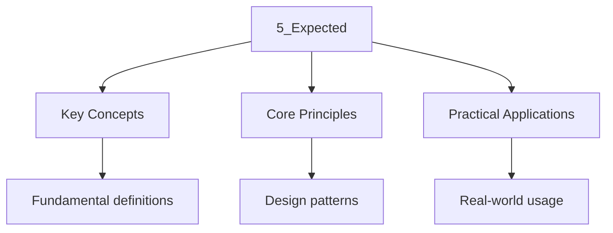

---

title: Monadic Error Handling — std::expected
description: "Comprehensive study notes for Monadic Error Handling — std::expected with worked examples, practice problems, and key concepts for exam preparation."
date: 2026-04-03T00:00:00.000Z
tags:
  - Cpp
categories:
  - Cpp
---

<!-- Breadcrumb Schema for SEO -->
<script type="application/ld+json">
{
  "@context": "https://schema.org",
  "@type": "BreadcrumbList",
  "itemListElement": [{"name": "Home", "url": "https://wyattau.com"}, {"name": "programming", "url": "https://programming.wyattau.com"}, {"name": "Function_architecture", "url": "https://programming.wyattau.com/function_architecture"}, {"name": "2_error_handling", "url": "https://programming.wyattau.com/function_architecture/2_error_handling"}, {"name": "5_expected", "url": "https://programming.wyattau.com/function_architecture/2_error_handling/5_expected"}]
}
</script>

## Monadic Error Handling (`std::expected`)

`std::expected<T, E>` [N4950 §19.8], introduced in C++23, is a monadic type that holds either a
Value of type `T` or an error of type `E`. It is the C++ equivalent of Rust's `Result<T, E>`.

## 5.1 `std::expected<T, E>` Overview

```cpp
#include <iostream>
#include <expected>
#include <string>
#include <charconv>
#include <system_error>

enum class ParseErr {
    Empty,
    Invalid,
    OutOfRange,
};

std::string describe(ParseErr e) {
    switch (e) {
        case ParseErr::Empty:     return "empty input";
        case ParseErr::Invalid:   return "invalid integer";
        case ParseErr::OutOfRange: return "out of range";
    }
    return "unknown";
}

std::expected<int, ParseErr> parse_int(const std::string& s) {
    if (s.empty()) return std::unexpected{ParseErr::Empty};

    int val = 0;
    auto [ptr, ec] = std::from_chars(s.data(), s.data() + s.size(), val);
    if (ec == std::errc::invalid_argument) {
        return std::unexpected{ParseErr::Invalid};
    }
    if (ec == std::errc::result_out_of_range) {
        return std::unexpected{ParseErr::OutOfRange};
    }
    if (ptr != s.data() + s.size()) {
        return std::unexpected{ParseErr::Invalid};
    }
    return val;
}

int main() {
    auto cases = {"42", "abc", "", "99999999999999999999", "3.14"};

    for (const auto& c : cases) {
        auto r = parse_int(c);
        if (r.has_value()) {
            std::cout << "  \"" << c << "\" -> " << r.value() << "\n";
        } else {
            std::cout << "  \"" << c << "\" -> error: " << describe(r.error()) << "\n";
        }
    }

    return 0;
}
// Output:
//   "42" -> 42
//   "abc" -> error: invalid integer
//   "" -> error: empty input
//   "99999999999999999999" -> error: out of range
//   "3.14" -> error: invalid integer
```

### Proof: `std::expected` Provides Deterministic Error Handling

**Claim:** `std::expected<T, E>` provides deterministic error handling — the error path is explicit,
Has no hidden control flow, and has zero overhead compared to error codes.

**Proof:**

1. `std::expected<T, E>` is a sum type (tagged union) that is either `T` or `E`Never both and never
   neither [N4950 §19.8].
2. The discriminant is stored inline alongside the value or error. The size of `std::expected<T, E>`
   is at most `sizeof(T) + sizeof(E) + padding`Which is bounded and known at compile time.
3. `has_value()` is a simple discriminant check. It compiles to a single branch instruction.
4. `value()` and `error()` are unchecked accessors. They compile to a direct read with no
   branching. Calling `value()` when an error is held is undefined behavior (analogous to
   dereferencing a null pointer).
5. There is no stack unwinding, no exception object allocation, and no RTTI lookup. The control flow
   is entirely explicit: the programmer checks `has_value()` and branches accordingly.
6. Therefore: error handling with `std::expected` is deterministic, explicit, and has zero overhead
   compared to error codes.

$\square$

## 5.2 Core API

| Member                  | Description                                 |
| ----------------------- | ------------------------------------------- |
| `has_value()`           | Returns `true` if a value is held           |
| `operator bool()`       | Same as `has_value()`                       |
| `value()`               | Returns the value; UB if error is held      |
| `error()`               | Returns the error; UB if value is held      |
| `value_or(U)`           | Returns the value, or `U` if error is held  |
| `operator->``operator*` | Access the contained value                  |
| `transform(F)`          | Apply `F` to value, return `expected<U, E>` |
| `transform_error(F)`    | Apply `F` to error, return `expected<T, G>` |
| `and_then(F)`           | Monadic bind: `F(T) -> expected<U, E>`      |
| `or_else(F)`            | Monadic recovery: `F(E) -> expected<T, F>`  |
| `error_or(E)`           | Returns the error, or `E` if value is held  |

### `std::unexpected` and Error Construction

The `std::unexpected<E>` wrapper distinguishes error construction from value construction:

```cpp
std::expected<int, Err> ok()     { return 42; }                          // value
std::expected<int, Err> fail()   { return std::unexpected{Err::Bad}; }   // error
```

Without `std::unexpected`The constructor would be ambiguous when `T` and `E` are the same type
(e.g., `std::expected<int, int>`). The wrapper resolves this ambiguity [N4950 §19.8].

### `value_or` and Default Fallbacks

```cpp
std::expected<int, Err> result = /* ... */;
int safe_value = result.value_or(0);  // Returns 0 if error is held
```

`value_or` is useful when a sensible default exists and you want to avoid explicit branching.
However, it silently discards the error — use it only when the error is not actionable.

## 5.3 Monadic Operations

```cpp
#include <iostream>
#include <expected>
#include <string>
#include <charconv>

enum class Err { NotNumeric, Negative, TooLarge };

std::expected<int, Err> parse_positive(const std::string& s) {
    if (s.empty()) return std::unexpected{Err::NotNumeric};
    int val = 0;
    auto [ptr, ec] = std::from_chars(s.data(), s.data() + s.size(), val);
    if (ec != std::errc{}) return std::unexpected{Err::NotNumeric};
    if (ptr != s.data() + s.size()) return std::unexpected{Err::NotNumeric};
    if (val < 0) return std::unexpected{Err::Negative};
    return val;
}

std::expected<int, Err> clamp(int max_val, int v) {
    if (v > max_val) return std::unexpected{Err::TooLarge};
    return v;
}

int main() {
    auto r = parse_positive("42")
        .and_then([](int v) { return clamp(100, v); })
        .transform([](int v) { return v * 2; });

    if (r) {
        std::cout << "Result: " << r.value() << "\n";
    } else {
        std::cout << "Error code: " << static_cast<int>(r.error()) << "\n";
    }

    auto r2 = parse_positive("200")
        .and_then([](int v) { return clamp(100, v); })
        .transform([](int v) { return v * 2; })
        .or_else([](Err e) -> std::expected<int, Err> {
            std::cout << "Recovered from error\n";
            return 0;
        });

    std::cout << "Recovered result: " << r2.value() << "\n";

    return 0;
}
// Output:
//   Result: 84
//   Recovered from error
//   Recovered result: 0
```

### Monadic Operation Semantics

| Operation            | If value held                      | If error held                      |
| :------------------- | :--------------------------------- | :--------------------------------- |
| `and_then(f)`        | Apply `f(value)`Return result      | Propagate error unchanged          |
| `or_else(f)`         | Propagate value unchanged          | Apply `f(error)`Return result      |
| `transform(f)`       | Apply `f(value)`Wrap in `expected` | Propagate error unchanged          |
| `transform_error(f)` | Propagate value unchanged          | Apply `f(error)`Wrap in `expected` |

The monadic operations compose , forming a pipeline:

$$
\mathrm{expected_1 \xrightarrow{\mathrm{and\_then} \mathrm{expected_2 \xrightarrow{\mathrm{transform} \mathrm{expected_3 \xrightarrow{\mathrm{or\_else} \mathrm{expected_4
$$

Each operation short-circuits on error: once an error enters the pipeline, it propagates through all
Subsequent `and_then` and `transform` calls without executing their callbacks.

## 5.4 Comparison with Rust's `Result<T, E>`

| C++ `std::expected`  | Rust `Result`            | Purpose                          |
| -------------------- | ------------------------ | -------------------------------- |
| `has_value()`        | `is_ok()`                | Check for value                  |
| `!has_value()`       | `is_err()`               | Check for error                  |
| `value()`            | `unwrap()`               | Access value (UB/panic on error) |
| `error()`            | `unwrap_err()`           | Access error                     |
| `value_or(default)`  | `unwrap_or(default)`     | Default on error                 |
| `and_then(f)`        | `.and_then(f)`           | Monadic bind                     |
| `transform(f)`       | `.map(f)`                | Functor map                      |
| `transform_error(f)` | `.map_err(f)`            | Map the error                    |
| `or_else(f)`         | `.or(f)` / `.or_else(f)` | Monadic recovery                 |

### Comparison with Other Languages' Error Types

| Language | Type                  | Error Handling Style                      |
| :------- | :-------------------- | :---------------------------------------- |
| Rust     | `Result<T, E>`        | Monadic, forced handling                  |
| Haskell  | `Either E a`          | Monadic, forced handling                  |
| Go       | `(T, error)`          | Explicit check, easy to ignore            |
| Swift    | `Result<T, E>`        | Monadic, forced handling                  |
| Zig      | `E!T`                 | Infix error union, forced handling        |
| C++23    | `std::expected<T, E>` | Monadic, easy to ignore (no forced check) |

Unlike Rust, C++ does not force you to handle the error case. Calling `.value()` on an error-holding
`expected` is undefined behavior, not a panic. This is consistent with C++'s philosophy of trusting
The programmer but places the burden of correctness on the caller.

## 5.5 Factory Pattern with `std::expected`

```cpp
#include <iostream>
#include <expected>
#include <string>
#include <memory>

enum class FactoryErr {
    InvalidName,
    InvalidAge,
    AllocationFailed,
};

struct Person {
    std::string name;
    int age;
};

std::expected<Person, FactoryErr> make_person(std::string name, int age) {
    if (name.empty()) return std::unexpected{FactoryErr::InvalidName};
    if (age < 0 || age > 150) return std::unexpected{FactoryErr::InvalidAge};

    try {
        return Person{std::move(name), age};
    } catch (const std::bad_alloc&) {
        return std::unexpected{FactoryErr::AllocationFailed};
    }
}

int main() {
    auto p1 = make_person("Alice", 30);
    if (p1) {
        std::cout << p1->name << ", " << p1->age << "\n";
    }

    auto p2 = make_person("", 30);
    if (!p2) {
        std::cout << "Error: " << static_cast<int>(p2.error()) << "\n";
    }

    return 0;
}
// Output:
//   Alice, 30
//   Error: 0
```

## Error Propagation Patterns

### Chaining with `and_then`

The `and_then` combinator enables error propagation without explicit `if` checks:

```cpp
#include <iostream>
#include <expected>
#include <string>
#include <string_view>

enum class Err { Empty, Invalid, TooLong };

std::expected<std::string, Err> validate(std::string_view s) {
    if (s.empty()) return std::unexpected{Err::Empty};
    if (s.size() > 100) return std::unexpected{Err::TooLong};
    return std::string{s};
}

std::expected<int, Err> parse(std::string_view s) {
    return validate(s).and_then([](const std::string& v) -> std::expected<int, Err> {
        try {
            return std::stoi(v);
        } catch (...) {
            return std::unexpected{Err::Invalid};
        }
    });
}

std::expected<int, Err> check_range(int v) {
    if (v < 0 || v > 1000) return std::unexpected{Err::Invalid};
    return v;
}

std::expected<int, Err> safe_parse(std::string_view s) {
    return parse(s).and_then(check_range);
}

int main() {
    for (auto input : {"42", "abc", "", "2000"}) {
        auto r = safe_parse(input);
        if (r) {
            std::cout << "  \"" << input << "\" -> " << *r << "\n";
        } else {
            std::cout << "  \"" << input << "\" -> error\n";
        }
    }
    return 0;
}
```

### Error Recovery with `or_else`

```cpp
std::expected<int, Err> parse_with_default(std::string_view s, int default_val) {
    return safe_parse(s).or_else([default_val](Err) -> std::expected<int, Err> {
        return default_val;
    });
}
```

### Transforming Errors with `transform_error`

```cpp
#include <string>

enum class InputErr { Empty, Invalid };
enum class AppErr { NoInput, BadInput, InternalError };

std::expected<int, AppErr> map_error(std::expected<int, InputErr> r) {
    return r.transform_error([](InputErr e) -> AppErr {
        switch (e) {
            case InputErr::Empty: return AppErr::NoInput;
            case InputErr::Invalid: return AppErr::BadInput;
        }
        return AppErr::InternalError;
    });
}
```

## Decision Matrix: Exceptions vs `expected` vs Error Codes

```
Is the error truly exceptional (should rarely happen)?
+-- Yes --> Is real-time constraint present?
|           +-- Yes --> Error codes (zero overhead, explicit)
|           +-- No  --> Exceptions (implicit propagation, clean code)
+-- No  --> Is C++23 available?
            +-- Yes --> std::expected<T, E>
            +-- No  --> Multiple error types?
                        +-- Yes --> std::variant<T, E1, E2, ...>
                        +-- No  --> std::optional<T> or error codes
```

### Formal Comparison

| Criterion               | Exceptions                        | `std::expected`                 | Error Codes                    |
| :---------------------- | :-------------------------------- | :------------------------------ | :----------------------------- |
| Normal-path overhead    | ~0 (no branch)                    | 1 branch (check `has_value()`)  | 1 branch + compare             |
| Error-path overhead     | ~5-20 $\mu$S (unwind)             | 0 (direct branch)               | 0 (direct return)              |
| Code clarity            | High (separate happy/error paths) | Medium (explicit checks)        | Low (pervasive error checks)   |
| Forgetting to handle    | Compiler warns on uncaught        | UB if `value()` called on error | Easy to forget to check return |
| Composability           | Implicit (stack unwinding)        | Monadic chains (`and_then`)     | Manual propagation             |
| Cross-function boundary | Automatic                         | Manual (`and_then` chain)       | Manual (return code check)     |
| Type safety             | Any type can be thrown            | Typed error `E`                 | Enum/int (weak)                |
| Binary size             | +5-15% (LSDA tables)              | 0                               | 0                              |
| Destructor safety       | Must be `noexcept`                | No special requirement          | No special requirement         |

## Error Handling Best Practices

### When to Use Each Mechanism

| Situation                               | Recommended Mechanism                            |
| --------------------------------------- | ------------------------------------------------ |
| Truly exceptional, unrecoverable events | `throw` / `try` / `catch`                        |
| Expected failure with optional return   | `std::optional<T>`                               |
| Typed error outcomes (C++23+)           | `std::expected<T, E>`                            |
| Multiple error types, pre-C++23         | `std::variant<T, E1, E2, ...>`                   |
| C interface / FFI boundary              | Error codes (`int``enum`)                        |
| Performance-critical hot path           | `noexcept` functions + error codes or `expected` |
| Destructor cleanup                      | Never throw (see below)                          |

### C++ Core Guidelines

Key guidelines from [C++ Core Guidelines](https://isocpp.github.io/CppCoreGuidelines/):

| Guideline | Summary                                                                         |
| --------- | ------------------------------------------------------------------------------- |
| **E.1**   | Develop a logical error-handling strategy early.                                |
| **E.2**   | Throw exceptions to signal exceptional conditions, not for normal control flow. |
| **E.3**   | Use exceptions for errors in constructors.                                      |
| **E.5**   | Prefer `noexcept` where feasible.                                               |
| **E.12**  | Use `final` or `noexcept` on throwing functions to prevent overriding.          |
| **E.14**  | Use `noexcept` move operations.                                                 |
| **E.16**  | Destructors, deallocation, and `swap` must never fail.                          |
| **E.25**  | If you can't throw, consider `std::expected` for reporting errors.              |
| **I.7**   | State preconditions (and prefer `Expects` / `Ensures` contracts).               |

### Exception Safety in Constructors

Constructors that throw leave the object **partially constructed**. The destructor for the partially
Constructed object is **not called** — but destructors of any fully-constructed subobjects and base
Classes **are** called [N4950 §14.3]:

```cpp
#include <iostream>
#include <stdexcept>

struct Resource {
    const char* name;
    explicit Resource(const char* n) : name(n) {
        std::cout << "  acquire: " << name << "\n";
    }
    ~Resource() {
        std::cout << "  release: " << name << "\n";
    }
};

struct Widget {
    Resource a;
    Resource b;
    Resource c;

    Widget()
        : a{"a"}
        , b{"b"}
        , c{"c"}
    {
        std::cout << "  Widget fully constructed\n";
        throw std::runtime_error{"construction failed"};
    }
};

int main() {
    try {
        Widget w;
    } catch (const std::exception& e) {
        std::cout << "caught: " << e.what() << "\n";
    }
    return 0;
}
// Output:
//   acquire: a
//   acquire: b
//   acquire: c
//   Widget fully constructed
//   release: c
//   release: b
//   release: a
//   caught: construction failed
```

:::tip
Error codes cannot be returned from a constructor.
:::
### The "Destructor Must Never Throw" Rule

If a destructor throws during stack unwinding (i.e., while another exception is already in flight),
`std::terminate()` is called immediately [N4950 §14.7]. This rule is absolute and cannot be
Overridden.

```cpp
#include <iostream>
#include <exception>
#include <stdexcept>

struct ThrowingDtor {
    ~ThrowingDtor() {
        std::cout << "  ThrowingDtor dtor\n";
        throw std::runtime_error{"destructor threw"};
    }
};

struct SafeDtor {
    ~SafeDtor() noexcept {
        std::cout << "  SafeDtor dtor\n";
        try {
            ThrowingDtor t;
        } catch (const std::exception& e) {
            std::cout << "  swallowed in SafeDtor: " << e.what() << "\n";
        }
    }
};

int main() {
    std::cout << "Scenario 1: destructors in normal scope\n";
    {
        try {
            ThrowingDtor t;
        } catch (const std::exception& e) {
            std::cout << "  caught: " << e.what() << "\n";
        }
    }

    std::cout << "\nScenario 2: destructor during unwinding -> terminate\n";
    try {
        ThrowingDtor t;
        throw std::logic_error{"first exception"};
    } catch (...) {
        std::cout << "  This line is never reached\n";
    }

    return 0;
}
// Output:
//   Scenario 1: destructors in normal scope
//     ThrowingDtor dtor
//     caught: destructor threw
//
//   Scenario 2: destructor during unwinding -> terminate
//     ThrowingDtor dtor
//     terminate called after throwing an instance of 'std::runtime_error'
//     what():  destructor threw
//   Aborted (core dumped)
```

**Safe pattern — swallow exceptions inside destructors:**

```cpp
#include <iostream>
#include <stdexcept>

struct SafeCleanup {
    ~SafeCleanup() noexcept {
        try {
            might_throw();
        } catch (const std::exception& e) {
            std::cerr << "[warning] cleanup failed: " << e.what() << "\n";
        }
    }
    void might_throw() {
        throw std::runtime_error{"resource release failed"};
    }
};

int main() {
    try {
        SafeCleanup s;
        throw std::logic_error{"other error"};
    } catch (const std::exception& e) {
        std::cout << "caught: " << e.what() << "\n";
    }
    return 0;
}
// Output:
//   [warning] cleanup failed: resource release failed
//   caught: other error
```

:::caution
Make the destructor `noexcept` and ensure cleanup operations are themselves `noexcept`. Use RAII
Wrappers that handle errors internally rather than propagating them from destructors.
:::
## Intuition

**`std::expected` is like a result that might be an error:** When you call a function that returns `expected<T, E>`, you get either a value of type `T` (success) or an error of type `E` (failure). It's like a box that's either labeled "success" with the result inside, or "failure" with the error inside. The monadic operations (`and_then`, `transform`, `or_else`) let you chain operations without manually checking for errors — like a pipeline that automatically short-circuits if any step fails.

**Why it matters:** `std::expected` is the modern C++ approach to error handling that avoids exceptions. It combines the type safety of `optional` with the error information of exceptions. Unlike exceptions, it's visible in the function signature — you can see from the return type that a function might fail. The monadic operations make error handling composable, not repetitive.

**The key insight:** `std::expected` makes error handling explicit in the type system and composable via monadic operations — no more exception specification guessing or manual error checking at every call site.

### Summary

| Mechanism       | C++ Version | Error Richness    | Overhead (no error) | Composability            |
| --------------- | ----------- | ----------------- | ------------------: | ------------------------ |
| Exceptions      | C++98       | Any type          |                  ~0 | Implicit (unwinding)     |
| Error codes     | C           | Enum/int          |                   0 | Manual propagation       |
| `std::optional` | C++17       | `nullopt` only    |                   0 | Check required           |
| `std::variant`  | C++17       | User-defined      |                   0 | `visit` / `get_if`       |
| `std::expected` | C++23       | Single error type |                   0 | Monadic (`and_then`Etc.) |

**Relevance:** Modern C++ increasingly favors **explicit, algebraic error handling**
(`std::expected`) for expected failure modes and reserves **exceptions** for truly exceptional
Conditions. The combination of `noexcept`RAII, and `std::expected` provides a robust, low-overhead
Error handling strategy.

## Advanced Patterns

### Error Aggregation with `expected`

When an operation can produce multiple independent errors, use `expected` with a vector of errors:

```cpp
#include <iostream>
#include <expected>
#include <vector>
#include <string>

struct ValidationErrors {
    std::vector<std::string> errors;

    void add(const std::string& err) { errors.push_back(err); }
    bool empty() const { return errors.empty(); }
    std::size_t size() const { return errors.size(); }
};

struct UserInput {
    std::string username;
    int age;
};

std::expected<UserInput, ValidationErrors> validate_user(
    const std::string& name, int age) {

    ValidationErrors errs;

    if (name.empty()) errs.add("username is empty");
    if (name.size() > 32) errs.add("username too long");
    if (name.find(' ') != std::string::npos) errs.add("username contains spaces");
    if (age < 0) errs.add("age is negative");
    if (age > 150) errs.add("age is too large");

    if (!errs.empty()) return std::unexpected{errs};
    return UserInput{name, age};
}

int main() {
    auto r1 = validate_user("alice", 30);
    if (r1) {
        std::cout << "valid: " << r1->username << ", " << r1->age << "\n";
    }

    auto r2 = validate_user("", 200);
    if (!r2) {
        std::cout << "errors (" << r2.error().size() << "):\n";
        for (const auto& e : r2.error().errors) {
            std::cout << "  - " << e << "\n";
        }
    }
    return 0;
}
// Output:
//   valid: alice, 30
//   errors (2):
//     - username is empty
//     - age is too large
```

### Builder Pattern with `expected`

```cpp
#include <iostream>
#include <expected>
#include <string>

enum class BuildErr { InvalidHost, InvalidPort, InvalidPath };

struct HttpUrl {
    std::string scheme;
    std::string host;
    int port;
    std::string path;
};

class HttpUrlBuilder {
    std::string scheme_ = "https";
    std::string host_;
    int port_ = -1;
    std::string path_ = "/";

public:
    HttpUrlBuilder& scheme(std::string s) { scheme_ = std::move(s); return *this; }
    HttpUrlBuilder& host(std::string h) { host_ = std::move(h); return *this; }
    HttpUrlBuilder& port(int p) { port_ = p; return *this; }
    HttpUrlBuilder& path(std::string p) { path_ = std::move(p); return *this; }

    std::expected<HttpUrl, BuildErr> build() const {
        if (host_.empty()) return std::unexpected{BuildErr::InvalidHost};
        if (port_ < 0 || port_ > 65535) return std::unexpected{BuildErr::InvalidPort};
        if (path_.empty()) return std::unexpected{BuildErr::InvalidPath};
        return HttpUrl{scheme_, host_, port_, path_};
    }
};

int main() {
    auto r1 = HttpUrlBuilder{}
        .scheme("https")
        .host("example.com")
        .port(443)
        .build();

    if (r1) {
        std::cout << r1->scheme << "://" << r1->host << ":" << r1->port << r1->path << "\n";
    }

    auto r2 = HttpUrlBuilder{}.host("example.com").port(99999).build();
    if (!r2) {
        std::cout << "build failed: " << static_cast<int>(r2.error()) << "\n";
    }
    return 0;
}
```

### Fallback Chains with `or_else`

Multiple recovery strategies can be chained with `or_else`:

```cpp
#include <iostream>
#include <expected>
#include <string>
#include <fstream>

enum class ReadErr { FileNotFound, PermissionDenied, InvalidFormat };

std::expected<std::string, ReadErr> read_config(const std::string& path) {
    std::ifstream f(path);
    if (!f.is_open()) return std::unexpected{ReadErr::FileNotFound};
    std::string content((std::istreambuf_iterator<char>(f)),
                         std::istreambuf_iterator<char>());
    if (content.empty()) return std::unexpected{ReadErr::InvalidFormat};
    return content;
}

std::expected<std::string, ReadErr> default_config() {
    return R"({"port": 8080, "host": "localhost"})";
}

std::expected<std::string, ReadErr> load_config(const std::string& path) {
    return read_config(path).or_else([](ReadErr) {
        std::cout << "  config file not found, using defaults\n";
        return default_config();
    });
}

int main() {
    auto r = load_config("nonexistent.json");
    if (r) {
        std::cout << "config: " << *r << "\n";
    }
    return 0;
}
```

## Common Pitfalls

- **Calling `value()` without checking:** `value()` on an error-holding `expected` is undefined
  behavior. Always check `has_value()` first, or use `value_or()`. The standard deliberately does
  not throw from `value()` to maintain zero-overhead semantics.
- **Using `std::expected` where `std::optional` suffices:** If the error type is `nullopt` (i.e.,
  the only information is "no value"), use `std::optional<T>` instead. It is simpler and more
  idiomatic.
- **Ignoring the error in monadic chains:** `transform` and `and_then` silently propagate errors. If
  you forget to handle the final result, the error is lost. Always check the final `expected` in the
  chain.
- **Throwing from within `expected` operations:** If `transform` or `and_then` callbacks throw, the
  exception propagates normally (bypassing the `expected` mechanism). This mixes error handling
  strategies and should be avoided. Make callbacks `noexcept` or catch internally.
- **Storing references in `expected`:** `std::expected<T&, E>` is valid but tricky — the reference
  is stored as a pointer internally, and the referred-to object must outlive the `expected`. Prefer
  `std::expected<T*, E>` for pointer semantics.
- **Constructing `expected` with brace initialization:** When `T` is a non-moveable type,
  `expected<T, E>{}` requires careful construction. Use `std::expected<T, E>(std::in_place, ...)`
  for in-place construction to avoid copy/move requirements.
- **Using `expected` as a function parameter:** Passing `expected<T, E>` by value copies the value
  or error. For large `T`Pass by reference or use `std::expected<T*, E>`. For return values, NRVO
  eliminates the copy.
- **Mixing error handling strategies in a single function:** A function that returns `expected`
  should not also throw exceptions (unless truly exceptional). Mixing strategies makes it unclear to
  the caller how errors should be handled. Choose one strategy per function boundary.

## See Also

- [Algebraic Error Handling — std::optional and std::variant](4_optional_variant)
- [The noexcept Specifier](3_noexcept)
- [Exception Safety Guarantees](2_exception_safety)

- [Algorithm Analysis](https://computer-science.wyattau.com/docs/algorithm-analysis)




## Summary

This topic covers the mathematical techniques and concepts related to monadic error handling —
std::expected, including key theorems, methods, and problem-solving approaches.

**Key concepts include:**

- fundamental definitions and theorems
- algebraic and graphical methods
- proof and logical reasoning
- problem-solving strategies
- applications and modelling

Regular practice with a variety of question types is essential to build fluency and confidence in
applying these mathematical techniques.

## Worked Examples

Worked examples demonstrating the application of key concepts are covered in the detailed sub-pages
linked above.
