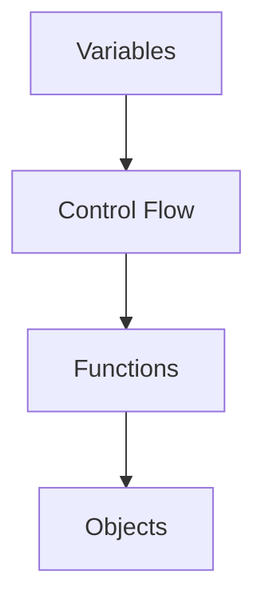

## Programming Fundamentals

**Algorithm**: A finite sequence of well-defined instructions for solving a problem or performing a computation.

**Syntax**: The set of rules defining the structure of valid statements in a programming language.

**Semantics**: The meaning of syntactically valid statements in a programming language.

**Compiler**: A program that translates source code into machine code before execution.

**Interpreter**: A program that executes source code directly, translating and running it line by line.

**Runtime**: The period during which a program is executing, as opposed to compile time.

**IDE (Integrated Development Environment)**: A software application providing comprehensive tools for software development (editor, debugger, build tools).

**Debugger**: A tool that allows developers to inspect and control program execution, setting breakpoints and stepping through code.

**Version Control**: A system for tracking changes to code over time, enabling collaboration and history management (e.g., Git).

**Repository**: A storage location for a project's version-controlled code and its history.

## Data Types

**Primitive Type**: A basic data type built into the language (int, float, char, bool).

**Reference Type**: A type that references an object in memory rather than storing data directly.

**Integer**: A whole number without a fractional part, typically 32 or 64 bits.

**Float**: A number with a decimal point, stored in floating-point representation.

**String**: A sequence of characters representing text, usually immutable.

**Boolean**: A data type with only two values: true and false.

**Null / None**: A special value representing the absence of a value.

**Enum**: A user-defined type consisting of a set of named constants.

**Type Casting**: Converting a value from one data type to another (e.g., int to float).

**Type Inference**: The compiler automatically deducing the type of a variable from its initializer.

## Variables and Scope

**Variable**: A named storage location holding a value that can change during program execution.

**Constant**: A named value that cannot be changed after initialization.

**Mutable**: A variable whose value can be modified after creation.

**Immutable**: A variable whose value cannot be changed after creation.

**Scope**: The region of code where a variable is accessible.

**Local Scope**: Variables accessible only within the function or block where they are defined.

**Global Scope**: Variables accessible from anywhere in the program.

**Closure**: A function that captures and retains access to variables from its enclosing scope.

**Shadowing**: Declaring a new variable with the same name as an existing one in an inner scope.

**Namespace**: A container holding a set of identifiers and allowing disambiguation of items with the same name.

## Control Flow

**Conditional (If-Else)**: A statement that executes different code based on whether a condition is true.

**Switch / Match**: A multi-way branch statement selecting code to execute based on an expression's value.

**Loop**: A construct that repeats a block of code until a condition is met.

**For Loop**: A loop that iterates a specific number of times or over a collection.

**While Loop**: A loop that repeats as long as a condition is true.

**Do-While Loop**: A loop that executes at least once before checking the condition.

**Break**: A statement that exits the nearest enclosing loop or switch.

**Continue**: A statement that skips the rest of the current iteration and proceeds to the next.

**Return**: A statement that exits a function and optionally passes a value back to the caller.

**Recursion**: A technique where a function calls itself to solve a problem by breaking it into smaller subproblems.

## Functions

**Function**: A reusable block of code that performs a specific task, defined with a name, parameters, and body.

**Method**: A function associated with an object or class.

**Parameter**: A variable in a function definition that receives an argument.

**Argument**: The actual value passed to a function when it is called.

**Return Value**: The value a function sends back to the caller.

**Void**: A function that does not return a value.

**Higher-Order Function**: A function that takes a function as an argument or returns a function.

**Pure Function**: A function that always produces the same output for the same inputs and has no side effects.

**Side Effect**: A change to state outside a function's local scope (modifying a global variable, writing to a file).

**Function Overloading**: Defining multiple functions with the same name but different parameter lists.

**Default Parameter**: A parameter value used when no argument is provided.

**Variadic Function**: A function accepting a variable number of arguments.

## Object-Oriented Programming

**Class**: A blueprint for creating objects, defining attributes (data) and methods (behavior).

**Object**: An instance of a class, containing actual data and behavior.

**Encapsulation**: Restricting direct access to an object's internal state, exposing only necessary methods.

**Inheritance**: A mechanism where a child class inherits properties and methods from a parent class.

**Polymorphism**: The ability of different classes to be treated as instances of the same class through inheritance.

**Abstraction**: Hiding complex implementation details and showing only necessary features.

**Composition**: Building complex objects by combining simpler, reusable objects rather than through inheritance.

**Aggregation**: A specialized form of composition where the contained object can exist independently.

**Interface**: A contract specifying methods that a class must implement, without providing implementations.

**Abstract Class**: A class that cannot be instantiated, designed to be extended by other classes.

**Mixin**: A class containing methods for use by other classes, providing reusable functionality without inheritance hierarchy.

**Decorator**: A function or class that wraps another object to extend or modify its behavior without altering its structure.

**Factory Method**: A creational pattern providing an interface for creating objects without specifying their concrete classes.

**Singleton**: A creational pattern ensuring a class has only one instance throughout the application.

**Observer**: A behavioral pattern defining a subscription mechanism to notify multiple objects of events.

## Data Structures

**Array**: A collection of elements stored at contiguous memory locations, accessed by index.

**Linked List**: A linear data structure where elements are stored in nodes, each pointing to the next node.

**Stack**: A LIFO (Last-In-First-Out) data structure for push and pop operations.

**Queue**: A FIFO (First-In-First-Out) data structure for enqueue and dequeue operations.

**Hash Table (HashMap)**: A data structure mapping keys to values using a hash function for O(1) average lookups.

**Tree**: A hierarchical data structure with a root node and child nodes, each having zero or more children.

**Binary Tree**: A tree where each node has at most two children (left and right).

**Binary Search Tree (BST)**: A binary tree where left children are less than the parent and right children are greater.

**Heap**: A specialized tree-based data structure satisfying the heap property (min-heap or max-heap).

**Graph**: A collection of nodes (vertices) connected by edges, representing pairwise relationships.

**Directed Graph (Digraph)**: A graph where edges have a direction, going from one vertex to another.

**Weighted Graph**: A graph where edges carry numerical values (weights) representing costs or distances.

**Trie**: A tree-like data structure for storing strings, where each node represents a character.

**Bloom Filter**: A probabilistic data structure testing set membership, with possible false positives but no false negatives.

**Disjoint Set (Union-Find)**: A data structure tracking elements partitioned into disjoint subsets, supporting union and find operations.

## Algorithms

**Sorting**: Arranging elements in a specific order (ascending or descending).

**Bubble Sort**: A simple sorting algorithm repeatedly swapping adjacent elements if they are in the wrong order.

**Merge Sort**: A divide-and-conquer sorting algorithm splitting the array, recursively sorting, and merging.

**Quick Sort**: A divide-and-conquer sorting algorithm partitioning around a pivot and recursively sorting partitions.

**Binary Search**: An efficient search algorithm finding an element in a sorted array by repeatedly halving the search space.

**Linear Search**: A simple search checking each element sequentially until the target is found or the end is reached.

**Breadth-First Search (BFS)**: A graph traversal algorithm visiting nodes level by level using a queue.

**Depth-First Search (DFS)**: A graph traversal algorithm exploring as far as possible along each branch before backtracking.

**Dynamic Programming**: An optimization technique solving complex problems by breaking them into overlapping subproblems and storing results.

**Greedy Algorithm**: An algorithm making the locally optimal choice at each step, hoping to find a global optimum.

**Divide and Conquer**: An algorithm paradigm recursively breaking problems into smaller subproblems, solving them, and combining results.

**Backtracking**: An algorithm technique exploring all possible solutions and pruning branches that cannot lead to a valid solution.

**Memoization**: Storing results of expensive function calls and returning the cached result when the same inputs occur.

**Recursion**: A technique where a function calls itself with a base case to prevent infinite recursion.

## Design Patterns

**Singleton**: Ensures a class has only one instance and provides a global point of access to it.

**Factory**: Defines an interface for creating objects, allowing subclasses to decide which class to instantiate.

**Abstract Factory**: Provides an interface for creating families of related objects without specifying concrete classes.

**Builder**: Separates the construction of a complex object from its representation.

**Prototype**: Creates new objects by copying an existing instance (cloning).

**Adapter**: Converts the interface of a class into another interface clients expect.

**Decorator**: Dynamically adds responsibilities to an object without modifying its class.

**Facade**: Provides a simplified interface to a complex subsystem.

**Proxy**: Provides a surrogate or placeholder for another object to control access to it.

**Strategy**: Defines a family of algorithms and makes them interchangeable at runtime.

**Observer**: Defines a one-to-many dependency between objects so that when one object changes state, all dependents are notified.

**Command**: Encapsulates a request as an object, allowing parameterization and queuing of requests.

**State**: Allows an object to alter its behavior when its internal state changes.

**Template Method**: Defines the skeleton of an algorithm in a base class, deferring specific steps to subclasses.

**Composite**: Composes objects into tree structures and treats individual objects and compositions uniformly.

## Concurrency

**Thread**: A lightweight unit of execution within a process, sharing the process's memory space.

**Process**: An independent execution unit with its own memory space, communicating via IPC.

**Concurrency**: A system where multiple tasks make progress during overlapping time periods.

**Parallelism**: A system where multiple tasks execute simultaneously on multiple processors.

**Race Condition**: A bug where the outcome depends on the unpredictable timing of thread execution.

**Deadlock**: A situation where two or more threads are blocked forever, each waiting for the other to release a resource.

**Mutex (Mutual Exclusion)**: A synchronization primitive ensuring only one thread can access a shared resource at a time.

**Semaphore**: A synchronization primitive controlling access to a shared resource with a counter.

**Atomic Operation**: An operation that appears to the rest of the system to occur instantaneously, without interruption.

**Lock**: A mechanism preventing concurrent access to shared resources, ensuring thread safety.

**Thread Pool**: A group of pre-created threads that can be reused to execute tasks, avoiding thread creation overhead.

**Async / Await**: Programming patterns for non-blocking asynchronous operations, improving responsiveness.

**Future / Promise**: An object representing the eventual result of an asynchronous computation.

**Channel**: A communication mechanism for sending messages between threads or processes.

## Error Handling

**Exception**: An error that occurs during runtime, interrupting normal program flow.

**Try-Catch**: A construct for handling exceptions, where risky code is in try and error handling in catch.

**Finally**: A block that always executes after try-catch, regardless of whether an exception occurred.

**Runtime Error**: An error occurring during program execution (division by zero, null reference).

**Compile-Time Error**: An error detected during compilation (syntax errors, type mismatches).

**Logic Error**: A bug where the program runs but produces incorrect results due to flawed logic.

**Throw / Raise**: Explicitly generating an exception to signal an error condition.

**Error Code**: A numerical value returned by a function indicating success or failure.

**Result Type**: A type representing either success (Ok) or failure (Err), used for explicit error handling.

**Panic**: An unrecoverable error causing program termination (used in Rust).

**Assertion**: A statement that a condition must be true at a specific point, failing the program if false.

**Graceful Degradation**: A system continuing to function at a reduced level when components fail.

## Testing

**Unit Test**: A test verifying the correctness of individual functions or methods in isolation.

**Integration Test**: A test verifying that multiple components work together correctly.

**End-to-End Test**: A test simulating real user scenarios from start to finish across the entire system.

**Test-Driven Development (TDD)**: A methodology writing tests before code, then implementing to pass the tests.

**Behavior-Driven Development (BDD)**: A methodology writing tests in natural language describing expected behavior.

**Mock**: A simulated object mimicking the behavior of real objects in controlled ways during testing.

**Stub**: A minimal implementation providing predefined responses during testing.

**Code Coverage**: The percentage of source code exercised by tests.

**Regression Test**: A test ensuring new changes do not break existing functionality.

**Continuous Integration (CI)**: Automatically building and testing code changes when they are committed.

**Continuous Deployment (CD)**: Automatically deploying code changes to production after passing all tests.

**Test Suite**: A collection of tests designed to verify the correctness of a program.

## Software Engineering Principles

**DRY (Don't Repeat Yourself)**: A principle reducing duplication by abstracting common logic into reusable components.

**KISS (Keep It Simple, Stupid)**: A principle favoring simple, straightforward solutions over complex ones.

**YAGNI (You Aren't Gonna Need It)**: A principle avoiding building features until they are actually needed.

**SOLID**: Five object-oriented design principles: Single Responsibility, Open-Closed, Liskov Substitution, Interface Segregation, Dependency Inversion.

**Single Responsibility Principle**: A class should have only one reason to change, handling one concern.

**Open-Closed Principle**: Software entities should be open for extension but closed for modification.

**Liskov Substitution Principle**: Subtypes must be substitutable for their base types without altering correctness.

**Interface Segregation Principle**: Clients should not depend on interfaces they do not use.

**Dependency Inversion Principle**: High-level modules should not depend on low-level modules; both should depend on abstractions.

**Code Refactoring**: Restructuring existing code without changing its external behavior to improve readability and maintainability.

**Technical Debt**: The accumulated cost of choosing easy solutions now instead of better approaches that would take longer.

**Clean Code**: Code that is easy to understand, maintain, and extend, following established conventions.

**Code Smell**: A surface-level indicator of a deeper problem in the codebase.

**Coupling**: The degree of interdependence between software modules; low coupling is preferred.

**Cohesion**: The degree to which elements within a module belong together; high cohesion is preferred.

**Abstraction**: Hiding complex implementation details and exposing only the essential features.

**Modularization**: Breaking a system into separate, interchangeable modules, each with a specific responsibility.

## Related Terms

- See [Computer Science Glossary](/computer-science/glossary) for CS fundamentals
- See [Python Glossary](/python/glossary) for Python-specific terms
- See [C++ Glossary](/cpp/glossary) for C++ specific concepts
- See [Java Glossary](/java/glossary) for Java-specific concepts
- See [Rust Glossary](/rust/glossary) for Rust-specific concepts
