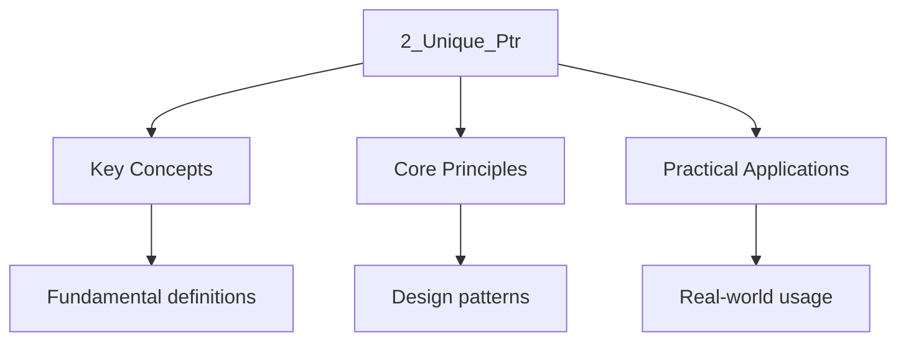

---

title: Unique Ownership (std::unique_ptr) and EBO
description: "is the default smart pointer for exclusive ownership of heap-allocated objects. It Is zero-overhead relative to a raw pointer, supports custom deleters with"
date: 2026-04-03T00:00:00.000Z
tags:
  - Cpp
categories:
  - Cpp

---

<!-- Breadcrumb Schema for SEO -->
<script type="application/ld+json">
{
  "@context": "https://schema.org",
  "@type": "BreadcrumbList",
  "itemListElement": [{"name": "Home", "url": "https://wyattau.com"}, {"name": "programming", "url": "https://programming.wyattau.com"}, {"name": "Resource_management", "url": "https://programming.wyattau.com/resource_management"}, {"name": "1_ownership_and_raii", "url": "https://programming.wyattau.com/resource_management/1_ownership_and_raii"}, {"name": "2_unique_ptr", "url": "https://programming.wyattau.com/resource_management/1_ownership_and_raii/2_unique_ptr"}]
}
</script>

## Unique Ownership (std::unique_ptr) and EBO

`std::unique_ptr` is the default smart pointer for exclusive ownership of heap-allocated objects. It
Is zero-overhead relative to a raw pointer, supports custom deleters with Empty Base Optimization,
And enforces move-only semantics that make ownership transfers explicit at the call site.

## 2.1 Definition

`std::unique_ptr<T>` is a smart pointer that holds a heap-allocated object via exclusive ownership.
Exactly one `unique_ptr` owns the pointed-to object at any time. When the `unique_ptr` is destroyed,
The object is deleted [N4950 §20.11.1].

```
Layout (default deleter, no EBO savings):
┌──────────────────┐
│ T* ptr_          │  (1 pointer, 8 bytes on x86_64)
└──────────────────┘
sizeof(std::unique_ptr<T>) == sizeof(T*)
```

## 2.2 Construction: `std::make_unique`

Always prefer `std::make_unique<T>(args...)` over `new T(args...)` [N4950 §20.11.3]. The reasons
Are:

1. **Exception safety:** `make_unique` performs a single allocation. Expressions like
   `f(unique_ptr<T>(new T), may_throw())` can leak if evaluation order causes `new T` to succeed but
   `may_throw()` throws before the `unique_ptr` is constructed.
2. **No raw `new` exposure:** The `new` expression is hidden inside the factory, preventing
   accidental raw pointer use.

```cpp
#include <memory>
#include <string>

struct Widget {
    std::string name;
    int value;
    Widget(std::string n, int v) : name(std::move(n)), value(v) {}
};

std::unique_ptr<Widget> create_widget() {
    return std::make_unique<Widget>("sensor", 42);
}

void use_widget() {
    auto w = create_widget();
    // w owns the Widget. When w goes out of scope, the Widget is deleted.
}
```

## 2.3 Move-Only Semantics

`unique_ptr` deletes its copy constructor and copy assignment operator. Ownership can only be
Transferred via move:

```cpp
#include <memory>

void sink(std::unique_ptr<int> p) {
    // sink now owns the int
}

void transfer_demo() {
    auto p = std::make_unique<int>(10);

    // auto q = p;                  // ERROR: copy is deleted
    auto q = std::move(p);         // OK: p is now nullptr, q owns the int

    sink(std::move(q));            // OK: q is now nullptr, sink owns the int

    // *p;                          // UB: p is nullptr
}
```

:::note
Takes a `unique_ptr` by value, the caller **must** explicitly transfer ownership with `std::move`.
This makes the ownership transfer visible at the call site.
:::
## 2.4 Custom Deleters

`std::unique_ptr<T, D>` accepts a second template parameter: the **deleter type** `D`. The deleter
Is a callable invoked instead of `delete` when the `unique_ptr` is destroyed [N4950 §20.11.1.2].

When the deleter is stateless (empty class, no captured data), the compiler applies **Empty Base
Optimization (EBO)** and the deleter consumes zero bytes:

```cpp
#include <memory>
#include <cstdio>

struct FileDeleter {
    void operator()(std::FILE* fp) const {
        if (fp) std::fclose(fp);
    }
};

using UniqueFile = std::unique_ptr<std::FILE, FileDeleter>;

void custom_deleter_demo() {
    // sizeof(UniqueFile) == 8 (just the pointer; FileDeleter is empty, EBO applies)
    UniqueFile fp(std::fopen("data.bin", "rb"));
    if (!fp) return;
    // fp is automatically closed when it goes out of scope
}
```

When the deleter captures state (a lambda with captures), its size is added:

```cpp
#include <memory>

void stateful_deleter_demo() {
    // This lambda captures nothing -> EBO applies, sizeof == 8
    auto deleter1 = [](int* p) { delete[] p; };
    std::unique_ptr<int, decltype(deleter1)> p1(new int[10], deleter1);

    // This lambda captures a value -> sizeof == 8 (pointer) + 4 (int capture)
    int log_id = 42;
    auto deleter2 = [log_id](int* p) {
        // Log the deletion (for demonstration; std::println in C++23)
        delete[] p;
    };
    std::unique_ptr<int, decltype(deleter2)> p2(new int[10], deleter2);
    // sizeof(p2) == 16 on most platforms
}
```

## 2.5 Array Specialization

`std::unique_ptr<T[]>` manages arrays. It calls `delete[]` instead of `delete` and provides
`operator[]` instead of `operator*` and `operator->`:

```cpp
#include <memory>
#include <cstddef>

void array_demo() {
    auto arr = std::make_unique<int[]>(100);
    arr[0] = 42;
    // ~unique_ptr<int[]>() calls delete[] arr
}
```

:::caution
Built-in types). If you need non-zero initialization, use `std::vector` or construct manually.
:::
## 2.6 `unique_ptr` with Polymorphism

`unique_ptr` is the canonical way to manage polymorphic objects. The deleter calls `delete` on the
Base-class pointer, which correctly invokes the derived-class destructor via virtual dispatch [N4950
§11.7.3]. The base class **must** have a virtual destructor.

```cpp
#include <iostream>
#include <memory>
#include <vector>
#include <string>

class Shape {
public:
    virtual ~Shape() = default;
    virtual double area() const = 0;
    virtual std::string name() const = 0;
};

class Circle : public Shape {
    double radius_;
public:
    explicit Circle(double r) : radius_(r) {}
    double area() const override { return 3.14159265 * radius_ * radius_; }
    std::string name() const override { return "Circle(r=" + std::to_string(radius_) + ")"; }
};

class Rectangle : public Shape {
    double w_, h_;
public:
    Rectangle(double w, double h) : w_(w), h_(h) {}
    double area() const override { return w_ * h_; }
    std::string name() const override {
        return "Rect(" + std::to_string(w_) + "x" + std::to_string(h_) + ")";
    }
};

void draw_shapes(const std::vector<std::unique_ptr<Shape>>& shapes) {
    for (const auto& s : shapes) {
        std::cout << s->name() << " area=" << s->area() << "\n";
    }
}

int main() {
    std::vector<std::unique_ptr<Shape>> shapes;
    shapes.push_back(std::make_unique<Circle>(5.0));
    shapes.push_back(std::make_unique<Rectangle>(3.0, 4.0));
    shapes.push_back(std::make_unique<Circle>(1.5));

    draw_shapes(shapes);
    // Each Shape"s correct destructor runs when the vector is destroyed.
    // Output:
    // Circle(r=5.000000) area=78.5398
    // Rect(3.000000x4.000000) area=12
    // Circle(r=1.500000) area=7.06858
}
```

:::caution
Points to a derived object is undefined behavior [N4950 §11.7.3]. The derived destructor does not
Run, leaking resources. Always use `virtual ~Base() = default;` in polymorphic base classes.
:::
## 2.7 `unique_ptr` as a Class Member

`unique_ptr` as a class member simplifies resource management and eliminates the need for manual
`delete` in destructors. Because `unique_ptr` is move-only, the class itself becomes move-only
Unless you explicitly implement move operations.

```cpp
#include <iostream>
#include <memory>
#include <string>
#include <utility>

class Engine {
    std::string model_;
public:
    explicit Engine(std::string model) : model_(std::move(model)) {
        std::cout << "Engine(" << model_ << ") constructed\n";
    }
    ~Engine() { std::cout << "Engine(" << model_ << ") destroyed\n"; }
    std::string model() const { return model_; }
};

class Car {
    std::string name_;
    std::unique_ptr<Engine> engine_;
public:
    // Constructor: engine is passed as a unique_ptr (ownership transfer)
    Car(std::string name, std::unique_ptr<Engine> engine)
        : name_(std::move(name)), engine_(std::move(engine)) {}

    // Rule of five:
    // Copy constructor: DELETED (unique_ptr is move-only)
    Car(const Car&) = delete;
    Car& operator=(const Car&) = delete;

    // Move constructor: transfers engine ownership
    Car(Car&& other) noexcept
        : name_(std::move(other.name_)), engine_(std::move(other.engine_)) {}

    // Move assignment: transfers engine ownership
    Car& operator=(Car&& other) noexcept {
        if (this != &other) {
            name_ = std::move(other.name_);
            engine_ = std::move(other.engine_);
        }
        return *this;
    }

    // Destructor: engine_ is automatically deleted (no manual cleanup needed)
    ~Car() = default;

    Engine* engine() const { return engine_.get(); }
    std::string name() const { return name_; }
};

std::unique_ptr<Car> make_car(const std::string& name) {
    return std::make_unique<Car>(
        name,
        std::make_unique<Engine>("V8")
    );
}

int main() {
    auto car = make_car("Mustang");
    std::cout << car->name() << " has " << car->engine()->model() << "\n";

    auto car2 = std::move(car);  // ownership transfer
    std::cout << car2.name() << " has " << car2.engine()->model() << "\n";
    // car is now nullptr (engine was moved)
}
```

## 2.8 `unique_ptr` in Containers

`std::vector<std::unique_ptr<T>>` is the standard pattern for polymorphic collections with unique
Ownership. Elements must be moved in; the vector takes ownership.

```cpp
#include <iostream>
#include <memory>
#include <vector>
#include <algorithm>

struct Task {
    virtual ~Task() = default;
    virtual void execute() const = 0;
};

struct PrintTask : Task {
    std::string msg_;
    explicit PrintTask(std::string msg) : msg_(std::move(msg)) {}
    void execute() const override { std::cout << "Print: " << msg_ << "\n"; }
};

struct ComputeTask : Task {
    int a_, b_;
    ComputeTask(int a, int b) : a_(a), b_(b) {}
    void execute() const override {
        std::cout << "Compute: " << a_ << " + " << b_ << " = " << (a_ + b_) << "\n";
    }
};

int main() {
    std::vector<std::unique_ptr<Task>> tasks;

    // Push via make_unique (move semantics)
    tasks.push_back(std::make_unique<PrintTask>("hello"));
    tasks.push_back(std::make_unique<ComputeTask>(3, 4));
    tasks.push_back(std::make_unique<PrintTask>("world"));

    // Emplace (constructs in-place)
    tasks.emplace_back(std::make_unique<ComputeTask>(10, 20));

    // Execute all tasks
    for (const auto& task : tasks) {
        task->execute();
    }

    // Remove a task by index (unique_ptr handles cleanup)
    tasks.erase(tasks.begin() + 1);  // removes ComputeTask(3,4)

    std::cout << "After removal (" << tasks.size() << " tasks):\n";
    for (const auto& task : tasks) {
        task->execute();
    }

    // Sort: unique_ptr compares the pointer value, not the pointed-to object.
    // To sort by the object, use a custom comparator.
    // std::ranges::sort(tasks, [](const auto& a, const auto& b) { ... });
}
```

:::note
Iterator invalidation on push_back amortized, only on reallocation). This makes it safe to hold raw
Pointers to elements as long as no insertion triggers a reallocation.
:::
## 2.9 `unique_ptr` and Incomplete Types (Pimpl Idiom)

`unique_ptr` can hold a pointer to an **incomplete type** in a header file, as long as the deleter
Is the default (stateless) deleter [N4950 §20.11.1]. This enables the **pimpl (pointer to
Implementation)** idiom: hide implementation details from the header, reducing compilation
Dependencies.

The key constraint: the destructor (or any function that calls `delete`) must be defined in the
Source file where the type is complete. A default-declared destructor in the header will attempt to
Generate the body at each call site, causing errors.

```cpp
// ---- widget.h ----
#ifndef WIDGET_H
#define WIDGET_H

#include <memory>
#include <string>

class Widget {
public:
    Widget(std::string name);
    ~Widget();  // MUST be declared (not defaulted) in the header

    Widget(const Widget&) = delete;
    Widget& operator=(const Widget&) = delete;

    Widget(Widget&&) noexcept;
    Widget& operator=(Widget&&) noexcept;

    void process() const;
    std::string name() const;

private:
    // Incomplete type: Impl is forward-declared, not defined here.
    struct Impl;
    std::unique_ptr<Impl> impl_;
};

#endif
```

```cpp
// ---- widget.cpp ----
#include "widget.h"
#include <iostream>

// Complete definition of Impl — hidden from widget.h consumers
struct Widget::Impl {
    std::string name_;
    std::vector<int> data_;
    // ... potentially heavy implementation details

    explicit Impl(std::string name) : name_(std::move(name)), data_(1000, 0) {}
};

Widget::Widget(std::string name)
    : impl_(std::make_unique<Impl>(std::move(name))) {}

// Destructor defined HERE where Impl is complete
Widget::~Widget() = default;

Widget::Widget(Widget&&) noexcept = default;
Widget::Widget& operator=(Widget&&) noexcept = default;

void Widget::process() const {
    std::cout << "Processing " << impl_->name_
              << " (data size: " << impl_->data_.size() << ")\n";
}

std::string Widget::name() const { return impl_->name_; }
```

```cpp
// ---- main.cpp ----
#include "widget.h"

int main() {
    Widget w("sensor-01");
    w.process();
    // Output: Processing sensor-01 (data size: 1000)
}
```

:::caution
Compiler generates the destructor body at each call site. The `delete impl_` call requires `Impl` to
Be complete. This causes a compilation error. Always declare `~Widget();` in the header and define
It (as `= default` or manually) in the `.cpp` file.
:::
## 2.10 `sizeof(unique_ptr)` Comparison Across Types

The size of `unique_ptr` depends on the deleter type. With the default deleter (stateless, zero-size
Via EBO), `sizeof(unique_ptr<T>) == sizeof(T*)` on all major implementations [N4950 §20.11.1].

```cpp
#include <iostream>
#include <memory>
#include <cstdio>
#include <functional>

struct FileDeleter {
    void operator()(std::FILE* fp) const {
        if (fp) std::fclose(fp);
    }
};

struct CaptureDeleter {
    int log_level_;
    void operator()(int* p) const {
        delete[] p;
    }
};

struct LargeDeleter {
    double a_, b_, c_, d_;
    void operator()(int* p) const { delete[] p; }
};

int main() {
    std::cout << "sizeof(unique_ptr<int>):                    "
              << sizeof(std::unique_ptr<int>) << " bytes\n";
    // Output: 8 bytes (one pointer)

    std::cout << "sizeof(unique_ptr<double>):                 "
              << sizeof(std::unique_ptr<double>) << " bytes\n";
    // Output: 8 bytes (one pointer; T doesn't affect size)

    std::cout << "sizeof(unique_ptr<int[]>):                  "
              << sizeof(std::unique_ptr<int[]>) << " bytes\n";
    // Output: 8 bytes (array specialization, same deleter)

    std::cout << "sizeof(unique_ptr<FILE, FileDeleter>):      "
              << sizeof(std::unique_ptr<std::FILE, FileDeleter>) << " bytes\n";
    // Output: 8 bytes (FileDeleter is empty, EBO applies)

    std::cout << "sizeof(unique_ptr<int, CaptureDeleter>):    "
              << sizeof(std::unique_ptr<int, CaptureDeleter>) << " bytes\n";
    // Output: 16 bytes (8 pointer + 4 captured int + padding)

    std::cout << "sizeof(unique_ptr<int, LargeDeleter>):      "
              << sizeof(std::unique_ptr<int, LargeDeleter>) << " bytes\n";
    // Output: 40 bytes (8 pointer + 32 deleter state)

    std::cout << "sizeof(unique_ptr<int, std::function<void(int*)>>): "
              << sizeof(std::unique_ptr<int, std::function<void(int*)>>) << " bytes\n";
    // Output: 48 bytes (8 pointer + ~40 for std::function)
}
```

| Deleter Type                    | State     | `sizeof(unique_ptr&lt;int, D&gt;)` | EBO |
| ------------------------------- | --------- | ---------------------------------- | --- |
| Default (`std::default_delete`) | Empty     | 8                                  | Yes |
| Empty stateless struct          | Empty     | 8                                  | Yes |
| Lambda with 0 captures          | Empty     | 8                                  | Yes |
| Lambda with 1 `int` capture     | 4 bytes   | 16 (aligned)                       | No  |
| `std::function`                 | ~40 bytes | ~48                                | No  |

## 2.11 `make_unique` vs Raw `new`

Beyond exception safety, `make_unique` has another advantage: it prevents accidental use of the raw
Pointer. The `new` expression returns a raw pointer that can escape before being wrapped:

```cpp
#include <memory>
#include <iostream>

// BAD: raw pointer escapes, can be used after deletion
void bad_pattern() {
    std::unique_ptr<int> p(new int(42));
    int* raw = p.get();
    // ... later code could use 'raw' after 'p' is destroyed or reset
}

// GOOD: make_unique never exposes a raw pointer in the expression
void good_pattern() {
    auto p = std::make_unique<int>(42);
    int* raw = p.get();  // explicit, intentional
    // ... but at least the creation was exception-safe
}

// DANGER: exception-unsafe pattern with multiple allocations
void dangerous(int x, int y) {
    // If 'new int(y)' throws, 'new int(x)' leaks!
    // auto p = std::unique_ptr<int>(new int(x));
    // throw std::runtime_error("oops");  // leak!
    // auto q = std::unique_ptr<int>(new int(y));

    // SAFE: make_unique + separate statements
    auto p = std::make_unique<int>(x);
    auto q = std::make_unique<int>(y);
    // If this throws, both p and q are cleaned up.
    (void)p; (void)q;
}
```

## 2.12 Reset and Release

`unique_ptr` provides `reset()` and `release()` for explicit ownership management:

```cpp
#include <iostream>
#include <memory>

int main() {
    auto p = std::make_unique<int>(42);
    std::cout << *p << "\n";  // 42

    // reset: destroy current object and take ownership of a new one
    p.reset(new int(99));
    std::cout << *p << "\n";  // 99

    // reset(nullptr): destroy current object, become null
    p.reset();
    std::cout << (p == nullptr) << "\n";  // 1 (true)

    // release: surrender ownership WITHOUT deleting
    p = std::make_unique<int>(7);
    int* raw = p.release();  // p becomes nullptr, raw points to the int
    std::cout << *raw << "\n";  // 7
    std::cout << (p == nullptr) << "\n";  // 1 (true)
    delete raw;  // caller is now responsible for cleanup
}
```

:::caution
`unique_ptr` to null. The caller assumes responsibility for cleanup. Use `release()` only when you
Are transferring ownership to another mechanism (e.g., a C API that takes ownership).
:::
## Intuition

std::unique_ptr is a single-owner smart pointer -- like a house key that only one person holds. When that person leaves (the unique_ptr is destroyed), the house is demolished (the object is deleted). You cannot copy the key (copy semantics are deleted), but you can hand it to someone else (move semantics). make_unique is the safe factory that builds the house and hands you the key in one step, avoiding the dangerous gap where a raw pointer exists without ownership. The zero-cost abstraction means unique_ptr is as efficient as a raw pointer -- it adds safety without adding overhead.

## Intuition

**`std::unique_ptr` is like a solo ownership contract:** Only one person can own the resource at a time. When you transfer ownership (move the pointer), the original owner no longer has access — like handing someone your car keys. You can't copy a unique pointer (no two people can have the same car keys), but you can move it (hand over the keys). The resource is freed automatically when the last owner goes out of scope — no manual `delete` needed.

**Why it matters:** `unique_ptr` is the default choice for heap-allocated objects. It has zero overhead compared to raw pointers (same size, same performance), but provides automatic cleanup and move semantics. Use it whenever you need heap allocation but don't need shared ownership. It's also the building block for `shared_ptr` — the control block is managed by `unique_ptr` internally.

**The key insight:** `unique_ptr` is zero-overhead — it's the same size and performance as a raw pointer, but with automatic cleanup and move semantics.

## Common Pitfalls

### Using `unique_ptr` with Arrays Incorrectly

`unique_ptr<T>` (singular) calls `delete`Not `delete[]`. Using it with array-allocated memory is
Undefined behavior:

```cpp
#include <memory>

int main() {
    // WRONG: unique_ptr<int> calls delete, not delete[]
    // std::unique_ptr<int> p(new int[10]);  // UB on destruction

    // CORRECT: use unique_ptr<T[]> for arrays
    std::unique_ptr<int[]> arr(new int[10]);

    // CORRECT: prefer std::vector for dynamic arrays
    // std::vector<int> v(10);
}
```

### Forgetting to Move When Transferring Ownership

```cpp
#include <memory>
#include <vector>

void consume(std::unique_ptr<int> p) {
    // takes ownership
}

int main() {
    auto p = std::make_unique<int>(42);

    std::vector<std::unique_ptr<int>> v;
    // v.push_back(p);          // ERROR: copy is deleted
    v.push_back(std::move(p));  // OK: moves ownership into the vector

    // consume(p);              // ERROR: copy is deleted
    consume(std::move(p));      // ERROR: p is already null from the move above!
    // consume(std::move(v[0])); // OK
}
```

### Returning `unique_ptr` from Functions

Returning `unique_ptr` by value does **not** require `std::move` at the return site. Named Return
Value Optimization (NRVO) and implicit move semantics handle it:

```cpp
#include <memory>

std::unique_ptr<int> make_value() {
    auto p = std::make_unique<int>(42);
    return p;  // OK: implicit move (C++11+). Do NOT write return std::move(p);
    // Writing std::move(p) here prevents NRVO and is a pessimization.
}

std::unique_ptr<int> make_value_alt() {
    return std::make_unique<int>(42);  // OK: prvalue, no move needed
}
```

## See Also

- [RAII Patterns](1_raii_patterns.md)
- [Shared Ownership (std::shared_ptr) and Control Block](3_shared_ptr.md)
- [Weak References (std::weak_ptr)](4_weak_ptr.md)
- [Common Pitfalls](5_custom_deleters.md)

- [Complexity Theory](https://computer-science.wyattau.com/docs/complexity-theory)
- [Discrete Mathematics](https://mathematics.wyattau.com/docs/discrete-mathematics)
- [Algorithm Analysis](https://computer-science.wyattau.com/docs/algorithm-analysis)




## Summary

This topic covers the essential concepts and techniques related to unique ownership
(std::unique_ptr) and ebo, including key principles and practical applications.

**Key concepts include:**

- core concepts and definitions
- key principles and frameworks
- practical applications
- common techniques and methods
- evaluation and critical analysis

A thorough understanding of these concepts, combined with regular practice and review, is essential
for mastery of this topic.

## Worked Examples

Worked examples demonstrating the application of key concepts are covered in the detailed sub-pages
linked above.
