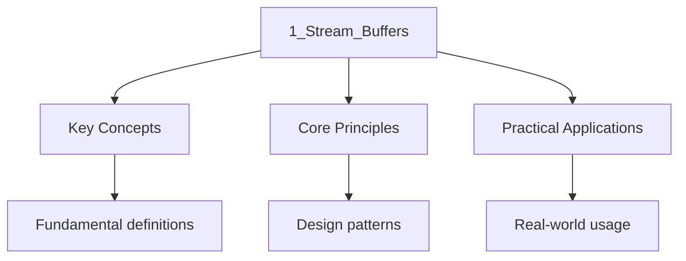

---

title: Stream Buffers and Locale Facets
description: "The C++ I/O system is built on a layered architecture. High-level stream classes ( ) perform formatting and parsing, then delegate actual character transfer"
date: 2026-04-03T00:00:00.000Z
tags:
  - Cpp
categories:
  - Cpp

---

<!-- Breadcrumb Schema for SEO -->
<script type="application/ld+json">
{
  "@context": "https://schema.org",
  "@type": "BreadcrumbList",
  "itemListElement": [{"name": "Home", "url": "https://wyattau.com"}, {"name": "programming", "url": "https://programming.wyattau.com"}, {"name": "Standard_library", "url": "https://programming.wyattau.com/standard_library"}, {"name": "3_input_output_formatting", "url": "https://programming.wyattau.com/standard_library/3_input_output_formatting"}, {"name": "1_stream_buffers", "url": "https://programming.wyattau.com/standard_library/3_input_output_formatting/1_stream_buffers"}]
}
</script>

## Stream Buffers and Locale Facets

The C++ I/O system is built on a layered architecture. High-level stream classes (`std::istream`
`std::ostream`) perform formatting and parsing, then delegate actual character transfer to a
Low-level **stream buffer** (`std::basic_streambuf`). Locales provide a collection of **facets** ---
Polymorphic classes that encapsulate cultural conventions like numeric formatting, character
Classification, and collation. This section covers the stream buffer abstraction, its standard
Specializations, locale facets, and custom stream buffer implementation.

### The Stream Buffer Abstraction

`std::basic_streambuf&lt;CharT, Traits>` is the low-level buffer abstraction that underlies all C++
I/O [N4950 §30.4]. A stream buffer manages two character buffers:

- **Put area** (output buffer): characters waiting to be written to the destination.
- **Get area** (input buffer): characters read from the source and available for consumption.

The stream buffer is responsible for the actual transfer of characters between these in-memory
Buffers and the external device (file, console, string, network socket). The high-level stream
Classes (`std::istream``std::ostream`) are thin wrappers that perform formatting and parsing, then
Delegate the actual I/O to their associated stream buffer.

```
┌─────────────────────────────────────────────────────────────────┐
│                      std::ostream                                │
│  (formatting: operator&lt;&lt;, std::setw, std::precision, etc.)      │
└──────────────────────┬──────────────────────────────────────────┘
                       │ delegates to
                       ▼
┌─────────────────────────────────────────────────────────────────┐
│                  std::basic_streambuf&lt;char&gt;                      │
│  ┌──────────────┐     ┌──────────────┐                          │
│  │  Put Area    │     │  Get Area    │                          │
│  │  (output)    │     │  (input)     │                          │
│  │  pbase epptr │     │  eback egptr │                          │
│  │  pptr        │     │  gptr        │                          │
│  └──────┬───────┘     └──────┬───────┘                          │
│         │                    │                                  │
│         ▼                    ▼                                  │
│    external device      external source                         │
│   (file, console,       (file, console,                         │
│    string, socket)       string, socket)                         │
└─────────────────────────────────────────────────────────────────┘
```

The standard stream buffer operations [N4950 §30.4.4] are:

| Virtual Function            | Direction | Purpose                                                                                |
| :-------------------------- | :-------- | :------------------------------------------------------------------------------------- |
| `overflow(int_type c)`      | Output    | Called when the put area is full; writes buffered characters and optionally stores `c` |
| `underflow()`               | Input     | Called when the get area is empty; fills the get area from the source                  |
| `sync()`                    | Both      | Synchronizes the buffer with the external device (e.g., flushes to disk)               |
| `setbuf(char*, streamsize)` | Both      | Sets the internal buffer (called by `std::streambuf::pubsetbuf`)                       |

### Standard Stream Buffer Specializations

The library provides three concrete stream buffer types [N4950 §30.4.2]:

**`std::basic_stringbuf&lt;CharT>`** — reads from and writes to a `std::basic_string`. Used by
`std::istringstream``std::ostringstream`And `std::stringstream`. The buffer stores characters
Directly in a dynamically managed string, so no external device is involved [N4950 §30.4.2.3].

**`std::basic_filebuf&lt;CharT>`** — reads from and writes to a file. Used by `std::ifstream`
`std::ofstream`And `std::fstream`. Manages a `std::FILE*`-like resource internally, but with full
C++ semantics (RAII, locale awareness, codecvt for character set conversion) [N4950 §30.4.2.4].

**`std::basic_spanbuf&lt;CharT>`** (C++23) — reads from and writes to a contiguous sequence of
Characters described by a `std::span`. Unlike `stringbuf`It does not own the underlying storage.
This enables zero-copy I/O into pre-allocated buffers, which is critical in embedded systems and
High-performance networking where allocation is forbidden [N4950 §30.4.2.5].

```cpp
#include <iostream>
#include <sstream>
#include <span>
#include <string>

void standard_streambuf_demo() {
    // stringbuf: backed by a std::string (owned)
    std::stringbuf sbuf;
    sbuf.sputn("hello, streambuf!", 17);
    std::cout << "stringbuf contents: " << sbuf.str() << "\n";

    // filebuf: backed by a file
    std::filebuf fbuf;
    fbuf.open("demo.txt", std::ios::out);
    fbuf.sputn("written via filebuf", 20);
    fbuf.close();
}

void spanbuf_demo() {
    // spanbuf (C++23): backed by a std::span (non-owning, zero-copy)
    char buffer[64]{};
    std::span<char> buf_span(buffer);
    std::spanbuf sbuf(buf_span);
    sbuf.sputn("zero-copy write", 15);
    // buffer now contains "zero-copy write"
}
```

:::tip
Fixed-size pre-allocated buffer (e.g., a network packet buffer or embedded flash region). It avoids
Heap allocation entirely.
:::
### Locale Facets

A **locale** in C++ is a collection of **facets** — polymorphic classes that encapsulate cultural
Conventions for text processing [N4950 §30.3]. The standard defines facets for character
Classification, numeric formatting, collation, time formatting, and message catalogs.

Each facet is identified by a `std::locale::id` static member and accessed via
`std::use_facet&lt;F>(loc)`. The locale object holds a reference-counted set of facets; copying a
Locale is cheap (shared ownership) [N4950 §30.3.1].

The standard facets [N4950 §30.3.1.1.2]:

| Facet                      | Header     | Purpose                                                  |
| :------------------------- | :--------- | :------------------------------------------------------- |
| `std::ctype&lt;CharT>`     | `<locale>` | Character classification and case conversion             |
| `std::numpunct&lt;CharT>`  | `<locale>` | Numeric punctuation (decimal point, thousands separator) |
| `std::collate&lt;CharT>`   | `<locale>` | String collation (comparison ordering)                   |
| `std::time_get&lt;CharT>`  | `<locale>` | Parsing time from character sequences                    |
| `std::time_put&lt;CharT>`  | `<locale>` | Formatting time into character sequences                 |
| `std::money_get&lt;CharT>` | `<locale>` | Parsing monetary values                                  |
| `std::money_put&lt;CharT>` | `<locale>` | Formatting monetary values                               |
| `std::messages&lt;CharT>`  | `<locale>` | Message catalog lookup (gettext-like)                    |

```cpp
#include <iostream>
#include <locale>
#include <string>
#include <vector>

void locale_facet_demo() {
    std::locale loc("");  // User"s preferred locale from environment

    const auto& punct = std::use_facet<std::numpunct<char>>(loc);
    std::cout << "Decimal point: "" << punct.decimal_point() << "''\n";
    std::cout << "Thousands sep:   "" << punct.thousands_sep() << "'\n";

    std::cout << "Grouping:        ";
    std::string grouping = punct.grouping();
    for (unsigned char g : grouping) {
        std::cout << static_cast<int>(g) << " ";
    }
    std::cout << "\n";

    const auto& ct = std::use_facet<std::ctype<char>>(loc);
    std::string text = "Hello World 123";
    std::vector<char> upper(text.size());
    ct.toupper(text.data(), text.data() + text.size());
    std::cout << "Uppercased:      " << text << "\n";
}
```

:::note
`""` locale (empty string) selects the user's preferred locale from environment variables (`LC_ALL`
`LC_NUMERIC``LANG`). Be aware that locale-sensitive operations are **not** thread-safe in the
Standard: `std::locale::global()` modifies a global variable and is not safe to call concurrently
[N4950 §30.3.1.3].
:::
### Custom Stream Buffer

The power of the stream buffer abstraction is that you can derive from `std::streambuf` to redirect
I/O to any destination. The following example implements a logging stream buffer that prefixes each
Line with a timestamp and log level:

```cpp
#include <ctime>
#include <iostream>
#include <streambuf>
#include <string>
#include <string_view>

class LogStreamBuf : public std::streambuf {
    std::string     line_buffer_;
    std::string     level_;
    std::streambuf* sink_;

protected:
    int overflow(int c) override {
        if (c != std::streambuf::traits_type::eof()) {
            if (c == '\n') {
                flush_line();
            } else {
                line_buffer_.push_back(static_cast<char>(c));
            }
        }
        return c;
    }

    int sync() override {
        if (!line_buffer_.empty()) {
            flush_line();
        }
        return 0;
    }

    void flush_line() {
        std::string timestamp = current_time_string();
        std::string full_line = "[" + timestamp + "] [" + level_ + "] " + line_buffer_ + "\n";
        sink_->sputn(full_line.c_str(), static_cast<std::streamsize>(full_line.size()));
        line_buffer_.clear();
    }

    static std::string current_time_string() {
        std::time_t now = std::time(nullptr);
        char buf[32];
        std::strftime(buf, sizeof(buf), "%Y-%m-%d %H:%M:%S", std::localtime(&now));
        return buf;
    }

public:
    explicit LogStreamBuf(std::string level, std::streambuf* sink = std::cout.rdbuf())
        : level_(std::move(level)), sink_(sink) {}
};

int main() {
    LogStreamBuf info_buf("INFO");
    LogStreamBuf warn_buf("WARN");
    LogStreamBuf err_buf("ERROR");

    std::ostream info_stream(&info_buf);
    std::ostream warn_stream(&warn_buf);
    std::ostream err_stream(&err_buf);

    info_stream << "Application started successfully\n";
    warn_stream << "Disk usage at 87%\n";
    err_stream << "Connection timeout after 30s\n";

    return 0;
}
```

Output (example):

```
[2026-03-31 14:22:01] [INFO] Application started successfully
[2026-03-31 14:22:01] [WARN] Disk usage at 87%
[2026-03-31 14:22:01] [ERROR] Connection timeout after 30s
```

:::tip
Each character written to the stream. Buffering the line and flushing on `\n` gives you control over
The output format. For thread-safe logging, wrap the `sputn` call in a mutex.
:::
:::caution
`std::flush` and `std::endl`. If you only override `overflow()`Manually flushed output (via
`std::flush`) will not reach your sink.
:::
### Connecting Stream Buffers to Streams

A stream (`std::istream``std::ostream`) does not own its stream buffer. You can redirect a stream To
a different buffer at any time using `rdbuf()`:

```cpp
#include <fstream>
#include <iostream>
#include <sstream>

void rdbuf_redirection_demo() {
    std::ostringstream oss;
    auto* old_buf = std::cout.rdbuf(oss.rdbuf());

    std::cout << "This goes to the string stream, not the console.\n";

    std::cout.rdbuf(old_buf);  // Restore original buffer
    std::cout << "Captured: " << oss.str() << "\n";
}
```

This technique is used in unit testing to capture `std::cout` output for assertion. The call to
`rdbuf(new_buf)` returns the previous buffer, which must be saved and restored to avoid dangling
State.

## See Also

- [Type-Safe Formatting](./2_type_safe_formatting)
- [Unicode Support](./3_unicode_support)

- [Operating Systems](https://computer-science.wyattau.com/docs/operating-systems)

### Put Area and Get Area Pointer Model

The stream buffer maintains six pointers that define the put area and get area [N4950 §30.4.4.2]:

```
Put area (output buffer):
  ┌──────┬──────┬──────┐
  │ pbase│ pptr │epptr │
  │(begin│(next │(end  │
  │ of   │ char │ of   │
  │ buf) │ to   │ buf) │
  └──────┴──────┴──────┘
  [ buffered ] [ free ]

Get area (input buffer):
  ┌──────┬──────┬──────┐
  │ eback│ gptr │egptr │
  │(begin│(next │(end  │
  │ of   │ char │ of   │
  │ buf) │ to   │ buf) │
  └──────┴──────┴──────┘
  [ consumed] [ available ]
```

- `pbase` / `pptr` / `epptr`: Put area begin, current position, end. Characters between `pbase` and
  `pptr` are buffered but not yet written to the destination.
- `eback` / `gptr` / `egptr`: Get area begin, current position, end. Characters between `gptr` and
  `egptr` are available for reading.

When `pptr == epptr` (put area full), the stream calls `overflow()`. When `gptr == egptr` (get area
Empty), the stream calls `underflow()`.

### `underflow` vs `uflow` vs `pbackfail`

The stream buffer provides three input-related virtual functions [N4950 §30.4.4.4]:

| Function       | Purpose                                                  | Modifies `gptr`? |
| :------------- | :------------------------------------------------------- | :--------------- |
| `underflow()`  | Fill the get area from the source; return the first char | No (peek)        |
| `uflow()`      | Call `underflow()`Then advance `gptr`                    | Yes (consume)    |
| `pbackfail(c)` | Put a character back into the get area (unget)           | Yes (retreat)    |

`underflow()` is a "peek" operation — it fills the buffer but does not advance the read position.
`uflow()` calls `underflow()` and then increments `gptr`Consuming the character. Most custom Stream
buffers only need to override `underflow()`; the default `uflow()` delegates to it.

```cpp
#include <cstddef>
#include <iostream>
#include <streambuf>

class CountingStreamBuf : public std::streambuf {
    std::size_t bytes_read_ = 0;

protected:
    // Override underflow to count bytes as they are read
    int underflow() override {
        // Delegate to the base class to fill the buffer
        int result = std::streambuf::underflow();
        if (result != std::streambuf::traits_type::eof()) {
            ++bytes_read_;
        }
        return result;
    }

public:
    std::size_t bytes_read() const { return bytes_read_; }
};

void counting_stream_demo() {
    CountingStreamBuf counter;
    std::istream in(&counter);

    int value;
    in >> value;  // Each character consumed increments bytes_read_

    std::cout << "Bytes read: " << counter.bytes_read() << "\n";
}
```

### Unbuffered vs Buffered Streams

By default, `std::cout` and `std::cin` are **tied** — accessing `std::cin` flushes `std::cout`
[N4950 §30.4.5.3]. This ensures prompts appear before input is read. `std::cerr` is **unitbuf** — it
Flushes after every output operation.

```cpp
#include <iostream>
#include <ostream>

void buffer_mode_demo() {
    // std::cout is in standard practice line-buffered when connected to a terminal
    // and fully buffered when redirected to a pipe or file.

    // std::cerr is unitbuf — flushes after every character
    // This is set via: std::cerr.setf(std::ios::unitbuf);

    // std::clog is fully buffered (like cout but not tied to cin)

    // Tie and untie streams
    std::ostream* old_tie = std::cin.tie(nullptr);  // untie cin from cout
    std::cin >> /* ... */;
    std::cin.tie(old_tie);  // restore

    // Manual buffer control
    std::cout << "Not flushed yet";
    // std::cout.flush();  // explicit flush
    std::cout << std::endl;  // flush + newline
    std::cout << std::flush;  // explicit flush, no newline
    std::cout << '\n';  // newline only, does NOT flush (unless line-buffered)
}
```

:::caution
I/O-heavy code. Each flush results in a `write()` system call, which is orders of magnitude slower
Than writing to the in-memory buffer. Only use unitbuf for logging where immediate visibility is
Critical.
:::
### `std::ios::sync_with_stdio`

`std::ios::sync_with_stdio(false)` decouples C++ streams from C stdio (`printf``scanf``fread`
`fwrite`) [N4950 §30.4.5.1]. By default, C++ streams are synchronized with C stdio to allow
Interleaved use, which incurs a performance penalty.

```cpp
#include <cstdio>
#include <iostream>

void sync_demo() {
    // Default: C++ streams and C stdio are synchronized
    std::ios_base::sync_with_stdio(false);

    // After this, do NOT mix printf/cout or scanf/cin — the results are undefined

    // Untie cin from cout for faster input
    std::cin.tie(nullptr);

    // Fast I/O loop
    int n;
    std::cin >> n;
    while (n--) {
        int x;
        std::cin >> x;
        std::cout << x << "\n";
    }
}
```

:::caution
Effect is irreversible once any standard stream has been used). This is a common pattern in
Competitive programming for fast I/O, but it is dangerous in library code because it affects the
Entire process. Never call it in a library.
:::
### Custom Input Stream Buffer

The following example implements a stream buffer that reads from a fixed memory buffer (similar to
`std::istringstream` but with explicit buffer control):

```cpp
#include <cstddef>
#include <iostream>
#include <streambuf>
#include <string_view>

class MemStreamBuf : public std::streambuf {
    const char* data_;
    std::size_t size_;

public:
    explicit MemStreamBuf(std::string_view data)
        : data_(data.data()), size_(data.size())
    {
        // Set up the get area: eback = data_, gptr = data_, egptr = data_ + size_
        auto* buf = const_cast<char*>(data_);
        setg(buf, buf, buf + size_);
    }

protected:
    // underflow() is called when gptr == egptr (buffer exhausted)
    // Since our buffer is fixed, we directly return eof.
    int underflow() override {
        return std::streambuf::traits_type::eof();
    }
};

void mem_stream_demo() {
    MemStreamBuf buf("42 3.14 hello");
    std::istream in(&buf);

    int i;
    double d;
    std::string s;

    in >> i >> d >> s;

    std::cout << "Parsed: " << i << ", " << d << ", " << s << "\n";
    // Parsed: 42, 3.14, hello
}
```

### `pubseekoff` and `pubseekpos` for Random Access

Stream buffers support random access through the `seekoff` and `seekpos` virtual functions [N4950
§30.4.4.6]. These are called by `std::istream::seekg` and `std::ostream::seekp`:

```cpp
#include <fstream>
#include <iostream>

void seek_demo() {
    std::fstream file("data.bin", std::ios::in | std::ios::out | std::ios::binary);

    // Write records at known offsets
    int record0 = 100;
    int record1 = 200;
    int record2 = 300;

    file.seekp(0 * sizeof(int));
    file.write(reinterpret_cast<const char*>(&record0), sizeof(int));

    file.seekp(1 * sizeof(int));
    file.write(reinterpret_cast<const char*>(&record1), sizeof(int));

    file.seekp(2 * sizeof(int));
    file.write(reinterpret_cast<const char*>(&record2), sizeof(int));

    // Read record 1 directly
    int value;
    file.seekg(1 * sizeof(int));
    file.read(reinterpret_cast<char*>(&value), sizeof(int));

    std::cout << "Record 1: " << value << "\n";
    // Record 1: 200

    // Get current position
    auto pos = file.tellg();
    std::cout << "Position: " << pos << "\n";
}
```

:::caution
Standard permits them to use separate positions. For maximum portability, always call `clear()`
Before seeking after a failed read, and avoid mixing reads and writes without an intervening seek.
:::
### Manipulators and Stream State

The stream state is controlled by a bitmask of `std::ios::iostate` flags [N4950 §30.4.3]:

| Flag      | Meaning                                            | Test Method |
| :-------- | :------------------------------------------------- | :---------- |
| `goodbit` | No errors                                          | `good()`    |
| `eofbit`  | End of file reached                                | `eof()`     |
| `failbit` | Format error (e.g., `cin &gt;&gt;` on non-numeric) | `fail()`    |
| `badbit`  | I/O error (stream corrupted, device failure)       | `bad()`     |

```cpp
#include <iostream>
#include <limits>
#include <string>

void stream_state_demo() {
    int value;
    std::cout << "Enter a number: ";

    if (!(std::cin >> value)) {
        if (std::cin.eof()) {
            std::cout << "EOF reached\n";
        } else if (std::cin.fail()) {
            std::cout << "Parse error — clearing...\n";
            std::cin.clear();  // Clear error flags

            // Discard the invalid input
            std::cin.ignore(std::numeric_limits<std::streamsize>::max(), '\n');
        }
    }

    // The state hierarchy:
    // good() = true only when state == goodbit
    // !fail() = true when state is goodbit OR eofbit (but NOT failbit or badbit)
    // This means a stream at EOF can still be read from (until the read fails)
}
```

### Common Pitfalls

1. **Not overriding `sync()` in custom stream buffers:** If you only override `overflow()`Calls to
   `std::flush` and `std::endl` will not reach your sink. Always override both `overflow()` and
   `sync()`.

2. **Returning EOF from `underflow()` incorrectly:** `underflow()` should return the next character
   (as an `int`) or `traits_type::eof()` if the source is exhausted. It should **not** advance
   `gptr`. If you advance `gptr` in `underflow()`The first character will be silently skipped.

3. **Using `std::cout` and `printf` interchangeably without `sync_with_stdio`:** After calling
   `sync_with_stdio(false)`The C++ and C I/O buffers are independent. Output may appear out of order
   or be lost. Either stay synchronized (the default) or use only one I/O system.

4. **`rdbuf()` ownership:** `std::cout.rdbuf(new_buf)` does **not** delete the old buffer. It
   replaces the pointer. If you dynamically allocate a custom stream buffer, you must delete it
   yourself after restoring the original buffer. Alternatively, wrap the buffer in a
   `std::unique_ptr` and manage its lifetime explicitly.

5. **`std::endl` vs `'\n'`:** `std::endl` flushes the stream after writing `'\n'`. In tight loops,
   this causes a system call per line. Use `'\n'` for performance-critical output and `std::flush`
   only when you need the output to be immediately visible.

6. **Thread safety of C++ streams:** The C++ standard does **not** guarantee that concurrent writes
   to the same `std::ostream` from different threads are safe. The behavior is undefined. Use
   `std::mutex` to serialize access to shared streams, or give each thread its own stream.

## Common Pitfalls

1. Ignoring feedback from marked work and failing to address recurring weaknesses.

2. Not practising with past papers or exercises under timed conditions.

3. Focusing only on content knowledge without developing exam technique and question-answering
   skills.

4. Not making connections between different topics within the subject to build a coherent
   understanding.

## Intuition

**Stream buffers are like water pipes:** The stream (`std::cout`, `std::ifstream`) is like the faucet — you turn it on and water flows. The stream buffer is like the pipe behind the wall — it actually carries the water from the source to the faucet. You rarely interact with stream buffers directly, but they're doing all the work. A custom stream buffer is like installing a water filter — the water still flows through the same faucet, but the pipe behind the wall processes it differently.

**Why it matters:** Stream buffers separate the interface (stream operations like `<<` and `>>`) from the implementation (where the data actually comes from or goes to). This lets you redirect `std::cout` to a file, a network socket, or a custom buffer without changing any code that writes to `std::cout`. It's the Strategy pattern applied to I/O.

**The key insight:** Stream buffers separate I/O interface from implementation — you can redirect `std::cout` to anywhere by replacing its stream buffer.




## Summary

The key principles covered in this topic are linked in the sub-pages above. Focus on understanding
the definitions, applying the formulas or frameworks, and evaluating strengths and limitations of
each approach.

## Worked Examples

Worked examples demonstrating the application of key concepts are covered in the detailed sub-pages
linked above.
