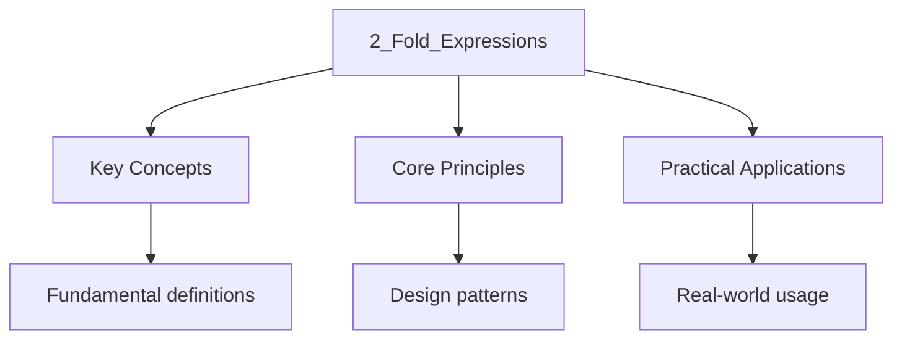

---

title: Fold Expressions and Pack Expansion
description: "A reduces a parameter pack using a binary operator [N4950 §7.6.1], introduced in C++17. Fold expressions come in four forms (unary left/right, binary"
date: 2026-04-03T00:00:00.000Z
tags:
  - Cpp
categories:
  - Cpp

---

<!-- Breadcrumb Schema for SEO -->
<script type="application/ld+json">
{
  "@context": "https://schema.org",
  "@type": "BreadcrumbList",
  "itemListElement": [{"name": "Home", "url": "https://wyattau.com"}, {"name": "programming", "url": "https://programming.wyattau.com"}, {"name": "Templates_and_metaprogramming", "url": "https://programming.wyattau.com/templates_and_metaprogramming"}, {"name": "3_compile_time_computation", "url": "https://programming.wyattau.com/templates_and_metaprogramming/3_compile_time_computation"}, {"name": "2_fold_expressions", "url": "https://programming.wyattau.com/templates_and_metaprogramming/3_compile_time_computation/2_fold_expressions"}]
}
</script>

## Fold Expressions and Pack Expansion

A **fold expression** reduces a parameter pack using a binary operator [N4950 §7.6.1], introduced in
C++17. Fold expressions come in four forms (unary left/right, binary left/right) and provide a
Concise, readable way to perform operations across all elements of a parameter pack without manual
Recursion.

## Formal Grammar and Semantics [N4950 §7.6.1]

The grammar for fold expressions is defined in [N4950 §7.6.1]:

```
fold-expression:
    ( cast-expression fold-operator ... )
    ( ... fold-operator cast-expression )
    ( cast-expression fold-operator ... fold-operator cast-expression )
```

The three productions correspond to:

1. **Unary right fold:** `(pack op ...)`
2. **Unary left fold:** `(... op pack)`
3. **Binary fold:** `(pack op ... op init)` or `(init op ... op pack)`

A fold expression has the following semantics:

1. The pack is expanded to produce $N$ operands (where $N$ is the pack size).
2. The binary operator is applied to combine the operands according to the fold direction.
3. If the pack is empty, the result depends on the operator (see Empty Pack Behavior).

The expansion produces an expression tree whose shape is determined by the fold direction and the
Associativity of the operator.

## Fold Expressions

A **fold expression** reduces a parameter pack using a binary operator [N4950 §7.6.1], introduced in
C++17. Fold expressions come in four forms:

$$
\mathrm{unary right fold:  (pack \ op \ ...)
$$

$$
\mathrm{unary left fold:  (\ldots \ op \ pack)
$$

$$
\mathrm{binary right fold:  (pack \ op \ \ldots \ op \ init)
$$

$$
\mathrm{binary left fold:  (init \ op \ \ldots \ op \ pack)
$$

```cpp
#include <iostream>
#include <concepts>
#include <type_traits>

// Sum all arguments: unary right fold
template <typename... Args>
auto sum(Args... args) {
    return (args + ...);
}

// Product with initial value: binary left fold
template <typename... Args>
auto product(Args... args) {
    return (1 * ... * args);  // binary left fold with init = 1
}

// All-true predicate using fold expression
template <typename... Args>
constexpr bool all_true(Args... args) {
    return (args && ...);
}

// Any-true predicate
template <typename... Args>
constexpr bool any_true(Args... args) {
    return (args || ...);
}

// Push all elements into a vector: fold over comma operator
template <typename T, typename... Args>
void push_all(std::vector<T>& vec, Args&&... args) {
    (vec.push_back(std::forward<Args>(args)), ...);
    // This is a unary right fold over the comma operator.
}

// Print all arguments
template <typename... Args>
void print_all(Args&&... args) {
    ((std::cout << args << " "), ...);
    std::cout << "\n";
}

int main() {
    static_assert(sum(1, 2, 3, 4) == 10);
    static_assert(product(2, 3, 4) == 24);
    static_assert(all_true(true, true, true));
    static_assert(!all_true(true, false, true));
    static_assert(any_true(false, false, true));
    static_assert(!any_true(false, false, false));

    std::cout << sum(1, 2, 3) << "\n";       // 6
    std::cout << product(2, 3, 4) << "\n";   // 24

    std::vector<int> v;
    push_all(v, 10, 20, 30);
    for (auto x : v) std::cout << x << " ";  // 10 20 30
    std::cout << "\n";

    print_all("hello", 42, 3.14);            // hello 42 3.14
}
```

## All Supported Operators

Fold expressions support the following 32 binary operators [N4950 §7.6.1]:

| Category   | Operators                                                                |
| ---------- | ------------------------------------------------------------------------ |
| Arithmetic | `+` `-` `*` `/` `%`                                                      |
| Bitwise    | `&amp;` `\|` `^` `&lt;&lt;` `&gt;&gt;`                                   |
| Logical    | `&&` `\|\|`                                                              |
| Comparison | `==` `!=` `&lt;` `&gt;` `&lt;=` `&gt;=`                                  |
| Assignment | `=` `+=` `-=` `*=` `/=` `%=` `&amp;=` `\|=` `^=` `&lt;&lt;=` `&gt;&gt;=` |
| Comma      | `,`                                                                      |

Note: the comma operator `,` has special behavior in folds (see below).

## Comparison Table of All Four Fold Forms

For a pack $(e_1, e_2, e_3)$ and operator $\oplus$:

| Fold Form    | Syntax                  | Expansion                                           | Example with `+`         |
| ------------ | ----------------------- | --------------------------------------------------- | ------------------------ |
| Unary right  | `(pack op ...)`         | $e_1 \oplus (e_2 \oplus e_3)$                       | `(a + (b + c))`          |
| Unary left   | `(... op pack)`         | $(e_1 \oplus e_2) \oplus e_3$                       | `((a + b) + c)`          |
| Binary right | `(pack op ... op init)` | $e_1 \oplus (e_2 \oplus (e_3 \oplus \mathrm{init))$ | `(a + (b + (c + init)))` |
| Binary left  | `(init op ... op pack)` | $((\mathrm{init \oplus e_1) \oplus e_2) \oplus e_3$ | `(((init + a) + b) + c)` |

For a single-element pack $(e_1)$:

| Fold Form    | Result                    |
| ------------ | ------------------------- |
| Unary right  | $e_1$                     |
| Unary left   | $e_1$                     |
| Binary right | $e_1 \oplus \mathrm{init$ |
| Binary left  | $\mathrm{init \oplus e_1$ |

For an empty pack `()`:

| Fold Form    | Result                          | Operator-dependent   |
| ------------ | ------------------------------- | -------------------- |
| Unary right  | Operator identity or ill-formed | See empty pack table |
| Unary left   | Operator identity or ill-formed | See empty pack table |
| Binary right | `init`                          | Always well-defined  |
| Binary left  | `init`                          | Always well-defined  |

### Choosing Between Left and Right Folds

For **associative and commutative** operators (`+``*``&&``||``&amp;``|`), left and right Folds
produce the same result. The choice is a matter of taste.

For **non-associative** operators (`-``/``%``&lt;&lt;``&gt;&gt;`), the fold direction Matters and
produces different results:

```cpp
#include <iostream>

template <typename... Args>
auto left_minus(Args... args) { return (... - args); }

template <typename... Args>
auto right_minus(Args... args) { return (args - ...); }

int main() {
    // Left:  ((10 - 3) - 2) - 1 = 4
    std::cout << left_minus(10, 3, 2, 1) << "\n";   // 4

    // Right: 10 - (3 - (2 - 1)) = 10 - (3 - 1) = 10 - 2 = 8
    std::cout << right_minus(10, 3, 2, 1) << "\n";  // 8
}
```

**Guideline:** If the operator is not associative, explicitly choose the fold direction that matches
The intended semantics. Document the expected associativity with a comment.

## Proof: Fold Expression Evaluation Order

**Claim:** A unary right fold `(pack op ...)` expands to a right-associative expression tree, and a
Unary left fold `(... op pack)` expands to a left-associative expression tree.

**Proof for unary right fold:**

By [N4950 §7.6.1], a unary right fold `(pack op ...)` with pack expansion $(e_1, e_2, \ldots, e_n)$
Is defined as:

$$e_1 \oplus (e_2 \oplus (e_3 \oplus (\ldots \oplus e_n)))$$

This can be proved by induction on the pack size $n$.

**Base case** ($n = 1$): The fold `(e_1 op ...)` evaluates to `e_1`. This is Right-associative (no
operator application).

**Inductive step:** Assume the expansion holds for a pack of size $n$Producing:
$e_1 \oplus (e_2 \oplus (\ldots \oplus e_n))$.

For a pack of size $n + 1$The Standard specifies that the first element is the left operand of the
Operator, and the remaining elements form the right operand via a nested fold:
$e_1 \oplus (\mathrm{fold of  (e_2, \ldots, e_{n+1}))$.

By the inductive hypothesis, the inner fold evaluates to
$e_2 \oplus (e_3 \oplus (\ldots \oplus e_{n+1}))$.

Substituting: $e_1 \oplus (e_2 \oplus (e_3 \oplus (\ldots \oplus e_{n+1})))$.

This is right-associative. $\blacksquare$

**Proof for unary left fold:** Analogous. By [N4950 §7.6.1], `(... op pack)` with pack
$(e_1, e_2, \ldots, e_n)$ expands to:

$$(((e_1 \oplus e_2) \oplus e_3) \oplus \ldots) \oplus e_n$$

The inductive structure is: the fold of the first $n$ elements forms the left operand, and $e_{n+1}$
Is the right operand. This produces a left-associative tree. $\blacksquare$

**Corollary:** For an operator $\oplus$ that is not associative, left and right folds over the same
Pack produce different results. The programmer must choose the fold direction deliberately.

**Corollary:** The evaluation order of the operands within the fold follows the order of the
Parameter pack (left to right as declared), but the **tree structure** (the order in which operator
Applications are nested) depends on the fold direction. The operands are evaluated in pack order
Regardless of fold direction, but the operator precedence is determined by the tree structure.

## Unary Folds

Unary folds operate on a parameter pack without an initial value. The expansion pattern is either
`(pack op ...)` (right fold) or `(... op pack)` (left fold):

```cpp
#include <iostream>

// Right fold: (a + (b + (c + d)))
template <typename... Args>
auto right_sum(Args... args) {
    return (args + ...);   // unary right fold
}

// Left fold: (((a + b) + c) + d)
template <typename... Args>
auto left_sum(Args... args) {
    return (... + args);   // unary left fold
}

// Right fold with &&: true && (true && (true && false))
template <typename... Args>
constexpr bool right_all(Args... args) {
    return (args && ...);
}

// Left fold with ||: (false || false) || true
template <typename... Args>
constexpr bool left_any(Args... args) {
    return (... || args);
}

int main() {
    std::cout << right_sum(1, 2, 3, 4) << "\n";  // 10
    std::cout << left_sum(1, 2, 3, 4) << "\n";   // 10
    // For associative + commutative operators, left and right give same result.
    // For non-associative operators (like -), they differ:

    // Right fold: a - (b - (c - d))
    // left_fold_sub(1, 2, 3, 4) = 1 - (2 - (3 - 4)) = 1 - (2 - (-1)) = 1 - 3 = -2
    // Left fold: ((a - b) - c) - d
    // right_fold_sub(1, 2, 3, 4) = ((1 - 2) - 3) - 4 = (-1 - 3) - 4 = -8

    static_assert(right_all(true, true, true));
    static_assert(left_any(false, false, true));
}
```

### Left vs Right: Evaluation Order

For non-associative operators like subtraction, left and right folds produce different results:

```cpp
#include <iostream>

template <typename... Args>
auto left_minus(Args... args) { return (... - args); }

template <typename... Args>
auto right_minus(Args... args) { return (args - ...); }

int main() {
    // Left:  ((10 - 3) - 2) - 1 = 4
    std::cout << left_minus(10, 3, 2, 1) << "\n";   // 4

    // Right: 10 - (3 - (2 - 1)) = 10 - (3 - 1) = 10 - 2 = 8
    std::cout << right_minus(10, 3, 2, 1) << "\n";  // 8
}
```

## Binary Folds

Binary folds include an explicit initial value (`init`) that participates in the fold. The four
Forms are:

**Binary left fold** `(init op ... op pack)`:
$$((\mathrm{init \oplus e_1) \oplus e_2) \oplus \ldots \oplus e_n$$

**Binary right fold** `(pack op ... op init)`:
$$e_1 \oplus (e_2 \oplus (\ldots \oplus (e_n \oplus \mathrm{init)))$$

```cpp
#include <iostream>
#include <string>

// Binary left fold: (0 + a) + b + c
template <typename... Args>
auto safe_sum(Args... args) {
    return (0 + ... + args);
}

// Binary right fold: a + (b + (c + 0))
template <typename... Args>
auto safe_sum_right(Args... args) {
    return (args + ... + 0);
}

// Binary left fold with non-commutative operator
template <typename... Args>
auto safe_minus(Args... args) {
    return (100 - ... - args);  // ((100 - a) - b) - c
}

int main() {
    std::cout << safe_sum(1, 2, 3) << "\n";         // 6
    std::cout << safe_sum() << "\n";                 // 0 (empty pack → init)
    std::cout << safe_sum_right(1, 2, 3) << "\n";    // 6
    std::cout << safe_minus(10, 3, 2) << "\n";       // ((100-10)-3)-2 = 85
}
```

### Binary Folds Guarantee Empty-Pack Safety

Binary folds include an initial value, which means the fold is always well-defined even for empty
Packs. The expansion evaluates to the initial value when the pack is empty:

```cpp
#include <iostream>
#include <string>

// Safe for empty packs because of init value
template <typename... Args>
int count_positive(Args... args) {
    return ((args > 0 ? 1 : 0) + ... + 0);  // binary left fold, init = 0
}

// Safe string concatenation
template <typename... Args>
std::string join(Args&&... args) {
    std::string result;
    ((result += std::forward<Args>(args)), ...);  // comma fold, no init needed
    return result;
}

int main() {
    std::cout << count_positive(1, -2, 3, -4, 5) << "\n";  // 3
    std::cout << count_positive() << "\n";                   // 0 (empty pack)

    std::cout << join("hello", " ", "world") << "\n";  // "hello world"
    std::cout << "[" << join() << "]\n";               // "[]"
}
```

## Empty Pack Behavior

The behavior of fold expressions with empty packs depends on the operator [N4950 §7.6.1]:

| Operator   | Empty pack value (unary fold) | Notes                            |
| ---------- | ----------------------------- | -------------------------------- |
| `&&`       | `true`                        | Identity element for logical AND |
| `\|\|`     | `false`                       | Identity element for logical OR  |
| `,`        | `void()`                      | No-op                            |
| All others | **Ill-formed**                | Must use binary fold with init   |

The identity element rule follows from the mathematical definition: for an operator $\oplus$ with
Identity element $e$Folding an empty sequence yields $e$. The logical operators `&&` and `||` have
Well-defined identity elements (`true` and `false` respectively), and the comma operator has the
Identity element `void()` (a no-op expression).

```cpp
#include <iostream>
#include <cassert>

template <typename... Args>
constexpr bool all(Args... args) {
    return (args && ...);  // Empty pack -> true
}

template <typename... Args>
constexpr bool any(Args... args) {
    return (args || ...);  // Empty pack -> false
}

// This would be ill-formed with empty pack:
// template <typename... Args>
// auto sum(Args... args) { return (args + ...); }  // ERROR if empty

// Fix: use binary fold with identity element
template <typename... Args>
auto safe_sum(Args... args) {
    return (0 + ... + args);  // Binary left fold: (init op ... op pack)
}

int main() {
    static_assert(all());              // true (empty pack)
    static_assert(!any());             // false (empty pack)
    static_assert(safe_sum() == 0);    // 0 (empty pack, uses init)
    static_assert(safe_sum(1, 2) == 3);
    static_assert(safe_sum(10) == 10);
}
```

**Rationale for the three exceptions:** The Standard specifies identity elements only for `&&`
`||`And `,` because these are the only operators where the identity element is unambiguous and
Type-independent. For `+`The identity element depends on the type (`0` for integers, `""` for
Strings, `0.0` for doubles), so the Standard cannot choose one. For `*`The identity element is
`1`But again, the type is unknown. The programmer must provide the initial value explicitly via a
Binary fold.

## Fold with Comma Operator

The comma operator is special in fold expressions. It evaluates each operand for its side effects
And discards the values, making it ideal for "do something for each element" patterns:

```cpp
#include <iostream>
#include <vector>
#include <mutex>

// Print each argument on a separate line
template <typename... Args>
void print_lines(Args&&... args) {
    ((std::cout << args << "\n"), ...);
}

// Lock multiple mutexes (C++17 lock order)
template <typename... Mutexes>
void lock_all(Mutexes&... mtxs) {
    (mtxs.lock(), ...);
}

// Unlock multiple mutexes
template <typename... Mutexes>
void unlock_all(Mutexes&... mtxs) {
    (mtxs.unlock(), ...);
}

// Execute a function on each argument
template <typename Func, typename... Args>
void for_each(Func f, Args&&... args) {
    (f(std::forward<Args>(args)), ...);
}

int main() {
    print_lines("first", "second", "third");

    for_each([](auto x) { std::cout << x * 2 << " "; }, 1, 2, 3, 4);
    std::cout << "\n";  // 2 4 6 8
}
```

**Note on comma operator semantics:** The comma operator has a sequencing guarantee --- the left
Operand is fully evaluated before the right operand [N4950 §7.6.1]. This means that in a unary right
Fold `(expr1, (expr2, (expr3, ...)))`The expressions are evaluated in order $e_1, e_2, e_3, \ldots$
from left to right (the innermost expression is evaluated first within each Pair, but the tree
structure ensures left-to-right sequencing for the comma operator specifically).

**Important caveat:** Do not confuse the comma operator fold with function argument lists. In
`func(args...)`The `args...` is a pack expansion, not a fold expression. The comma in a function
Call separates arguments; it is not the comma operator. The fold `(f(args), ...)` applies the comma
Operator to evaluate `f(args)` for each `args` element.

## Fold with Logical Operators

Logical folds are the backbone of compile-time predicates. The short-circuit evaluation behavior of
`&&` and `||` is preserved in fold expressions:

```cpp
#include <iostream>
#include <type_traits>

// Check if all types satisfy a predicate
template <template <typename> class Pred, typename... Ts>
constexpr bool all_satisfy = (Pred<Ts>::value && ...);

// Check if any type satisfies a predicate
template <template <typename> class Pred, typename... Ts>
constexpr bool any_satisfy = (Pred<Ts>::value || ...);

// Check if no type satisfies a predicate
template <template <typename> class Pred, typename... Ts>
constexpr bool none_satisfy = !(Pred<Ts>::value || ...);

// C++20 concepts version
template <typename... Ts>
concept AllIntegral = (std::integral<Ts> && ...);

template <typename... Ts>
concept AnyPointer = (std::is_pointer_v<Ts> || ...);

int main() {
    static_assert(all_satisfy<std::is_integral, int, char, long>);
    static_assert(!all_satisfy<std::is_integral, int, double, long>);
    static_assert(any_satisfy<std::is_pointer, int, int*, double>);
    static_assert(none_satisfy<std::is_floating_point, int, char, long>);

    static_assert(AllIntegral<int, char, long>);
    static_assert(!AllIntegral<int, double>);
    static_assert(AnyPointer<int*, double>);

    std::cout << "All compile-time checks passed\n";
}
```

### Short-Circuit Evaluation in Folds

The fold `(... && args)` evaluates left to right and short-circuits: if any element is `false`The
Remaining elements are not evaluated. Similarly, `(... || args)` short-circuits on the first `true`
Element. This means that in a runtime fold, side effects after the short-circuit point are not
Executed.

## Fold Expressions with Lambdas

Fold expressions can invoke lambdas on each pack element, enabling complex per-element operations:

```cpp
#include <iostream>
#include <vector>
#include <string>

// Apply a lambda to each element, collecting results via comma fold
template <typename Func, typename... Args>
void apply_each(Func f, Args&&... args) {
    (f(std::forward<Args>(args)), ...);
}

// Fold with a lambda that captures state
template <typename... Args>
void print_with_index(Args&&... args) {
    int i = 0;
    ((std::cout << "[" << i++ << "] " << args << "\n"), ...);
}

// Fold with a lambda that returns a value (using comma fold for side effects,
// and a separate accumulator for the result)
template <typename... Args>
auto transform_all(Args&&... args) {
    std::vector<decltype(std::forward<Args>(args))> results;
    (results.push_back([](auto&& x) {
        return x * x;  // Transform: square each element
    }(std::forward<Args>(args))), ...);
    return results;
}

int main() {
    print_with_index("hello", 42, 3.14);
    // [0] hello
    // [1] 42
    // [2] 3.14

    auto squared = transform_all(1, 2, 3, 4);
    for (auto x : squared) std::cout << x << " ";  // 1 4 9 16
    std::cout << "\n";
}
```

### Lambda-Based Accumulation Pattern

When you need to accumulate a result across pack elements (beyond what simple operator folds
Provide), use a lambda that captures a reference to an accumulator:

```cpp
#include <iostream>
#include <string>
#include <sstream>

template <typename... Args>
std::string join_strings(std::string sep, Args&&... args) {
    std::ostringstream oss;
    bool first = true;
    ((oss << (first ? (first = false, "") : sep) << args), ...);
    return oss.str();
}

int main() {
    std::cout << join_strings(", ", "one", "two", "three") << "\n";
    // "one, two, three"
}
```

## Comparison with Recursive Template Patterns

Before C++17 fold expressions, operating on parameter packs required manual recursion. Fold
Expressions eliminate the boilerplate:

### Pre-C++17: Recursive Approach

```cpp
#include <iostream>

// Base case
void print_recursive() {
    std::cout << "\n";
}

// Recursive case
template <typename T, typename... Rest>
void print_recursive(T&& first, Rest&&... rest) {
    std::cout << first << " ";
    print_recursive(std::forward<Rest>(rest)...);
}

// Recursive sum --- requires explicit return type handling
template <typename T>
T recursive_sum(T value) {
    return value;
}

template <typename T, typename... Rest>
auto recursive_sum(T first, Rest... rest) {
    return first + recursive_sum(rest...);
}
```

### C++17: Fold Expression Approach

```cpp
#include <iostream>

template <typename... Args>
void print_fold(Args&&... args) {
    ((std::cout << args << " "), ...);
    std::cout << "\n";
}

template <typename... Args>
auto fold_sum(Args... args) {
    return (args + ...);
}

int main() {
    print_recursive(1, 2, 3, 4, 5);  // 1 2 3 4 5
    print_fold(1, 2, 3, 4, 5);        // 1 2 3 4 5

    std::cout << recursive_sum(1, 2, 3) << "\n";  // 6
    std::cout << fold_sum(1, 2, 3) << "\n";        // 6
}
```

The fold expression version is more concise, avoids the base-case boilerplate, and communicates
Intent more . The recursive approach is still needed when the operation does not map cleanly To a
binary fold operator.

## Fold Expression Typing Rules

The return type of a fold expression is determined by the operator and the types of the pack
Elements (and the initial value, for binary folds). For homogeneous packs, the result type is the
Common type. For heterogeneous packs, the usual arithmetic conversion rules apply. For binary folds
With an initial value, the initial value participates in the type deduction.

```cpp
#include <iostream>
#include <type_traits>

template <typename... Args>
auto sum_all(Args... args) {
    return (args + ...);
}

int main() {
    auto r1 = sum_all(1, 2, 3);
    static_assert(std::is_same_v<decltype(r1), int>);

    auto r2 = sum_all(1, 2.0, 3L);
    static_assert(std::is_same_v<decltype(r2), double>);

    auto r3 = sum_all(1.0f, 2.0);
    static_assert(std::is_same_v<decltype(r3), double>);
}
```

**For comma folds:** The result type is `void` (the result of the comma operator). Comma folds are
Used purely for side effects.

## Fold Expressions in Constraints

Fold expressions are commonly used inside `requires`-expressions and concepts to express constraints
Over parameter packs:

```cpp
#include <concepts>
#include <iostream>
#include <type_traits>

// All types in the pack must satisfy a concept
template <typename... Ts>
concept AllSame = (std::same_as<Ts, std::tuple_element_t<0, std::tuple<Ts...>>> && ...);

// All types must be integral
template <typename... Ts>
concept AllIntegral = (std::integral<Ts> && ...);

// At least one type must be floating-point
template <typename... Ts>
concept HasFloat = (std::floating_point<Ts> || ...);

// Pack size constraint combined with element constraint
template <typename... Ts>
concept NonEmptyIntegralPack = sizeof...(Ts) > 0 && (std::integral<Ts> && ...);

template <AllIntegral... Ts>
void print_ints(Ts... args) {
    ((std::cout << args << " "), ...);
    std::cout << "\n";
}

template <HasFloat... Ts>
void print_mixed(Ts... args) {
    ((std::cout << args << " "), ...);
    std::cout << "\n";
}

int main() {
    print_ints(1, 2, 3);           // OK
    // print_ints(1, 2.0, 3);      // Error: double is not integral
    print_mixed(1, 2.0, "three");  // OK: has at least one float
    print_mixed(1, 2, 3);          // OK: has at least one float (no, it doesn"t)
    // Wait: print_mixed(1, 2, 3) would be an error since no float is present
}
```

Note the empty pack behavior in constraints: `(std::integral<Ts> && ...)` with an empty pack
Evaluates to `true` (the identity element for `&&`). This means `AllIntegral<>` is `true`. To
Require a non-empty pack, combine with `sizeof...(Ts) > 0`.

## `hash_combine` with Fold Expressions

```cpp
#include <iostream>
#include <functional>
#include <string>
#include <cstdint>

// Boost-style hash_combine using fold expressions
template <typename T>
void hash_combine(std::size_t& seed, const T& value) {
    seed ^= std::hash<T>{}(value) + 0x9e3779b9 + (seed << 6) + (seed >> 2);
}

template <typename... Args>
std::size_t hash_all(const Args&... args) {
    std::size_t seed = 0;
    (hash_combine(seed, args), ...);
    return seed;
}

int main() {
    auto h1 = hash_all(42);
    auto h2 = hash_all(42, std::string{"hello"});
    auto h3 = hash_all(std::string{"hello"}, 42);
    auto h4 = hash_all();  // empty pack: comma fold is a no-op -> seed = 0

    std::cout << h1 << "\n";
    std::cout << h2 << "\n";
    std::cout << h3 << "\n";  // different from h2 (order matters)
    std::cout << h4 << "\n";  // 0

    // Verify determinism
    auto h1_again = hash_all(42);
    std::cout << (h1 == h1_again ? "deterministic" : "non-deterministic") << "\n";
}
```

## Practical Patterns Library

### Pattern: Print All with Custom Delimiter

```cpp
#include <iostream>
#include <string>

template <typename... Args>
void print_delimited(std::string_view delim, Args&&... args) {
    std::size_t i = 0;
    ((std::cout << (i++ == 0 ? "" : delim) << args), ...);
    std::cout << "\n";
}

int main() {
    print_delimited(" | ", "red", "green", "blue");
    // red | green | blue
}
```

### Pattern: Accumulate with Custom Operation

```cpp
#include <iostream>
#include <functional>

template <typename T, typename Op, typename... Args>
T accumulate_fold(T init, Op op, Args... args) {
    T result = init;
    ((result = op(result, args)), ...);
    return result;
}

int main() {
    int s = accumulate_fold(0, std::plus<int>{}, 1, 2, 3, 4, 5);
    std::cout << s << "\n";  // 15

    int p = accumulate_fold(1, std::multiplies<int>{}, 1, 2, 3, 4, 5);
    std::cout << p << "\n";  // 120
}
```

## Intuition

**Fold expressions are like a calculator that processes a list:** Instead of writing a recursive template to sum a list of numbers, you write `(... + args)` and the compiler expands it to `(((arg1 + arg2) + arg3) + arg4)`. It's like the difference between writing a loop to sum numbers and just pressing "sum" on a calculator. Fold expressions work with any binary operator: `(... + args)` for sum, `(... * args)` for product, `(... && args)` for logical AND, and even `(... , args)` for comma (sequencing).

**Why it matters:** Fold expressions eliminate the need for recursive template metaprogramming for common operations. Before C++17, summing a parameter pack required a recursive template class with base case specialization. With fold expressions, it's a single line: `(... + args)`. This makes variadic templates much easier to write and read.

**The key insight:** Fold expressions expand parameter packs with a binary operator — they eliminate recursive template metaprogramming for common operations.

## Common Pitfalls

1. **Empty packs with non-identity operators.** A unary fold over `+` with an empty pack is
   ill-formed. Always use a binary fold with an initial value (`0` for `+``1` for `*`) if the pack
   might be empty.

2. **Non-associative operators.** Left and right folds over `-``/`Or `%` produce different results.
   Be explicit about which fold direction you intend. For subtraction, a left fold `(... - args)`
   computes $((a - b) - c)$ (conventional left-to-right), while a right fold `(args - ...)` computes
   $a - (b - c)$ (alternating signs).

3. **Comma fold discards values.** The comma operator evaluates for side effects only. If you need
   to collect values, use a different approach (e.g., initializer list construction, or a lambda
   that captures a reference to a container).

4. **Fold over `=` assignment operator.** While supported, assignment folds can be confusing. Prefer
   comma folds with explicit assignment expressions. For example, `(x = args, ...)` is clearer than
   `(x = ... = args)` (which is not valid syntax anyway --- assignment folds require the binary
   form).

5. **Short-circuit evaluation.** Folds over `&&` and `||` preserve short-circuit semantics. If a
   pack element causes a side effect (like throwing), later elements may not be evaluated. Be aware
   of this when using folds for side-effect-heavy operations.

6. **Fold expressions require a pack.** A fold expression must expand a parameter pack. You cannot
   use a fold expression to "fold" over a container's elements (e.g., `(vec[i] + ...)` is not
   valid). Use `std::accumulate` or a range-based algorithm for runtime containers.

7. **Operator precedence in complex fold expressions.** The fold expression has lower precedence
   than most operators. If the pack expansion involves operators, parenthesize carefully:
   `((a + b) * ...)` is not the same as `(a + (b * ...))`. Always wrap the pack expression in
   parentheses when it contains operators.

8. **Binary fold with `&&` and `||` on empty packs.** While `(... && args)` on an empty pack yields
   `true``(true && ... && args)` on an empty pack yields `true` (the init value). These agree, but
   `(false && ... && args)` on an empty pack yields `false`. Choose the init value carefully to
   match the intended semantics.

## See Also

- [Parameter Packs and Variadic Templates](./1_parameter_packs.md)
- [Compile-Time Branching (if constexpr)](./3_if_constexpr.md)
- [Type Traits and Static Reflection Patterns](./4_type_traits.md)

- [Complexity Theory](https://computer-science.wyattau.com/docs/complexity-theory)
- [Discrete Mathematics](https://mathematics.wyattau.com/docs/discrete-mathematics)
- [Algorithm Analysis](https://computer-science.wyattau.com/docs/algorithm-analysis)
- [Operating Systems](https://computer-science.wyattau.com/docs/operating-systems)




## Summary

This topic covers the core concepts of fold expressions and pack expansion, including underlying
theory, practical implementation, and key applications.

**Key concepts include:**

- core concepts and terminology
- algorithms and computational thinking
- practical implementation
- security and ethical considerations
- applications in the real world

Understanding these concepts thoroughly is essential for both examinations and practical
programming, and requires both theoretical knowledge and hands-on practice.

## Worked Examples

Worked examples demonstrating the application of key concepts are covered in the detailed sub-pages
linked above.
