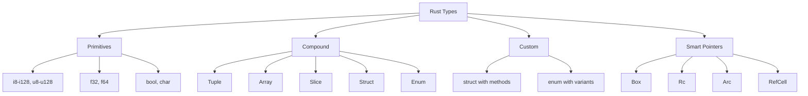

---

date: 2026-07-23T21:57:32+01:00
title: "Types and Variables | Rust - Wyatt's Notes"
description: "Study notes for Types and Variables with worked examples, practice problems, and key concepts for exam preparation."
---

<!-- Breadcrumb Schema for SEO -->
<script type="application/ld+json">
{
  "@context": "https://schema.org",
  "@type": "BreadcrumbList",
  "itemListElement": [{"name": "Home", "url": "https://wyattau.com"}, {"name": "rust", "url": "https://rust.wyattau.com"}, {"name": "01 Fundamentals", "url": "https://rust.wyattau.com/01-fundamentals"}, {"name": "Types And Variables", "url": "https://rust.wyattau.com/01-fundamentals/types-and-variables"}]
}
</script>

## Integer Types

Rust provides signed and unsigned integers at every power-of-two width from 8 to 128 bits, plus
Platform-dependent `isize` and `usize`:

| Type              | Size (bytes) | Range (signed)                                                                                              | Range (unsigned)                                         |
| ----------------- | ------------ | ----------------------------------------------------------------------------------------------------------- | -------------------------------------------------------- |
| `i8` / `u8`       | 1            | -128 to 127                                                                                                 | 0 to 255                                                 |
| `i16` / `u16`     | 2            | -32,768 to 32,767                                                                                           | 0 to 65,535                                              |
| `i32` / `u32`     | 4            | -2,147,483,648 to 2,147,483,647                                                                             | 0 to 4,294,967,295                                       |
| `i64` / `u64`     | 8            | -9,223,372,036,854,775,808 to 9,223,372,036,854,775,807                                                     | 0 to 18,446,744,073,709,551,615                          |
| `i128` / `u128`   | 16           | -170,141,183,460,469,231,731,687,303,715,884,105,728 to 170,141,183,460,469,231,731,687,303,715,884,105,727 | 0 to 340,282,366,920,938,463,463,374,607,431,768,211,455 |
| `isize` / `usize` | 4 or 8       | Pointer-sized                                                                                               | Pointer-sized                                            |

The default integer type is `i32`. This is not an arbitrary choice — on x86-64, `i32` operations are
As fast as any smaller integer width, and using `i32` avoids the implicit sign-extension or
Zero-extension overhead that `i8`/`u8` incur in many contexts.

### Integer Literals

```rust
let decimal = 1_000_000;
let hex = 0xFF_FF;
let octal = 0o777;
let binary = 0b1111_0000;
let byte = b"A";        // u8 only
```

The underscore separator is valid anywhere within a numeric literal for readability. It is ignored
By the compiler.

### Integer Overflow

In debug mode, integer overflow panics. In release mode, it wraps using two's complement arithmetic.
This is a deliberate design choice: debug builds catch bugs, release builds avoid runtime checks.

```rust
let x: u8 = 255;
let y = x + 1;  // debug: panic, release: y == 0 (wraps)
```

To explicitly control overflow behavior:

```rust
let x: u8 = 255;
let y = x.wrapping_add(1);      // 0 (wraps)
let y = x.saturating_add(1);    // 255 (clamps at max)
let y = x.checked_add(1);       // None
let y = x.overflowing_add(1);   // (0, true) — value + overflow flag
```

### Sizing and Alignment

Each type has a size and an alignment requirement. You can query these at compile time:

```rust
assert_eq!(std::mem::size_of::<u64>(), 8);
assert_eq!(std::mem::align_of::<u64>(), 8);
assert_eq!(std::mem::size_of::<u8>(), 1);
assert_eq!(std::mem::size_of::<bool>(), 1);
```

Alignment determines the memory address at which a value must be stored. A `u64` with alignment 8
Must be placed at an address divisible by 8. Misaligned access on x86-64 works but may be slower; on
ARM without unaligned access support, it traps.

## Floating-Point Types

Rust has two floating-point types conforming to IEEE 754-2008:

| Type  | Size    | Precision             | Range (approximate) |
| ----- | ------- | --------------------- | ------------------- |
| `f32` | 4 bytes | ~6-7 decimal digits   | plus/minus 3.4e38   |
| `f64` | 8 bytes | ~15-16 decimal digits | plus/minus 1.8e308  |

The default is `f64`. On modern x86-64 hardware, `f64` operations are as fast as `f32` — there is no
Performance penalty for using the larger type. Use `f32` only when you need to reduce memory
Bandwidth (e.g., GPU shaders, large arrays of floats in ML workloads).

```rust
let x = 2.0;        // f64
let y: f32 = 3.14;  // f32
```

### Floating-Point Gotchas

```rust
assert!(0.1 + 0.2 != 0.3);  // true — IEEE 754 representation error
assert!((0.1_f64 + 0.2_f64 - 0.3_f64).abs() < f64::EPSILON);
```

`f32::NAN` and `f64::NAN` exist. NaN does not compare equal to anything, including itself:

```rust
let nan = f64::NAN;
assert!(nan != nan);           // true
assert!(!nan.is_nan());        // false — use is_nan() for the check
```

:::caution
Impossible (NaN breaks reflexivity and transitivity). Use `f64::total_cmp()` (stable since 1.62) if
You need a total ordering for sorting.

```rust
let values = [f64::NAN, 1.0, 2.0, f64::INFINITY];
let mut sorted = values;
sorted.sort_by(|a, b| a.total_cmp(b));
// [1.0, 2.0, inf, NaN]
```
:::
## Boolean Type

`bool` is one byte, not one bit. This is because every byte in memory must be addressable, and a
Single-bit `bool` would require bit-packing overhead for every access.

```rust
let x: bool = true;
assert_eq!(std::mem::size_of::<bool>(), 1);
```

`bool` implements `Copy``Clone``Debug``Display`And the bitwise operators (`!``&``|` `^`) via the
`BitAnd``BitOr``BitXor``Not` traits.

## Character Type

Rust's `char` is a Unicode scalar value, not a byte and not a code point. It is always 4 bytes and
Represents any Unicode code point from U+0000 to U+10FFFF, excluding surrogate code points
(U+D800–U+DFFF).

```rust
let c: char = 'z';
let emoji: char = '🦀';
let unicode: char = '\u{1F980}';
assert_eq!(std::mem::size_of::<char>(), 4);
```

:::note
(like "é" which may be one code point U+00E9 or two code points U+0065 + U+0301) may require
Multiple `char` values. For text processing, work with `&str` slices and the `unicode-segmentation`
Crate.
:::
### `char` vs `u8`

A `u8` holds a byte value (0–255). A `char` holds a Unicode scalar value (0–1,114,111, excluding
Surrogates). Converting between them is explicit and fallible:

```rust
let byte: u8 = 97;
let c = byte as char;          // 'a' — always valid (u8 is a subset of Unicode)
assert_eq!(c, 'a');

let c: char = '€';
let byte = c as u8;            // truncates to lower 8 bits — 172 (0xAC)
// This is almost certainly not what you want for encoding purposes.
// Use .encode_utf8() instead:
let mut buf = [0u8; 4];
let encoded = c.encode_utf8(&mut buf);  // [0xE2, 0x82, 0xAC]
assert_eq!(encoded.len(), 3);  // '€' is 3 bytes in UTF-8
```

## Tuples

Tuples are fixed-size heterogeneous collections. Maximum arity is 12 (without nesting).

```rust
let tuple: (i32, f64, &str) = (1, 3.14, "hello");
let (x, y, z) = tuple;        // destructuring
assert_eq!(x, 1);
assert_eq!(tuple.0, 1);        // index access (0-based)
assert_eq!(tuple.2, "hello");
```

### Unit Tuple

`()` (the empty tuple, pronounced "unit") is Rust's void type. Functions that return nothing
Implicitly return `()`. It has size 0 and alignment 1.

```rust
assert_eq!(std::mem::size_of::<()>(), 0);
fn do_nothing() {}
fn explicit_unit() -> () {}
```

The zero-sized type (ZST) property of `()` is important for generic programming. In `Result<T, ()>`
The error variant carries no payload overhead since `()` is a ZST. Additionally, if `T` has a niche
(e.g., `Option<T>` where `None` is represented by a sentinel value), the compiler can eliminate the
Discriminant entirely through niche optimization.

### Tuple Structs

```rust
struct Point(f64, f64, f64);

let p = Point(1.0, 2.0, 3.0);
let Point(x, y, z) = p;
```

Tuple structs are named tuples. They are structurally similar to plain tuples but have a distinct
Type, which is critical for type safety — a `Point(f64, f64)` and a `Vector(f64, f64)` are different
Types even though they have the same layout.

## Arrays

Arrays are fixed-size, stack-allocated, homogeneous collections. The size is part of the type.

```rust
let arr: [i32; 5] = [1, 2, 3, 4, 5];
let zeros = [0u8; 1024];      // [expr; N] — repeat N times
let first = arr[0];            // 1
let slice: &[i32] = &arr[1..3]; // [2, 3]
```

### Array Bounds

Out-of-bounds access panics in safe Rust. The compiler inserts bounds checks at runtime. In release
Mode with `--release`Bounds checks are still present by default (they are only elided when the
Compiler can prove the index is in bounds statically).

```rust
let arr = [1, 2, 3];
// let x = arr[10];  // panic: index out of bounds
```

To access without bounds checking (when you have already verified bounds), use `get_unchecked`:

```rust
let arr = [1, 2, 3];
let idx = 1;
if idx < arr.len() {
    let x = unsafe { *arr.get_unchecked(idx) };  // no bounds check
}
```

### Array Coercion to Slices

Arrays coerce to slices (`&[T]` or `&mut [T]`). This is how most standard library APIs accept
Arrays:

```rust
fn sum(data: &[i32]) -> i32 {
    data.iter().sum()
}

let arr = [1, 2, 3];
assert_eq!(sum(&arr), 6);
```

### Const Generics and Arrays

Since Rust 1.51, arrays support const generics for the length parameter:

```rust
fn first<T, const N: usize>(arr: &[T; N]) -> Option<&T> {
    arr.first()
}

let arr = [10, 20, 30];
assert_eq!(first(&arr), Some(&10));
```

This is a significant improvement over the pre-const-generics era where you had to work with slices
And lose the compile-time size information.

## Vectors

`Vec<T>` is Rust's growable heap-allocated array. It is a triple of (pointer, length, capacity):

```
┌──────────────────────────────────────┐
│  Vec<T>                              │
│  ┌──────────┬────────┬──────────┐    │
│  │  ptr     │  len   │ capacity │    │
│  └────┼─────┴────────┴──────────┘    │
│       │                              │
│       ▼                              │
│  ┌───┬───┬───┬───┬───┬───┬───┬───┐  │
│  │ 0 │ 1 │ 2 │ 3 │   │   │   │   │  │
│  └───┴───┴───┴───┴───┴───┴───┴───┘  │
│  ←──── len ────→                     │
│  ←──────── capacity ──────────────→  │
└──────────────────────────────────────┘
```

```rust
let mut v: Vec<i32> = Vec::new();
v.push(1);
v.push(2);
v.push(3);

let v = vec![1, 2, 3];        // macro with inferred type
let v = Vec::with_capacity(100); // pre-allocate, no reallocation until 101 elements
```

### Capacity and Reallocation

When `push` would exceed capacity, the vector allocates a new buffer with `capacity * 2` (or a
Platform-specific growth factor) and copies all elements. This is amortized O(1) per push, but a
Single push can be O(n) when reallocation occurs.

```rust
let mut v = Vec::with_capacity(4);
assert_eq!(v.capacity(), 4);
for i in 0..4 {
    v.push(i);
}
assert_eq!(v.capacity(), 4);  // no reallocation
v.push(4);
assert!(v.capacity() > 4);    // reallocated
```

### Drain and Retain

```rust
let mut v = vec![1, 2, 3, 4, 5];
let drained: Vec<i32> = v.drain(1..3).collect();
// v == [1, 4, 5], drained == [2, 3]

v.retain(|&x| x > 3);
// v == [4, 5]
```

`drain` removes a range of elements and returns an iterator that yields ownership of them. `retain`
Removes elements that do not satisfy the predicate in-place.

## String vs `&str`

This is one of the most common sources of confusion for new Rust programmers. Rust has two string
Types:

| Type     | Ownership | Location                       | Size                                 | Growable |
| -------- | --------- | ------------------------------ | ------------------------------------ | -------- |
| `String` | Owned     | Heap                           | 24 bytes (ptr + len + cap on 64-bit) | Yes      |
| `&str`   | Borrowed  | Anywhere (stack, heap, static) | 16 bytes (ptr + len)                 | No       |

`String` is a `Vec<u8>` guaranteed to hold valid UTF-8. `&str` is a slice of UTF-8 bytes. Every
`String` can be dereferenced to `&str`But not vice versa.

```rust
let s: String = String::from("hello");
let slice: &str = &s;
let literal: &str = "world";  // stored in the binary's .rodata section

let mut owned = String::from("hello");
owned.push_str(" world");
owned.push('!');
// owned == "hello world!"
```

### UTF-8

Rust strings are always UTF-8. This is not configurable. If you need non-UTF-8 byte sequences, use
`Vec<u8>` or `&[u8]`.

```rust
let s = "hello";
assert_eq!(s.len(), 5);           // byte length
assert_eq!(s.chars().count(), 5); // character count (same for ASCII)

let s = "こんにちは";
assert_eq!(s.len(), 15);           // 5 chars × 3 bytes each
assert_eq!(s.chars().count(), 5);  // 5 characters
```

Indexing into a string with `s[0]` is not valid because the index is byte-based, and a byte index
May fall in the middle of a multi-byte character:

```rust
let s = "こんにちは";
// let c = s[0];     // compile error: &str cannot be indexed by usize
let bytes: &[u8] = s.as_bytes();
// bytes[0..3] is the first character 'こ'
```

### Common String Operations

```rust
let s = String::from("hello, world!");

let slice = &s[0..5];         // "hello"
let slice = &s[7..12];        // "world"

let trimmed = "  hello  ".trim();           // "hello"
let replaced = "hello".replace("l", "r");   // "herro"
let parts: Vec<&str> = "a,b,c".split(',').collect();

let mut s = String::new();
s.push_str("hello");
s.push(' ');

let combined = format!("{} {}", "hello", "world"); // "hello world"
```

### String Interning and `&'static str`

String literals are `&'static str` — they live for the entire duration of the program. They are
Embedded in the binary's read-only data section.

```rust
let s: &'static str = "hello";  // lives forever
```

For interning strings at runtime (deduplicating identical strings), use the `string_interner` or
`internment` crate.

## Type Inference

Rust's type inference is local and flow-insensitive. The compiler infers types from usage within a
Single function body but does not perform interprocedural type inference. This is a deliberate
Design choice with two concrete benefits. First, because each function body is type-checked
independently, compilation scales linearly with the number of functions rather than
Combinatorially — the compiler never needs to resolve types across function boundaries. Second,
error messages are localised to the function where the type mismatch occurs, so the compiler can
Point to the exact line rather than tracing through an interprocedural call graph.

```rust
let x = 42;            // i32 (default integer type)
let y = 3.14;          // f64 (default float type)
let v = vec![1, 2, 3]; // Vec<i32>
let s = "hello";       // &str

let x: u64 = 42;       // explicit type annotation
let y = 42u64;         // suffix annotation
let z = 42_i32;        // underscore-separated suffix
```

### Inference Limitations

Type inference does not work across function boundaries:

```rust
// This does NOT compile — the compiler cannot infer the type of `x`
// because it has no usage context at the call site:
fn make_vec() -> Vec<_> {  // ERROR: type annotations needed
    Vec::new()
}

// Fix: annotate the return type or use a turbofish
fn make_vec() -> Vec<i32> {
    vec![1, 2, 3]
}
```

### The `_` Placeholder

The underscore type placeholder tells the compiler "infer this, I don't care about the exact type":

```rust
let x: _ = 42;           // inferred as i32
let y: Vec<_> = vec![1, 2, 3]; // Vec<i32>
```

In patterns, `_` is a wildcard that discards the value:

```rust
let (x, _) = (1, 2);     // x = 1, second element discarded
let _ = expensive_call(); // call evaluated, result discarded
```

## Shadowing

Rust allows you to declare a new variable with the same name as an existing one. The new variable
Shadows the previous one. This is not mutation — the old variable still exists but is no longer
Accessible by name.

```rust
let x = 5;
let x = x + 1;       // new binding, x is now 6
let x = "hello";     // new binding, different type — x is now &str
```

Shadowing is distinct from `let mut`:

```rust
let x = 5;
let x = x + 1;       // shadowing — x is immutable, but we create a new binding

let mut y = 5;
y = y + 1;           // mutation — same binding, modified in place
```

Shadowing is useful for type transformations and for reusing a name after a value is no longer
Needed (e.g., after moving it):

```rust
let s = String::from("hello");
let s = s.len();  // s is borrowed by .len(), then the original String is dropped; the new s is a usize
```

## Mutability

Variables are immutable by default. You must explicitly opt into mutability with `let mut`:

```rust
let x = 5;
// x = 6;  // ERROR: cannot assign twice to immutable variable

let mut y = 5;
y = 6;     // OK
```

### Interior Mutability vs Variable Mutability

Variable mutability (`let mut`) controls whether you can reassign the binding. Interior mutability
(Cell, RefCell, Mutex) controls whether you can modify the value through a shared reference. These
Are orthogonal concepts.

```rust
let x = Cell::new(5);  // x is immutable
x.set(42);             // but the value inside is mutable
```

This distinction is explored in detail in the ownership and borrowing section.

### Partial Mutability with Struct Fields

You can make individual fields mutable:

```rust
struct Point {
    x: f64,
    y: f64,
}

let mut p = Point { x: 1.0, y: 2.0 };
p.x = 3.0;  // OK because p is mut

let p = Point { x: 1.0, y: 2.0 };
// p.x = 3.0;  // ERROR: p is immutable
```

There is no `let p = Point { mut x: 1.0, y: 2.0 }` syntax. Mutability is on the binding, not on the
Field.

## Constants vs Static

Rust has two ways to define global values:

### `const`

```rust
const MAX_SIZE: usize = 1024;
const PI: f64 = 3.141592653589793;
const BUFFER: [u8; 3] = [0xAA, 0xBB, 0xCC];
```

- Inlined at every use site (no address, no memory location)
- Must be evaluatable at compile time (const context)
- Can be of any type that supports const construction
- No fixed memory address — each use may be a separate copy

### `static`

```rust
static GLOBAL_COUNTER: AtomicUsize = AtomicUsize::new(0);
static GREETING: &str = "hello";
```

- Has a single memory address for the entire program
- Lives for `'static` lifetime
- Must be `Sync` (accessible from multiple threads)
- Can be mutated with interior mutability (`AtomicUsize``Mutex``OnceLock`)

```rust
use std::sync::atomic::{AtomicUsize, Ordering};

static CALL_COUNT: AtomicUsize = AtomicUsize::new(0);

fn increment() {
    CALL_COUNT.fetch_add(1, Ordering::Relaxed);
}
```

:::caution
Requires `unsafe` blocks to access. Prefer `static` with `Mutex``AtomicUsize`Or `OnceLock` Instead.
:::
## Type Aliases

Type aliases create an alias for an existing type. They do not create a new type — the alias is
Interchangeable with the original.

```rust
type Kilometers = i32;
type Thunk = Box<dyn Fn() -> i32>;

let distance: Kilometers = 42;
let x: i32 = distance;  // OK — Kilometers IS i32
```

For creating a newtype (a distinct type with the same representation), use a tuple struct:

```rust
struct Kilometers(i32);

let distance = Kilometers(42);
// let x: i32 = distance;  // ERROR — Kilometers is not i32
let x: i32 = distance.0;   // OK — explicit field access
```

## The Never Type `!`

The never type `!` represents computations that never return. It has no values and cannot be
Instantiated. It coerces to any type, which is why diverging functions can be used in expression
Context:

```rust
fn diverge() -> ! {
    panic!("this function never returns");
}

let x: i32 = {
    let y = 5;
    if y > 3 {
        10
    } else {
        diverge()  // ! coerces to i32
    }
};
```

Functions that return `!` are called "diverging functions." Common examples:

- `panic!()` — terminates the program (in non-abort mode, unwinds the stack)
- `std::process::exit()` — terminates the process immediately
- Infinite loops (`loop { ... }`) — if the loop has no break

`!` is not yet a stable type in Rust's type system (it is a compiler-internal concept), but you can
Use it in function return types. RFC 2361 tracks its stabilization.

### `!` in Match Arms

In a match expression, a diverging arm does not need to return the same type as other arms:

```rust
let x: i32 = match some_condition() {
    true => 42,
    false => panic!("cannot happen"),
    // false arm returns !, which coerces to i32
};
```

## Destructuring

Rust supports destructuring for tuples, arrays, structs, and enums:

```rust
// Tuple destructuring
let (a, b, c) = (1, 2.0, "three");

// Array destructuring
let [first, second, ..] = [1, 2, 3, 4, 5];

// Struct destructuring
struct Point { x: f64, y: f64 }
let p = Point { x: 1.0, y: 2.0 };
let Point { x, y } = p;

// Struct destructuring with rename
let Point { x: a, y: b } = p;

// Struct destructuring with ignore
let Point { x, .. } = p;

// Enum destructuring
enum Shape {
    Circle(f64),
    Rectangle { width: f64, height: f64 },
    Point,
}
let shape = Shape::Rectangle { width: 10.0, height: 20.0 };
if let Shape::Rectangle { width, height } = shape {
    println!("{} x {}", width, height);
}
```

### Destructuring in Function Parameters

```rust
fn swap((mut x, mut y): (i32, i32)) -> (i32, i32) {
    std::mem::swap(&mut x, &mut y);
    (x, y)
}
```

### Destructuring with `ref` and `ref mut`

By default, destructuring moves values. Use `ref` to borrow and `ref mut` to borrow mutably:

```rust
struct Point { x: i32, y: i32 }
let p = Point { x: 1, y: 2 };

let Point { x, y } = p;       // moves x and y out of p
// println!("{}", p.x);        // ERROR: p partially moved

let p = Point { x: 1, y: 2 };
let Point { ref x, ref y } = p; // borrows x and y
println!("{} {}", x, y);       // OK
println!("{} {}", p.x, p.y);   // OK — p is not moved
```

## Numeric Conversions

Rust does not perform implicit numeric conversions. Every conversion between numeric types is
Explicit:

```rust
let x: i32 = 42;
let y: i64 = x as i64;          // explicit cast
let z: u8 = x as u8;            // truncates (42 fits in u8)
let w: u8 = 300u16 as u8;       // 44 (300 mod 256)
```

### `as` Cast Semantics

The `as` keyword performs a bitcast/truncation without checking for overflow:

```rust
let x: i32 = -1;
let y: u32 = x as u32;          // 4294967295 (two's complement reinterpretation)
let z: i8 = 128i32 as i8;       // -128 (wraps)
```

:::caution
Float-to-integer casts saturates: NaN and out-of-range values become 0 (for unsigned) or the minimum
Value (for signed). This behavior is documented in the reference but surprises people coming from C.
:::
### Safe Conversions with `TryFrom`/`TryInto`

For fallible conversions that return `Result`:

```rust
// TryFrom and TryInto are in the prelude since Rust 1.76 — no explicit use needed
use std::convert::TryFrom;
use std::convert::TryInto;

let x: u8 = 255u32.try_into().unwrap();  // OK
let y: Result<u8, _> = 256u32.try_into(); // Err(TryFromIntError)
```

## Raw Pointers

Raw pointers (`*const T``*mut T`) exist but are restricted to `unsafe` blocks:

```rust
let x = 42;
let raw: *const i32 = &x;
let mut y = 42;
let raw_mut: *mut i32 = &mut y;

unsafe {
    println!("{}", *raw);
    *raw_mut = 43;
}
```

Raw pointers can be null, misaligned, or dangling — the compiler does not check them. They are
Necessary for FFI and for implementing safe abstractions over unsafe memory operations.

## Visibility of Primitive Types

All primitive types are in the prelude and are always in scope. You do not need to import them. The
Following is an approximate list of commonly used prelude items (see the
[standard library prelude](https://doc.rust-lang.org/std/prelude/index.html) for the authoritative
List): `Option``Result``Vec``String``Box``Drop``Clone``Copy``Deref``DerefMut`
`AsRef``AsMut``From``Into``IntoIterator``Fn``FnMut``FnOnce``Send``Sync``Unpin`
`Sized``Debug``Display``Iterator``Extend``PartialEq``PartialOrd``Eq``Ord``Hash`
`Default``ToString``println``eprintln``format``vec``drop`.

## Common Pitfalls

1. **Assuming `char` is a byte.** `char` is always 4 bytes and represents a Unicode scalar value.
   For byte-level text processing, use `u8` or `&[u8]`. For ASCII-only text, `char` works but wastes
   3 bytes per character.

2. **Using `String` when `&str` suffices.** If a function only needs to read a string, take `&str`
   as the parameter type. This allows the caller to pass both `&String` (auto-deref) and string
   literals without allocation.

3. **Integer overflow in release mode.** The compiler does not check for overflow in release builds.
   Use `wrapping_*``saturating_*``checked_*`Or `overflowing_*` methods explicitly when overflow is
   possible and wrapping is not desired.

4. **Floating-point equality.** Never use `==` to compare floats for equality. Use an epsilon
   comparison or the `approx` crate. `f32` and `f64` do not implement `Eq` precisely because of
   this.

5. **Indexing strings with byte offsets.** `s[i]` where `i` is a byte offset will panic if the index
   falls on a non-ASCII character boundary. Use `s.chars().nth(i)` for character indexing (O(n)) or
   `s.char_indices()` for byte-safe iteration.

6. **Confusing `const` and `static`.** `const` values are inlined. They have no memory address. Use
   `static` when you need a single address (e.g., for a global counter, FFI callback, or
   `LazyLock`).

7. **Shadowing vs mutation.** Shadowing creates a new binding; it does not modify the old one. If
   you need to observe the change through a reference or a closure, use `let mut` instead.

8. **`as` casts silently truncating.** `300i32 as u8` becomes 44 without any warning. Use
   `TryInto::try_into()` for fallible conversions that propagate errors.

9. **`Vec` vs array misuse.** Arrays are stack-allocated with a compile-time known size. `Vec` is
   heap-allocated with a runtime-determined size. If the size is known at compile time and small,
   prefer arrays — they avoid heap allocation and have better cache locality.

10. **Ignoring alignment.** On some platforms (notably ARM), misaligned access to multi-byte
    integers causes a hardware trap (SIGBUS). Even on x86-64, misaligned access can be significantly
    slower. Use `#[repr(C)]` or `#[repr(align(N))]` when interfacing with C or when alignment
    matters.



## Summary

This topic covers the core concepts of types and variables, including underlying theory, practical
implementation, and key applications.

**Key concepts include:**

- core concepts and terminology
- algorithms and computational thinking
- practical implementation
- security and ethical considerations
- applications in the real world

Understanding these concepts thoroughly is essential for both examinations and practical
programming, and requires both theoretical knowledge and hands-on practice.

## Worked Examples

Worked examples demonstrating the application of key concepts are covered in the detailed sub-pages
linked above.

## Intuition

Rust's type system is like a strict inventory manager. Every value has a precise type that determines what you can do with it. Fixed-size integers like i32 are like labelled boxes: the compiler knows exactly how much space they take and what operations are valid. Floating-point numbers follow IEEE 754, so you get the same behaviour across platforms. The borrow checker enforces that each piece of data has one owner, preventing the chaos of multiple pointers to the same memory. Mutability is explicit: you declare `mut` when you intend to change a value, making state changes visible at a glance.

## Cross-References

- [Control Flow and Pattern Matching](../../../../../kotlin/src/content/docs/basics/control-flow)
- [Ownership and Borrowing](../../../../../languages/src/content/docs/rust/02-ownership-borrowing/ownership)
- [Structs and Enums](../../../../../languages/src/content/docs/rust/03-structs-enums/structs-and-enums)
