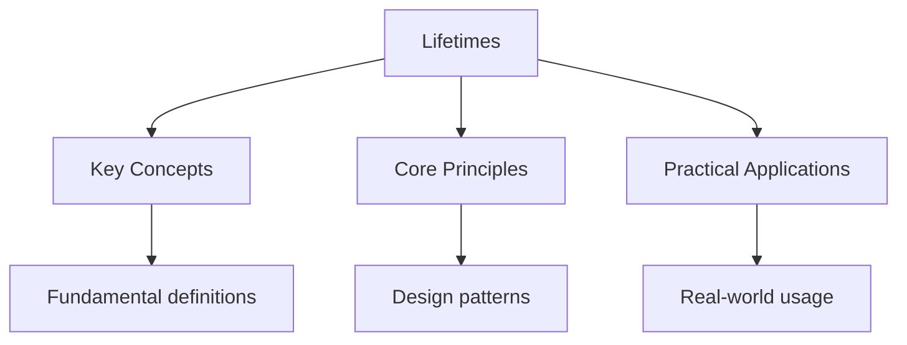

---

date: 2026-07-23T21:57:32+01:00
title: "Lifetimes | Rust - Wyatt's Notes"
description: "Rust' s borrow checker must ensure that every reference is valid for its entire use. Without lifetime Annotations, the compiler cannot prove that a reference"

---

<!-- Breadcrumb Schema for SEO -->
<script type="application/ld+json">
{
  "@context": "https://schema.org",
  "@type": "BreadcrumbList",
  "itemListElement": [{"name": "Home", "url": "https://wyattau.com"}, {"name": "rust", "url": "https://rust.wyattau.com"}, {"name": "02 Ownership Borrowing", "url": "https://rust.wyattau.com/02-ownership-borrowing"}, {"name": "Lifetimes", "url": "https://rust.wyattau.com/02-ownership-borrowing/lifetimes"}]
}
</script>




## Why Lifetimes Exist

Rust's borrow checker must ensure that every reference is valid for its entire use. Without lifetime
Annotations, the compiler cannot prove that a reference outlives the scope in which it is used. This
Prevents dangling references — references to memory that has been freed or invalidated.

Consider the canonical dangling reference attempt:

```rust
fn dangle() -> &String {
    let s = String::from("hello");
    &s
}
```

The compiler rejects this because `s` is dropped at the end of `dangle`But the function promises To
return a reference. The returned reference would point to freed memory. Lifetimes are the Mechanism
by which the compiler tracks and enforces this constraint.

Every reference in Rust has a lifetime — a region of code during which the reference is valid. In
Most cases, the compiler infers lifetimes automatically. Explicit annotations are needed when the
Relationship between input and output lifetimes is ambiguous.

## Lifetime Annotation Syntax

Lifetimes use a leading apostrophe followed by a name. By convention, `'a` is the first lifetime,
`'b` the second, and so on. The name is purely a compile-time label — it has no runtime
Representation.

```rust
fn longest<'a>(x: &'a str, y: &'a str) -> &'a str {
    if x.len() > y.len() { x } else { y }
}
```

This signature says: "there exists some lifetime `'a` such that both `x` and `y` live at least as
Long as `'a`And the returned reference also lives at least as long as `'a`." The caller chooses The
concrete lifetime, constrained by the actual lifetimes of the arguments.

```rust
let result;
let s1 = String::from("long string");
{
    let s2 = String::from("xyz");
    result = longest(s1.as_str(), s2.as_str());
    println!("longest: {}", result);
}
// result is valid here because its lifetime is bounded by s1's lifetime
```

### Multiple Lifetime Parameters

Functions can have multiple independent lifetime parameters:

```rust
fn first<'a, 'b>(x: &'a str, _y: &'b str) -> &'a str {
    x
}
```

The return type's lifetime is tied only to `'a`. The compiler does not require `'a` and `'b` to have
Any relationship — they are independent.

## Function Lifetimes

### Input Lifetime Binding

The relationship between input and output lifetimes determines how references flow through a
Function:

```rust
// Output lives as long as x
fn first_word<'a>(text: &'a str) -> &'a str {
    let end = text.find(' ').unwrap_or(text.len());
    &text[..end]
}

// Output lives as long as the shorter of x and y
fn longest<'a>(x: &'a str, y: &'a str) -> &'a str {
    if x.len() > y.len() { x } else { y }
}

// Output lives as long as x, ignoring y's lifetime
fn first<'a, 'b>(x: &'a str, _y: &'b str) -> &'a str {
    x
}
```

### Static Lifetime

`'static` means the reference lives for the entire duration of the program. All string literals have
`'static` lifetime because they are embedded in the binary:

```rust
let s: &'static str = "hello";
let s: &str = "hello";  // &'static is inferred for literals
```
