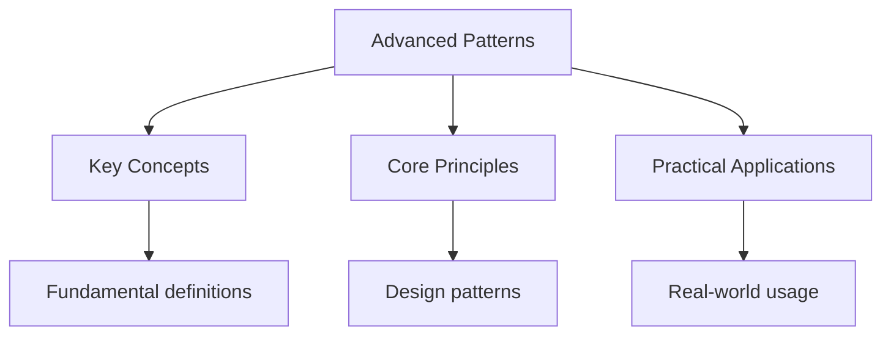

---

date: 2026-07-23T21:57:32+01:00
title: Advanced Struct and Enum Patterns
description: "Rust Advanced Struct and Enum Patterns notes covering key definitions, core concepts, worked examples, and practice questions for analytical revision."

---

<!-- Breadcrumb Schema for SEO -->
<script type="application/ld+json">
{
  "@context": "https://schema.org",
  "@type": "BreadcrumbList",
  "itemListElement": [{"name": "Home", "url": "https://wyattau.com"}, {"name": "rust", "url": "https://rust.wyattau.com"}, {"name": "03 Structs Enums", "url": "https://rust.wyattau.com/03-structs-enums"}, {"name": "Advanced Patterns", "url": "https://rust.wyattau.com/03-structs-enums/advanced-patterns"}]
}
</script>




## Newtype Pattern

The newtype pattern wraps an existing type in a tuple struct, creating a distinct type with the same
Memory representation. This provides type safety without runtime overhead — the compiler eliminates
The wrapper after optimization.

### Type Safety Through Wrapping

```rust
struct UserId(u64);
struct OrderId(u64);

fn get_user(id: UserId) -> String {
    format!("user_{}", id.0)
}

fn get_order(id: OrderId) -> String {
    format!("order_{}", id.0)
}

let uid = UserId(42);
let oid = OrderId(99);

get_user(uid);
get_order(oid);
// get_user(oid);  // ERROR: expected UserId, found OrderId
```

The newtype pattern prevents accidentally passing an `OrderId` where a `UserId` is expected. Both
Are `u64` internally, but the compiler treats them as completely different types.

### Memory Layout

Newtypes have the same size and alignment as the wrapped type:

```rust
struct Millimeters(u32);
struct Meters(u32);

assert_eq!(std::mem::size_of::<Millimeters>(), 4);
assert_eq!(std::mem::size_of::<Meters>(), 4);
assert_eq!(std::mem::align_of::<Millimeters>(), 4);
```

### `impl Deref` for Transparent Access

Implementing `Deref` and `DerefMut` allows the newtype to behave like the wrapped type for method
Calls and deref coercion:

```rust
use std::ops::Deref;

struct Wrapper(Vec<String>);

impl Deref for Wrapper {
    type Target = Vec<String>;
    fn deref(&self) -> &Self::Target {
        &self.0
    }
}

let w = Wrapper(vec![String::from("hello")]);
let len = w.len();  // calls Vec::len through deref coercion
assert_eq!(len, 1);
```

:::caution
`Deref`Callers can use the newtype as if it were the inner type, potentially defeating the purpose
Of the wrapper. Only implement `Deref` when you intentionally want this behavior.

### Unit Conversion with Newtypes

```rust
struct Millimeters(u32);
struct Meters(u32);

impl Meters {
    fn to_millimeters(&self) -> Millimeters {
        Millimeters(self.0 * 1000)
    }
}

impl Millimeters {
    fn to_meters(self) -> Meters {
        Meters(self.0 / 1000)
    }
}

let distance = Meters(5);
let mm = distance.to_millimeters();
assert_eq!(mm.0, 5000);
```

### `#[repr(transparent)]`

The `transparent` representation guarantees that the newtype has the same layout as the inner type.
This is important for FFI:

```rust
#[repr(transparent)]
struct NonZeroU32(u32);

impl NonZeroU32 {
    fn new(value: u32) -> Option<Self> {
        if value != 0 {
            Some(NonZeroU32(value))
        } else {
            None
        }
    }

    fn get(&self) -> u32 {
        self.0
    }
}
```

## Builder Pattern

The builder pattern constructs complex objects step by step, enforcing required fields at compile
Time when using the typestate pattern.

### Basic Builder

```rust
struct HttpRequest {
    method: String,
    url: String,
    headers: Vec<(String, String)>,
    body: Option<String>,
    timeout_ms: u64,
}

struct HttpRequestBuilder {
    method: String,
    url: Option<String>,
    headers: Vec<(String, String)>,
    body: Option<String>,
    timeout_ms: u64,
}

impl HttpRequestBuilder {
    fn new(method: &str) -> Self {
        HttpRequestBuilder {
            method: method.to_string(),
            url: None,
            headers: vec![],
            body: None,
            timeout_ms: 30_000,
        }
    }

    fn url(mut self, url: &str) -> Self {
        self.url = Some(url.to_string());
        self
    }

    fn header(mut self, key: &str, value: &str) -> Self {
        self.headers.push((key.to_string(), value.to_string()));
        self
    }

    fn body(mut self, body: &str) -> Self {
        self.body = Some(body.to_string());
        self
    }

    fn timeout(mut self, ms: u64) -> Self {
        self.timeout_ms = ms;
        self
    }

    fn build(self) -> Result<HttpRequest, String> {
        let url = self.url.ok_or("url is required")?;
        Ok(HttpRequest {
            method: self.method,
            url,
            headers: self.headers,
            body: self.body,
            timeout_ms: self.timeout_ms,
        })
    }
}

let request = HttpRequestBuilder::new("GET")
    .url("https://example.com/api")
    .header("Content-Type", "application/json")
    .header("Authorization", "Bearer token")
    .timeout(5000)
    .build()?;
```

### Typed Builder with `derive_builder`

```toml
[dependencies]
derive_builder = "0.20"
```

```rust
use derive_builder::Builder;

#[derive(Builder)]
struct Config {
    #[builder(default = "8080")]
    port: u16,

    #[builder(default = r#"String::from("localhost")"#)]
    host: String,

    #[builder(setter(into), default = "4")]
    workers: usize,

    database_url: String,
}

let config = ConfigBuilder::default()
    .database_url("postgres://localhost/mydb")
    .port(3000)
    .build()?;
```

## Typestate Pattern

The typestate pattern encodes state machines in the type system. Each state is a different type, and
State transitions are represented as methods that consume the current state and return the next
State. Invalid transitions are compile errors.

### State Machine Example

```rust
struct Unconfigured;
struct Configured { host: String, port: u16 }
struct Connected { host: String, port: u16, stream: std::net::TcpStream }
struct Authenticated { host: String, port: u16, stream: std::net::TcpStream, token: String }

struct Client<State> {
    state: State,
}

impl Client<Unconfigured> {
    fn new() -> Self {
        Client { state: Unconfigured }
    }

    fn configure(self, host: &str, port: u16) -> Client<Configured> {
        Client {
            state: Configured {
                host: host.to_string(),
                port,
            },
        }
    }
}

impl Client<Configured> {
    fn connect(self) -> Result<Client<Connected>, std::io::Error> {
        let stream = std::net::TcpStream::connect((self.state.host.as_str(), self.state.port))?;
        Ok(Client {
            state: Connected {
                host: self.state.host,
                port: self.state.port,
                stream,
            },
        })
    }
}

impl Client<Connected> {
    fn authenticate(self, username: &str, password: &str) -> Result<Client<Authenticated>, String> {
        let token = format!("token_for_{}", username);
        Ok(Client {
            state: Authenticated {
                host: self.state.host,
                port: self.state.port,
                stream: self.state.stream,
                token,
            },
        })
    }
}

impl Client<Authenticated> {
    fn send_request(&self, path: &str) -> String {
        format!("GET {} HTTP/1.1\nAuthorization: Bearer {}\nHost: {}\n",
            path, self.state.token, self.state.host)
    }
}

let client = Client::new()
    .configure("example.com", 443)
    .connect()?
    .authenticate("admin", "secret")?;

let request = client.send_request("/api/data");
```

The type system prevents calling `send_request` before `authenticate`Or `authenticate` before
`connect`. Each method consumes `self` and returns a new state, making the state transition
Irreversible and type-safe.

### Compile-Time Enforcement

Attempting an invalid transition is a compile error:

```rust
let client = Client::new();
// client.send_request("/api");  // ERROR: method not found on Client<Unconfigured>
// client.authenticate("a", "b");  // ERROR: method not found on Client<Unconfigured>
```

## Enum Dispatch

Enum dispatch uses enums to implement polymorphism without trait objects, providing static dispatch
And better performance:

```rust
enum Shape {
    Circle { radius: f64 },
    Rectangle { width: f64, height: f64 },
    Triangle { base: f64, height: f64 },
}

impl Shape {
    fn area(&self) -> f64 {
        match self {
            Shape::Circle { radius } => std::f64::consts::PI * radius * radius,
            Shape::Rectangle { width, height } => width * height,
            Shape::Triangle { base, height } => 0.5 * base * height,
        }
    }
}
```

### Enum Dispatch vs Trait Objects

| Property           | Enum Dispatch               | Trait Objects (`dyn Trait`)  |
| ------------------ | --------------------------- | ---------------------------- |
| Dispatch mechanism | Static (branch table)       | Dynamic (vtable indirection) |
| Binary size        | One copy per variant        | Shared vtable                |
| Extensibility      | Closed (all variants known) | Open (any implementor)       |
| Performance        | Predictable, inlinable      | Indirect call, not inlinable |
| Type information   | Full at compile time        | Erased at runtime            |

### When to Use Each

Use **enum dispatch** when:

- The set of variants is known and closed
- Performance is critical (hot paths, game loops)
- You need to match on specific variants

Use **trait objects** when:

- The set of types is open (plugins, user-defined types)
- You need heterogeneous collections
- Binary size is more important than peak performance

## Zero-Sized Types (ZSTs)

Zero-sized types occupy no memory at runtime. They are useful as marker types, phantom types, and
For compile-time programming.

### Unit Structs

```rust
struct Marker;
struct Benchmark;

assert_eq!(std::mem::size_of::<Marker>(), 0);
assert_eq!(std::mem::size_of::<Benchmark>(), 0);
```

### PhantomData

`PhantomData<T>` is a zero-sized type that makes the compiler behave as if the struct contains a
`T`Even though it does not. This is useful for variance and drop check annotations:

```rust
use std::marker::PhantomData;

struct Id<T> {
    value: u64,
    _marker: PhantomData<T>,
}

let id: Id<String> = Id { value: 42, _marker: PhantomData };
let id2: Id<Vec<u8>> = Id { value: 43, _marker: PhantomData };

assert_eq!(std::mem::size_of::<Id<String>>(), 8);
assert_eq!(std::mem::size_of::<Id<Vec<u8>>>(), 8);
```

`PhantomData<T>` affects variance: `Id<T>` is covariant in `T` because `PhantomData<T>` is covariant
In `T`.

### ZST in Generics

ZSTs enable powerful generic programming patterns. A `Vec<()>` has zero per-element storage cost:

```rust
let v: Vec<()> = vec![(); 1_000_000];
assert_eq!(v.len(), 1_000_000);
// v occupies only the Vec metadata (24 bytes), no element storage
```

### `()` as a Default Type

The unit type `()` is a ZST and is used as a default or placeholder type:

```rust
fn process<T>(_: T) -> T {
    unimplemented!()
}

let result = process(());  // T = (), zero overhead
```

## Struct Update Syntax

Create a new struct from an existing one, overriding specific fields:

```rust
struct Point {
    x: f64,
    y: f64,
    z: f64,
}

let p1 = Point { x: 1.0, y: 2.0, z: 3.0 };
let p2 = Point { y: 5.0, ..p1 };
// p2.x == 1.0, p2.y == 5.0, p2.z == 3.0
```

Struct update syntax moves the remaining fields. After `..p1``p1` is partially moved:

```rust
let p1 = Point { x: 1.0, y: 2.0, z: 3.0 };
let p2 = Point { y: 5.0, ..p1 };
// println!("{:?}", p1);  // ERROR: p1 partially moved
println!("{}", p1.x);  // ERROR: x was moved into p2
```
:::