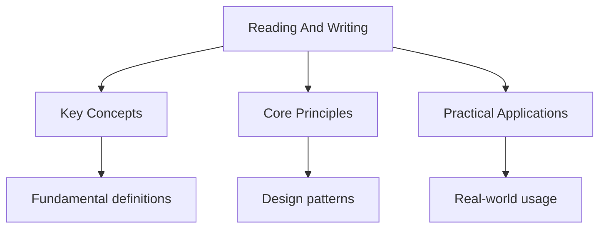

---

title: "Reading and Writing | SAT - Wyatt's Notes"
date: 2026-05-30
description: "Comprehensive study notes for Reading and Writing with worked examples, practice problems, and key concepts for exam preparation."
tags:
  - sat
  - reading
  - writing
categories:
  - sat

---

<!-- Breadcrumb Schema for SEO -->

## Section Overview

The Reading & Writing section of the digital SAT consists of **54 questions** across **64 minutes**,
split into two adaptive modules of 27 questions each (32 minutes per module). All questions are
multiple-choice with four answer options.

Questions are organised by passage -- each passage (or pair of passages) is accompanied by a set of
questions that test a range of skills. Unlike the paper-based SAT, the digital version presents
shorter passages (in most cases 25-150 words) with a single question per passage (or occasionally
two).

### Content Domains

| Domain                           | Approximate Weight | Question Count |
| -------------------------------- | ------------------ | -------------- |
| **Information and Ideas**        | ~26%               | 12-14          |
| **Craft and Structure**          | ~28%               | 13-15          |
| **Standard English Conventions** | ~26%               | 12-14          |
| **Expression of Ideas**          | ~20%               | 11-13          |

---

<!-- Breadcrumb Schema for SEO -->

## Reading

### Passage Types

The digital SAT draws passages from the following categories:

- **Literature** -- Fiction passages from novels, short stories, or plays (US and world literature).
- **History/Social Studies** -- Founding documents, historical texts, social science research.
- **Science** -- Earth science, biology, chemistry, physics, and other natural science topics.

Passages range from approximately 25 to 150 words. Each passage is followed by one question (rarely
two). Some questions reference paired passages or supplementary materials (tables, graphs).

### Question Types

#### Command of Evidence

These questions ask you to identify the portion of the text that best supports a claim, or to
determine how a claim is supported by specific evidence.

**Strategy:**

1. Read the question stem first to identify what evidence you need.
2. Scan the passage for the specific line or detail referenced.
3. Eliminate answer choices that cite irrelevant text or misrepresent the passage"s meaning.
4. The correct answer will be directly supported by the text -- avoid answers that require
   assumptions or outside knowledge.

> **Key principle:** The correct answer must be both _true_ according to the passage and
> _responsive_ to the specific question asked. Many wrong answers are true statements that do not
> answer the question.

#### Words in Context

These questions test whether you understand the meaning of a word or phrase _as it is used in the
passage_, not its most common dictionary definition.

**Strategy:**

1. Read the surrounding sentence carefully to determine the context.
2. Substitute each answer choice into the sentence and ask: does this make sense?
3. Eliminate words that are too broad, too narrow, or have the wrong connotation.
4. The correct answer must maintain the logical flow and meaning of the passage.

> **Key principle:** Many answer choices will be valid definitions of the word, but only one will be
> the correct meaning _in context_. Pay attention to connotation (positive/negative tone) and part
> of speech.

#### Standard English Conventions

These questions test grammar, punctuation, and sentence structure.

**Strategy:**

1. Identify the grammatical concept being tested (subject-verb agreement, pronoun consistency,
   parallel structure, etc.).
2. Read the full sentence, not just the underlined portion, to identify errors.
3. For punctuation questions, consider how each choice affects the sentence structure (independent
   vs. dependent clauses).
4. Eliminate choices that introduce new grammatical errors.

#### Expression of Ideas

These questions focus on logical organisation, clarity, and effectiveness of writing.

**Strategy:**

1. Determine what the question is asking about -- transitions, sentence placement, relevance, or
   conciseness.
2. For transition questions, identify the logical relationship between the sentences (contrast,
   continuation, cause/effect, emphasis).
3. For placement questions, consider how the sentence connects to the surrounding context.
4. Eliminate choices that weaken the argument, introduce irrelevant details, or create logical gaps.

#### Text Structure and Purpose

These questions ask about the overall purpose, structure, or rhetorical strategy of a passage.

**Strategy:**

1. Identify the author's primary purpose (to inform, persuade, narrate, or analyse).
2. Consider how the passage is organised -- chronological, cause-and-effect, problem-solution,
   compare-contrast.
3. Look for structural signals: transitional phrases, paragraph breaks, shifts in tone or focus.
4. Eliminate answers that describe a purpose or structure not supported by the passage.

#### Paired Passages

Some questions reference two related passages. You may be asked to compare the authors'
perspectives, identify a shared theme, or determine how one passage relates to the other.

**Strategy:**

1. Read both passages carefully, noting each author's main argument, tone, and evidence.
2. Identify points of agreement and disagreement.
3. For comparison questions, look for specific textual evidence in both passages.
4. Eliminate answers that overstate the similarity or difference between the passages.

---

<!-- Breadcrumb Schema for SEO -->

## Writing

### Grammar and Punctuation

The digital SAT tests grammar through passage-based questions rather than isolated sentences.

#### Core Grammar Rules

**Subject-Verb Agreement:**

- A singular subject takes a singular verb; a plural subject takes a plural verb.
- Watch for prepositional phrases between the subject and verb (they do not affect agreement).
  - Correct: "The _collection of paintings_ **is** on display."
  - Incorrect: "The collection of paintings _are_ on display."

**Pronoun-Antecedent Agreement:**

- Pronouns must agree in number and person with their antecedents.
  - Correct: "Each student must submit _his or her_ assignment."
  - Watch for ambiguous antecedents -- the pronoun should evidently refer to a specific noun.

**Parallel Structure:**

- Items in a list or comparison must have the same grammatical form.
  - Correct: "She enjoys _reading_, _writing_, and _swimming_."
  - Incorrect: "She enjoys reading, to write, and swimming."

**Verb Tense Consistency:**

- Maintain consistent verb tense within a passage unless there is a clear reason to shift.
- Watch for perfect vs. simple tense (has written vs. wrote) -- they convey different meanings.

#### Punctuation Rules

**Commas:**

- Separate independent clauses joined by a coordinating conjunction (FANBOYS: for, and, nor, but,
  or, yet, so).
- Set off introductory elements, non-essential clauses, and items in a series.
- Do not use commas to separate independent clauses without a conjunction (this creates a comma
  splice).

**Semicolons:**

- Join two closely related independent clauses without a conjunction.
  - Correct: "The experiment failed; the hypothesis was flawed."
- Separate items in a complex list (where items themselves contain commas).

**Colons:**

- Introduce a list, explanation, or quotation after an independent clause.
  - Correct: "There are three stages: planning, execution, and review."
- Do not use a colon after a verb or preposition that by definition introduces a list.

**Dashes:**

- Em dashes set off parenthetical information or emphasise a point.
  - Correct: "The result -- surprising to everyone -- confirmed the theory."
- Em dashes can replace commas or parentheses for added emphasis.

**Apostrophes:**

- Use for contractions and to show possession.
  - "The students' results" (plural possessive) vs. "The student's result" (singular possessive).
- Do not use apostrophes for plurals of non-possessive nouns.

### Transitions and Logical Structure

Transition words signal the logical relationship between ideas. Common categories:

| Relationship | Transitions                                          |
| ------------ | ---------------------------------------------------- |
| Addition     | furthermore, moreover, additionally, also            |
| Contrast     | however, nevertheless, on the other hand, conversely |
| Cause/Effect | therefore, consequently, as a result, thus           |
| Emphasis     | indeed, in fact, notably, significantly              |
| Sequence     | first, subsequently, finally, meanwhile              |
| Example      | for instance, specifically, such as                  |

**Strategy for transition questions:**

1. Read the sentence before and after the transition to identify the logical relationship.
2. If the second sentence continues or expands on the first, use an additive transition.
3. If the second sentence contradicts or qualifies the first, use a contrastive transition.
4. If the second sentence provides a result or implication, use a causal transition.

---

<!-- Breadcrumb Schema for SEO -->

## Key Skills

### Evidence-Based Reasoning

Every answer on the Reading & Writing section must be supported by evidence in the passage. This is
the foundational skill:

1. **Locate** the relevant portion of the text.
2. **Interpret** what the text actually says (not what you think it should say).
3. **Match** the textual evidence to the correct answer choice.

Avoid answers that:

- Are plausible but not stated or implied in the passage.
- Require outside knowledge.
- Misrepresent the author's tone or intent.

### Vocabulary in Context

The SAT tests vocabulary through context, not rote memorisation. Key strategies:

1. **Read around the word.** The surrounding sentence and paragraph provide clues to meaning.
2. **Consider connotation.** Is the word used positively, negatively, or neutrally?
3. **Substitute and verify.** Replace the word with each answer choice and check for logical
   consistency.
4. **Watch for unusual usages.** Common words are sometimes used in less common ways.

### Main Idea and Primary Purpose

Identifying the main idea requires distinguishing between:

- **Thesis** -- The author's central claim or argument.
- **Topic** -- The general subject matter (broader than the thesis).
- **Detail** -- A specific piece of evidence or supporting point.

**Strategy:**

1. Ask: "What is the author trying to convince me of?" The answer is the thesis.
2. Ask: "What is this passage about?" The answer is the topic.
3. The main idea is in most cases stated in the first or last sentence of the passage.
4. Avoid answer choices that are too broad (beyond the scope of the passage) or too narrow (focusing
   on a single detail).

### Rhetorical Analysis

The SAT tests your ability to identify rhetorical strategies:

| Strategy                | Purpose                         | Example Signal                         |
| ----------------------- | ------------------------------- | -------------------------------------- |
| **Analogy**             | Clarify a concept by comparison | "like," "similar to," "just as"        |
| **Appeal to emotion**   | Persuade through feeling        | Vivid imagery, emotional language      |
| **Appeal to logic**     | Persuade through reason         | Statistics, logical arguments          |
| **Appeal to authority** | Persuade through expertise      | Citations, expert testimony            |
| **Repetition**          | Emphasise a point               | Repeated words or phrases              |
| **Contrast**            | Highlight differences           | "whereas," "unlike," "on the contrary" |

---

<!-- Breadcrumb Schema for SEO -->

## Common Pitfalls

1. **Choosing answers that are true but irrelevant.** Many wrong answer choices state facts that are
   not supported by the passage or that fail to answer the specific question asked. Always verify
   that the answer is both true _and_ responsive.

2. **Ignoring context for Words in Context questions.** Do not rely on dictionary definitions alone.
   The SAT deliberately uses common words in uncommon ways. Always read the surrounding sentence.

3. **Over-relying on outside knowledge.** The SAT tests your ability to reason from the passage, not
   your prior knowledge of the topic. An answer that contradicts the passage is wrong, even if it is
   factually correct.

4. **Failing to read the full sentence for grammar questions.** Many grammar errors become apparent
   only when you read the complete sentence, including clauses before and after the underlined
   portion.

5. **Misidentifying the logical relationship for transition questions.** Before choosing a
   transition word, read both the preceding and following sentences. Many students focus only on the
   sentence containing the blank.

6. **Spending too much time on difficult questions.** On an adaptive test, time management is
   critical. If a question is taking more than 90 seconds, flag it and move on. You can return to it
   at the end of the module.

7. **Not using the digital tools.** The Bluebook app includes features like highlighting and an
   answer eliminator. Use them strategically to manage time and reduce errors.

---

<!-- Breadcrumb Schema for SEO -->

## Summary

The Reading & Writing section tests four core domains: Information and Ideas, Craft and Structure,
Standard English Conventions, and Expression of Ideas. Success depends on:

- Reading passages carefully and identifying the author's purpose, structure, and evidence.
- Understanding vocabulary and grammar in context, not through rote memorisation.
- Applying evidence-based reasoning to every answer choice.
- Managing time effectively across 54 questions in 64 minutes.

The key to a high Reading & Writing score is disciplined, passage-based reasoning: every correct
answer is grounded in the text.

## Cross-References

- [Mathematics](mathematics) -- Numerical reasoning and data interpretation skills overlap with the Problem Solving domain here.
- [Comprehension](reading/comprehension) -- Detailed strategies for command of evidence and main idea questions extend the overview here.
- [Grammar](reading/grammar) -- Comprehensive coverage of standard English conventions builds on the writing rules outlined here.
- [Essay](writing/essay) -- Essay writing strategies apply the analytical and organisational skills tested in Expression of Ideas.

## Intuition

SAT Reading and Writing tests your ability to understand, analyze, and communicate ideas evidently. Reading is not about speed but about precision: you must identify the author's purpose, tone, and argument structure. Writing questions test whether you can improve clarity and correctness, like an editor who cuts unnecessary words and fixes grammatical errors. The best approach is to read actively, asking yourself "what is the author trying to say?" rather than passively absorbing words.

## Worked Examples

Worked examples demonstrating the application of key concepts are covered in the detailed sub-pages
linked above.
