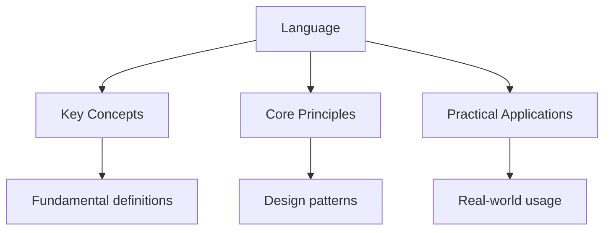

---

date: 2026-07-23T21:57:32+01:00
title: "Language | SAT - Wyatt's Notes"
description: "\"itemListElement\": [{\"name\": \"Home\", \"url\": \"https://wyattau.com\"}, {\"name\": \"sat\", \"url\": \"https://sat.wyattau.com\"}, {\"name\": \"Writing\", \"url\":"
---

<!-- Breadcrumb Schema for SEO -->

## Language

SAT writing study notes - Language

## Key Concepts

- **Subject-Verb Agreement**: the verb must agree with the true subject. Ignore prepositional phrases between subject and verb.
- **Pronoun Clarity**: every pronoun must evidently refer to one antecedent. Avoid ambiguous references.
- **Parallel Structure**: items in a list or comparison must have the same grammatical form — all gerunds, all infinitives, or all clauses.
- **Conciseness**: eliminate redundant words and phrases. "Due to the fact that" → "because."
- **Transition Words**: use appropriate transitions to show relationships — cause/effect, contrast, addition, sequence.
- **Modifier Placement**: modifiers must be next to the word they modify. Dangling modifiers create confusion.
- **Comma Rules**: use commas after introductory elements, between items in a list, and before coordinating conjunctions joining independent clauses.

## Key Rules

| Rule | Incorrect | Correct |
| ------ | ----------- | --------- |
| Subject-verb agreement | "The group of students **were** late" | "The group of students **was** late" |
| Parallel structure | "She likes **swimming, to run, and cycling**" | "She likes **swimming, running, and cycling**" |
| Modifier placement | "**Walking to school**, the rain started" | "**Walking to school**, I noticed the rain started" |
| Conciseness | "Due to the fact that" | "Because" |
| Comma splice | "It was late**,** we went home" | "It was late**;** we went home" |

## Worked Examples

### Example 1: Parallel Structure

**Problem:** "She likes swimming, to run, and cycling." Is this sentence correct?

**Solution:**
Step 1: The list items have different forms: gerund (swimming), infinitive (to run), gerund (cycling)
Step 2: Parallel structure requires the same form for all items
Step 3: Correct: "She likes swimming, running, and cycling" (all gerunds)

---

<!-- Breadcrumb Schema for SEO -->

### Example 2: Subject-Verb Agreement

**Problem:** "The collection of rare stamps **were** recently sold." Fix the error.

**Solution:**
Step 1: The true subject is "collection" (singular), not "stamps"
Step 2: "of rare stamps" is a prepositional phrase — ignore it for agreement
Step 3: Correct: "The collection of rare stamps **was** recently sold"

**Key insight:** Prepositional phrases between subject and verb are the SAT's favourite trap. Find the true subject first.

---

<!-- Breadcrumb Schema for SEO -->

### Example 3: Dangling Modifier

**Problem:** "After reviewing the data, the conclusion was obvious." Is this correct?

**Solution:**
Step 1: "After reviewing the data" is a participial phrase
Step 2: It must modify the subject of the main clause — but "the conclusion" did not review the data
Step 3: Correct: "After reviewing the data, **the researchers found** the conclusion obvious"

**Key insight:** A dangling modifier has no logical subject in the main clause. Add the missing subject.

---

<!-- Breadcrumb Schema for SEO -->

## Intuition

Language conventions are the traffic rules of writing — they keep communication flowing smoothly. Punctuation marks are the traffic signals: commas separate ideas, semicolons connect related ones, colons introduce what follows. Sentence structure is the road layout — simple sentences are straight roads, complex sentences have on-ramps and exits. The SAT tests whether you can navigate these rules without crashing. The key insight is that good writing is not about fancy words — it is about clear connections between ideas, where every sentence does work and every word earns its place.

## Common Mistakes

**Run-on sentences and fused sentences.** A run-on sentence occurs when two independent clauses are joined without proper punctuation or a conjunction. A fused sentence is two independent clauses with no punctuation at all. Fix these by adding a period, semicolon, or comma with a coordinating conjunction between the clauses.

**Incorrect pronoun-antecedent agreement.** Pronouns must agree with their antecedents in number and gender. When the antecedent is singular and gender-neutral, use "he or she" or restructure the sentence to avoid the pronoun. Do not use "they" as a singular pronoun on the SAT, and ensure pronoun references are unambiguous.

**Faulty parallel structure.** Items in a list or comparison must have the same grammatical form. For example, "She likes swimming, to run, and cycling" is not parallel; correct it to "She likes swimming, running, and cycling." Parallel structure applies to infinitives, gerunds, clauses, and any coordinated elements.

## Cross-References

- [Grammar](../reading/grammar) -- The language section tests grammar rules including subject-verb agreement, pronoun clarity, and punctuation.
- [Essay](./essay) -- Editing and revising skills transfer directly to constructing well-organised evidence-based essays.
- [Comprehension](../reading/comprehension) -- Understanding passage meaning is essential for making effective rhetorical revisions.
