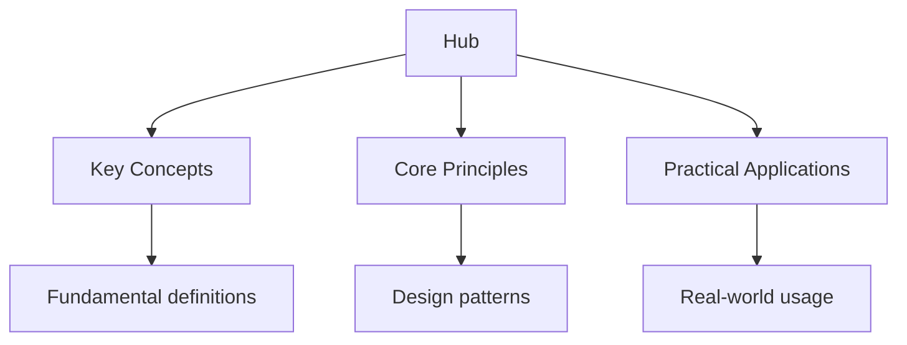

## Why This Guide Exists

Swift is Apple's programming language for iOS, macOS, watchOS, and tvOS development. It combines the safety of a modern type system with the performance of a compiled language. Swift's optionals eliminate null reference errors, its value types prevent unintended mutation, and its protocol-oriented design enables flexible, composable code. SwiftUI, Apple's declarative UI framework, leverages Swift's language features to make building user interfaces intuitive and productive.

This hub page maps every resource on this site. The learning path takes you from Swift's core language features through SwiftUI, iOS development, and advanced patterns, building a thorough understanding of how to build production-quality Apple platform applications.

## Table of Contents

- [Language Fundamentals](#language-fundamentals)
- [Optionals and Error Handling](#optionals-and-error-handling)
- [Protocol-Oriented Programming](#protocol-oriented-programming)
- [SwiftUI](#swiftui)
- [iOS Development](#ios-development)
- [Concurrency](#concurrency)
- [Learning Path](#learning-path)
- [Cross-Site Resources](#cross-site-resources)
- [FAQ](#faq)

---

## Language Fundamentals

Swift's fundamentals are designed for safety and clarity. The type system catches errors at compile time, optionals prevent null references, and value types prevent unintended mutation. Understanding these concepts is the foundation for all Swift programming.

### Topic Notes

- [Variables and Types](02-fundamentals/01-variables-and-types) — let vs var, type inference, and basic types
- [Strings and Characters](02-fundamentals/02-strings-and-characters) — string interpolation, multi-line strings, and Unicode
- [Collections](02-fundamentals/03-collections) — Array, Set, Dictionary, and their mutability
- [Control Flow](02-fundamentals/04-control-flow) — if/else, switch, for/while, and where clauses
- [Functions and Closures](02-fundamentals/05-functions-and-closures) — parameters, return types, trailing closures, and capture lists

### Key Concepts

**let vs var** — `let` declares an immutable constant. `var` declares a mutable variable. Prefer `let` whenever possible — it communicates intent, prevents accidental modification, and enables compiler optimization. Immutable values are easier to reason about and test.

**Value types** — Structs, enums, and tuples are value types. Assigning a value type creates a copy. Classes are reference types — assigning a class creates a shared reference. Value types prevent unintended mutation and are the preferred design choice in Swift.

**Trailing closures** — When the last argument to a function is a closure, you can write it outside the parentheses. `array.map { $0 * 2 }` is equivalent to `array.map({ $0 * 2 })`. Trailing closures make Swift code more readable.

---

## Optionals and Error Handling

Optionals are Swift's most distinctive feature. An optional type (`Type?`) can hold either a value or nil. The compiler forces you to handle the nil case before using the value. This eliminates null reference errors at compile time.

### Topic Notes

- [Optionals](03-optionals/01-optionals) — nil, optional binding, and force unwrapping
- [Optional Chaining](03-optionals/02-optional-chaining) — ?. operator and nil coalescing ??
- [Error Handling](03-optionals/03-error-handling) — throws, try/catch, and Result type
- [Guard Statements](03-optionals/04-guard-statements) — early returns and unwrapping

### Key Concepts

**Optional binding** — `if let name = optionalName { print(name) }` unwraps the optional and binds the value to a constant. `guard let name = optionalName else { return }` unwraps and requires an early return. Optional binding is the safe way to use optionals.

**Optional chaining** — `user?.profile?.name` chains optional access. If any part is nil, the entire chain returns nil. This eliminates nested nil checks.

**Guard statements** — `guard let value = optional else { return }` unwraps an optional and requires an early exit on failure. Guard is preferred over if-let when you need to unwrap and continue — it reduces nesting and improves readability.

---

## Protocol-Oriented Programming

Swift's protocol-oriented design is a distinctive feature. Protocols define capabilities. Protocol extensions provide default implementations. This enables flexible, composable designs without the complexity of class inheritance.

### Topic Notes

- [Protocol Basics](04-protocols/01-protocol-basics) — defining protocols, conforming to protocols
- [Protocol Extensions](04-protocols/02-protocol-extensions) — default implementations and protocol-oriented design
- [Protocol Inheritance](04-protocols/03-protocol-inheritance) — composing protocols and protocol hierarchies
- [Associated Types](04-protocols/04-associated-types) — generic protocols and type constraints

### Key Concepts

**Protocol extensions** provide default implementations for protocol methods. A type can conform to a protocol and automatically inherit the default implementation. This enables code reuse without inheritance.

**Protocol composition** — `func process<T: Codable & Identifiable>(_ item: T)` requires T to conform to multiple protocols. Protocols compose naturally, enabling flexible type constraints.

**Associated types** — A protocol can declare an associated type: `protocol Container { associatedtype Item; mutating func append(_ item: Item) }`. The conforming type specifies the concrete type. Associated types enable generic protocols.

---

## SwiftUI

SwiftUI is Apple's declarative UI framework for building user interfaces across all Apple platforms. It uses Swift's language features — property wrappers, result builders, and protocol extensions — to make UI code concise and expressive.

### Topic Notes

- [SwiftUI Basics](05-swiftui/01-swiftui-basics) — Text, Image, VStack, HStack, and the view hierarchy
- [State Management](05-swiftui/02-state-management) — @State, @Binding, @ObservedObject, @EnvironmentObject
- [Navigation](05-swiftui/03-navigation) — NavigationStack, NavigationLink, and sheet presentation
- [Lists and Data](05-swiftui/04-lists-and-data) — List, ForEach, and data flow patterns
- [Animations](05-swiftui/05-animations) — withAnimation, transition, and matchedGeometryEffect

### Key Concepts

**Declarative UI** — You describe what the UI should look like for a given state. SwiftUI handles the diffing and rendering. When state changes, SwiftUI automatically updates the affected views. This eliminates manual UI updates.

**@State and @Binding** — `@State` is a property wrapper that manages view-local state. `@Binding` creates a two-way reference to a parent's state. When @State changes, the view rebuilds. This is the foundation of SwiftUI's data flow.

**@Observable** (Swift 5.9+) — The modern approach to observable objects. Apply @Observable to a class, and SwiftUI tracks which properties views actually read. This is more efficient than ObservableObject and eliminates the need for @Published.

---

## iOS Development

Building iOS applications requires understanding the app lifecycle, data persistence, networking, and platform-specific APIs. SwiftUI and UIKit provide the UI layer, while Foundation provides the core APIs.

### Topic Notes

- [App Lifecycle](06-ios/01-app-lifecycle) — @main, App protocol, and scene lifecycle
- [Data Persistence](06-ios/02-data-persistence) — UserDefaults, SwiftData, and Core Data
- [Networking](06-ios/03-networking) — URLSession, async/await, and Codable
- [Notifications](06-ios/04-notifications) — local and remote notifications
- [App Store](06-ios/05-app-store) — submission, review, and distribution

### Key Concepts

**SwiftData** is Apple's modern persistence framework, replacing Core Data. Define models with @Model macro. SwiftData handles persistence, queries, and migration automatically. It integrates seamlessly with SwiftUI.

**Codable** is a protocol for encoding and decoding JSON, Property Lists, and other formats. Define a struct conforming to Codable, and the compiler generates the encoding/decoding logic automatically. Codable simplifies API integration significantly.

**async/await** — Swift's concurrency model uses async functions and await for asynchronous operations. URLSession provides async APIs for network requests. This eliminates completion handlers and callback-based code.

---

## Concurrency

Swift's concurrency model prevents data races at compile time. Actors isolate mutable state, async/await provides structured concurrency, and Swift's strict concurrency checking ensures thread safety.

### Topic Notes

- [async/await](07-concurrency/01-async-await) — async functions, await, and structured concurrency
- [Actors](07-concurrency/02-actors) — actor isolation, Sendable, and thread safety
- [TaskGroup](07-concurrency/03-taskgroup) — concurrent tasks and result collection
- [Continuations](07-concurrency/04-continuations) — bridging callback-based APIs to async

### Key Concepts

**Actors** are reference types that protect mutable state. Only one task can access an actor's state at a time. Actors eliminate data races by construction. `actor BankAccount { var balance: Double; func deposit(_ amount: Double) { balance += amount } }`.

**Sendable** is a protocol that marks types as safe to send across concurrency boundaries. Value types are inherently Sendable. Reference types must be explicitly marked Sendable and satisfy safety requirements.

**Structured concurrency** — Tasks form a structured hierarchy. Parent tasks wait for child tasks to complete. This prevents leaked tasks and simplifies cancellation. `async let` enables concurrent computation within a function.

---

## Learning Path

Swift is approachable and well-documented. Apple's ecosystem provides excellent learning resources. Follow this progression.

### Stage 1: Swift Foundations (Weeks 1–4)

- Learn variables, types, control flow, and functions
- Understand optionals and optional chaining
- Study value types (structs) vs reference types (classes)

### Stage 2: Protocol-Oriented Design (Weeks 5–8)

- Master protocols and protocol extensions
- Learn associated types and protocol composition
- Study the standard library protocols — Equatable, Comparable, Hashable, Codable

### Stage 3: SwiftUI (Weeks 9–12)

- Build UIs with SwiftUI views and layouts
- Learn state management — @State, @Binding, @Observable
- Study navigation, lists, and animations

### Stage 4: iOS and Concurrency (Weeks 13–18)

- Learn the app lifecycle and data persistence
- Study async/await and actors
- Build and deploy a complete iOS application

---

## Cross-Site Resources

Wyatt's Notes is a network of interconnected programming and study sites:

- **[Kotlin Programming Guide](https://kotlin.wyattau.com/hub)** — Kotlin is the language for Android development
- **[Dart/Flutter Programming Guide](https://dart.wyattau.com/hub)** — Flutter is a cross-platform alternative to native iOS
- **[TypeScript Programming Guide](https://typescript.wyattau.com/hub)** — TypeScript is relevant for web-based Apple platform development
- **[Computer Science Study Guide](https://computer-science.wyattau.com/hub)** — algorithms and data structures that apply to Swift
- **[Database Design Guide](https://databases.wyattau.com/hub)** — relevant for SwiftData and Core Data

---

## Frequently Asked Questions

### Should I learn Swift or Kotlin first?

If your goal is iOS development, learn Swift — it is the only language for native iOS. If your goal is Android development, learn Kotlin. If you want to build for both platforms, learn Swift first (it is more approachable) and then Kotlin — the concepts transfer.

### Do I need to learn UIKit or SwiftUI?

Start with SwiftUI — it is Apple's recommended approach and the future of iOS development. Learn UIKit later if you need advanced features, custom layouts, or are working with existing UIKit codebases. Most new iOS development uses SwiftUI.

### What is the difference between @State and @Observable?

@State is for view-local, value-type state. @Observable is for reference-type observable objects shared across views. @Observable (Swift 5.9+) replaces ObservableObject and provides more efficient change tracking. Use @State for simple views and @Observable for complex data models.

### Is Swift harder than Objective-C?

No. Swift is designed to be easier to learn and use than Objective-C. It has simpler syntax, stronger type safety, and modern features like optionals and generics. Swift has largely replaced Objective-C for new development.

### Can I use Swift for backend development?

Yes. Swift on the server is possible with frameworks like Vapor and Hummingbird. The ecosystem is smaller than Node.js or Python, but Swift's performance and type safety make it suitable for backend services. Swift 6 improves server-side support with structured concurrency.

### How do I manage dependencies in Swift?

Use Swift Package Manager (SPM) — Apple's built-in dependency manager. Add dependencies in Xcode via File > Add Package Dependencies, or define them in Package.swift. SPM is integrated into Xcode and the Swift toolchain.

---

*Last updated: 24 July 2026*

*Written by Wyatt. For questions or feedback, visit [wyattau.com](https://wyattau.com).*
