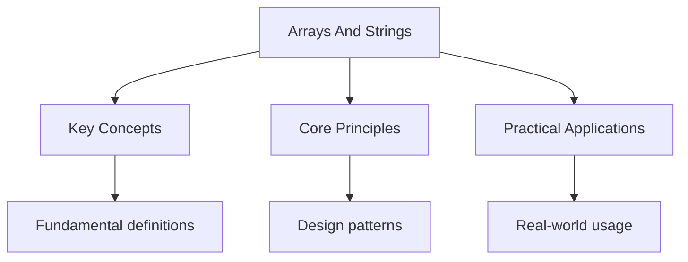

---

date: 2026-07-23T21:57:32+01:00
title: "Arrays and Strings | Tools - Wyatt's Notes"
description: "An array is a contiguous block of memory where each element occupies a fixed number of bytes and is Indexed by an integer offset from the base address. This"

---

<!-- Breadcrumb Schema for SEO -->
<script type="application/ld+json">
{
  "@context": "https://schema.org",
  "@type": "BreadcrumbList",
  "itemListElement": [{"name": "Home", "url": "https://wyattau.com"}, {"name": "tools", "url": "https://tools.wyattau.com"}, {"name": "Algorithms", "url": "https://tools.wyattau.com/algorithms"}, {"name": "02 Arrays Strings", "url": "https://tools.wyattau.com/algorithms/02-arrays-strings"}, {"name": "Arrays And Strings", "url": "https://tools.wyattau.com/algorithms/02-arrays-strings/arrays-and-strings"}]
}
</script>

## Intuition

**The simplest and fastest data structure:** Arrays are like a row of mailboxes — each slot is numbered, and you can access any slot instantly by its number. This contiguous memory layout gives O(1) access and excellent cache performance, making arrays the foundation of almost everything.

**Why it matters:** Arrays are the most cache-friendly data structure — sequential access patterns exploit CPU cache lines, making array operations 10-100x faster than pointer-based alternatives for the same asymptotic complexity.

**The key insight:** The real-world performance gap between arrays and linked lists is much larger than Big-O suggests — cache misses cost 100+ cycles, so array traversal is dramatically faster even though both are O(n).

## Array Fundamentals

An array is a contiguous block of memory where each element occupies a fixed number of bytes and is
Indexed by an integer offset from the base address. This is the simplest and most cache-efficient
Data structure available. On modern hardware, accessing element $i$ of an array `arr` compiles to a
Single instruction: load from `base + i * element_size`.

### Memory Layout and Cache Behaviour

Arrays have excellent spatial locality: accessing `arr[i]` loads the entire cache line ( 64 Bytes)
into L1 cache, so accessing `arr[i+1]``arr[i+2]`Etc. Hits cache. This is why a linear Scan through
an array is 10-100x faster than following pointers through a linked list, Even though both are
$O(n)$ in theory.

| Property         | Array                       | Linked List              |
| ---------------- | --------------------------- | ------------------------ |
| Access by index  | $O(1)$                      | $O(n)$                   |
| Insert at front  | $O(n)$                      | $O(1)$                   |
| Insert at back   | $O(1)$ amortised            | $O(1)$ with tail pointer |
| Insert in middle | $O(n)$                      | $O(1)$ with pointer      |
| Cache behaviour  | Excellent (contiguous)      | Poor (pointer chasing)   |
| Memory overhead  | None (or small for dynamic) | One pointer per element  |

### Dynamic Arrays

Dynamic arrays (Python `list`C++ `std::vector`Java `ArrayList`) automatically resize when full. The
standard strategy is geometric growth: when capacity is exhausted, allocate a new array of Capacity
$c \cdot m$ (where $c$ is the growth factor, 2) and copy all elements.

- **Growth factor of 2**: amortised $O(1)$ per append, but memory usage can be up to $2n$
- **Growth factor of 1.5**: amortised $O(1)$ per append, and the old array can sometimes be reused
  (for memory allocators that support in-place resizing)

```python
class DynamicArray:
    def __init__(self, capacity=1):
        self.data = [None] * capacity
        self.size = 0
        self.capacity = capacity

    def append(self, value):
        if self.size == self.capacity:
            self._resize(self.capacity * 2)
        self.data[self.size] = value
        self.size += 1

    def _resize(self, new_capacity):
        new_data = [None] * new_capacity
        for i in range(self.size):
            new_data[i] = self.data[i]
        self.data = new_data
        self.capacity = new_capacity

    def pop(self):
        if self.size == 0:
            raise IndexError("pop from empty array")
        value = self.data[self.size - 1]
        self.data[self.size - 1] = None
        self.size -= 1
        # Optional: shrink if size < capacity / 4
        if self.size > 0 and self.size <= self.capacity // 4:
            self._resize(self.capacity // 2)
        return value
```

:::caution
More conservative than the textbook factor of 2, trading slightly more frequent reallocations for
Lower peak memory usage. C++ `std::vector` uses factor 2.

## String Representation

### ASCII and Unicode

ASCII encodes 128 characters in 7 bits (0-127). Extended ASCII uses 8 bits (0-255) but is not
Standardised. Unicode defines a unique code point for every character in every script, currently
Numbering over 149,000 characters across code points 0x0000 to 0x10FFFF.

### UTF-8 Encoding

UTF-8 is a variable-width encoding of Unicode:

| Code Point Range    | Byte Pattern | Binary Representation                 |
| ------------------- | ------------ | ------------------------------------- |
| U+0000 to U+007F    | 1 byte       | `0xxxxxxx`                            |
| U+0080 to U+07FF    | 2 bytes      | `110xxxxx 10xxxxxx`                   |
| U+0800 to U+FFFF    | 3 bytes      | `1110xxxx 10xxxxxx 10xxxxxx`          |
| U+10000 to U+10FFFF | 4 bytes      | `11110xxx 10xxxxxx 10xxxxxx 10xxxxxx` |

Key properties of UTF-8:

- **ASCII compatible**: the first 128 characters are identical to ASCII
- **Self-synchronising**: you can start decoding from any byte boundary (if you land on a
  continuation byte, skip backwards until you find a leading byte)
- **Prefix-free**: no valid UTF-8 sequence is a prefix of another valid sequence

This matters for algorithms: iterating over a UTF-8 string by code point is $O(n)$ in bytes, but
Finding the $k$-th code point is $O(k)$ unless you build an index. In Python, strings are sequences
Of Unicode code points (so `len(s)` gives the number of code points), but the underlying storage is
UTF-8 (in CPython 3.3+, PEP 393).

### String Complexity

| Operation        | Python `str`        | C `char[]`             | Notes                     |
| ---------------- | ------------------- | ---------------------- | ------------------------- |
| Length           | $O(1)$              | $O(n)$ (with `strlen`) | Python stores length      |
| Access by index  | $O(1)$              | $O(1)$                 | Code point, not byte      |
| Concatenation    | $O(n+m)$            | $O(n+m)$               | Python creates new object |
| Substring        | $O(k)$              | $O(k)$                 | $k$ = length of substring |
| Split            | $O(n)$              | $O(n)$                 | Scans entire string       |
| Find (substring) | $O(nm)$ to $O(n+m)$ | $O(nm)$ to $O(n+m)$    | Depends on algorithm      |

## Two-Pointer Technique

The two-pointer technique uses two indices that move through the array (or string) in a coordinated
Way. It is one of the most frequently used patterns in array problems.

### Pattern 1: Opposite Ends (Sorted Array)

Both pointers start at opposite ends and move toward each other. This works on sorted arrays.

```python
def two_sum_sorted(arr, target):
    """
    Given a sorted array, find two elements that sum to target.
    Time: O(n), Space: O(1)
    """
    left, right = 0, len(arr) - 1
    while left < right:
        current = arr[left] + arr[right]
        if current == target:
            return (left, right)
        elif current < target:
            left += 1
        else:
            right -= 1
    return None
```

**Complexity:** $O(n)$ time, $O(1)$ space. Each element is visited at most once.

### Pattern 2: Same Direction (Fast and Slow)

Both pointers move in the same direction, but at different speeds.

```python
def remove_duplicates_sorted(arr):
    """
    Remove duplicates from sorted array in-place.
    Returns the length of the deduplicated array.
    Time: O(n), Space: O(1)
    """
    if not arr:
        return 0
    write = 1
    for read in range(1, len(arr)):
        if arr[read] != arr[write - 1]:
            arr[write] = arr[read]
            write += 1
    return write
```

### Pattern 3: Palindrome Check

```python
def is_palindrome(s):
    """
    Check if a string is a palindrome (ignoring case and non-alphanumeric).
    Time: O(n), Space: O(1)
    """
    left, right = 0, len(s) - 1
    while left < right:
        while left < right and not s[left].isalnum():
            left += 1
        while left < right and not s[right].isalnum():
            right -= 1
        if s[left].lower() != s[right].lower():
            return False
        left += 1
        right -= 1
    return True
```

## Sliding Window

The sliding window technique maintains a contiguous subarray (window) that expands or contracts as
It moves through the array. It is applicable when you need to find a subarray satisfying some
Constraint.

### Fixed-Size Window

```python
def max_sum_subarray_k(arr, k):
    """
    Find the maximum sum of any contiguous subarray of length k.
    Time: O(n), Space: O(1)
    """
    if len(arr) < k:
        return None
    window_sum = sum(arr[:k])
    max_sum = window_sum
    for i in range(k, len(arr)):
        window_sum += arr[i] - arr[i - k]
        max_sum = max(max_sum, window_sum)
    return max_sum
```

### Variable-Size Window (Minimum Window)

```python
def min_subarray_sum_at_least_k(arr, k):
    """
    Find the length of the shortest subarray with sum at least k.
    Time: O(n), Space: O(1)
    """
    left = 0
    current_sum = 0
    min_length = float("inf')
    for right in range(len(arr)):
        current_sum += arr[right]
        while current_sum >= k:
            min_length = min(min_length, right - left + 1)
            current_sum -= arr[left]
            left += 1
    return min_length if min_length != float('inf') else 0
```

### Variable-Size Window with Hash Map (Longest Substring)

```python
def longest_substring_without_repeats(s):
    """
    Find the length of the longest substring without repeating characters.
    Time: O(n), Space: O(min(n, alphabet_size))
    """
    char_index = {}
    left = 0
    max_length = 0
    for right in range(len(s)):
        if s[right] in char_index and char_index[s[right]] >= left:
            left = char_index[s[right]] + 1
        char_index[s[right]] = right
        max_length = max(max_length, right - left + 1)
    return max_length
```
:::
:::note
Nor `right` ever moves backward. This is what gives the $O(n)$ time bound: each element is added to
And removed from the window at most once.

## Prefix Sums

A prefix sum array `prefix[i]` stores the sum of the first `i` elements of the original array. This
Precomputation enables $O(1)$ range sum queries.

### 1D Prefix Sums

```python
class PrefixSum1D:
    """
    Build a prefix sum array for O(1) range sum queries.
    Build: O(n), Query: O(1), Space: O(n)
    """
    def __init__(self, arr):
        self.prefix = [0] * (len(arr) + 1)
        for i in range(len(arr)):
            self.prefix[i + 1] = self.prefix[i] + arr[i]

    def range_sum(self, left, right):
        """Sum of arr[left..right] inclusive."""
        return self.prefix[right + 1] - self.prefix[left]

    def update(self, index, delta):
        """Update arr[index] += delta. O(n) — prefix sums don't support fast updates."""
        # This requires rebuilding or using a Fenwick tree instead
        raise NotImplementedError("Use Fenwick tree for fast updates")
```

### 2D Prefix Sums

For a matrix, the prefix sum at `(i, j)` stores the sum of all elements in the submatrix from
`(0, 0)` to `(i-1, j-1)`:

```python
class PrefixSum2D:
    """
    2D prefix sums for O(1) submatrix sum queries.
    Build: O(n*m), Query: O(1), Space: O(n*m)
    """
    def __init__(self, matrix):
        rows, cols = len(matrix), len(matrix[0])
        self.prefix = [[0] * (cols + 1) for _ in range(rows + 1)]
        for i in range(rows):
            for j in range(cols):
                self.prefix[i + 1][j + 1] = (
                    matrix[i][j]
                    + self.prefix[i][j + 1]
                    + self.prefix[i + 1][j]
                    - self.prefix[i][j]
                )

    def submatrix_sum(self, r1, c1, r2, c2):
        """Sum of matrix[r1..r2][c1..c2] inclusive."""
        return (
            self.prefix[r2 + 1][c2 + 1]
            - self.prefix[r1][c2 + 1]
            - self.prefix[r2 + 1][c1]
            + self.prefix[r1][c1]
        )
```

### Difference Arrays

The inverse of prefix sums: a difference array `diff[i] = arr[i] - arr[i-1]` allows $O(1)$ range
Addition and $O(n)$ reconstruction.

```python
class DifferenceArray:
    """
    Range addition in O(1), reconstruction in O(n).
    Useful when you have many range updates and one final query.
    """
    def __init__(self, n):
        self.diff = [0] * (n + 1)

    def range_add(self, left, right, value):
        """Add value to arr[left..right] inclusive. O(1)."""
        self.diff[left] += value
        self.diff[right + 1] -= value

    def build(self):
        """Reconstruct the final array. O(n)."""
        result = [0] * len(self.diff)
        result[0] = self.diff[0]
        for i in range(1, len(self.diff)):
            result[i] = result[i - 1] + self.diff[i]
        return result[:-1]
```

## Hashing

### Hash Maps and Hash Sets

A hash map (dictionary, associative array) maps keys to values with average $O(1)$ insertion,
Lookup, and deletion. A hash set is a hash map without values, used for membership testing.

The core idea: compute `hash(key) % bucket_count` to determine which bucket stores the key.
Collisions are inevitable (by the pigeonhole principle when there are more possible keys than
Buckets).

### Collision Resolution

**Separate chaining:** Each bucket is a linked list (or dynamic array). When a collision occurs, the
New element is appended to the list.

```python
class HashMapChaining:
    """
    Hash map with separate chaining.
    Average: O(1) per operation
    Worst case: O(n) per operation (all keys hash to same bucket)
    """
    def __init__(self, capacity=16, load_factor=0.75):
        self.capacity = capacity
        self.load_factor = load_factor
        self.size = 0
        self.buckets = [[] for _ in range(capacity)]

    def _hash(self, key):
        return hash(key) % self.capacity

    def put(self, key, value):
        bucket = self._hash(key)
        for i, (k, v) in enumerate(self.buckets[bucket]):
            if k == key:
                self.buckets[bucket][i] = (key, value)
                return
        self.buckets[bucket].append((key, value))
        self.size += 1
        if self.size > self.capacity * self.load_factor:
            self._resize()

    def get(self, key):
        bucket = self._hash(key)
        for k, v in self.buckets[bucket]:
            if k == key:
                return v
        raise KeyError(key)

    def _resize(self):
        old_buckets = self.buckets
        self.capacity *= 2
        self.buckets = [[] for _ in range(self.capacity)]
        self.size = 0
        for bucket in old_buckets:
            for key, value in bucket:
                self.put(key, value)
```

**Open addressing:** All elements are stored in the array itself. When a collision occurs, probe for
The next empty slot using a deterministic sequence.

| Strategy          | Probe Sequence                          | Clustering           |
| ----------------- | --------------------------------------- | -------------------- |
| Linear probing    | $h(k), h(k)+1, h(k)+2, \ldots$          | Primary clustering   |
| Quadratic probing | $h(k), h(k)+1^2, h(k)+2^2, \ldots$      | Secondary clustering |
| Double hashing    | $h(k), h(k)+h'(k), h(k)+2h'(k), \ldots$ | No clustering        |

**Robin Hood hashing:** A variant of open addressing where elements with shorter probe distances are
Favoured. When inserting, if the new element has a longer probe distance than the existing element,
Swap them. This minimises the variance of probe lengths, giving more consistent performance.

### Hash Function Design

A good hash function should:

1. **Be deterministic**. Same key always produces same hash
2. **Be fast**. Hash computation is on the critical path
3. **Distribute uniformly**. Avoid clustering
4. **Be avalanche-like**. A small change in input produces a large change in output

For integers, a common choice is the MurmurHash finaliser (MurmurHash3 mix):

```python
def murmurhash3_mix(key: int) -> int:
    """MurmurHash3 finaliser for 64-bit integers."""
    key ^= key >> 33
    key = (key * 0xff51afd7ed558ccd) & 0xFFFFFFFFFFFFFFFF
    key ^= key >> 33
    key = (key * 0xc4ceb9fe1a85ec53) & 0xFFFFFFFFFFFFFFFF
    key ^= key >> 33
    return key
```
:::
:::caution
Randomisation by default via `PYTHONHASHSEED`). This is a security measure against HashDoS attacks.
For persistent hashing (e.g., on-disk hash tables), use `hashlib` or a deterministic hash function.

## String Matching

### Naive Algorithm

Compare the pattern against every possible position in the text.

```python
def naive_search(text, pattern):
    """
    Naive string matching.
    Time: O(n*m) worst case, O(n+m) best case
    Space: O(1)
    """
    n, m = len(text), len(pattern)
    for i in range(n - m + 1):
        match = True
        for j in range(m):
            if text[i + j] != pattern[j]:
                match = False
                break
        if match:
            return i
    return -1
```

### Rabin-Karp Algorithm

Use hashing to compare the pattern with substrings in $O(1)$ expected time per position.

```python
def rabin_karp(text, pattern, base=256, mod=10**9 + 7):
    """
    Rabin-Karp string matching using rolling hash.
    Time: O(n+m) average, O(nm) worst case
    Space: O(1)
    """
    n, m = len(text), len(pattern)
    if m > n:
        return -1

    pattern_hash = 0
    text_hash = 0
    base_m = 1  # base^(m-1) % mod

    for i in range(m):
        pattern_hash = (pattern_hash * base + ord(pattern[i])) % mod
        text_hash = (text_hash * base + ord(text[i])) % mod
        if i < m - 1:
            base_m = (base_m * base) % mod

    for i in range(n - m + 1):
        if text_hash == pattern_hash:
            # Verify to avoid false positives (hash collision)
            if text[i:i + m] == pattern:
                return i
        if i < n - m:
            # Rolling hash: remove leading char, add trailing char
            text_hash = (
                (text_hash - ord(text[i]) * base_m) * base + ord(text[i + m])
            ) % mod
            text_hash = (text_hash + mod) % mod  # ensure non-negative

    return -1
```

**Complexity:** $O(n+m)$ average case, $O(nm)$ worst case (all positions are hash matches requiring
Verification). Using two independent hash functions reduces the probability of false positives to
Negligible levels.

### Knuth-Morris-Pratt (KMP) Algorithm

KMP preprocesses the pattern to build a "failure function" (also called the LPS array — longest
Proper prefix which is also suffix) that allows the algorithm to skip redundant comparisons.

```python
def build_lps(pattern):
    """
    Build the Longest Proper Prefix-Suffix array for KMP.
    Time: O(m), Space: O(m)
    """
    m = len(pattern)
    lps = [0] * m
    length = 0  # length of the previous longest prefix suffix
    i = 1
    while i < m:
        if pattern[i] == pattern[length]:
            length += 1
            lps[i] = length
            i += 1
        else:
            if length != 0:
                length = lps[length - 1]
            else:
                lps[i] = 0
                i += 1
    return lps

def kmp_search(text, pattern):
    """
    Knuth-Morris-Pratt string matching.
    Time: O(n + m) worst case
    Space: O(m)
    """
    n, m = len(text), len(pattern)
    if m == 0:
        return 0
    if m > n:
        return -1

    lps = build_lps(pattern)
    i = 0  # index in text
    j = 0  # index in pattern

    while i < n:
        if text[i] == pattern[j]:
            i += 1
            j += 1
            if j == m:
                return i - j  # match found
        else:
            if j != 0:
                j = lps[j - 1]
            else:
                i += 1
    return -1
```

**Complexity:** $O(n + m)$ worst case — guaranteed linear time, no hash collisions to worry about.
The LPS array ensures the text pointer `i` never moves backward.

## Anagram and Grouping Problems

### Valid Anagram

```python
def is_anagram(s, t):
    """
    Check if t is an anagram of s.
    Time: O(n), Space: O(1) — fixed alphabet size
    """
    if len(s) != len(t):
        return False
    counts = [0] * 26  # assuming lowercase English letters
    for c in s:
        counts[ord(c) - ord('a')] += 1
    for c in t:
        counts[ord(c) - ord('a')] -= 1
        if counts[ord(c) - ord('a')] < 0:
            return False
    return True
```

### Group Anagrams

```python
from collections import defaultdict

def group_anagrams(strings):
    """
    Group strings by anagram equivalence.
    Time: O(n * k * log k) where k = max string length
    Space: O(n * k)
    """
    groups = defaultdict(list)
    for s in strings:
        key = ''.join(sorted(s))
        groups[key].append(s)
    return list(groups.values())
```

An alternative using character counts as keys (better for long strings with small alphabets):

```python
def group_anagrams_count(strings):
    """
    Group anagrams using character count tuples as keys.
    Time: O(n * k) where k = max string length
    Space: O(n * k)
    """
    groups = defaultdict(list)
    for s in strings:
        counts = [0] * 26
        for c in s:
            counts[ord(c) - ord('a')] += 1
        groups[tuple(counts)].append(s)
    return list(groups.values())
```

## Matrix Traversal Patterns

### Spiral Traversal

```python
def spiral_order(matrix):
    """
    Traverse an m x n matrix in spiral order.
    Time: O(m * n), Space: O(1) (excluding output)
    """
    if not matrix or not matrix[0]:
        return []
    result = []
    top, bottom = 0, len(matrix) - 1
    left, right = 0, len(matrix[0]) - 1

    while top <= bottom and left <= right:
        # Traverse right
        for col in range(left, right + 1):
            result.append(matrix[top][col])
        top += 1

        # Traverse down
        for row in range(top, bottom + 1):
            result.append(matrix[row][right])
        right -= 1

        if top <= bottom:
            # Traverse left
            for col in range(right, left - 1, -1):
                result.append(matrix[bottom][col])
            bottom -= 1

        if left <= right:
            # Traverse up
            for row in range(bottom, top - 1, -1):
                result.append(matrix[row][left])
            left += 1

    return result
```

### Diagonal Traversal

```python
def diagonal_traverse(matrix):
    """
    Traverse an m x n matrix in diagonal zigzag order.
    Time: O(m * n), Space: O(1) (excluding output)
    """
    if not matrix or not matrix[0]:
        return []
    m, n = len(matrix), len(matrix[0])
    result = []
    row, col = 0, 0
    going_up = True

    while len(result) < m * n:
        if going_up:
            while row >= 0 and col < n:
                result.append(matrix[row][col])
                row -= 1
                col += 1
            row += 1
            if col >= n:
                col -= 1
                row += 1
        else:
            while col >= 0 and row < m:
                result.append(matrix[row][col])
                row += 1
                col -= 1
            col += 1
            if row >= m:
                row -= 1
                col += 1
        going_up = not going_up

    return result
```

## Common Problem Patterns

### Dutch National Flag

Partition an array into three sections (e.g., values less than, equal to, and greater than a pivot)
In a single pass.

```python
def dutch_national_flag(arr, pivot_idx):
    """
    Three-way partition around arr[pivot_idx].
    After: arr[0..lt-1] < pivot, arr[lt..gt] == pivot, arr[gt+1..n-1] > pivot
    Time: O(n), Space: O(1)
    """
    pivot = arr[pivot_idx]
    lt, gt = 0, len(arr) - 1
    i = 0
    while i <= gt:
        if arr[i] < pivot:
            arr[lt], arr[i] = arr[i], arr[lt]
            lt += 1
            i += 1
        elif arr[i] > pivot:
            arr[gt], arr[i] = arr[i], arr[gt]
            gt -= 1
            # Don't increment i — need to examine the swapped element
        else:
            i += 1
    return lt, gt  # boundaries of the equal region
```

### Merge Sorted Arrays

```python
def merge_sorted_arrays(a, b):
    """
    Merge two sorted arrays into one sorted array.
    Time: O(n + m), Space: O(n + m)
    """
    result = []
    i, j = 0, 0
    while i < len(a) and j < len(b):
        if a[i] <= b[j]:
            result.append(a[i])
            i += 1
        else:
            result.append(b[j])
            j += 1
    result.extend(a[i:])
    result.extend(b[j:])
    return result
```

### Merge Sorted Arrays In-Place

```python
def merge_in_place(a, b):
    """
    Merge sorted array b into sorted array a.
    Assumes a has enough buffer at the end to hold b.
    Time: O(n + m), Space: O(1)
    """
    total = len(a) + len(b) - 2  # subtract buffer count
    write = total
    i = len(a) - 1  # last real element in a
    j = len(b) - 1

    while i >= 0 and j >= 0:
        if a[i] > b[j]:
            a[write] = a[i]
            i -= 1
        else:
            a[write] = b[j]
            j -= 1
        write -= 1

    while j >= 0:
        a[write] = b[j]
        j -= 1
        write -= 1
```

### Majority Element (Boyer-Moore Voting)

```python
def majority_element(arr):
    """
    Find the element that appears more than n/2 times (if it exists).
    Boyer-Moore voting algorithm.
    Time: O(n), Space: O(1)
    """
    candidate = None
    count = 0
    for x in arr:
        if count == 0:
            candidate = x
            count = 1
        elif x == candidate:
            count += 1
        else:
            count -= 1

    # Verify (the algorithm only finds a candidate)
    if arr.count(candidate) > len(arr) // 2:
        return candidate
    return None
```

## Common Pitfalls

### 1. Off-by-One Errors in Window Problems

Sliding window problems are rife with off-by-one errors. The most common: confusing "exclusive upper
Bound" with "inclusive upper bound." Decide on a convention (Python-style `[left, right)` is
Recommended) and stick to it consistently. The number of elements in the window is always
`right - left`Never `right - left + 1`.

### 2. Integer Overflow in Rolling Hashes

Rabin-Karp's rolling hash computation involves multiplication and addition that can overflow 64-bit
Integers for large inputs. Always use modular arithmetic with a large prime modulus (or use Python's
Arbitrary-precision integers, which do not overflow). For production use, consider using two
Independent hash functions to reduce collision probability.

### 3. Forgetting Edge Cases in Two-Pointer Problems

Empty arrays, single-element arrays, arrays with all identical elements, and arrays where no valid
Pair exists are all edge cases that two-pointer solutions must handle. Test your solution with `[]`
`[1]``[1, 1, 1, 1]`And a case where no solution exists.

### 4. Treating Strings as Arrays of Bytes

In a world of UTF-8, string indexing does not give you bytes — it gives you code points. Reversing a
UTF-8 string by swapping bytes produces invalid UTF-8. Reversing by code points is safe but does not
Handle grapheme clusters (e.g., the emoji flags sequence). Use language-appropriate string reversal.

### 5. Hash Map Key Mutability

If you use a mutable object as a hash map key and then mutate it, the object's hash changes and you
Can no longer find it in the map. In Python, this manifests as a `dict` key becoming invisible after
Mutation. Always use immutable types (tuples, frozensets, strings) as keys, or ensure keys are never
Mutated after insertion.

### 6. Prefix Sum Integer Overflow

For large arrays, prefix sums can overflow 32-bit integers. A sum of $10^6$ elements each up to
$10^9$ gives $10^{15}$Which exceeds 32-bit range. Use 64-bit integers (`int` in Python is always
Arbitrary precision, but in C/C++/Java, use `long long`/`long`).

### 7. Ignoring the Difference Between "At Most k" and "Exactly k"

In sliding window problems, "at most k distinct elements" requires shrinking the window when the
Count exceeds $k$While "exactly k distinct elements" requires maintaining two windows (one for at
Most $k$ and one for at most $k-1$). Conflating these leads to incorrect solutions.




## Summary

This topic covers the core concepts of arrays and strings, including underlying theory, practical
implementation, and key applications.

**Key concepts include:**

- Big O notation and complexity analysis
- searching algorithms (binary, linear)
- sorting algorithms (bubble, merge, quick)
- graph algorithms (Dijkstra, BFS, DFS)
- dynamic programming

Understanding these concepts thoroughly is essential for both examinations and practical
programming, and requires both theoretical knowledge and hands-on practice.

## Worked Examples

Worked examples demonstrating the application of key concepts are covered in the detailed sub-pages
linked above.
:::

## See Also

- [Arrays Strings](./)
- [Hashing and Hash Tables](./hashing-and-hash-tables)
- [Algorithms](..)
