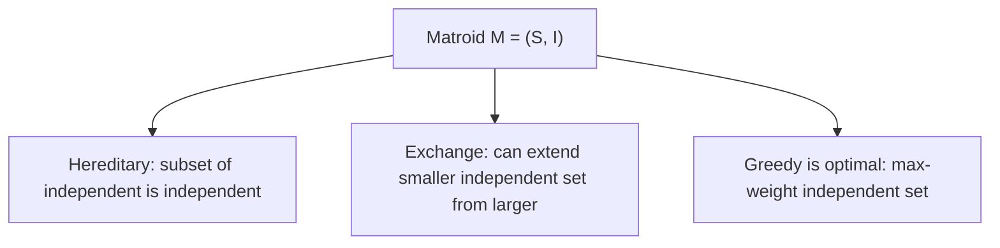

---

date: 2026-07-23T21:57:32+01:00
title: "Greedy Algorithms | Tools - Wyatt's Notes"
description: "A greedy algorithm makes the locally optimal choice at each step, hoping this leads to a globally Optimal solution. Unlike dynamic programming, greedy"

---

<!-- Breadcrumb Schema for SEO -->
<script type="application/ld+json">
{
  "@context": "https://schema.org",
  "@type": "BreadcrumbList",
  "itemListElement": [{"name": "Home", "url": "https://wyattau.com"}, {"name": "tools", "url": "https://tools.wyattau.com"}, {"name": "Algorithms", "url": "https://tools.wyattau.com/algorithms"}, {"name": "06 Dynamic Programming", "url": "https://tools.wyattau.com/algorithms/06-dynamic-programming"}, {"name": "Greedy Algorithms", "url": "https://tools.wyattau.com/algorithms/06-dynamic-programming/greedy-algorithms"}]
}
</script>

## The Greedy Paradigm

A greedy algorithm makes the locally optimal choice at each step, hoping this leads to a globally
Optimal solution. Unlike dynamic programming, greedy algorithms do not consider all possible
Subproblems — they commit to a choice and never reconsider.

### When to Consider Greedy

| Signal                                                         | Try Greedy First? |
| -------------------------------------------------------------- | ----------------- |
| Problem has a matroid structure                                | Yes               |
| Activity/resource scheduling with ordering                     | Yes               |
| Huffman-like optimal prefix coding                             | Yes               |
| Fractional version of a knapsack problem                       | Yes               |
| MST or shortest path on non-negative weights                   | Yes               |
| 0/1 knapsack, partition, edit distance                         | No (use DP)       |
| TSP                                                            | No (NP-hard)      |
| Problem requires "try all possibilities" to verify correctness | Probably No       |

## The Exchange Argument

The exchange argument is the primary proof technique for greedy correctness. The idea: assume an
Optimal solution differs from the greedy solution, then show we can exchange some element of the
Optimal solution with the greedy choice without making the solution worse.

### Structure of an Exchange Argument

1. Let $G$ be the greedy solution and $O$ be an optimal solution
2. Find the first point where $G$ and $O$ differ
3. Show that replacing the optimal"s choice with the greedy's choice produces a solution $O'$ that
   is at least as good as $O$
4. Conclude that there exists an optimal solution that agrees with the greedy at this step
5. By induction, the greedy solution is optimal

### Example: Activity Selection

Given $n$ activities with start times $s_i$ and finish times $f_i$Select the maximum number of
Non-overlapping activities.

**Greedy**: always pick the activity with the earliest finish time.

```python
def activity_selection(activities):
    """
    Maximum number of non-overlapping activities.
    Greedy: sort by finish time, pick earliest finishing.
    Time: O(n log n) for sorting
    Space: O(1) (excluding input)
    """
    sorted_activities = sorted(activities, key=lambda x: x[1])
    count = 0
    last_finish = float('-inf')

    for start, finish in sorted_activities:
        if start >= last_finish:
            count += 1
            last_finish = finish

    return count
```

**Exchange argument proof:**

Let $G = \{g_1, g_2, \ldots\}$ be the greedy solution and $O = \{o_1, o_2, \ldots\}$ be an optimal
Solution, both sorted by finish time. $g_1$ has the earliest finish time of all activities. Since
$o_1$ also finishes before $o_2, o_3, \ldots$We have $f(g_1) \le f(o_1)$. Replacing $o_1$ with $g_1$
in $O$ gives a valid solution (since $g_1$ finishes no later than $o_1$It does not overlap With
$o_2$). The new solution has the same size as $O$ and starts with $g_1$. By induction, $|G| = |O|$.

:::tip
Start time and shortest duration do NOT work. The key insight is that picking the activity that
Finishes earliest leaves the maximum remaining time for other activities.

## Huffman Coding

Huffman coding constructs an optimal prefix-free code for a set of symbols with given frequencies.
It produces a binary tree where more frequent symbols have shorter codes.

### Algorithm

1. Create a leaf node for each symbol with its frequency
2. Repeatedly merge the two nodes with the smallest frequencies
3. The merged node's frequency is the sum of its children's frequencies
4. Continue until one tree remains

```python
import heapq

def huffman(frequencies):
    """
    Build Huffman codes from symbol frequencies.
    Time: O(n log n) where n = number of symbols
    Space: O(n)
    Returns: dict mapping symbol -> code string
    """
    heap = [(freq, i, sym) for i, (sym, freq) in enumerate(frequencies.items())]
    heapq.heapify(heap)

    children = {}
    counter = len(heap)

    while len(heap) > 1:
        f1, _, n1 = heapq.heappop(heap)
        f2, _, n2 = heapq.heappop(heap)
        merged = f1 + f2
        children[(merged, counter)] = (n1, n2)
        heapq.heappush(heap, (merged, counter, (merged, counter)))
        counter += 1

    codes = {}
    def assign_codes(node, code):
        if isinstance(node, str):
            codes[node] = code if code else '0'
            return
        left, right = children[node]
        assign_codes(left, code + '0')
        assign_codes(right, code + '1')

    if heap:
        _, _, root = heap[0]
        if isinstance(root, str):
            codes[root] = '0'
        else:
            assign_codes(root, '')

    return codes
```

### Optimality Proof (Exchange Argument)

**Claim**: Huffman's algorithm produces a prefix code with minimum expected length.

**Proof sketch**:

1. **Lemma 1**: In an optimal prefix code, the two least frequent symbols are siblings at the
   deepest level. If they were not, swapping a more frequent symbol deeper would not increase the
   expected length.

2. **Lemma 2**: The Huffman merge step preserves optimality. If we have an optimal code for $n-1$
   symbols (where the two least frequent symbols are merged), we can expand the merged symbol back
   into two siblings to get an optimal code for $n$ symbols.

3. **By induction**: The algorithm produces optimal codes at every step.

### Expected Code Length

$$L = \sum_{i=1}^{n} f_i \cdot \mathrm{len(c_i)$$

For a source with entropy $H = -\sum f_i \log_2 f_i$Huffman coding satisfies $H \le L \lt H + 1$
(one bit per symbol worse than the theoretical minimum).

## Fractional Knapsack

Unlike 0/1 knapsack, the fractional version allows taking fractions of items. Greedy works: sort by
Value-to-weight ratio and take as much as possible of the highest-ratio items.

```python
def fractional_knapsack(weights, values, capacity):
    """
    Fractional knapsack — can take fractions of items.
    Time: O(n log n)
    Space: O(n)
    """
    items = sorted(
        zip(values, weights),
        key=lambda x: x[0] / x[1],
        reverse=True
    )

    total_value = 0.0
    remaining = capacity

    for v, w in items:
        if remaining <= 0:
            break
        take = min(w, remaining)
        total_value += take * (v / w)
        remaining -= take

    return total_value
```

### Why Greedy Fails for 0/1 Knapsack

Consider items with (value, weight): `(60, 10)``(100, 20)``(120, 30)` with capacity 50.

- Greedy by ratio: take item 1 (60/10 = 6), item 2 (100/20 = 5), item 3 (120/30 = 4). Total: 60 +
  100 = 160, weight 30. Cannot add item 3 (weight 30 > remaining 20).
- Optimal: items 2 and 3. Total: 100 + 120 = 220, weight 50.

The greedy choice of the highest-ratio item excludes the optimal combination. This is because 0/1
Knapsack lacks the matroid structure that fractional knapsack has.

## Interval Scheduling Variants

### Weighted Interval Scheduling

When each interval has a weight and we want to maximise total weight (not count), greedy by earliest
Finish time does not work. Use DP instead.

```python
def weighted_interval_scheduling(intervals):
    """
    Maximum weight set of non-overlapping intervals.
    Time: O(n log n)
    Space: O(n)
    """
    intervals.sort(key=lambda x: x[1])
    n = len(intervals)
    starts = [iv[0] for iv in intervals]
    import bisect

    def latest_non_overlapping(j):
        i = bisect.bisect_right(starts, intervals[j][0]) - 1
        return i

    dp = [0] * (n + 1)
    for j in range(1, n + 1):
        include = intervals[j - 1][2] + dp[latest_non_overlapping(j - 1) + 1]
        exclude = dp[j - 1]
        dp[j] = max(include, exclude)

    return dp[n]
```

### Interval Partitioning (Minimum Meeting Rooms)

Given $n$ intervals, find the minimum number of rooms needed to schedule all meetings without
Overlap.

```python
def min_meeting_rooms(intervals):
    """
    Minimum number of rooms for all meetings.
    Greedy: sort start times, use min-heap for end times.
    Time: O(n log n)
    Space: O(n)
    """
    import heapq
    intervals.sort(key=lambda x: x[0])
    heap = []

    for start, end in intervals:
        if heap and heap[0] <= start:
            heapq.heappop(heap)
        heapq.heappush(heap, end)

    return len(heap)
```

## Greedy on Graphs

### Kruskal's Algorithm

Repeatedly add the cheapest edge that does not create a cycle. This produces a minimum spanning
Tree.

```python
class UnionFind:
    def __init__(self, n):
        self.parent = list(range(n))
        self.rank = [0] * n

    def find(self, x):
        if self.parent[x] != x:
            self.parent[x] = self.find(self.parent[x])
        return self.parent[x]

    def union(self, x, y):
        px, py = self.find(x), self.find(y)
        if px == py:
            return False
        if self.rank[px] < self.rank[py]:
            px, py = py, px
        self.parent[py] = px
        if self.rank[px] == self.rank[py]:
            self.rank[px] += 1
        return True

def kruskal(n, edges):
    """
    Minimum spanning tree using Kruskal's algorithm.
    Time: O(E log E) for sorting
    Space: O(V + E)
    """
    edges.sort(key=lambda x: x[2])
    uf = UnionFind(n)
    mst = []
    total_weight = 0

    for u, v, w in edges:
        if uf.union(u, v):
            mst.append((u, v, w))
            total_weight += w
            if len(mst) == n - 1:
                break

    return mst, total_weight
```

### Prim's Algorithm

Grow the MST from an arbitrary vertex, always adding the cheapest edge connecting the tree to a
Non-tree vertex.

```python
import heapq

def prim(n, graph):
    """
    Minimum spanning tree using Prim's algorithm.
    Time: O((V + E) log V) with binary heap
    Space: O(V + E)
    """
    visited = [False] * n
    min_heap = [(0, 0, -1)]
    mst = []
    total_weight = 0

    while min_heap:
        weight, u, parent = heapq.heappop(min_heap)
        if visited[u]:
            continue
        visited[u] = True
        total_weight += weight
        if parent != -1:
            mst.append((parent, u, weight))
        for v, w in graph[u]:
            if not visited[v]:
                heapq.heappush(min_heap, (w, v, u))

    return mst, total_weight
```

### Dijkstra's Algorithm

Dijkstra's algorithm is greedy: it always processes the vertex with the smallest tentative distance.
The greedy choice is safe because with non-negative weights, the shortest path to any vertex through
Already-processed vertices cannot be improved by going through unprocessed vertices.

```python
import heapq

def dijkstra(n, graph, source):
    """
    Shortest paths from source using Dijkstra.
    Requires non-negative edge weights.
    Time: O((V + E) log V)
    Space: O(V)
    """
    dist = [float('inf')] * n
    dist[source] = 0
    pq = [(0, source)]

    while pq:
        d, u = heapq.heappop(pq)
        if d > dist[u]:
            continue
        for v, w in graph[u]:
            if dist[u] + w < dist[v]:
                dist[v] = dist[u] + w
                heapq.heappush(pq, (dist[v], v))

    return dist
```
:::
:::caution
Unprocessed vertex may exist. Use Bellman-Ford ($O(VE)$) for graphs with negative weights but no
Negative cycles.

## Matroid Theory

A matroid is a combinatorial structure that captures the notion of "independence." Greedy algorithms
Are optimal on matroids.

### Definition

A matroid $M = (S, \mathcal{I})$ consists of a finite set $S$ and a collection $\mathcal{I}$ of
Independent subsets of $S$ satisfying:

1. **Hereditary property**: if $A \in \mathcal{I}$ and $B \subseteq A$ Then $B \in \mathcal{I}$
2. **Exchange property**: if $A, B \in \mathcal{I}$ and $|A| \lt |B|$ Then there exists
   $x \in B \setminus A$ such that $A \cup \{x\} \in \mathcal{I}$

### Matroid Greedy Theorem

**Theorem**: The greedy algorithm (sort elements by weight, add each element if the result remains
Independent) finds the maximum-weight independent set in any matroid.

### Examples of Matroids

| Matroid             | Set $S$          | Independent Sets $\mathcal{I}$     | Greedy Problem     |
| ------------------- | ---------------- | ---------------------------------- | ------------------ |
| Graphic matroid     | Edges of a graph | Acyclic subsets (forests)          | MST (Kruskal)      |
| Partition matroid   | Elements         | At most one from each partition    | Assignment         |
| Linear matroid      | Vectors          | Linearly independent sets          | Max weight basis   |
| Uniform matroid     | Elements         | Subsets of size $\le k$            | Top-k selection    |
| Transversal matroid | Elements         | System of distinct representatives | Bipartite matching |



### Why 0/1 Knapsack Is Not a Matroid

The independent sets of the 0/1 knapsack (sets whose total weight does not exceed capacity) do not
Satisfy the exchange property. Consider capacity 10, items of weights {6, 6, 5}. Sets {6} and {5}
Are independent, but neither can be extended by the other to remain within capacity 10. This is why
Greedy fails for 0/1 knapsack.

## Job Scheduling

### Shortest Processing Time (SPT)

Minimise average completion time by processing jobs in order of increasing processing time.

```python
def spt_scheduling(jobs):
    """
    Shortest Processing Time scheduling.
    Minimises mean completion time.
    Time: O(n log n)
    """
    jobs.sort()
    completion_time = 0
    total_completion = 0
    for job in jobs:
        completion_time += job
        total_completion += completion_time
    return total_completion / len(jobs)
```

### Earliest Deadline First (EDF)

Schedule jobs with deadlines to maximise the number of on-time completions.

```python
def earliest_deadline_first(jobs):
    """
    Schedule jobs to maximise number completed before deadline.
    Greedy: sort by deadline, process in order.
    Time: O(n log n)
    """
    jobs.sort(key=lambda x: x[1])
    current_time = 0
    completed = 0
    for duration, deadline in jobs:
        current_time += duration
        if current_time <= deadline:
            completed += 1
    return completed
```

### Weighted Scheduling with Deadlines

```python
def weighted_job_scheduling(jobs):
    """
    Maximise profit with deadlines (each job takes 1 unit).
    Greedy: sort by profit descending, schedule at latest available slot.
    Time: O(n log n) with union-find optimisation
    Space: O(n)
    """
    jobs.sort(key=lambda x: x[1], reverse=True)
    max_deadline = max(j[2] for j in jobs) if jobs else 0
    slots = [-1] * (max_deadline + 1)

    def find_slot(deadline):
        if deadline == 0:
            return -1
        if slots[deadline] == -1:
            return deadline
        slots[deadline] = find_slot(slots[deadline] - 1)
        return slots[deadline]

    total_profit = 0
    for profit, _, deadline in jobs:
        slot = find_slot(deadline)
        if slot != -1:
            slots[slot] = slot
            total_profit += profit

    return total_profit
```

## Coin Change (When Greedy Works)

### Canonical Coin Systems

Greedy coin change (always take the largest coin possible) works for certain coin systems called
**canonical systems**.

```python
def greedy_coin_change(amount, coins):
    """
    Greedy coin change — optimal for canonical coin systems.
    Time: O(amount / min_coin) = O(amount)
    Space: O(1)
    """
    coins.sort(reverse=True)
    count = 0
    for coin in coins:
        if amount >= coin:
            num = amount // coin
            count += num
            amount -= num * coin
        if amount == 0:
            break
    return count if amount == 0 else -1
```

### When Greedy Fails for Coin Change

Coins `{1, 3, 4}`Amount 6:

- Greedy: 4 + 1 + 1 = 3 coins
- Optimal: 3 + 3 = 2 coins

The coin system `{1, 3, 4}` is not canonical. For non-canonical systems, use DP.

```python
def dp_coin_change(amount, coins):
    """
    DP coin change — works for any coin system.
    Time: O(amount * len(coins))
    Space: O(amount)
    """
    dp = [float('inf')] * (amount + 1)
    dp[0] = 0
    for a in range(1, amount + 1):
        for coin in coins:
            if coin <= a:
                dp[a] = min(dp[a], dp[a - coin] + 1)
    return dp[amount] if dp[amount] != float('inf') else -1
```

## Set Cover (Greedy Approximation)

Given a universe $U$ and a collection of subsets $S_1, S_2, \ldots, S_m$Find the minimum number of
Subsets whose union is $U$. This is NP-hard, but a greedy algorithm gives a
$(\ln n + 1)$-approximation.

```python
def greedy_set_cover(universe, subsets):
    """
    Greedy set cover — (ln n + 1)-approximation.
    Time: O(|U| * m^2) naive, O(|U| * m) with efficient tracking
    Space: O(|U| + m)
    """
    uncovered = set(universe)
    cover = []

    while uncovered:
        best_subset = max(subsets, key=lambda s: len(s & uncovered))
        cover.append(best_subset)
        uncovered -= best_subset
        subsets.remove(best_subset)

    return cover
```
:::