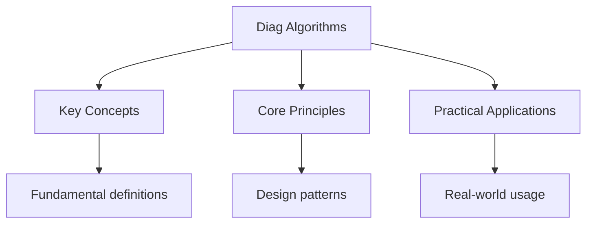

---

date: 2026-07-23T21:57:32+01:00
title: "Diagnostic Test: Algorithms | Tools"
description: "\"itemListElement\": [{\"name\": \"Home\", \"url\": \"https://wyattau.com\"}, {\"name\": \"tools\", \"url\": \"https://tools.wyattau.com\"}, {\"name\": \"Diagnostics\", \"url\":"
sidebar_position: 60
tableOfContents: false
---

<!-- Breadcrumb Schema for SEO -->

## Diagnostic Test: Algorithms

10 multiple-choice questions covering algorithms and data structures. Select the best answer for each question, then check your score using the answer key below.

---

<!-- Breadcrumb Schema for SEO -->

**Question 1.** What is the worst-case time complexity of QuickSort?

(A) O(n)
(B) O(n log n)
(C) O(n^2)
(D) O(log n)

---

<!-- Breadcrumb Schema for SEO -->

**Question 2.** Which data structure is most appropriate for implementing a priority queue?

(A) Hash table
(B) Heap
(C) Linked list
(D) Stack

---

<!-- Breadcrumb Schema for SEO -->

**Question 3.** What is the time complexity of finding an element in a balanced binary search tree?

(A) O(1)
(B) O(log n)
(C) O(n)
(D) O(n log n)

---

<!-- Breadcrumb Schema for SEO -->

**Question 4.** Dijkstra's algorithm cannot handle graphs with:

(A) More than 100 vertices
(B) Negative edge weights
(C) Directed edges
(D) Cycles of length 3

---

<!-- Breadcrumb Schema for SEO -->

**Question 5.** Which of the following is NOT a property required for dynamic programming?

(A) Optimal substructure
(B) Overlapping subproblems
(C) Greedy choice property
(D) Both A and B are required

---

<!-- Breadcrumb Schema for SEO -->

**Question 6.** The time complexity of building a heap from an unsorted array of n elements is:

(A) O(n)
(B) O(n log n)
(C) O(n^2)
(D) O(log n)

---

<!-- Breadcrumb Schema for SEO -->

**Question 7.** Breadth-first search uses which data structure to manage the exploration frontier?

(A) Stack
(B) Queue
(C) Priority queue
(D) Hash set

---

<!-- Breadcrumb Schema for SEO -->

**Question 8.** What does a topological sort produce for a directed acyclic graph?

(A) The shortest path between all pairs of vertices
(B) A linear ordering of vertices respecting all edge directions
(C) The minimum spanning tree
(D) A strongly connected component decomposition

---

<!-- Breadcrumb Schema for SEO -->

**Question 9.** Which algorithm is used to find the longest common subsequence of two sequences?

(A) Binary search
(B) Dynamic programming
(C) Greedy algorithm
(D) Breadth-first search

---

<!-- Breadcrumb Schema for SEO -->

**Question 10.** In a hash table with chaining, what is the worst-case time complexity for a search?

(A) O(1)
(B) O(log n)
(C) O(n)
(D) O(n log n)

---

<!-- Breadcrumb Schema for SEO -->

## Intuition

**Testing your algorithmic knowledge:** Diagnostic tests are like a mechanic checkup for your understanding — they quickly reveal which concepts you have mastered and which need more work, so you can focus your study time effectively.

**Why it matters:** Self-assessment prevents the illusion of competence — you might think you understand binary search until you are asked to implement it under pressure. Diagnostic tests expose these gaps before they become problems.

**The key insight:** If you cannot explain why an answer is correct (not just which option is right), you do not truly understand the concept. Use diagnostic tests as a starting point for deeper study, not as an endpoint.

## Answer Key

| Question | Correct Answer |
|----------|---------------|
| 1        | C             |
| 2        | B             |
| 3        | B             |
| 4        | B             |
| 5        | C             |
| 6        | A             |
| 7        | B             |
| 8        | B             |
| 9        | B             |
| 10       | C             |

**Scoring:** Count your correct answers out of 10. A score of 8 or above indicates strong mastery of algorithms and data structures. Review the explanations in the practice problems for any questions you answered incorrectly.

## Common Mistakes

**Assuming QuickSort is always O(n log n):** QuickSort's average case is O(n log n), but the worst case is O(n²) when partitions are maximally unbalanced (e.g., already sorted data with a bad pivot choice). Use a randomised or median-of-three pivot strategy to avoid this, or prefer MergeSort when worst-case guarantees matter.

**Confusing BFS and DFS use cases:** BFS finds shortest paths in unweighted graphs and explores level by level using a queue. DFS explores as deep as possible before backtracking using a stack (or recursion). Using BFS when you need topological sort, or DFS when you need shortest paths, gives wrong results.

**Forgetting that dynamic programming requires overlapping subproblems:** DP works when the same subproblems are solved repeatedly (optimal substructure + overlapping subproblems). If subproblems are independent (no overlap), divide-and-conquer is more appropriate. Applying DP to non-overlapping problems wastes memory on unnecessary table storage.

## Cross-References

- **[Sorting Algorithms](../algorithms/05-sorting/sorting.md):** Detailed notes on comparison-based and non-comparison sorting algorithms.
- **[Dynamic Programming](../algorithms/06-dynamic-programming/dynamic-programming.md):** Core DP concepts including memoisation and tabulation.
- **[Hashing and Hash Tables](../algorithms/02-arrays-strings/hashing-and-hash-tables.md):** Hash-based data structures for O(1) average-case operations.
