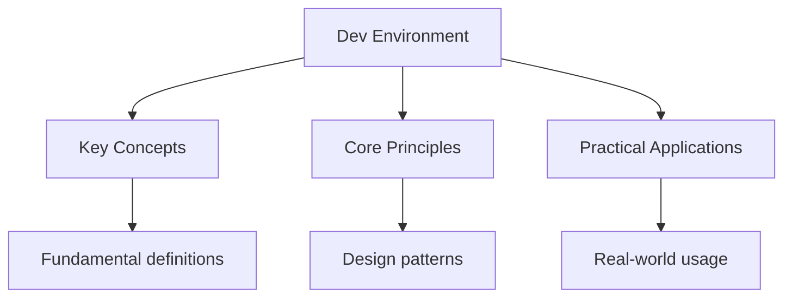

---

date: 2026-07-23T21:57:32+01:00
title: "Development Environment Setup | Tools"
description: "Study notes for Development Environment Setup with worked examples, practice problems, and key concepts for exam preparation."
---

<!-- Breadcrumb Schema for SEO -->
<script type="application/ld+json">
{
  "@context": "https://schema.org",
  "@type": "BreadcrumbList",
  "itemListElement": [{"name": "Home", "url": "https://wyattau.com"}, {"name": "tools", "url": "https://tools.wyattau.com"}, {"name": "General", "url": "https://tools.wyattau.com/general"}, {"name": "Dev Environment", "url": "https://tools.wyattau.com/general/dev-environment"}, {"name": "Dev Environment", "url": "https://tools.wyattau.com/general/dev-environment/dev-environment"}]
}
</script>

## Intuition

**Your digital workshop:** A development environment is like a well-organised workshop — the right tools (terminal, editor, shell) make you productive, while poor setup creates friction that slows you down. Investing in your environment pays dividends every day.

**Why it matters:** The tools you use daily have an outsized impact on your productivity. A fast terminal, a well-configured editor, and efficient shell aliases can save hours per week compared to slow, unconfigured defaults.

**The key insight:** GPU-accelerated terminals render text faster and support true colour and Unicode — this is not just cosmetic; it enables tools like `bat`, `fzf`, and `neovim` to display syntax highlighting and special characters correctly.

## Terminal Emulators

### GPU-Accelerated Terminals

Modern terminal emulators use the GPU for rendering, enabling smooth scrolling, proper Unicode
Support, and fast image rendering:

| Terminal  | Renderer     | Platform              | Key Features                                             |
| --------- | ------------ | --------------------- | -------------------------------------------------------- |
| Alacritty | Vulkan/Metal | Linux, macOS, Windows | Fastest, minimal config (YAML), GPU-first                |
| Kitty     | OpenGL       | Linux, macOS          | Image support, tabs, ligatures, layout management        |
| WezTerm   | WebGL/Metal  | Linux, macOS, Windows | Built-in multiplexer, Lua config, image protocol         |
| Ghostty   | Vulkan/Metal | Linux, macOS          | New, fast, system-native font rendering                  |
| iTerm2    | Metal        | macOS                 | macOS-only, extensive features, splits, tmux integration |

### Terminal Configuration

Alacritty example configuration (`~/.config/alacritty/alacritty.toml`):

```toml
[window]
opacity = 0.95
padding = { x = 8, y = 8 }
decorations = "none"

[font]
normal = { family = "JetBrains Mono", style = "Regular" }
size = 13.0

[colors.primary]
background = "#1e1e2e"
foreground = "#cdd6f4"

[cursor]
style = { shape = "Block", blinking = "On" }

[keyboard]
bindings = [
  { key = "V", mods = "Control|Shift", action = "Paste" },
  { key = "C", mods = "Control|Shift", action = "Copy" },
]
```

### Font Selection

A good programming font is critical for long coding sessions:

| Font           | Ligatures    | Nerd Font | Notes                                        |
| -------------- | ------------ | --------- | -------------------------------------------- |
| JetBrains Mono | Yes          | Yes       | Excellent readability, designed for code     |
| Fira Code      | Yes          | Yes       | Popular, good for presentations              |
| Cascadia Code  | Yes          | Yes       | Microsoft"s coding font, great for terminals |
| Iosevka        | Customizable | Yes       | Highly customizable, many variants           |
| Monaco         | No           | No        | Classic macOS font, no ligatures             |

Install a Nerd Font variant for proper icon rendering in terminal prompts and file managers.

---

<!-- Breadcrumb Schema for SEO -->
<script type="application/ld+json">
{
  "@context": "https://schema.org",
  "@type": "BreadcrumbList",
  "itemListElement": [{"name": "Home", "url": "https://wyattau.com"}, {"name": "tools", "url": "https://tools.wyattau.com"}, {"name": "General", "url": "https://tools.wyattau.com/general"}, {"name": "Dev Environment", "url": "https://tools.wyattau.com/general/dev-environment"}, {"name": "Dev Environment", "url": "https://tools.wyattau.com/general/dev-environment/dev-environment"}]
}
</script>

## Shells

### Shell Comparison

| Feature              | Bash                                            | Zsh                           | Fish                    |
| -------------------- | ----------------------------------------------- | ----------------------------- | ----------------------- |
| POSIX compliance     | Full                                            | Partial                       | No                      |
| Script compatibility | Best                                            | Good (mostly compatible)      | Poor (different syntax) |
| Completion           | Basic (compgen)                                 | Excellent (zsh-completions)   | Excellent (built-in)    |
| Prompt customization | PS1/PS2/PROMPT_COMMAND                          | PROMPT expansion              | fish_prompt function    |
| Plugin ecosystem     | Limited                                         | Oh-My-Zsh, zinit, etc.        | Fisher, oh-my-fish      |
| Syntax highlighting  | No (external: fast-syntax-highlighting for zsh) | Yes (zsh-syntax-highlighting) | Yes (built-in)          |
| Autosuggestions      | No (external)                                   | Yes (zsh-autosuggestions)     | Yes (built-in)          |
| Performance          | Fast                                            | Moderate (depends on plugins) | Fast                    |
| Learning curve       | Low                                             | Moderate                      | Low                     |

### Recommendation

- **Zsh** for power users who want maximum customization and compatibility. Pair with a minimal
  plugin set (zinit or znap) rather than oh-my-zsh for better performance.
- **Fish** for developers who want a great out-of-the-box experience without configuration. Fish"s
  built-in autosuggestions and syntax highlighting are excellent.
- **Bash** for scripting and environments where POSIX compatibility is required. Keep Bash as
  `/bin/bash` for scripts regardless of your interactive shell choice.

---

<!-- Breadcrumb Schema for SEO -->
<script type="application/ld+json">
{
  "@context": "https://schema.org",
  "@type": "BreadcrumbList",
  "itemListElement": [{"name": "Home", "url": "https://wyattau.com"}, {"name": "tools", "url": "https://tools.wyattau.com"}, {"name": "General", "url": "https://tools.wyattau.com/general"}, {"name": "Dev Environment", "url": "https://tools.wyattau.com/general/dev-environment"}, {"name": "Dev Environment", "url": "https://tools.wyattau.com/general/dev-environment/dev-environment"}]
}
</script>

## Zsh Configuration

### Minimal Zsh Setup (Without Oh-My-Zsh)

Oh-My-Zsh is convenient but adds significant startup latency (100–300 ms). A minimal setup with
Hand-picked plugins is faster and more maintainable:

```bash
## ~/.zshrc
## -- History --
HISTFILE=~/.zsh_history
HISTSIZE=50000
SAVEHIST=50000
setopt HIST_IGNORE_ALL_DUPS
setopt HIST_SAVE_NO_DUPS
setopt SHARE_HISTORY
setopt INC_APPEND_HISTORY

# -- Completion --
autoload -Uz compinit && compinit
zstyle ':completion:*' menu select
zstyle ':completion:*' matcher-list 'm:{a-z}={A-Z}'

# -- Key bindings --
bindkey -e
bindkey '^p' history-search-backward
bindkey '^n' history-search-forward

# -- Plugins (using zinit) --
# Install zinit:
# bash -c "$(curl --fail --show-error --silent --location https://raw.githubusercontent.com/zdharma-continuum/zinit/HEAD/scripts/install.sh)"

# Source starship prompt
eval "$(starship init zsh)"
```

### Starship Prompt

Starship is a fast, cross-shell prompt written in Rust:

```bash
# Install
curl -sS https://starship.rs/install.sh | sh

# Minimal config (~/.config/starship.toml)
add_newline = false
character = { success_symbol = "[>](bold green)", error_symbol = "[>](bold red)" }
[directory]
truncation_length = 3
truncate_to_repo = true
[git_branch]
symbol = " "
[git_status]
disabled = false
```

### Essential Zsh Plugins

| Plugin                  | Function                            | Startup Cost |
| ----------------------- | ----------------------------------- | ------------ |
| zsh-autosuggestions     | Gray suggestions from history       | ~5 ms        |
| zsh-syntax-highlighting | Real-time command syntax coloring   | ~10 ms       |
| zsh-completions         | Additional completion definitions   | ~5 ms        |
| fzf-tab                 | Fuzzy completion menus              | ~2 ms        |
| z                       | Directory jumping based on frecency | ~1 ms        |

---

<!-- Breadcrumb Schema for SEO -->
<script type="application/ld+json">
{
  "@context": "https://schema.org",
  "@type": "BreadcrumbList",
  "itemListElement": [{"name": "Home", "url": "https://wyattau.com"}, {"name": "tools", "url": "https://tools.wyattau.com"}, {"name": "General", "url": "https://tools.wyattau.com/general"}, {"name": "Dev Environment", "url": "https://tools.wyattau.com/general/dev-environment"}, {"name": "Dev Environment", "url": "https://tools.wyattau.com/general/dev-environment/dev-environment"}]
}
</script>

## Dotfiles Management

### GNU Stow

GNU Stow manages symlinks from a dotfiles repository to their target locations:

```
dotfiles/
  zsh/
    .zshrc
    .zshenv
  git/
    .gitconfig
    .gitignore_global
  nvim/
    .config/nvim/init.lua
  alacritty/
    .config/alacritty/alacritty.toml
```

```bash
# Stow creates symlinks:
stow zsh    # ~/.zshrc -> ~/dotfiles/zsh/.zshrc
stow git    # ~/.gitconfig -> ~/dotfiles/git/.gitconfig
stow nvim   # ~/.config/nvim/init.lua -> ~/dotfiles/nvim/.config/nvim/init.lua

# Unstow (remove symlinks):
stow -D zsh
```

### Chezmoi

Chezmoi is a more feature-rich dotfiles manager that supports templating, encryption, and
Cross-platform configuration:

```bash
# Install
sh -c "$(curl -fsLS get.chezmoi.io)"

# Initialize from a git repo
chezmoi init https://github.com/yourusername/dotfiles.git

# Apply
chezmoi apply

# Edit a file (opens in $EDITOR)
chezmoi edit ~/.zshrc

# Diff (show changes that would be applied)
chezmoi diff
```

Chezmoi handles cross-platform differences with templates:

```text
# ~/.local/share/chezmoi/dot_zshrc.tmpl
{{ if eq .chezmoi.os "darwin" -}}
export PATH="/opt/homebrew/bin:$PATH"
{{ else if eq .chezmoi.os "linux" -}}
export PATH="/usr/local/bin:$PATH"
{{ end -}}
```

---

<!-- Breadcrumb Schema for SEO -->
<script type="application/ld+json">
{
  "@context": "https://schema.org",
  "@type": "BreadcrumbList",
  "itemListElement": [{"name": "Home", "url": "https://wyattau.com"}, {"name": "tools", "url": "https://tools.wyattau.com"}, {"name": "General", "url": "https://tools.wyattau.com/general"}, {"name": "Dev Environment", "url": "https://tools.wyattau.com/general/dev-environment"}, {"name": "Dev Environment", "url": "https://tools.wyattau.com/general/dev-environment/dev-environment"}]
}
</script>

## Editors

### Neovim

Neovim is the modern successor to Vim, with built-in LSP, Lua scripting, and a thriving plugin
Ecosystem:

- **LazyVim** — Opinionated Neovim distribution with pre-configured LSP, completion, and
  keybindings. Good starting point.
- **AstroNvim** — Another opinionated distribution with a GUI-like experience.
- **Kickstart.nvim** — Minimal Neovim configuration that teaches Neovim configuration from scratch.

### VS Code

VS Code is the most popular editor for good reason: extensive extension ecosystem, integrated
Terminal, debugger, and Git integration.

Essential extensions:

| Extension     | Function                                |
| ------------- | --------------------------------------- |
| GitLens       | Git blame, history, and comparison      |
| Error Lens    | Inline error/warning display            |
| Copilot       | AI-assisted code completion             |
| Rust Analyzer | Rust language server                    |
| Python        | Python IntelliSense, debugging, linting |
| Go            | Go language support                     |
| C/C++         | C/C++ IntelliSense, debugging           |
| Prettier      | Code formatting                         |
| ESLint        | JavaScript/TypeScript linting           |

### Key Bindings Worth Learning

Regardless of editor, these keybindings improve productivity:

| Action           | Vim            | VS Code        | General Benefit        |
| ---------------- | -------------- | -------------- | ---------------------- |
| Split pane       | `:vsp` / `:sp` | `Ctrl+\`       | Multiple files visible |
| Fuzzy file find  | `Ctrl-P` (fzf) | `Ctrl-P`       | Fast navigation        |
| Go to definition | `gd`           | F12            | Code navigation        |
| Find references  | `gr`           | Shift+F12      | Refactoring            |
| Quick fix        | `:cw`          | `Ctrl+Shift+M` | Error navigation       |
| Search in files  | `:Ag` / `:Rg`  | `Ctrl+Shift+F` | Code search            |

---

<!-- Breadcrumb Schema for SEO -->
<script type="application/ld+json">
{
  "@context": "https://schema.org",
  "@type": "BreadcrumbList",
  "itemListElement": [{"name": "Home", "url": "https://wyattau.com"}, {"name": "tools", "url": "https://tools.wyattau.com"}, {"name": "General", "url": "https://tools.wyattau.com/general"}, {"name": "Dev Environment", "url": "https://tools.wyattau.com/general/dev-environment"}, {"name": "Dev Environment", "url": "https://tools.wyattau.com/general/dev-environment/dev-environment"}]
}
</script>

## Terminal Multiplexers

### tmux

Tmux provides persistent sessions, window management, and pane splitting:

```bash
# Install
sudo apt install tmux  # Linux
brew install tmux       # macOS

# Essential key bindings (prefix = Ctrl+B)
# Sessions
tmux new -s work        # Create named session
tmux ls                 # List sessions
tmux attach -t work     # Attach to session
Ctrl+B, d               # Detach from session

# Windows (tabs)
Ctrl+B, c               # Create new window
Ctrl+B, n               # Next window
Ctrl+B, p               # Previous window
Ctrl+B, ,               # Rename window

# Panes
Ctrl+B, %               # Vertical split
Ctrl+B, "               # Horizontal split
Ctrl+B, arrows          # Navigate panes
Ctrl+B, z               # Toggle pane zoom
```

### tmux Configuration

```bash
# ~/.tmux.conf
set -g prefix C-a
unbind C-b
bind C-a send-prefix

set -g base-index 1
setw -g pane-base-index 1

set -g mouse on
set -g status-position top

set -g default-terminal "screen-256color"
set -ga terminal-overrides ",xterm-256color:Tc"

# Vi-style pane navigation
bind h select-pane -L
bind j select-pane -D
bind k select-pane -U
bind l select-pane -R
```

---

<!-- Breadcrumb Schema for SEO -->
<script type="application/ld+json">
{
  "@context": "https://schema.org",
  "@type": "BreadcrumbList",
  "itemListElement": [{"name": "Home", "url": "https://wyattau.com"}, {"name": "tools", "url": "https://tools.wyattau.com"}, {"name": "General", "url": "https://tools.wyattau.com/general"}, {"name": "Dev Environment", "url": "https://tools.wyattau.com/general/dev-environment"}, {"name": "Dev Environment", "url": "https://tools.wyattau.com/general/dev-environment/dev-environment"}]
}
</script>

## Version Control Setup

### Git Configuration

```bash
# Core settings
git config --global user.name "Your Name"
git config --global user.email "you@example.com"
git config --global init.defaultBranch main
git config --global pull.rebase true
git config --global fetch.prune true

# GPG commit signing
git config --global user.signingkey YOUR_GPG_KEY_ID
git config --global commit.gpgsign true
git config --global gpg.program gpg

# SSH key signing (alternative to GPG)
git config --global gpg.format ssh
git config --global user.signingkey ~/.ssh/id_ed25519.pub
git config --global commit.gpgsign true

# Useful aliases
git config --global alias.co checkout
git config --global alias.br branch
git config --global alias.ci commit
git config --global alias.st status
git config --global alias.lg "log --oneline --graph --decorate --all"
git config --global alias.last "log -1 HEAD --stat"
```

### SSH Keys

```bash
# Generate ED25519 key (preferred)
ssh-keygen -t ed25519 -C "you@example.com"

# Generate RSA key (for legacy systems)
ssh-keygen -t rsa -b 4096 -C "you@example.com"

# Start SSH agent and add key
eval "$(ssh-agent -s)"
ssh-add ~/.ssh/id_ed25519

# Copy public key to remote host
ssh-copy-id user@remote-host
```

---

<!-- Breadcrumb Schema for SEO -->
<script type="application/ld+json">
{
  "@context": "https://schema.org",
  "@type": "BreadcrumbList",
  "itemListElement": [{"name": "Home", "url": "https://wyattau.com"}, {"name": "tools", "url": "https://tools.wyattau.com"}, {"name": "General", "url": "https://tools.wyattau.com/general"}, {"name": "Dev Environment", "url": "https://tools.wyattau.com/general/dev-environment"}, {"name": "Dev Environment", "url": "https://tools.wyattau.com/general/dev-environment/dev-environment"}]
}
</script>

## Productivity CLI Tools

### Modern Coreutils Replacements

| Tool           | Replaces                     | Key Feature                                 |
| -------------- | ---------------------------- | ------------------------------------------- |
| `fzf`          | `Ctrl+R``Ctrl+T`File finding | Fuzzy finder with preview                   |
| `ripgrep (rg)` | `grep`                       | Fast regex search, respects .gitignore      |
| `fd`           | `find`                       | Fast file finding, intuitive syntax         |
| `bat`          | `cat`                        | Syntax highlighting, line numbers, git diff |
| `eza` (exa)    | `ls`                         | Colorized, icons, git status, tree view     |
| `zoxide`       | `cd`                         | Smart directory jumping based on frecency   |
| `delta`        | `diff`                       | Syntax-highlighted diffs with side-by-side  |
| `tldr`         | `man`                        | Simplified, practical man pages             |
| `jq`           | `python -m json.tool`        | Command-line JSON processor                 |
| `httpie`       | `curl`                       | Human-friendly HTTP client                  |
| `tokei`        | `cloc`                       | Fast code line counter                      |
| `bottom (btm)` | `htop`                       | Modern system monitor with GPU support      |

### fzf Integration

```bash
# Install
# Linux: sudo apt install fzf
# macOS: brew install fzf

# fzf integrates with shell history, file finding, and more
# Ctrl+R  — fuzzy history search
# Ctrl+T  — fuzzy file finder (inserts path)
# Alt+C   — fuzzy cd

# Advanced: fzf with preview
fzf --preview 'bat --color=always {}'

# Use with ripgrep for project-wide search
rg --color=always --line-number "" | fzf --ansi --delimiter : --preview 'bat --color=always {1} --highlight-line {2}'
```

---

<!-- Breadcrumb Schema for SEO -->
<script type="application/ld+json">
{
  "@context": "https://schema.org",
  "@type": "BreadcrumbList",
  "itemListElement": [{"name": "Home", "url": "https://wyattau.com"}, {"name": "tools", "url": "https://tools.wyattau.com"}, {"name": "General", "url": "https://tools.wyattau.com/general"}, {"name": "Dev Environment", "url": "https://tools.wyattau.com/general/dev-environment"}, {"name": "Dev Environment", "url": "https://tools.wyattau.com/general/dev-environment/dev-environment"}]
}
</script>

## Containerized Dev Environments

### Devcontainers

Devcontainers provide reproducible development environments defined in code:

```json
// .devcontainer/devcontainer.json
{
  "name": "My Project",
  "image": "mcr.microsoft.com/devcontainers/go:1.21",
  "features": {
    "ghcr.io/devcontainers/features/docker-in-docker:2": {}
  },
  "customizations": {
    "vscode": {
      "extensions": ["golang.go"]
    }
  },
  "postCreateCommand": "go mod download"
}
```

### Nix Flakes

Nix provides reproducible, declarative environments:

```bash
# Enter a nix shell with specific tools
nix shell nixpkgs#go nixpkgs#golangci-lint nixpkgs#protobuf

# Use a flake for a project
# flake.nix defines the development shell
nix develop  # Enter the development shell
```

---

<!-- Breadcrumb Schema for SEO -->
<script type="application/ld+json">
{
  "@context": "https://schema.org",
  "@type": "BreadcrumbList",
  "itemListElement": [{"name": "Home", "url": "https://wyattau.com"}, {"name": "tools", "url": "https://tools.wyattau.com"}, {"name": "General", "url": "https://tools.wyattau.com/general"}, {"name": "Dev Environment", "url": "https://tools.wyattau.com/general/dev-environment"}, {"name": "Dev Environment", "url": "https://tools.wyattau.com/general/dev-environment/dev-environment"}]
}
</script>

## Cross-Platform Considerations

### macOS Specifics

- **Homebrew** is the standard package manager: `brew install tmux neovim ripgrep`
- **Xcode Command Line Tools** required for many builds: `xcode-select --install`
- **Path differences:** Homebrew installs to `/opt/homebrew` (Apple Silicon) or `/usr/local` (Intel)
- **BSD utilities:** macOS ships BSD versions of `sed``grep``awk`Etc. Install GNU versions via
  Homebrew (`gsed``ggrep`) for compatibility with Linux.

### Linux Specifics

- **Package manager varies by distro:** `apt` (Debian/Ubuntu), `dnf` (Fedora), `pacman` (Arch)
- **Systemd** manages services: `systemctl``journalctl`
- **AppArmor/SELinux** may restrict terminal and editor capabilities
- **Wayland vs X11** affects clipboard integration, screen sharing, and terminal behavior

### WSL2

- **Filesystem performance:** Linux files in WSL2 are fast; Windows files accessed from WSL2 are
  slow. Store your code in the WSL2 filesystem (`/home/`), not on `/mnt/c/`.
- **Docker:** Docker Desktop for Windows integrates with WSL2. Alternatively, run Docker directly
  inside WSL2 for better performance.
- **GPU passthrough:** WSL2 supports CUDA GPU passthrough for ML workloads.
- **Systemd:** Modern WSL2 supports systemd. Enable in `/etc/wsl.conf`:

  ```ini
  [boot]
  systemd=true
  ```

---

<!-- Breadcrumb Schema for SEO -->
<script type="application/ld+json">
{
  "@context": "https://schema.org",
  "@type": "BreadcrumbList",
  "itemListElement": [{"name": "Home", "url": "https://wyattau.com"}, {"name": "tools", "url": "https://tools.wyattau.com"}, {"name": "General", "url": "https://tools.wyattau.com/general"}, {"name": "Dev Environment", "url": "https://tools.wyattau.com/general/dev-environment"}, {"name": "Dev Environment", "url": "https://tools.wyattau.com/general/dev-environment/dev-environment"}]
}
</script>

## Common Pitfalls

### Over-Engineering Your Dotfiles

Spend time configuring your environment, but do not fall into the trap of endlessly tweaking your
Config instead of doing actual work. A good dotfiles setup takes a few hours to set up and then gets
Out of your way. If you are spending more time configuring your tools than using them, stop and ship
Something.

### Not Version-Controlling Dotfiles

Without version control, a machine reinstall or switch means reconfiguring everything from scratch.
Use GNU Stow, Chezmoi, or a bare Git repo to manage your dotfiles. Push to a private GitHub
Repository for backup and portability.

### Ignoring Shell Startup Performance

A slow shell startup (more than 100 ms) compounds across every terminal you open. Profile your shell
Startup with `zprof` (Zsh) or `time zsh -i -c exit`. Oh-My-Zsh with many plugins is a common
Culprit. Switch to a minimal plugin manager (zinit, znap) or hand-pick individual plugins.

### Using the Wrong Shell for Scripts

Use Bash for scripts (shebang: `#!/usr/bin/env bash`), even if you use Zsh or Fish as your
Interactive shell. Bash scripts are more portable and widely understood. Never assume Zsh or Fish
Features are available in a script.

### Storing Code on Windows Filesystem in WSL2

Accessing Windows files (`/mnt/c/`) from WSL2 has significantly worse I/O performance than accessing
Native WSL2 files. This affects build times, file watching (hot reload), and Git operations. Always
Store your projects under `/home/` or another native WSL2 path.

## Cross-Platform Configuration with Chezmoi

### Chezmoi Templates

Chezmoi templates allow you to generate different configurations for different systems:

```
~/.local/share/chezmoi/
  dot_zshrc.tmpl         # Template for .zshrc
  dot_gitconfig.tmpl      # Template for .gitconfig
  dot_config/
    alacritty/
      alacritty.toml.tmpl  # Template for Alacritty config
```

### Example Template

```text
# ~/.local/share/chezmoi/dot_zshrc.tmpl
{{ if eq .chezmoi.os "darwin" -}}
export PATH="/opt/homebrew/bin:$PATH"
alias ls="ls -G"
{{ else if eq .chezmoi.os "linux" -}}
export PATH="/usr/local/bin:$PATH"
alias ls="ls --color=auto"
{{ end -}}

# Common configuration
HISTSIZE=50000
SAVEHIST=50000
setopt HIST_IGNORE_ALL_DUPS
setopt SHARE_HISTORY

# Prompt
eval "$(starship init zsh)"
```

### Chezmoi Data Files

```json
// ~/.local/share/chezmoi/data.json
{
  "email": "you@example.com",
  "name": "Your Name",
  "github_username": "yourusername",
  "workplace": "Company"
}
```

Access in templates:

```text
# git config template
[user]
    name = {{ .name }}
    email = {{ .email }}
```

## Development Environment for Specific Languages

### Go Development

```bash
# Install Go
# macOS: brew install go
# Linux: sudo apt install golang-go

# Essential tools
go install golang.org/x/tools/gopls@latest    # Language server
go install github.com/go-delve/delve/cmd/dlv@latest  # Debugger
go install github.com/golangci/golangci-lint/cmd/golangci-lint@latest  # Linter
go install honnef.co/go/tools/cmd/staticcheck@latest  # Static analysis

# VS Code extensions:
# - Go (official)
# - Go Nightly (experimental features)
```

### Rust Development

```bash
# Install Rust
curl --proto '=https' --tlsv1.2 -sSf https://sh.rustup.rs | sh

# Essential tools
rustup component add rust-analyzer clippy rustfmt
cargo install cargo-expand cargo-audit cargo-flamegraph

# VS Code extensions:
# - rust-analyzer (official)
# - CodeLLDB (debugger)
# - Even Better TOML
# - Crate Graph
```

### Python Development

```bash
# Install Python (use pyenv for version management)
brew install pyenv  # macOS
pyenv install 3.12.0
pyenv global 3.12.0

# Essential tools
pip install black ruff mypy pytest ipython

# VS Code extensions:
# - Python (official)
# - Ruff (linter + formatter)
# - Pylance (type checking)
```

### Web Development (TypeScript/JavaScript)

```bash
# Install Node.js (use fnm or nvm for version management)
curl -fsSL https://fnm.vercel.app/install | bash
fnm install 22
fnm use 22

# Install pnpm (required by this project)
corepack enable
pnpm --version  # should be 10+

# VS Code extensions:
# - TypeScript Vue Plugin (Volar) or ES7+ React snippets
# - ESLint
# - Prettier
# - Tailwind CSS IntelliSense
```

## Productivity Workflows

### Git Workflow for Feature Development

```bash
# 1. Create a feature branch from main
git checkout main
git pull
git checkout -b feature/my-feature

# 2. Make changes, commit frequently
git add -p
git commit -m "Add user authentication endpoint"

# 3. Keep up with main
git fetch origin
git rebase origin/main

# 4. Push and create PR
git push -u origin feature/my-feature
gh pr create --title "Add user authentication" --body "Description"
```

### Tmux Workflow for Development

```bash
# Session layout for a web development project:
# Window 0: Editor (vim/nvim)
# Window 1: Terminal (run server, tests)
# Window 2: Git (status, log)
# Window 3: Monitoring (logs, metrics)

tmux new-session -s dev -d -n editor
tmux new-window -n terminal
tmux new-window -n git
tmux new-window -n monitor

# Send commands to specific windows
tmux send-keys -t dev:editor "vim" Enter
tmux send-keys -t dev:terminal "pnpm start" Enter
tmux send-keys -t dev:git "git status" Enter
```

### fzf Integration with zsh

```bash
# Add to ~/.zshrc (after sourcing zinit/plugins):
# Ctrl+R — fuzzy history search
# Ctrl+T — fuzzy file finder
# Alt+C  — fuzzy cd

# fzf-tab completion (replaces default tab completion)
zinit light zsh-users/zsh-autosuggestions
zinit light Aloxaf/fzf-tab

# fzf git integration
# Browse git log interactively
git log --oneline --color=always | fzf --ansi --preview 'git show {1} --stat'
```

## Environment Variable Management

### Using direnv

`direnv` automatically sets environment variables when you enter a project directory:

```bash
# Install
brew install direnv  # macOS
sudo apt install direnv  # Linux

# Hook into zsh
eval "$(direnv hook zsh)"

# Create a per-project .envrc
# cd into your project directory
echo 'export DATABASE_URL=postgres://localhost/mydb' > .envrc
echo 'export PORT=3000' >> .envrc
direnv allow  # Approve the .envrc
```

### Using .env Files

```bash
# .env (never commit to git)
DATABASE_URL=postgres://localhost/mydb
SECRET_KEY=your-secret-key
PORT=3000

# .env.example (commit to git)
DATABASE_URL=postgres://localhost/mydb
SECRET_KEY=change-me
PORT=3000

# Load in shell (for local development)
export $(cat .env | xargs)
```

## Cross-Platform Scripting

### Shell Script Portability

```bash
#!/usr/bin/env bash
# Portable shell script that works on macOS, Linux, and WSL2

# Use POSIX-compliant constructs
# BAD: arrays (bashism)
# GOOD: loops and conditionals

# Portable way to get script directory
SCRIPT_DIR="$(cd "$(dirname "${BASH_SOURCE[0]}")" && pwd)"

# Portable way to detect OS
detect_os() {
    case "$(uname -s)" in
        Darwin*) echo "macOS" ;;
        Linux*)  echo "Linux" ;;
        *)       echo "Unknown" ;;
    esac
}

# Portable way to check if command exists
if command -v brew &> /dev/null; then
    echo "Homebrew installed"
fi
```

### Makefile for Common Tasks

```makefile
# Makefile for cross-platform development tasks
.PHONY: install lint test build clean

install:
    # macOS
    @if command -v brew &> /dev/null; then \
        brew install fzf ripgrep fd bat eza zoxide; \
    elif command -v apt &> /dev/null; then \
        sudo apt install fzf ripgrep fd-find bat eza zoxide; \
    fi

lint:
    @if command -v prettier &> /dev/null; then \
        prettier --write "**/*.{js,ts,json,md}"; \
    fi

test:
    @if command -v npm &> /dev/null; then \
        npm test; \
    fi

build:
    @if command -v npm &> /dev/null; then \
        npm run build; \
    fi
```




## Summary

This topic covers the geographical processes and issues related to development environment setup,
including key theories, case studies, and management strategies.

**Key concepts include:**

- geographical concepts and theories
- case studies and examples
- data analysis and fieldwork techniques
- sustainability and management strategies
- synthesis and evaluation

Using specific case studies and data to support arguments is essential for achieving the highest
marks in geography assessments.

## Worked Examples

Worked examples demonstrating the application of key concepts are covered in the detailed sub-pages
linked above.
