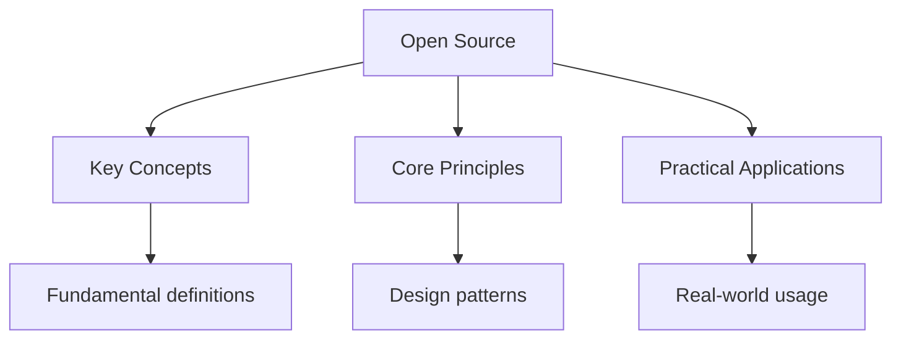

---

date: 2026-07-23T21:57:32+01:00
title: Open Source Contribution Guide
description: "General Open Source Contribution notes covering key definitions, core concepts, worked examples, and practice questions for solid revision."

---

<!-- Breadcrumb Schema for SEO -->
<script type="application/ld+json">
{
  "@context": "https://schema.org",
  "@type": "BreadcrumbList",
  "itemListElement": [{"name": "Home", "url": "https://wyattau.com"}, {"name": "tools", "url": "https://tools.wyattau.com"}, {"name": "General", "url": "https://tools.wyattau.com/general"}, {"name": "Open Source", "url": "https://tools.wyattau.com/general/open-source"}, {"name": "Open Source", "url": "https://tools.wyattau.com/general/open-source/open-source"}]
}
</script>

## Intuition

**Contributing to the commons:** Open source is like contributing to a public park — everyone benefits from the improvements you make, and you build a reputation as someone who gives back to the community that built the tools you use every day.

**Why it matters:** Contributing to open source builds real-world skills, creates a public portfolio, connects you with experienced developers, and can lead to job opportunities. It also makes the tools you depend on better for everyone.

**The key insight:** Start small — fixing a typo in documentation, improving an error message, or adding a test are all valuable contributions that maintainers appreciate and that get your foot in the door.

## Why Contribute to Open Source

Open source contribution benefits you as a systems engineer in several ways:

1. **Skill development:** You work with large, real-world codebases that are maintained by
   experienced developers. This teaches patterns and practices that are difficult to learn from
   tutorials alone.
2. **Visibility:** Your contributions are public and permanent. They serve as a portfolio that
   demonstrates your skills to potential employers and collaborators.
3. **Network:** You interact with developers from diverse backgrounds and organizations. These
   connections can lead to job opportunities, collaborations, and mentorship.
4. **Reputation:** Consistent, high-quality contributions build your reputation in the community.
   This opens doors to speaking opportunities, advisory roles, and consulting work.
5. **Giving back:** You use open source software daily (Linux, Git, Docker, Kubernetes, your editor,
   your terminal). Contributing back is professional reciprocity.

---

<!-- Breadcrumb Schema for SEO -->
<script type="application/ld+json">
{
  "@context": "https://schema.org",
  "@type": "BreadcrumbList",
  "itemListElement": [{"name": "Home", "url": "https://wyattau.com"}, {"name": "tools", "url": "https://tools.wyattau.com"}, {"name": "General", "url": "https://tools.wyattau.com/general"}, {"name": "Open Source", "url": "https://tools.wyattau.com/general/open-source"}, {"name": "Open Source", "url": "https://tools.wyattau.com/general/open-source/open-source"}]
}
</script>

## Finding the Right Project

### Good First Issues

Many projects label beginner-friendly issues:

| Label               | Meaning                           | Where to Find                 |
| ------------------- | --------------------------------- | ----------------------------- |
| `good first issue`  | Suitable for new contributors     | GitHub issue filters          |
| `first-timers-only` | Structured for absolute beginners | firsttimersonly.com           |
| `help wanted`       | Maintainers actively seeking help | GitHub issue filters          |
| `easy`              | Low complexity                    | Project-specific              |
| `documentation`     | Docs need improvement             | Often overlooked, high impact |

### Choosing a Project

Criteria for selecting a project to contribute to:

1. **You use it.** The best projects to contribute to are ones you already use. You understand the
   domain, the pain points, and the user experience.
2. **The project is active.** Check the commit frequency, issue response time, and release cadence.
   A project with no activity in 6 months is likely unmaintained.
3. **The project is welcoming.** Check the CONTRIBUTING.md file, response times on issues, and how
   maintainers interact with new contributors. Some projects are notoriously difficult to contribute
   to.
4. **The codebase is readable.** Open the source code and skim it. If you cannot understand the
   project structure within 30 minutes, consider a different project.
5. **The project matches your skills.** If you are a systems engineer, contributing to Linux kernel,
   ZFS, or infrastructure tools (Terraform, Kubernetes) leverages your strengths.

### Sources for Finding Projects

| Source            | URL                 | Best For                      |
| ----------------- | ------------------- | ----------------------------- |
| GitHub Explore    | github.com/explore  | Trending projects             |
| Good First Issue  | goodfirstissue.dev  | Filtered beginner issues      |
| First Timers Only | firsttimersonly.com | Structured beginner issues    |
| Up For Grabs      | up-for-grabs.net    | Projects seeking contributors |
| CodeTriage        | codetriage.com      | Projects needing issue triage |
| 24 Pull Requests  | 24pullrequests.com  | Holiday contribution drive    |

---

<!-- Breadcrumb Schema for SEO -->
<script type="application/ld+json">
{
  "@context": "https://schema.org",
  "@type": "BreadcrumbList",
  "itemListElement": [{"name": "Home", "url": "https://wyattau.com"}, {"name": "tools", "url": "https://tools.wyattau.com"}, {"name": "General", "url": "https://tools.wyattau.com/general"}, {"name": "Open Source", "url": "https://tools.wyattau.com/general/open-source"}, {"name": "Open Source", "url": "https://tools.wyattau.com/general/open-source/open-source"}]
}
</script>

## Understanding a New Codebase

### Where to Start

1. **README.md**. Project overview, installation, usage, and architecture.
2. **CONTRIBUTING.md**. Contribution guidelines, development setup, code style.
3. **Architecture documentation**. Some projects have `docs/architecture.md` or `docs/design/`.
4. **Directory structure**. Skim the top-level directories to understand the project layout.
5. **Entry points**. Find the `main()` function or equivalent. Trace the execution path from
   startup to the feature you are interested in.

### Code Reading Strategy

1. **Start with tests.** Tests document expected behavior. Reading tests is often faster than
   reading implementation code.
2. **Use `git log --follow`** to understand the history of a file. The commit messages explain why
   changes were made.
3. **Use the project"s search tools.** `grep -r``rg`Or the IDE's "Find in Files" to locate where a
   function is defined and used.
4. **Draw diagrams.** Sketch the component relationships, data flow, or call graph on paper. This
   forces you to understand the structure.
5. **Read the commit history of the area you are modifying.** Recent commits provide context for
   design decisions and ongoing work.

### Common Project Structures

```
project-root/
  README.md
  CONTRIBUTING.md
  LICENSE
  Makefile / Cargo.toml / go.mod / package.json
  src/           # Source code
  tests/         # Test files
  docs/          # Documentation
  examples/      # Usage examples
  scripts/       # Build, deployment, utility scripts
  .github/       # CI/CD workflows, issue templates
```

---

<!-- Breadcrumb Schema for SEO -->
<script type="application/ld+json">
{
  "@context": "https://schema.org",
  "@type": "BreadcrumbList",
  "itemListElement": [{"name": "Home", "url": "https://wyattau.com"}, {"name": "tools", "url": "https://tools.wyattau.com"}, {"name": "General", "url": "https://tools.wyattau.com/general"}, {"name": "Open Source", "url": "https://tools.wyattau.com/general/open-source"}, {"name": "Open Source", "url": "https://tools.wyattau.com/general/open-source/open-source"}]
}
</script>

## Git Workflow for Contributions

### Fork, Branch, Commit, PR

```bash
# 1. Fork the repository on GitHub (via the web interface)

# 2. Clone your fork
git clone git@github.com:yourusername/project.git
cd project

# 3. Add the upstream remote
git remote add upstream git@github.com:original/project.git

# 4. Create a feature branch
git checkout -b fix/memory-leak-in-parser

# 5. Make changes, commit
git add -p                    # Review changes interactively
git commit -m "Fix memory leak in parser

The parser allocated a buffer for each token but did not free it
when the token was consumed. This caused a leak proportional to
the input size for long-running parse operations.

Fix: free the token buffer after consumption.

Fixes #1234"

# 6. Keep your branch up to date with upstream
git fetch upstream
git rebase upstream/main

# 7. Push to your fork
git push origin fix/memory-leak-in-parser

# 8. Open a Pull Request on GitHub
```

### Commit Message Conventions

Follow the project's convention (check CONTRIBUTING). Common formats:

**Conventional Commits:**

```
<type>(<scope>): <description>

<body>

<footer>
```

Types: `feat``fix``docs``style``refactor``perf``test``build``ci``chore`

Example:

```
fix(zfs): resolve arc_meta_used double-counting

The arc_meta_used stat was incremented twice for metadata blocks
stored in the L2ARC, causing the ARC to evict data prematurely.

This resulted in a 15-20% reduction in ARC hit ratio for workloads
with large L2ARC devices.

Fixes #4521
```

### Squashing Commits Before PR

If your branch has multiple intermediate commits, squash them into a single coherent commit before
Opening the PR:

```bash
# Interactive rebase to squash commits
git rebase -i HEAD~5

# In the editor, change 'pick' to 'squash' for commits to merge
# Write a single commit message for the squashed commit
```

---

<!-- Breadcrumb Schema for SEO -->
<script type="application/ld+json">
{
  "@context": "https://schema.org",
  "@type": "BreadcrumbList",
  "itemListElement": [{"name": "Home", "url": "https://wyattau.com"}, {"name": "tools", "url": "https://tools.wyattau.com"}, {"name": "General", "url": "https://tools.wyattau.com/general"}, {"name": "Open Source", "url": "https://tools.wyattau.com/general/open-source"}, {"name": "Open Source", "url": "https://tools.wyattau.com/general/open-source/open-source"}]
}
</script>

## Writing Good Pull Requests

### PR Description Template

```markdown



## Summary

Brief description of what this PR does and why.

## Changes

- Detailed list of changes
- With context for each change

## Testing

- How you tested the changes
- Test results (pass/fail, benchmarks)

## Related Issues

Fixes #1234 Related to #5678

## Screenshots (if applicable)

Before/after comparison

## Notes

Any caveats, follow-up work, or questions for reviewers
```

### PR Best Practices

1. **Keep PRs small.** Under 400 lines of meaningful change. Large PRs take longer to review and are
   more likely to have bugs. Break large changes into a series of smaller PRs.
2. **Self-review before requesting review.** Run lint, typecheck, and tests. Review your own diff.
3. **Provide context.** Explain the problem, the solution, and why this approach was chosen.
4. **Include tests.** Every bug fix should include a test that reproduces the bug and verifies the
   fix. Every new feature should include tests.
5. **Be responsive.** Address review feedback promptly. If a reviewer requests changes, make them
   and push to the same branch (the PR updates automatically).

---

<!-- Breadcrumb Schema for SEO -->
<script type="application/ld+json">
{
  "@context": "https://schema.org",
  "@type": "BreadcrumbList",
  "itemListElement": [{"name": "Home", "url": "https://wyattau.com"}, {"name": "tools", "url": "https://tools.wyattau.com"}, {"name": "General", "url": "https://tools.wyattau.com/general"}, {"name": "Open Source", "url": "https://tools.wyattau.com/general/open-source"}, {"name": "Open Source", "url": "https://tools.wyattau.com/general/open-source/open-source"}]
}
</script>

## Code Review Etiquette

### As a Reviewer

- **Be constructive, not critical.** "This would be clearer if..." not "This is confusing."
- **Distinguish blocking from non-blocking.** "Nit:" prefix for style suggestions.
- **Explain your reasoning.** "This creates a race condition because..." not "This is wrong."
- **Review the code, not the author.** Attack the technical decision, not the person.
- **Be timely.** Try to review within 24–48 hours. Delayed reviews block the contributor.

### As a Contributor Being Reviewed

- **Do not take feedback personally.** Code review is about the code, not you.
- **Ask for clarification.** If you do not understand a review comment, ask.
- **Push back respectfully.** If you disagree with a suggestion, explain your reasoning. Review is a
  dialogue, not a directive.
- **Thank the reviewer.** They are volunteering their time to improve your code.

---

<!-- Breadcrumb Schema for SEO -->
<script type="application/ld+json">
{
  "@context": "https://schema.org",
  "@type": "BreadcrumbList",
  "itemListElement": [{"name": "Home", "url": "https://wyattau.com"}, {"name": "tools", "url": "https://tools.wyattau.com"}, {"name": "General", "url": "https://tools.wyattau.com/general"}, {"name": "Open Source", "url": "https://tools.wyattau.com/general/open-source"}, {"name": "Open Source", "url": "https://tools.wyattau.com/general/open-source/open-source"}]
}
</script>

## Licensing Considerations

### Common Open Source Licenses

| License      | Copyleft | Patent Grant | Commercial Use | Distribution Requirement |
| ------------ | -------- | ------------ | -------------- | ------------------------ |
| MIT          | No       | No           | Yes            | Include license          |
| Apache 2.0   | No       | Yes          | Yes            | Include license, notice  |
| GPL v3       | Yes      | No           | Yes            | Source code disclosure   |
| BSD 2-Clause | No       | No           | Yes            | Include license          |
| Unlicense    | No       | No           | Yes            | None                     |

### CLA vs. DCO

Some projects require a Contributor License Agreement (CLA) or a Developer Certificate of Origin
(DCO):

- **CLA:** A legal agreement where you grant the project a license to your contributions. Some
  projects (Apache, Google) require this. It is a one-time web form.
- **DCO:** A lightweight alternative where you certify that your contribution is your own work (or
  you have the right to submit it) by adding a `Signed-off-by:` line to your commit message.

```bash
## DCO sign-off
git commit -s -m "Fix memory leak in parser"
```

---

<!-- Breadcrumb Schema for SEO -->
<script type="application/ld+json">
{
  "@context": "https://schema.org",
  "@type": "BreadcrumbList",
  "itemListElement": [{"name": "Home", "url": "https://wyattau.com"}, {"name": "tools", "url": "https://tools.wyattau.com"}, {"name": "General", "url": "https://tools.wyattau.com/general"}, {"name": "Open Source", "url": "https://tools.wyattau.com/general/open-source"}, {"name": "Open Source", "url": "https://tools.wyattau.com/general/open-source/open-source"}]
}
</script>

## Maintaining a Project

### Issue Triage

1. **Label new issues** with appropriate tags (bug, feature, documentation, question).
2. **Reproduce bugs** and ask for additional information if the report is incomplete.
3. **Close stale issues** that have no activity for 30–60 days (with a warning comment first).
4. **Prioritize** based on severity, user impact, and alignment with project goals.

### Release Management

- **Semantic Versioning (SemVer):** `MAJOR.MINOR.PATCH` (e.g., `2.1.0`). MAJOR for breaking changes,
  MINOR for new features, PATCH for bug fixes.
- **Changelog:** Maintain a CHANGELOG.md documenting all changes per release.
- **Release notes:** Write a summary of the release highlighting key changes.
- **Tag releases:** `git tag -a v2.1.0 -m "Release v2.1.0"`.

### Semantic Versioning

| Change Type                       | Version Bump | Example        |
| --------------------------------- | ------------ | -------------- |
| Breaking API change               | MAJOR        | 1.x.x to 2.0.0 |
| New feature (backward compatible) | MINOR        | 1.0.x to 1.1.0 |
| Bug fix (backward compatible)     | PATCH        | 1.0.0 to 1.0.1 |

---

<!-- Breadcrumb Schema for SEO -->
<script type="application/ld+json">
{
  "@context": "https://schema.org",
  "@type": "BreadcrumbList",
  "itemListElement": [{"name": "Home", "url": "https://wyattau.com"}, {"name": "tools", "url": "https://tools.wyattau.com"}, {"name": "General", "url": "https://tools.wyattau.com/general"}, {"name": "Open Source", "url": "https://tools.wyattau.com/general/open-source"}, {"name": "Open Source", "url": "https://tools.wyattau.com/general/open-source/open-source"}]
}
</script>

## Building a Portfolio Through Open Source

### Strategies

1. **Contribute to projects you use daily.** Your contributions will be motivated by real needs and
   your expertise in the domain will show.
2. **Start with documentation and tests.** These are high-impact, low-barrier contributions that
   demonstrate attention to detail.
3. **Fix real bugs.** Look at the issue tracker and find bugs you can reproduce. A bug fix PR is
   concrete evidence of debugging skill.
4. **Build a tool.** If no tool exists for a problem you face, build it and open-source it. Even a
   small utility demonstrates initiative and problem-solving ability.
5. **Maintain your contributions.** Consistent contributions over time are more impressive than a
   single large contribution.

### What Employers Look For

- **Quality over quantity.** 10 thoughtful PRs are more impressive than 100 typo fixes.
- **Diverse contributions.** Bug fixes, features, documentation, and reviews show breadth.
- **Communication skills.** How you interact in issues and PR discussions matters.
- **Domain expertise.** Contributions to Linux, ZFS, or Kubernetes demonstrate systems engineering
  depth.

---

<!-- Breadcrumb Schema for SEO -->
<script type="application/ld+json">
{
  "@context": "https://schema.org",
  "@type": "BreadcrumbList",
  "itemListElement": [{"name": "Home", "url": "https://wyattau.com"}, {"name": "tools", "url": "https://tools.wyattau.com"}, {"name": "General", "url": "https://tools.wyattau.com/general"}, {"name": "Open Source", "url": "https://tools.wyattau.com/general/open-source"}, {"name": "Open Source", "url": "https://tools.wyattau.com/general/open-source/open-source"}]
}
</script>

## Popular Communities

| Platform                   | Focus                      | Notable Projects                       |
| -------------------------- | -------------------------- | -------------------------------------- |
| GitHub                     | General                    | Most major open source projects        |
| GitLab                     | DevOps, self-hosted        | GitLab itself, many community projects |
| Codeberg                   | Privacy-focused, Fediverse | Forgejo, Mastodon                      |
| Apache Software Foundation | Enterprise software        | Kafka, Spark, Lucene                   |
| CNCF                       | Cloud native               | Kubernetes, Prometheus, Envoy          |
| Linux Foundation           | Infrastructure             | Linux kernel, Node.js, PyTorch         |

---

<!-- Breadcrumb Schema for SEO -->
<script type="application/ld+json">
{
  "@context": "https://schema.org",
  "@type": "BreadcrumbList",
  "itemListElement": [{"name": "Home", "url": "https://wyattau.com"}, {"name": "tools", "url": "https://tools.wyattau.com"}, {"name": "General", "url": "https://tools.wyattau.com/general"}, {"name": "Open Source", "url": "https://tools.wyattau.com/general/open-source"}, {"name": "Open Source", "url": "https://tools.wyattau.com/general/open-source/open-source"}]
}
</script>

## Common Pitfalls

### Starting with a Massive Codebase

Contributing to the Linux kernel or Kubernetes as your first open source contribution is
Overwhelming. Start with smaller, well-documented projects (CLI tools, libraries, documentation) and
Work your way up to larger codebases.

### Not Reading the Contribution Guidelines

Every project has its own conventions. Some require specific commit message formats, code style, or
PR templates. Not following these guidelines wastes both your time and the maintainers' time. Always
Read CONTRIBUTING.md before your first contribution.

### Abandoning PRs After Submission

Submitting a PR and then not responding to review feedback for weeks is a negative signal.
Maintainers may close stale PRs. If you cannot address feedback promptly, communicate that (e.g., "I
Will address this next week — currently traveling").

### Taking Rejection Personally

Not every PR will be accepted. Sometimes the approach does not align with the project's direction,
Or a better solution already exists. Ask for feedback, learn from the experience, and try again.
Rejection of a PR is not rejection of you as a developer.

### Working Only on Your Own Projects

Contributing only to your own repositories does not demonstrate collaboration skills. The
Interpersonal aspects of open source (code review, issue discussion, design decisions) are as
Important as the code itself. Contribute to at least one project you do not control.

## Finding and Evaluating Projects

### Evaluating Project Health

Before contributing, evaluate the project's health:

1. **Release cadence:** Is the project actively maintained? Check the GitHub "Insights" tab for
   commit frequency and release history.
2. **Issue responsiveness:** Are issues triaged and responded to within a reasonable time? Check the
   oldest open issues.
3. **PR merge rate:** Are pull requests reviewed and merged? Check the "Pull Requests" tab.
4. **Contributor diversity:** Does the project have multiple active contributors, or is it a
   one-person project?
5. **Test coverage:** Does the project have automated tests? Check for CI/CD configuration.
6. **Documentation quality:** Is the documentation up-to-date and comprehensive?

### Evaluating Project Culture

A welcoming project culture is critical for first-time contributors:

- **CONTRIBUTING.md exists and is up-to-date.**
- **Maintainer responses are respectful and constructive**, even for basic questions.
- **Good-first-issue labels are actively maintained** (not all claimed, not all stale).
- **The project has a Code of Conduct** that is enforced.
- **There is a community channel** (Discord, IRC, mailing list) where you can ask questions.

### Red Flags in Open Source Projects

- Maintainer is unresponsive to issues for months.
- All good-first-issue labels are stale (no activity in 6+ months).
- No CONTRIBUTING.md or the file is outdated.
- Aggressive or dismissive responses to PRs from new contributors.
- No tests or CI/CD configuration.
- One-person project with no bus factor.

## Codebase Comprehension Strategies

### Reading Code Top-Down

Start with the highest-level abstraction and work down:

1. **README.md:** What does the project do? How is it structured?
2. **Entry point:** Where does execution begin? (`main()``index.js``app.py`)
3. **Configuration:** What are the default settings? What can be configured?
4. **Core module:** What is the central abstraction or data structure?
5. **Plugin/extension points:** How is the system extended?

### Reading Code Bottom-Up

Start with tests and work up to understand the implementation:

1. **Test files:** What behavior is expected? What edge cases are handled?
2. **Data models/types:** What are the core data structures?
3. **Utility functions:** What common operations are performed?
4. **Core logic:** How do the pieces fit together?

### Using IDE Features for Code Comprehension

- **"Go to Definition" (F12):** Follow function and type references.
- **"Find All References" (Shift+F12):** See everywhere a function/type is used.
- **"Call Hierarchy":** Trace function call chains.
- **"Type Hierarchy":** Understand inheritance and interface relationships.
- **Git Blame:** See who wrote each line and when (and why, via commit message).

## Advanced Git Workflows

### Interactive Rebase

```bash
## Rebase the last 5 commits interactively
git rebase -i HEAD~5

# Common operations:
# pick    — Keep the commit as-is
# reword  — Edit the commit message
# squash  — Combine with the previous commit
# fixup   — Squash (keeping previous commit message)
# drop    — Remove the commit
# edit    — Pause rebase to amend the commit
```

### Cherry-Picking

```bash
# Apply a specific commit from another branch
git cherry-pick <commit-hash>

# Cherry-pick a range of commits
git cherry-pick <start-hash>..<end-hash>

# Cherry-pick without committing (for inspection)
git cherry-pick --no-commit <commit-hash>
```

### Bisecting to Find Bug-Introducing Commits

```bash
# Start a binary search for the commit that introduced a bug
git bisect start
git bisect bad                    # Current version has the bug
git bisect good <known-good-hash> # This version did not have the bug

# Git checks out the midpoint commit
# Test it:
git bisect good                  # Bug not present
# or:
git bisect bad                   # Bug present

# Continue until Git identifies the specific commit
git bisect reset                  # End bisect (return to original branch)
```

## Writing High-Quality Pull Requests

### PR Description Template

```markdown
## Summary

One-sentence description of what this PR does.

## Problem

What problem does this solve? Link to the issue.

## Solution

How does this PR solve the problem? Why this approach?

## Changes

- Component A: What changed and why
- Component B: What changed and why
- Component C: What changed and why

## Testing

- [ ] Unit tests pass
- [ ] Integration tests pass
- [ ] Manual testing steps documented
- [ ] Performance benchmarks included (if applicable)

## Screenshots

Before/after comparison for UI changes.

## Breaking Changes

List any breaking changes and migration steps.

## Notes

Open questions, follow-up work, or known limitations.
```

### Self-Review Checklist

Before requesting review, verify:

- [ ] Code compiles without errors
- ] Linter passes with no warnings
- [ ] Tests pass (unit + integration)
- [ ] New code has appropriate test coverage
- ] Documentation is updated
- ] Commit messages follow the project convention
- ] No debug code, TODOs, or commented-out code
- [ ] No hardcoded secrets, API keys, or credentials
- [ ] Dependencies are pinned to specific versions
- [ ] The PR is minimal (no unrelated changes)

## Code Review as a Learning Tool

Reading other people's code is one of the most effective ways to improve as a developer:

1. **Review code from projects you admire.** How do experienced developers structure their code?
2. **Pay attention to error handling.** How do they handle edge cases?
3. **Study test patterns.** What do they test? How do they structure tests?
4. **Learn naming conventions.** How do they name variables, functions, and modules?
5. **Observe architecture decisions.** Why did they choose this abstraction?

## Building Long-Term Relationships

### Becoming a Trusted Contributor

Trust is built incrementally:

1. **First 5 PRs:** Small, well-scoped changes (typo fixes, documentation). Demonstrate that you
   follow the project's conventions.
2. **Next 10 PRs:** Bug fixes and small features. Show you can work independently.
3. **Next 10 PRs:** Larger features and architectural improvements. Show design thinking.
4. **Ongoing:** Code reviews, mentoring, triage, release management. Become a maintainer.

### Dealing with Rejection

If your PR is closed without merge:

1. **Ask for feedback.** If no feedback was provided, politely ask what could be improved.
2. **Do not argue.** If the maintainer says "this doesn't fit the project direction," accept it.
3. **Iterate.** If feedback was provided, address it and resubmit.
4. **Move on.** If the project is not interested, find one that is. Your time is valuable.

## Common Pitfalls (Extended)

### The "Not Good Enough" Trap

Many potential contributors believe their code is "not good enough" to submit. This is a cognitive
Bias — everyone's code has room for improvement. Submit imperfect code and let the review process
Improve it. A beginner's PR with one issue fixed is infinitely more valuable than a perfect PR that
Was never submitted.

### Contributing Only to Fix Your Own Bugs

If you use an open source project and find a bug, fix it and submit a PR. This is the most natural
Way to start contributing — you are already motivated by your own use case. The maintainer will
Appreciate the fix regardless of your experience level.

### Ignoring Non-Code Contributions

Open source projects need more than code:

- **Documentation:** Improving READMEs, tutorials, and API docs.
- **Issue triage:** Reproducing and categorizing issues.
- **Community support:** Answering questions in forums and issue trackers.
- **Testing:** Writing tests for uncovered code paths.
- **Design:** Contributing to RFCs and design discussions.

These contributions are often more valuable than code because they multiply the effectiveness of all
Other contributors.

## Monorepo vs Polyrepo for Open Source Projects

The choice between monorepo and polyrepo affects contribution workflow, CI/CD complexity, and
Dependency management. Understanding the trade-offs helps you navigate different project structures.

### Monorepo Characteristics

| Aspect                | Monorepo                                 | Polyrepo                               |
| --------------------- | ---------------------------------------- | -------------------------------------- |
| Examples              | Google, Meta, Babel, React               | Linux kernel, most npm packages        |
| Dependency management | Shared in-tree, always up to date        | Versioned separately, can drift        |
| CI/CD                 | Complex (needs change detection)         | Simple per-repo pipelines              |
| Code reuse            | Trivial (same repo)                      | Requires published packages            |
| Onboarding            | Larger clone, but single source of truth | Smaller clones, but more repos to find |
| Branching model       | Feature branches across all packages     | Independent per-package branches       |

### Build Systems for Monorepos

```bash
# Nx (TypeScript/JavaScript ecosystem)
npx create-nx-workspace@latest my-monorepo
npx nx run-many --target=build --all
npx nx affected --target=test --base=main

# Turborepo (simpler alternative)
npx create-turbo@latest my-monorepo
npx turbo run build --filter=package-a
npx turbo run test --filter=...package-b

# Bazel (language-agnostic, used by Google)
# BUILD file example:
cc_library(
    name = "math_utils",
    srcs = ["math_utils.cc"],
    hdrs = ["math_utils.h"],
)
cc_binary(
    name = "calculator",
    srcs = ["main.cc"],
    deps = [":math_utils"],
)
```

### When to Choose Which

- **Monorepo** when: packages are tightly coupled, you want atomic commits across packages, the team
  is small enough to manage repo complexity.
- **Polyrepo** when: packages are independently versioned and released, different teams own
  different packages, you want minimal CI/CD coupling.

## Testing Infrastructure for Open Source

A robust testing setup lowers the barrier for contributors by catching issues before review and
Providing confidence that changes do not break existing functionality.

### Test Pyramid

```
        /  E2E  \           Few, slow, expensive
       / Integration \       Moderate
      /  Unit Tests   \      Many, fast, cheap
```

### CI/CD Pipeline Configuration

A typical open-source CI pipeline using GitHub Actions:

```yaml
name: CI
on:
  push:
    branches: [main]
  pull_request:
    branches: [main]
jobs:
  lint:
    runs-on: ubuntu-latest
    steps:
      - uses: actions/checkout@v4
      - uses: actions/setup-node@v4
        with:
          node-version: "20''
      - run: npm ci
      - run: npm run lint
      - run: npm run typecheck

  test:
    runs-on: ubuntu-latest
    strategy:
      matrix:
        node-version: [18, 20, 22]
    steps:
      - uses: actions/checkout@v4
      - uses: actions/setup-node@v4
        with:
          node-version: ${{ matrix.node-version }}
      - run: npm ci
      - run: npm test -- --coverage
      - uses: codecov/codecov-action@v3
        with:
          token: ${{ secrets.CODECOV_TOKEN }}

  integration:
    needs: test
    runs-on: ubuntu-latest
    steps:
      - uses: actions/checkout@v4
      - run: docker compose up --build --abort-on-container-exit
      - run: npm run test:integration
```

### Test Categories for Systems Software

| Test Type        | Scope                         | Tools                          | Examples                                  |
| ---------------- | ----------------------------- | ------------------------------ | ----------------------------------------- |
| Unit             | Single function/module        | pytest, jest, go test          | Testing a hash function                   |
| Integration      | Multiple components           | docker-compose, testcontainers | API + database interaction                |
| Contract         | API compatibility             | Pact, OpenAPI validation       | Ensuring API changes do not break clients |
| Property-based   | Input space exploration       | QuickCheck, Hypothesis         | Verifying sort is idempotent              |
| Fuzzing          | Security and crash resistance | libFuzzer, AFL                 | Finding buffer overflows                  |
| Load/Performance | Under stress                  | k6, wrk, locust                | Verifying latency under 10k RPS           |

## License Compatibility Matrix

When contributing to open source, understanding license compatibility prevents legal issues for both
You and the project. The most common licenses in systems software:

| License        | Commercial Use | Modify | Distribute               | Patent Grant | Copyleft     |
| -------------- | -------------- | ------ | ------------------------ | ------------ | ------------ |
| MIT            | Yes            | Yes    | Yes                      | No           | No           |
| Apache 2.0     | Yes            | Yes    | Yes                      | Yes          | No           |
| BSD 2/3-Clause | Yes            | Yes    | Yes                      | No           | No           |
| GPL 2.0        | Yes            | Yes    | Yes (source required)    | No           | Strong       |
| GPL 3.0        | Yes            | Yes    | Yes (source required)    | Yes          | Strong       |
| LGPL           | Yes            | Yes    | Yes (dynamic linking ok) | No           | Weak         |
| AGPL 3.0       | Yes            | Yes    | Yes (network use counts) | Yes          | Network      |
| BSL 1.1        | Varies         | Varies | Varies                   | Yes          | No (delayed) |
| Unlicense      | Yes            | Yes    | Yes                      | No           | No           |

### Key Compatibility Rules

1. **MIT/Apache/BSD code can be included in GPL projects.** The GPL project must honor the original
   license for those specific files, but the overall project remains GPL.
2. **GPL code cannot be included in MIT/Apache projects.** This would violate the GPL"s copyleft
   requirement because the MIT project does not require source distribution.
3. **Apache 2.0 and GPL 3.0 are compatible** (Apache 2.0 has an explicit GPL 3.0 compatibility
   clause). Apache 2.0 and GPL 2.0 are not compatible due to patent clause differences.
4. **When in doubt, ask the project maintainer.** Most maintainers are happy to clarify their
   licensing intentions.

## Maintainer Responsibilities

As you progress from contributor to maintainer, your responsibilities shift from writing code to
Enabling others to write code. This is a significant mindset change.

### The Maintainer's Job Description

A maintainer's primary responsibilities, in rough order of time spent:

1. **Reviewing pull requests:** The single most time-consuming activity. Good reviews are thorough
   but constructive.
2. **Triaging issues:** Categorizing, reproducing, and prioritizing bug reports.
3. **Project planning:** Defining the roadmap, setting milestones, and making design decisions.
4. **Writing documentation:** Keeping docs current as the codebase evolves.
5. **Writing code:** Maintainers still write code, but it becomes a smaller fraction of their time.
6. **Community management:** Welcoming new contributors, enforcing the code of conduct, handling
   disputes.
7. **Release management:** Tagging releases, writing changelogs, managing semantic versioning.

### Release Management

```bash
# Semantic versioning cheat sheet
# MAJOR.MINOR.PATCH
# MAJOR: Breaking changes (remove API, change behavior)
# MINOR: New features (add API, new functionality)
# PATCH: Bug fixes (no API changes)

# Conventional Commits for automated changelog generation
git commit -m "feat(auth): add OAuth2 support"
git commit -m "fix(api): handle null response from user endpoint"
git commit -m "breaking!: change default timeout from 30s to 10s"

# Generate changelog from conventional commits
npx conventional-changelog-cli -p angular -i CHANGELOG.md -s

# Tag and release
git tag -a v2.1.0 -m "Release 2.1.0"
git push origin v2.1.0
gh release create v2.1.0 --title "v2.1.0" --notes "$(cat CHANGELOG.md | head -50)"
```

### Handling Burnout as a Maintainer

Maintainer burnout is endemic in open source. Signs include dreading issue notifications,
Procrastinating on reviews, and feeling resentment toward contributors.

**Mitigation strategies:**

- **Set expectations :** Document response time expectations (e.g., "PRs are reviewed within 7
  days"). This reduces contributor anxiety and your guilt.
- **Rotate maintainers:** If possible, share maintainer duties with others. A bus factor of 1 is a
  project risk, not a badge of honor.
- **Use a CONTRIBUTING.md:** A well-written contribution guide answers 80% of newcomer questions and
  reduces maintainer overhead.
- **Take breaks:** It is acceptable to announce "I will be away for 2 weeks" and close issues with a
  polite note.

## Popular Open Source Communities

Finding the right community is as important as finding the right project. Communities differ in
Culture, responsiveness, and newcomer friendliness.

### Community Comparison

| Community         | Primary Language | Culture                        | Newcomer Friendliness                         |
| ----------------- | ---------------- | ------------------------------ | --------------------------------------------- |
| Kubernetes (CNCF) | Go               | Formal, governance-heavy       | Good docs, steep learning curve               |
| Rust              | Rust             | Welcoming, thorough review     | Excellent, many "good first issue"            |
| Python            | Python           | Pragmatic, diverse             | Very welcoming, clear contribution guide      |
| Arch Linux        | C, Shell         | Technical, opinionated         | Good wiki, IRC/Matrix support                 |
| NixOS             | Nix              | Academic, thorough             | Growing, helpful Matrix community             |
| Linux Kernel      | C                | Meritocratic, strict           | Challenging, requires patch submission        |
| PostgreSQL        | C                | Professional, consensus-driven | Good contribution guide, mailing list culture |
| Home Assistant    | Python           | Community-focused              | Very welcoming, active Discord                |

### Finding Your Niche

```bash
# Search GitHub for "good first issue" in topics you care about
gh search issues --label="good first issue" --language=go --limit 20

# Find repos with high activity but few contributors (opportunity)
gh api repos -q '.[] | select(.stargazers_count > 1000 and .forks_count < 50) | .full_name'

# Explore trending repos in your area
gh api search/repositories -q '.items[].full_name' --method GET \
  -f q="stars:>5000 topic:devops" -f sort=stars
```

## Code Review Etiquette (Extended)

### Giving Reviews

- **Review the code, not the person.** Never say "you made a mistake." Say "this function has a
  potential issue" or "consider an alternative approach here."
- **Distinguish blocking from non-blocking comments.** Use `nit:` or `suggestion:` prefixes for
  non-blocking feedback.
- **Explain why, not just what.** "This should use `const`" is less helpful than "This should use
  `const` because the value is never reassigned, making the intent clearer."
- **Acknowledge good work.** "This is a clean implementation of the algorithm" goes a long way
  toward making reviews feel collaborative rather than adversarial.
- **Keep reviews small.** PRs over 400 lines of changes are hard to review thoroughly. If a PR is
  too large, ask for it to be split.

### Receiving Reviews

- **Do not take it personally.** A review of your code is not a review of your competence.
- **Ask for clarification.** If a review comment is unclear, ask. Do not guess at the intent.
- **Push back respectfully.** If you disagree with a suggestion, explain your reasoning. Maintainers
  are not always right.
- **Separate concerns.** If a review introduces scope creep, suggest addressing it in a follow-up
  PR.

### Example Review Comments

**Blocking:**

```
This function panics if `config.port` is 0. Port 0 is a valid value that tells the OS to
assign an ephemeral port. Please handle this case explicitly.
```

**Non-blocking suggestion:**

```
nit: Consider using `strings.Builder` here instead of string concatenation. It avoids
allocating intermediate strings. Not blocking since this is not in a hot path.
```

**Positive feedback:**

```
The error handling here is thorough. I like that you are wrapping the underlying error with
context about which operation failed. This will make debugging much easier.
```

## Worked Examples

**Example 1: Applying key concepts**

When working with open source contribution guide, follow a structured approach:

1. Identify the key concepts and definitions relevant to the question
2. Apply the appropriate methods, equations, or frameworks
3. Support your answer with evidence, examples, or calculations
4. Evaluate your answer critically, considering limitations and alternative perspectives

## See Also

- [Open Source](./)
- [General](..)
