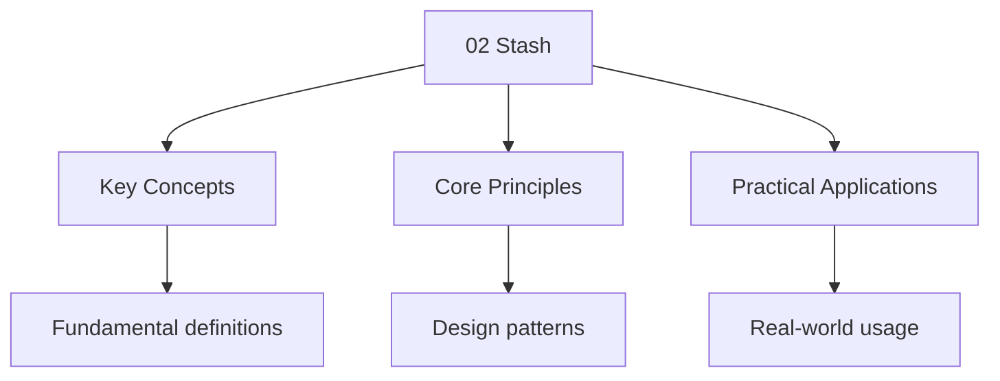

---

title: "Stash | Tools - Wyatt's Notes"
description: "temporarily shelves changes in your working directory and index, restoring your repository to a clean state (matching HEAD). It is a stack-based mechanism —"
date: 2025-06-03T09:00:00.000Z
tags:
  - git
  - advanced
  - stash
categories:
  - CS

---

<!-- Breadcrumb Schema for SEO -->
<script type="application/ld+json">
{
  "@context": "https://schema.org",
  "@type": "BreadcrumbList",
  "itemListElement": [{"name": "Home", "url": "https://wyattau.com"}, {"name": "tools", "url": "https://tools.wyattau.com"}, {"name": "Git", "url": "https://tools.wyattau.com/git"}, {"name": "05 Advanced Topics", "url": "https://tools.wyattau.com/git/05-advanced-topics"}, {"name": "02 Stash", "url": "https://tools.wyattau.com/git/05-advanced-topics/02-stash"}]
}
</script>




## What is Stash

`git stash` temporarily shelves changes in your working directory and index, restoring your
repository to a clean state (matching HEAD). It is a stack-based mechanism — you can push multiple
stashes and pop them in LIFO order.

### When to Use Stash

- Switching branches with uncommitted work you cannot commit yet.
- Pulling remote changes that conflict with your local work.
- Running a quick test on a clean working directory.
- Context-switching between tasks.

## Common Commands

```bash
git stash                    # Stash all modified tracked files
git stash -u                 # Stash including untracked files
git stash -m "WIP: auth"     # Stash with a descriptive message
git stash list               # Show all stashes
git stash pop                # Apply and remove most recent stash
git stash apply              # Apply without removing
git stash drop               # Remove most recent stash
git stash clear              # Remove all stashes
git stash show -p            # Show diff of most recent stash
```

## Common Pitfalls

1. **Forgetting stash is branch-specific**: Stashes live in the repository,
   not on a branch. You can apply a stash from any branch, but merge
   conflicts may arise if the working tree has diverged.
2. **Stashing dirty state**: Stash only saves tracked file changes. Untracked
   files require `git stash -u`. New files added after a stash are not
   captured.
3. **Losing stashes**: `git stash clear` is destructive and irreversible.
   Use `git stash list` before clearing to verify what you are discarding.

## Summary

`git stash` temporarily shelves changes in your working directory, restoring
the repository to a clean state matching HEAD. It uses a stack-based mechanism
(LIFO order) for multiple stashes. Key commands include `git stash` (create),
`git stash pop` (apply and remove), `git stash apply` (apply without removing),
and `git stash list` (show all stashes). Use `-u` to include untracked files
and `-m` for descriptive messages. Stashes are stored in the repository, not
on a branch, so they can be applied from any branch but may cause merge
conflicts if the working tree has diverged.

## Worked Examples

### Example 1: Quick Task Switch

You are working on feature A but need to fix a bug on main.

```bash
git stash -m "WIP: feature A"
git checkout main
# fix the bug, commit, push
git checkout feature-branch
git stash pop
```

### Example 2: Stashing Untracked Files

You have new files that are not yet tracked by Git.

```bash
git stash -u -m "Include new files"
# Now working directory is clean, including untracked files
git stash pop
```

## Cross-References

- [Git Fundamentals](../02-fundamentals/01-basics.md) - Basic Git commands
- [Git Branching](../03-branching-and-merging/01-branching.md) - Branch management
