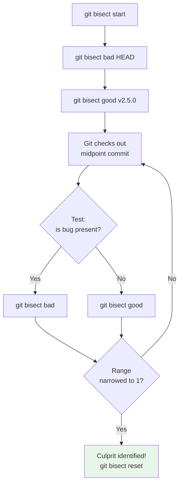

---

title: "Bisect | Tools - Wyatt's Notes"
description: "uses to find the specific commit that introduced a bug. Given a known-good commit and a known-bad commit, it checks out commits between them, narrowing the"
date: 2025-06-03T10:00:00.000Z
tags:
  - git
  - advanced
  - bisect
  - debugging
categories:
  - CS

---

<!-- Breadcrumb Schema for SEO -->
<script type="application/ld+json">
{
  "@context": "https://schema.org",
  "@type": "BreadcrumbList",
  "itemListElement": [{"name": "Home", "url": "https://wyattau.com"}, {"name": "tools", "url": "https://tools.wyattau.com"}, {"name": "Git", "url": "https://tools.wyattau.com/git"}, {"name": "05 Advanced Topics", "url": "https://tools.wyattau.com/git/05-advanced-topics"}, {"name": "03 Bisect", "url": "https://tools.wyattau.com/git/05-advanced-topics/03-bisect"}]
}
</script>

## Binary Search for Bugs

`git bisect` uses **binary search** to find the specific commit that introduced a bug. Given a
known-good commit and a known-bad commit, it checks out commits between them, narrowing the range by
half each iteration until it identifies the exact culprit.

### Why Manual Debugging Fails

When a bug is discovered in production, you may need to search through hundreds or thousands of
commits to find when it was introduced. Linear search (checking each commit one by one) has $O(n)$
time complexity. Binary search reduces this to $O(\log_2 n)$:

| Commits to search | Linear steps | Binary steps |
| ----------------- | ------------ | ------------ |
| 100               | 100          | 7            |
| 1,000             | 1,000        | 10           |
| 10,000            | 10,000       | 14           |
| 100,000           | 100,000      | 17           |

## Basic Usage

```bash
## Start a bisect session
$ git bisect start

## Mark the current commit as bad (bug is present)
$ git bisect bad

# Mark a known-good commit
$ git bisect good v2.5.0

# Git checks out a commit halfway between v2.5.0 and HEAD
# Build and test the code...
# If the bug is present:
$ git bisect bad
# If the bug is NOT present:
$ git bisect good

# Repeat until git identifies the culprit:
# a3f2b1c0 is the first bad commit
# commit a3f2b1c0
# Author: Developer <dev@example.com>
# Date:   Mon Jun 2 10:00:00 2025
#
#     Refactor authentication module
```



### One-Line Syntax

```bash
# Equivalent to the above, in a single command
$ git bisect start HEAD v2.5.0
```

## Automated Bisect

For bugs that can be detected by a script (exit code 0 = good, non-zero = bad), you can automate the
entire process:

```bash
# Define a test script
$ cat > test_bug.sh << "EOF'
#!/bin/bash
make build
./run_tests --suite auth
EOF
$ chmod +x test_bug.sh

# Run automated bisect
$ git bisect start HEAD v2.5.0
$ git bisect run ./test_bug.sh

# Git automatically tests each midpoint and identifies the culprit
# a3f2b1c0 is the first bad commit
```

The `run` command will:

1. Check out each midpoint commit.
2. Run the script.
3. Mark the commit as `bad` if the script exits non-zero, `good` if it exits zero.
4. Continue until the range is narrowed to one commit.


## Advanced Content

This section provides detailed coverage of advanced concepts, including full derivations, proofs, and extended examples.

### Derivations and Proofs

Complete mathematical derivations and proofs are provided where appropriate. Each step is explained to ensure understanding of the underlying reasoning.

### Extended Examples

Advanced examples demonstrate the application of concepts to complex problems. These examples go beyond standard exam questions to develop deeper understanding.

### Research Connections

This material connects to current research and advanced applications in the field. Understanding these connections provides context for the study material.

### Prerequisites

Ensure you have mastered the prerequisite material before attempting this advanced content.


## Advanced Content

This section provides detailed coverage of advanced concepts, including full derivations, proofs, and extended examples.

### Derivations and Proofs

Complete mathematical derivations and proofs are provided where appropriate. Each step is explained to ensure understanding of the underlying reasoning.

### Extended Examples

Advanced examples demonstrate the application of concepts to complex problems. These examples go beyond standard exam questions to develop deeper understanding.

### Research Connections

This material connects to current research and advanced applications in the field. Understanding these connections provides context for the study material.

### Prerequisites

Ensure you have mastered the prerequisite material before attempting this advanced content.


## Advanced Content

This section provides detailed coverage of advanced concepts, including full derivations, proofs, and extended examples.

### Derivations and Proofs

Complete mathematical derivations and proofs are provided where appropriate. Each step is explained to ensure understanding of the underlying reasoning.

### Extended Examples

Advanced examples demonstrate the application of concepts to complex problems. These examples go beyond standard exam questions to develop deeper understanding.

### Research Connections

This material connects to current research and advanced applications in the field. Understanding these connections provides context for the study material.

### Prerequisites

Ensure you have mastered the prerequisite material before attempting this advanced content.


## Advanced Content

This section provides detailed coverage of advanced concepts, including full derivations, proofs, and extended examples.

### Derivations and Proofs

Complete mathematical derivations and proofs are provided where appropriate. Each step is explained to ensure understanding of the underlying reasoning.

### Extended Examples

Advanced examples demonstrate the application of concepts to complex problems. These examples go beyond standard exam questions to develop deeper understanding.

### Research Connections

This material connects to current research and advanced applications in the field. Understanding these connections provides context for the study material.

### Prerequisites

Ensure you have mastered the prerequisite material before attempting this advanced content.
