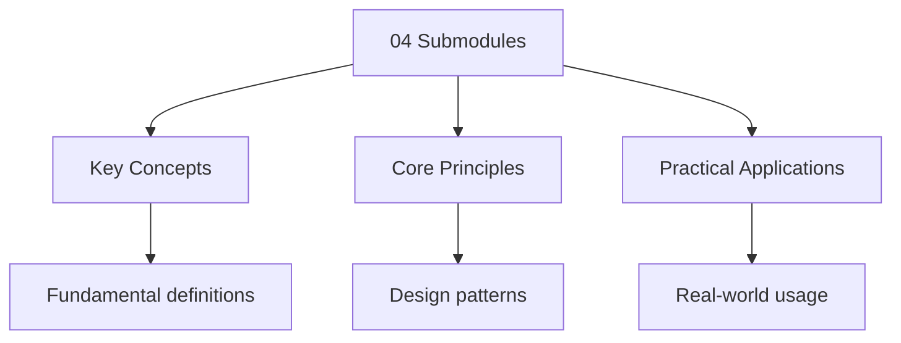

---

title: "Submodules | Tools - Wyatt's Notes"
description: "Git submodules allow you to embed one Git repository inside another. The parent repository records a to a specific commit of the submodule repository — not"
date: 2025-06-03T11:00:00.000Z
tags:
  - git
  - advanced
  - submodules
categories:
  - CS

---

<!-- Breadcrumb Schema for SEO -->
<script type="application/ld+json">
{
  "@context": "https://schema.org",
  "@type": "BreadcrumbList",
  "itemListElement": [{"name": "Home", "url": "https://wyattau.com"}, {"name": "tools", "url": "https://tools.wyattau.com"}, {"name": "Git", "url": "https://tools.wyattau.com/git"}, {"name": "05 Advanced Topics", "url": "https://tools.wyattau.com/git/05-advanced-topics"}, {"name": "04 Submodules", "url": "https://tools.wyattau.com/git/05-advanced-topics/04-submodules"}]
}
</script>




## What Are Submodules

Git submodules allow you to embed one Git repository inside another. The parent repository records a
**reference** to a specific commit of the submodule repository — not the files themselves. This
enables you to:

- Include external libraries or dependencies as source code.
- Share code across multiple projects.
- Track third-party dependencies at specific versions.

## How Submodules Work

A submodule is essentially a **Git repository within a subdirectory** of your main repository,
tracked by a special entry in the parent"s `.gitmodules` file and tree:

```
parent-repo/
├── .gitmodules          # Records submodule paths and URLs
├── src/
│   └── lib/             # Submodule directory
│       ├── .git         # Pointer to .git/modules/lib/
│       ├── README.md
│       └── lib.c
└── main.c
```

### `.gitmodules` File

```ini
[submodule "src/lib"]
    path = src/lib
    url = https://github.com/org/library.git
    branch = main
```

### Tree Entry

The parent repository's tree records the submodule as a special entry with mode `160000` (a Gitlink
— a commit reference, not a file or directory):

```bash
$ git ls-tree HEAD src/lib
160000 commit a3f2b1c0d1e2f3a4b5c6d7e8f9a0b1c2d3e4f5a6  src/lib
```

This means the parent repository knows **only** that `src/lib` should be at commit `a3f2b1c`. It
does not store any of the submodule's files.

## Basic Operations

### Adding a Submodule

```bash
## Add a submodule at a specific path
$ git submodule add https://github.com/org/library.git src/lib

## Add at a specific commit
$ git submodule add -b v2.0 https://github.com/org/library.git src/lib

# Add from a local path
$ git submodule add ../shared-lib src/lib
```

### Cloning with Submodules

```bash
# Clone the parent repository (submodules are empty by default)
$ git clone https://github.com/user/project.git

# Initialize and clone all submodules
$ git submodule init
$ git submodule update

# Or do both in one step
$ git clone --recurse-submodules https://github.com/user/project.git

# Initialize submodules after cloning
$ git submodule update --init --recursive
```
