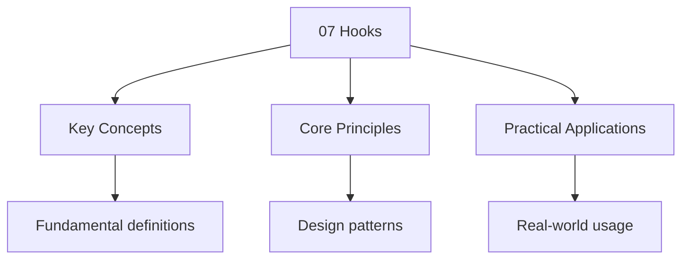

---

date: 2026-07-23T21:57:32+01:00
title: "Git Hooks | Tools - Wyatt's Notes"
description: "Git hooks are scripts that Git executes automatically before or after specific events in the Repository lifecycle — commits, pushes, rebases, checkouts, and"

---

<!-- Breadcrumb Schema for SEO -->
<script type="application/ld+json">
{
  "@context": "https://schema.org",
  "@type": "BreadcrumbList",
  "itemListElement": [{"name": "Home", "url": "https://wyattau.com"}, {"name": "tools", "url": "https://tools.wyattau.com"}, {"name": "Git", "url": "https://tools.wyattau.com/git"}, {"name": "05 Advanced Topics", "url": "https://tools.wyattau.com/git/05-advanced-topics"}, {"name": "07 Hooks", "url": "https://tools.wyattau.com/git/05-advanced-topics/07-hooks"}]
}
</script>

## Intuition

Git hooks are automation points that fire at specific moments in the Git workflow, like pre-commit checks that run linters before allowing a commit, or pre-push hooks that run tests before allowing a push. Client-side hooks enforce local conventions and catch issues early, while server-side hooks enforce repository-wide policies that cannot be bypassed. The hook's exit code is the enforcement mechanism: zero means proceed, anything else means abort. Understanding hook lifecycle helps you build automated quality gates into your development process.

## Hook Lifecycle

Git hooks are scripts that Git executes automatically before or after specific events in the
Repository lifecycle — commits, pushes, rebases, checkouts, and so on. They live at the boundary
Between your workflow and Git"s internal state machine, and they are the primary mechanism for
Enforcing local policy without requiring a central server.

### When Hooks Run

Hooks execute at precisely defined points in Git's operation. There is no ambiguity about when they
Fire: the hook name encodes the event, and Git invokes it synchronously at that exact point in the
Control flow. A hook either succeeds (exit code 0) or fails (non-zero exit code). If a hook fails,
Git aborts the operation — this is the entire enforcement mechanism.

Hooks are divided into two categories based on where they execute:

**Client-side hooks** run on the local machine performing the Git operation. They are triggered by
Commands like `git commit``git push``git checkout`And `git rebase`. Client-side hooks cannot Be
enforced remotely — a user with filesystem access can always bypass them with `--no-verify`. Their
purpose is **convenience and local policy**, not security.

**Server-side hooks** run on the remote repository when it receives a push. They are triggered by
The `git-receive-pack` process. Server-side hooks are the only hooks that can be truly enforced,
Because the remote administrator controls the filesystem. A malicious client cannot bypass a
Server-side `pre-receive` hook.

### Hook Discovery

Git discovers hooks through a well-defined search path:

1. **`.git/hooks/`**. The default location. When you `git init` a repository, Git populates this
   directory with sample hook scripts (all suffixed with `.sample` so they do not execute). Git only
   looks for files that are **exactly named** after the hook event — no extensions, no suffixes. A
   file named `pre-commit.sh` will never run; it must be named `pre-commit`.

2. **`core.hooksPath`**. A configuration override that points Git to an alternative directory. This
   is the mechanism that tools like Husky and Lefthook use to redirect hook execution to a managed
   directory:

```bash
## Point Git to a custom hooks directory
$ git config core.hooksPath .githooks

## Verify the override is in effect
$ git config core.hooksPath
.githooks
```

When `core.hooksPath` is set, Git does **not** fall through to `.git/hooks/`. The override is
Absolute. If the directory does not exist or the named hook file is absent, Git skips the Hook (it
does not error).

### Hook Naming Convention

Every hook has a fixed name. Git iterates through the hooks directory and matches filenames against
A hardcoded list. The naming is not configurable:

| Hook Name            | Type   | Trigger Point                   |
| -------------------- | ------ | ------------------------------- |
| `pre-commit`         | Client | Before commit, after staging    |
| `prepare-commit-msg` | Client | Before commit message editor    |
| `commit-msg`         | Client | After message written, pre-save |
| `post-commit`        | Client | After commit completes          |
| `pre-rebase`         | Client | Before rebase begins            |
| `post-checkout`      | Client | After checkout/switch           |
| `post-merge`         | Client | After merge completes           |
| `pre-push`           | Client | Before push to remote           |
| `pre-receive`        | Server | Before refs are updated         |
| `update`             | Server | Once per ref being updated      |
| `post-receive`       | Server | After refs are updated          |

### What Happens When a Hook Fails

The contract is simple: **exit code 0 means success, anything else means failure**. When a pre-hook
(hooks prefixed with `pre-`) returns non-zero, Git halts the operation and prints the hook's stderr.
The user sees something like:

```
error: failed to push some refs to 'origin'
hint: Updates were rejected because the pre-push hook exited with error code 1.
```

Post-hooks (`post-commit``post-receive`Etc.) are informational. If a post-hook fails, Git prints A
warning but does **not** abort the operation — the commit or push has already succeeded.

## Client-Side Hooks

### Full Reference Table

| Hook                 | Arguments                                                                                        | stdin                                                                                | Fail Aborts? | Typical Use                                |
| -------------------- | ------------------------------------------------------------------------------------------------ | ------------------------------------------------------------------------------------ | ------------ | ------------------------------------------ |
| `pre-commit`         | None                                                                                             | None                                                                                 | Yes          | Linting, formatting, tests on staged files |
| `prepare-commit-msg` | `$1`=msg file, `$2`=source (`message`/`template`/`merge`/`squash`/`commit`), `$3`=SHA (if amend) | None                                                                                 | No           | Template manipulation, ticket injection    |
| `commit-msg`         | `$1`=path to commit message file                                                                 | None                                                                                 | Yes          | Message validation, conventional commits   |
| `post-commit`        | None                                                                                             | None                                                                                 | No           | Notifications, CI trigger                  |
| `pre-rebase`         | `$1`=upstream, `$2`=branch being rebased                                                         | None                                                                                 | Yes          | Prevent rebasing protected branches        |
| `post-checkout`      | `$1`=prev HEAD, `$2`=new HEAD, `$3`=flag (1=branch, 0=file checkout)                             | None                                                                                 | No           | Environment setup, submodule init          |
| `post-merge`         | `$1`=flag (1=squash merge)                                                                       | None                                                                                 | No           | Submodule update, dependency install       |
| `pre-push`           | None                                                                                             | Lines: `&lt;local ref&gt; &lt;local sha1&gt; &lt;remote ref&gt; &lt;remote sha1&gt;` | Yes          | Test suite, prevent force-push to main     |
| `pre-auto-gc`        | None                                                                                             | None                                                                                 | Yes          | Prevent automatic garbage collection       |

### pre-commit

The `pre-commit` hook runs **after** `git commit` is invoked but **before** the commit object is
Created. At this point, the staging area (index) is locked — you cannot modify it from within the
Hook. The hook receives no arguments and reads no stdin. To inspect what is about to be committed,
You must query the index directly:

```bash
#!/usr/bin/env bash
# pre-commit: run linters against staged files

# Get the list of staged files (not deleted ones)
staged=$(git diff --cached --name-only --diff-filter=d)

if [ -z "$staged" ]; then
    exit 0
fi

echo "$staged" | grep '\.py$' | xargs python -m py_compile
if [ $? -ne 0 ]; then
    echo "ERROR: Python syntax check failed."
    exit 1
fi

echo "$staged" | grep '\.sh$' | xargs shellcheck
if [ $? -ne 0 ]; then
    echo "ERROR: ShellCheck found issues in shell scripts."
    exit 1
fi
```

The critical detail: `pre-commit` sees the **staged** content, not the working tree. If you modified
A file after staging it, the hook inspects the staged version, not the working copy. This is by
Design — the commit reflects the index, not the working tree.

### prepare-commit-msg

This hook fires **after** the default commit message is prepared but **before** the editor is opened
(or before the `-m` message is finalized). It receives the path to a temporary file containing the
Message. You can modify this file in-place to inject content:

```bash
#!/usr/bin/env bash
# prepare-commit-msg: inject Jira ticket number from branch name

COMMIT_MSG_FILE=$1
COMMIT_SOURCE=$2

# Only inject for regular commits (not merges, squashes, amends, etc.)
if [ "$COMMIT_SOURCE" = "commit" ] || [ -z "$COMMIT_SOURCE" ]; then
    BRANCH=$(git rev-parse --abbrev-ref HEAD)
    TICKET=$(echo "$BRANCH" | grep -oE '[A-Z]+-[0-9]+')

    if [ -n "$TICKET" ]; then
        # Prepend ticket number to the first line
        sed -i "1s/^/[$TICKET] /" "$COMMIT_MSG_FILE"
    fi
fi
```

The `COMMIT_SOURCE` argument tells you where the message came from:

- `message` — passed via `-m` or `--message`
- `template` — from `.git/commit-template` or `commit.template` config
- `merge` — a merge commit
- `squash` — a squash commit
- `commit` — the default ( means the editor will open)

### commit-msg

The `commit-msg` hook receives the path to the file containing the final commit message (after the
Editor has closed or `-m` was used). This is your last chance to reject the commit based on message
Content:

```bash
#!/usr/bin/env bash
# commit-msg: enforce Conventional Commits format

COMMIT_MSG_FILE=$1
COMMIT_MSG=$(cat "$COMMIT_MSG_FILE")

# Skip merge commits
if echo "$COMMIT_MSG" | head -1 | grep -q "^Merge "; then
    exit 0
fi

# Enforce conventional commits: type(scope): description
if ! echo "$COMMIT_MSG" | head -1 | grep -qE '^(feat|fix|docs|style|refactor|perf|test|build|ci|chore|revert)(\(.+\))?: .+'; then
    echo "ERROR: Commit message does not follow Conventional Commits format."
    echo ""
    echo "Expected: type(scope): description"
    echo "Example: feat(auth): add OAuth2 login flow"
    echo ""
    echo "Valid types: feat, fix, docs, style, refactor, perf, test, build, ci, chore, revert"
    exit 1
fi

# Enforce maximum subject line length
SUBJECT=$(echo "$COMMIT_MSG" | head -1)
if [ ${#SUBJECT} -gt 72 ]; then
    echo "ERROR: Subject line exceeds 72 characters (${#SUBJECT} chars)."
    exit 1
fi
```

### post-commit

This hook runs after the commit object is created and HEAD is updated. Since the commit is already
Finalized, a non-zero exit cannot undo it. Use this for side effects:

```bash
#!/usr/bin/env bash
# post-commit: notify team channel, trigger CI

COMMIT_SHA=$(git rev-parse HEAD)
COMMIT_MSG=$(git log -1 --format=%s)

# Trigger a downstream CI pipeline
curl -s -X POST "https://ci.example.com/hooks/git" \
    -d "{\"sha\": \"$COMMIT_SHA\", \"message\": \"$COMMIT_MSG\"}" \
    > /dev/null 2>&1
```

### pre-rebase

The `pre-rebase` hook runs before `git rebase` begins. It receives two arguments: the upstream
Branch and the branch being rebased. You can use it to prevent rebasing branches that should never
Be rebased:

```bash
#!/usr/bin/env bash
# pre-rebase: prevent rebasing the main branch

UPSTREAM=$1
BRANCH=$2

if [ "$BRANCH" = "main" ] || [ "$BRANCH" = "master" ]; then
    echo "ERROR: Rebasing the main branch is prohibited."
    exit 1
fi
```

### post-checkout

This hook fires after `git checkout``git switch`Or `git clone`. It receives the previous HEAD, The
new HEAD, and a flag indicating whether it was a branch checkout (1) or a file checkout (0):

```bash
#!/usr/bin/env bash
# post-checkout: auto-initialize submodules on branch switch

PREV_HEAD=$1
NEW_HEAD=$2
BRANCH_FLAG=$3

# Only act on branch switches, not file checkouts
if [ "$BRANCH_FLAG" = "1" ]; then
    # Initialize submodules if .gitmodules changed
    DIFF=$(git diff --name-only "$PREV_HEAD" "$NEW_HEAD" -- .gitmodules 2>/dev/null)
    if [ -n "$DIFF" ]; then
        echo "Submodules changed — updating..."
        git submodule update --init --recursive
    fi
fi
```

### post-merge

This hook runs after a successful `git merge`. It receives a single argument: 1 if the merge was a
Squash merge, 0 otherwise:

```bash
#!/usr/bin/env bash
# post-merge: update submodules and install dependencies

git submodule update --init --recursive

# If package.json changed, reinstall
MERGE_BASE=$(git merge-base HEAD HEAD@{1} 2>/dev/null)
CHANGED=$(git diff --name-only "$MERGE_BASE" HEAD -- package.json 2>/dev/null)
if [ -n "$CHANGED" ]; then
    echo "package.json changed — running npm install..."
    npm install
fi
```

### pre-push

The `pre-push` hook runs after the local objects have been packed and before they are sent to the
Remote. It receives no arguments, but reads from stdin a series of lines, each formatted as:

```
<local ref> <local sha1> <remote ref> <remote sha1>
```

This makes it ideal for preventing destructive pushes:

```bash
#!/usr/bin/env bash
# pre-push: prevent force-push to main, run tests

while read local_ref local_sha remote_ref remote_sha; do
    # Prevent force-push to main/master
    if [ "$remote_ref" = "refs/heads/main" ] || [ "$remote_ref" = "refs/heads/master" ]; then
        # A force-push is when the remote SHA is not an ancestor of the local SHA
        if [ "$remote_sha" != "0000000000000000000000000000000000000000" ]; then
            MERGE_BASE=$(git merge-base "$local_sha" "$remote_sha" 2>/dev/null)
            if [ "$MERGE_BASE" != "$remote_sha" ]; then
                echo "ERROR: Force-push to $remote_ref is not allowed."
                exit 1
            fi
        fi
    fi
done

# Run the test suite
echo "Running tests before push..."
if ! make test; then
    echo "ERROR: Tests failed. Push aborted."
    exit 1
fi
```

## Server-Side Hooks

Server-side hooks live in the bare repository on the remote. They execute within the
`git-receive-pack` process on the server. A client cannot bypass them because the server controls
The filesystem.

### pre-receive

The `pre-receive` hook runs **once** before any refs are updated. It reads from stdin all ref
Updates that are about to be applied:

```
<old sha> <new sha> <ref name>
```

If this hook exits non-zero, **all** ref updates are rejected. This is atomic — either everything
Updates or nothing does:

```bash
#!/usr/bin/env bash
# pre-receive: enforce that all commits pass linting

TMPDIR=$(mktemp -d)
trap "rm -rf $TMPDIR" EXIT

while read old_sha new_sha ref_name; do
    if [ "$new_sha" = "0000000000000000000000000000000000000000" ]; then
        continue  # Branch deletion, skip
    fi

    if [ "$old_sha" = "0000000000000000000000000000000000000000" ]; then
        # New branch — check all commits reachable from new_sha
        # but not from any existing ref
        RANGE=$(git for-each-ref --format='%(refname)' | sed 's/^/^/')
        COMMITS=$(git rev-list "$new_sha" $RANGE 2>/dev/null)
    else
        COMMITS=$(git rev-list "$old_sha".."$new_sha")
    fi

    for commit in $COMMITS; do
        # Check commit message format
        MSG=$(git log -1 --format=%s "$commit")
        if ! echo "$MSG" | grep -qE '^(feat|fix|docs|refactor|test|chore): .+'; then
            echo "ERROR: Commit $commit has invalid message format: $MSG"
            exit 1
        fi
    done
done

exit 0
```

### update

The `update` hook runs **once per ref** being updated. It receives three arguments: the ref name,
The old SHA, and the new SHA. Unlike `pre-receive`This hook can reject individual refs without
Rejecting the entire push:

```bash
#!/usr/bin/env bash
# update: per-ref access control

REF=$1
OLD_SHA=$2
NEW_SHA=$3

# Prevent deletion of the main branch
if [ "$REF" = "refs/heads/main" ] && [ "$NEW_SHA" = "0000000000000000000000000000000000000000" ]; then
    echo "ERROR: Deleting the main branch is not allowed."
    exit 1
fi

# Prevent force-push to release tags
if echo "$REF" | grep -q '^refs/tags/v'; then
    if [ "$OLD_SHA" != "0000000000000000000000000000000000000000" ]; then
        echo "ERROR: Overwriting release tags is not allowed."
        exit 1
    fi
fi
```

### post-receive

The `post-receive` hook runs after all refs have been updated successfully. It reads the same stdin
Format as `pre-receive`. This is the standard hook for deployment triggers:

```bash
#!/usr/bin/env bash
# post-receive: deploy on push to main

while read old_sha new_sha ref_name; do
    if [ "$ref_name" = "refs/heads/main" ]; then
        echo "Deploying $new_sha to production..."
        GIT_WORK_TREE=/var/www/app git checkout -f main
        cd /var/www/app && make build
        systemctl restart app.service
        echo "Deployment complete."
    fi
done
```

## Writing Hooks

### Shell Scripts

The simplest and most portable approach. A hook is just an executable file:

```bash
#!/usr/bin/env bash
set -euo pipefail

echo "Running pre-commit checks..."
# ... your checks ...
exit 0
```

The shebang line matters. If you write `#!/bin/bash`The hook will fail on systems where bash is Not
at `/bin/bash` (Alpine Linux, for example). Use `#!/usr/bin/env bash` for portability.

### Python Scripts

```bash
#!/usr/bin/env python3
import subprocess
import sys

def get_staged_files():
    result = subprocess.run(
        ["git", "diff", "--cached", "--name-only", "--diff-filter=d"],
        capture_output=True, text=True
    )
    return result.stdout.strip().split("\n")

def main():
    staged = get_staged_files()
    python_files = [f for f in staged if f.endswith(".py")]

    if not python_files:
        return 0

    for f in python_files:
        result = subprocess.run(["python", "-m", "py_compile", f])
        if result.returncode != 0:
            print(f"ERROR: Syntax check failed for {f}", file=sys.stderr)
            return 1

    return 0

sys.exit(main())
```

### Node.js Scripts

```bash
#!/usr/bin/env node
const { execSync } = require("child_process");

try {
    const staged = execSync(
        "git diff --cached --name-only --diff-filter=d",
        { encoding: "utf-8" }
    )
        .trim()
        .split("\n");

    const jsFiles = staged.filter((f) => f.endsWith(".js") || f.endsWith(".ts"));

    if (jsFiles.length > 0) {
        console.log("Linting staged files...");
        execSync(`npx eslint ${jsFiles.join(" ")}`, { stdio: "inherit" });
    }
} catch (err) {
    process.exit(1);
}
```

### Making Hooks Executable

Git will not run a hook that is not executable. This is the single most common reason hooks silently
Fail:

```bash
chmod +x .git/hooks/pre-commit
chmod +x .githooks/pre-commit
```

### Hook Environment Variables

Git sets several environment variables before invoking a hook. These provide context about the
Repository and the operation in progress:

| Variable              | Available In    | Description                                 |
| --------------------- | --------------- | ------------------------------------------- |
| `GIT_DIR`             | All hooks       | Path to the `.git` directory                |
| `GIT_WORK_TREE`       | All hooks       | Path to the working tree                    |
| `GIT_AUTHOR_NAME`     | `commit-msg`    | The author's name from config               |
| `GIT_AUTHOR_EMAIL`    | `commit-msg`    | The author's email from config              |
| `GIT_AUTHOR_DATE`     | `commit-msg`    | The author date                             |
| `GIT_COMMITTER_NAME`  | `commit-msg`    | The committer's name                        |
| `GIT_COMMITTER_EMAIL` | `commit-msg`    | The committer's email                       |
| `GIT_COMMIT`          | `post-commit`   | SHA of the newly created commit             |
| `GIT_PREFIX`          | `post-checkout` | The path to the worktree root (for subdirs) |
| `GIT_REFLOG_ACTION`   | All hooks       | The operation being performed               |

**Important**: the `PATH` environment variable in hooks is often minimal. If your hook invokes tools
Like `eslint``shellcheck`Or custom binaries, they may not be found. Either use absolute paths or
Explicitly set `PATH` at the top of your hook:

```bash
#!/usr/bin/env bash
export PATH="/usr/local/bin:$HOME/.local/bin:$HOME/.nvm/versions/node/$(ls $HOME/.nvm/versions/node/ 2>/dev/null | tail -1)/bin:$PATH"
```

## Shared Hooks

### The Fundamental Problem

Hooks in `.git/hooks/` are not tracked by Git. They are local to each clone. This means every
Developer on a team must manually install and maintain their own hooks. This is unmaintainable at
Scale. The industry has converged on two solutions: store hooks in the repository and redirect Git
To them, or use a framework.

### Redirecting with core.hooksPath

The simplest approach — commit a hooks directory to the repository and point Git to it:

```bash
# Create a hooks directory tracked by the repo
$ mkdir -p .githooks
$ cat > .githooks/pre-commit << 'EOF'
#!/usr/bin/env bash
echo "Running shared pre-commit hook..."
EOF
$ chmod +x .githooks/pre-commit

# Configure Git to use it
$ git config core.hooksPath .githooks

# Commit the hooks directory and the config change
$ git add .githooks
$ git commit -m "chore: add shared hooks directory"
```

**Caveat**: `git config core.hooksPath` is a local config change — it is not automatically applied
When someone clones the repo. New contributors must still run the config command manually. This is
documented in `README.md` or automated in a `make setup` target.

### Husky

Husky is an npm package that manages Git hooks through the `core.hooksPath` mechanism. It installs a
Thin `.husky/` directory and patches the `prepare` npm lifecycle script to set up hooks:

```bash
npm install husky --save-dev
npx husky init
```

This creates `.husky/` and sets `core.hooksPath` to `.husky/`. Individual hooks are files in that
Directory:

```bash
# .husky/pre-commit
npx lint-staged
```

Husky works, but it ties your hook infrastructure to npm. If your project is not a Node.js project,
Or if contributors do not have npm available, Husky adds unnecessary friction.

### Lefthook

Lefthook is a language-agnostic hook manager written in Go. It reads a configuration file
(`.lefthook.yml`) and generates hook scripts that orchestrate parallel execution:

```yaml
# .lefthook.yml
pre-commit:
  commands:
    lint-js:
      glob: "*.{js,ts}''
      run: npx eslint {staged_files}
    lint-python:
      glob: "*.py'
      run: python -m py_compile {staged_files}
    check-yaml:
      glob: "*.yaml''
      run: yamllint {staged_files}
```

Lefthook"s advantages over Husky:

- **Language-agnostic**: no npm dependency required for contributors
- **Parallel execution**: hooks run concurrently when possible
- **Glob matching**: automatically filters staged files by pattern
- **Partial staging awareness**: only lints files that are actually staged (not all modified files)

```bash
# Install lefthook
$ lefthook install

# Run hooks manually (without needing a commit)
$ lefthook run pre-commit
```

## The pre-commit Framework

The `pre-commit` Python package is a dedicated hook management framework. It provides a declarative
Configuration file, a library of community-maintained hooks, and CI integration.

### Configuration

```yaml
# .pre-commit-config.yaml
repos:
  - repo: https://github.com/pre-commit/pre-commit-hooks
    rev: v4.6.0
    hooks:
      - id: trailing-whitespace
      - id: end-of-file-fixer
      - id: check-yaml
        args: ['--unsafe'] # Allow custom YAML tags
      - id: check-json
      - id: check-merge-conflict
      - id: detect-private-key
        exclude: "tests/fixtures/''

  - repo: https://github.com/psf/black
    rev: 24.4.2
    hooks:
      - id: black

  - repo: local
    hooks:
      - id: check-changelog
        name: Check changelog entry
        entry: ./scripts/check-changelog.sh
        language: script
        files: "\.py$'
        pass_filenames: false
```

### Built-in Hooks

The `pre-commit-hooks` repository provides widely-used, battle-tested hooks:

| Hook ID                                | What It Does                                     | Fix? |
| -------------------------------------- | ------------------------------------------------ | ---- |
| `trailing-whitespace`                  | Removes trailing whitespace from all lines       | Yes  |
| `end-of-file-fixer`                    | Ensures files end with a single newline          | Yes  |
| `check-yaml`                           | Validates YAML syntax with `pyyaml`              | No   |
| `check-json`                           | Validates JSON syntax                            | No   |
| `check-merge-conflict`                 | Detects unresolved merge conflict markers        | No   |
| `detect-private-key`                   | Scans for files containing private key material  | No   |
| `check-added-large-files`              | Rejects files over a configurable size limit     | No   |
| `check-case-conflict`                  | Detects filename case conflicts (Linux vs macOS) | No   |
| `check-executables-have-shebangs`      | Ensures executable files have shebangs           | No   |
| `check-shebang-scripts-are-executable` | Ensures files with shebangs are executable       | No   |

### Running in CI

Run all hooks against all files in CI to catch issues that contributors might bypass locally:

```bash
# Install pre-commit
$ pip install pre-commit

# Run against all files (not just staged)
$ pre-commit run --all-files

# Run specific hooks
$ pre-commit run trailing-whitespace --all-files

# Run hooks on only the files that changed in the last commit
$ pre-commit run --from-ref HEAD~1 --to-ref HEAD
```

A typical CI configuration:

```yaml
# .github/workflows/lint.yml
jobs:
  pre-commit:
    runs-on: ubuntu-latest
    steps:
      - uses: actions/checkout@v4
      - uses: actions/setup-python@v5
        with:
          python-version: "3.12''
      - run: pip install pre-commit
      - run: pre-commit run --all-files
```

### Updating Hook Versions

```bash
# Update all hooks to their latest versions
$ pre-commit autoupdate

# Show what would change without modifying anything
$ pre-commit autoupdate --freeze
```

### Custom Hooks

You can write custom hooks as local scripts:

```yaml
# .pre-commit-config.yaml
repos:
  - repo: local
    hooks:
      - id: my-custom-lint
        name: My Custom Linter
        entry: bash -c "for f in "$@"; do python -m pylint "$f"; done' --
        language: system
        types: [python]
```

The `language` field determines how the hook is executed. `system` runs the entry directly on the
Host. Other options include `python``node``docker`And `docker_image` for sandboxed execution.

## Hook Debugging

### Running Hooks Explicitly

```bash
# Run a specific hook manually
$ git hook run pre-commit

# Run with the same environment as a real commit
$ git hook run pre-commit -- --verbose
```

### Tracing Hook Execution

```bash
# Show all Git internal operations including hook execution
$ GIT_TRACE=1 git commit -m "test"

# Example output:
# 12:34:56.789000 git.c:439               trace: exec: ".githooks/pre-commit''
# 12:34:56.790000 run-command.c:654       trace: run_command: ".githooks/pre-commit'
```

For more detail on what the hook itself is doing:

```bash
# Trace shell execution within the hook
$ GIT_TRACE=1 bash -x .githooks/pre-commit

# Trace environment variables available to the hook
$ git commit -m "test"  # In your hook: env | sort > /tmp/hook-env.log
```

### Testing Hooks Without Committing

The challenge: you want to test your hook, but you do not want an actual commit. Strategies:

```bash
# 1. Stage files, run the hook, then reset
$ git add -A
$ .githooks/pre-commit
$ git reset HEAD

# 2. Use git hook run (Git 2.36+)
$ git hook run pre-commit

# 3. Create a temporary branch, commit there, then delete it
$ git checkout -b temp-hook-test
$ git commit -m "test hooks"
$ git checkout -
$ git branch -D temp-hook-test

# 4. For pre-push hooks, use --dry-run if available
$ git push --dry-run origin main
```

### Bypassing Hooks

```bash
# Bypass all hooks for a single commit
$ git commit --no-verify -m "emergency fix"

# Bypass hooks for a push
$ git push --no-verify origin main

# Short form
$ git commit -n -m "emergency fix"
```

> **Warning**: `--no-verify` bypasses **all** hooks — pre-commit, commit-msg, pre-push, everything.
> Use it only in exceptional circumstances. If you find yourself using `--no-verify` regularly, your
> hooks are too strict or too slow. Fix the hooks, don't bypass them.

Legitimate uses of `--no-verify`:

- Emergency hotfixes where every second matters
- Fixing a broken hook that blocks all commits
- Initial commit in a new repository
- Commits generated by automated tools that don't need linting

## Common Pitfalls

### Hooks Are Not Tracked by Git

Files in `.git/hooks/` are ignored by Git. If you want version-controlled hooks, you must use
`core.hooksPath` to point to a tracked directory. Forgetting this and wondering why teammates don't
Have your hooks is the single most common hook-related mistake.

### Non-Executable Hook Files

Git checks the execute bit. If your hook file lacks it, Git silently skips the hook:

```bash
# Check if your hook is executable
$ ls -la .githooks/pre-commit
-rw-r--r--  1 user  staff  1234 Jun 5 10:00 pre-commit  # Missing 'x'

# Fix it
$ chmod +x .githooks/pre-commit
```

### PATH Differences in Hooks

Hooks run with a minimal `PATH`. Tools installed in `~/.local/bin``~/go/bin`Or via `nvm` may not Be
found. Always explicitly set `PATH` or use absolute paths to tools in your hook scripts.

### pre-commit Sees Staged Content, Not Working Tree

If you edit a file after staging it, the hook inspects the **staged** version. This causes confusion
When developers run `git add file.py`Then fix a lint error, then commit — the hook still sees the
Old staged content. Run `git add` again after fixing.

### Hooks Do Not Apply to Amended Commits by Default

`git commit --amend` does trigger `pre-commit` and `commit-msg` hooks, but the `prepare-commit-msg`
Hook receives `COMMIT_SOURCE=commit`Which is the same as a new commit. If your hook tries to Inject
a ticket number based on the branch, it may double-inject on amend. Check for the amend case:

```bash
if [ "$COMMIT_SOURCE" = "commit" ]; then
    # Check if this is an amend (the third argument is non-empty)
    if [ -n "${3:-}" ]; then
        exit 0  # Skip injection on amend
    fi
fi
```

### Server-Side Hooks and Non-Zero Exit

A server-side `pre-receive` hook that exits non-zero rejects the **entire** push atomically. If you
Want to reject some refs but accept others, use the `update` hook instead, which is called per-ref.

### pre-commit Framework: Virtual Environment Isolation

The `pre-commit` framework creates isolated virtual environments for each hook repository. This
Means hooks run with their own dependencies, not your project's dependencies. If a hook needs access
To your project's Python environment, use `language: system` and manage dependencies yourself.

### Hook Performance and Large Monorepos

Hooks that scan every staged file can be slow in large repositories. Mitigate this by:

1. Using glob patterns to limit which files each hook processes
2. Running hooks in parallel (Lefthook does this automatically)
3. Caching results (the `pre-commit` framework caches hook results and skips unchanged files)
4. Only running expensive checks (full test suites) on `pre-push`Not `pre-commit`

### Windows Line Endings in Hooks

On Windows, Git may create hook files with CRLF line endings. The shebang line
`#!/usr/bin/env bash\r` will fail because the `\r` is interpreted as part of the interpreter path.
Configure Git to use LF line endings for hooks:

```bash
git config core.autocrlf input
```

Or configure your text editor to save files in `.githooks/` with LF line endings.




## Summary

This topic covers the core concepts of git hooks, including underlying theory, practical
implementation, and key applications.

**Key concepts include:**

- Git fundamentals (add, commit, push, pull)
- branching and merging strategies
- resolving merge conflicts
- rebasing and cherry-picking
- Git workflows (GitFlow, trunk-based)

Understanding these concepts thoroughly is essential for both examinations and practical
programming, and requires both theoretical knowledge and hands-on practice.

## Worked Examples

Worked examples demonstrating the application of key concepts are covered in the detailed sub-pages
linked above.

---

<!-- Breadcrumb Schema for SEO -->
<script type="application/ld+json">
{
  "@context": "https://schema.org",
  "@type": "BreadcrumbList",
  "itemListElement": [{"name": "Home", "url": "https://wyattau.com"}, {"name": "tools", "url": "https://tools.wyattau.com"}, {"name": "Git", "url": "https://tools.wyattau.com/git"}, {"name": "05 Advanced Topics", "url": "https://tools.wyattau.com/git/05-advanced-topics"}, {"name": "07 Hooks", "url": "https://tools.wyattau.com/git/05-advanced-topics/07-hooks"}]
}
</script>

## Cross-References

- [Commit Signing](/tools/git/05-advanced-topics/08-commit-signing) extends hooks by adding cryptographic verification to the commit process that hooks can enforce.
- [Cherry-Pick](/tools/git/05-advanced-topics/06-cherry-pick) selectively applies commits where hooks may trigger on the newly applied changes.
- [Remote Operations](/tools/git/04-remotes-and-workflows/01-remote-operations) shows how hooks interact with server-side workflows during push and receive operations.
