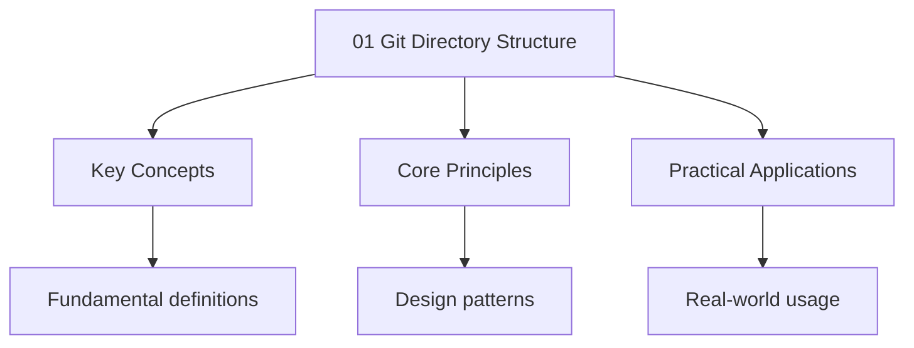

---

title: "Git Directory Structure | Tools"
description: "The directory is the heart of a Git repository. It contains all metadata, object data, configuration, and hooks. Understanding its structure is essential"
date: 2025-06-03T12:00:00.000Z
tags:
  - git
  - internals
categories:
  - CS

---

<!-- Breadcrumb Schema for SEO -->
<script type="application/ld+json">
{
  "@context": "https://schema.org",
  "@type": "BreadcrumbList",
  "itemListElement": [{"name": "Home", "url": "https://wyattau.com"}, {"name": "tools", "url": "https://tools.wyattau.com"}, {"name": "Git", "url": "https://tools.wyattau.com/git"}, {"name": "06 Internals", "url": "https://tools.wyattau.com/git/06-internals"}, {"name": "01 Git Directory Structure", "url": "https://tools.wyattau.com/git/06-internals/01-git-directory-structure"}]
}
</script>




## The `.git` Directory

The `.git` directory is the heart of a Git repository. It contains all metadata, object data,
configuration, and hooks. Understanding its structure is essential for debugging, scripting, and
recovering from corruption.

```
.git/
├── HEAD                          # Current branch reference (symref)
├── config                        # Repository-local configuration
├── description                   # Description for GitWeb/GitLab
├── index                         # Binary staging area (the "index")
├── hooks/                        # Hook scripts
│   ├── pre-commit.sample
│   ├── pre-push.sample
│   └── ...
├── info/
│   ├── exclude                   # Local .gitignore (not shared)
│   └── refs/                     # Dangling ref info
├── logs/                         # Reflog entries
│   ├── HEAD                      # HEAD reflog
│   └── refs/
│       └── heads/
│           └── main              # Branch-specific reflog
├── objects/                      # Object database
│   ├── pack/                     # Packed objects
│   │   ├── pack-<hash>.pack
│   │   └── pack-<hash>.idx
│   ├── info/
│   │   └── packs                 # List of valid packfiles
│   ├── ab/                       # Loose objects (first 2 chars of SHA-1)
│   │   └── cd1234...
│   └── ...
├── refs/                         # References (branches, tags, remotes)
│   ├── heads/
│   │   ├── main
│   │   └── feature-auth
│   ├── tags/
│   │   ├── v1.0
│   │   └── v2.0
│   └── remotes/
│       └── origin/
│           ├── HEAD
│           ├── main
│           └── feature-auth
└── packed-refs                   # Packed references (optional)
```

## Key Files

### HEAD

```bash
$ cat .git/HEAD
ref: refs/heads/main
```

A symbolic reference pointing to the current branch. When in detached HEAD state, it contains a raw
SHA-1 hash.

### config

Repository-local configuration, overriding global and system settings:

```ini
[core]
    repositoryformatversion = 0
    filemode = true
    bare = false
    logallrefupdates = true
    ignorecase = true
    precomposeunicode = true

[remote "origin"]
    url = https://github.com/user/repo.git
    fetch = +refs/heads/*:refs/remotes/origin/*

[branch "main"]
    remote = origin
    merge = refs/heads/main

[user]
    name = Wyatt
    email = wyatt@example.com
```

### description

Used by GitWeb and GitLab to display a human-readable description of the repository. Default
content:

```
Unnamed repository; edit this file "description' to name the repository.
```

### info/exclude

Local gitignore rules that are **not shared** with other developers (unlike `.gitignore`Which is
tracked):

```bash
## .git/info/exclude
*.swp
.DS_Store
```

## The Object Store (`.git/objects/`)

The object store is the content-addressable filesystem at the core of Git. It contains four types of
objects: blobs, trees, commits, and tags. See [Git Objects](../02-fundamentals/02-git-objects)
for the full treatment.

### Loose Objects

```
.git/objects/
├── a3/
│   └── f2b1c0d1e2f3a4b5c6d7e8f9a0b1c2d3e4f5a6
├── b7/
│   └── e9d4f5a6b7c8d9e0f1a2b3c4d5e6f7a8b9c0d1
└── ...
```

Each loose object is stored as a zlib-compressed file. The filename is the first 2 hex characters of
the SHA-1, and the file content is the remaining 38 characters' worth of compressed data.

```bash
## Decompress and view a loose object
$ python3 -c "import zlib; print(zlib.decompress(open('.git/objects/a3/f2b1c...','rb').read()).decode())"
blob 13Hello, World

# Or use git cat-file
$ git cat-file -p a3f2b1c...
Hello, World
```

### Packfiles

When the number of loose objects exceeds `gc.auto` (default: 6700), Git packs them into a single
packfile under `.git/objects/pack/`:

```
.git/objects/pack/
├── pack-7a8b9c0d1e2f3a4b5c6d7e8f9a0b1c2d3e4f5a6.pack   # Compressed objects
├── pack-7a8b9c0d1e2f3a4b5c6d7e8f9a0b1c2d3e4f5a6.idx      # Index for fast lookup
└── ...
```

The pack format stores objects more efficiently than loose objects by:

1. **Delta compression**: Storing objects as deltas against similar objects (e.g., commit N+1 as a
   delta of commit N).
2. **Single file**: All objects in one file, reducing filesystem overhead.
3. **Index file**: A binary index (.idx) enables $O(1)$ object lookup by SHA-1.

See [Packing and Garbage Collection](./02-packing-and-garbage-collection) for details.

## The Hooks Directory (`.git/hooks/`)

Git hooks are scripts that run automatically at specific points in the Git workflow. They are stored
in `.git/hooks/` and must be executable.

### Available Hooks

| Hook                 | Trigger                        | Use Case                           |
| -------------------- | ------------------------------ | ---------------------------------- |
| `pre-commit`         | Before commit is created       | Linting, formatting, running tests |
| `commit-msg`         | After message is written       | Validate commit message format     |
| `post-commit`        | After commit is created        | Notifications                      |
| `pre-push`           | Before pushing                 | Run full test suite, security scan |
| `post-receive`       | On remote after receiving push | Deploy, send notifications         |
| `pre-rebase`         | Before rebase starts           | Prevent rebasing published commits |
| `post-checkout`      | After checkout                 | Rebuild generated files            |
| `post-merge`         | After merge                    | Rebuild generated files            |
| `prepare-commit-msg` | Before message editor opens    | Template commit messages           |

### Hook Script Template

```bash
#!/bin/bash
# .git/hooks/pre-commit

echo "Running pre-commit checks..."

# Run linter
npm run lint
if [ $? -ne 0 ]; then
    echo "[FAIL] Linting failed. Commit aborted."
    exit 1
fi

# Run type checker
npx tsc --noEmit
if [ $? -ne 0 ]; then
    echo "[FAIL] Type checking failed. Commit aborted."
    exit 1
fi

echo "[PASS] All checks passed."
exit 0
```

:::note
share hooks across a team, use a tool like [husky](https://typicode.github.io/husky/) (which stores
hooks in the repository) or a symlink to a tracked scripts directory.

## The Refs Directory (`.git/refs/`)

See [References](../02-fundamentals/03-references) for the full treatment. In summary:

- `.git/refs/heads/` — branch references
- `.git/refs/tags/` — tag references
- `.git/refs/remotes/` — remote-tracking references
- `.git/packed-refs` — packed (consolidated) references

## Repository Corruption Recovery

If the `.git` directory becomes corrupted (e.g., disk failure, interrupted write):

```bash
# Check repository integrity
$ git fsck --full

# Recover lost objects from packfiles
$ git fsck --full --unreachable

# Rebuild corrupted index
$ rm .git/index
$ git reset

# Rebuild reflog
$ git reflog expire --expire=now --all
$ git gc --prune=now
```
:::