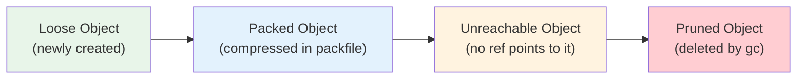

---

title: Packing and Garbage Collection
description: "Packing and Garbage Collection: comprehensive educational content notes with precise definitions, worked examples, common pitfalls, and practice problems."
date: 2025-06-03T13:00:00.000Z
tags:
  - git
  - internals
  - performance
categories:
  - CS

---

<!-- Breadcrumb Schema for SEO -->
<script type="application/ld+json">
{
  "@context": "https://schema.org",
  "@type": "BreadcrumbList",
  "itemListElement": [{"name": "Home", "url": "https://wyattau.com"}, {"name": "tools", "url": "https://tools.wyattau.com"}, {"name": "Git", "url": "https://tools.wyattau.com/git"}, {"name": "06 Internals", "url": "https://tools.wyattau.com/git/06-internals"}, {"name": "02 Packing And Garbage Collection", "url": "https://tools.wyattau.com/git/06-internals/02-packing-and-garbage-collection"}]
}
</script>

## The Object Lifecycle

Git objects go through three phases:



### 1. Loose Objects

When you run `git add` or `git commit`Git creates objects as individual zlib-compressed files under
`.git/objects/`. These are called **loose objects**.

**Performance characteristics**:

- Creation: $O(1)$ — just write a file.
- Lookup: $O(\log n)$ — filesystem directory lookup (first 2 hex chars) + file read.
- Storage: Each object is compressed independently. No delta compression between objects.
- Overhead: Each file consumes a filesystem inode and a disk block (minimum 4 KB, even for small
  objects).

For small repositories (few hundred objects), loose objects are fine. For large repositories
(millions of objects), the overhead becomes significant.

### 2. Packed Objects

When the number of loose objects exceeds `gc.auto` (default: 6700), Git automatically packs them
into a **packfile**. You can also trigger packing manually:

```bash
## Pack all loose objects
$ git gc

## Pack aggressively (slower but better compression)
$ git gc --aggressive
```

#### Packfile Format

A packfile (`.git/objects/pack/pack-<hash>.pack`) contains:

| Section | Description                                                 |
| ------- | ----------------------------------------------------------- |
| Header  | Magic bytes (`PACK`), version (2), number of objects        |
| Objects | Compressed objects (delta-compressed against other objects) |
| Trailer | SHA-1 checksum of all preceding content                     |

#### Delta Compression

Packfiles use **delta compression** to store similar objects efficiently. Instead of storing each
object in full, Git stores one base object and then stores subsequent objects as deltas (differences
from the base):

```
Base object: commit A (full content, 200 bytes)
Delta 1: commit B → "change author email" (20 bytes)
Delta 2: commit C → "change commit message" (15 bytes)
```

For the Linux kernel repository, delta compression reduces the packfile size by approximately
$10\times$ compared to loose objects.

#### Delta Chain Depth

Delta objects can themselves be delta-compressed against other delta objects, forming a **delta
chain**:

```
commit A (base)
  └── commit B (delta of A)
        └── commit C (delta of B)
              └── commit D (delta of C)
```

Deep delta chains (depth > 50) degrade performance because Git must decompress the entire chain to
access the final object. `git gc` limits delta depth to `pack.depth` (default: 50).

#### The Index File

Each packfile has a corresponding `.idx` (index) file that enables $O(1)$ lookup of objects by SHA-1
hash. The index is a sorted binary table:

| Offset | SHA-1      | CRC32     |
| ------ | ---------- | --------- |
| 0      | a3f2b1c... | 0x8a7f... |
| 234    | b7e9d4f... | 0x3c2d... |
| 567    | c1d2e3f... | 0x9e1b... |

### 3. Unreachable and Pruned Objects

An object is **unreachable** if no reference (branch, tag, HEAD, reflog, stash) points to it —
directly or transitively (through a tree or commit chain).

```bash
# Find unreachable objects
$ git fsck --unreachable

# Prune unreachable objects older than 2 weeks (default)
$ git gc

# Prune ALL unreachable objects immediately
$ git gc --prune=now
```
