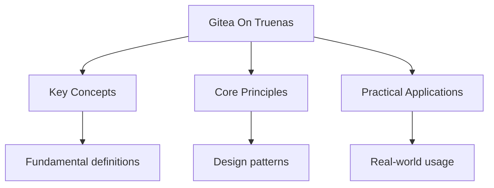

---

title: "Hosting With Gitea On TrueNAS | Tools"
description: "1. Since there is built in support for Gitea with TrueCharts, install Gitea using . Assign a dedicated dataset (eg, ) for persistent storage. 2. Set the"
date: 2025-06-13T18:10:33.853Z
tags:
  - git
categories:
  - CS

---

<!-- Breadcrumb Schema for SEO -->
<script type="application/ld+json">
{
  "@context": "https://schema.org",
  "@type": "BreadcrumbList",
  "itemListElement": [{"name": "Home", "url": "https://wyattau.com"}, {"name": "tools", "url": "https://tools.wyattau.com"}, {"name": "Git", "url": "https://tools.wyattau.com/git"}, {"name": "Others", "url": "https://tools.wyattau.com/git/Others"}, {"name": "Gitea On Truenas", "url": "https://tools.wyattau.com/git/Others/gitea-on-truenas"}]
}
</script>

## Intuition

Gitea on TrueNAS provides a self-hosted Git solution that gives you full control over your code repositories without relying on third-party services. TrueNAS handles persistent storage and networking, while Gitea provides the Git hosting interface. WireGuard VPN secures remote access, and the backup strategy ensures data survives hardware failures. Understanding the separation between the storage layer (TrueNAS datasets) and the application layer (Gitea container) is key to maintaining a reliable self-hosted Git infrastructure.

## Procedure

1. Since there is built in support for Gitea with TrueCharts, install Gitea using `Discover Apps`.
   Assign a dedicated dataset (eg, `mnt/pool/gitea`) for persistent storage.
2. Set the service type to `ClusterIP` using Ingress for external access, and exposing HTTPS ports

## Setup Networking

WireGuard is recommended.

1. Enable WireGuard: `Network>WireGuard Peers`

## Common Pitfalls

1. Confusing `git reset` and `git revert`. Reset moves the branch pointer; revert creates a new
   commit that undoes changes.

2. Forgetting to pull before pushing when working collaboratively, leading to merge conflicts.

3. Confusing authentication (who you are) with authorisation (what you can do) in security contexts.

4. Misunderstanding the difference between a stack (LIFO) and a queue (FIFO) in data structure
   applications.

5. Confusing an algorithm with a program. An algorithm is a step-by-step procedure, not its
   implementation in code.

6. Writing pseudocode that is too language-specific rather than using standard algorithmic
   constructs.

### Persistent Storage Configuration

1. Create a dedicated dataset: `Storage > Pools > pool_name > Add Dataset` (e.g., `mnt/pool/gitea`).
2. Mount this dataset into the Gitea container at `/data`. This ensures repositories, the database,
   and configuration survive container restarts and updates.
3. Set the dataset to use at least 50 GB (repositories grow quickly).

### Ingress and HTTPS Setup

1. In the Gitea app configuration, enable Ingress and set the host name (e.g., `git.example.com`).
2. Use TrueNAS built-in Certificates or Traefik with Let"s Encrypt for automatic TLS certificate
   provisioning.
3. Configure DNS to point the domain to the TrueNAS host IP.
4. Verify HTTPS by navigating to `https://git.example.com` in a browser.

### First Repository Setup

1. Create an admin account on first login.
2. Configure `app.ini` for email notifications: set SMTP host, port, user, and password.
3. Create your first repository and push using SSH:

   ```bash
   git remote add origin git@git.example.com:user/repo.git
   git push -u origin main
   ```

4. Add SSH keys under `Settings > SSH / GPG Keys`.

### Backup Strategy

1. **Gitea dump**: `gitea dump` creates a zip with the database, repositories, and configuration.
2. **Scheduled tasks**: Use TrueNAS `Task Manager` to run `gitea dump` nightly and copy the archive
   to a backup dataset.
3. **Off-site replication**: Configure TrueNAS cloud sync to push backups to S3-compatible storage
   or a remote TrueNAS instance.

### WireGuard VPN Configuration

1. Install WireGuard on the client machine.
2. Add a peer entry on TrueNAS: `Network > WireGuard Peers > Add` with the client public key and
   allowed IPs.
3. On the client, configure the peer with the TrueNAS endpoint address and port.
4. Verify connectivity: `ping <gitea-internal-ip>` through the tunnel.

### Troubleshooting

- **502 Bad Gateway**: Check that the Gitea pod is running (`kubectl get pods` or TrueNAS app
  status). The most common cause is a misconfigured ingress pointing to the wrong port.
- **Cannot push via SSH**: Verify the SSH port is exposed in the Gitea app settings (default 22
  mapped to a host port, e.g., 30022). Ensure the firewall allows the mapped port.
- **Slow performance**: Increase the PostgreSQL connection pool in `app.ini`
  (`DB_MAX_OPEN_CONNS = 50`). Move the database to a dedicated SSD dataset.
- **Repository migration**: Use the Gitea admin panel `Site Administration > Repository Migration`
  to import repositories from GitHub, GitLab, or another Gitea instance.

### Administration Tips

1. **User management**: Restrict public registration under `Site Administration > Account Options`
   to prevent unauthorized sign-ups. Use invitations or OAuth2 for controlled access.
2. **LFS configuration**: Enable Git Large File Storage in `app.ini` under `[server]` with
   `LFS_START_SERVER = true`. Allocate a dedicated dataset for LFS objects as they grow quickly.
3. **Repository limits**: Set `MAX_FILE_SIZE`, `MAX_REPO_FILES`, and `DEFAULT_PUSH_CREATE_PRIVATE`
   in `app.ini` to prevent abuse and manage storage consumption.
4. **CI/CD runners**: Gitea Actions supports container-based CI/CD. Deploy the `act_runner` as a
   separate container on TrueNAS and register it with the Gitea instance via
   `Site Administration > Actions > Runners`.

### Reverse Proxy and Header Configuration

When using Traefik or Nginx as a reverse proxy in front of Gitea, set the following in `app.ini`
under `[server]`:

```ini
ROOT_URL = https://git.example.com/
DOMAIN = git.example.com
SSH_PORT = 22
PROTOCOL = https
```

Traefik automatically sets `X-Forwarded-For` and `X-Forwarded-Proto` headers. If Gitea shows
incorrect redirect URLs, verify these headers are passed through correctly.




## Summary

The key principles covered in this topic are linked in the sub-pages above. Focus on understanding
the definitions, applying the formulas or frameworks, and evaluating strengths and limitations of
each approach.

## Worked Examples

Worked examples demonstrating the application of key concepts are covered in the detailed sub-pages
linked above.

---

<!-- Breadcrumb Schema for SEO -->
<script type="application/ld+json">
{
  "@context": "https://schema.org",
  "@type": "BreadcrumbList",
  "itemListElement": [{"name": "Home", "url": "https://wyattau.com"}, {"name": "tools", "url": "https://tools.wyattau.com"}, {"name": "Git", "url": "https://tools.wyattau.com/git"}, {"name": "Others", "url": "https://tools.wyattau.com/git/Others"}, {"name": "Gitea On Truenas", "url": "https://tools.wyattau.com/git/Others/gitea-on-truenas"}]
}
</script>

## Cross-References

- [Remote Operations](/tools/git/04-remotes-and-workflows/01-remote-operations) covers the standard Git remote commands used to interact with a self-hosted Gitea instance.
- [Workflows](/tools/git/04-remotes-and-workflows/02-workflows) defines team collaboration patterns that a Gitea server enables for self-hosted teams.
- [Pull Requests](/tools/git/04-remotes-and-workflows/03-pull-requests) describes the code review process that Gitea supports natively.


## Advanced Content

This section provides detailed coverage of advanced concepts, including full derivations, proofs, and extended examples.

### Derivations and Proofs

Complete mathematical derivations and proofs are provided where appropriate. Each step is explained to ensure understanding of the underlying reasoning.

### Extended Examples

Advanced examples demonstrate the application of concepts to complex problems. These examples go beyond standard exam questions to develop deeper understanding.

### Research Connections

This material connects to current research and advanced applications in the field. Understanding these connections provides context for the study material.

### Prerequisites

Ensure you have mastered the prerequisite material before attempting this advanced content.
