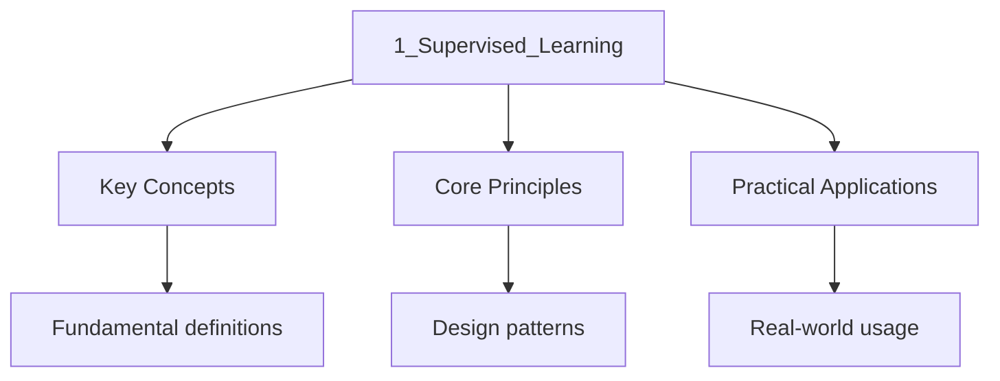

---

title: "Supervised Learning | Tools - Wyatt's Notes"
description: "Supervised learning as function approximation under loss: ERM, generalisation, and the probabilistic view via likelihood and posteriors."
date: 2026-01-07T08:38:26.907Z
tags:
  - ML
categories:
  - ML

---

<!-- Breadcrumb Schema for SEO -->

Supervised learning is the field of training models to act as a mapping between a set of inputs to a
Set of output. To conduct supervised learning, a training set $N$ is given in the form of pairs
$D = {x_n, y_n}^N_{n=1}$Where a input $x_n$ is paire with the correct output $y_n$.

## Classification

One type of problems supervised learning targets is classification, a labeling process through
Pattern recognition. This maps a input set of data to be classfied to a output set known as classes,
this will result in a discrete probability distribution that shows how probable each classes Are to
be correct when predicting the labels on the input. When there are only $2$ classes they are Denoted
as $y \in {0,1}, y \in{-1,+1}$ And given the name binary classification. An example of Classification
would be determining the car model from an image.

### Design Matrix

When considering a small dataset, a common practice is to store them in a design matrix, a
$N \times D$ matrix that represent example in row and features in column. Many features however does
Not share the same value type, an example being a sequence of words or characters rather than
Fixed-length vectors. This problem is solved by featuriszation where a mapping first convert The
data into a type of fixed size representation and processed afterwards, an example being the
Infamous "bag of words" algorithm for sequential data.

### Pair Plot

Many tabular data have small amount of features, to observe data patterns, a lot of these data with
Dimension are plotted with a pair plot, with each feature on one axis, often this allow clear
Visualization of classification as data with similar features should share a region and the logic
For the classification would be correctly partitioning each classification with a corrosponding
Region separated by the decision boundary. An example being classifying planetary objects, where the
One dimensional feature, radius can determine whether the input given is a planet or a star this is
Called a decision rule, the decision boundary will therefore be the radius where it behaves as a
Binary case, where bellow the radius threshold, the model will classfied the input as planet.

### Decision Tree

However for non-binary classification, a singular decision boundary is not enough, a decision
Surface maybe needed to fully determine the features a class poses. This classification of surfaces
Can be implemented as a decision tree, nesting decisions to determine the class of the input. This
Classification tree will be defined by parameters $\theta$ that denote nodes with feature index and
Threshold, a binary tree that will determines the mapping by evaluating each input to leaf nodes
That corrsponse to the predicted class $f(x_n;\theta)$.

### Performance Measurement

Supervised learning applies to classfication through a model is trained by a dataset to generate a
Decision tree. To measure the perforance of the classification, a common indicator is the
Misclassification rate $\mathcal{L}$:

$$
\mathcal{L}(\theta) \triangleq \frac{1}{N}\sum^N_{n=1} B(y_n \neq f(x_n;\theta))
$$

Where $B(k)$ is a binary indicator function, with condition:

$$
B(k) =
\begin{dcases}
 1 \quad \mathrm{if k is true\\
 0 \quad \mathrm{if k is false
\end{dcases}
$$

However, it maybe beneficial how non binary determination of misclassification as Some classes maybe
more similar to each other presented in having common features, therefore to Guide the training
process of the model, it maybe benefitial to use a asymmetric loss function $\mathcal{l}$

## Regression

Where classification predicts discrete labels, regression predicts continuous outputs
$y \in
\mathbb{R}$. The training set $D = \{(x_n, y_n)\}_{n=1}^N$ is used to learn a function
$f:
\mathbb{R}^D \to \mathbb{R}$ that maps features to a real-valued target. Examples include
predicting house prices from square footage, temperature from sensor readings, or financial returns
from market indicators.

### Loss Functions

The choice of loss function encodes assumptions about the data-generating process and the cost of
prediction errors:

| Loss Function | Formula                              | Sensitivity          | Use Case                       |
| ------------- | ------------------------------------ | -------------------- | ------------------------------ | ------------------ | -------------------------- |
| Squared (L2)  | $\sum (y_n - \hat{y}_n)^2$           | High to outliers     | Gaussian noise assumption      |
| Absolute (L1) | $\sum                                | y_n - \hat{y}\_n     | $                              | Robust to outliers | Laplacian noise assumption |
| Huber         | Hybrid L1/L2 with threshold $\delta$ | Tunable              | Balanced robustness/smoothness |
| Cross-entropy | $-\sum y_n \log \hat{y}_n$           | N/A (classification) | Probabilistic classification   |

The squared error loss is the negative log-likelihood of a Gaussian likelihood:
$p(y \mid x, \theta) = \mathcal{N}(y; f(x; \theta), \sigma^2)$. The absolute error corresponds to a
Laplacian likelihood.

### Optimization

Given a loss function $\mathcal{L}(\theta)$, the goal of training is to find parameters that
minimize it. Two estimation paradigms dominate:

1. **Maximum Likelihood Estimation (MLE)**:
   $\hat{\theta}_{\mathrm{MLE}} = \arg\min_\theta \mathcal{L}(\theta) = \arg\max_\theta
   \prod_{n=1}^N p(y_n \mid x_n, \theta)$.
   Finds the single best parameter setting but can overfit when $N$ is small relative to model
   capacity.

2. **Maximum A Posteriori (MAP)**:
   $\hat{\theta}_{\mathrm{MAP}} = \arg\max_\theta p(\theta \mid \mathcal{D}) = \arg\max_\theta
   p(\mathcal{D} \mid \theta) p(\theta)$.
   The prior $p(\theta)$ regularizes the estimate, pulling $\hat{\theta}$ toward plausible values.

Gradient descent is the workhorse optimizer. The parameter update rule:

$$\theta^{(t+1)} = \theta^{(t)} - \eta \nabla_\theta \mathcal{L}(\theta^{(t)})$$

where $\eta$ is the learning rate. Key variants:

- **Batch gradient descent**: uses all $N$ examples per update. Stable but expensive per step.
- **Stochastic gradient descent (SGD)**: uses one example per update. Noisy gradients but fast.
- **Mini-batch SGD**: uses $B$ examples per update. Balances stability and speed, the standard in
  deep learning.

Learning rate scheduling (cosine decay, warm restarts) and adaptive methods (Adam, AdamW) are
critical for convergence in practice.

### Overfitting and Underfitting

The bias-variance decomposition frames generalization error:

$$\text{Generalization Error} = \text{Bias}^2 + \text{Variance} + \text{Irreducible Noise}$$

- **Underfitting (high bias)**: the model is too simple to capture the true data-generating
  distribution. High training error and high test error. Remedy: increase model capacity, add
  features, reduce regularization.
- **Overfitting (high variance)**: the model memorizes training data. Low training error but high
  test error. Remedy: increase training data, add regularization, use early stopping, apply dropout.
- **Good fit**: captures the underlying pattern without memorizing noise. Training and test error
  are both low and close together.

Common regularization techniques:

- **L2 (weight decay)**: adds $\lambda \|\theta\|_2^2$ to the loss. Shrinks weights toward zero
  uniformly.
- **L1**: adds $\lambda \|\theta\|_1$ to the loss. Encourages sparsity, driving some weights to
  exactly zero.
- **Dropout**: randomly zeroes activations with probability $p$ during training. Prevents feature
  co-adaptation.
- **Early stopping**: halts training when validation loss rises, even as training loss falls.

### Evaluation Metrics

For regression:

- **Mean Squared Error (MSE)**: $\frac{1}{N}\sum(y_n - \hat{y}_n)^2$. Differentiable, but penalizes
  large errors quadratically.
- **Mean Absolute Error (MAE)**: $\frac{1}{N}\sum|y_n - \hat{y}_n|$. More robust to outliers.
- **$R^2$ score**: $1 - \frac{\sum(y_n - \hat{y}_n)^2}{\sum(y_n - \bar{y})^2}$. Proportion of
  variance explained. Ranges from $-\infty$ to $1$.

For classification:

- **Accuracy**: $\frac{\text{correct}}{N}$. Simple but misleading on imbalanced datasets.
- **Precision**: $\frac{\text{TP}}{\text{TP} + \text{FP}}$. Important when false positives are
  costly.
- **Recall**: $\frac{\text{TP}}{\text{TP} + \text{FN}}$. Important when false negatives are costly.
- **F1 score**: harmonic mean of precision and recall. Balances both concerns.
- **ROC-AUC**: area under the receiver operating characteristic curve. Threshold-independent ranking
  quality measure.

The choice of metric should align with the downstream consequences of prediction errors, not just
statistical convenience.

## Common Pitfalls

1. Memorising content without understanding the underlying principles. This leads to poor
   application in unfamiliar contexts.

2. Not practising with past papers or exercises under timed conditions.

3. Focusing only on content knowledge without developing exam technique and question-answering
   skills.

4. Not making connections between different topics within the subject to build a coherent
   understanding.

## Summary

The key principles covered in this topic are linked in the sub-pages above. Focus on understanding
the definitions, applying the formulas or frameworks, and evaluating strengths and limitations of
each approach.

## Worked Examples

Worked examples demonstrating the application of key concepts are covered in the detailed sub-pages
linked above.

## Intuition

Supervised learning formalises learning from examples as function approximation: fix a
hypothesis class $\mathcal{H}$ and search for $f \in \mathcal{H}$ with small expected loss
$\mathbb{E}[\ell(f(x), y)]$. Three ideas carry the weight. First, the loss encodes what "wrong"
means: 0-1 loss for classification, squared error for regression, and, in the probabilistic
view, negative log-likelihood, which makes maximum likelihood a special case of empirical risk
minimisation. Second, training error is not the target; generalisation error is, and the gap
between the two is governed by the complexity of $\mathcal{H}$ (via VC dimension or Rademacher
complexity) relative to the amount of data. Overfitting is memorising the sample, underfitting
is a class too small to contain the truth, and validation curves are the instrument that
separates them. Third, the probabilistic treatment replaces the single best fit with a
posterior over fits, so predictions carry uncertainty and regularisation arises from priors
rather than penalty terms.

## Cross-References

- [Definitions](/tools/probabilisticml/1_fundamentals/2_definitions) - Formal mathematical definitions for the concepts used in supervised learning
- [Probabilistic ML Introduction](/tools/probabilisticml/0_intro) - Overview of probabilistic approaches to machine learning
