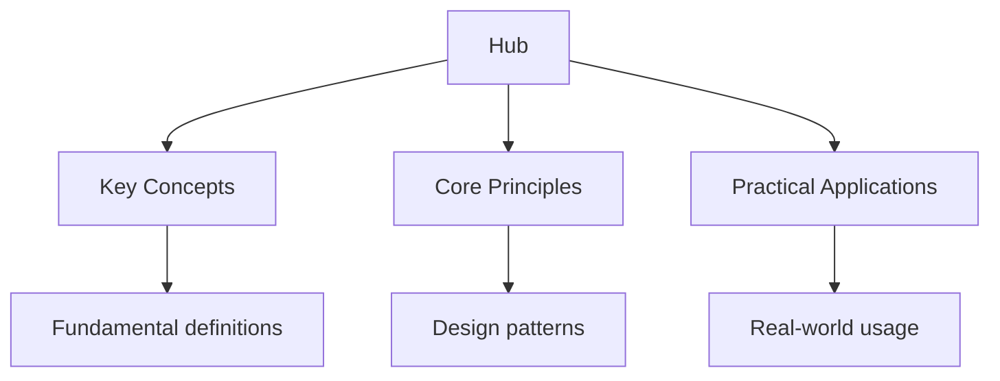

<script type="application/ld+json">
{
  "@context": "https://schema.org",
  "@type": "BreadcrumbList",
  "itemListElement": [
    {"name": "Home", "url": "https://truenas.wyattau.com"},
    {"name": "Hub", "url": "https://truenas.wyattau.com/hub"}
  ]
}
</script>

<script type="application/ld+json">
{
  "@context": "https://schema.org",
  "@type": "Course",
  "name": "Complete TrueNAS Administration Guide",
  "description": "Comprehensive TrueNAS administration guide covering ZFS storage management, sharing, backup, apps, monitoring, and performance tuning.",
  "provider": {
    "@type": "Organization",
    "name": "Wyatt's Notes",
    "url": "https://truenas.wyattau.com"
  },
  "url": "https://truenas.wyattau.com/hub",
  "educationalLevel": "Professional",
  "inLanguage": "en",
  "isAccessibleForFree": true
}
</script>




## Why This Guide Exists

TrueNAS is the leading open-source storage operating system, powering everything from home media servers to enterprise-grade storage arrays. Built on ZFS — the most advanced filesystem available — TrueNAS provides data integrity, snapshotting, replication, and sharing capabilities that rival commercial storage solutions costing many times more.

This hub page maps every resource on this site. Whether you are setting up your first NAS, migrating from another storage platform, or optimising an existing TrueNAS deployment, the guides below give you the knowledge to configure, maintain, and troubleshoot your system with confidence. The guides cover both TrueNAS CORE (FreeBSD-based) and TrueNAS SCALE (Linux-based), highlighting where the platforms differ.

## Table of Contents

- [TrueNAS Versions](#truenas-versions)
- [ZFS Storage](#zfs-storage)
- [Setup and Installation](#setup-and-installation)
- [Sharing and Permissions](#sharing-and-permissions)
- [Backup and Replication](#backup-and-replication)
- [Apps and Services](#apps-and-services)
- [Monitoring and Alerting](#monitoring-and-alerting)
- [Performance Tuning](#performance-tuning)
- [Security](#security)
- [Cross-Site Resources](#cross-site-resources)
- [FAQ](#faq)

---

## TrueNAS Versions

TrueNAS is available in two main variants:

### TrueNAS CORE

- Based on FreeBSD
- The original TrueNAS (formerly FreeNAS)
- Mature, stable, and widely deployed
- Uses jails and plugins for additional services
- Recommended for homelab and small business use
- Reached end of active development; receives maintenance updates

### TrueNAS SCALE

- Based on Debian Linux
- The newer, actively developed variant
- Uses Docker containers and Kubernetes (via k3s) for apps
- Supports Linux-native tools and utilities
- Recommended for new deployments
- Includes features like Kubernetes apps, Samba shares with ACLs, and improved hardware support

### Which Should You Choose?

| Factor | Choose CORE | Choose SCALE |
| -------- | ------------- | -------------- |
| Existing CORE deployment | Keep it | Migrate when ready |
| New deployment | Only if you need specific CORE features | Recommended |
| Docker/Kubernetes apps | Not supported | Native support |
| Enterprise features | Mature | Rapidly improving |
| Community plugins | Large library | Growing library |

---

## ZFS Storage

ZFS (Zettabyte File System) is the foundation of TrueNAS. Understanding ZFS is essential for effective TrueNAS administration.

### ZFS Concepts

- **Pool (zpool)** — the top-level storage container; made up of one or more virtual devices (vdevs)
- **Dataset** — a logical division within a pool; similar to a partition but more flexible
- **Zvol** — a block device exported from a pool; used for iSCSI and VM storage
- **Snapshot** — a point-in-time, read-only copy of a dataset; nearly instant to create
- **Scrub** — a data integrity check that reads all blocks and verifies checksums
- **Resilver** — the process of rebuilding a degraded vdev after replacing a failed disk
- **RAIDZ** — ZFS's RAID implementation; RAIDZ1, RAIDZ2, and RAIDZ3 provide 1, 2, or 3 disk redundancy

### Pool Layouts

```
Single Disk        — no redundancy, maximum capacity
Mirror (RAID 1)    — 2-way or 3-way mirror; best performance, 50% capacity
RAIDZ1             — single parity; tolerates 1 disk failure
RAIDZ2             — double parity; tolerates 2 disk failures
RAIDZ3             — triple parity; tolerates 3 disk failures
Stripe of Mirrors  — mirrors striped together; excellent performance and redundancy
```

### Recommended Layouts

| Use Case | Recommended Layout | Reasoning |
| ---------- | ------------------- | ----------- |
| Home media server | RAIDZ2 | Good balance of capacity and redundancy |
| Small business file server | Mirror (2-way) | Best performance; easy expansion |
| Backup target | RAIDZ2 | Data integrity is paramount |
| Virtual machine storage | Mirror or RAIDZ1 | IOPS performance matters |
| Cold archive | RAIDZ3 | Maximum redundancy for irreplaceable data |

### ZFS Datasets and Properties

Datasets are ZFS's most powerful feature for storage management. Each dataset can have independent:

- **Quotas** — limit disk usage per dataset
- **Reservations** — guarantee minimum disk space
- **Compression** — algorithm and level (lz4, zstd, gzip)
- **Deduplication** — remove duplicate blocks (memory-intensive)
- **Snapshot policy** — automatic snapshots at defined intervals
- **Replication target** — where snapshots are sent

### Key ZFS Commands

```bash
zpool status              # Check pool health
zpool list                # List pools and usage
zpool scrub <pool>        # Run a data integrity check
zpool iostat <pool> 1     # Monitor I/O in real time
zfs list                  # List datasets and usage
zfs snapshot <ds>@<name>  # Create a snapshot
zfs destroy <ds>@<name>   # Destroy a snapshot
zfs send <ds>@<snap> | zfs receive <remote>  # Replicate a snapshot
zfs get all <ds>          # Show all properties of a dataset
zfs set compression=lz4 <ds>  # Enable compression
```

---

## Setup and Installation

Setting up TrueNAS correctly from the start prevents headaches later.

### Hardware Requirements

- **CPU** — 64-bit processor; 2+ cores for basic use, 4+ for apps and VMs
- **RAM** — 8 GB minimum; 1 GB per TB of storage recommended; ECC RAM preferred
- **Boot device** — SSD (32 GB+); avoid USB boot drives for reliability
- **Storage drives** — NAS-rated drives (WD Red, Seagate IronWolf) for always-on use
- **Network** — Gigabit Ethernet minimum; 10GbE for high-performance needs
- **HBA** — Host Bus Adapter for connecting multiple drives; LSI HBAs are well-supported

### Installation Steps

1. Download the TrueNAS installer image
2. Write to USB or flash drive using Etcher or `dd`
3. Boot from the installer
4. Follow the installation prompts
5. Access the web interface via the IP shown on the console
6. Complete initial configuration through the web wizard

### Initial Configuration

After installation, configure:

- **Network** — set a static IP address
- **Time zone** — important for accurate logs and snapshots
- **Email** — for alert notifications
- **Root password** — change the default immediately
- **Updates** — check for and apply the latest updates

---

## Sharing and Permissions

TrueNAS supports multiple sharing protocols for different use cases.

### SMB (Windows File Sharing)

SMB is the most commonly used protocol for file sharing. TrueNAS provides two options:

- **Unix shares** — simple SMB shares with POSIX permissions
- **Windows ACL shares** — full Windows Access Control List support

**Configuration steps:**

1. Create a dataset for the share
2. Set permissions (owner, group, access mode)
3. Enable SMB service
4. Create a share in Sharing → SMB
5. Create user accounts for access

### NFS (Network File System)

NFS is the standard for Linux and Unix file sharing.

- Create a dataset
- Set ownership and permissions
- Enable NFS service
- Add a share in Sharing → NFS
- Mount from Linux: `mount -t nfs <truenas-ip>:/path /mount/point`

### WebDAV

WebDAV provides file access over HTTP/HTTPS, useful for remote access without VPN.

### AFP (Apple Filing Protocol)

Legacy Apple file sharing. SMB is now preferred for macOS.

### Permissions Model

TrueNAS permissions follow the POSIX model (CORE) or can use Windows ACLs (SCALE):

- **Owner** — the user who owns the file
- **Group** — the group that owns the file
- **Access mode** — read, write, execute for owner, group, and others
- **ACLs** — fine-grained permissions for specific users and groups

---

## Backup and Replication

Data protection is the primary purpose of a NAS. TrueNAS provides multiple mechanisms for backup and disaster recovery.

### Snapshots

Snapshots are point-in-time, read-only copies of datasets. They are:

- Nearly instant to create (regardless of dataset size)
- Space-efficient (only changed blocks are stored)
- Atomic (either the entire snapshot succeeds or fails)
- The foundation for replication and rollback

**Best practices:**

- Enable automatic snapshots with a retention policy
- Keep hourly snapshots for 24 hours, daily for 7 days, weekly for 4 weeks
- Verify snapshot integrity with periodic scrub operations

### Replication

Replication sends snapshots to another TrueNAS system or remote location.

**Local replication:**

```bash
# Send a snapshot to another pool on the same system
zfs send pool/dataset@snap | zfs receive backup/pool/dataset
```

**Remote replication:**

1. Set up SSH between source and destination
2. Create a replication task in Replication → Tasks
3. Configure schedule and retention
4. Monitor replication status

### Cloud Backup

TrueNAS supports cloud backup to:

- Amazon S3 and Glacier
- Backblaze B2
- Google Cloud Storage
- Microsoft Azure Blob Storage
- Any S3-compatible service

### The 3-2-1 Rule

The gold standard for data protection:

- **3** copies of your data
- **2** different storage media (e.g., NAS + external drive)
- **1** offsite copy (cloud or remote TrueNAS)

---

## Apps and Services

TrueNAS SCALE supports Docker containers and Kubernetes apps natively. TrueNAS CORE uses jails and plugins.

### TrueNAS SCALE Apps

SCALE uses Kubernetes (via k3s) to manage containerised applications.

**Popular apps:**

- **Plex Media Server** — media streaming and library management
- **Nextcloud** — self-hosted cloud storage and collaboration
- **Pi-hole** — network-wide DNS ad blocking
- **Portainer** — Docker container management UI
- **Transmission/qBittorrent** — download management
- **Jellyfin** — open-source media server
- **Emby** — media server with transcoding

**Installing apps:**

1. Go to Apps → Discover Apps
2. Browse or search for the desired app
3. Click Install
4. Configure storage, networking, and environment variables
5. Start the app

### TrueNAS CORE Plugins

CORE uses FreeBSD jails to isolate services.

**Installing plugins:**

1. Go to Plugins → Available
2. Select a plugin
3. Install into a new jail
4. Configure networking and storage

---

## Monitoring and Alerting

Monitoring your TrueNAS system ensures you catch problems before they cause data loss.

### Built-in Monitoring

TrueNAS provides dashboards for:

- **System** — CPU, memory, disk usage, and uptime
- **Network** — interface traffic, connections, and latency
- **Storage** — pool usage, I/O, and disk health
- **Services** — status of SMB, NFS, and other services

### SMART Monitoring

S.M.A.R.T. (Self-Monitoring, Analysis and Reporting Technology) provides early warning of disk failures.

**Enable SMART:**

1. Go to Services → S.M.A.R.T.
2. Enable the service
3. Configure email alerts for SMART errors
4. Run periodic short and long self-tests

### Alert Configuration

TrueNAS can send alerts via:

- Email
- Slack
- Discord
- PagerDuty
- Custom webhook

**Configure alerts:**

1. Go to System Settings → Alerts
2. Add alert services
3. Set alert thresholds and frequencies

### External Monitoring

For advanced monitoring, integrate with:

- **Grafana + Prometheus** — visual dashboards and metrics
- **Netdata** — real-time performance monitoring
- **Zabbix** — enterprise monitoring platform

---

## Performance Tuning

Optimising TrueNAS performance involves tuning ZFS, network, and hardware settings.

### ZFS Tuning

- **Record size** — match to workload (128 KB default; 1 MB for large files, 4 KB for databases)
- **Compression** — lz4 is fast with minimal CPU overhead; zstd offers better ratios
- **ARC size** — ZFS uses RAM for caching; more RAM = better read performance
- **Sync writes** — synchronous writes ensure data is on disk before acknowledging; use `sync=standard` or `sync=always` based on data criticality
- **Dataset record size** — tune per-dataset for specific workloads

### Network Tuning

- Enable Jumbo Frames (9000 MTU) if your network supports it
- Use Link Aggregation (LACP) for multiple network interfaces
- Configure SMB multichannel for parallel transfers
- Set appropriate send/receive buffer sizes

### Disk Tuning

- Use SSDs for boot drives and metadata
- Match drive RPM to workload (7200 RPM for performance, 5400 for capacity)
- Use NAS-rated drives designed for 24/7 operation
- Monitor disk temperature and vibration

---

## Security

Securing your TrueNAS system protects your data from unauthorised access and threats.

### Access Control

- Change the default root password immediately
- Create individual user accounts; avoid shared accounts
- Use SSH key authentication; disable password-based SSH
- Enable two-factor authentication if available
- Restrict administrative access to specific IP addresses

### Network Security

- Place TrueNAS on a dedicated VLAN if possible
- Enable the firewall and restrict open ports
- Use HTTPS for the web interface (upload an SSL certificate)
- Disable services you are not using (FTP, Telnet, etc.)

### Data Security

- Enable disk encryption (GELI on CORE, native ZFS encryption on SCALE)
- Store encryption keys securely (not on the NAS itself)
- Regularly test backup restoration
- Monitor access logs for unusual activity

### Updates and Patching

- Subscribe to TrueNAS security advisories
- Apply security updates promptly
- Test updates in a non-production environment before applying to production

---

## Cross-Site Resources

TrueNAS administration connects to several other areas of IT:

- **[Linux Administration](https://linux.wyattau.com/hub)** — Linux fundamentals relevant to TrueNAS SCALE
- **[Networking](https://networking.wyattau.com/hub)** — network configuration, VLANs, and troubleshooting
- **[Security](https://security.wyattau.com/hub)** — security hardening and vulnerability assessment
- **[Performance Tuning](https://tuning.wyattau.com/hub)** — system-level optimisation techniques
- **[Databases](https://databases.wyattau.com/hub)** — database storage and backup strategies
- **[Docker and Kubernetes](https://tools.wyattau.com/kubernetes-docker)** — containerisation for TrueNAS SCALE apps

---

## Frequently Asked Questions

### What is the difference between TrueNAS CORE and SCALE?

CORE is based on FreeBSD and uses jails for additional services. SCALE is based on Linux and uses Docker containers with Kubernetes. SCALE is the actively developed version and is recommended for new deployments. CORE remains stable and receives maintenance updates.

### How much RAM do I need for TrueNAS?

The general rule is 1 GB of RAM per 1 TB of storage for ZFS caching. For a home NAS with 10 TB of storage, 16 GB of RAM is a good starting point. ECC RAM is preferred for data integrity but not strictly required for home use.

### Should I use RAIDZ1, RAIDZ2, or RAIDZ3?

RAIDZ2 is the recommended default for most use cases. It provides good capacity efficiency and tolerates two simultaneous disk failures. RAIDZ1 is acceptable for small pools with low-risk data. RAIDZ3 is for critical data where maximum redundancy is essential. Mirrors are preferred for IOPS-sensitive workloads.

### How do I expand a TrueNAS pool?

Add another vdev to the pool. For mirrors, add another mirror pair. For RAIDZ, add another RAIDZ vdev. You cannot add individual disks to an existing RAIDZ vdev (this feature, called RAIDZ expansion, is under development). Plan your storage growth in advance.

### Can I use TrueNAS as a Time Machine backup target?

Yes. TrueNAS supports Apple Time Machine backups over SMB. Create a dataset, enable SMB sharing, and configure the share as a Time Machine target. Set a quota to prevent Time Machine from consuming all available space.

### How do I recover data if my pool is degraded?

ZFS will automatically repair data during a resilver when you replace a failed disk. If you have backups, restore from the most recent backup. If you do not have backups and the pool is still accessible, run `zpool status` to assess the damage, then replace failed disks immediately.

---

*Last updated: 24 July 2026*

*Written by Wyatt. For questions or feedback, visit [wyattau.com](https://wyattau.com).*
